# 从渐变部署运行稳定扩散 Web UI 第 2 部分:更新容器以访问新功能

> 原文：<https://blog.paperspace.com/stable-diffusion-webui-deployment-2/>

[上个月](https://blog.paperspace.com/stable-diffusion-webui-deployment/)，我们讨论了 AUTOMATIC1111 的[稳定扩散 Web UI](https://github.com/AUTOMATIC1111/stable-diffusion-webui) 和稳定扩散开源社区的其他贡献者的一些主要功能。Web UI 是一个流行的 [Gradio](https://gradio.app/) web 应用程序，它允许用户从任何主要的稳定扩散管道生成图像，包括图像到图像、文本到图像等等，并且还提供工具，其中许多工具是自上一篇文章以来添加的，包括训练文本反转嵌入和超网络、用 GFPGAN 和 CodeFormer 升级照片，以及添加扩展。

在本文中，我们将从另一个角度看一下 11 月底的 Web UI。首先，我们将逐步完成从 Paperspace 渐变部署中快速、轻松地启动 Web UI 的步骤。然后，我们将分解一些最好的扩展和新功能，并通过工作示例展示它们可以为您的工作流添加什么。

# 从渐变部署启动 Web UI

有两种方法可以从渐变中运行 Web UI:在渐变笔记本中或从渐变部署中。可以通过创建一个选择了稳定扩散运行时的笔记本来访问笔记本版本的部署。然后，我们可以将稳定的扩散 v1-5 模型公共文件挂载到我们的笔记本上，并启动 Web UI。

如果我们想要运行一个部署，我们需要一个合适的 Docker 容器，其中包含运行应用程序所需的所有先决组件和包。在下一节中，我们将浏览用于创建该容器的 Dockerfile 文件。如果我们想在将来更新容器，我们可以使用这个 Dockerfile 文件，使用 Web UI 的最新更新来创建容器的新版本。

第一部分将回顾前一篇文章中描述的设置过程，但是该过程的重大更新使得我们有必要在深入研究如何使用扩展之前重新回顾一下。

## 文档文件

让我们从我们将要托管 Web UI 的容器开始。它包含了我们运行稳定扩散所需要的许多包，尽管为了简单起见，其他包实际上是在发布时安装的。Web UI 中包含的`launch.py`脚本自动化了很多过程，但是我们仍然需要将环境设置到最小。

以下是 docker 文件中的示例代码:

```
# Paperspace base container as our baseline
FROM paperspace/gradient-base:pt112-tf29-jax0314-py39-20220803

# Upgrade pip to prevent install errors
RUN pip3 install --upgrade pip

# Clone Web UI
RUN git clone https://github.com/AUTOMATIC1111/stable-diffusion-webui

# Make it working directory 
WORKDIR /stable-diffusion-webui

## pip installs
RUN pip install transformers scipy ftfy ipywidgets msgpack rich einops omegaconf pytorch_lightning basicsr optax facexlib realesrgan kornia imwatermark invisible-watermark piexif fonts font-roboto gradio
RUN pip install git+https://github.com/crowsonkb/k-diffusion.git
RUN pip install -e git+https://github.com/CompVis/taming-transformers.git@master#egg=taming-transformers
RUN pip install git+https://github.com/openai/CLIP.git
RUN pip install diffusers

# Get model ckpt
RUN apt update
RUN apt install -y aria2
RUN aria2c --seed-time=0 --dir models/Stable-diffusion "magnet:?xt=urn:btih:2daef5b5f63a16a9af9169a529b1a773fc452637&dn=v1-5-pruned-emaonly.ckpt"

# Finish setup
RUN pip install -r requirements.txt
RUN mkdir repositories
RUN git clone https://github.com/CompVis/stable-diffusion /repositories/stable-diffusion
RUN git clone https://github.com/TencentARC/GFPGAN.git /repositories/GFPGAN

EXPOSE 7860
```

> 请注意，此容器的另一个版本具有相同的 Dockerfile，但没有安装和下载模型检查点的 aria2。这个容器小得多。我们将在后面的部分更详细地讨论如何使用它。

## 更新 Web UI 部署容器

如果我们想要创建这个容器的更新版本，我们可以简单地用这个 Docker 文件重新运行 Docker build 命令。然后，它会在新的容器中为我们提供最新版本的 Web UI。然后可以上传到 Dockerhub，在那里 Gradient 可以将它用于笔记本、工作流和部署。

要运行这个过程，我们可以在自己的终端中使用下面的代码片段。

```
git clone https://github.com/gradient-ai/stable-diffusion
cd stable-dffusion
docker build -t <your account>/stable-diffusion-webui-deployment:<tag>
docker push <your account>/stable-diffusion-webui-deployment:<tag>
```

然后，我们可以用新容器的名称替换下一节中显示的部署规范的第一行。如果我们想做任何改变，比如添加额外的模型检查点或图像嵌入，我们也可以修改 docker 文件本身。如果需要的话，这将允许更加定制化的体验。

Paperspace 将努力自己定期更新容器，所以请回到我们的项目页面查看更新。

## 加快 Web 用户界面的渐变部署

既然我们已经看到了容器中的内容，我们可以看看稳定扩散 Web UI 的渐变部署的步骤。到本节结束时，用户应该能够根据需要使用自己的定制模型和嵌入来运行自己的 Web UI 容器。

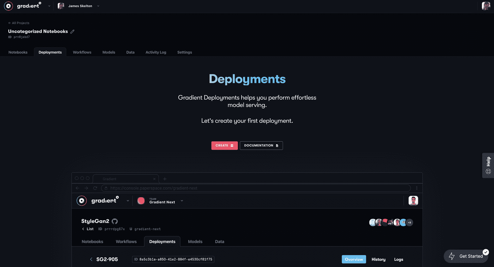

The Deployments tab

首先，确保您已经注册了一个 Paperspace 帐户，并在文件中记录了一张信用卡。与该流程的[笔记本](https://console.paperspace.com/github/gradient-ai/stable-diffusion?machine=A4000)版本不同，该部署没有免费的 GPU 选项。如果您打算通过这种方法使用 Web UI，请记住这一点。继续登录到您的帐户，并前往任何项目的部署选项卡。

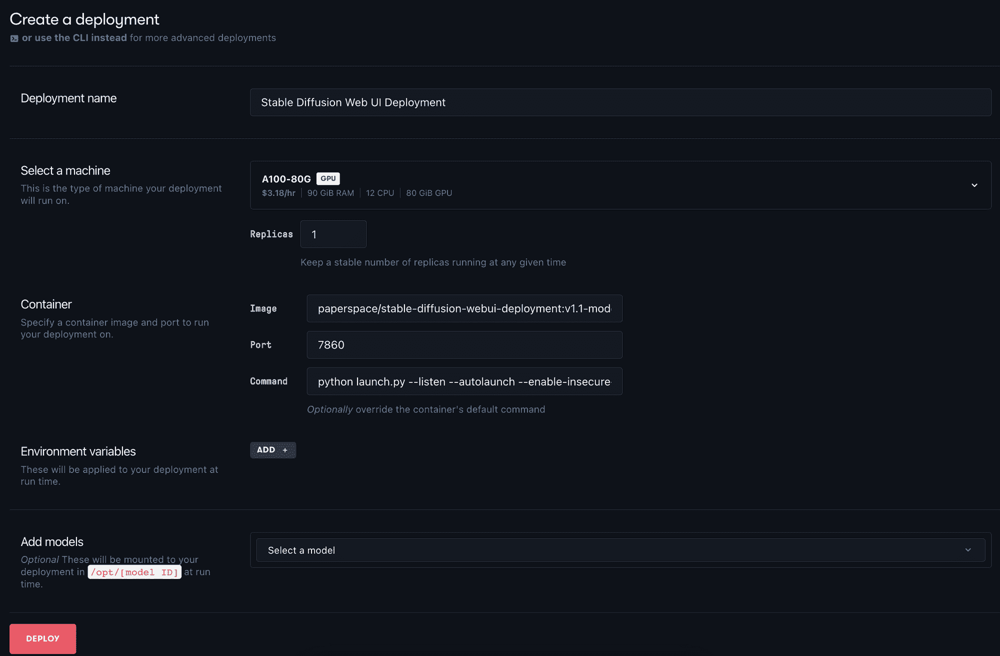

Sample set up for the Deployment in the Console

接下来，点击“创建”按钮打开创建页面。这是我们可以为部署填写信息规范的地方。适当地命名部署。我们选择了‘稳定扩散 Web UI 部署’。

然后，我们可以为我们的机器选择一个 GPU 选项。我们的建议是 A4000 或 A5000，因为它们的性价比非常高。[有关选择 GPU 的更多信息，请参见我们对 Paperspace GPU 定价的评论。](https://blog.paperspace.com/best-gpu-paperspace-2022/)

在这一部分，我们可以开始为我们的部署做更多的定制选择。这个容器现在有两个版本:一个预先下载了预先训练好的 v1-5 模型，另一个假设模型作为模型工件上传到 Paperspace。在下一节中，我们将看看如何使用模型工件来运行带有我们自己上传的模型文件的 Web UI，使我们能够访问类似于 [Dreambooth](https://blog.paperspace.com/dreambooth-stable-diffusion-tutorial-1/) 模型或者[文本反转嵌入](https://blog.paperspace.com/dreambooth-stable-diffusion-tutorial-part-2-textual-inversion/)的东西。现在，我们将使用`paperspace/stable-diffusion-webui-deployment:v1.1-model-included`。这个容器带有已经下载的[v1-5-pruned-email only . ckpt](https://huggingface.co/runwayml/stable-diffusion-v1-5/resolve/main/v1-5-pruned-emaonly.ckpt)。

最后，我们将我们的端口设置为暴露的“7860”，并在启动时输入命令来启动 Web UI:

`python launch.py --listen --autolaunch --enable-insecure-extension-access --port 7860`

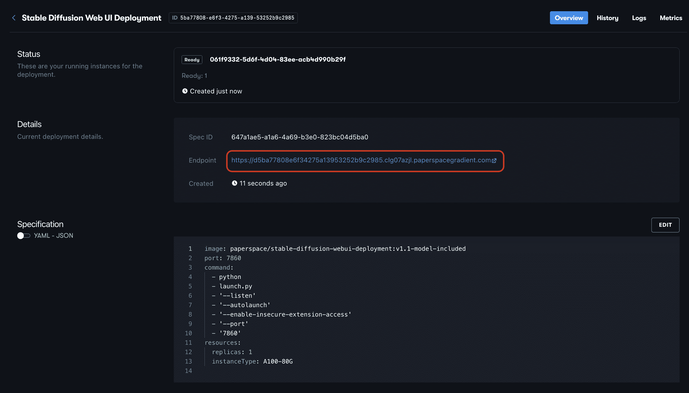

Click the Endpoint URI to open the Web UI in your browser

这是完整的规范:

```
image: paperspace/stable-diffusion-webui-deployment:v1.1-model-included
port: 7860
command:
  - python
  - launch.py
  - '--autolaunch'
  - '--listen'
  - '--enable-insecure-extension-access'
  - '--port'
  - '7860'
resources:
  replicas: 1
  instanceType: A4000
```

然后我们可以点击 Deploy 来启动容器和应用程序。这大约需要 2 分钟的启动时间，可以通过单击“部署详细信息”页面中的 API 端点链接来访问。

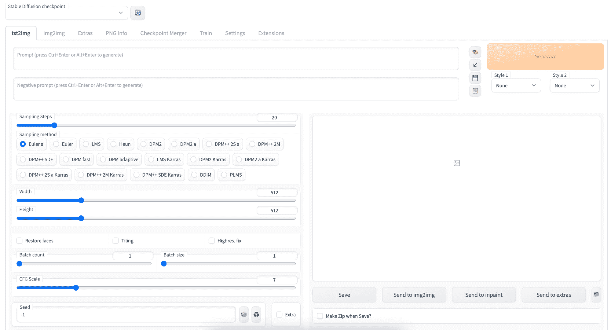

如果一切启动成功，当你进入链接时，会看到稳定扩散 Web UI 的 txt2img“主页”,现在可以开始合成图像了！

### 备选方案:使用渐变 CLI 启动 Web UI 部署

或者，我们可以使用渐变包从本地终端启动 Web UI。您可以安装软件包并使用下面的代码片段登录。您只需要在 API keys 选项卡的 team settings 页面中创建一个 API key，并在代码片段中提示的地方填充它。

```
pip install gradient
gradient apiKey <your API key here>
```

接下来，打开您的终端并导航到您可以工作的目录。然后，用`touch yaml.spec`创建一个新的 YAML 规格文件。然后在规范中填入以下内容:

```
image: paperspace/stable-diffusion-webui-deployment:v1.1-model-included
port: 7860
command:
  - python
  - launch.py
  - '--autolaunch'
  - '--listen'
  - '--enable-insecure-extension-access'
  - '--port'
  - '7860'
resources:
  replicas: 1
  instanceType: A4000
```

最后，我们可以使用以下命令创建部署:

`gradient deployments create --name [Deployment name] --projectId [your Project ID] --spec [path to your deployment spec file i.e. spec.yaml]`

然后，当您使用完部署时，您可以通过返回到您的规范文件并将其更改为 0 个副本(规范的倒数第二行)来删除它。这将停止部署运行，但不会删除它。然后使用以下终端命令更新您的部署:

`gradient deployments update --id <your deployment id> --spec <path to updated spec>`

## 使用上传的模型工件启动 Web UI

容器`paperspace/stable-diffusion-webui-deployment:v1.1-model-included`有 11.24 GB 大。这在很大程度上是由于模型检查点，它仅占用大约 5 GB 的内存。

为了改善容器大小的问题，我们还创建了一个没有下载模型的版本:`paperspace/stable-diffusion-webui-deployment:v1.1`。这个打火机容器被设计成连接到上传到 Gradient 的模型工件。

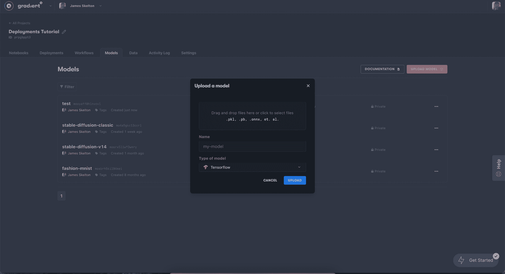

Sample model upload page

为此，我们需要首先上传一个模型检查点到我们正在工作的项目中。在渐变控制台中，导航到“模型”选项卡，然后单击“上传模型”。然后从您的本地机器上选择您的模型检查点(尽管 v2 目前不支持 Web UI ),并上传它。


Sample model details page

现在，可以通过梯度部署或工作流使用顶部列出的 ID 值来访问上传的模型。我们只需要适当地修改我们的 YAML 规范来连接它们。从上图中我们可以看到，示例文件`v1-5-pruned-emaonly.ckpt`与 id `mo4a5gkc13ccrl`相关联，可以通过模型工件的名称在顶部找到。

当我们将部署连接到这个工件时，它将自动使用这个 ID 作为子目录名，因此新文件被装载到`opt/<your model id>/`目录中。因此，当部署处于活动状态时，我们需要启动带有`--ckpt`标志的 Web UI 来获取这些名称。

`opt/`可以在任何梯度部署的根目录中找到，所以我们可以使用这个新信息来推断检查点文件的位置:`../opt/mo4a5gkc13ccrl/v1-5-pruned-emaonly.ckpt`。

除了 CMD 之外，我们还需要设置环境变量，并声明要连接的容器的文件 id 和路径。我们可以使用下面的示例 YAML 规范，通过填充缺少的值来启动带有任何上传的扩散模型的 Web UI。

```
image: paperspace/stable-diffusion-webui-deployment:v1.1
port: 7860
command:
  - python
  - launch.py
  - '--share'
  - '--autolaunch'
  - '--listen'
  - '--enable-insecure-extension-access'
  - '--port'
  - '7860'
  - '--ckpt'
  - ../opt/< model id >/<checkpoint file name>
env:
  - name: MODEL_NAME
    value: <name you gave to the model artifact in console>
  - name: MODEL_FILE
    value: <file name for model i.e. v1-5-pruned-emaonly.ckpt>
  - name: MODEL_DIR
    value: /opt/< model id >
models:
  - id: <model id>
    path: /opt/<model id>
resources:
  replicas: 1
  instanceType: A4000 # <-- we recommend the A4000 or A5000
```

当输入到渐变部署创建页面时，我们将得到如下所示的内容:

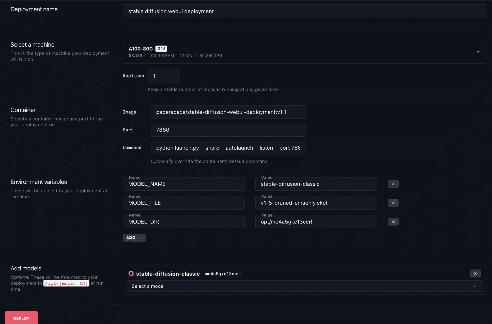

我们必须正确地填充环境变量，这样才能工作，但是如果我们成功了，我们将会使用我们自己的模型文件部署一个 5 GB 的模型简化版本！

# Web Ui 部署中的新特性

自从我们上次更新 Web UI 部署以来，在升级应用程序的各种功能方面已经取得了重大进展。由于强大的 Gradio 框架，它被证明是开源社区为稳定传播而开发的累积努力的一个非常有能力的吸收器。在本节中，我们将详细了解这些新特性。

## 扩展ˌ扩张

如果在启动时应用了正确的命令行标志，Web UI 很早就具备了接收用户脚本的能力。这些用户脚本允许用户以重要的方式修改应用程序和扩展功能。为了简化这些脚本的使用并适应低代码用户,“扩展”标签被添加到 Web UI 中。这些扩展打包了来自社区的用户脚本，然后可以添加到 Web UI 上。这些工具从强大的插件和工具到对用户界面的有用编辑，再到风格灵感工具。这些扩展的一些示例包括但不限于:

#### [梦想小屋](https://github.com/d8ahazard/sd_dreambooth_extension)

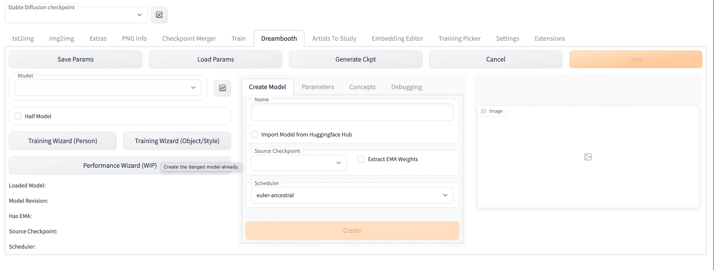

Dreambooth tab

这个扩展允许用户通过输入大量图像来训练一个新的、微调的模型，以便模型进行自我调整。这是创建稳定扩散模型的定制版本的最流行的方法之一，并且该扩展使得它在 Web UI 中使用简单。

如果您尝试这样做，请务必将您的结果与使用[渐变 Dreambooth 笔记本的结果进行比较！](https://blog.paperspace.com/dreambooth-stable-diffusion-tutorial-1/)

#### [图像浏览器](https://github.com/yfszzx/stable-diffusion-webui-images-browser)

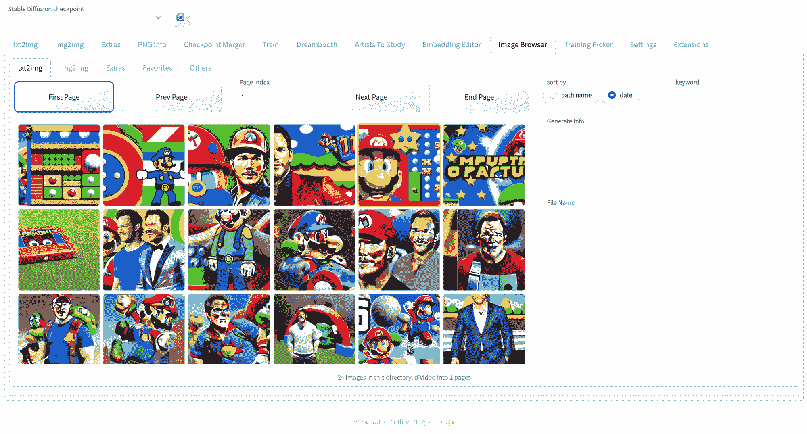

Image Browser tab

Image Browser 插件可能是最有用的实用程序扩展，它允许用户在 Web UI 中检查整个会话中生成的图像。这对部署用户特别有用，因为它提供了一种简单的方法来下载在会话早期的任何时间生成的图像，并比较不同生成规格的照片。

#### [嵌入编辑](https://github.com/CodeExplode/stable-diffusion-webui-embedding-editor.git)

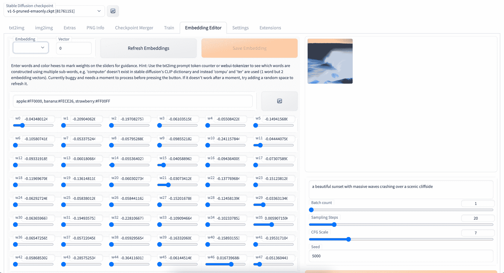

文本反转是另一种用于微调稳定扩散的流行方法，尽管与 Dreambooth 不同，它专注于为训练图像的特征创建最佳的单词模拟表示。通过嵌入编辑器，用户可以修改和编辑现有的嵌入。目前这还只是初步的，但是细心的用户可以使用它来调整他们的文本反转嵌入，效果很好。

请务必将您的结果与[梯度文本反演笔记本中的结果进行比较！](https://blog.paperspace.com/dreambooth-stable-diffusion-tutorial-part-2-textual-inversion/)

#### [美学渐变](https://github.com/AUTOMATIC1111/stable-diffusion-webui-aesthetic-gradients)

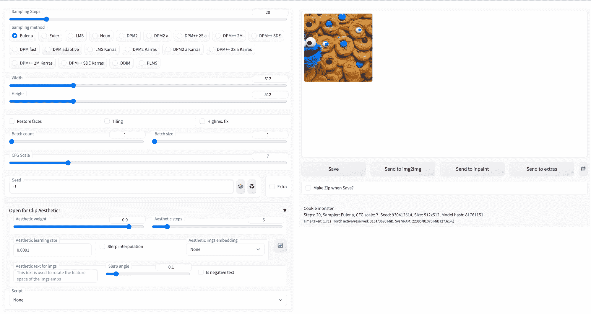

美学梯度是一种被设计成通过引导生成过程朝向由用户从一组图像定义的定制美学来个性化裁剪条件扩散模型的方法。使用这个扩展，用户可以使用一些图像创建一个美学渐变。这种新的样式可以应用于以后生成的任何图像。

#### [研究艺术家](https://github.com/camenduru/stable-diffusion-webui-artists-to-study)

<video src="https://blog.paperspace.com/content/media/2022/12/Screen-Recording-2022-11-30-at-6.07.07-PM.mp4" poster="https://img.spacergif.org/v1/1332x720/0a/spacer.png" width="1332" height="720" loop="" autoplay="" muted="" playsinline="" preload="metadata" style="background: transparent url('https://blog.paperspace.com/conteimg/2022/12/media-thumbnail-ember5935.jpg') 50% 50% / cover no-repeat;">0:00/<input type="range" class="kg-video-seek-slider" max="100" value="0"><button class="kg-video-playback-rate">1×</button><input type="range" class="kg-video-volume-slider" max="100" value="100"></video>

除了上面提到的更多功能扩展，还有许多工具可以帮助用户从自己的工作中获得灵感。这方面的一个例子是 Artists to Study extension，它从大量不同的风格和美学中快速生成样本图像，以帮助用户决定使用哪种风格。

#### 本地化及更多

最有用的扩展之一是本地化扩展。这允许用户将 Web UI 的语言更改为他们的母语，并且很可能会给许多非英语用户提供运行这个 Web UI 的能力，否则他们将无法充分利用这个能力。本地化包括繁体中文、韩语、西班牙语、意大利语、日语、德语等！

这种对扩展的观察并不全面。请务必查看 [Wiki](https://github.com/AUTOMATIC1111/stable-diffusion-webui/wiki/Extensions) 和相关的 repos，了解关于每个感兴趣的扩展的详细信息。

## 检查点合并

以前，可以使用命令行合并检查点(Glid-3-XL-stable 有一个很好的脚本)，但这绝不是一个直观的过程。对于低代码用户来说，合并两个模型可能非常困难。

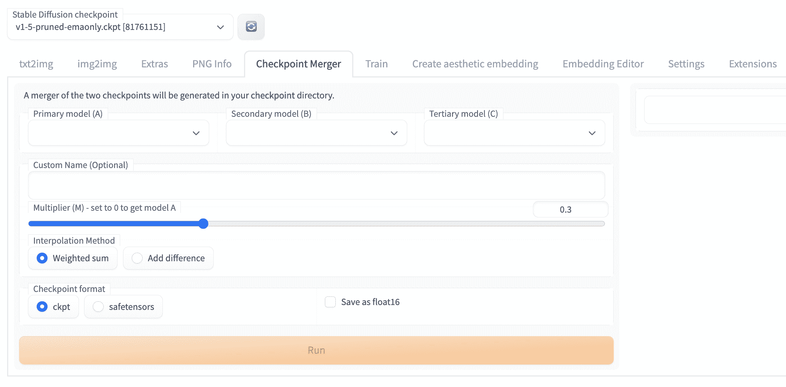

检查点合并是 Web UI 中最有用的工具之一。有了这个工具，在组合两个模型时可以更加细致。滑块允许用户确定将模型权重的大致“百分比”转移到输出模型，并允许用户根据需要迭代测试不同的模型组合。

## 火车

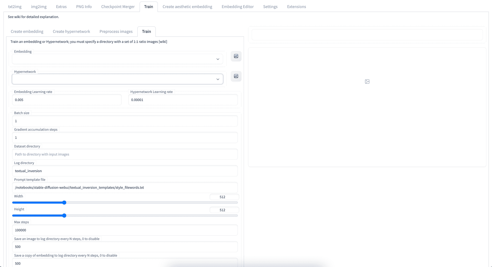

训练选项卡增加了使用文件选择在 Web UI 中训练超网络和图像嵌入的能力。这些功能仍在更新，以匹配外部工具的功能，但它们仍然有用，特别是如果我们想在相对低功耗的 GPU 上训练图像嵌入。

## 新计划程序

在 Web UI 中使用 Img2Img 或 Txt2Img 脚本生成图像时，用户可以选择使用哪种调度程序。根据 Huggingface 文档，“调度函数，在库中表示为*调度器*，接收训练模型的输出，扩散过程迭代的样本，以及返回去噪样本的时间步长。这就是为什么调度器在其他扩散模型实现中也可能被称为*采样器*【[来源](https://huggingface.co/docs/diffusers/api/schedulers)】。

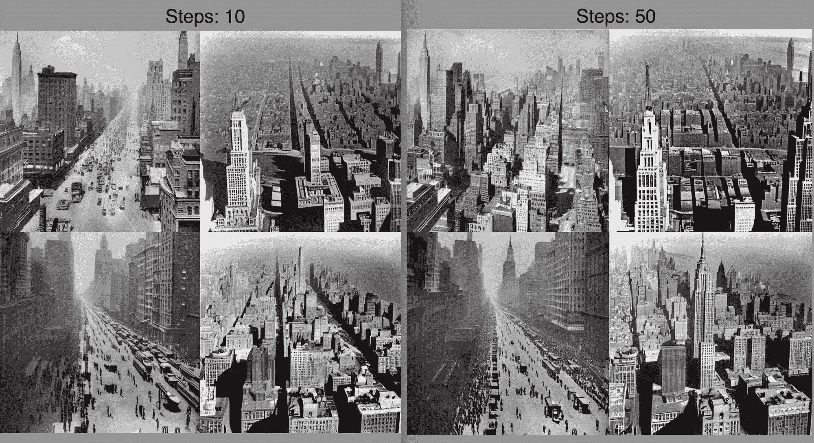

Prompt: "New york city in the 1920s" generated at 12 and 50 steps with DPM++ SDE

自从这个部署容器的最后一次迭代以来，Web UI 中添加了许多新的调度程序。特别是，我们想提醒大家注意 DPM++ 2M、DPM ++ 2M·卡拉斯和 DPM++ SDE 计划程序。这些都能够以极低的采样步长值产生高质量的输出。上面是包含在 10 个扩散步骤和 50 个扩散步骤生成的图像的样本。如我们所见，图形保真度损失相对较小，左侧网格中的图像在细节和清晰度方面与使用 5 倍步数生成的图像在美学上几乎相同。

## 结束语

在本文中，我们查看了为稳定扩散 Web UI 创建和更新容器的步骤，详细介绍了使用渐变部署 Web UI 的步骤，并讨论了自上一篇文章以来稳定扩散 Web UI 中添加到应用程序中的新特性。

将来，请回到本系列文章中查看有关稳定扩散 Web UI 容器的更新。