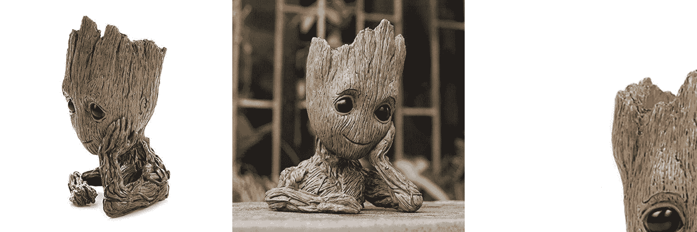
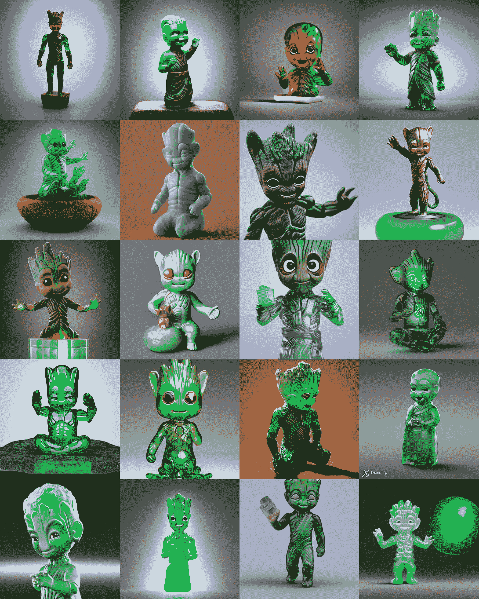
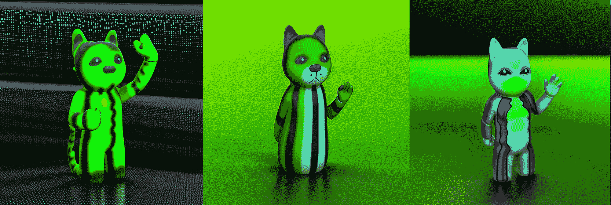

# 稳定扩散教程第 2 部分:使用文本反转嵌入获得对生成图像的实质性控制

> 原文：<https://blog.paperspace.com/dreambooth-stable-diffusion-tutorial-part-2-textual-inversion/>

[在我们的上一个教程](https://blog.paperspace.com/dreambooth-stable-diffusion-tutorial-1/)中，我们展示了如何使用 Dreambooth 稳定扩散来创建可复制的基线概念模型，以更好地合成与输入图像的主题相对应的对象或风格，有效地微调模型。其他微调稳定扩散的尝试包括移植模型以使用其他技术，如使用 [glid-3-XL-stable](https://github.com/Jack000/glid-3-xl-stable) 的导向扩散。虽然有效，但对于大多数没有强大数据中心 GPU 的人来说，这种策略的计算成本非常高。Dreambooth 的稳健策略只需要 16 GB 的 GPU RAM 来运行，与其他技术相比有了显著的下降。这为更广泛的用户提供了一个更实惠、更容易获得的切入点，让他们加入到快速扩张的稳定扩散用户社区中来。

我们可以尝试的另一个获得类似结果的流行方法是[文本反转](https://github.com/rinongal/textual_inversion)。就计算而言，它也同样昂贵，因此它是调整模型的一个很好的额外选择。然而，这有点用词不当，因为扩散模型本身并没有被调整。相反，文本倒置“通过在预先训练的文本到图像模型的嵌入空间中使用新的“单词”来描述它们，来学习生成特定的概念，如个人物品或艺术风格。这些可以用在新的句子中，就像其他任何单词一样。”[ [来源](https://textual-inversion.github.io/)实际上，这给了我们控制稳定扩散生成过程的另一端:对文本输入的更大控制。当结合我们用 Dreambooth 训练的概念时，我们可以开始真正影响我们的推理过程。

在本教程中，我们将展示如何在一组预先制作的图像上训练文本反转，这些图像来自我们用于 Dreambooth 的同一数据源。一旦我们遍历了代码，我们将演示如何在从渐变笔记本启动的稳定扩散 Web UI 中将我们的新嵌入与我们的 Dreambooth 概念相结合。

## 设置和安装

```
#@title Install the required libraries
!pip install -qq accelerate tensorboard ftfy
!pip install -qq -U transformers
!pip install -qq -U diffusers
!pip install -qq bitsandbytes
!pip install gradio

#create the directories we will use for the task
!mkdir inputs_textual_inversion

!git clone https://github.com/AUTOMATIC1111/stable-diffusion-webui
```

进入笔记本后，我们可以滚动到第一个代码单元，开始对笔记本进行必要的安装。我们还将创建一个目录来保存用于培训的输入文件。在下一个单元格中，我们导入这些包，并定义一个有用的帮助函数，用于稍后显示我们的图像。

```
#@title Import required libraries
import argparse
import itertools
import math
import os
import random

import numpy as np
import torch
import torch.nn.functional as F
import torch.utils.checkpoint
from torch.utils.data import Dataset

import PIL
from accelerate import Accelerator
from accelerate.logging import get_logger
from accelerate.utils import set_seed
from diffusers import AutoencoderKL, DDPMScheduler, PNDMScheduler, StableDiffusionPipeline, UNet2DConditionModel
from diffusers.hub_utils import init_git_repo, push_to_hub
from diffusers.optimization import get_scheduler
from diffusers.pipelines.stable_diffusion import StableDiffusionSafetyChecker
from PIL import Image
from torchvision import transforms
from tqdm.auto import tqdm
from transformers import CLIPFeatureExtractor, CLIPTextModel, CLIPTokenizer

## Instantiate helper function
def image_grid(imgs, rows, cols):
    assert len(imgs) == rows*cols

    w, h = imgs[0].size
    grid = Image.new('RGB', size=(cols*w, rows*h))
    grid_w, grid_h = grid.size

    for i, img in enumerate(imgs):
        grid.paste(img, box=(i%cols*w, i//cols*h))
    return grid
```

现在我们已经设置了工作空间，我们需要加载我们的模型。

## 稳定扩散 v1-5 模型中的加载

<video src="https://blog.paperspace.com/content/media/2022/11/stab-upload.mp4" poster="https://img.spacergif.org/v1/1984x1080/0a/spacer.png" width="1984" height="1080" loop="" autoplay="" muted="" playsinline="" preload="metadata" style="background: transparent url('https://blog.paperspace.com/conteimg/2022/11/media-thumbnail-ember727.jpg') 50% 50% / cover no-repeat;">0:00/<input type="range" class="kg-video-seek-slider" max="100" value="0"><button class="kg-video-playback-rate">1×</button><input type="range" class="kg-video-volume-slider" max="100" value="100"></video>

为了使访问稳定扩散模型变得容易并且不占用任何存储空间，我们添加了稳定扩散模型 v1-5 作为可挂载的公共数据集。

要以这种方式使用模型，只需使用笔记本 GUI 最左侧的导航器导航到“Data Sources”选项卡。然后，单击“公共”切换到梯度公共数据集，向下滚动，直到您找到列表底部附近的“稳定扩散-扩散器”。点击“挂载”使这些文件可从`datasets`目录中访问。这个目录在根文件夹中，所以可以从工作目录`notebooks/`通过路径`../datasets/stable-diffusion-diffusers/stable-diffusion-v1-5`访问它。

## 教授新概念的设置

如前所述，文本反演涉及训练稳定扩散模型，以在从同一模型生成时，通过在功能上为模型创建全新的单词标记来更好地重新创建一组图像的不同特征，以将这些特征归因于该模型。首先，我们需要获取代表我们想要体现的概念的数据。

在这次演示中，我们将使用银河护卫队电影中的塑料玩具格鲁特的图像。我们提供了样本代码，使访问这些图像变得容易。

```
#@markdown Add here the URLs to the images of the concept you are adding. 3-5 should be fine
urls = [
      "https://datasets-server.huggingface.co/assets/valhalimg/--/valhalla--images/train/7/image/image.jpg",
      "https://datasets-server.huggingface.co/assets/valhalimg/--/valhalla--images/train/5/image/image.jpg",
      "https://datasets-server.huggingface.co/assets/valhalimg/--/valhalla--images/train/7/image/image.jpg"]
```

现在我们有了 URL，使用下面的代码块将它们下载到您想要的`save_path`。我们将使用之前创建的`inputs_textual_inversion`。

```
# @title Setup and check the images you have just added
import requests
import glob
from io import BytesIO

def download_image(url):
  try:
    response = requests.get(url)
  except:
    return None
  return Image.open(BytesIO(response.content)).convert("RGB")

images = list(filter(None,[download_image(url) for url in urls]))
save_path = "./inputs_textual_inversion"
if not os.path.exists(save_path):
  os.mkdir(save_path)
[image.save(f"{save_path}/{i}.jpeg") for i, image in enumerate(images)]
image_grid(images, 1, len(images))
```

这会将文件保存到您的目录中，并显示一个网格示例，如下所示:



Sample Groot photos 

## 我们在教什么

```
#@title Settings for your newly created concept

concept_name = "grooty"

#@markdown `initializer_token` is a word that can summarise what your 
new concept is, to be used as a starting point

initializer_token = "groot" #@param {type:"string"}

#@markdown `what_to_teach`: what is it that you are teaching? `object` enables you to teach the model a new object to be used, `style` allows you to teach the model a new style one can use.

what_to_teach = "object" #@param ["object", "style"]

#@markdown `placeholder_token` is the token you are going to use to represent your new concept (so when you prompt the model, you will say "A `<my-placeholder-token>` in an amusement park"). We use angle brackets to differentiate a token from other words/tokens, to avoid collision.

placeholder_token = f'<{concept_name}>' 
```

我们现在需要定义我们的概念，以便模型能够理解。我们首先建立我们的`concept_name`和`initializer_token`变量。初始化标记是一个尽可能概括概念的对象或风格的词。然后，我们定义这个概念是否是一个对象，可能是图像选择中的一个物理对象，或者是一种风格，一个贯穿每幅图像的一致的模式或风格。

概念名也作为我们的`placeholder_token`。这用于在一组标准化句子中代替其他单词，帮助模型物理地放置具有提示的特征。我们将把我们的概念命名为“grooty”，并使用初始化标记“groot”。

如果您想使用您自己的自定义数据来代替演示值，您可以将它们上传到目录”。/inputs_textual_inversion "并根据需要更改上面的变量。

## 创建数据集

既然我们已经设置了输入，我们需要建立我们的`placeholder_token`将被使用的句子。这些例句对文本反转过程的整体能力有很大的影响，所以考虑根据需要修改它们以使用不同类型的图像。例如，下面的代码将非常适合这个演示，但是对于试图创建一个人的文本反转嵌入来说是没有帮助的。

```
#@title Setup the prompt templates for training 
imagenet_templates_small = [
    "a photo of a {}",
    "a rendering of a {}",
    "a cropped photo of the {}",
    "the photo of a {}",
    "a photo of a clean {}",
    "a photo of a dirty {}",
    "a dark photo of the {}",
    "a photo of my {}",
    "a photo of the cool {}",
    "a close-up photo of a {}",
    "a bright photo of the {}",
    "a cropped photo of a {}",
    "a photo of the {}",
    "a good photo of the {}",
    "a photo of one {}",
    "a close-up photo of the {}",
    "a rendition of the {}",
    "a photo of the clean {}",
    "a rendition of a {}",
    "a photo of a nice {}",
    "a good photo of a {}",
    "a photo of the nice {}",
    "a photo of the small {}",
    "a photo of the weird {}",
    "a photo of the large {}",
    "a photo of a cool {}",
    "a photo of a small {}",
]

imagenet_style_templates_small = [
    "a painting in the style of {}",
    "a rendering in the style of {}",
    "a cropped painting in the style of {}",
    "the painting in the style of {}",
    "a clean painting in the style of {}",
    "a dirty painting in the style of {}",
    "a dark painting in the style of {}",
    "a picture in the style of {}",
    "a cool painting in the style of {}",
    "a close-up painting in the style of {}",
    "a bright painting in the style of {}",
    "a cropped painting in the style of {}",
    "a good painting in the style of {}",
    "a close-up painting in the style of {}",
    "a rendition in the style of {}",
    "a nice painting in the style of {}",
    "a small painting in the style of {}",
    "a weird painting in the style of {}",
    "a large painting in the style of {}",
]
```

这些提示模板被分为对象和样式列表。现在，我们可以将它们与自定义数据集类一起使用，以便于将它们传递给模型。

```
#@title Setup the dataset
class TextualInversionDataset(Dataset):
    def __init__(
        self,
        data_root,
        tokenizer,
        learnable_property="object",  # [object, style]
        size=512,
        repeats=100,
        interpolation="bicubic",
        flip_p=0.5,
        set="train",
        placeholder_token="*",
        center_crop=False,
    ):

        self.data_root = data_root
        self.tokenizer = tokenizer
        self.learnable_property = learnable_property
        self.size = size
        self.placeholder_token = placeholder_token
        self.center_crop = center_crop
        self.flip_p = flip_p

        self.image_paths = [os.path.join(self.data_root, file_path) for file_path in os.listdir(self.data_root)]

        self.num_images = len(self.image_paths)
        self._length = self.num_images

        if set == "train":
            self._length = self.num_images * repeats

        self.interpolation = {
            "linear": PIL.Image.LINEAR,
            "bilinear": PIL.Image.BILINEAR,
            "bicubic": PIL.Image.BICUBIC,
            "lanczos": PIL.Image.LANCZOS,
        }[interpolation]

        self.templates = imagenet_style_templates_small if learnable_property == "style" else imagenet_templates_small
        self.flip_transform = transforms.RandomHorizontalFlip(p=self.flip_p)

    def __len__(self):
        return self._length

    def __getitem__(self, i):
        example = {}
        image = Image.open(self.image_paths[i % self.num_images])

        if not image.mode == "RGB":
            image = image.convert("RGB")

        placeholder_string = self.placeholder_token
        text = random.choice(self.templates).format(placeholder_string)

        example["input_ids"] = self.tokenizer(
            text,
            padding="max_length",
            truncation=True,
            max_length=self.tokenizer.model_max_length,
            return_tensors="pt",
        ).input_ids[0]

        # default to score-sde preprocessing
        img = np.array(image).astype(np.uint8)

        if self.center_crop:
            crop = min(img.shape[0], img.shape[1])
            h, w, = (
                img.shape[0],
                img.shape[1],
            )
            img = img[(h - crop) // 2 : (h + crop) // 2, (w - crop) // 2 : (w + crop) // 2]

        image = Image.fromarray(img)
        image = image.resize((self.size, self.size), resample=self.interpolation)

        image = self.flip_transform(image)
        image = np.array(image).astype(np.uint8)
        image = (image / 127.5 - 1.0).astype(np.float32)

        example["pixel_values"] = torch.from_numpy(image).permute(2, 0, 1)
        return example
```

该数据集对象通过根据需要对图像输入进行转换和整形以提高训练期间的整体模型锐度，从而确保图像输入以文本反转的方式最佳运行。

## 下载模型文件

```
#@title Load the Stable Diffusion model

#@markdown set `pretrained_model_name_or_path` to which Stable Diffusion checkpoint you want to use

## Use local files
pretrained_model_name_or_path = "../datasets/stable-diffusion-diffusers/stable-diffusion-v1-5" #@param {type:"string"}

## Download online files
#@markdown Please read and, if you agree, accept the LICENSE [here](https://huggingface.co/runwayml/stable-diffusion-v1-5) if you see an error
# pretrained_model_name_or_path = "runwayml/stable-diffusion-v1-5" #@param {type:"string"}
```

现在，如果我们在渐变笔记本上运行，那么我们有两个选择。之前，我们将模型安装在公共数据集目录中，可以在工作目录中的`../datasets/stable-diffusion-diffusers/stable-diffusion-v1-5`处访问它们。

如果我们想使用 Runway ML 回购的在线版本，那么我们可以讨论出较低的行。这将把模型下载到缓存中，并计入存储。您需要将您的 Huggingface 令牌粘贴到笔记本顶部的单元格中，标题为“备用访问:登录 HuggingFace 以在线访问模型”

## 设置我们的新令牌

```
#@title Load the tokenizer and add the placeholder token as a additional special token.
#@markdown Please read and, if you agree, accept the LICENSE [here](https://huggingface.co/runwayml/stable-diffusion-v1-5) if you see an error
tokenizer = CLIPTokenizer.from_pretrained(
    pretrained_model_name_or_path,
    subfolder="tokenizer")

# Add the placeholder token in tokenizer
num_added_tokens = tokenizer.add_tokens(placeholder_token)
if num_added_tokens == 0:
    raise ValueError(
        f"The tokenizer already contains the token {placeholder_token}. Please pass a different"
        " `placeholder_token` that is not already in the tokenizer."
    )
```

接下来，我们将从模型的目录中加载 CLIPTokenizer。然后，我们可以添加新令牌作为新令牌。这样，当我们训练时，新的令牌将能够与图像中的特征相关联。

```
#@title Get token ids for our placeholder and initializer token. This code block will complain if initializer string is not a single token
# Convert the initializer_token, placeholder_token to ids
token_ids = tokenizer.encode(initializer_token, add_special_tokens=False)
# Check if initializer_token is a single token or a sequence of tokens
if len(token_ids) > 1:
    raise ValueError("The initializer token must be a single token.")

initializer_token_id = token_ids[0]
placeholder_token_id = tokenizer.convert_tokens_to_ids(placeholder_token)
```

然后，我们将对`initializer_token`和`placeholder_token`进行编码，以获得它们的令牌 id。如果生成了多个令牌，它将提示我们输入单个令牌。这很可能是由于输入一个短语或句子作为占位符标记而导致的。

```
#@title Load the Stable Diffusion model
# Load models and create wrapper for stable diffusion
text_encoder = CLIPTextModel.from_pretrained(
    pretrained_model_name_or_path, subfolder="text_encoder",

)
vae = AutoencoderKL.from_pretrained(
    pretrained_model_name_or_path, subfolder="vae",

)
unet = UNet2DConditionModel.from_pretrained(
    pretrained_model_name_or_path, subfolder="unet",

)
```

最后，我们加载稳定扩散 V1-5 模型的`text_encoder`、`vae`和`unet`子组件。

```
text_encoder.resize_token_embeddings(len(tokenizer))

token_embeds = text_encoder.get_input_embeddings().weight.data
token_embeds[placeholder_token_id] = token_embeds[initializer_token_id]
```

由于我们已经在`tokenizer`中添加了`placeholder_token`，我们需要在这里重新调整令牌嵌入的大小，并在令牌嵌入中为我们的`placeholder_token`创建一个新的嵌入向量。然后，我们可以用初始化器标记的嵌入来初始化新添加的占位符标记。

```
def freeze_params(params):
    for param in params:
        param.requires_grad = False

# Freeze vae and unet
freeze_params(vae.parameters())
freeze_params(unet.parameters())
# Freeze all parameters except for the token embeddings in text encoder
params_to_freeze = itertools.chain(
    text_encoder.text_model.encoder.parameters(),
    text_encoder.text_model.final_layer_norm.parameters(),
    text_encoder.text_model.embeddings.position_embedding.parameters(),
)
freeze_params(params_to_freeze)
```

因为我们只训练新添加的嵌入向量，所以我们可以在这里冻结其余的模型参数。至此，我们已经完成了训练数据集的设置，并可以加载它了。我们将使用它来创建用于培训的数据加载器。

```
train_dataset = TextualInversionDataset(
      data_root=save_path,
      tokenizer=tokenizer,
      size=512,
      placeholder_token=placeholder_token,
      repeats=100,
      learnable_property=what_to_teach, #Option selected above between object and style
      center_crop=False,
      set="train",
)

def create_dataloader(train_batch_size=16):
    return torch.utils.data.DataLoader(train_dataset, batch_size=train_batch_size, shuffle=True)
```

## 培训设置

在开始运行训练之前，我们需要定义噪声调度器和训练超参数，并创建训练函数本身。

```
noise_scheduler = DDPMScheduler(
    beta_start=0.00085, beta_end=0.012, beta_schedule="scaled_linear", num_train_timesteps=1000, tensor_format="pt"
)
```

在这个例子中，我们将使用 DDPMScheduler，但是像 PLMS 这样的其他调度器可能会产生更好的结果。考虑选择不同的调度程序，看看训练结果有何不同。

```
hyperparameters = {
    "learning_rate": 5e-04,
    "scale_lr": True,
    "max_train_steps": 1000,
    "train_batch_size": 1,
    "gradient_accumulation_steps": 1,
    "seed": 42,
    "output_dir": f'/notebooks/concepts/{concept_name}-concept',
}
```

接下来，我们设置超参数进行训练。特别是，考虑改变`max_train_steps`和`seed`来更好地控制嵌入的结果。更高的训练步长值将导致更精确的概念表示，并且改变种子将改变扩散模型用来构建样本图像以计算损失的“随机性”。此外，如果我们在一个拥有超过 16GB VRAM 的 GPU 上，我们可以更改`train_batch_size`，并将`output_dir`更改为我们选择的任何位置。

## 培训功能

```
def training_function(text_encoder, vae, unet):
    logger = get_logger(__name__)

    train_batch_size = hyperparameters["train_batch_size"]
    gradient_accumulation_steps = hyperparameters["gradient_accumulation_steps"]
    learning_rate = hyperparameters["learning_rate"]
    max_train_steps = hyperparameters["max_train_steps"]
    output_dir = hyperparameters["output_dir"]

    accelerator = Accelerator(
        gradient_accumulation_steps=gradient_accumulation_steps,
        # distributed_type='MULTI_GPU' 
        # distribute_type: Accelerate.DistributedType.MULTI_GPU
        # fp16=True,
        # cpu=True,
    )

    train_dataloader = create_dataloader(train_batch_size)

    if hyperparameters["scale_lr"]:
        learning_rate = (
            learning_rate * gradient_accumulation_steps * train_batch_size * accelerator.num_processes
        )

    # Initialize the optimizer
    optimizer = torch.optim.AdamW(
        text_encoder.get_input_embeddings().parameters(),  # only optimize the embeddings
        lr=learning_rate,
    )

    text_encoder, optimizer, train_dataloader = accelerator.prepare(
        text_encoder, optimizer, train_dataloader
    )

    # Move vae and unet to device
    vae.to(accelerator.device)
    unet.to(accelerator.device)

    # Keep vae and unet in eval model as we don't train these
    vae.eval()
    unet.eval()

    # We need to recalculate our total training steps as the size of the training dataloader may have changed.
    num_update_steps_per_epoch = math.ceil(len(train_dataloader) / gradient_accumulation_steps)
    num_train_epochs = math.ceil(max_train_steps / num_update_steps_per_epoch)

    # Train!
    total_batch_size = train_batch_size * accelerator.num_processes * gradient_accumulation_steps

    logger.info("***** Running training *****")
    logger.info(f"  Num examples = {len(train_dataset)}")
    logger.info(f"  Instantaneous batch size per device = {train_batch_size}")
    logger.info(f"  Total train batch size (w. parallel, distributed & accumulation) = {total_batch_size}")
    logger.info(f"  Gradient Accumulation steps = {gradient_accumulation_steps}")
    logger.info(f"  Total optimization steps = {max_train_steps}")
    # Only show the progress bar once on each machine.
    progress_bar = tqdm(range(max_train_steps), disable=not accelerator.is_local_main_process)
    progress_bar.set_description("Steps")
    global_step = 0

    for epoch in range(num_train_epochs):
        text_encoder.train()
        for step, batch in enumerate(train_dataloader):
            with accelerator.accumulate(text_encoder):
                # Convert images to latent space
                latents = vae.encode(batch["pixel_values"]).latent_dist.sample().detach()
                latents = latents * 0.18215

                # Sample noise that we'll add to the latents
                noise = torch.randn(latents.shape).to(latents.device)
                bsz = latents.shape[0]
                # Sample a random timestep for each image
                timesteps = torch.randint(0, noise_scheduler.num_train_timesteps, (bsz,), device=latents.device).long()

                # Add noise to the latents according to the noise magnitude at each timestep
                # (this is the forward diffusion process)
                noisy_latents = noise_scheduler.add_noise(latents, noise, timesteps)

                # Get the text embedding for conditioning
                encoder_hidden_states = text_encoder(batch["input_ids"])[0]

                # Predict the noise residual
                noise_pred = unet(noisy_latents, timesteps, encoder_hidden_states).sample

                loss = F.mse_loss(noise_pred, noise, reduction="none").mean([1, 2, 3]).mean()
                accelerator.backward(loss)

                # Zero out the gradients for all token embeddings except the newly added
                # embeddings for the concept, as we only want to optimize the concept embeddings
                if accelerator.num_processes > 1:
                    grads = text_encoder.module.get_input_embeddings().weight.grad
                else:
                    grads = text_encoder.get_input_embeddings().weight.grad
                # Get the index for tokens that we want to zero the grads for
                index_grads_to_zero = torch.arange(len(tokenizer)) != placeholder_token_id
                grads.data[index_grads_to_zero, :] = grads.data[index_grads_to_zero, :].fill_(0)

                optimizer.step()
                optimizer.zero_grad()

            # Checks if the accelerator has performed an optimization step behind the scenes
            if accelerator.sync_gradients:
                progress_bar.update(1)
                global_step += 1

            logs = {"loss": loss.detach().item()}
            progress_bar.set_postfix(**logs)

            if global_step >= max_train_steps:
                break

        accelerator.wait_for_everyone()

    # Create the pipeline using using the trained modules and save it.
    if accelerator.is_main_process:
        pipeline = StableDiffusionPipeline(
            text_encoder=accelerator.unwrap_model(text_encoder),
            vae=vae,
            unet=unet,
            tokenizer=tokenizer,
            scheduler=PNDMScheduler(
                beta_start=0.00085, beta_end=0.012, beta_schedule="scaled_linear", skip_prk_steps=True
            ),
            safety_checker=StableDiffusionSafetyChecker.from_pretrained("CompVis/stable-diffusion-safety-checker"),
            feature_extractor=CLIPFeatureExtractor.from_pretrained("openai/clip-vit-base-patch32"),
        )
        pipeline.save_pretrained(output_dir)
        # Also save the newly trained embeddings
        learned_embeds = accelerator.unwrap_model(text_encoder).get_input_embeddings().weight[placeholder_token_id]
        learned_embeds_dict = {placeholder_token: learned_embeds.detach().cpu()}
        torch.save(learned_embeds_dict, os.path.join(output_dir, "learned_embeds.bin"))
```

下面是上述街区所发生情况的大致分类:

*   首先，我们初始化优化器、数据集和 text_encoder，并将它们加载到 accelerate 中
*   接下来，我们将 VAE 和 UNET 移到 GPU，并将它们设置为`.eval()`，因为它们不需要被训练
*   然后，我们重新计算我们的总训练步骤，因为训练数据加载器的大小可能已经改变，并且从`train_batch_size`乘以正在进行的过程(进行训练的机器)的数量和`gradient_accumulation_steps`来计算我们的`total_batch_size`
*   然后，我们根据总训练步数计算出的`num_train_epochs`进行训练
*   对于每个时期，我们在`text_encoder`上调用 train，并逐批逐步处理每个输入
*   对于每一批，图像首先被转换成潜在空间。然后，我们使用这些潜在值为扩散过程生成样本噪声
*   然后，我们为每幅图像采样一个随机时间戳，并将由每个时间戳的噪声确定的大小的样本噪声添加到 latents。这是功能性向前扩散
*   然后，我们得到文本嵌入，并使用它来预测噪声残差，以计算该步骤的损失
*   最后，我们将所有标记嵌入的梯度清零，除了新添加的概念嵌入。因为我们只想优化概念嵌入，这将防止任何混淆的影响
*   然后，我们获取我们希望将梯度清零的标记的索引，并清零优化器，然后继续下一个循环
*   训练循环完成后，我们使用 StableDiffusionPipeline 将模型文件和`learned_embeds.bin`文件保存到我们定义为`output_dir`的目录中

## 跑步训练

现在，我们已经运行并尝试理解了代码生成嵌入所采取的每个步骤，我们可以使用 accelerate 运行我们的训练函数，使用下面的代码单元格来获得图像嵌入:

```
import accelerate

accelerate.notebook_launcher(training_function, args=(text_encoder, vae, unet), num_processes=1)
```

该演示的嵌入保存到`concepts/grooty-demo/learned_embeds.bin`。

## 使用新训练的嵌入运行推理代码

我们可以使用`StableDiffusionPipeline`函数，通过新训练的图像嵌入对稳定的扩散模型进行采样。首先，我们需要实例化管道。

```
#@title Set up the pipeline 
pipe = StableDiffusionPipeline.from_pretrained(
    hyperparameters["output_dir"],
    # "downloaded_embedding",
    torch_dtype=torch.float16,
    device_map="auto",
).to("cuda")
```

然后，我们可以使用之前的`placeholder_token`值对模型进行采样，将图像嵌入的质量和特征传递给模型的输出。对于该示例，我们将使用提示“一个半透明的中国玉雕像`placeholder_token`、HDR、productshot render、Cinema4D、焦散”

```
#@title Run the Stable Diffusion pipeline
#@markdown Don't forget to use the placeholder token in your prompt

prompt = f"a translucent jade chinese figurine of {placeholder_token}, HDR, productshot render, Cinema4D, caustics" #@param {type:"string"}

num_samples = 5 #@param {type:"number"}
num_rows = 4 #@param {type:"number"}

# prevent safety checking
def dummy(images, **kwargs):
    return images, False
pipe.safety_checker = dummy

all_images = [] 
for _ in range(num_rows):
    images = pipe([prompt] * num_samples, num_inference_steps=50, guidance_scale=7.5).images
    all_images.extend(images)

grid = image_grid(all_images, num_samples, num_rows)
grid 
```

如果一切运行正常，您应该会得到一个 5x4 的图像网格，如下所示:



a 4x5 grid of samples from this demo

正如我们所看到的，模型显然已经能够理解格鲁特玩具的特征。值得注意的是，几乎每张照片中都出现了没有瞳孔的大眼睛和尖尖的头部结构。

尝试增加或减少`max_train_steps`变量，查看增加的训练如何影响嵌入的拟合度。也要警惕过度拟合，因为如果图像中的特征过于一致，模型就有可能无法概括背景特征之类的东西。例如，由每张照片中站在特定建筑物外的人组成的训练数据集，除了对象之外，还可能产生建筑物作为嵌入的特征。

## 使用我们的新嵌入稳定扩散网络用户界面

现在，我们有了新的嵌入，我们也可以使用它与我们的 Dreambooth 模型一起使用，该模型在上一节课中使用稳定扩散 Web UI 进行了培训。我们所需要做的就是将它移动到 Web UI 的 embeddings 文件夹中，我们可以将这种嵌入用于我们拥有的任何 Web UI 模型，包括 Dreambooth 检查点。

*   首先，让我们在概念文件夹中找到我们的`learned_embed.bin`文件，`concepts/grooty-concept`(如果您跟随演示的话)
*   第二，你会想给它重新命名，以反映你的概念。我选择了`grooty.bin`
*   第三，将文件移动到 Web UI 的嵌入文件夹中

然后在任何提示中使用您的占位符令牌来突出您的嵌入！使用下面的单元格将演示文本倒置嵌入移动到 Stable Diffusion Web UI 报告:

```
!mv concepts/grooty-concept/learned_embeds.bin stable-diffusion-webui/embeddings/grooty.bin
```

## 使用预先训练好的嵌入和公共数据集模型文件启动 Web UI

```
%cd stable-diffusion-webui
# launch the webui
!python launch.py --share --ckpt ../../datasets/stable-diffusion-classic/v1-5-pruned-emaonly.ckpt 
```

最后，我们可以启动 Web UI。在这里，如果您也保存了 Dreambooth 概念，我们现在可以将两种不同培训方法的效果结合起来。下面是一个例子，使用我们的玩具猫 Dreambooth 模型，使用提示“一个半透明的中国玉雕像，HDR sks，productshot render，Cinema4D，caustics”。记住`grooty`代表我们的新图像嵌入，`sks`提示猫玩具对象。



Textual Inversion on Groot toy with Dreambooth run on Cat toy

正如我们所看到的，我们得到了一个猫玩具对象的初步展示，它有着不同的特征，比如颜色，眼睛和手开始看起来更像格鲁特玩具。如果我们要增加任何一个提示的权重(使用括号“()”来完成，就像这个感叹词)，我们可以增加任何一个特性的呈现。

## 结束语

在前两篇文章中，我们研究了调整稳定扩散的两种不同方法。首先， [Dreambooth](https://blog.paperspace.com/dreambooth-stable-diffusion-tutorial-1/) 进行了适当的微调以生成一个新的检查点。今天，我们研究了纹理反转，它通过在预训练的文本到图像模型的嵌入空间中使用新的“单词”来描述个人物品或艺术风格，从而学习生成特定的概念。

本教程的读者现在应该准备好在他们自己输入的图像上训练文本反转，然后使用这些嵌入来使用`StableDiffusionPipeline`和稳定扩散 Web UI 生成图像。我们鼓励您继续尝试这些笔记本电脑，并使用 Textual Inversion 和 Dreambooth 对您的稳定扩散输出进行前所未有的控制。