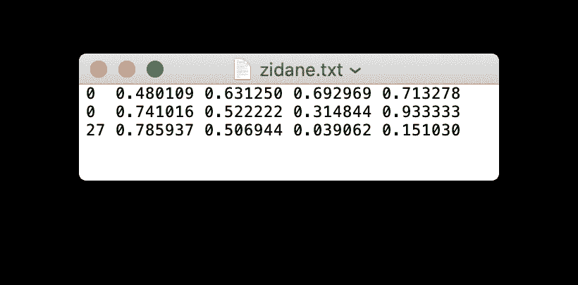

# 如何在自定义数据集上训练 YOLO v5

> 原文：<https://blog.paperspace.com/train-yolov5-custom-data/>

2022 年 10 月 20 日更新——本教程现在提供了一些不推荐使用的数据集来源代码。[请参阅我们在 YOLOv7 上更新的教程，了解关于在渐变笔记本中获取数据集以进行演示的更多说明。](https://blog.paperspace.com/train-yolov7-custom-data/)

YOLO，或*You**O**only**L**ook**O**nce，*是目前使用最广泛的基于深度学习的物体检测算法之一。在本教程中，我们将介绍如何在自定义数据集上训练它的最新变种 YOLOv5。更准确地说，我们将在路标数据集上训练 YOLO v5 检测器。在这篇文章结束时，你将拥有一个可以定位和分类路标的物体探测器。

你也可以使用本文的[渐变笔记本](https://ml-showcase.paperspace.com/projects/yolov5)在免费的 GPU 上运行这段代码。

在我们开始之前，让我承认 YOLOv5 在发布时引起了相当多的争议，争论的焦点是称它为 *v5* 是否正确。我在这篇文章的结尾已经提到了这个问题。现在，我只想说我把这个算法称为 YOLOv5，因为它是代码库的名字。

我决定选择 YOLOv5 而不是其他版本，是因为它是 YOLO 维护最活跃的 Python 端口。像 YOLO v4 这样的其他变体是用 C 编写的，对于典型的深度学习实践者来说，可能不像 Python 那样容易理解。

说完这些，我们开始吧。

这个职位的结构如下。

*   设置代码
*   下载数据
*   将注释转换为 YOLO 版本 5 的格式
    *   YOLO v5 注释格式
    *   测试注释
    *   对数据集进行分区
*   培训选项
    *   数据配置文件
    *   超参数配置文件
    *   定制网络架构
    *   训练模型
*   推理
    *   在测试数据集上计算地图
*   结论...以及一些关于命名的传奇故事

## 设置代码

我们首先克隆 YOLO 版本 5 的存储库，并设置运行 YOLO 版本 5 所需的依赖关系。你可能需要`sudo`权限来安装一些软件包。

在终端中，键入:

```
git clone https://github.com/ultralytics/yolov5
```

我建议您创建一个新的`conda`或`virtualenv`环境来运行您的 YOLO v5 实验，以免弄乱任何现有项目的依赖关系。

激活新环境后，使用 pip 安装依赖项。确保您使用的 pip 是新环境的 pip。您可以通过在终端中键入。

```
which pip
```

对我来说，它显示了这样的东西。

```
/home/ayoosh/miniconda3/envs/yolov5/bin/pip
```

它告诉我，我正在使用的 pip 是我刚刚创建的名为`yolov5`的新环境。如果您正在使用属于不同环境的 pip，您的 python 将被安装到那个不同的库，而不是您创建的库。

解决这个问题后，让我们继续安装。

```
pip install -r yolov5/requirements.txt
```

安装完依赖项后，现在让我们导入所需的模块，以结束代码的设置。

```
import torch
from IPython.display import Image  # for displaying images
import os 
import random
import shutil
from sklearn.model_selection import train_test_split
import xml.etree.ElementTree as ET
from xml.dom import minidom
from tqdm import tqdm
from PIL import Image, ImageDraw
import numpy as np
import matplotlib.pyplot as plt

random.seed(108)
```

## 下载数据

对于本教程，我们将使用来自 [MakeML](https://makeml.app/datasets/road-signs) 的路标对象检测数据集。

该数据集包含属于 4 类的路标:

1.  交通灯
2.  停止
3.  速度限制
4.  人行横道


Road Sign Dataset

数据集很小，总共只包含 877 幅图像。虽然您可能希望使用更大的数据集(如 [LISA 数据集](http://cvrr.ucsd.edu/LISA/lisa-traffic-sign-dataset.html))进行训练，以充分实现 YOLO 的功能，但我们在本教程中使用一个小数据集来促进快速原型制作。典型的训练需要不到半个小时，这将允许您快速迭代涉及不同超参数的实验。

我们现在创建一个名为`Road_Sign_Dataset`的目录来保存我们的数据集。这个目录需要与我们刚刚克隆的`yolov5`存储库文件夹在同一个文件夹中。

```
mkdir Road_Sign_Dataset
cd Road_Sign_Dataset
```

下载数据集。

```
wget -O RoadSignDetectionDataset.zip https://arcraftimages.s3-accelerate.amazonaws.com/Datasets/RoadSigns/RoadSignsPascalVOC.zip?region=us-east-2
```

解压缩数据集。

```
unzip RoadSignDetectionDataset.zip
```

删除不需要的文件。

```
rm -r __MACOSX RoadSignDetectionDataset.zip
```

## 将注释转换为 YOLO 版本 5 的格式

在这一部分中，我们将注释转换成 YOLO 版本 5 所期望的格式。对于对象检测数据集的注释，有多种格式。

我们下载的数据集的注释遵循 PASCAL VOC XML 格式，这是一种非常流行的格式。由于这是一种流行的格式，你可以找到在线转换工具。然而，我们将为它编写代码，以便让您了解如何转换不太流行的格式(您可能找不到流行的工具)。

PASCAL VOC 格式将其注释存储在 XML 文件中，其中各种属性由标签描述。让我们看一个这样的注释文件。

```
# Assuming you're in the data folder
cat annotations/road4.xml
```

输出如下所示。

```
<annotation>
    <folder>images</folder>
    <filename>road4.png</filename>
    <size>
        <width>267</width>
        <height>400</height>
        <depth>3</depth>
    </size>
    <segmented>0</segmented>
    <object>
        <name>trafficlight</name>
        <pose>Unspecified</pose>
        <truncated>0</truncated>
        <occluded>0</occluded>
        <difficult>0</difficult>
        <bndbox>
            <xmin>20</xmin>
            <ymin>109</ymin>
            <xmax>81</xmax>
            <ymax>237</ymax>
        </bndbox>
    </object>
    <object>
        <name>trafficlight</name>
        <pose>Unspecified</pose>
        <truncated>0</truncated>
        <occluded>0</occluded>
        <difficult>0</difficult>
        <bndbox>
            <xmin>116</xmin>
            <ymin>162</ymin>
            <xmax>163</xmax>
            <ymax>272</ymax>
        </bndbox>
    </object>
    <object>
        <name>trafficlight</name>
        <pose>Unspecified</pose>
        <truncated>0</truncated>
        <occluded>0</occluded>
        <difficult>0</difficult>
        <bndbox>
            <xmin>189</xmin>
            <ymin>189</ymin>
            <xmax>233</xmax>
            <ymax>295</ymax>
        </bndbox>
    </object>
</annotation>
```

上面的注释文件描述了一个名为`road4.jpg`的文件，其尺寸为`267 x 400 x 3`。它有 3 个`object`标签，代表 3 个边界框。该类由`name`标签指定，而边界框的细节由`bndbox`标签表示。边界框由其左上角(`x_min`、`y_min`)和右下角(`xmax`、`ymax`)的坐标来描述。

#### YOLO v5 注释格式

YOLO v5 希望每个图像都有一个`.txt`文件形式的注释，其中文本文件的每一行都描述了一个边界框。考虑下面的图像。


上图的注释文件如下所示:



总共有 3 个对象(2 个`person`和一个`tie`)。每条线代表这些对象中的一个。每条线的规格如下。

*   每个对象一行
*   每一行都是`class` `x_center` `y_center` `width` `height`格式。
*   框坐标必须根据图像的尺寸进行标准化(即值在 0 和 1 之间)
*   类别号是零索引的(从 0 开始)。

我们现在编写一个函数，它将采用 VOC 格式的注释，并将它们转换为一种格式，在这种格式中，关于边界框的信息存储在字典中。

```
# Function to get the data from XML Annotation
def extract_info_from_xml(xml_file):
    root = ET.parse(xml_file).getroot()

    # Initialise the info dict 
    info_dict = {}
    info_dict['bboxes'] = []

    # Parse the XML Tree
    for elem in root:
        # Get the file name 
        if elem.tag == "filename":
            info_dict['filename'] = elem.text

        # Get the image size
        elif elem.tag == "size":
            image_size = []
            for subelem in elem:
                image_size.append(int(subelem.text))

            info_dict['image_size'] = tuple(image_size)

        # Get details of the bounding box 
        elif elem.tag == "object":
            bbox = {}
            for subelem in elem:
                if subelem.tag == "name":
                    bbox["class"] = subelem.text

                elif subelem.tag == "bndbox":
                    for subsubelem in subelem:
                        bbox[subsubelem.tag] = int(subsubelem.text)            
            info_dict['bboxes'].append(bbox)

    return info_dict
```

让我们在一个注释文件上试试这个函数。

```
print(extract_info_from_xml('annotations/road4.xml'))
```

这将输出:

```
{'bboxes': [{'class': 'trafficlight', 'xmin': 20, 'ymin': 109, 'xmax': 81, 'ymax': 237}, {'class': 'trafficlight', 'xmin': 116, 'ymin': 162, 'xmax': 163, 'ymax': 272}, {'class': 'trafficlight', 'xmin': 189, 'ymin': 189, 'xmax': 233, 'ymax': 295}], 'filename': 'road4.png', 'image_size': (267, 400, 3)} 
```

我们现在编写一个函数，将包含在`info_dict`中的信息转换成 YOLO v5 样式的注释，并将它们写入一个`txt`文件。如果你的注释不同于 PASCAL VOC 注释，你可以写一个函数把它们转换成`info_dict`格式，并使用下面的函数把它们转换成 YOLO v5 风格的注释。

```
# Dictionary that maps class names to IDs
class_name_to_id_mapping = {"trafficlight": 0,
                           "stop": 1,
                           "speedlimit": 2,
                           "crosswalk": 3}

# Convert the info dict to the required yolo format and write it to disk
def convert_to_yolov5(info_dict):
    print_buffer = []

    # For each bounding box
    for b in info_dict["bboxes"]:
        try:
            class_id = class_name_to_id_mapping[b["class"]]
        except KeyError:
            print("Invalid Class. Must be one from ", class_name_to_id_mapping.keys())

        # Transform the bbox co-ordinates as per the format required by YOLO v5
        b_center_x = (b["xmin"] + b["xmax"]) / 2 
        b_center_y = (b["ymin"] + b["ymax"]) / 2
        b_width    = (b["xmax"] - b["xmin"])
        b_height   = (b["ymax"] - b["ymin"])

        # Normalise the co-ordinates by the dimensions of the image
        image_w, image_h, image_c = info_dict["image_size"]  
        b_center_x /= image_w 
        b_center_y /= image_h 
        b_width    /= image_w 
        b_height   /= image_h 

        #Write the bbox details to the file 
        print_buffer.append("{} {:.3f} {:.3f} {:.3f} {:.3f}".format(class_id, b_center_x, b_center_y, b_width, b_height))

    # Name of the file which we have to save 
    save_file_name = os.path.join("annotations", info_dict["filename"].replace("png", "txt"))

    # Save the annotation to disk
    print("\n".join(print_buffer), file= open(save_file_name, "w"))
```

现在我们将所有的`xml`注释转换成 YOLO 风格的`txt`注释。

```
# Get the annotations
annotations = [os.path.join('annotations', x) for x in os.listdir('annotations') if x[-3:] == "xml"]
annotations.sort()

# Convert and save the annotations
for ann in tqdm(annotations):
    info_dict = extract_info_from_xml(ann)
    convert_to_yolov5(info_dict)
annotations = [os.path.join('annotations', x) for x in os.listdir('annotations') if x[-3:] == "txt"]
```

#### 测试注释

只是为了检查一下，现在让我们测试一些转换后的注释。我们使用转换后的注释随机加载其中一个注释和绘图框，并直观地检查它，看看我们的代码是否按预期工作。

多次运行下一个单元格。每次都会随机抽取一个注释样本。

```
random.seed(0)

class_id_to_name_mapping = dict(zip(class_name_to_id_mapping.values(), class_name_to_id_mapping.keys()))

def plot_bounding_box(image, annotation_list):
    annotations = np.array(annotation_list)
    w, h = image.size

    plotted_image = ImageDraw.Draw(image)

    transformed_annotations = np.copy(annotations)
    transformed_annotations[:,[1,3]] = annotations[:,[1,3]] * w
    transformed_annotations[:,[2,4]] = annotations[:,[2,4]] * h 

    transformed_annotations[:,1] = transformed_annotations[:,1] - (transformed_annotations[:,3] / 2)
    transformed_annotations[:,2] = transformed_annotations[:,2] - (transformed_annotations[:,4] / 2)
    transformed_annotations[:,3] = transformed_annotations[:,1] + transformed_annotations[:,3]
    transformed_annotations[:,4] = transformed_annotations[:,2] + transformed_annotations[:,4]

    for ann in transformed_annotations:
        obj_cls, x0, y0, x1, y1 = ann
        plotted_image.rectangle(((x0,y0), (x1,y1)))

        plotted_image.text((x0, y0 - 10), class_id_to_name_mapping[(int(obj_cls))])

    plt.imshow(np.array(image))
    plt.show()

# Get any random annotation file 
annotation_file = random.choice(annotations)
with open(annotation_file, "r") as file:
    annotation_list = file.read().split("\n")[:-1]
    annotation_list = [x.split(" ") for x in annotation_list]
    annotation_list = [[float(y) for y in x ] for x in annotation_list]

#Get the corresponding image file
image_file = annotation_file.replace("annotations", "images").replace("txt", "png")
assert os.path.exists(image_file)

#Load the image
image = Image.open(image_file)

#Plot the Bounding Box
plot_bounding_box(image, annotation_list) 
```


OUTPUT

太好了，我们能够从 YOLO v5 格式中恢复正确的注释。这意味着我们已经正确地实现了转换函数。

### 对数据集进行分区

接下来，我们将数据集划分为分别包含 80%、10%和 10%数据的训练集、验证集和测试集。您可以根据自己的方便更改拆分值。

```
# Read images and annotations
images = [os.path.join('images', x) for x in os.listdir('images')]
annotations = [os.path.join('annotations', x) for x in os.listdir('annotations') if x[-3:] == "txt"]

images.sort()
annotations.sort()

# Split the dataset into train-valid-test splits 
train_images, val_images, train_annotations, val_annotations = train_test_split(images, annotations, test_size = 0.2, random_state = 1)
val_images, test_images, val_annotations, test_annotations = train_test_split(val_images, val_annotations, test_size = 0.5, random_state = 1) 
```

创建文件夹来保存拆分。

```
!mkdir images/train images/val images/test annotations/train annotations/val annotations/test
```

将文件移动到各自的文件夹中。

```
#Utility function to move images 
def move_files_to_folder(list_of_files, destination_folder):
    for f in list_of_files:
        try:
            shutil.move(f, destination_folder)
        except:
            print(f)
            assert False

# Move the splits into their folders
move_files_to_folder(train_images, 'images/train')
move_files_to_folder(val_images, 'images/val/')
move_files_to_folder(test_images, 'images/test/')
move_files_to_folder(train_annotations, 'annotations/train/')
move_files_to_folder(val_annotations, 'annotations/val/')
move_files_to_folder(test_annotations, 'annotations/test/')
```

将`annotations`文件夹重命名为`labels`，因为这是 YOLO v5 期望注释所在的位置。

```
mv annotations labels
cd ../yolov5 
```

## 培训选项

现在，我们训练网络。我们使用各种标志来设置关于训练的选项。

*   `img`:图像尺寸。图像是正方形的。在保持长宽比的同时，调整原始图像的大小。图像的长边被调整到这个数字。短边用灰色填充。


An example of letter-boxed image

*   `batch`:批量大小
*   `epochs`:训练的时期数
*   `data`:包含数据集信息(图像路径、标签)的数据 YAML 文件
*   `workers`:CPU 工作者的数量
*   `cfg`:模型架构。有四种选择:`yolo5s.yaml`、`yolov5m.yaml`、`yolov5l.yaml`、`yolov5x.yaml`。这些模型的大小和复杂性以升序增加，并且您可以选择适合您的对象检测任务的复杂性的模型。如果您想使用自定义架构，您必须在指定网络架构的`models`文件夹中定义一个`YAML`文件。
*   `weights`:您想要开始训练的预训练重量。如果你想从头开始训练，使用`--weights ' '`
*   `name`:关于培训的各种事情，比如培训日志。训练权重将存储在名为`runs/train/name`的文件夹中
*   `hyp`:描述超参数选择的 YAML 文件。关于如何定义超参数的示例，参见`data/hyp.scratch.yaml`。如果未指定，则使用文件`data/hyp.scratch.yaml`。

### 数据配置文件

数据配置`YAML`文件定义了您想要训练模型的数据集的详细信息。必须在数据配置文件中定义以下参数:

1.  `train`、`test`和`val`:训练、测试和验证图像的位置。
2.  `nc`:数据集中类的数量。
3.  `names`:数据集中类的名称。这个列表中的类的索引将被用作代码中类名的标识符。

创建一个名为`road_sign_data.yaml`的新文件，并将其放在`yolov5/data`文件夹中。然后用以下内容填充它。

```
train: ../Road_Sign_Datasimg/train/ 
val:  ../Road_Sign_Datasimg/val/
test: ../Road_Sign_Datasimg/test/

# number of classes
nc: 4

# class names
names: ["trafficlight","stop", "speedlimit","crosswalk"]
```

YOLO v5 期望在文件夹中找到图像的训练标签，该文件夹的名称可以通过将数据集图像路径中的`images`替换为`labels`来导出。例如，在上面的例子中，YOLO v5 将在`../Road_Sign_Dataset/labels/train/`中寻找列车标签。

或者你可以简单地下载文件。

```
!wget -P data/ https://gist.githubusercontent.com/ayooshkathuria/bcf7e3c929cbad445439c506dba6198d/raw/f437350c0c17c4eaa1e8657a5cb836e65d8aa08a/road_sign_data.yaml 
```

### 超参数配置文件

超参数配置文件帮助我们定义神经网络的超参数。我们将使用默认设置`data/hyp.scratch.yaml`。这是它看起来的样子。

```
# Hyperparameters for COCO training from scratch
# python train.py --batch 40 --cfg yolov5m.yaml --weights '' --data coco.yaml --img 640 --epochs 300
# See tutorials for hyperparameter evolution https://github.com/ultralytics/yolov5#tutorials

lr0: 0.01  # initial learning rate (SGD=1E-2, Adam=1E-3)
lrf: 0.2  # final OneCycleLR learning rate (lr0 * lrf)
momentum: 0.937  # SGD momentum/Adam beta1
weight_decay: 0.0005  # optimizer weight decay 5e-4
warmup_epochs: 3.0  # warmup epochs (fractions ok)
warmup_momentum: 0.8  # warmup initial momentum
warmup_bias_lr: 0.1  # warmup initial bias lr
box: 0.05  # box loss gain
cls: 0.5  # cls loss gain
cls_pw: 1.0  # cls BCELoss positive_weight
obj: 1.0  # obj loss gain (scale with pixels)
obj_pw: 1.0  # obj BCELoss positive_weight
iou_t: 0.20  # IoU training threshold
anchor_t: 4.0  # anchor-multiple threshold
# anchors: 3  # anchors per output layer (0 to ignore)
fl_gamma: 0.0  # focal loss gamma (efficientDet default gamma=1.5)
hsv_h: 0.015  # image HSV-Hue augmentation (fraction)
hsv_s: 0.7  # image HSV-Saturation augmentation (fraction)
hsv_v: 0.4  # image HSV-Value augmentation (fraction)
degrees: 0.0  # image rotation (+/- deg)
translate: 0.1  # image translation (+/- fraction)
scale: 0.5  # image scale (+/- gain)
shear: 0.0  # image shear (+/- deg)
perspective: 0.0  # image perspective (+/- fraction), range 0-0.001
flipud: 0.0  # image flip up-down (probability)
fliplr: 0.5  # image flip left-right (probability)
mosaic: 1.0  # image mosaic (probability)
mixup: 0.0  # image mixup (probability)
```

您可以编辑这个文件，保存一个新文件，并将其指定为训练脚本的一个参数。

### 定制网络架构

YOLO v5 还允许你定义自己的定制架构和锚点，如果其中一个预定义的网络不适合你的话。为此，您必须定义一个自定义权重配置文件。对于这个例子，我们使用了`yolov5s.yaml`。这是它看起来的样子。

```
# parameters
nc: 80  # number of classes
depth_multiple: 0.33  # model depth multiple
width_multiple: 0.50  # layer channel multiple

# anchors
anchors:
  - [10,13, 16,30, 33,23]  # P3/8
  - [30,61, 62,45, 59,119]  # P4/16
  - [116,90, 156,198, 373,326]  # P5/32

# YOLOv5 backbone
backbone:
  # [from, number, module, args]
  [[-1, 1, Focus, [64, 3]],  # 0-P1/2
   [-1, 1, Conv, [128, 3, 2]],  # 1-P2/4
   [-1, 3, C3, [128]],
   [-1, 1, Conv, [256, 3, 2]],  # 3-P3/8
   [-1, 9, C3, [256]],
   [-1, 1, Conv, [512, 3, 2]],  # 5-P4/16
   [-1, 9, C3, [512]],
   [-1, 1, Conv, [1024, 3, 2]],  # 7-P5/32
   [-1, 1, SPP, [1024, [5, 9, 13]]],
   [-1, 3, C3, [1024, False]],  # 9
  ]

# YOLOv5 head
head:
  [[-1, 1, Conv, [512, 1, 1]],
   [-1, 1, nn.Upsample, [None, 2, 'nearest']],
   [[-1, 6], 1, Concat, [1]],  # cat backbone P4
   [-1, 3, C3, [512, False]],  # 13

   [-1, 1, Conv, [256, 1, 1]],
   [-1, 1, nn.Upsample, [None, 2, 'nearest']],
   [[-1, 4], 1, Concat, [1]],  # cat backbone P3
   [-1, 3, C3, [256, False]],  # 17 (P3/8-small)

   [-1, 1, Conv, [256, 3, 2]],
   [[-1, 14], 1, Concat, [1]],  # cat head P4
   [-1, 3, C3, [512, False]],  # 20 (P4/16-medium)

   [-1, 1, Conv, [512, 3, 2]],
   [[-1, 10], 1, Concat, [1]],  # cat head P5
   [-1, 3, C3, [1024, False]],  # 23 (P5/32-large)

   [[17, 20, 23], 1, Detect, [nc, anchors]],  # Detect(P3, P4, P5)
  ]
```

要使用自定义网络，创建一个新文件，并在运行时使用`cfg`标志指定它。

### 训练模型

我们定义了`train`、`val`、`test`的位置、类的数量(`nc`)以及类的名称。由于数据集很小，并且每张图像没有很多对象，我们从最小的预训练模型`yolo5s`开始，以保持简单并避免过度拟合。我们保持批量`32`，图像尺寸`640`，训练 100 个历元。如果您在将模型放入内存时遇到问题:

*   使用较小的批量
*   使用较小的网络
*   使用较小的图像尺寸

当然，以上所有情况都可能影响性能。折衷是你必须做出的设计决定。根据具体情况，您可能还想使用更大的 GPU 实例。

我们用`yolo_road_det`这个名字进行训练。tensorboard 训练日志可在`runs/train/yolo_road_det`找到。如果你不能访问 tensorboard 日志，你可以设置一个`wandb`账户，这样日志就会被标绘在你的 [wandb 账户](https://wandb.ai/site)上。

最后，运行培训:

```
!python train.py --img 640 --cfg yolov5s.yaml --hyp hyp.scratch.yaml --batch 32 --epochs 100 --data road_sign_data.yaml --weights yolov5s.pt --workers 24 --name yolo_road_det
```

这可能需要 30 分钟的训练时间，具体取决于您的硬件。

## 推理

使用`detect.py`文件有很多方式来运行推理。

`source`标志定义了我们的探测器的来源，可以是:

1.  单一图像
2.  一个图像文件夹
3.  录像
4.  网络摄像头

...和各种其他格式。我们想在我们的测试图像上运行它，所以我们将`source`标志设置为`../Road_Sign_Datasimg/test/`。

*   `weights`标志定义了我们想要运行检测器的模型的路径。
*   `conf` flag 是阈值客观置信度。
*   `name`标志定义了检测的存储位置。我们将这个标志设置为`yolo_road_det`；因此，检测结果将存储在`runs/detect/yolo_road_det/`中。

决定了所有选项后，让我们对测试数据集进行推理。

```
!python detect.py --source ../Road_Sign_Datasimg/test/ --weights runs/train/yolo_road_det/weights/best.pt --conf 0.25 --name yolo_road_det
```

`best.pt`包含训练期间保存的最佳性能砝码。

我们现在可以随机绘制其中一个检测。

```
detections_dir = "runs/detect/yolo_road_det/"
detection_images = [os.path.join(detections_dir, x) for x in os.listdir(detections_dir)]

random_detection_image = Image.open(random.choice(detection_images))
plt.imshow(np.array(random_detection_image))
```


OUTPUT

除了一个文件夹的图像，还有其他来源，我们可以使用我们的探测器。执行此操作的命令语法如下所述。

```
python detect.py --source 0  # webcam
                            file.jpg  # image 
                            file.mp4  # video
                            path/  # directory
                            path/*.jpg  # glob
                            rtsp://170.93.143.139/rtplive/470011e600ef003a004ee33696235daa  # rtsp stream
                            rtmp://192.168.1.105/live/test  # rtmp stream
                            http://112.50.243.8/PLTV/88888888/224/3221225900/1.m3u8  # http stream
```

### 在测试数据集上计算地图

我们可以使用`test`文件在我们的测试集上计算 mAP。为了在我们的测试集上执行评估，我们将`task`标志设置为`test`。我们把名字设为`yolo_det`。各种曲线(F1、AP、精确曲线等)的图表可以在`runs/test/yolo_road_det`文件夹中找到。该脚本为我们计算每个类的平均精度，以及平均精度。

```
!python test.py --weights runs/train/yolo_road_det/weights/best.pt --data road_sign_data.yaml --task test --name yolo_det 
```

的输出如下所示:

```
Fusing layers... 
Model Summary: 224 layers, 7062001 parameters, 0 gradients, 16.4 GFLOPS
test: Scanning '../Road_Sign_Dataset/labels/test' for images and labels... 88 fo
test: New cache created: ../Road_Sign_Dataset/labels/test.cache
test: Scanning '../Road_Sign_Dataset/labels/test.cache' for images and labels...
               Class      Images     Targets           P           R      mAP@.5
                 all          88         126       0.961       0.932       0.944         0.8
        trafficlight          88          20       0.969        0.75       0.799       0.543
                stop          88           7           1        0.98       0.995       0.909
          speedlimit          88          76       0.989           1       0.997       0.906
           crosswalk          88          23       0.885           1       0.983       0.842
Speed: 1.4/0.7/2.0 ms inference/NMS/total per 640x640 image at batch-size 32
Results saved to runs/test/yolo_det2
```

这就是本教程的基本内容。在本教程中，我们在自定义路标数据集上训练 YOLO v5。如果你想使用超参数，或者如果你想在不同的数据集上训练，你可以从本教程的[梯度笔记本](https://ml-showcase.paperspace.com/projects/yolov5)开始。

## 结论...以及一些关于命名的传奇故事。

如前所述，我想以关于 YOLO v5 引起的命名争议的两点意见来结束我的文章。

由于担心他的研究被用于军事目的，YOLO 的最初开发者放弃了它的开发。在那之后，多组人提出了对 YOLO 的改进。

之后，YOLO v4 于 2020 年 4 月由阿列克谢·博奇科夫斯基(Alexey Bochkovskiy)等人发行。阿列克谢可能是制作《YOLO》续集的最合适人选，因为他长期以来一直是第二个最受欢迎的《YOLO 回购》的维护者，与最初的版本不同，该版本也适用于 Windows。

YOLO v4 带来了大量的改进，这有助于它大大超过 YOLO v3。但是后来，Ultralytics YOLO v3 repo(YOLO 最流行的 python 端口)的维护者 Glenn Jocher 发布了 YOLO v5，它的命名引起了计算机视觉社区许多成员的保留。

为什么？因为在传统意义上，YOLO v5 没有带来任何新颖的架构/损失/技术。YOLO v5 的研究论文还没有发布。

然而，它在人们将 YOLO 集成到现有管道的速度方面提供了巨大的改进。YOLO v5 最重要的一点是，它是用 PyTorch / Python 编写的，不像 v1-v4 的原始版本是用 c 语言编写的。仅此一点就使它更易于在深度学习领域工作的人和公司使用。

此外，它介绍了一种使用模块化配置文件、混合精度训练、快速推理、更好的数据扩充技术等定义实验的干净方法。在某种程度上，如果我们把 YOLO v5 看作是一个软件，而不是一个算法，称它为 v5 是不错的。也许这就是 Glenn Jocher 在给它命名为 v5 时的想法。然而，来自社区的许多人，包括 Alexey，都强烈反对，并指出称它为 YOLO v5 是错误的，因为性能方面，它仍然不如 YOLO v4。

这里有一个帖子给你一个关于这场争论的更详细的描述。

[YOLOv5 Controversy — Is YOLOv5 Real?Marvelous ain’t it…at how fast we are progressing in our research and technology. I mean to get the next generation of the popular object detection framework so soon after its predecessor was just…The StartupRitesh Kanjee](https://medium.com/swlh/yolov5-controversy-is-yolov5-real-20e048bebb08)

你对此有什么看法？你觉得 YOLO v5 应该这么叫吗？请在评论中告诉我们，或者发微博到@ hellopaperspace。