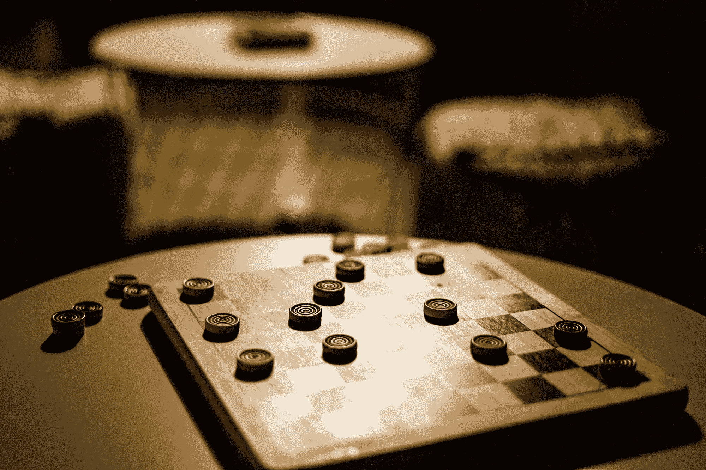
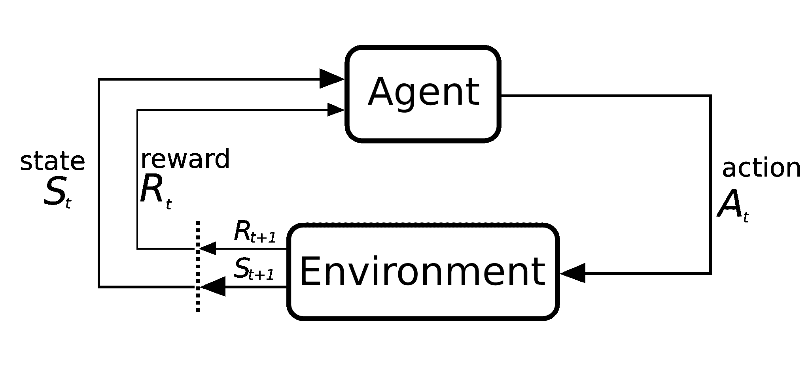
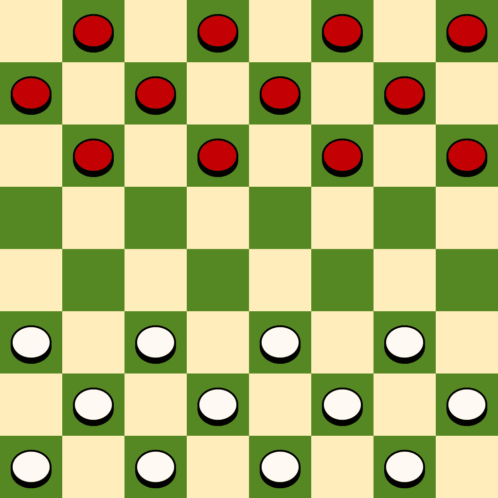
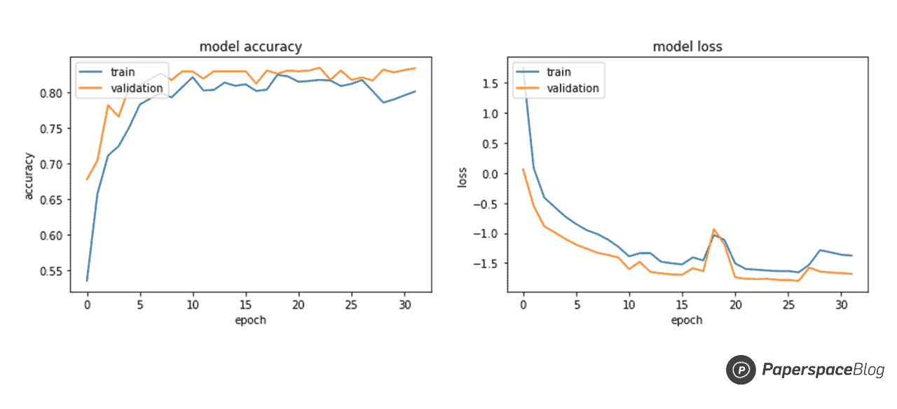
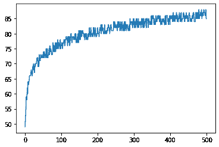
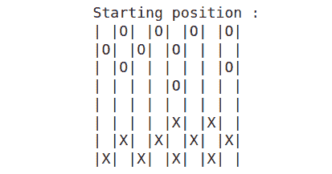
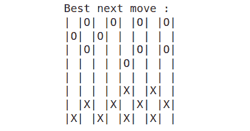

# 使用深度 Q 学习构建跳棋游戏代理

> 原文：<https://blog.paperspace.com/building-a-checkers-gaming-agent-using-neural-networks-and-reinforcement-learning/>



Photo by [Tai's Captures](https://unsplash.com/@taiscaptures?utm_source=ghost&utm_medium=referral&utm_campaign=api-credit) / [Unsplash](https://unsplash.com/?utm_source=ghost&utm_medium=referral&utm_campaign=api-credit)

机器学习文献中最有趣的学习方法之一是强化学习。通过奖励和惩罚，一个主体学习通过在已知或未知的环境中从一组动作中选择一个动作来达到给定的目标。强化学习与监督和非监督学习技术不同，不需要任何初始数据。

在本文中，我们将演示如何实现一个版本的强化学习技术 ***深度 Q 学习*** ，以创建一个能够在体面的水平上玩跳棋的 AI 代理。

## 深度 Q 学习简介

**深度强化学习**是机器学习的一个分支，结合了深度学习和强化学习(RL)。RL 考虑了让计算代理通过犯错来学习的挑战。由于深度学习融入了解决方案，代理可以根据来自非结构化数据的输入做出决策，而不必手动设计状态空间。深度 RL 算法能够处理大量数据，并确定采取最佳行动以实现目标:例如赢得跳棋比赛。

首先，我们来讨论一下强化学习与有监督或无监督学习的区别。它基本上是两个要素:环境和 T2 代理。

在深度强化学习任务中，一个与其**环境**交互的**代理**正在接受训练。**代理**执行动作到达各种场景，或者**状态**。**对行动的奖励**可以是正面的，也可以是负面的。
在这种情况下，代理人的唯一目标是**最大化整集的整体回报**。这一集(也称为生成)包括在**初始状态**和**最终状态**之间的环境中发生的一切。

现在有一组必须完成的动作，以便赢得比赛并获得积极的奖励。**延迟奖励**的概念在这里发挥了作用。RL 的关键是学习执行这些序列，同时最大化每一代的回报，最终达到胜利的状态。这被称为**马尔可夫决策过程**。



Diagram of the Markov decision process ([source](https://commons.wikimedia.org/wiki/File:Markov_diagram_v2.svg))

让我们以跳棋游戏为例:

*   玩家是与环境互动的代理人
*   **状态**可以表示为具有每个棋子和国王位置的棋盘矩阵
*   一个**集/代**可以代表多个玩过的游戏。
*   **动作**是可以移动的移动棋子和可以捕获的捕获对手棋子。
*   这些行动的结果用于定义**奖励**。如果行动使玩家更接近胜利，应该给予积极的奖励；否则，应该分配一个负奖励。

**深度 Q 学习**的独特之处在于，我们使用这种强化学习技术来更新神经网络的权重。这是通过给每组(动作、状态)分配一个可量化的值来完成的，这就是所谓的 **Q 值**。然后，对于每一代，我们更新这个 Q 值以最大化回报。

使用旧值和新信息的加权平均值，使用**贝尔曼方程**完成 Q 值更新过程:


Bellman equation applied to Q-Learning ([source](https://wikimedia.org/api/rest_v1/media/math/render/svg/678cb558a9d59c33ef4810c9618baf34a9577686))

作为**深度 Q 学习**的核心，这个等式引入了一些需要注意的重要量:

*   **学习率**:学习率影响新学到的知识取代以前学到的信息的程度。一个 ***0*** 的因子导致代理什么都不学，但是一个 ***1*** 的因子导致代理只考虑最近的信息，而忽略代理的先验知识。实际上，经常使用低的固定学习率，如 **0.2** 。
*   **折扣因子**:未来奖励的意义由折扣因子决定。一个接近于 ***1*** 的数值会导致代理人寻求长期的高回报，而一个接近于 ***0*** 的数值会导致其只考虑眼前回报的短视行为。对于我们的情况，应该实现一个高值的折扣因子，因为赢得游戏比拥有一个中间的“好”位置重要得多。
*   **初始 Q 值** : Q 学习在第一次更新之前假设一个初始状态，因为它是一个迭代方法。高起始值可以促进探索，因为更新规则将总是使所选择的动作具有比备选方案更低的值，增加了他们选择它的可能性。
    为了避免发散，最好总是**根据一些逻辑**选择初始值，避免随机性。这可以通过先前的经验(例如专家的跳棋或象棋游戏)或通过使用给定的逻辑产生一些“假”经验来完成(例如，根据预定义的规则集对跳棋位置的**评估)。**

## 跳棋游戏

作为最著名的棋盘游戏之一，跳棋有不同的变种。我们在官方维基百科[文章](https://en.wikipedia.org/wiki/Checkers#National_and_regional_variants)中统计了至少 25 个变体。在本教程中，我们将使用 12 个初始棋子实现标准的 8×8 美国跳棋。



Starting position of the American checkers ([source](https://upload.wikimedia.org/wikipedia/commons/thumb/b/b6/Draughts.svg/1024px-Draughts.svg.png))

这个版本的跳棋，也叫**英文跳棋**，可以认为是最基础的。它使用了**没有飞王的规则，棋子不能向后捕捉**。我们建议将此[文章](https://en.wikipedia.org/wiki/English_draughts#Rules)作为完整的规则列表。

数学上，游戏可以用一个 **8 乘 8 矩阵**来建模，用一个值表示每个单元格的内容:被玩家 1 占据，被玩家 2 占据，空单元格或者不可到达的单元格。然而，也可以使用更压缩的版本:我们可以通过忽略不可到达的单元来实现一个 **8 乘 4 矩阵(或 32 乘 1 阵列)**，因为它们在游戏过程中从不改变值。

为此，我们将[修改](https://raw.githubusercontent.com/adilmrk/checkers/main/checkers.py)一个公共可用的[库](https://raw.githubusercontent.com/Btsan/CheckersBot/master/checkers.py)。这个库包含了玩游戏所需的所有函数:可能的移动，可能的捕捉，生成下一个位置，检查游戏赢家，以及许多其他有用的函数。

```
!wget "https://raw.githubusercontent.com/adilmrk/checkers/main/checkers.py"
```

本库引入了一个名为 ***get_metrics*** 的关键函数，应该彻底检查一下。

```
def get_metrics(board): # returns [label, 10 labeling metrics]
	b = expand(board)

	capped = num_captured(b)
	potential = possible_moves(b) - possible_moves(reverse(b))
	men = num_men(b) - num_men(-b)
	kings = num_kings(b) - num_kings(-b)
	caps = capturables(b) - capturables(reverse(b))
	semicaps = semicapturables(b)
	uncaps = uncapturables(b) - uncapturables(reverse(b))
	mid = at_middle(b) - at_middle(-b)
	far = at_enemy(b) - at_enemy(reverse(b))
	won = game_winner(b)

	score = 4*capped + potential + men + 3*kings + caps + 2*semicaps + 3*uncaps + 2*mid + 3*far + 100*won
	if (score < 0):
		return np.array([-1, capped, potential, men, kings, caps, semicaps, uncaps, mid, far, won])
	else:
		return np.array([1, capped, potential, men, kings, caps, semicaps, uncaps, mid, far, won])
```

这个函数根据许多参数评估给定的棋盘状态，这些参数可以让我们大致了解哪个玩家的位置更好。这对于创建**初始模型**非常有用，我们稍后将通过深度 Q 学习来加强它。

## 度量模型

生成模型是产生新数据实例的统计模型的子集。无监督学习使用这些模型来执行任务，包括估计概率和可能性、建模数据点以及使用这些概率对实体进行分类。

在我们的例子中，我们将实现一个生成模型，它将一个度量数组(由函数 get_metrics 测量)作为输入，然后预测获胜概率。所以，这个模型将只着眼于 **10** **启发式评分指标**为**贴标签**。在稍后的主板模型中，我们将使用指标模型创建一个不同的模型，该模型直接将主板作为一个 32 整数数组进行输入，并对主板进行评估。

为此，我们将实现一个基本的**顺序 Keras 模型**，它具有三个密集层、一个作为激活函数的校正线性单元和一个大小为 10 的输入，表示测量的得分指标。

```
# Metrics model, which only looks at heuristic scoring metrics used for labeling
metrics_model = Sequential()
metrics_model.add(Dense(32, activation='relu', input_dim=10)) 
metrics_model.add(Dense(16, activation='relu',  kernel_regularizer=regularizers.l2(0.1)))

# output is passed to relu() because labels are binary
metrics_model.add(Dense(1, activation='relu',  kernel_regularizer=regularizers.l2(0.1)))
metrics_model.compile(optimizer='nadam', loss='binary_crossentropy', metrics=["acc"])

start_board = checkers.expand(checkers.np_board())
boards_list = checkers.generate_next(start_board)
branching_position = 0
nmbr_generated_game = 10000
while len(boards_list) < nmbr_generated_game:
	temp = len(boards_list) - 1
	for i in range(branching_position, len(boards_list)):
		if (checkers.possible_moves(checkers.reverse(checkers.expand(boards_list[i]))) > 0):
				boards_list = np.vstack((boards_list, checkers.generate_next(checkers.reverse(checkers.expand(boards_list[i])))))
	branching_position = temp

# calculate/save heuristic metrics for each game state
metrics	= np.zeros((0, 10))
winning = np.zeros((0, 1))

for board in boards_list[:nmbr_generated_game]:
	temp = checkers.get_metrics(board)
	metrics = np.vstack((metrics, temp[1:]))
	winning  = np.vstack((winning, temp[0]))

# fit the metrics model
history = metrics_model.fit(metrics , winning, epochs=32, batch_size=64, verbose=0)
```

在建立了模型之后，我们从一个特定的棋盘开始使用一个树形探索制作了 10000 个游戏。然后计算每场比赛的启发性指标。最后，我们训练算法根据这些数据预测游戏的结果。

然后使用 Matplotlib 绘制训练处理历史

```
# History for accuracy
plot.plot(history.history['acc'])
plot.plot(history.history['val_acc'])
plot.title('model accuracy')
plot.ylabel('accuracy')
plot.xlabel('epoch')
plot.legend(['train', 'validation'], loc='upper left')
plot.show()

# History for loss
plot.plot(history.history['loss'])
plot.plot(history.history['val_loss'])
plot.title('model loss')
plot.ylabel('loss')
plot.xlabel('epoch')
plot.legend(['train', 'validation'], loc='upper left')
plot.show()
```



Accuracy & Loss diagram for the Metrics Model

## 董事会模式

接下来，我们使用度量模型来创建一个新模型，它接受棋盘的压缩版本(大小为 32)的输入，并预测从给定的棋盘中赢得的**概率。换句话说，它评估位置:负面的评估可能会导致一场失败的游戏，而正面的评估可能会导致一场胜利的游戏。**

这种位置评估概念与应用于玩主要棋盘游戏的 AI 引擎的概念相同:国际象棋、围棋和跳棋的其他变体。

```
# Board model
board_model = Sequential()

# input dimensions is 32 board position values
board_model.add(Dense(64 , activation='relu', input_dim=32))

# use regularizers, to prevent fitting noisy labels
board_model.add(Dense(32 , activation='relu', kernel_regularizer=regularizers.l2(0.01)))
board_model.add(Dense(16 , activation='relu', kernel_regularizer=regularizers.l2(0.01))) # 16
board_model.add(Dense(8 , activation='relu', kernel_regularizer=regularizers.l2(0.01))) # 8

# output isn't squashed, because it might lose information
board_model.add(Dense(1 , activation='linear', kernel_regularizer=regularizers.l2(0.01)))
board_model.compile(optimizer='nadam', loss='binary_crossentropy')

# calculate heuristic metric for data
metrics = np.zeros((0, 10))
winning = np.zeros((0, 1))
data = boards_list
```

编译完模型后，我们将遍历所有生成的棋盘位置。并且，对于每块板，我们提取指标，然后使用指标模型来预测该板的获胜概率。

我们还计算了每个董事会评估的置信水平:


置信度值用作 Keras 模型的样本权重，以强调概率较高的评估。

```
for board in data:
	temp = checkers.get_metrics(board)
	metrics = np.vstack((metrics, temp[1:]))
	winning = np.zeros((0, 1))

# calculate probilistic (noisy) labels
probabilistic = metrics_model.predict_on_batch(metrics)

# fit labels to {-1, 1}
probabilistic = np.sign(probabilistic)

# calculate confidence score for each probabilistic label using error between probabilistic and weak label
confidence = 1/(1 + np.absolute(winning - probabilistic[:, 0]))

# pass to the Board model
board_model.fit(data, probabilistic, epochs=32, batch_size=64, sample_weight=confidence, verbose=0)

board_json = board_model.to_json()
with open('board_model.json', 'w') as json_file:
	json_file.write(board_json)
board_model.save_weights('board_model.h5')

print('Checkers Board Model saved to: board_model.json/h5')
```

拟合模型后，我们将权重和模型配置保存到 json 和 h5 文件中，稍后我们将使用它们进行强化学习。

我们现在有了一个代表初级水平的 checker 专业知识的模型；这个模型的输出代表我们的初始 Q 值。使用这种方法来生成初始 Q 值将使强化学习更加有效，因为经过训练的棋盘模型在评估棋盘位置方面比随机选择评估的替代方案好得多。

## 强化模型

现在，初始模型已经训练好了，我们将使用深度 Q 学习来指导它产生更多的胜利和平局以及更少的损失。

在我们的例子中，我们将使用**延迟奖励**的概念。在我们的模型强化期间，我们将经历 **500 代**，其中每一代将代表模型的**改装。在每一代中，**代理**(玩跳棋**的模型**)将玩 **200 局**。并且，对于每场游戏，所有导致**输**的棋都将有一个**负奖励**，而所有导致**赢或和棋**的棋都将得到一个**正奖励**。**

在每一步，为了选择一个移动，我们将使用模型**评估所有可能的移动**，并选择具有最高**评估**的移动。

在每个游戏结束时设置奖励值后，我们将使用贝尔曼方程更新 Q 值，然后保存更新后的版本，以及导致最终结果的所有位置，直到生成结束。最后，在每一代结束时，用更新的 Q 值(评估)在这些游戏的所有位置上重新装配模型。

```
json_file = open('board_model.json', 'r')
board_json = json_file.read()
json_file.close()

reinforced_model = model_from_json(board_json)
reinforced_model.load_weights('board_model.h5')
reinforced_model.compile(optimizer='adadelta', loss='mean_squared_error')

data = np.zeros((1, 32))
labels = np.zeros(1)
win = lose = draw = 0
winrates = []
learning_rate = 0.5
discount_factor = 0.95

for gen in range(0, 500):
	for game in range(0, 200):
		temp_data = np.zeros((1, 32))
		board = checkers.expand(checkers.np_board())
		player = np.sign(np.random.random() - 0.5)
		turn = 0
		while (True):
			moved = False
			boards = np.zeros((0, 32))
			if (player == 1):
				boards = checkers.generate_next(board)
			else:
				boards = checkers.generate_next(checkers.reverse(board))

			scores = reinforced_model.predict_on_batch(boards)
			max_index = np.argmax(scores)
			best = boards[max_index]

			if (player == 1):
				board = checkers.expand(best)
				temp_data = np.vstack((temp_data, checkers.compress(board)))
			else:
				board = checkers.reverse(checkers.expand(best))

			player = -player

			# punish losing games, reward winners  & drawish games reaching more than 200 turns
			winner = checkers.game_winner(board)
			if (winner == 1 or (winner == 0 and turn >= 200) ):
				if winner == 1:
					win = win + 1
				else:
					draw = draw + 1
				reward = 10
				old_prediction = reinforced_model.predict_on_batch(temp_data[1:])
				optimal_futur_value = np.ones(old_prediction.shape)
				temp_labels = old_prediction + learning_rate * (reward + discount_factor * optimal_futur_value - old_prediction )
				data = np.vstack((data, temp_data[1:]))
				labels = np.vstack((labels, temp_labels))
				break
			elif (winner == -1):
				lose = lose + 1
				reward = -10
				old_prediction = reinforced_model.predict_on_batch(temp_data[1:])
				optimal_futur_value = -1*np.ones(old_prediction.shape)
				temp_labels = old_prediction + learning_rate * (reward + discount_factor * optimal_futur_value - old_prediction )
				data = np.vstack((data, temp_data[1:]))
				labels = np.vstack((labels, temp_labels))
				break
			turn = turn + 1

		if ((game+1) % 200 == 0):
			reinforced_model.fit(data[1:], labels[1:], epochs=16, batch_size=256, verbose=0)
			data = np.zeros((1, 32))
			labels = np.zeros(1)
	winrate = int((win+draw)/(win+draw+lose)*100)
	winrates.append(winrate)

	reinforced_model.save_weights('reinforced_model.h5')

print('Checkers Board Model updated by reinforcement learning & saved to: reinforced_model.json/h5')
```

在运行可能需要几个小时的强化之后，云人工智能派上了用场，我们使用 matplotlib 绘制了各代的赢/平率值。

```
generations = range(0, 500)
print("Final win/draw rate : " + str(winrates[499])+"%" )
plot.plot(generations,winrates)
plot.show()
```

我们可以注意到，在第 500 代结束时，赢/平率达到最大值 85%。这被认为是一个专家水平的跳棋。



Win/draw rate through generations

然而，类似的训练技术可以被应用于一个更熟练的游戏代理，通过分配负奖励来惩罚平局。

这可能需要更多的代数和更高的计算能力来加强模型，以便在可接受的时间内达到体面的胜率。

## 使用模型

现在我们有了一个棋盘评估模型，问题是**如何从给定的位置**选择最好的棋步。基本的方法是引入一个搜索函数，搜索所有可能的走法，找到一个导致最高评价的走法。

也可以使用其他策略，例如在搜索树中更深入，并在多个回合中探索可能的位置。为了达到较大的深度(通常提前 30 步)，高性能象棋和跳棋引擎使用诸如字母表修剪的方法，其中搜索算法优化了玩家可能的未来评估，同时最小化了对手可能的未来评估。

对于我们的例子，我们实现了一个简单的查找函数，在下一轮中最大化可能的评估。我们还引入了一个简单的打印功能，以可读的格式显示电路板。

```
def best_move(board):
  compressed_board = checkers.compress(board)
  boards = np.zeros((0, 32))
  boards = checkers.generate_next(board)
  scores = reinforced_model.predict_on_batch(boards)
  max_index = np.argmax(scores)
  best = boards[max_index]
  return best

def print_board(board):
  for row in board:
    for square in row:
      if square == 1:
        caracter = "|O"
      elif square == -1:
        caracter = "|X"
      else:
        caracter = "| "
      print(str(caracter), end='')
    print('|')
```

让我们通过预测给定位置的变动来测试这个模型

```
start_board = [1, 1, 1, 1,  1, 1, 1, 0,  1, 0, 0, 1,  0, 0, 1, 0,  0, 0, 0, 0,  0, 0, -1, -1,  -1, -1, -1, -1,  -1, -1, -1, -1]
start_board = checkers.expand(start_board)
next_board = checkers.expand(best_move(start_board))

print("Starting position : ")
print_board(start_board)

print("\nBest next move : ")
print_board(next_board)
```

在这个例子中，我们从游戏中间的一个位置开始，这个位置被认为是游戏中最困难的阶段。



Representation of the starting position

然后，使用前面介绍的函数 **best_move** ，我们找到了标记为 **O** 的玩家的最佳下一步棋，然后打印出结果棋盘。



Representation of the expected best move 

检测到的移动遵循专家规定的跳棋基本原则，即不要让棋子滞留在棋盘中央，并尽可能用后面的棋子支持它们。这个模型和这个规则是一致的。

## 更进一步

本教程的跳棋引擎能够击败普通的休闲玩家，甚至体面的玩家。然而，为了生产能够与世界上最好的发动机竞争的发动机，必须采用更严格的实践:

*   必须增加世代数。
*   每一代人生产的游戏数量必须增加。
*   为了发现合适的学习率和折扣因子，必须使用一些调整策略。
*   为了发现最佳移动，必须使用 Alpha Beta 修剪深度搜索技术。
*   我们还可以考虑将专家游戏作为训练棋盘模型的初始数据集，而不是使用启发式度量。

## 结论

在本文中，我们展示了如何使用**深度 Q 学习**，一种强化学习，来开发一个能够以 85%的合理**赢/平率**玩跳棋的 AI 代理。

首先，我们创建了**生成模型**，它基于**启发式跳棋度量**来估计获胜概率。然后，使用它创建一个板评估模型。接下来，使用深度 Q-Learning，我们继续**强化棋盘模型**，让更多游戏以赢和平而不是输结束。

最后，使用我们介绍的模型，我们展示了如何从一个给定的位置选择下一步行动的最佳选择。