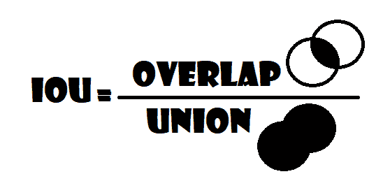
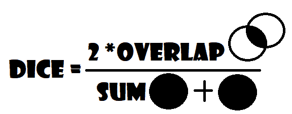
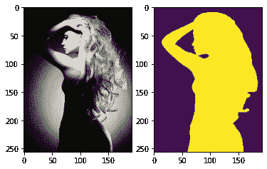
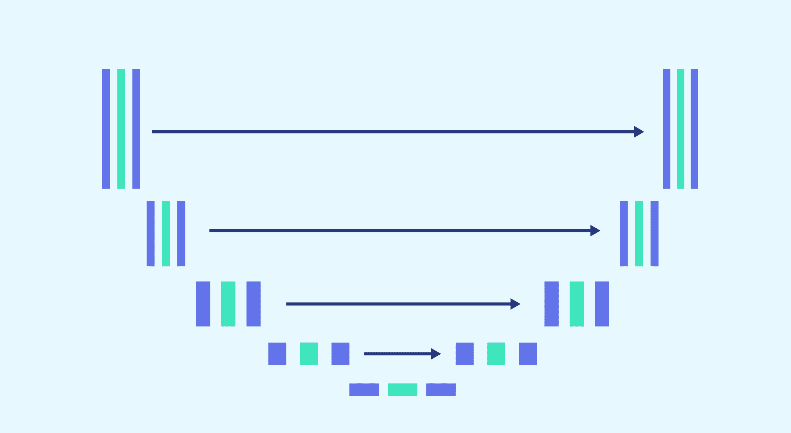
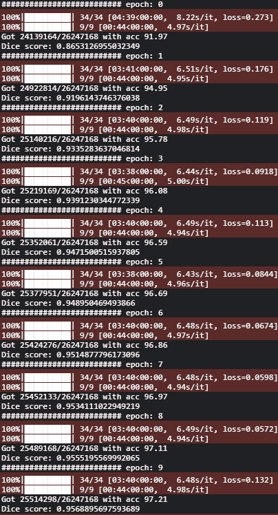
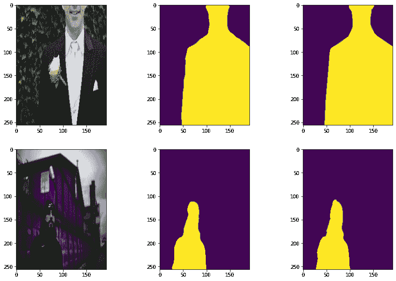

# 图象分割法

> 原文：<https://blog.paperspace.com/image-segmentation-using-segmentation_models_pytorch/>

计算机视觉是一个热门领域，它的快速发展和扩大是众所周知的。在过去的几年里，新的最先进的库不断发布，它是许多伟大的数据科学家进入深度学习的门户。最流行的计算机视觉类型之一是图像分割。

在本文中，我们将定义图像分割和 Segmentation_models_PyTorch，发现在这些任务中使用的正确指标，并演示一个端到端管道，该管道可用作处理图像分割问题的模板。我们将通过必要的步骤，从数据准备到使用 Segmentation_models_pytorch 包的模型设置，这将使我们的任务更容易，到结果的可视化。最后，我们将讨论图像分割的一些有用的应用。除了又酷又有见识。

* * *

# 图像分割:

我们可以将**图像分割**视为像素级的分类任务，我们对图像中的每个像素进行分类，将其分配到相应的类别，因此，如果我们有一个 256*192 的图像，我们实际上必须进行 48768 像素的分类。根据任务的不同，我们可以有一个**语义分割**，我们必须对照片中的每个像素进行分类，或者有一个**实例分割**，我们只需要对代表某种感兴趣的对象的像素进行分类。


[Image source](https://arxiv.org/pdf/1405.0312.pdf)

* * *

# 图像分割的度量

在图像分割任务中最容易使用的度量是**像素精度**，正如其名称所示，它帮助我们找出像素分类的精度。不幸的是，我们不能完全依赖它，如果相关像素不占图片的大部分，那么像素精度非常高，因此它没有分割任何东西，所以在这种情况下它是无用的。

因此，在这种情况下，可以使用其他指标；例如并集上的交集和 dice 系数，大多数情况下我们都可以把它们联系起来。

### 并集上的交集

并集(IoU) 上的**交集也被称为**雅克卡指数**。使用 IoU 意味着我们有两个图像进行比较:一个是我们的预测，另一个是基本事实，如果获得的值接近数字 1，这意味着预测是相似的，接近我们的基本事实。反之亦然，IoU 越低，我们的结果越差。**

在下图中，我们可以看到计算中涉及的区域的可视化表示。如果我们预测了一个比它应该的更大的区域(分母会更大)或者一个更小的区域(分子会更小)，我们可以计算出度量是如何被有效惩罚的。



Visual representation of the IoU calculation

### 骰子系数

另一个有用的度量是 **Dice 系数**，它是预测和实际面积的重叠面积的两倍，然后除以预测和实际面积的总和:



Visual representation of the Dice calculation

它与上一个指标具有相同的功能，但在这个指标中，我们不考虑分母中的联合，两者非常相似，并且它们产生几乎相同的结果，1 表示预测值和真实值之间的完美匹配，值越接近 0，预测值就越接近所需的基本事实。

* * *

# 细分 _ 模型 _pytorch

**Segmentation _ models _ pytorch**是一个构建在 py torch 框架上的令人敬畏的库，用于创建 PyTorch nn。用于图像分割任务的模块(只有**两行代码**，它包含用于二进制和多类分割的 **5 个模型架构**(包括传说中的 [Unet](https://blog.paperspace.com/unet-architecture-image-segmentation/) )、用于每个架构的 **46 个编码器**，并且所有编码器都有**预训练的权重**用于更快和更好的收敛。

* * *

# 从头开始使用 segmentation_models_pytorch 进行图像分割

在本节中，我们将演示一个端到端的管道，它可以用作处理图像分割问题的模板，我们将使用来自 Kaggle 的[监督过滤的分割人物数据集](https://www.kaggle.com/datasets/tapakah68/supervisely-filtered-segmentation-person-dataset) ，它包含 2667 个人物图像及其分割。

#### 要在渐变笔记本上安装 Kaggle 和使用 Kaggle 数据集，请遵循以下说明:

1.获得一个 Kaggle 帐户

2.转到您的帐户设置创建一个 API 令牌，并将 kaggle.json 保存到您的本地计算机。注意:如果您已经创建了一个 api 令牌，您可能需要创建一个新的 API 令牌。

3.将 kaggle.json 上传到您的渐变笔记本

4.运行下面的单元格或在终端中运行以下命令(这可能需要一段时间)

终端说明:

mkdir ~/。kaggle/

mv kaggle.json ~/。kaggle/

pip 安装卡格尔

kaggle 数据集下载 tapakah 68/超级过滤-细分-人-数据集

解压缩 supervisely-filtered-segmentation-person-dataset . zip

单元格中的线条魔术(针对免费 GPU 笔记本用户):

！mkdir ~/。kaggle/

！mv kaggle.json ~/。kaggle/

！pip 安装卡格尔

！kaggle 数据集下载 tapakah 68/超级过滤-细分-人-数据集

！解压缩 supervisely-filtered-segmentation-person-dataset . zip

让我们从加载必要的库开始。

### 加载我们需要的所有依赖项

我们首先将为线性代数引入 numpy，为与操作系统的交互引入 os。然后，我们想要使用 PyTorch，所以我们导入 Torch，并从那里导入 nn。这将帮助我们创建和训练网络，并让我们导入 optim，这是一个实现各种优化算法(如 sgd、adam、..).我们从 torch.utils.data 导入数据集以准备数据集，并导入数据加载器以创建小批量。

我们还将导入 torchvision，因为我们正在处理图像，segmentation_models_pytorch 使我们的任务更容易，albumentations 用于数据扩充，tqdm 用于显示进度条，最后 matplotlib.pyplot 用于显示结果并将它们与地面实况进行比较。

```
import os
import numpy as np
from PIL import Image
import torch
from torch import nn, optim
from torch.utils.data import Dataset, DataLoader
import torchvision
import segmentation_models_pytorch as smp
import albumentations as A  
from albumentations.pytorch import ToTensorV2
from tqdm import tqdm
import matplotlib.pyplot as plt
```

### 播种一切

让我们播种一切，使结果具有一定的可重复性

```
def seed_everything(seed):
    os.environ["PYTHONHASHSEED"] = str(seed)
    np.random.seed(seed)
    torch.manual_seed(seed)
    torch.cuda.manual_seed(seed)
    torch.backends.cudnn.deterministic = True
    torch.backends.cudnn.benchmark = True

seed_everything(42)
```

### 资料组

为了设置数据加载部分，我们将创建一个名为 **SegmentationDataset，**的类，并从**数据集**继承它。这个类将有三个方法:

*   **init** :将自身、包含人物图像的输入目录、包含人物分割图像的输出目录、默认为 None 的数据转换的转换、is_train 作为参数，当训练阶段有 80%的数据时为真，当验证阶段有 20%的数据时为假。
*   **len** :返回数据集的长度。
*   getitem :它将 self 和 index 作为输入，我们将获得图像路径，这将是我们存储图像的图像目录的路径，并将它与特定图像的文件连接，然后我们做同样的事情来获得遮罩路径。现在我们有了蒙版路径和图像路径，在将蒙版转换为 L 以将其转换为灰度(1 个通道)并将图像转换为 RGB (3 个通道)之后，我们加载这两个路径，然后将它们转换为 NumPy 数组，因为我们使用的是 albumentations 库，将它们除以 255 以获得 0 到 1 之间的像素，如果不是 None，则对它们应用 transform，最后返回图像和蒙版。

```
class SegmentationDataset(Dataset):
    def __init__(self, input_dir, output_dir, is_train, transform=None):
        self.input_dir  = input_dir
        self.output_dir = output_dir
        self.transform  = transform
        if is_train == True:
            x = round(len(os.listdir(input_dir)) * .8)
            self.images = os.listdir(input_dir)[:x]
        else:
            x = round(len(os.listdir(input_dir)) * .8)
            self.images = os.listdir(input_dir)[x:]

    def __len__(self):
        return len(self.images)

    def __getitem__(self, index):
        img_path    = os.path.join(self.input_dir, self.images[index])
        mask_path   = os.path.join(self.output_dir, self.images[index])
        img         = np.array(Image.open(img_path).convert("RGB"), dtype=np.float32) / 255
        mask        = np.array(Image.open(mask_path).convert("L"), dtype=np.float32)   / 255

        if self.transform is not None:
            augmentations = self.transform(image=img, mask=mask)
            img   = augmentations["image"]
            mask  = augmentations["mask"]

        return img, mask
```

### 超参数和初始化

让我们用图像的路径初始化 train_inp_dir，用掩码的路径初始化 train_out_dir，如果设备可用，用 Cuda 初始化 device，否则用 CPU 初始化。设置一些超参数(学习率、批量大小、时期数...).最后，初始化包含调整图像大小和一些增强(水平翻转和颜色抖动)的训练变换，并将它们转换为张量。除了扩充之外，验证过程是相同的。

```
TRAIN_INP_DIR = '../input/supervisely-filtered-segmentation-person-dataset/supervisely_person_clean_2667_iimg/'
TRAIN_OUT_DIR = '../input/supervisely-filtered-segmentation-person-dataset/supervisely_person_clean_2667_img/masks/'
DEVICE        = "cuda" if torch.cuda.is_available() else "cpu"

LEARNING_RATE = 3e-4
BATCH_SIZE    = 64
NUM_EPOCHS    = 10
IMAGE_HEIGHT  = 256  
IMAGE_WIDTH   = 192  

train_transform = A.Compose(
    [
        A.Resize(height=IMAGE_HEIGHT, width=IMAGE_WIDTH),
        A.ColorJitter(p=0.2),
        A.HorizontalFlip(p=0.5),
        ToTensorV2(),
    ],
)

val_transform = A.Compose(
    [
        A.Resize(height=IMAGE_HEIGHT, width=IMAGE_WIDTH),
        ToTensorV2(),
    ],
)
```

现在让我们创建一个函数 **get_loaders** ，其中使用 SegmentationDataset 类准备数据，并使用 DataLoader 创建小批量大小，以便返回 **train_loader** 和 **val_loader**

```
def get_loaders( inp_dir, mask_dir,batch_size,
			     train_transform, val_tranform ):

    train_ds     = SegmentationDataset( input_dir=inp_dir, output_dir=mask_dir,
                            is_train=True, transform=train_transform)

    train_loader = DataLoader( train_ds, batch_size=batch_size, shuffle=True )

    val_ds       = SegmentationDataset( input_dir=inp_dir, output_dir=mask_dir,
                            is_train=False, transform=val_transform)

    val_loader   = DataLoader( val_ds, batch_size=batch_size, shuffle=True  )

    return train_loader, val_loader
```

### 检查数据加载器

让我们检查一下是否一切正常，看看数据是什么样的。

```
train_loader, val_loader = get_loaders( TRAIN_INP_DIR, TRAIN_OUT_DIR,
                            BATCH_SIZE,  train_transform, val_transform)
inputs, masks = next(iter(train_loader))

_, ax = plt.subplots(1,2)
ax[0].imshow(inputs[0].permute(1,2,0))
ax[1].imshow(masks[0])
```



### 检查准确性:

让我们构建 check_accuracy 函数，使用像素精度和骰子点数来检查模型的验证精度，我们向该函数发送加载程序、模型和设备。

我们将 num_correct、num_pixels 和 dice_score 设置为 0，以计算像素精度和 dice 分数字母。

我们将模型切换到评估模式，并使用 torch.no_grad 包装所有内容，之后我们通过 loader，将图像及其蒙版移动到设备中，并使用 sigmoid 运行模型以获得一些预测，使像素介于 0 和 1 之间，然后将所有高于 0.5 的像素转换为 1，将所有低于 0 的像素转换为 0。 因为对于分割，我们输出每个单独像素的预测(1 表示人，0 表示其他人)，然后我们计算正确预测的数量除以像素的数量，以计算**像素精度**，接下来我们计算骰子得分。 最后，我们将模型切换到训练模式。

```
def check_accuracy(loader, model, device="cuda"):
    num_correct = 0
    num_pixels  = 0
    dice_score  = 0
    model.eval()

    with torch.no_grad():
        for img, mask in tqdm(loader):
            img   = img.to(device)
            mask  = mask.to(device).unsqueeze(1)
            preds = torch.sigmoid(model(img))
            preds = (preds > 0.5).float()
            num_correct += (preds == mask).sum()
            num_pixels += torch.numel(preds)
            dice_score += (2 * (preds * mask).sum()) / (
                (preds + mask).sum() + 1e-7
            )

    print(
        f"Got {num_correct}/{num_pixels} with pixel accuracy {num_correct/num_pixels*100:.2f}"
    )
    print(f"Dice score: {dice_score/len(loader)*100:.2f}")
    model.train()
```

### 模型、损失函数和优化器

在这个模型中，我们将使用 UNet，这是一种最初为医学成像分割提出的语义分割技术。到目前为止，它已经超过了先前的最佳分割方法，也用于许多高级的 GANs，如 pix2pix。



Unet architecture - [Image source](https://datascientest.com/u-net)

*   我们将使用 Segmentation_models_pytorch 只用一行代码构建这样一个强大的模型，我们选择了具有迁移学习的传奇 UNet 架构“efficientnet-b3”，输入数为 3 (RGB)，类别数为 1，不使用任何激活函数。但是在使用预测之前，我们使用 sigmoid 使像素在 1 和 0 之间。最后，我们将模型移动到设备上。
*   我们有一个二进制类分割，所以基本上，它只是一个像素级的二进制分类任务，所以在损失函数中，我们会使用 **BCEWithLogitsLoss。**
*   对于优化器，我们将使用 Adam。

```
model = smp.Unet(encoder_name='efficientnet-b3', in_channels=3, classes=1, activation=None).to(DEVICE)
loss_fn   = nn.BCEWithLogitsLoss()
optimizer = optim.Adam(model.parameters(), lr=LEARNING_RATE)
```

### 培养

现在有趣的部分，魔术将会发生，在这部分我们将训练我们的模型。

*   我们循环使用数据加载器创建的所有小批量，将图像及其蒙版移动到设备中。
*   对于正向传递，我们使用模型来预测掩码，并计算预测值和地面真实值之间的损失。
*   对于后向传递，我们将梯度设置为零，因为否则梯度会累积(PyTorch 中的默认行为)，然后我们使用损失后向传递方法，并更新权重。
*   最后但同样重要的是，我们更新 tqdm 循环。

```
def train_fn(loader, model, optimizer, loss_fn):
    loop = tqdm(loader)

    for batch_idx, (image, mask) in enumerate(loop):
        image   = image.to(device=DEVICE)
        mask    = mask.float().unsqueeze(1).to(device=DEVICE)

        # forward
        predictions = model(image)
        loss = loss_fn(predictions, mask)

        # backward
        model.zero_grad()
        loss.backward()
        optimizer.step()

        # update tqdm loop
        loop.set_postfix(loss=loss.item())
```

为了好玩，让我们在任何训练之前检查准确性。

```
check_accuracy(val_loader, model, device=DEVICE) 
```


现在让我们开始训练模型，并在每个时期后检查准确性。

```
for epoch in range(NUM_EPOCHS):

    print('########################## epoch: '+str(epoch))
    train_fn(train_loader, model, optimizer, loss_fn)

    # check accuracy
    check_accuracy(val_loader, model, device=DEVICE)
```



我们可以看到，我们获得了 97.21%的像素精度和 95.68%的骰子得分。

### 可视化结果

现在是真相大白的时刻，让我们将结果可视化，并与地面真相进行比较。

```
inputs, masks = next(iter(val_loader))
output        = ((torch.sigmoid(model(inputs.to('cuda')))) >0.5).float()
_, ax = plt.subplots(2,3, figsize=(15,10))
for k in range(2):
    ax[k][0].imshow(inputs[k].permute(1,2,0))
    ax[k][1].imshow(output[k][0].cpu())
    ax[k][2].imshow(masks[k])
```

下面的图像代表这个代码的输出，在第一列，我们找到图像本身，在第二列我们有预测，在最后一列是基本事实。

> 你可能没有相同的图像，因为我们正在洗牌



Plot the results and compare them with the ground truth

* * *

# 图像分割的应用

图像分割有许多有用的应用，例如:

*   **医学图像**

图像分割是最有用的东西，它在认识和诊断不同的疾病以及模式识别研究中非常重要。例如，在成像领域用于定位肿瘤、研究解剖结构等。

*   **物体检测**

图像分割的主要作用和功能是通过检测对象、理解交互等来识别图像并对其进行分析。这比从像素中寻找意义要容易得多。例如，如果我们拍摄一张报纸的照片，可以使用分割过程来分离报纸中的图像和文本。从你的照片中，眼睛、鼻子或嘴巴可以从图像的其余部分中分离出来。

图像分割还有许多其他有用的应用，如图像编辑，计数图像中的事物(人群中的人，天空中的星星...)，并在卫星图像中定位一些对象(道路、森林...).