# BERT:用于语言理解的深度双向转换器的预训练

> 原文：<https://blog.paperspace.com/bert-pre-training-of-deep-bidirectional-transformers-for-language-understanding/>

### 介绍

语言模型预训练已被证明在增强若干自然语言处理任务中是有效的。自然语言推理和解释是句子级任务的例子，而标记级任务，如命名实体识别和问题回答，需要模型来提供标记级的细粒度输出。基于特征和微调是将预先训练的语言表示应用于下游任务的两种方法。

像生成式预训练转换器这样的微调方法引入了最少的特定于任务的参数，并且通过简单地微调所有预训练参数来对下游任务进行训练。这两种技术都在预训练期间使用单向语言模型来学习一般的语言表示。

### 通往伯特的路

我们认为，当前的策略限制了微调方法的先前训练表示的效力。标准语言模型是单向的，这限制了可以在预训练中使用的体系结构，这是一个很大的限制。由于在 OpenAI GPT 中使用了从左到右的设计，每个令牌只能关注在转换器的自我关注层中位于它之前的令牌。

这些限制对于句子级别的任务来说并不理想，当用于令牌级别的任务时，例如回答问题时，它们可能特别有害，在这种情况下，在两个方向上整合上下文是至关重要的。这项研究提出通过引入 BERT 来改进基于微调的技术:来自变压器的双向编码器表示。

受完形填空任务启发的 MLM 预训练目标缓解了上述单向性限制。屏蔽语言模型的目标是在屏蔽了输入中的特定标记之后，仅从其上下文来估计屏蔽单词的原始词汇 id。可以使用 MLM 目标而不是传统的从左到右语言模型预训练方法来训练深度双向变换器。除了屏蔽语言模型之外，我们还利用一个被称为“下一句预测”的任务来预训练文本对表示。

### 论文的贡献

*   根据这项研究，双向预训练对于发展准确的语言表达至关重要。BERT 采用屏蔽语言模型来允许预先训练的深度双向表示。它对比了预训练的单向语言模型和独立训练的从左到右和从右到左 LMs 的浅层连接。
*   作者证明了预先训练的表示减少了对大量大量设计的特定于任务的架构的需求。有多种特定于任务的体系结构是 BERT 胜过的，因为它是第一个使用微调来在广泛的句子和标记级任务上获得当前最佳性能的表示模型。BERT 改进了 11 个 NLP 任务。代码和预训练模型可在 https://github.com/google-research/bert.获得

### 历史:最广泛使用的预训练一般语言表征的方法

### 无监督的基于特征的方法

几十年来，学习广泛适用的单词表示一直是研究的焦点，并且该研究领域包括非神经和神经方法。与从零开始学习的嵌入相比，预训练的单词嵌入提供了相当大的收益，因此是当今自然语言处理(NLP)系统的重要组成部分。为了预训练单词嵌入向量，已经使用了从左到右语言建模目标和目的，其在左和右上下文中区分正确的和错误的单词。这些方法已经扩展到更粗的粒度，例如句子嵌入或段落嵌入。

### 无监督微调方法

以这种方式工作的第一种方法仅使用从未标记的文本中获得的预训练的单词嵌入参数，并且这种方法的操作类似于基于特征的技术。生成上下文标记表示的句子或文档编码器已经使用未标记的文本进行了预训练，并针对监督的下游任务进行了微调。

### 从监督数据中转移学习

该研究证明了使用大数据集的监督任务的成功迁移，如自然语言推理和机器翻译。计算机视觉的研究也证明了从大型预训练模型进行迁移学习的价值。一个被证明是有益的策略是微调已经使用 ImageNet 预先训练的模型。

### 伯特

在我们的框架中，有两个步骤:预训练步骤和微调步骤。在完成各种预训练任务的同时，使用跨各种预训练任务的未标记数据来训练该模型。在开始微调过程之前，用预先训练的参数初始化 BERT 模型。接下来，使用来自下游任务的标记数据对每个参数进行微调。
尽管它们都是用相同的预训练参数启动的，但每个下游任务的微调模型都是互不相同的。

### 模型架构

*   BERT 的模型架构基于原始实现，是一个多层双向变换器编码器。
*   由于变压器的使用已经很普遍，并且实现几乎与最初的相似，所以本文没有提供模型架构的完整背景解释。相反，作者将读者引向优秀的指南，如“[带注释的变压器”](https://nlp.seas.harvard.edu/2018/04/03/attention.html)
*   为了这项研究，作者将把层数(也称为变形块)称为 L，把隐藏大小称为 H，把自我注意头数称为 a。
*   在他们的大部分报告中，他们关注的是两种不同模型尺寸的结果:**伯特基地** (L=12，H=768，A=12，总参数=110M)和**伯特大** (L=24，H=1024，A=16，总参数=340M)。
*   为了进行这种比较，选择了 **BERTBASE** ，因为它的模型大小相当于 GPT 的 OpenAI。值得注意的是，伯特变换器使用双向自我关注，而 GPT 变换器依赖于受约束的自我关注，其中每个令牌可能只关注其左侧的上下文。

### 输入/输出表示

我们的输入表示可以在一个令牌序列中清楚地表达单个句子和一对句子(例如，问题、答案)，以支持广泛的下游任务。在整篇文章中，“句子”可能是指任意一段连续的文本，而不是语言学上的句子。
术语“序列”是指发送给 BERT 的输入令牌序列，它可能由一个句子或两个打包在一起的句子组成。

*   如论文中所述，使用了 30，000 个令牌的单词块嵌入。
*   在每个序列中，初始标记总是一个特殊的分类标记(**【CLS】)**。令牌的最终隐藏状态充当分类任务的聚合序列表示。
*   区分句子有两种方法。使用一个特定的标记来分隔它们( **SEP** )。第二步是给每个标记添加一个学习嵌入，指示它是属于句子 A 还是句子 b。
*   作者将输入嵌入表示为 E，将特殊的 **CLS** 令牌的最终隐藏向量表示为 C，将第**Ith**输入令牌的最终隐藏向量表示为 **T *i* 。**
*   对于给定的标记，其输入表示是通过将相应的标记、段和位置嵌入相加而构建的(见下图)。


BERT input representation. The input embeddings are the sum of the token embeddings, the segmenta-tion embeddings and the position embeddings

### 预训练伯特

使用两个无人监督任务对 BERT 进行预训练:

### 屏蔽 LM

通过屏蔽输入符号的一部分来训练深度双向表示非常简单。掩蔽 LM (MLM)是用来描述这一过程的术语，尽管“完形填空”这一术语在文献中更常见(泰勒，1953)。如同在典型的 LM 中一样，输出 softmax 被提供有对应于掩码标记的最终隐藏向量。研究人员在每个序列中随机屏蔽 15%的单词块标记。

### 缺点和解决方案

即使我们可以获得双向预训练模型，在微调期间也不会出现**掩码**标记，这在预训练和微调之间产生了差异。为了避免这一点，我们并不总是使用实际的**掩码**令牌来替换“被屏蔽”的单词。训练数据生成器随机选择 15%的标记位置进行预测。无论何时选择了第 I 个**令牌，我们都会用三个选项中的一个来替换它:**

1.  **掩码**令牌(80%的时间)
2.  随机令牌(10%)
3.  未改变的第**个**令牌(10%)

为了预测原始令牌， **Ti** 将与交叉熵损失一起使用。

### 下一句预测(NSP)

问答(QA)和 NLI(自然语言推理)是基本的下游任务，依赖于理解两个句子之间的关系，这不能通过语言建模立即表示。
在本文中，对二元下一句预测挑战进行了预训练，该挑战可以从任何单语语料库中容易地产生，以建立理解句子关系的模型。特别是预训练示例，从语料库中选择 50%的时间跟随 A 的下一个句子(标记为 IsNext)，从语料库中随机选择 50%的时间(标记为 NotNext)。上图展示了 C 语言在下一句预测(NSP)中的用法。

### 预训练数据

在很大程度上，预训练技术遵循已经发表的关于语言模型预训练的研究。研究人员利用图书语料库(8 亿字)和维基百科(英文)作为预训练语料库(2500 万字)。为维基百科提取文本段落，它们不包括列表、表格和标题。

### 微调伯特

BERT 在 Transformer 中的自我关注机制使微调变得简单，因为它可以对广泛的下游任务进行建模，无论这些任务需要单个文本还是一对文本。在对文本配对应用双向交叉注意之前，通常的做法是独立地对文本对进行编码。相反，BERT 采用自我注意机制来组合这两个步骤，因为编码具有自我注意的连接文本对有效地合并了两个句子之间的双向交叉注意。

> 对于每个任务，我们只需将特定于任务的输入和输出插入到 BERT 中，并端到端地微调所有参数。

预训练句子 A 和 B 类似于:

1.  意译中的句子对，
2.  蕴涵中的假设前提对，
3.  回答问题中的问题-段落对，以及
4.  文本分类或序列标记中的退化文本对。

> 在输出端，令牌表示被馈送到输出层用于令牌级任务，例如序列标记或问题回答，而 **CLS** 表示被馈送到输出层用于分类，例如蕴涵或情感分析。

与预训练相比，微调是非常经济的。使用单个云 TPU 复制论文的结果可以在不到一个小时内完成(或者在 GPU 上几个小时)。

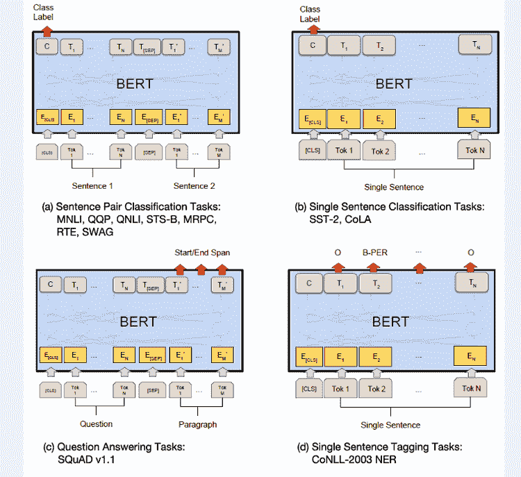

[Source](https://sh-tsang.medium.com/review-bert-pre-training-of-deep-bidirectional-transformers-for-language-understanding-59b1684882db)

### 实验

这里，我们展示了 BERT 在 11 个 NLP 任务上的微调结果。

### 胶

被称为[通用语言理解评估](https://openreview.net/pdf?id=rJ4km2R5t7) (GLUE)的基准是各种自然语言理解任务的汇编。

*   为了对 GLUE 进行微调，研究人员首先表示输入序列；然后，他们使用对应于第一个输入标记( **CLS** )的最终隐藏向量 C 作为集合表示。

> 微调过程中引入的唯一新参数是分类图层权重 R^K×H，其中 k 是标注的数量。我们用 c 和 w 计算标准分类损失，即 log(softmax(CW^T)).

*   对于所有粘合任务，他们采用 32 的批量大小，并对数据的三个时期进行微调。为开发集中的每个任务挑选最佳微调学习率(在 5e-5、4e-5、3e-5 和 2e-5 之间)。
*   BERTLARGE 微调在小数据集上不稳定，所以他们进行了多次随机重启，并在开发集上选择了最佳模型。随机重启采用相同的预训练检查点，但执行各种微调数据洗牌和分类器层初始化。结果如下所示。
*   与之前的最先进水平相比,**伯特 BASE** 和**伯特大型**实现的精度增益之间存在显著差距(分别为 4.5%和 7.0%)。
*   **伯特 BASE** 和 OpenAI [GPT](https://s3-us-west-2.amazonaws.com/openai-assets/research-covers/language-unsupervised/language_understanding_paper.pdf) 的一个显著区别是注意力掩蔽；他们的模型架构的其余部分本质上是相似的。对于最重要和最常见的胶合任务 MNLI，BERT 将绝对精度提高了 4.6%。**伯特拉杰**在 GLUE 官方排行榜 10 上排名高于开放联盟 [GPT](https://s3-us-west-2.amazonaws.com/openai-assets/research-covers/language-unsupervised/language_understanding_paper.pdf) ，得分 80.5。
*   伯特大的表现明显优于**伯特基地**，尤其是在需要少量训练数据的任务中。


GLUE Test results, scored by the evaluation server (https://gluebenchmark.com/leaderboard).

### 班 v1.1

斯坦福问答数据集(SQuAD v1.1)是 100k 众包问答对的集合。在回答问题任务中，研究人员使用 A 和 B 嵌入将输入的问题和段落表示为单个压缩序列。

在微调过程中，他们添加了一个起始向量 **S** 和一个结束向量 **E** 。使用 **Ti** 和 **S** 之间的点积以及段落中所有单词的软最大值来确定单词 **i** 成为答案范围开始的概率:


[Source](https://sh-tsang.medium.com/review-bert-pre-training-of-deep-bidirectional-transformers-for-language-understanding-59b1684882db)

从位置 I 移动到位置 j 的候选跨度的分数计算如下:


[Source](https://sh-tsang.medium.com/review-bert-pre-training-of-deep-bidirectional-transformers-for-language-understanding-59b1684882db)

> 我们表现最佳的系统在组合方面比排行榜系统高出 1.5 F1，在单一系统方面高出 1.3 F1。事实上，我们的单个 BERT 模型在 F1 分数方面优于顶级集成系统。

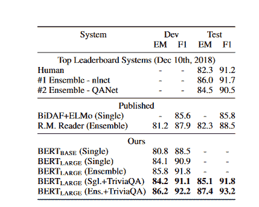

SQuAD 1.1 results.The BERT ensembleis 7x systems which use different pre-training check-points and fine-tuning seeds.

### 小队 2.0 版

小队 2.0 任务扩展了小队 1.1 问题的规范，允许给定段落不包括任何简短答案的可能性，使问题更加现实。为了实现这一目标，研究人员使用一种简单的策略来扩展 SQuAD v1.1 BERT 模型。他们认为没有答案的查询的答案跨度在 **CLS** 标记处开始和结束。

开始和结束回答跨度位置的概率空间已经扩展到包括 **CLS** 记号的位置。以下是与之前排行榜条目和不包括使用 BERT 的系统的顶级已发布作品的结果比较。**可以观察到比之前最好的系统提高了+5.1 F1**。

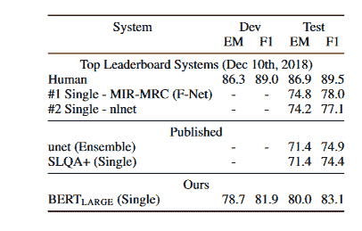

SQuAD 2.0 results. We exclude entries thatuse BERT as one of their components.

### 赃物

在评估基础常识的对立世代(SWAG)数据集的场景中有 113，000 个句子对完成示例。目标是从一组四个选项中选择最合理的延续。
通过创建四个输入序列来微调 SWAG 数据集是可行的，每个输入序列包含所提供的句子(句子 A)的潜在延续(句子 B)。

唯一引入的特定于任务的参数是向量的形式。这个向量与 **CLS** 符号表示 C 的点积表示每个可能选项的分数，然后使用 softmax 层将这个分数归一化。

> 我们用 2e-5 的学习速率和 16 的批量大小对模型进行了三个时期的微调。结果如下图所示。伯特拉格比作者的基准 ELMo 埃尔莫系统高出 27.1%，比开放的 GPT 高出 8.3%。"

### 消融研究

在本节中，作者对 BERT 的各种不同方面进行了消融实验，以便我们能够更好地理解这些方面的相对重要性。

### 培训前任务的效果

作者通过使用与 **BERTBASE** 相同的预训练数据、微调技术和超参数来评估两个预训练目标，强调了 BERT 深度双向性的重要性:

*   **无 NSP:** 双向模型，使用“掩码 LM”(MLM)进行训练，但不包括“下一句话预测”(NSP)任务。这种模式被称为“没有 NSP”
*   **LTR &没有 NSP:** 不是使用 MLM，而是使用典型的从左到右(LTR) LM 来训练只向左模型。微调也使用仅左侧限制，因为消除它会导致预训练/微调不匹配，从而降低性能。同样值得注意的是，模型的预训练中忽略了 NSP 任务。
*   LTR 模型在每项任务上的表现都比 MLM 模型差，MRPC 和 SQuAD 的下降尤为明显。
*   因为 SQuAD 中的令牌级隐藏状态不包括任何右侧上下文，所以很明显，在进行令牌预测时， **LTR** 模型的表现不会很好。在 **LTR** 系统之上，我们添加了一个随机初始化的 BiLSTM，这样我们就可以诚实地努力提高它的强度。尽管这极大地增强了 SQuAD 上的结果，但结果的质量仍然比预训练双向模型产生的结果低得多。**BiLSTM 损害了粘合任务的性能**。

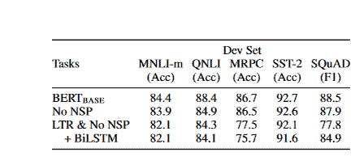

Ablation over the pre-training tasks using theBERTBASEarchitecture. “No NSP” is trained withoutthe next sentence prediction task. “LTR & No NSP” istrained as a left-to-right LM without the next sentenceprediction, like OpenAI GPT. “+ BiLSTM” adds a ran-domly initialized BiLSTM on top of the “LTR + NoNSP” model during fine-tuning

### 模型尺寸的影响

研究人员训练了一些具有不同层数、隐藏单元和注意头的 BERT 模型，同时使用相同的超参数和训练程序。

*   下图显示了一些不同粘合任务的结果。在此表中，我们提供了 5 次随机重新启动微调后的平均偏差设置精度。所有四个数据集都显示，较大的模型导致了准确性的一致提高，即使对于 MRPC，其仅包括 3600 个标记的训练样本，并且与预训练任务显著不同。
*   人们早就认识到，扩大模型规模将导致机器翻译和语言建模等大规模任务的不断进步，如下图中保留的训练数据的 LM 困惑所示。
*   然而，作者认为这是第一次令人信服地表明，给定一个适当的预训练模型，扩展到极端模型大小也导致小规模任务的可观收益。

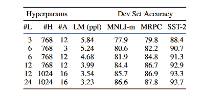

Ablation over BERT model size.#L = thenumber of layers; #H = hidden size; #A = number of at-tention heads. “LM (ppl)” is the masked LM perplexityof held-out training data.

### 基于特征的 BERT 方法

到目前为止提供的所有 BERT 结果都使用了微调方法。在该方法中，将基本分类层添加到预训练的模型，然后在下游任务上联合微调所有参数。在基于特征的技术中，固定特征取自预先训练的模型，这种技术提供了一些好处:

*   因为不是每个任务都可以用 Transformer 编码器架构来表示，所以必须引入一个特定于任务的模型。
*   其次，预先计算一次训练数据的高成本表示，然后在该表示的基础上用较便宜的模型运行许多测试，这在计算上有显著的优势。
*   为了避免微调方法，研究人员通过从一个或多个层提取激活来使用基于特征的技术。在分类层之前，这些上下文嵌入被馈入一个 768 维的具有随机初始化的两层结构的 BiLSTM。
*   结果如下图所示。 **BERTLARGE** 利用尖端技术提供竞争结果。连接预训练的 Transformer 的令牌表示的顶部四个隐藏层是性能最好的技术，它仅比微调整个模型落后 0.3 F1。关于微调和基于特性的过程，BERT 是一个极好的选择。

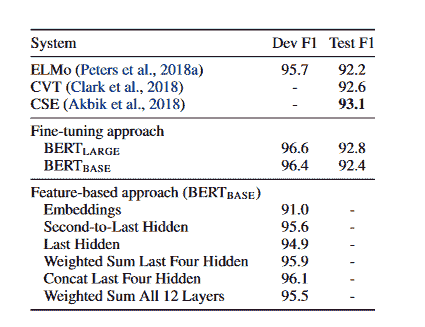

CoNLL-2003 Named Entity Recognition re-sults.Hyperparameters were selected using the Devset. The reported Dev and Test scores are averaged over 5 random restarts using those hyperparameters.

### 基于 BERT 的情感文本分类

在本教程的上下文中，我们将深入讨论如何实现与文本分类相关的 BERT 基本模型。我们将看到这种先进的 Transformer 模型如何针对大型数据集实现令人难以置信的高性能指标。

#### 运行时检查可用 GPU 和 RAM 分配的命令

```
gpu_info = !nvidia-smi
gpu_info = '\n'.join(gpu_info)
if gpu_info.find('failed') >= 0:
  print('Select the Runtime > "Change runtime type" menu to enable a GPU accelerator, ')
  print('and then re-execute this cell.')
else:
  print(gpu_info)
```

#### 安装所需的库

*   拥抱脸库(Transformers)的 transformer 包包含预先训练的语言模型。
*   [ktrain](https://github.com/amaiya/ktrain) 是深度学习库 TensorFlow Keras(和其他库)的轻量级包装器，它旨在帮助构建、训练和部署神经网络和其他机器学习模型。

```
!pip install ktrain
!pip install transformers
!pip install datasets
```

```
import numpy as np
import pandas as pd
import matplotlib.pyplot as plt
import seaborn as sns
import ktrain
from ktrain import text
import tensorflow as tf
from sklearn.model_selection import train_test_split
from datasets import list_datasets
from datasets import load_dataset
from sklearn.metrics import classification_report, confusion_matrix
import timeit
import warnings

pd.set_option('display.max_columns', None)
warnings.simplefilter(action="ignore")
```

#### 数据集加载

```
## Train and validation data
emotion_t = load_dataset('emotion', split='train')
emotion_v = load_dataset('emotion', split='validation')
print("\nTrain Dataset Features for Emotion: \n", emotion_t.features)
print("\nValidation Dataset Features for Emotion: \n", emotion_v.features)
## dataframe
emotion_t_df = pd.DataFrame(data=emotion_t)
emotion_v_df = pd.DataFrame(data=emotion_v)
label_names = ['sadness', 'joy', 'love', 'anger', 'fear', 'surprise'] 
```

#### 训练和验证数据分割

```
X_train = emotion_t_df[:]["text"]
y_train = emotion_t_df[:]["label"]
X_test = emotion_v_df[:]["text"]
y_test = emotion_v_df[:]["label"]

print(X_train.shape, y_train.shape, X_test.shape, y_test.shape)
```

#### 实例化一个 BERT 实例

使用模型名称、最大令牌长度、将用于每个类别的标签以及批量大小来构建 BERT 的实例。

```
bert_transformer = text.Transformer('bert-base-uncased', maxlen=512, classes=label_names, batch_size=6)
```

#### 执行数据预处理

在预处理之前，我们必须将拆分后的数据转换成列表。

```
bert_train = bert_transformer.preprocess_train(X_train.to_list(), y_train.to_list())
bert_val = bert_transformer.preprocess_test(X_test.to_list(), y_test.to_list())
```

#### 在 Ktrain 学习者对象中编译 BERT

因为我们使用 ktrain 作为高级抽象包，所以我们需要将我们的模型包装在 k-train 学习器对象中，以便进一步计算。要使用 ktrain，我们需要做的就是将我们的模型和数据放在一个 **ktrain 中。通过使用 **get_learner** 函数获得的学习者**对象。

```
 bert_model = bert_transformer.get_classifier()
bert_learner_ins = ktrain.get_learner(model=bert_model,
                            train_data=bert_train,
                            val_data=bert_val,
                            batch_size=6)
```

#### 最佳学习率

这一步是可选的，仅用于演示如何为任何变压器模型确定学习率。变压器模型的最佳学习率已在研究论文中确定和定义(在 5e-5、4e-5、3e-5 和 2e-5 之间)。方法 **lr_find()** 模拟训练寻找最优学习率。

```
rate_bert_start_time = timeit.default_timer() ## we mesure the execution time ##using the function timeit()
bert_learner_ins.lr_find(show_plot=True, max_epochs=3)
rate_bert_stop_time = timeit.default_timer()
print("\nTotal time in minutes on estimating optimal learning rate: \n", (rate_bert_stop_time - rate_bert_start_time)/60)
```

输出:

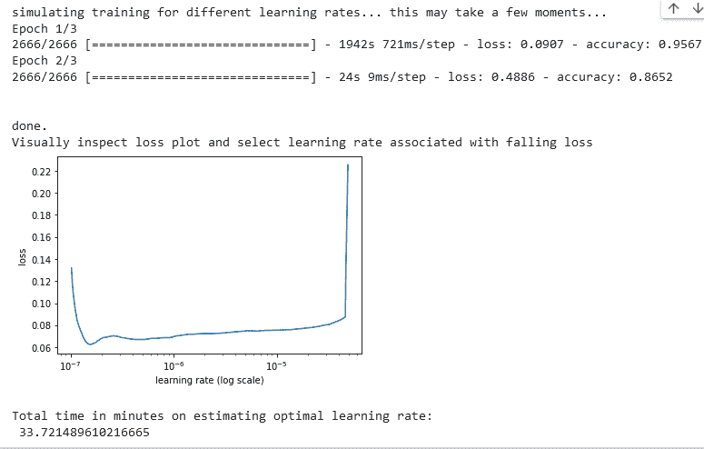

#### 在情感数据集上微调 BERT

我们通过采用我们的情感数据集和我们建立的 BERT 模型并指定学习速率和要利用的时期的数量来开始微调过程。 **fit_onecycle()** 方法在训练周期的前半段将学习速率从基本速率提升至最大值，然后在后半段逐渐降低至接近零的值。 **fit_onecycle()** 采用[1 周期策略](https://arxiv.org/pdf/1803.09820.pdf)

```
## Fine tuning BERT on Emotion Dataset
## we mesure the execution time using the function timeit()
bert_fine_tuning_start= timeit.default_timer()
bert_learner_ins.fit_onecycle(lr=2e-5, epochs=3) ##1cycle learning rate ##schedule for 3 epochs
bert_fine_tuning_stop = timeit.default_timer()
print("\nFine-Tuning time for BERT on Emotion dataset: \n", (bert_fine_tuning_stop - bert_fine_tuning_start)/60, " min")
```

**注**:读者可以自己运行那些操作并欣赏结果。

#### 检查 BERT 性能指标

```
## Performation metrics of Bert model on emotion dataset
## we mesure the execution time using the function timeit
bert_validation_start= timeit.default_timer()
bert_learner_ins.validate()
bert_validation_stop= timeit.default_timer()
print("\nInference time for BERT on Emotion dataset: \n", (bert_validation_stop - bert_validation_start), " sec")
```

输出:

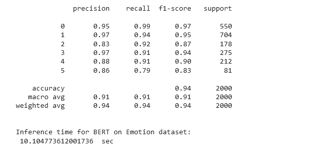

上述结果表明，我们已经获得了 94%的准确率。

#### 检查每个标签的性能指标

```
## Here we can get the performance metric for each label
bert_learner_ins.validate(class_names=label_names)
```

输出:

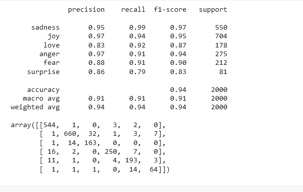

#### 保存伯特模型

```
bert_predictor = ktrain.get_predictor(bert_learner_ins.model, preproc=bert_transformer)
bert_predictor.get_classes()
```

使用 **save()** 方法将 Bert 模型保存到当前目录中

```
bert_predictor.save('/path/bert-pred-emotion')
```

### 伯特的一些变体

### RoBERTa:一种鲁棒优化的 BERT 预训练方法

在这篇[论文](https://arxiv.org/pdf/1907.11692.pdf)中，作者报告了一项关于 BERT 预训练的重复研究，其中包括对超参数调整和训练集大小的影响的全面分析。该论文表明 BERT 训练严重不足，并提供了 RoBERTa，一种更有效的训练 BERT 模型的方法，可以达到与任何后 BERT 技术相当或更好的性能。我们的调整非常简单，包括以下内容:

1.  使用更多数据的更大批量对模型进行更长时间的定型。
2.  消除了下一句预测目标。
3.  接受更长序列的训练。
4.  动态更改了用于训练数据的掩码模式。

#### 静态屏蔽与动态屏蔽

BERT 使用随机令牌屏蔽和预测系统。
在第一个 BERT 实现中，在数据预处理期间仅执行一次屏蔽，从而产生静态屏蔽。作者针对动态掩蔽来评估这种方法，在动态掩蔽中，每次序列被馈送到模型中，都会生成一个**新的掩蔽模式。这对于较大的数据集或在预训练过程中增加更多步骤是至关重要的。**

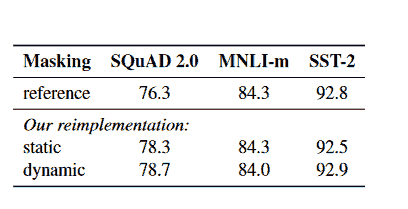

[Source](https://arxiv.org/pdf/1907.11692.pdf)

#### 模型输入格式和下一句预测

在原始的 BERT 预训练过程中，该模型从两个连接的文档段中获取信息，这两个文档段或者是从同一文档(p = 0.5)中连续采样的，或者是从不同的文档中采样的。
除了屏蔽的语言建模目标之外，辅助的下一个语义预测(NSP)损失用于训练模型，以确定观察到的文档片段是来自相同的还是不同的文档。

> 接下来，我们比较没有 NSP 损失的训练和具有来自单个文档的文本块(文档句子)的训练。我们发现这个设置优于最初发表的 BERTBASE 结果，并且消除 NSP 损失匹配或稍微改善下游任务性能

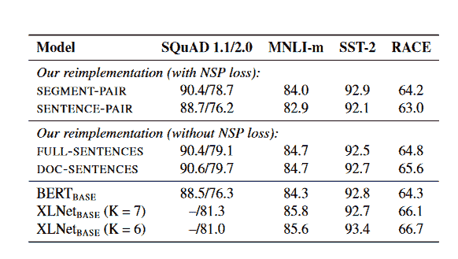

#### 大批量培训

神经机器翻译领域的研究表明，随着学习率的适当增加，用非常大的小批量进行训练可以提高优化速度和最终任务性能。**大批量训练被证明增加了掩蔽语言建模目标的复杂性和最终任务的准确性。**

#### 文本编码

字节对编码(Byte-Pair Encoding，BPE)能够容纳自然语言语料库中的大量词汇，是一种结合了字符级和单词级编码的代表性方法。BPE 使用子词单元而不是整个单词；这些单元通过对训练语料库的统计分析来检索。BPE 词汇表的大小通常在 10K-100K 子词单位之间。

#### 基于 RoBERTa 的情感文本分类

我们必须遵循与 BERT 相同的过程，只是在这里，要实例化 RoBERTa，只需编写:

```
roberta_transformer = text.Transformer('roberta-base', maxlen=512, classes=class_label_names, batch_size=6)
```

### 蒸馏伯特，伯特的蒸馏版本:更小，更快，更便宜，更轻

通过这篇[论文，](https://arxiv.org/pdf/1910.01108.pdf)研究人员提供了一种预训练紧凑的通用语言表示模型 DistilBERT 的方法，该模型可以进行微调，以在各种应用程序上实现出色的性能。他们在预训练阶段使用知识提炼，将 BERT 模型的规模缩小了 40%，同时保持了 97%的语言理解能力，并且速度提高了 60%。作者提供了一个三重损失，它集成了语言建模、蒸馏和余弦距离损失，以利用预训练期间大型模型学习到的归纳偏差。

#### 知识蒸馏

[知识蒸馏](https://neptune.ai/blog/knowledge-distillation)是蒸馏过程中采用的一种压缩方法。这种方法包括训练一个较小的模型(称为学生)来模仿一个较大的模型(称为教师)或一组模型的行为。学生被训练有超过教师软目标概率的蒸馏损失:


[Source](https://sh-tsang.medium.com/review-distilbert-a-distilled-version-of-bert-smaller-faster-cheaper-and-lighter-5b3fa180169e)

其中 **ti** (resp。 **si)** 是老师估计的概率(resp。学生)。这个目标通过充分利用教师
分布产生了丰富的培训信号。Softmax-temperature 用于此目的:


[Source](https://sh-tsang.medium.com/review-distilbert-a-distilled-version-of-bert-smaller-faster-cheaper-and-lighter-5b3fa180169e)

其中 **T** 确定输出分布有多平滑，并且 **zi** 是类 **i** 的模型分数。在训练期间，学生和老师的温度保持不变；然而，在推断期间， **T** 被设置为 **1** 以恢复典型的 softmax。

为了达到最终的训练目标，研究人员将提取损失与监督训练损失线性结合，这就是掩蔽语言建模损失。为了对齐学生和教师隐藏状态向量的方向，他们发现添加余弦嵌入损失( **Lcos** )是有益的。

#### 蒸馏伯特:伯特的蒸馏版本

**distill BERT 是 BERT 的学生，有类似的架构**。去除了令牌类型嵌入和池化器，并且层的总数减少了 1/2。
研究表明，与层数等其他因素的变化相比，张量最后一个维度(隐藏大小维度)的变化对计算效率的影响较小(对于固定的参数预算)，并且 Transformer 架构中使用的大多数操作(线性层和层归一化)在现代线性代数框架中得到高度优化。因此，我们集中精力减少 T4 的层数。

#### 基于蒸馏词的情感文本分类

我们必须遵循与 BERT 相同的过程，只是在这里，要实例化 DistilBERT，只需编写:

```
distilbert_transformer = text.Transformer('distilbert-base-uncased', maxlen=512, classes=class_label_names, batch_size=6)
```

### ALBERT:一个用于语言表达自我监督学习的 LITE BERT

语言表征学习领域的成功可以追溯到整个网络预训练的引入。这些预先训练好的模型对于各种非平凡的 NLP 应用都是有益的，包括那些训练数据有限的应用。为中国初中和高中英语考试(RACE test)设计的阅读理解任务的机器改进是这些进步最显著的标志之一。这些进步表明，拥有规模可观的网络对于实现最佳性能至关重要。预先训练较大的模型，然后将其提炼为较小的模型以供实际使用，这是现在的标准程序。由于模型大小的重要性，研究人员询问:拥有更好的 NLP 模型和拥有更大的模型一样容易吗？

当前的硬件无法存储足够数量的数据，这限制了对这个问题的满意回答。我们今天使用的最先进的模型通常包括数亿甚至数十亿个参数，使得当研究人员试图缩放我们的模型时，很容易跨越这些限制。因为通信开销与模式中的参数数量成比例，所以分布式训练也可能大大降低训练速度。

模型并行化和智能内存管理是当前解决上述问题的方法。内存限制得到了解决，但通信开销却没有。**为了解决这些问题，[本文的作者](https://arxiv.org/pdf/1909.11942.pdf)设计了一种 Lite BERT(阿尔伯特)架构，它使用的参数比传统的 BERT 设计少得多。**

#### 还原技术

ALBERT 设计的核心是一个具有 [GELU](https://arxiv.org/pdf/1606.08415.pdf) 非线性的变压器编码器，与 BERT 中的一样。遵循 BERT 符号建立的准则，作者使用符号“E”表示词汇嵌入的大小，“L”表示编码器层数，“H”表示隐藏大小。他们将前馈/滤波器大小设置为 4H，注意头的数量设置为 H/64。

ALBERT 使用的参数缩减技术消除了扩展预训练模型的两个主要障碍。

##### 分解嵌入参数化

首先我们有一个**因式分解的嵌入参数化**:这里隐藏层的大小与词汇嵌入的大小无关，通过将大词汇嵌入矩阵分解成两个微小的矩阵来实现。这种分离使得在不显著增加词汇嵌入的参数大小的情况下增加隐藏大小变得更加容易。

> 单词块嵌入尺寸 E 与隐藏层尺寸 H 联系在一起，即 E ≡ H。这个决定看起来不是最佳的。从建模的角度来看，单词块嵌入意味着学习与上下文无关的表示，而隐藏层嵌入意味着学习与上下文相关的表示。

使用上下文作为学习上下文相关表示的信号是类 BERT 表示的亮点。因此，作者通过将单词块嵌入尺寸 e 与隐藏层尺寸 h 解耦，更有效地使用整体模型参数，如建模要求(H **≫** E)所规定的

在自然语言处理中，出于实用目的，大词汇量 V 通常是必要的。如果 E≡H，则嵌入矩阵的大小 V×E 与 H 成比例增长。因此，得到的模型可能有数十亿个参数。

首先，将独热向量投影到大小为 E 的嵌入空间，然后投影到大小为 H 的隐藏空间。使用这种分解，它们将嵌入参数从 O(V×H)减少到 O(V×E+E×H)。**当 H≫E** 出现以下情况时，该参数的减少是显著的

##### 跨层参数共享

第二种技术是**跨层参数共享。**使用这种方法，参数的大小不会随着网络变深而增加。这两种方法都显著减少了 BERT 参数的数量，而不会严重影响性能，从而提高了参数效率。具有与 BERT-large 相同功能的 ALBERT 配置可以用少于 18 倍的参数训练快约 1.7 倍。

> 有多种方式来共享参数，例如，仅跨层共享前馈网络(FFN)参数，或者仅共享注意力参数。ALBERT 的默认决定是跨层共享所有参数。

参数缩减技术也用作一种正则化，这有助于稳定训练并有助于泛化。

#### 句际连贯缺失

伯特使用了一种称为下一句话预测(NSP)的损失。NSP 损失基于二元分类预测两个片段是否在原始文本中连续出现。为了生成正例，我们从训练语料库中选择连续的片段；为了生成反例，我们耦合来自不同文档的片段；我们以相等的概率随机抽取正面和负面的例子。创建 NSP 目标是为了提高下游任务的性能，如自然语言推理，这需要对句子之间的关系进行推理。

然而，进一步的研究得出结论，NSP 的影响是不一致的，并选择取消它；这是由各种任务的下游任务性能的提高所支持的。通过为**句序预测(SOP)** 引入自我监督损失，ALBERT 的性能得到进一步增强。因为最初的 BERT 中提出的下一句预测(NSP)损失是无效的，所以 SOP 现在专注于增强句子之间的连贯性。

#### 模型设置

与 BERT-large 相比，ALBERT-large 使用的参数少了约 1800 万个。在 H = 2048 的 ALBERT-xlarge 配置中只有 60M 个参数，在 H = 4096 的 ALBERT-xxlarge 配置中有 233M 个参数；这大约是 BERT-large 中 70%的参数。请注意，对于 ALBERT-xxlarge，我们主要报告 12 层网络
上的结果，因为 24 层网络(具有相同的配置)获得类似的结果，但计算成本更高。


The configurations of the main BERT and ALBERT models analyzed in the paper.

ALBERT-xxlarge 在计算上更昂贵，比 BERT-large 具有更少的参数和更好的结果。因此，下一步的关键是用像[分散注意力](https://arxiv.org/pdf/2104.07012.pdf)这样的技术来提高艾伯特的训练和推理速度。

#### 基于 ALBERT 的情感文本分类

我们必须遵循与 BERT 相同的过程，只是在这里，要实例化 ALBERT，只需编写:

```
albert_transformer = text.Transformer('albert-base-v1', maxlen=512, classes=class_label_names, batch_size=6)
```

### 结论

使用语言模型的迁移学习，研究人员表明预训练是许多语言理解系统的重要组成部分。由于这些发现，深度单向架构现在甚至可以用于低资源任务。研究人员已经将这些发现扩展到深度双向架构，这样一个单独的预训练模型就可以处理广泛的 NLP 任务。

虽然 BERT、Albert 和 Roberta 是三个最著名的变压器，但许多其他著名的变压器也达到了可比拟的最先进的性能。我们可以提到 [XLNet](https://arxiv.org/pdf/1906.08237.pdf) ，BART，Mobile-BERT，还有很多其他的。
基于 Transformer-XL 模型，XLNet 是一个自回归语言模型，它利用[置换语言建模](https://towardsdatascience.com/permutative-language-modeling-explained-9a7743d979b4)来提供可与 Roberta 相媲美的最先进的结果。关于自然语言理解(NLU)任务，BART 是另一个与 Roberta 竞争良好的预训练模型。此外，BART 的与众不同之处在于它在自然语言生成(NLG)任务(如抽象摘要)方面表现出色。

### 参考

伯特:[https://arxiv.org/pdf/1810.04805.pdf](https://arxiv.org/pdf/1810.04805.pdf)
艾伯特:[https://arxiv.org/pdf/1909.11942.pdf](https://arxiv.org/pdf/1909.11942.pdf)
迪翁伯特:[https://arxiv.org/pdf/1910.01108.pdf](https://arxiv.org/pdf/1910.01108.pdf)
罗伯塔:[https://arxiv.org/pdf/1907.11692.pdf](https://arxiv.org/pdf/1907.11692.pdf)
[https://towardsdatascience . com/everything-you-need-to-know-about-ALBERT-RoBERTa-and-DistilBERT-11a 74334 B2 da](https://towardsdatascience.com/everything-you-need-to-know-about-albert-roberta-and-distilbert-11a74334b2da)
[https://sh-tsang . medium . com/review-BERT-pre](https://sh-tsang.medium.com/review-bert-pre-training-of-deep-bidirectional-transformers-for-language-understanding-59b1684882db)