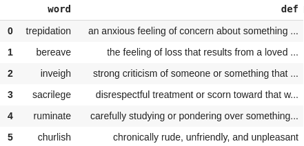
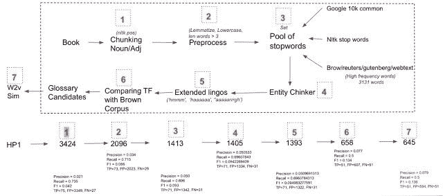
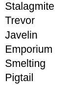
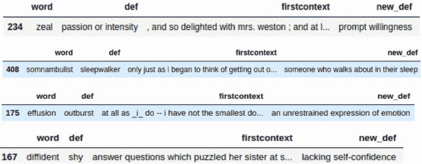

# 使用自然语言处理技术从文本中自动提取术语和定义

> 原文：<https://blog.paperspace.com/adaptive-testing-and-debugging-of-nlp-models-research-paper-explained/>

根据[维基百科](https://en.wikipedia.org/wiki/Glossary)——术语表，也称为词汇表，是特定知识领域中按字母顺序排列的术语列表，包含这些术语的定义。传统上，术语表出现在书的末尾，包括书中新介绍的、不常见的或专门的术语。然而，定义是解释术语含义的陈述。给定足够的“常识”和“背景知识”，一份好的词汇表可以使文本易于理解。

在这篇博文中，我们将重点关注构建一个[无人监管的](https://en.wikipedia.org/wiki/Unsupervised_learning) NLP 管道，用于从给定的文本文档(如一本书/一章/一篇文章)中自动提取/生成词汇表和相关定义。手动生成术语表及其定义是一项耗时且繁琐的任务。通过我们的管道，我们的目标是大大减少这种努力，增加作者的建议，同时仍然使他们的裁决成为选择期间的最终裁决。

## 数据集集合

我们将建立一个几乎无人监管的系统，因此为了评估我们的管道输出，我们将从从古腾堡项目中抽取 50 部小说/非小说开始。 **古腾堡计划**是一个拥有超过 60，000 本免费电子书的图书馆——对读者完全免费。下载完书籍后，下一个任务是获取它们的术语表和相关定义。我们可以使用 [GradeSaver](https://www.gradesaver.com/) 来获取这些信息。 ****GradeSaver**** 是全球顶尖的编辑和文学网站之一。这样，我们就有了一些地面实况数据，可以用来评估我们提议的管道是否良好。

接下来，让我们看看提取小说的代码、相关的术语表和定义

### 从古登堡计划中提取小说的代码

```
from bs4 import BeautifulSoup
import requests
import pandas as pd
import glob
import string
import os
import codecs

BASE_BOOK_URL = 'https://www.gutenberg.org/browse/scores/top'

html = requests.get(BASE_BOOK_URL).text
soup = BeautifulSoup(html)

unq_code = {}
for s in soup.findAll('li'):
    url = s.a['href']
    if 'ebooks' in url:
    	url_str = url.split('/')[-1]
        if url_str!='':
            unq_code[url.split('/')[-1]] = s.a.text

BOOK_TXT_BASE = 'https://www.gutenberg.org/files/'
book_urls = []
for code in unq_code:
    book_urls.append(os.path.join(BOOK_TXT_BASE,f'{code}/{code}-0.txt'))

for b in book_urls:
    name = b.split('/')[-2]
    html = requests.get(b).text
    with codecs.open(f'book/{name}.txt', 'w', 'utf-8') as infile:
        infile.write(html)
```

Extracting Novels from Project Gutenberg

从上面的片段中可以看出，我们使用 [BeautifulSoup python 库](https://pypi.org/project/beautifulsoup4/)从热门列表 url 中提取每部小说的唯一代码。这些列表是基于每本电子书被下载的次数。接下来，如果从 BOOK_TXT_BASE url 中存在该书的“纯文本 UTF-8”版本，我们将模拟点击功能并提取小说的原始文本。最后，我们下载每一部小说，并按照适当的命名规则保存在我们想要的位置。

### 从 GradeSaver 中提取术语表和定义的代码

```
BASE_GLOSS_URL = 'https://www.gradesaver.com/'
TERMINAL = '/study-guide/glossary-of-terms'

def punctuations(data_str):
    data_str = data_str.replace("'s", "")
    for x in data_str.lower():
        if x in string.punctuation: 
            data_str = data_str.replace(x, "")
    return data_str

for book in glob.glob('book/*'):
    code = book.split('/')[-1].split('.')[0]

    try:
        bookname = unq_code[code]
        bookname = bookname.split(' by ')[0].lower()
        bookname = punctuations(bookname)
        bookname = bookname.replace(" ", "-")
        html = requests.get(BASE_GLOSS_URL+bookname+TERMINAL).text
        soup = BeautifulSoup(html)
        tt = []
        for term in soup.findAll("section", {"class": "linkTarget"}):
            tt.append(
            		[term.h2.text.lower().strip(),
                	term.p.text.lower().strip()]
                )
        if len(tt):
            print (f'Done: {bookname}')
            data = pd.DataFrame(tt, columns=['word', 'def'])
            data.to_csv(f'data/{code}.csv', \
                                sep='\t', \
                                encoding='utf-8', \
                                index=False)
        else:
            print (f'Skipped: {bookname}')
    except Exception as e: print (e)
```

Extracting Glossary and Definitions from GradeSaver for novels extracted from Project Gutenberg

从上面的片段中可以看出，我们再次使用 BeautifulSoup python 库从 GradeSaver 数据库中提取每本书的术语表和相关定义。下图显示了作为上述代码片段的一部分生成的文件



DataFrame of Word & Definitions from GradeSaver

## 词汇抽取方法

我们通过提出一个[分块](https://www.geeksforgeeks.org/nlp-chunking-and-chinking-with-regex/)管道来完成词汇表提取的任务，该管道在每一步都从整个列表中删除不太重要的候选词汇表单词。最后，我们有一个基于[语义相似度](https://en.wikipedia.org/wiki/Semantic_similarity)的排名函数，它计算每个词汇表单词与上下文的相关性，并相应地对词汇表列表中的单词进行优先级排序。

我们根据从特定小说的 GradeSaver 获得的真实情况，评估我们在[精度、召回和 F1 分数](https://towardsdatascience.com/accuracy-precision-recall-or-f1-331fb37c5cb9)上的管道输出。精确度衡量的是，根据现有的事实，词汇表中产生的单词有多少是正确的。回忆测量所提出的方法产生/遗漏了多少基本事实词汇。F1 分数只是精度和召回率的单一数字表示(表示为精度(P)和召回率(R)的调和平均值)。

此外，为了简单起见，我们的目标是只提取[单字](https://machinelearningknowledge.ai/generating-unigram-bigram-trigram-and-ngrams-in-nltk/)，或单个单词，即词汇表级别的单词。下图显示了整个流程-



Pipeline for Extracting Glossary words from Text

如上图所示，我们从一本样本书开始，使用 [NLTK 库](https://www.nltk.org/)从中提取名词和形容词。在第二步中，我们做了一些预处理，如[词汇化](https://nlp.stanford.edu/IR-book/html/htmledition/stemming-and-lemmatization-1.html)、小写和最小单词长度限制(长度非常小的单词很可能是杂散标记、限定词、首字母缩写词等)，并且可能不一定具有成为词汇表单词的复杂含义。在步骤 3 中，我们过滤所有的常用词，并且我们通过考虑三个不同的通用来源来生成这样的词的集合，即，Google books 常用词、NLTK 停用词以及来自所选语料库的高频词，如 Brown、Reuters 等。因此，位于这些语料库的单词联合列表中的任何候选词汇表单词都会被立即丢弃。在第四步中，我们移除在某种意义上是任何种类的实体的单词(使用[空间](https://spacy.io/))。在第 5 步中，我们使用正则表达式删除扩展的隐语。在第 6 步中，我们试图根据[词频](https://kavita-ganesan.com/what-is-term-frequency/) (TF)选择对我们的语料库更具体的单词，而不是其他一些全球语料库。

最后，我们继续进行下一步，根据候选人的相关性分数对他们进行排名。我们将相关性度量定义为候选词汇表和语料库之间的余弦相似度。分数越高，术语表关键字与底层语料库的相关性就越大。在上图中，我还提到了对 P、R 和 F1 分数的逐步影响。使用上述技术，我们能够达到 0.07 的精确度、0.5 的召回率和 0.13 的 F1。

在下图中，我们展示了我们提出的系统从《哈利·波特》第一部中提取的一些有价值词汇的结果。



Glossary words extracted by our system

### 一些没有成功的实验

*   实验了基于[图的单词/短语排序方法- TextRank](https://web.eecs.umich.edu/~mihalcea/papers/mihalcea.emnlp04.pdf) 来直接提取候选词汇表单词，而不是上述的名词-形容词组块策略。
*   我们认为单词的复杂性是词汇表中单词应该是什么样的一个很好的指标。为此，我们考虑了书面语和口语的复杂性。

-我们使用 [Flesch-Kincaid Grade Level](https://en.wikipedia.org/wiki/Flesch%E2%80%93Kincaid_readability_tests) 度量来测试书写的复杂性。

-我们计算存在的[个音素](https://en.wikipedia.org/wiki/Phoneme)的数量，以此来衡量说话的复杂程度。

*   我们还尝试基于[密集向量表示](https://medium.com/nerd-for-tech/nlp-zero-to-one-dense-representations-word2vec-part-5-30-9b38c5ccfbfc)和其他自定义特征(如复杂性、单词长度、相关性等)形成单词簇。并希望看到一个单独的值得使用词汇表的集群。

## 定义提取/生成方法

定义由两部分组成，定义和定义。 **definiendum** 是要定义的元素。**定义**提供定义的含义。在一篇写得很好的简单文章中，定义词和被定义词经常被一个动词或标点符号连接起来。我们将给定上下文中给定词汇表单词的定义提取/生成任务视为三步流水线(基于规则的挖掘- >基于 WordNet 的选择- >基于 GPT-2 的生成)，每一步都有退出选项。让我们详细讨论每一个问题-

### 基于规则的挖掘

在基于规则的挖掘中，我们定义某些[语法结构](https://towardsdatascience.com/implementing-hearst-patterns-with-spacy-216e585f61f8)，用于从文本中提取给定关键字的定义结构。我们形成的一些模式是，例如— X 定义为 Y，X 是一个 Y，等等。这里，X 是词汇表中的单词或定义，Y 应该是含义或定义。我们使用正则表达式模式来实现这个步骤。

### 基于 WordNet 的选择

下一步是使用基于 WordNet 的选择策略来提取给定词汇表单词的相关定义。下图详细说明了整个过程-


WordNet-based Definition Extraction

我们首先使用 [WordNet](https://wordnet.princeton.edu/) 库为上一步中找到的每个词汇表单词找到 k 个含义(一个含义就是一个意思)。我们还从文本中提取这个词汇表单词出现的第一个上下文，作为潜在的定义。通过在词汇表单词周围设置 K 个单词的窗口来定义上下文。这里只选择第一个上下文(用紫色标记)的假设是，书/文本的作者可能会在文献中尽可能早地定义或解释该词，然后在需要时重新使用它。我们知道这个假设主要适用于较长的文本，如书籍、小说等——这反映了我们的数据集。

对于给定词汇表单词的 k 个义项集合中的每个唯一义项，我们提取定义、相关示例，并与第一个上下文文本进行余弦相似性。这有助于消除歧义，并有助于为给定的单词选择最合适的含义/意义/定义。作为设计实现的一部分，人们可以选择根据相似性得分来选择顶部意义，或者可能希望根本不选择任何内容，并退回到定义提取/生成管道中的第三步。

在下图中，我们基于 WordNet 选择方案给出了定义**(列 new_def)** 。



Definitions extracted as per WordNet selection method

### 从 WordNet 中提取定义的代码

我们首先从文本中获取词汇表单词的第一个出现的上下文。

```
import codecs
import os
import pandas as pd
import glob
import nltk
nltk.download('punkt')
from nltk.corpus import PlaintextCorpusReader

def get_context(c):
    try:
        result = text.concordance_list(c)[0]
        left_of_query = ' '.join(result.left)
        query = result.query
        right_of_query = ' '.join(result.right)
        return left_of_query + ' ' + query + ' ' + right_of_query
    except:
        return ''

generated_dfs = []
BASE_DIR = 'data'
for book in glob.glob('book/*'):
    book_name = book.split('/')[-1].split('.')[0]
    try:
        DATA_DIR = codecs.open('book/' + book_name + '.txt', \
        						'rb', \
                                encoding='utf-8').readlines()
        true_data = pd.read_csv(
        			'data/'+book_name+'.csv', \
        			sep='\t')
        full_data = ' '.join([i.lower().strip() for i in DATA_DIR if len(i.strip())>1])
        tokens = nltk.word_tokenize(full_data)
        text = nltk.Text(tokens)
        true_data['firstcontext'] = true_data['word'].map(lambda k: get_context(k))
        generated_dfs.append(true_data)
    except Exception as e:
        pass

final_df = pd.concat(generated_dfs[:], axis=0)
final_df = final_df[final_df['firstcontext']!='']
final_df = final_df[['word', 'def', 'firstcontext']].reset_index()
final_df.head(5)
```

Getting 1st context for Glossary words extracted from the previous step (chunking+relevance pipeline)

下图显示了上述片段的输出数据框-


DataFrame with First Context from Text

接下来，我们使用 [gensim KeyedVectors](https://radimrehurek.com/gensim/models/keyedvectors.html) 加载单词向量。我们还将句子表征定义为句子中出现的单词向量的平均值。

```
import gensim
from gensim.models import Word2Vec
from gensim.utils import simple_preprocess
from gensim.models.keyedvectors import KeyedVectors
import numpy as np
from gensim.models import KeyedVectors

filepath = "GoogleNews-vectors-negative300.bin"
wv_from_bin = KeyedVectors.load_word2vec_format(filepath, binary=True) 

ei = {}
for word, vector in zip(wv_from_bin.index_to_key, wv_from_bin.vectors):
    coefs = np.asarray(vector, dtype='float32')
    ei[word] = coefs

def avg_feature_vector(sentence, model, num_features):
    words = sentence.split()
    #feature vector is initialized as an empty array
    feature_vec = np.zeros((num_features, ), dtype='float32')
    n_words = 0
    for word in words:
        if word in embeddings_index.keys():
            n_words += 1
            feature_vec = np.add(feature_vec, model[word])
    if (n_words > 0):
        feature_vec = np.divide(feature_vec, n_words)
    return feature_vec
```

Sentence representation with Word2Vec

接下来，我们连接 WordNet 库中存在的每个词义和示例的定义，并计算它与文本中词汇表单词的第一个上下文之间的语义相关性。最后，我们挑选具有最大相似性的一个作为候选定义。

```
def similarity(s1, s2):
    s1_afv = avg_feature_vector(s1, model=ei, num_features=300)
    s2_afv = avg_feature_vector(s2, model=ei, num_features=300)
    cos = distance.cosine(s1_afv, s2_afv)
    return cos

for idx in range(final_df.shape[0]):
    fs = final_df.iloc[idx]['firstcontext']
    w = final_df.iloc[idx]['word']
    defi = final_df.iloc[idx]['def']
    syns = wordnet.synsets(w)
    s_dic={}
    for sense in syns:
    	def,ex = sense.definition(), sense.examples()
        sense_def = def + ' '.join(ex)
        score = similarity(sense_def, fs)
        s_dic[def]=score

    s_sort = sorted(s_dic.items(), key=lambda k:k[1],reverse=True)[0]
    final_df['new_def'][idx]=s_sort[0]
    final_df['match'][idx]=s_sort[1]
```

### 基于 GPT-2 的一代

这是我们的定义提取/生成管道中的最后一步。在这里，我们在来自[城市词典](https://www.kaggle.com/therohk/urban-dictionary-words-dataset)的公开可用的定义数据集上微调了一个中型的、预先训练好的 [GPT-2 模型](https://en.wikipedia.org/wiki/GPT-2)。我们从数据集中的 250 万个数据样本中挑选短语及其相关定义。为了进行微调，我们使用特殊的标记来格式化我们的数据记录，这有助于我们的 GPT-2 模型充当基于特定前缀文本的条件语言生成模型。

#### 如何将 Kaggle 数据加载到渐变笔记本中

1.  获得一个 Kaggle 帐户
2.  转到您的帐户设置创建一个 api 令牌，并保存 kaggle.json。注意:如果您已经创建了一个 API 令牌，您可能需要创建一个新的 API 令牌。
3.  将 kaggle.json 上传到此渐变笔记本
4.  运行下面的单元格或在终端中运行以下命令(这可能需要一段时间)

>注意:不要共享启用了 api 密钥的笔记本

现在在终端中:

mkdir ~/。kaggle/

mv kaggle.json ~/。kaggle/

pip 安装卡格尔

kaggle 数据集下载 thero hk/urban-dictionary-words-dataset

kaggle 数据集下载 adarshsng/googlenewsvectors

1.  **训练循环- I/O 格式-** < |startoftext| >字<定义>含义< |endoftext| >
2.  **测试循环-输入格式-** < |startoftext| >字<定义> **/输出格式-** 含义< |endoftext| >

这里，和是文本序列开始和结束的特殊标记，`<define>`是提示标记，告诉模型开始为现有单词生成定义。

我们首先加载包含单词和定义的城市字典数据集，如下所示

```
import pandas as pd

train = pd.read_csv(
		  'urbandict-word-defs.csv', \
                    nrows=100000, \
                    error_bad_lines=False
                    )

new_train = train[['word', 'definition']]
new_train['word'] = new_train.word.str.lower()
new_train['definition'] = new_train.definition.str.lower()
```

Loading subset of UrbanDictionary dataset

接下来，我们选择适当的设备并加载相关的 GPT-2 令牌化器和模型

```
import torch
from transformers import GPT2Tokenizer, GPT2LMHeadModel
import numpy as np

import os
from tqdm import tqdm

import logging
logging.getLogger().setLevel(logging.CRITICAL)

import warnings
warnings.filterwarnings('ignore')

device = 'cpu'
if torch.cuda.is_available():
    device = 'cuda'

tokenizer = GPT2Tokenizer.from_pretrained('gpt2-medium')
model = GPT2LMHeadModel.from_pretrained('gpt2-medium')
```

接下来，我们定义 dataset 类来适当地格式化每个输入示例。因为我们使用自回归模型来生成以前缀文本为条件的文本，所以我们定义了一个触发标记 **<定义** > **分隔单词和相关联的定义。我们还为每个输入示例添加了开始和结束文本标记，以使模型知道开始和结束提示。我们还将从批量大小为 4 的数据集创建一个数据加载器，并将 shuffling 设置为 true，使我们的模型对原始数据集中可能存在的任何隐藏模式都具有鲁棒性。**

```
from torch.utils.data import Dataset, DataLoader
import os
import json
import csv

class GlossaryDataset(Dataset):
    def __init__(self, dataframe):
        super().__init__()

        self.data_list = []
        self.end_of_text_token = "<|endoftext|>"
        self.start_of_text_token = "<|startoftext|>"

        for i in range(dataframe.shape[0]):
            data_str = f"{self.start_of_text_token} \
            			{new_train.iloc[i]['word']} \
            			<DEFINE> \
            			{new_train.iloc[i]['definition']} \
            			{self.end_of_text_token}"
            self.data_list.append(data_str)

    def __len__(self):
        return len(self.data_list)

    def __getitem__(self, item):
        return self.data_list[item]

dataset = GlossaryDataset(dataframe=new_train)
data_loader = DataLoader(dataset, batch_size=4, shuffle=True)
```

接下来，我们定义优化器、调度器和其他参数。

```
from transformers import AdamW 

EPOCHS = 10
LEARNING_RATE = 2e-5

device = 'cpu'
if torch.cuda.is_available():
    device = 'cuda'

model = model.to(device)
model.train()

optimizer = AdamW(model.parameters(), lr=LEARNING_RATE)
```

最后，我们编写执行向前和向后传球的训练循环，并执行训练。

```
for epoch in range(EPOCHS):
  print (f'Running {epoch} epoch')

  for idx,sample in enumerate(data_loader):
    sample_tsr = torch.tensor(tokenizer.encode(sample[0]))
    sample_tsr = sample_tsr.unsqueeze(0).to(device)
    outputs = model(sample_tsr, labels=sample_tsr)
    loss = outputs[0]
    loss.backward()

    optimizer.step()
    scheduler.step() 

    optimizer.zero_grad()
    model.zero_grad()
```

Training loop for GPT-2 Definition generation

在下图中，我们展示了基于 GPT-2 的推理定义生成的一些结果。


Definition generated from our fine-tuned GPT-2 language model

## 总结想法

在这篇博客中，我们讨论了一种种子方法，该方法使用自然语言处理技术来提取词汇表和相关的定义，大部分是在无监督的情况下进行的。我们坚信，这可以为建设更先进、更坚固的管道奠定基础。此外，我们认为在某种客观尺度上对这类任务的评估，如精确度、回忆，并不完全合理，最终应该由人类来评估。因为这本书的作者在列出词汇表的时候也考虑了他的目标读者、人口统计、文化等等。

我希望你喜欢阅读这篇文章。谢谢大家！