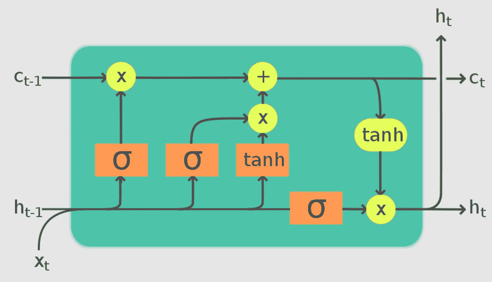
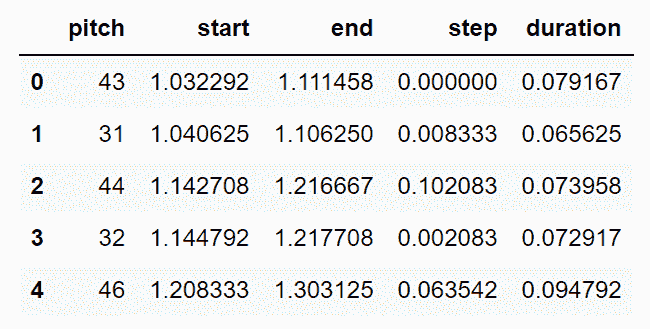
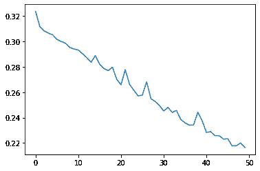
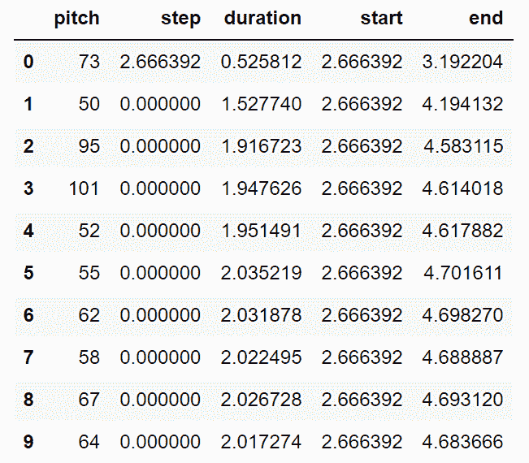

# 使用 LSTMs 生成音乐

> 原文：<https://blog.paperspace.com/music-generation-with-lstms/>


Photo by [Wes Hicks](https://unsplash.com/@sickhews?utm_source=ghost&utm_medium=referral&utm_campaign=api-credit) / [Unsplash](https://unsplash.com/?utm_source=ghost&utm_medium=referral&utm_campaign=api-credit)

音乐在大多数人的生活中扮演着重要的角色。每个人对音乐都有自己的品味和偏好，无论是流行、摇滚、爵士、嘻哈、民谣还是其他这类音乐。音乐对整个历史的影响是革命性的。一般来说，音乐可以被描述为一种悠扬而有节奏的音调，它给听众带来一种抚慰和平静的效果。但是，由于有各种不同类型的乐器和各种各样的音乐，这往往是一个复杂的课题，需要人类大量的奉献和多年的努力。但是深度学习模型在如此复杂的情况下会如何发展呢？

在之前的文章中，我们已经了解了我们在人工智能和深度学习方面取得的进展，以处理与音频信号处理相关的众多任务。这些音频任务中的一些包括音频分类、音频或语音识别、音频分析以及其他类似的任务。在这个博客中，我们的主要焦点是在 LSTM 网络的帮助下进行音乐创作。我们将了解一些基本概念，并直接进入项目。本文提供的代码可以在有 GPU 支持的 Paperspace 上的 Gradient 平台上运行。

## 简介:

在深度学习框架的帮助下生成音乐似乎是一项非常复杂的任务。由于各种不同类型的乐器和音乐，训练神经网络来生成可能对每个人都有吸引力的理想节奏音乐确实很复杂，因为音乐是主观的。然而，有一些方法可以让我们成功地完成这项任务。我们将在下一节进一步探讨这个主题，但首先，让我们了解如何在您的通用设备上收听音频数据。

我们可以通过多种方式收听音频数据，通过. mp3 或。wav 格式。但是，通过利用。midi 格式。MIDI 文件代表乐器数字接口文件。它们可以在操作系统上用普通的 VLC 应用程序或媒体播放器打开。这些是通常总是用于音乐生成项目的文件类型，我们也将在本文中广泛使用它们。

MIDI 文件不包含任何实际的音频信息，不像. mp3 或。wav 格式。它们包含音频数据，其形式为要播放什么类型的音符，音符应该持续多长时间，以及当在支持的兼容软件中播放时音符应该有多大声。使用这些 MIDI 文件的主要意义在于它们很紧凑，占用的空间更少。因此，这些文件非常适合需要大量数据来生成高质量结果的音乐生成项目。

* * *

## 理解音乐生成的基本概念:



[Image Source](https://en.wikipedia.org/wiki/Long_short-term_memory#/media/File:LSTM_Cell.svg)

在我最近的一篇博客中，我们讨论了深度学习的音频分类，观众可以从下面的[链接](https://blog.paperspace.com/audio-classification-with-deep-learning/)中查看。在那篇文章中，我们了解了如何将音频文件中的数据转换成频谱图，频谱图是音频信号中频谱的可视化表示。在文章的这一部分，我们的主要目标是理解一些最常用于音乐生成的方法。

音乐生成和音频相关任务的一种流行方法是使用 WaveNet 生成模型进行信号处理。DeepMind 开发的这个模型对于生成原始音频数据很有用。除了制作音乐之外，一些常见的应用包括模仿人声和许多文本到语音的检测系统。最初，这种方法需要更多的计算处理能力来完成基本任务。然而，随着更多的更新，大多数问题都随着性能的提高而得到了解决，并广泛应用于常见的应用程序中。我们将在以后的文章中更详细地介绍这个网络。

另一种方法是利用一维卷积层。在 1D 卷积层中，针对输入向量在固定数量的滤波器上执行卷积运算，从而产生一维输出阵列。它们对于捕获输入序列中的数据是有用的，并且训练起来比 LSTMs 和 GRUs 相对更快。然而，这些网络构建起来更加复杂，因为“相同”或“有效”的适当填充选择有其自身的问题。

最后，我们有 LSTM 方法，我们开发了一个 LSTM 模型，可以相应地处理音乐生成的任务。LSTMs 使用一系列门来检测哪些信息与特定任务相关。从上图可以看出，这些 LSTM 网络使用了三个主要的门，即遗忘门、输入门和输出门。当这些门相应地更新时，一个时间步长完成。在本文中，我们将重点关注构建我们的音乐生成项目的 LSTM 方法，因为在一些预处理步骤之后，我们可以使用这些 LSTM 单元从零开始构建我们的模型架构。

* * *

## 用 LSTMs 构建音乐生成项目；

在文章的这一部分，我们将详细解释如何在 LSTMs 的帮助下生成音乐。我们将利用 TensorFlow 和 Keras 深度学习框架进行大部分模型开发。你可以查看下面的[文章](https://blog.paperspace.com/absolute-guide-to-tensorflow/)来了解更多关于 TensorFlow 和 Keras 文章[这里](https://blog.paperspace.com/the-absolute-guide-to-keras/)。这个项目需要的另一个基本安装是 pretty midi 库，它对处理 midi 文件很有用。这个库可以通过一个简单的 pip 命令安装在您的工作环境中，如下所示。

```
pip install pretty_midi 
```

一旦我们在工作环境中安装了所有必要的需求，我们就可以开始音乐生成项目了。让我们从导入所有必要的库开始。

### 导入基本库:

在本节中，我们将导入这个项目所需的所有基本库。为了创建深度学习模型，让我们导入 TensorFlow 和 Keras 深度学习框架以及构建模型所需的所有层、模型、损耗和优化器参数。另一个主要的导入是 pretty midi 库，如前所述，用来访问和处理 midi 文件。我们还将定义一些库，如 matplotlib 和 seaborn，用于整个项目中众多参数的可视化。下面是包含网络所有基本构建模块的代码片段。

```
import tensorflow as tf
from tensorflow.keras.layers import Input, LSTM, Dense
from tensorflow.keras.models import Model
from tensorflow.keras.losses import SparseCategoricalCrossentropy
from tensorflow.keras.optimizers import Adam

from typing import Dict, List, Optional, Sequence, Tuple
import collections
import datetime
import glob
import numpy as np
import pathlib
import pandas as pd
import pretty_midi

from IPython import display
from matplotlib import pyplot as plt
import seaborn as sns
```

### 准备数据集:

我们将在这个项目中使用的数据集将包含多个 MIDI 文件，其中包含我们的模型可以用于训练的大量钢琴音符。MAESTRO 数据集包含钢琴 MIDI 文件，观众可以从下面的[链接](https://magenta.tensorflow.org/datasets/maestro#v200)下载。我会推荐下载 maestro-v2.0.0-midi.zip 文件。数据集在压缩格式下只有 57 MB，提取时大约为 85 MB。我们可以使用包含超过 1200 个文件的数据来训练和开发我们的深度学习模型，以生成音乐。

对于大多数与音频处理和音乐生成相关的深度学习项目，通常更容易构建深度学习架构网络来训练音乐生成的模型。然而，相应地准备和预处理数据是至关重要的。在接下来的几节中，我们将准备并创建理想的数据集和必要的函数，用于训练模型以产生所需的结果。在下面的代码片段中，我们定义了一些基本参数来开始这个项目。

```
# Creating the required variables

seed = 42
tf.random.set_seed(seed)
np.random.seed(seed)

# Sampling rate for audio playback
_SAMPLING_RATE = 16000
```

在下一步中，我们将定义下载并解压缩数据文件夹的目录的路径。当从提供的下载链接中提取 zip 文件时，应该将其放在工作环境中，以便您可以轻松访问文件夹中的所有内容。

```
# Setting the path and loading the data

data_dir = pathlib.Path('maestro-v2.0.0')

filenames = glob.glob(str(data_dir/'**/*.mid*'))
print('Number of files:', len(filenames))
```

一旦我们设置了路径，我们就可以读取一个示例文件，如下面的代码块所示。通过访问一个随机样本文件，我们可以对使用了多少种不同的乐器有一个相对深入的了解，并访问构建模型架构所需的一些基本属性。这个项目考虑的三个主要变量是音高、音步和音长。我们可以通过从下面的代码片段中理解音高、音符和持续时间的打印值来提取必要的信息。

```
# analyzing and working with a sample file

sample_file = filenames[1]
print(sample_file)

pm = pretty_midi.PrettyMIDI(sample_file)

print('Number of instruments:', len(pm.instruments))
instrument = pm.instruments[0]
instrument_name = pretty_midi.program_to_instrument_name(instrument.program)
print('Instrument name:', instrument_name)

# Extracting the notes
for i, note in enumerate(instrument.notes[:10]):
    note_name = pretty_midi.note_number_to_name(note.pitch)
    duration = note.end - note.start
    print(f'{i}: pitch={note.pitch}, note_name={note_name}, duration={duration:.4f}')
```

```
maestro-v2.0.0\2004\MIDI-Unprocessed_SMF_02_R1_2004_01-05_ORIG_MID--AUDIO_02_R1_2004_06_Track06_wav.midi
Number of instruments: 1
Instrument name: Acoustic Grand Piano
0: pitch=31, note_name=G1, duration=0.0656
1: pitch=43, note_name=G2, duration=0.0792
2: pitch=44, note_name=G#2, duration=0.0740
3: pitch=32, note_name=G#1, duration=0.0729
4: pitch=34, note_name=A#1, duration=0.0708
5: pitch=46, note_name=A#2, duration=0.0948
6: pitch=48, note_name=C3, duration=0.6260
7: pitch=36, note_name=C2, duration=0.6542
8: pitch=53, note_name=F3, duration=1.7667
9: pitch=56, note_name=G#3, duration=1.7688 
```

上面的音高值代表由 MIDI 音符编号识别的声音的感知质量。步长变量表示从上一个音符或轨道开始经过的时间。最后，持续时间变量表示音符的开始时间和结束时间之间的差异，即特定音符持续多长时间。在下面的代码片段中，我们提取了这三个参数，它们将用于构建 LSTM 模型网络来计算和生成音乐。

```
# Extracting the notes from the sample MIDI file

def midi_to_notes(midi_file: str) -> pd.DataFrame:
    pm = pretty_midi.PrettyMIDI(midi_file)
    instrument = pm.instruments[0]
    notes = collections.defaultdict(list)

    # Sort the notes by start time
    sorted_notes = sorted(instrument.notes, key=lambda note: note.start)
    prev_start = sorted_notes[0].start

    for note in sorted_notes:
        start = note.start
        end = note.end
        notes['pitch'].append(note.pitch)
        notes['start'].append(start)
        notes['end'].append(end)
        notes['step'].append(start - prev_start)
        notes['duration'].append(end - start)
        prev_start = start

    return pd.DataFrame({name: np.array(value) for name, value in notes.items()})

raw_notes = midi_to_notes(sample_file)
raw_notes.head()
```



最后，让我们使用 numpy 数组将文件转换成向量值。我们将为音符名称分配数字音高值，因为它们更容易理解。下面显示的音符名称代表音符、偶然音和八度音程数等特征。我们还可以可视化我们的数据，并相应地解释它们。下面是两个可视化:a .)前 100 个音符的可视化和 b .)整个音轨的可视化。

```
# Converting to note names by considering the respective pitch values

get_note_names = np.vectorize(pretty_midi.note_number_to_name)
sample_note_names = get_note_names(raw_notes['pitch'])
print(sample_note_names[:10])

# Visualizing the paramaters of the muscial notes of the piano

def plot_piano_roll(notes: pd.DataFrame, count: Optional[int] = None):
    if count:
        title = f'First {count} notes'
    else:
        title = f'Whole track'
        count = len(notes['pitch'])

        plt.figure(figsize=(20, 4))
        plot_pitch = np.stack([notes['pitch'], notes['pitch']], axis=0)
        plot_start_stop = np.stack([notes['start'], notes['end']], axis=0)

        plt.plot(plot_start_stop[:, :count], plot_pitch[:, :count], color="b", marker=".")
        plt.xlabel('Time [s]')
        plt.ylabel('Pitch')
        _ = plt.title(title)
```

```
array(['G2', 'G1', 'G#2', 'G#1', 'A#2', 'A#1', 'C3', 'C2', 'F3', 'D4'],
      dtype='<U3') 
```


a. Visualization of first 100 notes


b. Visualizing the entire track

一旦我们完成了数据的分析、准备和可视化，我们就可以进入下一步，完成预处理并创建最终的训练数据。

### 创建培训数据:

如果需要，用户还可以使用笔记资源创建附加数据。我们可以用可用的音符生成自己的 MIDI 文件。下面是执行以下操作的代码片段。创建文件后，我们可以将其保存在。midi 格式并加以利用。因此，如果需要，我们也可以生成和创建自己的数据集。生成的文件可以保存在工作目录或您选择的所需位置。

```
def notes_to_midi(notes: pd.DataFrame, out_file: str, instrument_name: str,
                  velocity: int = 100) -> pretty_midi.PrettyMIDI:

    pm = pretty_midi.PrettyMIDI()
    instrument = pretty_midi.Instrument(
      program=pretty_midi.instrument_name_to_program(
          instrument_name))

    prev_start = 0
    for i, note in notes.iterrows():
        start = float(prev_start + note['step'])
        end = float(start + note['duration'])

        note = pretty_midi.Note(velocity=velocity, pitch=int(note['pitch']),
                                start=start, end=end)
        instrument.notes.append(note)
        prev_start = start

    pm.instruments.append(instrument)
    pm.write(out_file)
    return pm

example_file = 'example.midi'
example_pm = notes_to_midi(
    raw_notes, out_file=example_file, instrument_name=instrument_name)
```

在下一步中，我们将集中于从 MIDI 文件中提取所有的音符并创建我们的数据集。这一步可能很耗时，因为我们有大量可变的数据可用。根据查看者拥有的资源类型，建议从几个文件开始，然后从那里开始。下面是在训练和计算模型时，解析一些笔记并使用`tf.data`以提高效率的步骤。

```
num_files = 5
all_notes = []
for f in filenames[:num_files]:
    notes = midi_to_notes(f)
    all_notes.append(notes)

all_notes = pd.concat(all_notes)

n_notes = len(all_notes)
print('Number of notes parsed:', n_notes)

key_order = ['pitch', 'step', 'duration']
train_notes = np.stack([all_notes[key] for key in key_order], axis=1)

notes_ds = tf.data.Dataset.from_tensor_slices(train_notes)
notes_ds.element_spec
```

如前所述，LSTMs 最适合处理一系列信息，因为它们能够有效地记住以前的数据元素。因此，我们创建的数据集将具有序列输入和输出。如果序列的大小是(100，1)，这意味着将有总共 100 个输入音符被传递以接收最终的输出 1。因此，我们创建的数据集将具有类似的模式，其中数据将注释作为输入要素，输出注释作为这些输入序列之后的标注。下面是代表创建这些序列的函数的代码块。

```
def create_sequences(dataset: tf.data.Dataset, seq_length: int,
                     vocab_size = 128) -> tf.data.Dataset:
    """Returns TF Dataset of sequence and label examples."""
    seq_length = seq_length+1

    # Take 1 extra for the labels
    windows = dataset.window(seq_length, shift=1, stride=1,
                              drop_remainder=True)

    # `flat_map` flattens the" dataset of datasets" into a dataset of tensors
    flatten = lambda x: x.batch(seq_length, drop_remainder=True)
    sequences = windows.flat_map(flatten)

    # Normalize note pitch
    def scale_pitch(x):
        x = x/[vocab_size,1.0,1.0]
        return x

    # Split the labels
    def split_labels(sequences):
        inputs = sequences[:-1]
        labels_dense = sequences[-1]
        labels = {key:labels_dense[i] for i,key in enumerate(key_order)}

        return scale_pitch(inputs), labels

    return sequences.map(split_labels, num_parallel_calls=tf.data.AUTOTUNE)

seq_length = 25
vocab_size = 128
seq_ds = create_sequences(notes_ds, seq_length, vocab_size)
```

为了选择序列长度，我们在上面的代码中使用了 25，但是可以使用超参数调整来进一步优化最佳序列长度。最后，使用上一步创建的序列，我们可以通过设置批量大小、缓冲区大小和 tf.data 功能的其他基本要求来最终生成训练数据，如下面的代码片段所示。

```
batch_size = 64
buffer_size = n_notes - seq_length  # the number of items in the dataset
train_ds = (seq_ds
            .shuffle(buffer_size)
            .batch(batch_size, drop_remainder=True)
            .cache()
            .prefetch(tf.data.experimental.AUTOTUNE))
```

随着训练数据的成功创建，我们可以继续有效地开发我们的模型，按照我们的要求计算和生成音乐。

### 开发模型:

既然我们已经完成了数据的所有基本组成部分的准备和处理，我们就可以相应地继续开发和训练模型了。第一步是定义一个自定义损失函数，我们将利用它作为步长和持续时间参数。我们知道这些参数不能是负数，因为它们必须总是正整数。下面的函数有助于鼓励创建的模型只输出所需参数的正值。下面是执行所需操作的自定义均方误差损失函数的代码片段。

```
def mse_with_positive_pressure(y_true: tf.Tensor, y_pred: tf.Tensor):
    mse = (y_true - y_pred) ** 2
    positive_pressure = 10 * tf.maximum(-y_pred, 0.0)
    return tf.reduce_mean(mse + positive_pressure)
```

最后，我们可以开始开发模型，我们将训练数据集来生成音乐。如前所述，我们将利用 LSTM 网络来创建这个模型。首先，我们将描述模型输入层的输入形状。然后，我们将调用具有大约 128 个维度单位的空间的 LSTM 层来处理数据。在模型网络的末端，我们可以为所有三个参数，即音高、步长和持续时间，定义一些完全连接的层。一旦定义了所有的层，我们就可以相应地定义带有输入和输出调用的模型。我们将对音调参数使用稀疏分类交叉熵损失函数，而对步长和持续时间参数使用自定义的均方误差损失。我们可以调用 Adam 优化器并查看模型的摘要，如下面的代码块所示。

```
# Developing the model

input_shape = (seq_length, 3)
learning_rate = 0.005

inputs = Input(input_shape)
x = LSTM(128)(inputs)

outputs = {'pitch': Dense(128, name='pitch')(x),
           'step': Dense(1, name='step')(x),
           'duration': Dense(1, name='duration')(x),
          }

model = Model(inputs, outputs)

loss = {'pitch': SparseCategoricalCrossentropy(from_logits=True),
        'step': mse_with_positive_pressure,
        'duration': mse_with_positive_pressure,
       }

optimizer = Adam(learning_rate=learning_rate)

model.compile(loss=loss, optimizer=optimizer)

model.summary()
```

```
Model: "model"
__________________________________________________________________________________________________
 Layer (type)                   Output Shape         Param #     Connected to                     
==================================================================================================
 input_1 (InputLayer)           [(None, 25, 3)]      0           []                               

 lstm (LSTM)                    (None, 128)          67584       ['input_1[0][0]']                

 duration (Dense)               (None, 1)            129         ['lstm[0][0]']                   

 pitch (Dense)                  (None, 128)          16512       ['lstm[0][0]']                   

 step (Dense)                   (None, 1)            129         ['lstm[0][0]']                   

==================================================================================================
Total params: 84,354
Trainable params: 84,354
Non-trainable params: 0
__________________________________________________________________________________________________ 
```

一旦我们创建了模型，我们就可以为训练模型定义一些必要的回调。我们将利用模型检查点来保存模型的最佳权重，并定义早期停止函数，以便在我们达到最佳结果并且连续五个时期没有看到改进时终止程序。

```
# Creating the necessary callbacks

callbacks = [tf.keras.callbacks.ModelCheckpoint(filepath='./training_checkpoints/ckpt_{epoch}', save_weights_only=True),
             tf.keras.callbacks.EarlyStopping(monitor='loss', patience=5, 
                                              verbose=1, restore_best_weights=True),]
```

一旦构建了模型，定义了所有必要的回调，我们就可以相应地编译和适应模型了。由于我们需要关注三个参数，因此我们可以通过对所有损失求和来计算总损失，并通过为每个类别提供特定权重来创建类别平衡。我们可以训练大约 50 个时期的模型，并记录产生的结果类型。

```
# Compiling and fitting the model

model.compile(loss = loss, 
              loss_weights = {'pitch': 0.05, 'step': 1.0, 'duration':1.0,},
              optimizer = optimizer)

epochs = 50

history = model.fit(train_ds, 
                    epochs=epochs, 
                    callbacks=callbacks,)
```



Loss Plot

一旦模型完成了训练，我们就可以通过绘制损失度量与历元数的关系来分析它的性能。减少曲线表明损失在不断减少，模型在不断改进。我们现在可以继续看下一步，如何用训练好的模型生成注释。

### 生成注释:

最后，我们可以使用经过训练的模型来生成所需的音符。为了开始生成过程的迭代，我们需要提供一个注释的起始序列，在此基础上，LSTM 模型可以继续创建构建块并重建更多的数据元素。为了创造更多的随机性，并避免模型只选择最佳音符，因为这将导致重复的结果，我们可以利用温度参数来产生随机音符。下面的代码片段演示了获得我们在本节中讨论的所有所需结果的过程。

```
def predict_next_note(notes: np.ndarray, keras_model: tf.keras.Model, 
                      temperature: float = 1.0) -> int:
    """Generates a note IDs using a trained sequence model."""

    assert temperature > 0

    # Add batch dimension
    inputs = tf.expand_dims(notes, 0)

    predictions = model.predict(inputs)
    pitch_logits = predictions['pitch']
    step = predictions['step']
    duration = predictions['duration']

    pitch_logits /= temperature
    pitch = tf.random.categorical(pitch_logits, num_samples=1)
    pitch = tf.squeeze(pitch, axis=-1)
    duration = tf.squeeze(duration, axis=-1)
    step = tf.squeeze(step, axis=-1)

    # `step` and `duration` values should be non-negative
    step = tf.maximum(0, step)
    duration = tf.maximum(0, duration)

    return int(pitch), float(step), float(duration)
```

有了不同的温度变量和不同的开始顺序，我们就可以相应地开始创作音乐了。下面的代码块演示了此过程的步骤。我们利用具有随机温度值的随机起始序列，利用它 LSTM 模型可以继续建立。一旦我们能够解释下一个序列并获得所需的音高、步长和持续时间值，我们就可以将它们存储在生成输出的累积列表中。然后，我们可以继续删除先前使用的起始序列，并利用下一个先前的序列来进行下一个预测，并且也存储它。这个步骤可以持续一段时间，直到我们在期望的时间内产生了合适的音乐音调。

```
temperature = 2.0
num_predictions = 120

sample_notes = np.stack([raw_notes[key] for key in key_order], axis=1)

# The initial sequence of notes while the pitch is normalized similar to training sequences
input_notes = (
    sample_notes[:seq_length] / np.array([vocab_size, 1, 1]))

generated_notes = []
prev_start = 0

for _ in range(num_predictions):
    pitch, step, duration = predict_next_note(input_notes, model, temperature)
    start = prev_start + step
    end = start + duration
    input_note = (pitch, step, duration)
    generated_notes.append((*input_note, start, end))
    input_notes = np.delete(input_notes, 0, axis=0)
    input_notes = np.append(input_notes, np.expand_dims(input_note, 0), axis=0)
    prev_start = start

generated_notes = pd.DataFrame(
    generated_notes, columns=(*key_order, 'start', 'end'))

generated_notes.head(10)
```



一旦我们完成了音乐生成的所有步骤，我们就可以创建一个输出 MIDI 文件来存储由模型生成的用于演奏乐器和弦的数据。使用我们之前定义的音符到 midi 函数，我们可以通过使用生成的输出，提及乐器类型，并将其定向到输出文件以保存生成的音乐音符，来构建带有钢琴音符的 MIDI 文件。

```
out_file = 'output.midi'
out_pm = notes_to_midi(
    generated_notes, out_file=out_file, instrument_name=instrument_name)
```

您可以通过播放下面附加的声音文件来收听为这篇博文生成的样本。

Output0:00/1:04<input type="range" class="kg-audio-seek-slider" max="100" value="0"><button class="kg-audio-playback-rate">1×</button><input type="range" class="kg-audio-volume-slider" max="100" value="100">

深度学习模型的音乐生成的可能性是无穷的。有这么多不同类型的音乐流派和这么多不同类型的网络，我们可以构建来实现我们正在寻找的理想音乐品味。本文的大部分代码引用自 TensorFlow 官方文档[网站](https://www.tensorflow.org/tutorials/audio/music_generation#generate_notes)。我强烈建议查看网站，并尝试许多不同的网络结构和架构，以构建更好、更有创意的音乐生成器的更独特的模型。

* * *

## 结论:


Photo by [Marcela Laskoski](https://unsplash.com/@marcelalaskoski?utm_source=ghost&utm_medium=referral&utm_campaign=api-credit) / [Unsplash](https://unsplash.com/?utm_source=ghost&utm_medium=referral&utm_campaign=api-credit)

音乐可以成为大多数人生活中不可或缺的一部分，因为它可以创造许多不同类型的人类情感，如增强记忆，培养任务耐力，点亮你的情绪，减少焦虑和抑郁，创造一种舒缓的效果，等等。一般来说，乐器和音乐很难学，即使对人类来说也是如此。掌握它需要很长时间，因为有几个不同的因素，一个人必须考虑并致力于实践。然而，在现代，随着人工智能和深度学习，我们已经取得了足够的进展，可以让机器进入这个领域，探索音符的本质。

在这篇文章中，我们简要介绍了人工智能，特别是深度学习模型，在音乐领域以及与音频和信号处理相关的众多任务中取得的进展。我们了解 rnn 和 LSTMs 在创建数据元素块或系列中的重要性，在这些数据元素块或系列中，输出可以连续传输以实现出色的结果。在快速概述了 LSTM 网络的重要性之后，我们进入了下一部分，从头开始构建音乐生成项目。下面的项目可以做一些改进和提高，我强烈建议对这个项目感兴趣的人做进一步的探索。

在接下来的文章中，我们将研究与音频处理、音频识别相关的类似项目，以及更多与音乐相关的作品。我们也将涵盖从零开始的神经网络和其他生成性对抗网络的概念，如风格甘。在那之前，享受探索音乐和深度学习网络的世界吧！