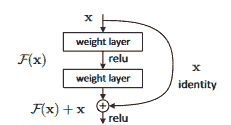
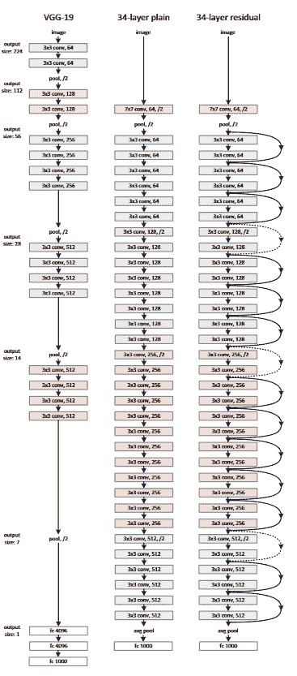
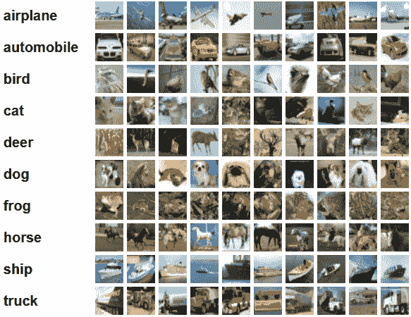
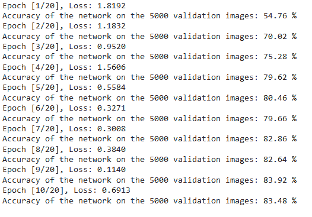

# 用 PyTorch 从头开始编写 ResNet

> 原文：<https://blog.paperspace.com/writing-resnet-from-scratch-in-pytorch/>

为了结束我在 PyTorch 中从头构建经典卷积神经网络的系列，我们将构建 ResNet，这是计算机视觉中的一项重大突破，它解决了网络太深时网络性能下降的问题。它还引入了剩余连接的概念(稍后将详细介绍)。我们可以在我的个人资料中访问该系列的前几篇文章，即 [LeNet5](https://blog.paperspace.com/writing-lenet5-from-scratch-in-python/) 、 [AlexNet](https://blog.paperspace.com/alexnet-pytorch/) 和 [VGG](https://blog.paperspace.com/vgg-from-scratch-pytorch/) 。

我们将从研究 ResNet 如何工作背后的架构和直觉开始。然后，我们将把它与 VGG 进行比较，并考察它是如何解决 VGG 的一些问题的。然后，像以前一样，我们将加载我们的数据集 CIFAR10，并对其进行预处理，以便为建模做好准备。然后，我们将首先实现一个 ResNet 的基本构建块(我们将称之为 ResidualBlock)，并使用它来构建我们的网络。然后，这个网络将在预处理的数据上进行训练，最后，我们将看到经过训练的模型在看不见的数据(测试集)上的表现。

* * *

# ResNet

VGG 的一个缺点是它不能达到预期的深度，因为它开始失去泛化能力(也就是说，它开始过度拟合)。这是因为随着神经网络变得更深，来自损失函数的梯度开始收缩到零，因此权重没有更新。这个问题被称为消失梯度问题。ResNet 通过使用跳过连接基本上解决了这个问题。



A Residual Block. Source: [ResNet Paper](https://arxiv.org/pdf/1512.03385.pdf)

在上图中，我们可以看到，除了正常的连接之外，还有一个跳过模型中某些层的直接连接(skip connection)。通过跳跃连接，输出从 *h(x) = f(wx +b)* 变为*h(x)= f(x)+x。*这些跳跃连接很有帮助，因为它们允许梯度流过另一条捷径。下面是 34 层 ResNet 的架构。



Source: [ResNet Paper](https://arxiv.org/pdf/1512.03385.pdf)

* * *

# 数据加载

## 资料组

在本文中，我们将使用著名的 [CIFAR-10](https://www.cs.toronto.edu/%7Ekriz/cifar.html) 数据集，它已经成为初学计算机视觉数据集的最常见选择之一。该数据集是[8000 万微小图像](http://people.csail.mit.edu/torralba/tinyimages/)数据集的标记子集。它们由 Alex Krizhevsky、Vinod Nair 和 Geoffrey Hinton 收藏。CIFAR-10 数据集由 10 类 60000 幅 32x32 彩色图像组成，每类 6000 幅图像。有 50000 个训练图像和 10000 个测试图像。

数据集分为五个训练批次和一个测试批次，每个批次有 10000 幅图像。测试批次包含从每个类别中随机选择的 1000 个图像。训练批次以随机顺序包含剩余的图像，但是一些训练批次可能包含来自一个类别的比来自另一个类别的更多的图像。在它们之间，训练批次正好包含来自每个类的 5000 个图像。这些类是完全互斥的。汽车和卡车之间没有重叠。“汽车”包括轿车、越野车以及诸如此类的东西。“卡车”仅包括大卡车。两者都不包括皮卡车。

以下是数据集中的类，以及每个类中的 10 幅随机图像:



Source: https://www.cs.toronto.edu/%7Ekriz/cifar.html

## 导入库

我们将从导入我们将使用的库开始。除此之外，我们将确保笔记本电脑使用 GPU 来训练模型(如果可用的话)

```
import numpy as np
import torch
import torch.nn as nn
from torchvision import datasets
from torchvision import transforms
from torch.utils.data.sampler import SubsetRandomSampler

# Device configuration
device = torch.device('cuda' if torch.cuda.is_available() else 'cpu')
```

Importing the libraries

## 加载数据集

现在我们继续加载数据集。为此，我们将使用`torchvision`库，该库不仅提供了对数百个计算机视觉数据集的快速访问，还提供了简单直观的方法来预处理/转换它们，以便为建模做好准备

*   我们首先定义我们的`data_loader`函数，它根据参数返回训练或测试数据
*   在深度学习项目中标准化我们的数据总是一个好的做法，因为它使训练更快，更容易收敛。为此，我们用数据集中每个通道(红色、绿色和蓝色)的平均值和标准偏差来定义变量`normalize`。这些可以手动计算，但也可以在线获得。这在`transform`变量中使用，我们调整数据的大小，将其转换成张量，然后归一化
*   我们使用数据加载器。数据加载器允许我们批量迭代数据，数据是在迭代时加载的，而不是一次全部加载到我们的 RAM 中。如果我们要处理大约 100 万张图片的大型数据集，这是非常有用的。
*   根据`test`参数，我们要么装载火车(如果`test=False`)拆分，要么装载`test`(如果`test=True`)拆分。在训练的情况下，分裂被随机分成训练集和验证集(0.9:0.1)。

```
def data_loader(data_dir,
                batch_size,
                random_seed=42,
                valid_size=0.1,
                shuffle=True,
                test=False):

    normalize = transforms.Normalize(
        mean=[0.4914, 0.4822, 0.4465],
        std=[0.2023, 0.1994, 0.2010],
    )

    # define transforms
    transform = transforms.Compose([
            transforms.Resize((224,224)),
            transforms.ToTensor(),
            normalize,
    ])

    if test:
        dataset = datasets.CIFAR10(
          root=data_dir, train=False,
          download=True, transform=transform,
        )

        data_loader = torch.utils.data.DataLoader(
            dataset, batch_size=batch_size, shuffle=shuffle
        )

        return data_loader

    # load the dataset
    train_dataset = datasets.CIFAR10(
        root=data_dir, train=True,
        download=True, transform=transform,
    )

    valid_dataset = datasets.CIFAR10(
        root=data_dir, train=True,
        download=True, transform=transform,
    )

    num_train = len(train_dataset)
    indices = list(range(num_train))
    split = int(np.floor(valid_size * num_train))

    if shuffle:
        np.random.seed(42)
        np.random.shuffle(indices)

    train_idx, valid_idx = indices[split:], indices[:split]
    train_sampler = SubsetRandomSampler(train_idx)
    valid_sampler = SubsetRandomSampler(valid_idx)

    train_loader = torch.utils.data.DataLoader(
        train_dataset, batch_size=batch_size, sampler=train_sampler)

    valid_loader = torch.utils.data.DataLoader(
        valid_dataset, batch_size=batch_size, sampler=valid_sampler)

    return (train_loader, valid_loader)

# CIFAR10 dataset 
train_loader, valid_loader = data_loader(data_dir='./data',
                                         batch_size=64)

test_loader = data_loader(data_dir='./data',
                              batch_size=64,
                              test=True)
```

Loading the Dataset

* * *

# 从头开始

## PyTorch 中模型的工作方式

在开始构建残差块和 ResNet 之前，我们将首先研究并理解 PyTorch 中是如何定义神经网络的:

*   `nn.Module`提供了一个样板文件，用于创建定制模型以及一些有助于培训的必要功能。这就是为什么每个定制模型都倾向于继承`nn.Module`
*   那么在每个定制模型中有两个主要的函数。第一个是初始化函数`__init__`，其中我们定义了我们将使用的各种层，第二个是`forward`函数，它定义了在给定输入上执行上述层的顺序

## PyTorch 中的图层

现在来看看 PyTorch 中对我们有用的不同类型的图层:

*   这些卷积层接受输入和输出通道的数量作为参数，以及过滤器的内核大小。如果我们想要应用这些，它也接受任何步幅或填充
*   `nn.BatchNorm2d`:对卷积层的输出进行批量归一化
*   `nn.ReLU`:这是一种应用于网络中各种输出的激活功能
*   `nn.MaxPool2d`:这将最大池应用于给定内核大小的输出
*   `nn.Dropout`:用于以给定的概率对输出进行丢弃
*   这基本上是一个完全连接的层
*   从技术上来说，这不是一种类型的层，但它有助于将同一步骤中的不同操作结合起来

## 残余块

在开始构建网络之前，我们需要构建一个剩余块，以便在整个网络中重复使用。该块(如架构所示)包含一个可选参数(`downsample`)的跳过连接。注意，在`forward`中，这直接应用于输入`x`，而不是输出`out`。

```
class ResidualBlock(nn.Module):
    def __init__(self, in_channels, out_channels, stride = 1, downsample = None):
        super(ResidualBlock, self).__init__()
        self.conv1 = nn.Sequential(
                        nn.Conv2d(in_channels, out_channels, kernel_size = 3, stride = stride, padding = 1),
                        nn.BatchNorm2d(out_channels),
                        nn.ReLU())
        self.conv2 = nn.Sequential(
                        nn.Conv2d(out_channels, out_channels, kernel_size = 3, stride = 1, padding = 1),
                        nn.BatchNorm2d(out_channels))
        self.downsample = downsample
        self.relu = nn.ReLU()
        self.out_channels = out_channels

    def forward(self, x):
        residual = x
        out = self.conv1(x)
        out = self.conv2(out)
        if self.downsample:
            residual = self.downsample(x)
        out += residual
        out = self.relu(out)
        return out
```

ResidualBlock

## ResNet

现在，我们已经创建了剩余块，我们可以构建我们的 ResNet。

请注意，该架构中有三个模块，分别包含 3、3、6 和 3 层。为了制作这个块，我们创建一个助手函数`_make_layer`。该函数将层与残差块一起逐个添加。在区块之后，我们添加平均池和最终的线性层。

```
class ResNet(nn.Module):
    def __init__(self, block, layers, num_classes = 10):
        super(ResNet, self).__init__()
        self.inplanes = 64
        self.conv1 = nn.Sequential(
                        nn.Conv2d(3, 64, kernel_size = 7, stride = 2, padding = 3),
                        nn.BatchNorm2d(64),
                        nn.ReLU())
        self.maxpool = nn.MaxPool2d(kernel_size = 3, stride = 2, padding = 1)
        self.layer0 = self._make_layer(block, 64, layers[0], stride = 1)
        self.layer1 = self._make_layer(block, 128, layers[1], stride = 2)
        self.layer2 = self._make_layer(block, 256, layers[2], stride = 2)
        self.layer3 = self._make_layer(block, 512, layers[3], stride = 2)
        self.avgpool = nn.AvgPool2d(7, stride=1)
        self.fc = nn.Linear(512, num_classes)

    def _make_layer(self, block, planes, blocks, stride=1):
        downsample = None
        if stride != 1 or self.inplanes != planes:

            downsample = nn.Sequential(
                nn.Conv2d(self.inplanes, planes, kernel_size=1, stride=stride),
                nn.BatchNorm2d(planes),
            )
        layers = []
        layers.append(block(self.inplanes, planes, stride, downsample))
        self.inplanes = planes
        for i in range(1, blocks):
            layers.append(block(self.inplanes, planes))

        return nn.Sequential(*layers)

    def forward(self, x):
        x = self.conv1(x)
        x = self.maxpool(x)
        x = self.layer0(x)
        x = self.layer1(x)
        x = self.layer2(x)
        x = self.layer3(x)

        x = self.avgpool(x)
        x = x.view(x.size(0), -1)
        x = self.fc(x)

        return x 
```

ResNet34

* * *

# 设置超参数

总是建议在我们的模型中为各种超参数尝试不同的值，但是这里我们将只使用一个设置。无论如何，我们建议每个人尝试不同的方法，看看哪种效果最好。超参数包括定义时期数、批量大小、学习率、损失函数以及优化器。当我们构建 ResNet 的 34 层变体时，我们也需要传递适当数量的层:

```
num_classes = 10
num_epochs = 20
batch_size = 16
learning_rate = 0.01

model = ResNet(ResidualBlock, [3, 4, 6, 3]).to(device)

# Loss and optimizer
criterion = nn.CrossEntropyLoss()
optimizer = torch.optim.SGD(model.parameters(), lr=learning_rate, weight_decay = 0.001, momentum = 0.9)  

# Train the model
total_step = len(train_loader)
```

Setting Hyper-parameters

* * *

# 培养

现在，我们的模型已经为训练做好了准备，但是首先我们需要知道模型训练在 PyTorch 中是如何工作的:

*   我们首先使用我们的`train_loader`为每个时期批量加载图像，并使用我们之前定义的`device`变量将数据移动到 GPU
*   然后使用该模型对标签`model(images)`进行预测，然后我们使用上面定义的损失函数`criterion(outputs, labels)`计算预测值和实际值之间的损失
*   现在学习部分来了，我们用损失反向传播法，`loss.backward()`，更新权重，`optimizer.step()`。每次更新前需要做的一件重要事情是使用`optimizer.zero_grad()`将梯度设置为零，因为否则梯度会累积(PyTorch 中的默认行为)
*   最后，在每个时期之后，我们在验证集上测试我们的模型，但是，由于我们在评估时不需要梯度，我们可以使用`with torch.no_grad()`关闭它，以使评估更快。

```
import gc
total_step = len(train_loader)

for epoch in range(num_epochs):
    for i, (images, labels) in enumerate(train_loader):  
        # Move tensors to the configured device
        images = images.to(device)
        labels = labels.to(device)

        # Forward pass
        outputs = model(images)
        loss = criterion(outputs, labels)

        # Backward and optimize
        optimizer.zero_grad()
        loss.backward()
        optimizer.step()
        del images, labels, outputs
        torch.cuda.empty_cache()
        gc.collect()

    print ('Epoch [{}/{}], Loss: {:.4f}' 
                   .format(epoch+1, num_epochs, loss.item()))

    # Validation
    with torch.no_grad():
        correct = 0
        total = 0
        for images, labels in valid_loader:
            images = images.to(device)
            labels = labels.to(device)
            outputs = model(images)
            _, predicted = torch.max(outputs.data, 1)
            total += labels.size(0)
            correct += (predicted == labels).sum().item()
            del images, labels, outputs

        print('Accuracy of the network on the {} validation images: {} %'.format(5000, 100 * correct / total)) 
```

Training and Validation

分析代码的输出，我们可以看到，随着损失的减少，模型在学习，而验证集的准确性随着每个时期而增加。但是我们可能会注意到它在最后波动，这可能意味着模型过度拟合或者`batch_size`很小。我们将不得不进行测试以查明发生了什么:



Training Losses

* * *

# 测试

对于测试，我们使用与验证完全相同的代码，但是使用了`test_loader`:

```
with torch.no_grad():
    correct = 0
    total = 0
    for images, labels in test_loader:
        images = images.to(device)
        labels = labels.to(device)
        outputs = model(images)
        _, predicted = torch.max(outputs.data, 1)
        total += labels.size(0)
        correct += (predicted == labels).sum().item()
        del images, labels, outputs

    print('Accuracy of the network on the {} test images: {} %'.format(10000, 100 * correct / total)) 
```

Testing

使用上述代码并训练 10 个时期的模型，我们能够在测试集上实现 82.87%的准确度:


Testing Accuracy

* * *

# 结论

现在让我们总结一下我们在本文中所做的工作:

*   我们从理解 ResNet 的架构和工作原理开始
*   接下来，我们使用`torchvision`加载并预处理了 CIFAR10 数据集
*   然后，我们学习了 PyTorch 中自定义模型定义的工作方式，以及`torch`中可用的不同类型的层
*   我们通过构建剩余模块从零开始构建我们的 ResNet
*   最后，我们在 CIFAR10 数据集上训练和测试了我们的模型，该模型在测试数据集上表现良好，准确率为 75%

* * *

# 未来的工作

通过这篇文章，我们得到了很好的介绍和实践学习，但是如果我们将它扩展到其他挑战，我们可以学到更多:

*   尝试使用不同的数据集。一个这样的数据集是 CIFAR100，它是 ImageNet 数据集的子集，即[8000 万个微小图像](http://people.csail.mit.edu/torralba/tinyimages/)数据集
*   试验不同的超参数，并查看它们在模型中的最佳组合
*   最后，尝试在数据集中添加或移除图层，以查看它们对模型功能的影响。更好的是，尝试构建该模型的 ResNet-51 版本