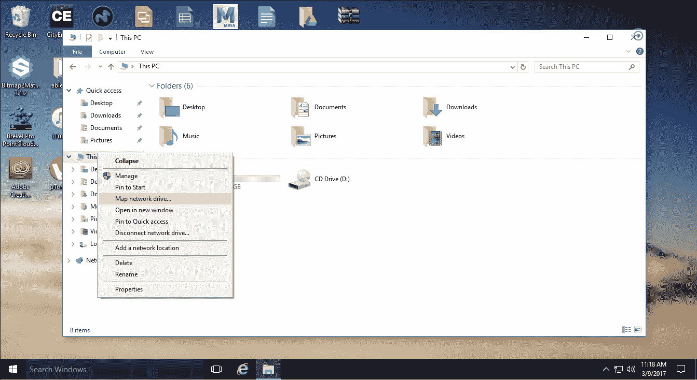
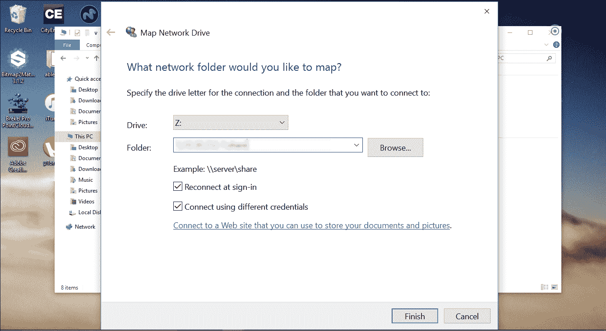
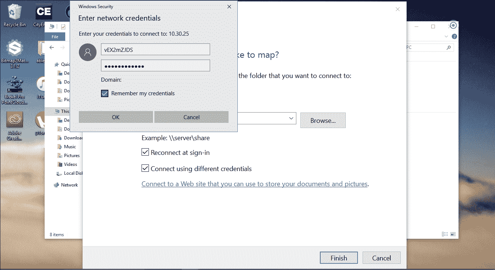
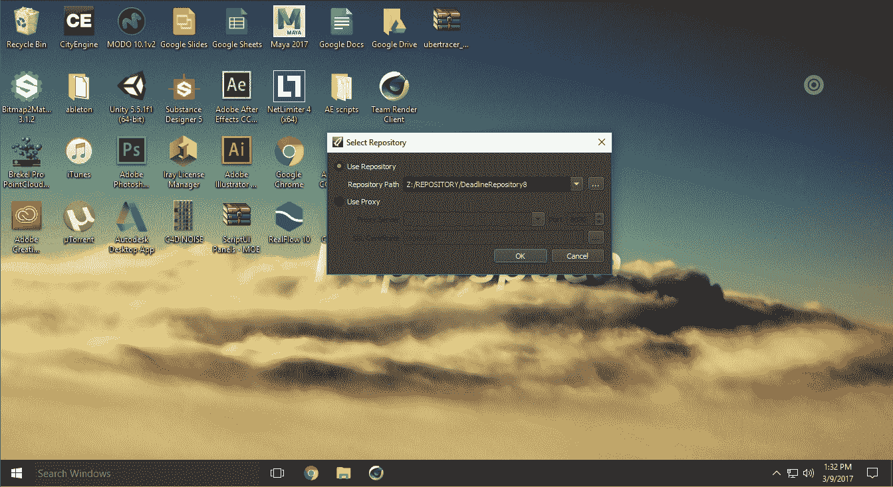
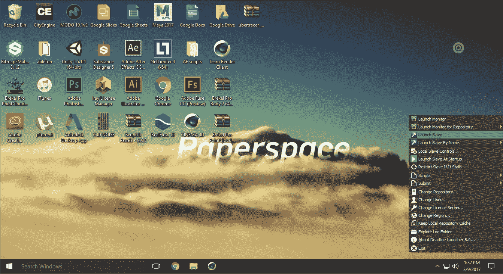
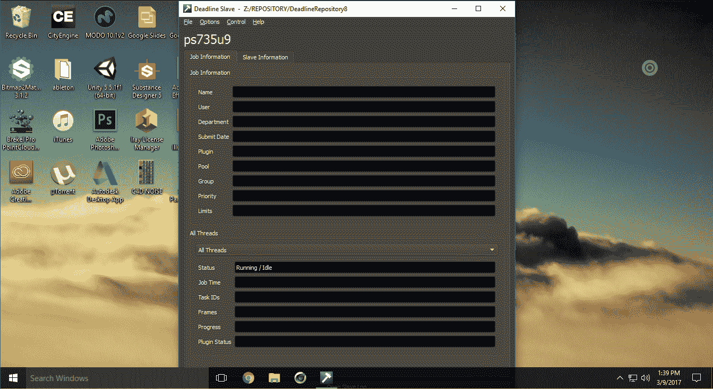
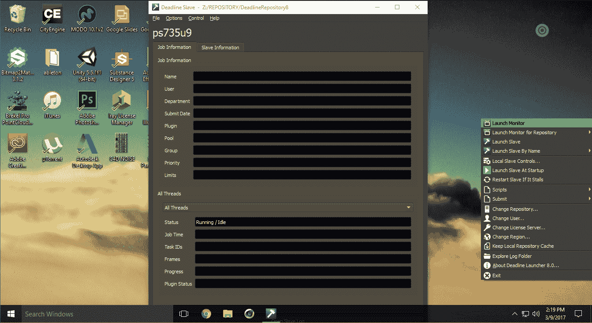
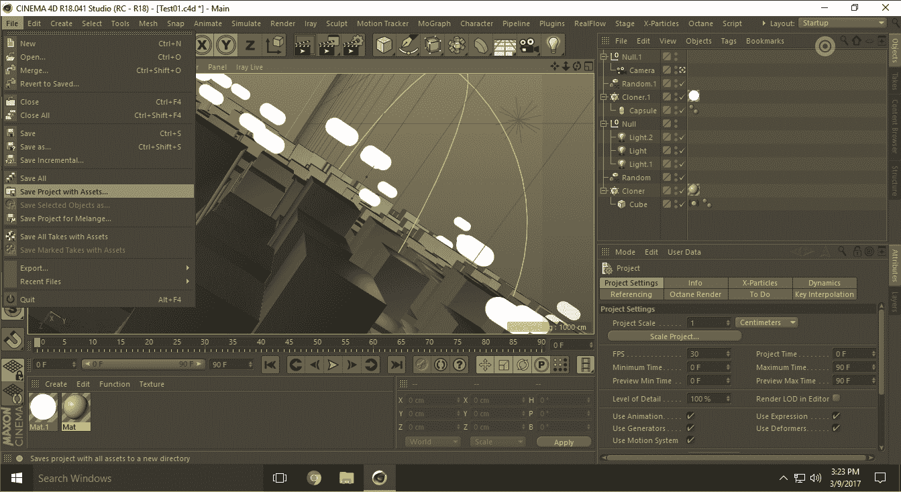
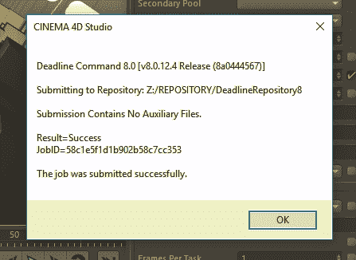
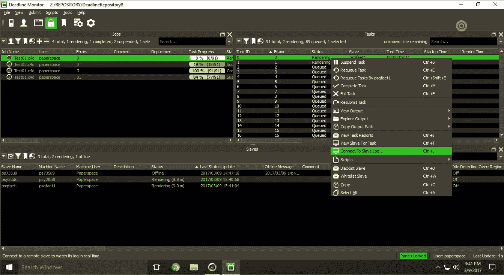

# 使用 Deadline 在云中进行分布式渲染

> 原文：<https://blog.paperspace.com/distributed-rendering-in-the-cloud-with-deadline/>

Deadline 是最受欢迎的分布式渲染应用之一，是从事动画、视觉特效和游戏开发等行业的人的必备工具。在本教程中，我们将了解如何在 Paperspace 上设置截止时间，特别是将重点放在跨多个渲染从属对象分发渲染上...

[Deadline](http://deadline.thinkboxsoftware.com/) 是最流行的分布式渲染应用程序之一，是从事动画、视觉特效和游戏开发等行业的人的必备工具。在本教程中，我们将了解如何在 Paperspace 上设置 Deadline，特别是将重点放在跨多个渲染从属对象分发渲染上。由于 Deadline 中的大量程序支持，您可以将本教程用于许多软件，包括 Maya、3ds max、Cinema 4D、After Effects 和 Nuke 等等。阅读本教程后，您将能够快速设置您的分布式云渲染场，并立即进行渲染。

**注意** : *本教程将涵盖基本设置。我们将在后面的教程中回顾截止时间 VMX 集成。*

### 先决条件

为了完成本教程，您必须具备:

*   一台以上的纸张空间机器。

*   共享的图纸空间驱动器。

*   每台机器上许可和安装的最后期限。[安装说明](http://docs.thinkboxsoftware.com/products/deadline/9.0/1_User%20Manual/#quick-install)。(确保将存储库设置到您的共享驱动器。)

*   由 Deadline 支持的应用程序。[支持的软件列表](http://docs.thinkboxsoftware.com/products/deadline/9.0/1_User%20Manual/manual/supported-software.html)。出于本教程的目的，我们将使用 4D 电影院。

*   安装在您各自软件中的截止日期客户端插件。[此处为申请信息](http://docs.thinkboxsoftware.com/products/deadline/9.0/1_User%20Manual/index.html#application-plugins)。
    

## 设置截止日期

**步骤 1–将共享驱动器安装到特定的驱动器盘符上**

这对一些人来说似乎是显而易见的，但是确保你的共享驱动器在所有机器上安装到一个一致的盘符上对于 Deadline 能够运行是极其重要的。对于本例，我们将在第一台机器上将共享驱动器挂载到字母“Z:”上。

首先访问您的 Paperspace 机器上的文件浏览器，右键单击“这台电脑”并选择“映射网络驱动器”

输入由 Paperspace 提供的驱动器共享路径，并确保选中“登录时重新连接”和“使用不同的凭据连接”。记下将要使用的驱动器号，在本例中为“Z:”。

在弹出的登录屏幕中，输入 Paperspace 提供的登录凭据，以连接到共享驱动器并装载它。确保选中“记住我的凭据”

**步骤 2–在共享驱动器上设置截止日期存储库**

首先，我们需要确保我们的[期限库](http://docs.thinkboxsoftware.com/products/deadline/9.0/1_User%20Manual/manual/quick-install-db-repo.html)被设置到我们的共享驱动器上。转到 deadline launcher 应用程序，在右下角右键单击 Deadline launcher 应用程序，然后选择“更改存储库”。

应该会弹出存储库路径窗口。确保路径指向共享驱动器存储库。

**注意** : <mark>*如果您的共享驱动器上没有存储库，您可以简单地将其从存在的任何地方复制到您的共享驱动器，然后将该窗口的路径设置为复制的存储库。*</mark>

**第 3 步–启动截止时间从模块**

要启动最后期限从属，右键单击最后期限启动器图标并选择“启动从属”。

一旦从机启动，它应该说“空闲”

**步骤 4–设置所有节点。**

对所有渲染节点重复步骤 1-3，或使用 Paperspace 创建您设置的计算机的模板，并克隆它！

**步骤 5–检查节点的功能**

从截止日期启动器中打开截止日期监视器。

检查从属列表中的节点，确保它们是活动的。

**注意** : *如果你看不到你的节点或者它们是不活动的，确保你遵循了上面的所有步骤。如果您仍然看不到它们，请尝试重启机器并重新连接到存储库。如果他们仍然没有出现，尝试[检查文档](http://docs.thinkboxsoftware.com/products/deadline/9.0/1_User%20Manual/index.html#deadline-version-documentation)安装中的任何错误。*

* * *

## 带截止日期的渲染

**步骤 1–使用截止日期提交插件启动您的应用程序。**

出于本教程的目的，我们将使用 4D 电影院。我们将在未来介绍其他计划。

启动要渲染的项目文件。确保:

*   你的插件和程序在所有机器上都是一样的。
*   您的项目文件需要与渲染所需的资源一起保存到共享驱动器中。在 4D 影院中，最好的方法是前往“文件”>“存储项目和资源”，然后导航到共享驱动器。

第二步——用截止日期提交插件提交你的渲染任务。

进入“插件”菜单，点击“提交到截止日期”。

在提交窗口中，确保设置符合您的喜好。要考虑的一些设置有:

*   池和组是隔离特定计算机集合进行渲染的一种方式。
*   计算机列表对于从渲染任务中隔离或移除某些计算机非常有用。
    优先级让你决定渲染应该以什么顺序完成。
*   并发任务是你可以告诉 Deadline 一个程序的 Deadline 应该同时运行多少个实例。小心这一点，因为它可能会导致机器挂起和冻结。
*   框架列表是你告诉 Deadline 渲染什么框架的地方。
*   “每任务帧数”是指在渲染任务期间，在 Deadline 关闭应用程序之前应渲染的帧数。

一旦你点击提交，你应该得到一个“成功提交渲染”窗口。

第三步——检查你的渲染状态的最后期限监视器。
期限监视器是你可以跟踪你的渲染并确保它正在进行的地方。

* **注意** : *如果您遇到任何错误，您可以通过右键单击出错的框架并选择“连接到从属日志”或“查看任务报告”来检查从属日志*

* * *

## 结论

希望这篇教程能让你明白在云端设置 Deadline 并输出你的项目文件是多么容易。我们迫不及待地想看看你用这种软件和硬件的强大组合创造出什么样的东西！

要开始设置你自己的渲染管道，[在这里注册。](https://www.paperspace.com/account/signup?utm-campaign=deadlineblog)