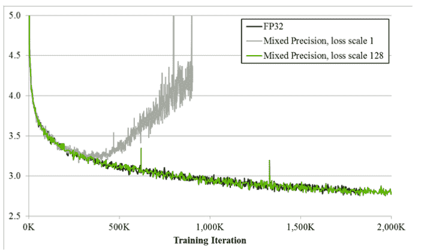
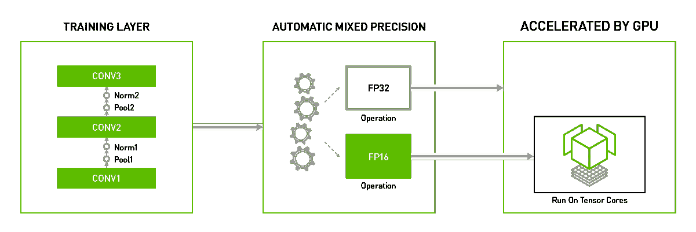
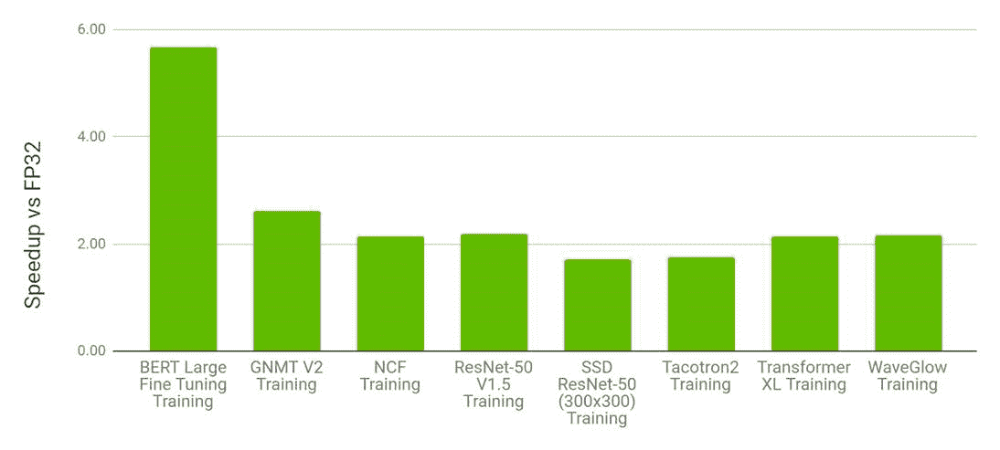
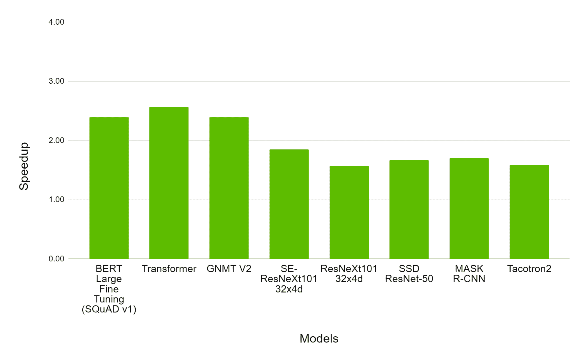

# 使用带梯度的混合精确训练

> 原文：<https://blog.paperspace.com/mixed-precision-training/>

深度学习算法和框架的优化不仅是库和技术的问题，也是 CPU 和 GPU 硬件的问题。例如，数据如何以计算机数字格式存储，会对深度学习算法的训练速度产生重大影响。在使用 GPU 加速模型训练时，了解这些信息尤其有用。

在这篇博文中，我们将介绍两种用于深度学习的常见计算机数字格式(FP16 和 FP32)，并详细说明单独使用每种格式的问题。接下来，我们将跳转到混合精确训练的好处及其在深度学习中的使用。之后，我们将分解哪些 NVIDIA GPUs 能够进行自动混合精度训练，包括在各种 GPU 上实施混合精度训练时，您可能会期望什么样的加速，如何确保无论您运行的是 PyTorch 还是 TensorFlow，混合精度都是启用的，以及如果您运行的是 NVIDIA RTX5000、V100 或 A100 等强大的 GPU，为什么混合精度特别有价值。

## 什么是计算机数字格式，它们如何影响深度学习？

计算机数字格式是数字设备硬件和软件中数值的内部表示。任务中使用的代码和应用程序可以对这些表示进行操作。

如计算机数字格式国际标准 IEEE 754 中所述，浮点精度有各种级别。范围从 FP16 到 FP256，其中“FP”(浮点)后面的数字表示可用于表示浮点值的位数。 [(1)](https://towardsdatascience.com/understanding-mixed-precision-training-4b246679c7c4)

在深度学习任务中，float32，也称为 FP32，是历史上最流行的用于深度学习任务的计算机数字格式。这是因为在 FP32 中，为符号保留了一位，为指数(-126 至+127)保留了 8 位，为数字保留了 23 位。FP16 表示半精度，为符号保留 1 位，为指数(-14 到+14)保留 5 位，为数字保留 10 位。 [(1)](https://towardsdatascience.com/understanding-mixed-precision-training-4b246679c7c4)


使用这两种格式中的任何一种进行深度学习的结果可以从它们的最小和最大表示值以及这些大小对记忆的相应影响中看出。每种格式的最小值和最大值之间的差值在差值的数量级上约为> 10^30。这意味着与 FP16 相比，FP32 可以表示更大范围的值，尽管这是以存储每个单个值需要更多位为代价的。

代表性能力的这些差异的结果在两个地方显示出来:速度和效率。实际上，由于深度学习操作中使用的数字的数值精度更高，使用 FP32 将导致更好的整体模型，但它也将占用更多的内存。尽管成本更高，但更高的精度使 FP32 成为存储深度学习任务数值的*通用语*。

另一方面，FP16 的深度学习占用更少的内存，运行更快，但数据精度更低，从而导致模型效率下降。此外，现代加速器硬件，如 Google TPUs 和 NVIDIA GPUs，在 16 位数据类型中运行操作更快。这是因为它们有专门的硬件来运行 16 位计算，而且从内存中读取 16 位数据类型比 FP32 更快。尽管有加速的好处，但数据精度和模型准确性的损失往往太大，使得 FP16 在除了利基市场之外的所有情况下都可行。

## 什么是混合精准训练？

在过去，最常用的精确训练范式是使用 FP32 的单一精确训练。这是因为 FP32 模型的整体功效始终较高，尽管这是以增加内存和训练时间要求为代价的。混合精确训练是一种尝试用 FP16 的效率来捕捉 FP32 的功效的方法。

一般来说，混合精度训练为深度学习提供了三个关键好处:

*   使用张量核来处理 FP16 加速了数学密集型运算，如线性或卷积层中的运算
*   与单精度相比，访问一半字节可以提高内存受限操作的速度
*   降低训练模型的内存要求，从而能够训练更大的模型或使用更大的迷你批次 [(2)](https://developer.nvidia.com/automatic-mixed-precision)

让我们通过研究范式背后的理论来看看混合精确训练是如何创造这些好处的。

### 深度学习中的混合精度训练理论


2017 年，英伟达的研究人员[发布了一篇关于混合精确训练的论文](https://arxiv.org/pdf/1710.03740.pdf)。这篇论文详细介绍了在一个称为混合精度训练的过程中使用 FP32 和 FP16 进行深度学习的第一种方法。如上图所示，他们首先创建了存储在 FP32 中的权重的永久副本。然后在正向传递过程中转换为 FP16，供模型用来计算梯度，然后转换为 FP32，并传递回优化器进行反向传播。在迭代结束时，FP32 中的梯度用于在优化器步骤中更新主权重。

该方法本身的问题是仍然存在一些 FP16 没有考虑的小梯度。英伟达团队发现，2^-27 和 2^-24 之间存在不同的价值观，如果使其不可行，将会影响训练。因为它们在 FP16 的限制之外，所以在训练迭代期间它们将等于零。这个问题的解决方案是损耗缩放——在正向传递完成之后、反向传播之前，损耗值乘以一个缩放因子。使用链式法则，所有梯度随后通过相同的因子进行缩放，并随后在 FP16 的可行性范围内移动。 [(1)](https://towardsdatascience.com/understanding-mixed-precision-training-4b246679c7c4)

### 实践中的混合精度训练



[Source](https://developer.nvidia.com/blog/mixed-precision-training-of-deep-neural-networks/)

使用混合精度训练的效果可以在上面的绘图图中看到。它详细描述了使用三种不同精度格式时大 LSTM 英语语言模型的训练曲线:FP32、损失比例为 1 的混合精度和损失比例为 128 的混合精度。Y 轴是训练损失，我们可以使用它来查看无损失缩放的混合精度(灰色)在一段时间后如何发散，而有损失缩放的混合精度(绿色)与单精度模型(黑色)相匹配。 [(3)](https://developer.nvidia.com/blog/mixed-precision-training-deep-neural-networks/) 这清楚地表明，具有损失缩放的混合精度训练可以获得与单精度 FP32 几乎相同的性能。

## 自动混合精确训练



在现实世界中，自从这些主题最初被引入以来，已经发生了很大的变化。大多数深度学习库现在都配备了使用自动混合精度(AMP)训练的能力。自动混合精度训练是指混合精度训练在深度学习任务中切换，无需用户进行任何额外设置。值得注意的是，PyTorch 和 TensorFlow 都内置了自动混合训练的触发器。

### PyTorch 中的自动混合精度训练

要启用 PyTorch AMP，请在代码中添加以下行:

```
scaler = GradScaler()

with autocast():
    output = model(input)
    loss = loss_fn(output, target)

scaler.scale(loss).backward()

scaler.step(optimizer)

scaler.update()
```

### TensorFlow 中的自动混合精度训练；

要将 AMP 与 TensorFlow 一起使用，只需将下面的`tf.train`或`tf.keras.optimizers`包起来，将自动损耗缩放应用到自动铸造的一半精度:

```
opt = tf.train.experimental.enable_mixed_precision_graph_rewrite(opt)
```

有关自动混合精确训练的更多信息，请查看 NVIDIA 的官方资源[。](https://developer.nvidia.com/automatic-mixed-precision)

## 什么时候应该在渐变笔记本上使用混合精度训练？

到目前为止，我们已经讨论了什么是混合精度训练，展示了其机制背后的理论，并讨论了如何在最流行的深度学习库中自动使用它。因为混合精度训练能够加速深度学习任务的一般过程，所以我们已经可以推断，只要有可能，就应该实施混合精度训练。但这并不总是可能的——尤其是在自动混合精确训练的背景下。在本节中，我们将讨论何时何地在梯度笔记本上使用混合精度训练。

💡Not all NVIDIA GPUs can be used with mixed precision training. GPUs with a compute capability of 7.0 and higher see the greatest performance benefit from using AMP.

自动混合精度训练在哪里什么时候可以用在梯度上的问题在于硬件。并非所有的 NVIDIA GPUs 都可以用于混合精度训练。计算能力为 7.0 及更高的 GPU 可以从使用 AMP 中获得最大的性能优势。较新的 GPU 具有张量内核，可以加速 FP16 矩阵乘法和卷积，而较旧的 GPU 可能仍然会经历与内存和带宽相关的加速。由于张量内核，RTX5000、V100 和 A100 等 GPU 将从自动混合精度中受益最多。如果您正在使用这些机器，您应该始终启用自动混合精度训练。



"Performance of mixed precision training on NVIDIA 8xV100 vs. FP32 training on 8xV100 GPU. Bars represent the speedup factor of V100 AMP over V100 FP32\. The higher the better." [(Source)](https://pytorch.org/blog/accelerating-training-on-nvidia-gpus-with-pytorch-automatic-mixed-precision/)

上图来自 PyTorch 官方博客[关于 AMP with Torch 的帖子。](https://pytorch.org/blog/accelerating-training-on-nvidia-gpus-with-pytorch-automatic-mixed-precision/)他们发现，在 8 x V100 多 GPU 机器上进行训练时，与单一精确训练方法相比，像 BERT large 这样的特别大的模型在训练时间上可以实现近 6 倍的改进。我们还可以看到，与 FP32 训练相比，自动混合精度训练可以将训练时间减少近一半。

在下一个例子中，他们详细介绍了 V100 和 A100 之间的加速系数比较。在某些背景下，A100 被广泛认为是执行生产级深度学习任务的首选机器。V100 在许多方面都是深度学习社区的前辈。V100 本身就是一台强大的机器，但它的设计和制造比 A100 更老。因此，通过比较这两种 GPU 使用自动混合精度训练和单精度训练之间的相对加速，我们可以看到微体系结构在使用 AMP 训练时对加速训练的影响有多大。



"Performance of mixed precision training on NVIDIA 8xA100 vs. 8xV100 GPU. Bars represent the speedup factor of A100 over V100\. The higher the better." [Source](https://pytorch.org/blog/accelerating-training-on-nvidia-gpus-with-pytorch-automatic-mixed-precision/)

正如我们所看到的，A100 的加速效果比 V100 的加速效果大 150%到 250%。这再次表明，不仅 A100 对于深度学习任务的优越性，而且微体系结构的进步和张量核心技术的相应升级如何影响训练时间。

使用自动混合精度训练是我们应该在任何 RTX、特斯拉和安培 GPU 上一直做的事情，但好处将在最大模型上最强大的 GPU 上最明显。

## 总结想法

从上面收集的信息中，我们可以看到，只要有可能，就应该实施混合精度训练。在加速方面的优势非常高，而在模型效率方面的缺点非常少。此外，无论何时使用 RTX、特斯拉或安培 GPU，Gradient 的用户都应该应用自动混合精度训练。这些 GPU 具有张量内核，可以加速 FP16 的计算。

有关计算机数字格式、混合精度训练以及使用 PyTorch 和 TensorFlow 进行 AMP 训练的更多信息，请阅读以下链接:

*   [https://developer.nvidia.com/automatic-mixed-precision](https://developer.nvidia.com/automatic-mixed-precision)
*   [https://towards data science . com/understanding-mixed-precision-training-4b 246679 c7c 4](https://towardsdatascience.com/understanding-mixed-precision-training-4b246679c7c4)
*   [https://developer . NVIDIA . com/blog/mixed-precision-training-deep-neural-networks/](https://developer.nvidia.com/blog/mixed-precision-training-deep-neural-networks/)
*   [https://py torch . org/blog/accelerating-training-on-NVIDIA-GPU-with-py torch-automatic-mixed-precision/](https://pytorch.org/blog/accelerating-training-on-nvidia-gpus-with-pytorch-automatic-mixed-precision/)