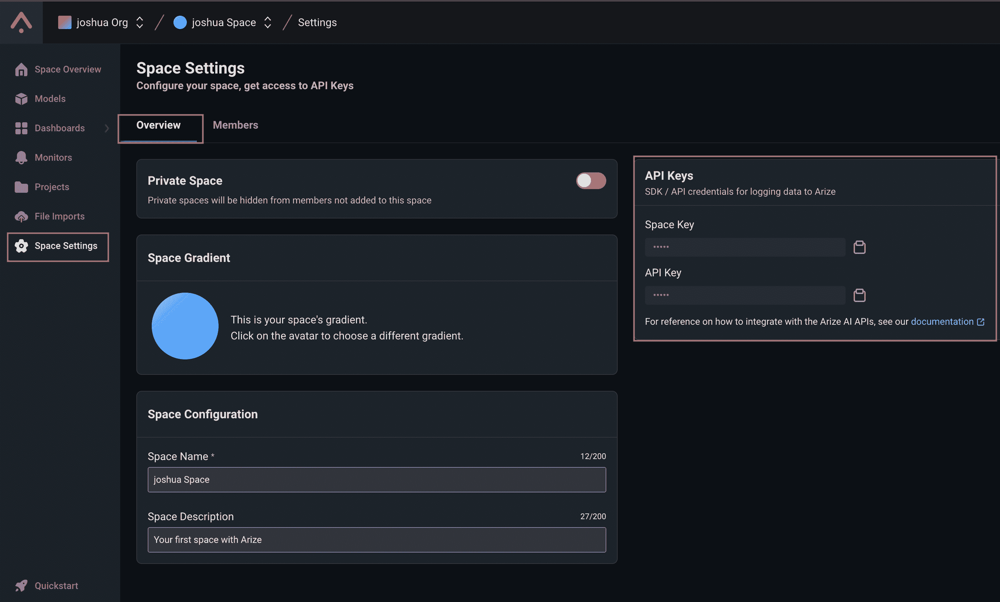
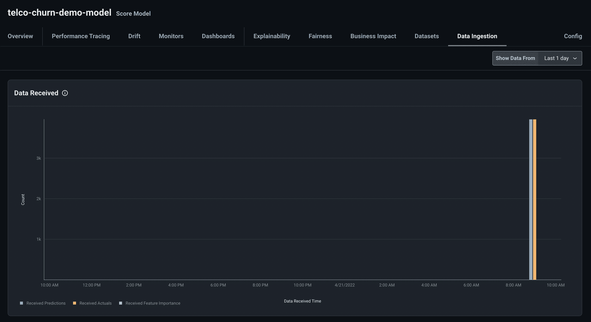
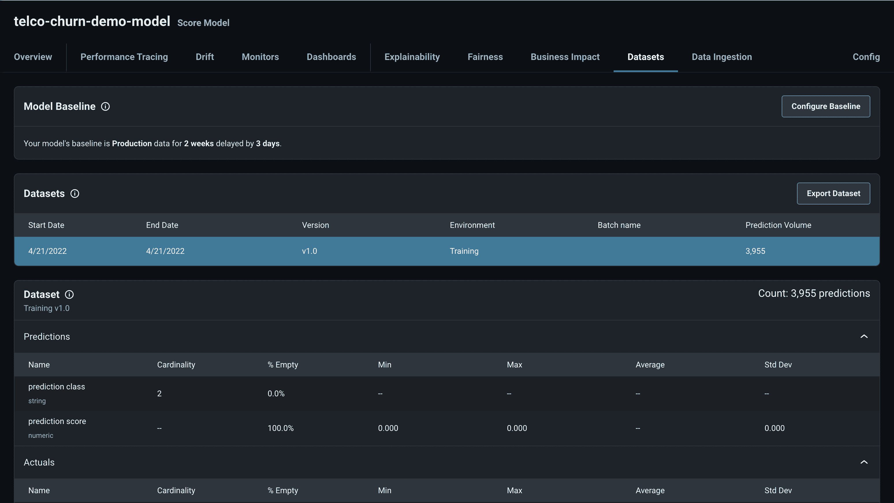
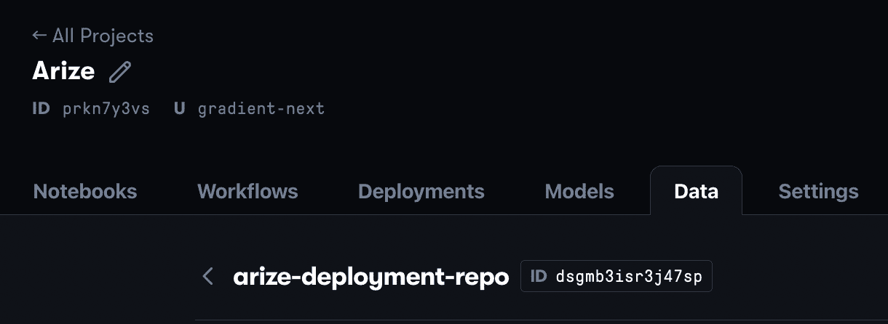
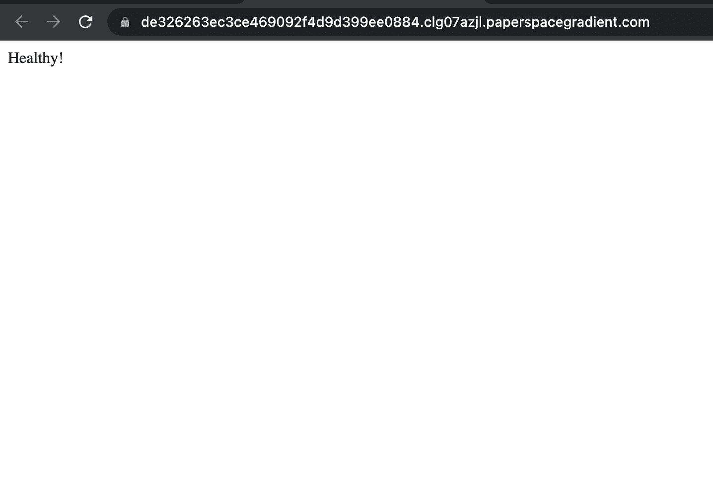
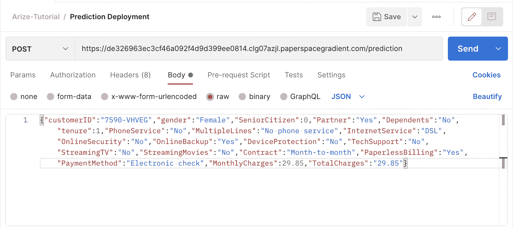
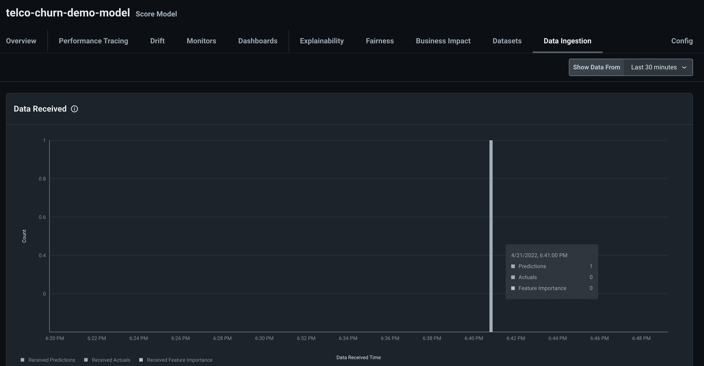
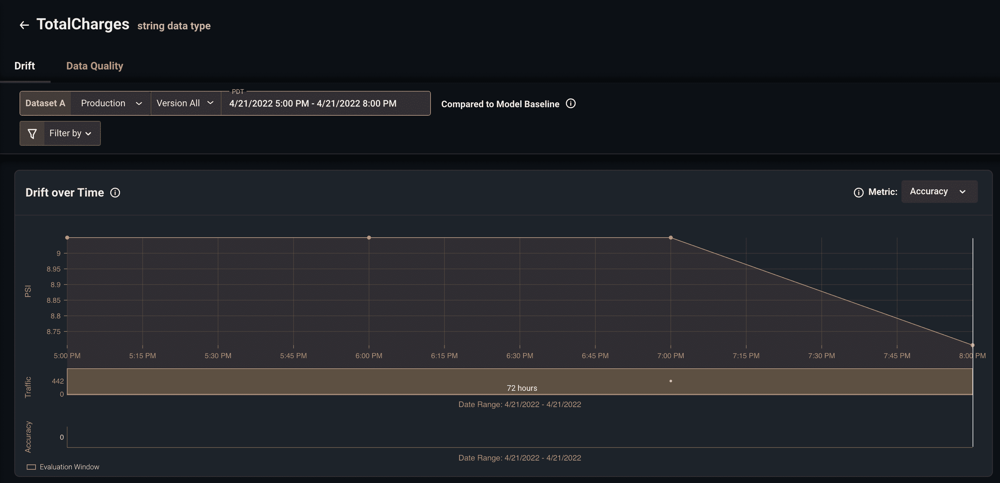

# 使用 Arize AI 监控梯度部署

> 原文：<https://blog.paperspace.com/monitoring-deployments-with-arize-ai/>

# 前言

在本教程中，您将学习如何将 Arize 集成到梯度部署中，以实现稳健的 ML 模型可观测性。本教程中使用的代码可以在这个 [GitHub 库](https://github.com/gradient-ai/Deployments-Arize-Tutorial)中找到。

本教程的视角来自一家拥有客户数据(如任期、账单历史等)的电信公司。)并希望防止客户流失。这家电信公司希望创建一个模型来确定客户是否可能流失，如果是，则采取措施(例如，向客户推销)来防止这种情况发生。一旦创建了模型，该公司希望通过跟踪数据如何随时间变化并更好地可视化他们的数据来部署模型并监控模型性能。

我们将通过 5 个主要步骤完成上述构建:

*   构建分类模型
*   集成 Arize API 和日志数据
*   配置 Arize 模型基线
*   创建模型的渐变部署
*   记录传入的 Arize 请求

我们开始吧！

* * *

# 教程步骤

## 模型构建

在这个练习中，我们首先需要一个分类模型来预测客户流失。在上面链接的 GitHub repo 中，有一个名为 *churn_model.ipynb* 的文件，其中包含了模型构建过程。在这个 Python 笔记本中，有数据导入步骤、数据预处理步骤和模型训练步骤。在这个模型训练过程的最后，XGBoost 分类模型被保存为一个名为 *xgb_cl_model.json* 的. json 文件。

本笔记本使用的数据来自 Kaggle，可在此处找到[。](https://www.kaggle.com/datasets/blastchar/telco-customer-churn)

您可以从下面的笔记本中看到模型训练和保存过程

```
import xgboost as xgb
from sklearn.metrics import accuracy_score

# Create and train a XGBoost Classifier
xgb_cl = xgb.XGBClassifier(use_label_encoder=False)
xgb_cl.fit(X_train, y_train)

# Predict on test set
preds = xgb_cl.predict(X_test)
print(accuracy_score(y_test, preds))

# Save model as .json file
xgb_cl.save_model('xgb_cl_model.json')
```

## Arize API

现在，我们已经训练并保存了我们的模型，让我们记录这个模型的训练数据，以便我们可以使用它作为基线。一旦设定了基线，任何未来的实时预测都将通过 Arize 上的模型与基线数据集进行比较，以监控数据或预测中的任何漂移。

我们需要做的第一件事是创建一个 Arize 帐户。Arize 确实有一个免费层，您可以在本教程中使用。

第一步是进入 [Arize 网站](https://arize.com)，点击*开始*，并按照提示创建您的帐户。一旦你创建了你的账户，你需要你的 Space 键和 API 键来连接你的 Python 代码。

您可以在 Arize 项目中找到这两个键，方法是在页面右侧的 Overview 选项卡中单击 Space Setting 找到它们。



一旦你有了上面的两个密钥，你就可以像下面这样把它们插入到 *churn_model.ipynb* 文件中。

```
from arize.pandas.logger import Client, Schema
from arize.utils.types import Environments, ModelTypes

SPACE_KEY = "YOUR-SPACE-KEY"
API_KEY = "YOUR-API-KEY"

arize_client = Client(space_key=SPACE_KEY, api_key=API_KEY)

model_id = (
    "telco-churn-demo-model"  # This is the model name that will show up in Arize
)
model_version = "v1.0"  # Version of model - can be any string

if SPACE_KEY == "YOUR-SPACE-KEY" or API_KEY == "YOUR-API-KEY":
    raise ValueError("❌ NEED TO CHANGE SPACE AND/OR API_KEY")
else:
    print("✅ Arize setup complete!")
```

一旦上面的单元格填充了您的键，您就可以运行 Python 笔记本的其余部分，它将使用下面的代码将训练数据加载到您的 Arize 模型中。

```
# Define a Schema() object for Arize to pick up data from the correct columns for logging
training_schema = Schema(
    prediction_id_column_name="customerID",
    prediction_label_column_name="Predicted_Churn",
    actual_label_column_name="Churn",
    feature_column_names=feature_cols,
)

# Logging Training DataFrame
training_response = arize_client.log(
    dataframe=combined_train_df,
    model_id=model_id,
    model_version=model_version,
    model_type=ModelTypes.SCORE_CATEGORICAL,
    environment=Environments.TRAINING,
    schema=training_schema,
)

# If successful, the server will return a status_code of 200
if training_response.status_code != 200:
    print(
        f"logging failed with response code {training_response.status_code}, {training_response.text}"
    )
else:
    print(f"✅ You have successfully logged training set to Arize")
```

一旦你成功运行了上面的代码单元，回到你的 Arize 账户，点击 *Spaces Overview* ，点击 *telco-churn-demo-model* 。进入 Arize 模型后，导航到 Data Ingestion 选项卡，您将看到 Arize 正在接收和处理培训数据。



Data Ingestion in Arize

这个过程可能需要 10 分钟。此过程完成后，继续本教程中的配置数据基线步骤。

## 配置数据基线

为了判断数据摄取是否已完成，在 Arize Datasets 选项卡上，您应该看到您的数据集及其要素详细信息已列出。



现在，我们希望将我们的训练数据设置为 Arize 模型基线数据。您可以通过单击数据集选项卡中的配置基线按钮来完成此操作。


使用以下设置完成配置基线过程:

*   建立基线:生产前
*   设置生产前基线:培训版本 1.0

一旦设置了基线，任何将来进入模型的请求都将与基线进行比较，这样我们就可以监控数据和预测偏差。

## 创建部署

既然已经设置了基线数据，我们将创建一个应用程序的实时部署，该应用程序服务于我们的模型，能够接受传入的 API 调用，并在 Arize 中记录这些调用以进行监控。

在 GitHub 资源库中，Python 文件中有一个 Flask 应用: *app.py* 。这个 Flask 应用程序在请求体中接受一个 json 对象，处理数据，预测客户是否会流失，并将请求数据和预测记录到 Arize。

在这个 *app.py* 文件中，你需要做的一个改变是在文件的第 71 和 72 行插入你的 Arize Space 键和 API 键。像 Python 笔记本中一样，这将允许您的应用程序连接到 Arize 模型。

一旦编写了 Flask 应用程序，我们需要在 Gradient 中部署它。第一步是创建梯度数据集。您可以通过导航到渐变项目中的数据选项卡并单击添加按钮来完成此操作。在表单中填写所需的数据集名称(例如，arize-deployment-repo ),然后单击 Create 创建新的数据集。创建数据集后，记下数据集 ID(它将是一个 15 个字符的字符串)。



在您创建数据集之后，我们现在可以部署我们的模型了。GitHub repo 中有一个名为 *deployment.yaml* 的文件。您可以使用它作为模板部署规范来构建您的梯度部署。

要构建您的部署，导航到您的渐变项目中的 deployment 选项卡，在该选项卡中，单击 Create 按钮，然后单击 upload a deployment spec 链接，如下所示。


进入表单后，将 *deployment.yaml* 中的文本复制到文本框中，并用上面创建的数据集的 ID 替换第 11 行的数据集 ID。将该文本作为部署规范粘贴并命名部署后，单击 Create Deployment。您的部署可能需要几分钟才能启动。部署成功启动后，在“部署”选项卡中，它将显示为“就绪”。

如果您单击您的部署，您将看到一个对应于部署端点的链接，如下所示。


单击该链接检查您的部署是否启动并运行。如果部署运行成功，您将看到一个页面，表明部署运行正常。



## 记录传入的请求

既然您的应用程序已经运行并可以接受传入的请求，我们将把请求发送到您的应用程序的端点。当您的应用程序收到请求时，它将处理要输入到模型中的数据，预测客户是否会流失，然后将该预测与请求数据一起写入 Arize。由于来电不断，您可以监控任何数据漂移，并查看传入流量。

有多种方法可以将 API 调用发送到您的部署，但是我将使用一个名为 Postman 的应用程序。你可以在这里下载 Postman [，它可以免费用于本教程的目的。](https://www.postman.com/downloads/)

安装后，您可以使用 Postman 向您的部署端点发送 Post 请求。在 Postman 中，通过单击页面左侧工具栏上方的 New 按钮创建一个新的 HTTP 请求。然后，将请求的类型更改为 POST，并在请求体中粘贴下面的 JSON 对象。

```
{"customerID":"7590-VHVEG","gender":"Female","SeniorCitizen":0,
 "Partner":"Yes","Dependents":"No","tenure":1,"PhoneService":"No",
 "MultipleLines":"No phone service","InternetService":"DSL",
 "OnlineSecurity":"No","OnlineBackup":"Yes","DeviceProtection":"No",
 "TechSupport":"No","StreamingTV":"No","StreamingMovies":"No",
 "Contract":"Month-to-month","PaperlessBilling":"Yes",
 "PaymentMethod":"Electronic check","MonthlyCharges":29.85,
 "TotalCharges":"29.85"}
```

最后，将部署端点粘贴到请求 URL 文本框中，并将“/prediction”附加到端点。当所有这些都完成后，您应该有一个类似下面的 Postman 请求。



设置好请求后，您可以单击 Send，将您的请求发送到您的部署中。一旦请求完成处理，您将能够在您的 Postman 页面的底部看到一个响应，它会告诉您模型预测客户会流失(流失)或不会流失(没有流失)。

现在我们已经看到了响应，让我们看看 Arize，看看我们是否能看到请求被接受。如果您导航回 Arize 模型并查看数据摄取选项卡，您应该会看到一个额外的请求。这可能需要几分钟，但如果成功，您应该会看到类似下图的内容



成功！我们的部署正在工作，并将传入的请求和预测记录到 Arize。

为了加快这一过程，我将在下面分享一些观点，就好像我们在几天内记录了 1，300 个请求一样。

首先，我们来看看预测漂移。下面的视图可以在漂移选项卡的分布比较图中找到。


我们可以看到，到目前为止，预测分布与基线预测分布相似，因此这里没有明显的问题。

接下来，让我们看看我们的特性中是否有任何其他数据漂移。


对于大多数功能来说，除了总电荷经历了更大的漂移之外，看起来只有很小的漂移。我可以调查 TotalCharges，方法是单击该功能以显示更详细的视图。



Detailed view of TotalCharges

我可以从上面的视图中看到，总电荷的漂移在 8.7 PSI 左右徘徊。我们可以密切关注这一特性，并随着时间的推移监控 PSI，以查看我们在过去 3 小时内是否有异常的数据分布，或者这是否是一个更持久的问题。

本教程到此为止！重点实际上是了解如何将渐变部署与 Arize 集成，但是还有许多其他教程可以让您更深入地了解 Arize，我将在下面链接这些教程。

## 后续步骤

上面的过程将允许您跟踪传入的请求，并分析您的梯度部署模型中的任何数据或预测漂移。然而，你可以采取很多潜在的后续步骤来增强你的 ML 可观测性系统的健壮性。

您可以创建监视器来跟踪指标，并在超过特定阈值时向您发出警报。当实际结果已知时，您也可以在流程的后期记录实际结果(例如，客户最终是否进行了搅拌)。这将帮助您跟踪您的模型在任何给定时刻的准确性，并允许您查看随时间的变化。

# 结论

太好了！现在，您应该能够构建一个服务于一个模型并与 Arize 集成的梯度部署，以便在生产中观察您的应用程序。

同样，本教程中引用的代码库的链接可以在[这里](https://github.com/gradient-ai/Deployments-Arize-Tutorial)找到。

最后，如果你想看其他使用 Arize 的教程，请点击查看它们的示例页面[。](https://docs.arize.com/arize/examples)