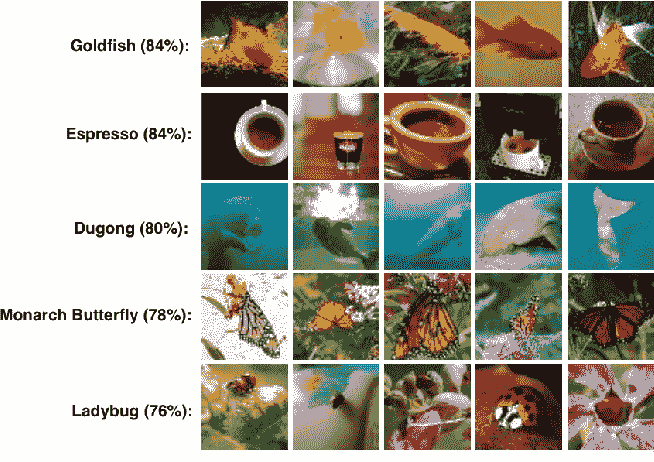
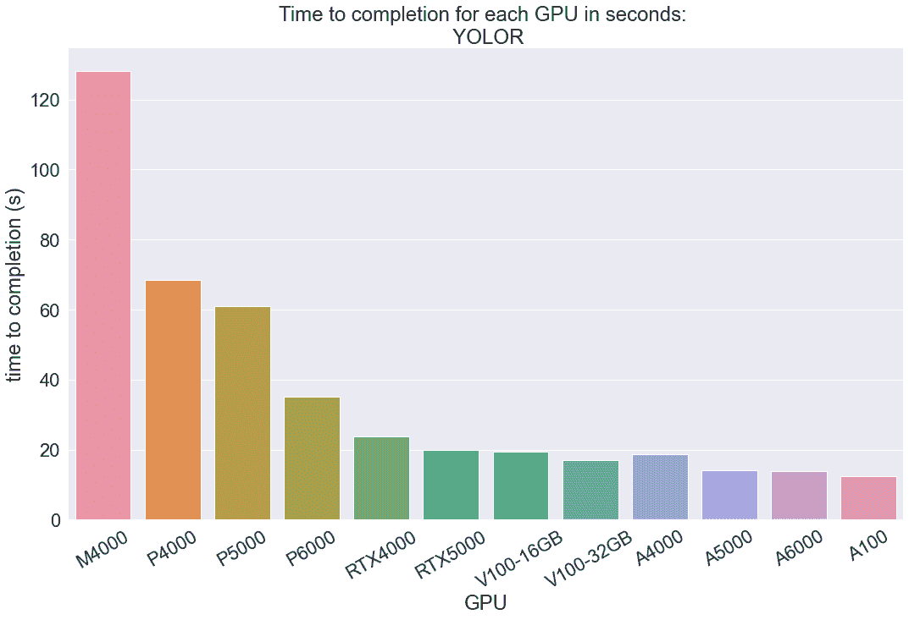
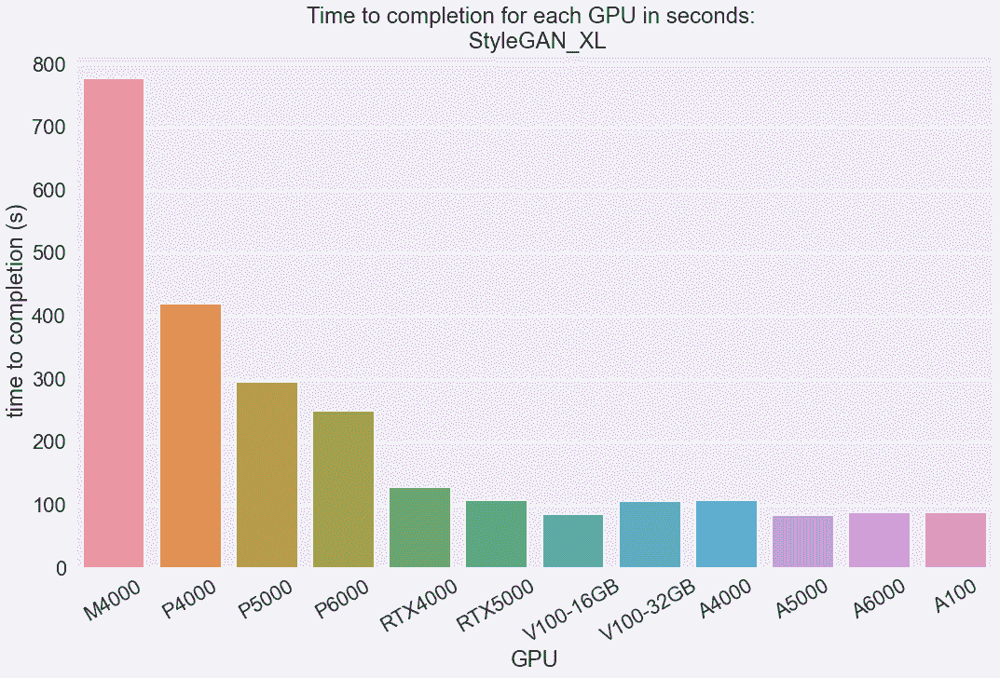
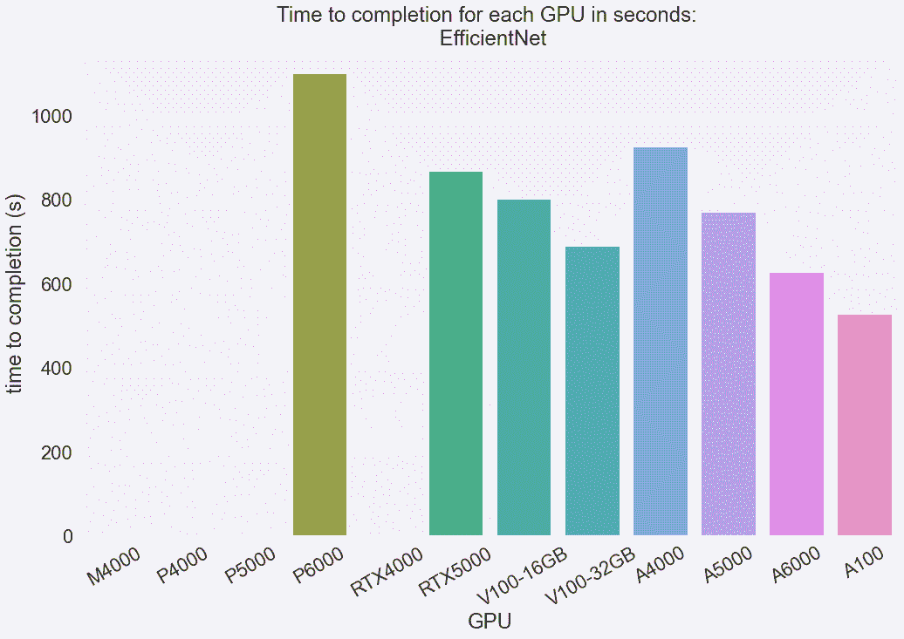
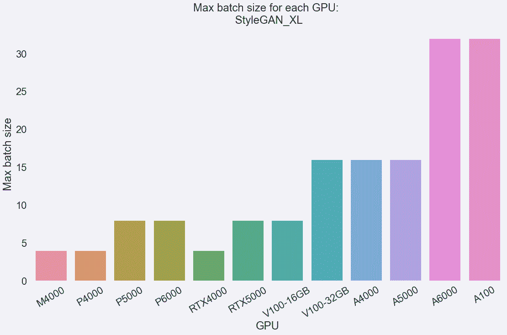
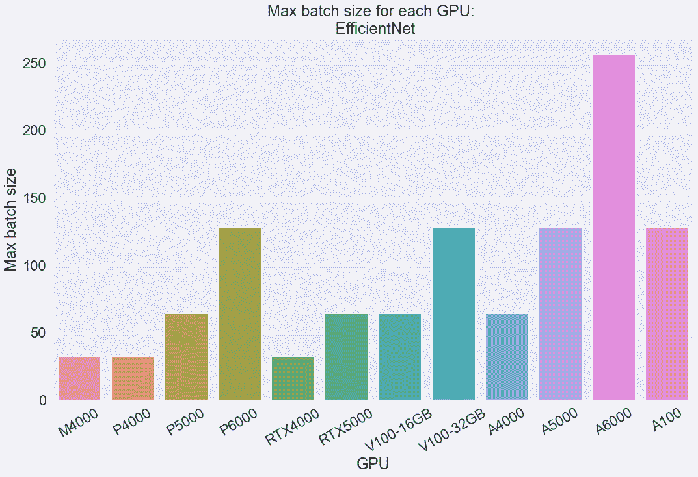

# Paperspace 上可用 GPU 机器的可解释基准测试

> 原文：<https://blog.paperspace.com/best-gpu-paperspace-2022/>

作为数据科学家、机器学习工程师和 ML/深度学习爱好者，我们许多人都有过尝试选择最佳平台来进行云计算的经历。获得更多的计算往往是必要的，尤其是现在，航运业当前的问题正在大幅提高已经很高的 GPU 价格。此外，即使可用性不是问题，购买 GPU 也不总是划算的。通常，使用 ML ops 平台来最经济高效地满足您的计算需求是最佳选择。

每个平台都有各种不同的 GPU 和 CPU 类型用于它们的远程机器，竞争对手之间也有一定程度的差异。这些图形处理器的范围可以从较老、较弱的 Maxwell 一代图形处理器到尖端的 Ampere 系列图形处理器。这些在功能方面非常大，每个网站上都附有一些有用的规格，如 GPU 内存。对于我们很多人来说，这就足够选机了。对许多其他人来说，这可能是开始遇到问题的地方。我们如何选择最适合我们需求的 GPU？

从 Paperspace 中选择 GPU 时，无论是核心还是渐变，对于没有领域知识的人来说，知道选择哪种 GPU 都是一个挑战。虽然很明显，更多的 GPU 内存和更高的价格可能意味着更好的机器，但选择不是最便宜或最贵的 GPU 是许多人会避免考虑的事情。这不符合成本效益，但深入硬件世界并真正理解选项之间的差异可能具有挑战性。

为了帮助这一过程，这篇博客文章将在三个计算机视觉相关的深度学习基准系列的背景下，分析可用 GPU 机器之间的功耗和成本差异。我们将从两个方面考虑这些基准:完成时间和最大批量。然后，我们将根据速度、功耗和成本提出一系列建议。

## 要知道的术语

*   吞吐量/带宽:衡量一项任务在一段时间内可以完成的次数。以每秒千兆字节为单位。
*   GPU 内存:GPU 可用于处理数据的可用内存，以千兆字节为单位。
*   解决问题的时间:完成任务所需的时间。这可以是训练时间、生成时间等，以秒为单位。
*   最大批量输入大小:NN/model 在面临内存不足风险之前可以处理的每个批量的最大大小。

# 纸张空间机器事实:

<colgroup><col width="105"><col width="61"><col width="61"><col width="61"><col width="61"><col width="61"><col width="61"><col width="61"><col width="61"><col width="61"><col width="61"><col width="61"><col width="61"></colgroup>
| 国家政治保卫局。参见 OGPU | M4000 | P4000 | P5000 | P6000 | v100 至 16GB | v100 至 32GB | RTX4000 | RTX5000 | A4000 | A5000 | A6000 | A100 |
| 产生 | 麦克斯韦 | 帕 | 帕 | 帕 | 沃尔特河 | 沃尔特河 | 图灵 | 图灵 | 安培 | 安培 | 安培 | 安培 |
|  |  |  |  |  |  |  |  |  |  |  |  |  |
| CUDA 核心 | One thousand six hundred and sixty-four | One thousand seven hundred and ninety-two | Two thousand five hundred and sixty | Three thousand eight hundred and forty | Five thousand one hundred and twenty | Five thousand one hundred and twenty | Two thousand three hundred and four | Three thousand and seventy-two | Six thousand one hundred and forty-four | Eight thousand one hundred and ninety-two | Ten thousand seven hundred and fifty-two | Six thousand nine hundred and twelve |
| GPU 内存(GB) | eight | eight | Sixteen | Twenty-four | Sixteen | Thirty-two | eight | Sixteen | Sixteen | Twenty-four | Forty-eight | Forty |
| 万亿次浮点运算中的单精度性能(SP FP32) | Two point six | Five point three | Nine | Twelve | Fourteen | Fourteen | Seven point one | Eleven point two | Nineteen point two | Twenty-seven point eight | Thirty-eight point seven | Nineteen point five |
| 内存带宽(GB/s) | One hundred and ninety-two | Two hundred and forty-three | Two hundred and eighty-eight | Four hundred and thirty-two | Nine hundred | Nine hundred | Four hundred and sixteen | Four hundred and forty-eight | Four hundred and forty-eight | Seven hundred and sixty-eight | Seven hundred and sixty-eight | One thousand five hundred and fifty-five |
|  |  |  |  |  |  |  |  |  |  |  |  |  |
| vCPU | eight | eight | eight | eight | eight | eight | eight | eight | eight | eight | eight | Twelve |
| 记忆 | Thirty-two | Thirty-two | Thirty-two | Thirty-two | Thirty-two | Thirty-two | Thirty-two | Thirty-two | Forty-eight | Forty-eight | Forty-eight | Ninety-seven |
| 存储包括(GB) | Fifty | Fifty | Fifty | Fifty | Fifty | Fifty | Fifty | Fifty | Fifty | Fifty | Fifty | Fifty |
| 每小时价格 | $0.45 | $0.51 | $0.78 | $1.10 | $2.30 | $2.30 | $0.56 | $0.82 | $0.76 | $1.38 | $1.89 | $3.09 |
| 每月价格(仅限使用，无订阅) | $0 | $0 | $0 | $0 | $0 | $0 | $0 | $0 | $0 | $0 | $0 | $0 |
|  |  |  |  |  |  |  |  |  |  |  |  |  |
| 此实例所需的订阅价格 | $0.00 | $8.00 | $8.00 | $8.00 | $39.00 | $39.00 | $8.00 | $8.00 | $8.00 | $39.00 | $39.00 | $39.00 |
| 每月价格使用和订阅 | $0 | $8 | $8 | $8 | $39 | $39 | $8 | $8 | $8 | $39 | $39 | $39 |
|  |  |  |  |  |  |  |  |  |  |  |  |  |
| 可供选择 | 是 | 是 | 是 | 是 | 是 | 是 | 是 | 是 | 是 | 是 | 是 | 是 |
| 每 GB/分钟的费用(吞吐量) | $0.14 | $0.13 | $0.16 | $0.15 | $0.15 | $0.15 | $0.08 | $0.11 | $0.10 | $0.11 | $0.15 | $0.12 |
| 每 100 个 CUDA 核心的费用(小时) | $0.03 | $0.03 | $0.03 | $0.03 | $0.04 | $0.04 | $0.02 | $0.03 | $0.01 | $0.02 | $0.02 | $0.04 |
| 每内存美元(GB) | $0.06 | $0.06 | $0.05 | $0.05 | $0.14 | $0.14 | $0.07 | $0.05 | $0.05 | $0.06 | $0.04 | $0.08 |
| 每万亿次浮点运算美元 | $0.17 | $0.10 | $0.09 | $0.09 | $0.16 | $0.16 | $0.08 | $0.07 | $0.04 | $0.05 | $0.05 | $0.16 |

*注意:M4000 实际上在坡度上总是自由的。我们使用核心定价。这是为了比较。P5000 和 RTX5000 还可以免费选择 [Pro 计划。](https://www.paperspace.com/pricing)

让我们来看看我们已经知道的关于 Paperspace GPUs 的相关数据。上表中特别包括 GPU 内存、内存带宽和每月价格值。这些将是我们用来帮助计算我们在成本方面的基准比较。您应该始终根据这些因素来选择您的 GPU，因为它们间接转化为运行模型一整月、每天 24 小时或总共 720 小时的功耗、速度和成本效益。

我们包含了底部 4 行的热图。绿色单元格表示基于这些指标的更具成本效益的选项，红色单元格表示更昂贵的选项。让我们先来看看我们在这种背景下的 GPU 选项。

虽然 A100 在效率方面比大约一半的替代品都贵，但在 GPU 内存方面，它总是很有吸引力。就计算能力而言，这可能是过度的，成本也很高(尽管比其他选项如 [AWS](https://aws.amazon.com/ec2/instance-types/p4/) 便宜)，但由于其巨大的吞吐量，它将永远是最快的。其他人可能会默认使用免费的 M4000，利用 Gradient 上所有用户都可以访问的免费笔记本类型。但是，如果您运行的是生产 ML，那么选择使用 M4000 将永远失去潜在的效率。其他付费选项可以更快地完成同样的任务，这通常是值得的。基于对这些极端选项的观察，选择最贵或最便宜的选项总是很诱人的，但它不是有效的。

相反，本基准和 GPU 规格指南旨在帮助您为渐变任务选择最佳选项。例如，考虑使用 RTX4000 机器，而不是 M4000。升级到增长计划将使 RTX4000 完全免费使用，每月只需 8 美元，实际上是以相对较低的成本对所有任务进行一对一升级。如果您需要更多的功率，安培系列 GPU，如 A4000，A5000 和 A6000 可能是最具成本效益的选择。

我们希望任何阅读本文的人能够更好地了解他们的需求，然后引导他们选择适合其任务的机器类型。带着这些想法，让我们看看基准测试，看看每种机器类型在实践中的表现。

# 基准测试的假设和注释:

下面是我们在进行基准测试时所做的假设和注释列表，以及一些您需要记住的内容。考虑每一个问题，以及这可能如何影响我们对结果的解释，以便全面理解基准推理。

*   模型基准将在完成任务时达到足够令人满意的质量，不值得报告任何类型的评估度量。模型功效与测量训练时间无关，因为每个 GPU 仍将经历相同的任务，它与推理时间无关，因为我们将使用的预训练 YOLOR 模型已经被评估为有效。此外，其中一个基准有目的地减少了纪元的数量，以至于在任何其他实践中都没有用。
*   所有其他任务(其他笔记本内核)将从控制台中清除，因此其他进程不会占用额外的内存。
*   我们使用的数据是为这项任务优化的。不太优化的数据集可能会给深度学习模型的训练和推理的时间方面带来不同的影响。
*   M4000 只能在坡道上免费通行。我们使用基于 [Paperspace 核心定价的近似样本价格。](https://docs.paperspace.com/gradient/machines/)
*   所有 A4000、A5000 和 A6000 实例都有 48.3 GB 的 CPU 内存，所有 A100 实例都有 96.6 GB 的 CPU 内存。所有其他实例都有 32.2 GB 的 CPU 内存。
*   在 GPU 名称中，前面的字母 out 代表 GPU 一代。这些就是麦克斯韦，帕斯卡，伏打，图灵和安培，按照他们最近被介绍的顺序排列。一般来说，与旧架构具有相似规格的新架构将优于旧架构。
*   所有基准都是在图纸空间梯度上完成的。

# 基准任务:

<https://blog.paperspace.com/content/media/2022/04/movie.mp4>


Before and after using YOLOR on the input clip

### 视频上的对象识别检测

YOLOR 是一种新的物体检测和识别算法。我们今天用它来预测一个 [youtube 视频](https://www.youtube.com/watch?v=b8QZJ5ZodTs)中的物体。由于对象识别和检测是计算量很大的任务，这些将直接向我们显示每个 GPU 能够多快地使用该模型进行预测，并从中我们可以对它们的性能进行比较推断。

推理参数:

```
cfg cfg/yolor_csp_x.cfg #config file
weights yolor_csp_x.pt 
conf-thres 0.25 # object confidence threshold
img-size 1280 # img size to load in frames as
device 0 # our GPU
```

### 图像分类-高效网和微型图像网 200



Example photos and classifications from Tiny ImageNet 200 - [Source](http://cs231n.stanford.edu/reports/2015/pdfs/leonyao_final.pdf)

对于我们的下一个例子，我们将采用深度学习最常见的用例之一:图像分类。我们将在 tiny-imagenet-200 数据集上实现 efficient net([，它可以从公共数据集自由挂载到任何笔记本电脑上](https://blog.paperspace.com/introducing-gradient-datasets-ide-updates/))，并使用训练分类器所需的不同时间作为我们对效率以及它可以接收的最大批量的度量。这将作为我们深度学习模型的更传统的例子。

本测试基于本图像分类教程。

培训参数:

```
batch_size = 256
lr = 0.001  # Learning rate
num_epochs = 1  # Number of epochs
log_interval = 300  # Number of iterations before logging
loss_func = nn.CrossEntropyLoss()
optimizer = optim.Adam(model.parameters(), lr=lr)
```

### 图像生成- StyleGAN_XL 图像生成


HQ Sample generated images from the authors - [Source](https://github.com/autonomousvision/stylegan_xl)

最后，我们将使用 [StyleGAN_XL](https://github.com/autonomousvision/stylegan_xl) ，这是最近发布的 StyleGAN 框架的实现，旨在生成 1024 x 1024 分辨率的图像，以基准测试图像合成模型训练时间。由于图像合成是如此昂贵，我们把它作为一个很好的例子来说明不同的 GPU 如何执行计算量大的任务。此外，该任务与图像分类任务的不同之处还在于使用昂贵的高质量图像进行训练。

培训参数:

```
cfg=stylegan3-t #StyleGAN config
data=stylegan_xl/data/pokemon256.zip
gpus=1 #number of GPUs
batch=8 #batch size 
kimg 5 # size of subset to process in each epoch
metrics none
```

# 基准测试结果:

## 吞吐量:

<colgroup><col width="99"><col width="47"><col width="47"><col width="47"><col width="47"><col width="47"><col width="47"><col width="47"><col width="47"><col width="47"><col width="47"><col width="47"><col width="47"></colgroup>
| 国家政治保卫局。参见 OGPU | M4000 | P4000 | P5000 | P6000 | RTX4000 | RTX5000 | V100 至 16GB | v 1100 至 32GB | A4000 | A5000 | A6000 | A100 |
| 内存带宽(GB/s) | One hundred and ninety-two | Two hundred and forty-three | Two hundred and eighty-eight | Four hundred and thirty-two | Four hundred and sixteen | Four hundred and forty-eight | Nine hundred | Nine hundred | Four hundred and forty-eight | Seven hundred and sixty-eight | Seven hundred and sixty-eight | One thousand five hundred and fifty-five |
| 每 GB/分钟的费用(吞吐量) | $0.14 | $0.13 | $0.16 | $0.15 | $0.08 | $0.11 | $0.15 | $0.15 | $0.10 | $0.11 | $0.15 | $0.12 |

### 最佳 GPU:吞吐量

**吞吐量最好的 GPU:A100。**当您需要快速处理大量数据时，请使用这款 GPU。

**每 GB/分钟最佳 GPU 定价:RTX4000。**当您需要在预算内快速处理大数据时，请使用这款 GPU。

**预算最佳 GPU:RTX 4000。**当节约成本是主要目标时，请使用这款 GPU

### 理由:

在进入基准测试任务之前，让我们先关注一下上面列出的一个度量:吞吐量。吞吐量或带宽对于了解我们的 GPU 执行任务的速度非常有用。从字面上看，它是对每秒可处理的 GB 数的度量，实际上也是对其处理速度的度量。这一指标不同于机器的总内存容量，因为某些架构比其他架构更能利用其增加的容量。

这有效地降低了这些选项的成本，例如，在吞吐量方面，与类似的 A4000 相比，使用 RTX5000 的功能更便宜。您可以使用吞吐量来估计不同 GPU 的成本效率，作为时间和机器租赁成本之间关系的函数。使用这些信息，我们可以更好地考虑来自同一代的较弱的 GPU 选项，这些选项在吞吐量上获得了相当的性能。当长期成本比速度更重要时，这一点尤其值得考虑，例如 RTX4000 和 A5000。也就是说，A100 实际上在吞吐量的成本效益方面比较好。

查看吞吐量让我们对如何比较不同的 GPU 产品有了一个抽象的想法，现在让我们来看看计算机视觉基准，看看上表中列出的不同值如何实际影响模型的完成时间，例如在训练和推理中。

## 完成时间:

<colgroup><col width="99"><col width="47"><col width="47"><col width="47"><col width="47"><col width="47"><col width="47"><col width="47"><col width="47"><col width="47"><col width="47"><col width="47"><col width="47"></colgroup>
|  | M4000 | P4000 | P5000 | P6000 | RTX4000 | RTX5000 | V100 至 16GB | v 1100 至 32GB | A4000 | A5000 | A6000 | A100 |
| 黄色 | One hundred and twenty-eight point one eight | Sixty-eight point five seven | Sixty point nine eight | Thirty-five point two | Twenty-three point seven seven | Twenty point zero two | Nineteen point three four | Seventeen point zero four | Eighteen point six six | Fourteen point one one | Thirteen point eight eight | Twelve point four two |
| StyleGAN_XL (s) | Seven hundred and seventy-seven | Four hundred and nineteen | Two hundred and ninety-five | Two hundred and forty-nine | One hundred and twenty-eight | One hundred and seven | Eighty-five point six seven | One hundred and five point three three | One hundred and six point six seven | Eighty-three | Eighty-seven point three three | Eighty-eight point three three |
| 高效网络 | OOM* | OOM* | OOM* | One thousand one hundred | OOM* | Eight hundred and sixty-seven | Eight hundred and one | Six hundred and ninety | Nine hundred and twenty-five | Seven hundred and sixty-nine | Six hundred and twenty-seven | Five hundred and twenty-eight |
| 成本(每小时美元) | $0.45 | $0.51 | $0.78 | $1.10 | $0.56 | $0.82 | $2.30 | $2.30 | $0.76 | $1.38 | $1.89 | $3.09 |
| 单次运行成本** | $0.02 | $0.01 | $0.01 | $0.01 | $0.00 | $0.00 | $0.01 | $0.01 | $0.00 | $0.01 | $0.01 | $0.01 |
| StyleGAN_XL 单次运行成本** | $0.10 | $0.06 | $0.06 | $0.08 | $0.02 | $0.02 | $0.05 | $0.07 | $0.02 | $0.03 | $0.05 | $0.08 |
| 单次运行净成本** | 失败！ | 失败！ | 失败！ | $0.34 | 失败！ | $0.20 | $0.51 | $0.44 | $0.20 | $0.29 | $0.33 | $0.45 |

*OOM:内存不足。这表明由于内核中缺少内存资源，训练失败。

**单次运行成本:以秒为单位的时间转换为小时，然后乘以每小时的成本。反映任务在 GPU 上运行一次的成本。

完成时间是以秒为单位来衡量模型训练或(在 YOLOR 的情况下)做出推断所需的时间。我们选择这个指标作为我们的基准，因为它直观地有助于理解不同 GPU 产品之间的能力差异。例如，它可以让我们了解不同的值(如 GPU 内存和吞吐量)如何影响不同模型的训练时间。我们对每个任务使用 3 - 5 个记录的墙壁时间，以获得上面报告的平均墙壁时间。第一个记录的值不包括在内，因为需要运行的各种下载任务或设置任务导致这些条目明显慢于后续运行。

### 最佳 GPU:完成时间

从完成时间来看，最佳 GPU:A100。如果您想尽快完成任务，请使用 A1000。

作为运行成本函数的最佳 GPU:a 4000。使用 A4000 快速完成任务，同时节省成本。

**预算最佳 GPU:RTX 5000。**当成本是最重要的因素时，使用 RTX5000。

### 理由:

#### 尤洛



我们最快的任务是，YOLOR 比较在 YouTube 短视频中识别物体的速度。正如您所看到的，这项任务揭示了不同 GPU 代的完成时间之间存在一些明显的差异。Maxwell 和 Pascal GPU 架构更老，效率更低。这些的低吞吐量值反映在它们较低的完成时间值上。例如，虽然 Turing RTX4000 与 Pascal P5000 具有相同数量的 GPU 内存，但由于其更高的吞吐量和更现代的架构，它的速度要快得多。另一方面，A4000 也有类似的 GPU RAM，但比 RTX4000 更快，因为它的新架构支持更高的吞吐量。然而，更高的 GPU 内存可以抵消这种影响，Volta V100 的表现优于更新但功能更弱的 RTX5000。最后，拥有最新架构、最高吞吐量值和 RAM 的 Ampere 系列 GPU 执行推理的速度最快。A100 总是最快的，尽管内存比 A6000 少。这可能是因为 A100 的吞吐量几乎是 A6000 的两倍。

#### StyleGAN_XL



StyleGAN_XL 涉及在 Pokemon 的图像集合上训练这个流行的 StyleGAN 框架的大型新实现。看上面的表格，我们可以看到一个类似的模式，与我们在 YOLOR 上完成的推理任务的结果相同。麦克斯韦和帕斯卡再次是慢得多的选项，然后是图灵 RTX GPU，V100s，最快的是安培系列。

这里有一些异常值，似乎没有反映在 GPU 规格中。在多个笔记本电脑中，A5000 优于 A6000 和 A100，V100 16GB 优于 V100 32GB。这可能只是这一特定培训任务的一个怪癖，所以我们不要太看重 V100 16GB 和 A5000 在这里的令人难以置信的性能。您可能仍然会发现 V100 32GB 和 A100 分别更有价值。尽管有这些异常值，这些发现进一步表明 A100 和其他安培系列 GPU 速度极快。Volta GPUs 的次佳选项要贵得多，因此在这项任务中选择 A5000 或 A6000 似乎是最具成本效益的。

#### 效率网



高效网络分类任务是我们希望在输入大小方面推动 GPU 的地方。我们选择在这里的所有测试中使用相对较大的批量 64，以便了解每个 GPU 可以多快地处理这些相对较大的输入批量。虽然 tiny-imagenet-200 图像的分辨率相对较低，为 64 x 64，但它们仍然是 RGB 图像，处理起来很昂贵。正如您所看到的，这比其他两个任务花费的时间长得多，一些 GPU 在完成之前就耗尽了内存(M4000、P4000、P5000 和 RTX4000)。这是意料之中的，因为我们想提供一个例子，让我们将这些 GPU 的能力发挥到极限，并展示一些 Pascal 和 Maxwell 实例可能无法满足您的任务。

这个任务显示了与 YOLOR 任务相同的训练时间模式。Pascal 和 Maxwell 一代机器很难完成这个任务，P6000 虽然运行，但相对来说是最慢的。另一方面，RTX5000 继续保持其高性价比的趋势。虽然比在其他机器上运行的测试要慢，但是当时间不是主要的开销因素时，成本使它成为一个非常有吸引力的选择。到目前为止，Volta 和 Ampere 系列 GPU 的性能最快，而之前基准测试中的异常值 V100s 和 A5000 在这项任务中恢复了预期行为。

## 最大批处理输入大小(批处理大小:int):

<colgroup><col width="99"><col width="47"><col width="47"><col width="47"><col width="47"><col width="47"><col width="47"><col width="47"><col width="47"><col width="47"><col width="47"><col width="47"><col width="47"></colgroup>
| 国家政治保卫局。参见 OGPU | M4000 | P4000 | P5000 | P6000 | RTX4000 | RTX5000 | V100 至 16GB | v 1100 至 32GB | A4000 | A5000 | A6000 | A100 |
| 成本(每小时美元) | $0.45 | $0.51 | $0.78 | $1.10 | $0.56 | $0.82 | $2.30 | $2.30 | $0.76 | $1.38 | $1.89 | $3.09 |
| StyleGAN_XL(最大批量) | four | four | eight | eight | four | eight | eight | Sixteen | Sixteen | Sixteen | Thirty-two | Thirty-two |
| StyleGAN_XL(用于批处理项) | Zero point one one three | Zero point one two eight | Zero point zero nine eight | Zero point one three eight | Zero point one four | Zero point one zero three | Zero point two eight eight | Zero point one four four | Zero point zero four eight | Zero point zero eight six | Zero point zero five nine | Zero point zero nine seven |
| 效率网(最大批量) | Thirty-two | Thirty-two | Sixty-four | One hundred and twenty-eight | Thirty-two | Sixty-four | Sixty-four | One hundred and twenty-eight | Sixty-four | One hundred and twenty-eight | Two hundred and fifty-six | One hundred and twenty-eight |
| 效率净值(每批项目美元) | Zero point zero one four | Zero point zero one six | Zero point zero one two | Zero point zero zero nine | Zero point zero one eight | Zero point zero one three | Zero point zero three six | Zero point zero one eight | Zero point zero one two | Zero point zero one one | Zero point zero zero seven | Zero point zero two four |

测试输入的最大批量大小为我们提供了一个概念，即模型在每个 GPU 的每个更新阶段能够处理多少数据。在我们的例子中，最大批处理大小告诉我们在耗尽内存之前，模型每次迭代可以处理多少图像。因此，最大批量输入大小是在 GPU 无法再处理任务之前，该任务的代价有多高的间接衡量标准。

## 最佳 GPU:最大批量

处理大批量数据的最佳 GPU:a 6000。这款 GPU 实际上比 A100 拥有更多内存和 CUDA 内核，但吞吐量较低。如果我们需要处理更昂贵的任务，那么 A6000 是最好的选择。

**批量项目成本最佳 GPU:a 6000。**a 6000 也是两种训练任务中最具成本效益的。就每个项目的处理而言，A6000 具有最佳的成本/处理项目比率。P6000 也是一个不错的选择。

**预算最佳 GPU:a 4000。**对于 A4000 上的两项任务，每小时的总成本和每批项目的成本相对较低。A4000 的性能几乎与 A6000 一样好，而价格却不到 A6000 的一半，StyleGAN_XL 的性能表明它在成本效益方面可能比 a 6000 更好。

## 理由:

### StyleGAN_XL:



StyleGAN_XL Max batch sizes

StyleGAN_XL 任务专门用于训练模型以生成高质量、1024 x 1024 分辨率的图像。因此，我们输入的图像质量(1280x1280)比 tiny-imagenet-200 (64 x 64)高得多，并且需要更多的 GPU 处理能力。这就是为什么批量比 EfficientNet 测试中的小得多。

不出所料，我们在上面的完成时间测试中看到了类似的模式。随着一代和 GPU 内存的增加，这些值也随之增加。由于 RAM 只有 8 GB，这就是 M4000、P4000 和 RTX4000 只能管理 4 个批处理的原因。内存较大的 Pascal 和 RTX GPU 性能稍好，但相比之下，Volta 和 Ampere GPUs 的大内存往往使它们的性能较低。另一方面，A6000 和 A100 的内存分别为 48gb 和 40 GB。这使他们能够处理我们可以为此任务收集的最大批量，32。

就成本而言，Ampere 系列 GPU 在处理每批项目的成本方面表现突出。这可能是每种 GPU 类型中高 GPU 内存、吞吐量和 CUDA 核心的交叉的直接结果。A6000 和 A4000 似乎是最划算的，每件 5 - 6 美分。根据这一指标，V100 16 GB 最终被显示为成本效益最低的产品，这可能是因为较旧的 Volta 架构在处理大批量数据方面不如 RTX 或安培 GPU，同时运行成本第二高，为每小时 2.30 美元。

### 效率网



Max batch sizes for EfficientNet

使用 tiny-imagenet-200 进行的 EfficientNet 测试非常适合显示批量大小，因为即使是较弱的 GPU 也可以毫无问题地处理相当数量的 64 x 64 图像。我们可以使用该测试更直观地了解不同测试条件下批次大小之间的差异程度。

在 EfficientNet 中，我们看到的与 StyleGAN XL 斗争的 3 个实例再次反映了它们的相对弱点。M4000、P4000 和 RTX4000 的内存都只有 8 GB，很难在这种低得多的分辨率下处理超过 32 幅图像。在它们之后，出现了一种基于 GPU 内存的新模式。更强大的 Pascal P5000 和 P6000 分别获得 64 和 128，显示了 RAM 的每次提升都有明显的跳跃。同样，RTX5000 GPU 最多可以处理 64 个批量。A6000 以 256 的成绩表现最好，P6000、32 GB V100、A5000 和 A100 以 128 的成绩并列第二。向上滚动到我们的事实表，我们可以看到这些 GPU 分别有 24、32、24 和 40 GB 的内存。这可能意味着使用 40 到 48 GB 的内存处理 256 个批处理成为可能。从所有这些，我们可以清楚地推断出最大批量大小和 GPU 内存之间的直接关系。

至于成本，V100 16 GB 的效率也很低。与 StyleGAN_XL 一样，它具有第二低的批量大小，同时每小时的成本较高，与其他选项相比，其费率不具吸引力。

第二差的选择是 A100，每小时的费用最高。我们不想删除这些数据，但这可能会产生误导。在这项任务中，A100 在处理大批量方面仍然是第二高效的。在此之后，RTX5000、V100 32GB、M4000、P4000 和 P5000 似乎代表了每项成本的平均水平。

根据成本与批量的比率，运行 EfficientNet 的最佳选择是剩下的三个安培 GPU 和 P6000。A4000 和 A5000 的性能很好，每处理一个项目的成本仅略高于 1 美分，但 P6000 和 A6000 的价格低于 1 美分。这直接反映了每个实例中相对较高的内存量(分别为 24 GB 和 48 GB ),以及运行它们相对较低的成本。P6000 的内存大小与 A5000 相同，但运行成本却高出约 80%。与此同时，A6000 的价格比 A100 贵 60%左右，而且可以在几乎相同的速度下处理更大的批量。基于此信息，如果您需要使用大批量，就项目文件大小或批量本身而言，请考虑使用 A6000 或 A5000。

# 结论性论点

根据我们上面检查的基准和规格，我们现在可以尝试形成一个完整的结论，即对于不同的任务，哪些 GPU 在纸张空间梯度上表现最好。这是通过使用 YOLOR、StyleGAN_XL 和 EfficientNet 的一系列推理和训练任务完成的。通过测量时间和批量大小，以及关于成本和 GPU 规格的现有信息，我们能够根据功耗、成本、速度和效率给出选择 GPU 的建议。

我们现在将为 4 种不同的情况推荐最佳的整体 GPU:当代码需要尽可能快地运行时，当需要处理尽可能大的输入时，以及当我们希望尽可能经济地运行任务时。这些不同的情况应该涵盖我们的用户可能遇到的各种各样的潜在情况。虽然这些结论都是基于我们的基准测试，但它们也反映在成本和 GPU 规格数据中。

#### 最佳 GPU:总体推荐

当我们想尽可能快地运行一个模型，而不考虑成本时，那么 **A100** 就是我们的推荐。A100 的最高吞吐量为 1555 GB/s，是普通消费者可以使用的 GPU 技术的巅峰，并且总是能够足够快地完成工作，因此它的高价格不会成为问题。它还拥有第二高的可用 GPU 内存，40 GB，因此它可以承担几乎任何为单个 GPU 设计的任务。就整体性能而言，这无疑是 Paperspace 上可用的最佳 GPU。

当我们想要为模型训练的最大可能输入量做准备时，那么 **A6000** 是我们的推荐。凭借 48 GB 的 GPU RAM，A6000 可以处理大批量数据。这反映了其大容量的 GPU 内存和稳定的吞吐能力，当我们需要使用大批量进行训练时，当我们需要使用 GPU 内存访问大量其他变量、数据或模型时，或者手头有特别复杂的任务(如图像生成)时，我们应该始终选择 A6000。A6000 甚至比 A100 更适合使用，不考虑成本差异！

当我们希望尽可能便宜地运行我们的机器或深度学习代码时，那么我们的推荐是 **A4000** 。就成本效益而言，A4000 是 GPU 的最有效选择。它拥有最佳的吞吐量价格比、完成时间价格比和每批项目成本比，并且由于其 16 GB 的内存，它在处理大量数据时仍然非常强大。

注意:设置基准有一些奇怪的地方，这使得共享包含示例的笔记本变得困难。作者正在制作一个像样的版本，但你可以在这里访问[渐变笔记本。](https://console.paperspace.com/te72i7f1w/notebook/rafsbhux04qtq30?file=%2Fnotebook.ipynb)