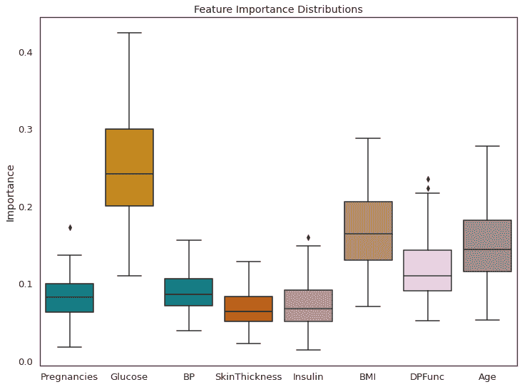
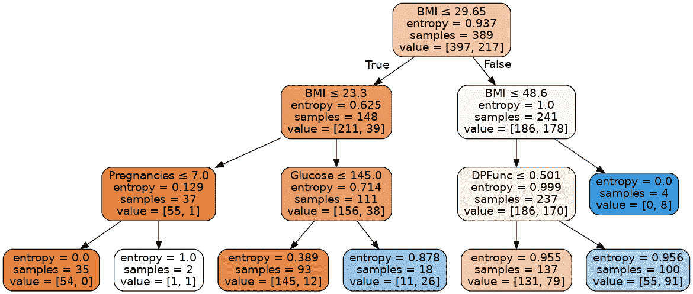
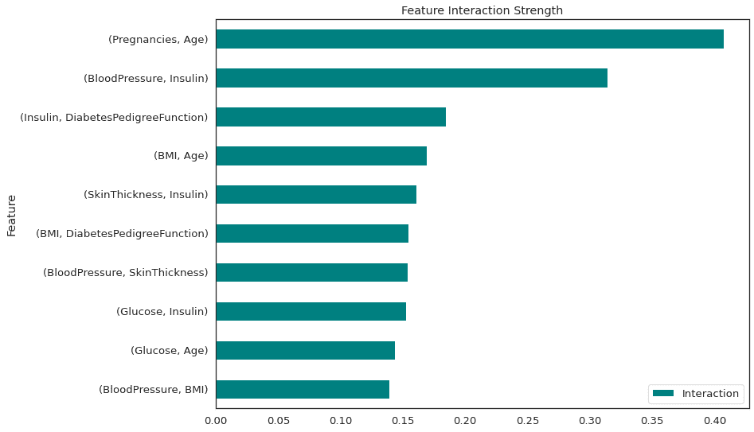
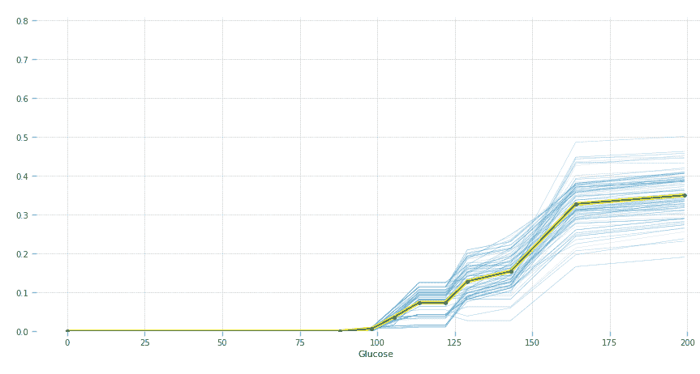
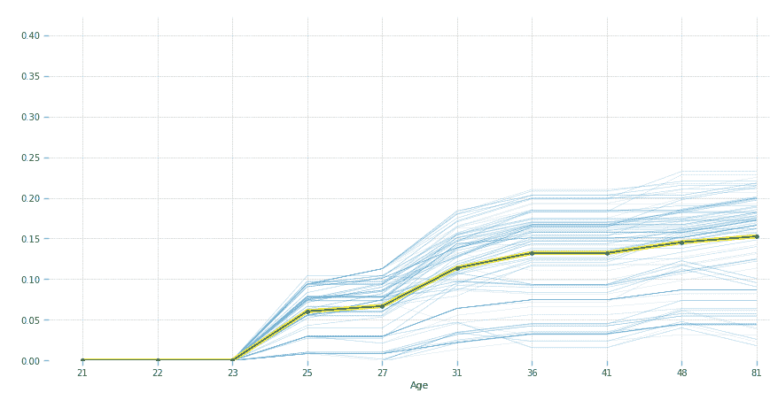
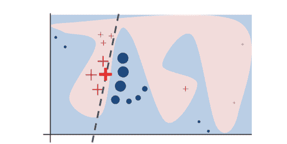
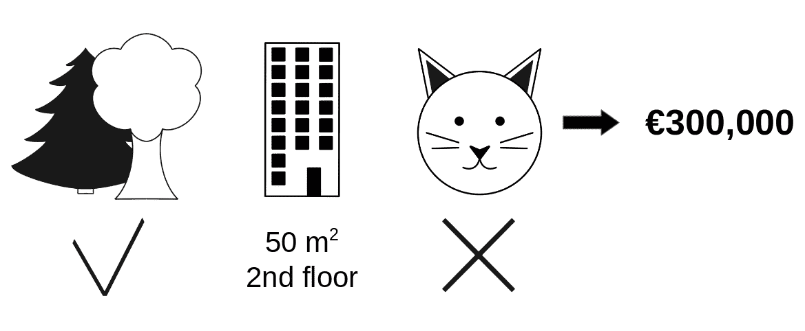
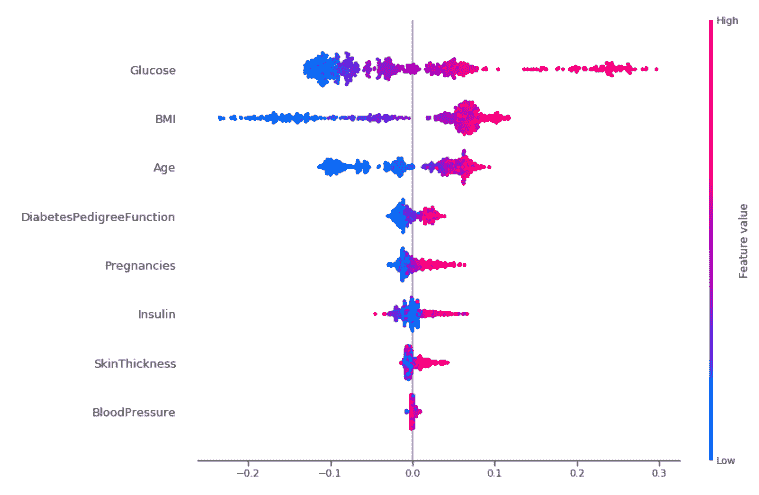

# 可解释机器学习入门

> 原文：<https://blog.paperspace.com/interpretable-machine-learning/>

机器学习模型长期以来一直因经常是黑箱或“无法解释”而臭名昭著。甚至使用这些模型的人也不知道模型的内部权重和决策。此外，如果你对利益相关者负责，拥有一个黑箱模型不再是一个选择。

这是一个关于可解释性的经典迷因。


[Image Source](https://www.pinterest.com/pin/725009239997333830/)

是不是只有业内人士，才是罪魁祸首？不完全是，人工智能领域几乎所有的研究都集中在更好的架构、超越基准、新颖的学习技术，或者在某些情况下只是建立具有 10 亿个参数的巨大模型。可解释的机器学习的研究相对来说还未被触及。人工智能在媒体中越来越受欢迎(由“点击诱饵”媒体标题引起)和复杂，只会使可解释性的情况恶化。

以下是可解释 ML 如此重要的其他原因。

*   ****人类的好奇心和求知欲****——人类这个物种天生好奇。当某些事情与人类先前的信念相矛盾时，人类会特别寻找解释。互联网上的人可能会好奇为什么某些产品和电影会被推荐。为了解决这种与生俱来的愿望，公司已经开始解释他们的建议。


[Image Source](https://medium.com/@judaikawa/building-and-evaluating-a-recommender-system-for-implicit-feedback-59495d2077d4)

*   ****建立信任****——当你向潜在买家推销你的 ML 产品时，他们为什么要信任你的模型？他们如何知道模型在所有情况下都会产生好的结果？在我们的日常生活中，需要可解释性来增加 ML 模型的社会接受度。类似地，与他们的个人家庭助理交互的消费者会想要知道某个动作背后的原因。解释有助于我们理解和理解机器。
*   ****调试**和检测偏差**——当你试图推理一个意想不到的结果或者在你的模型中发现一个 bug 时，可解释性变得非常有用。最近，人工智能模型也因偏向于某些种族和性别而受到关注，在模型部署到现实世界之前，可解释的模型可以检测和纠正这一点。

## 可解释性和性能并不密切相关

在金融和医疗保健等高风险领域，数据科学家通常会使用更传统的机器学习模型(线性或基于树的模型)。这是因为，模型解释其决策的能力对业务非常重要。例如，如果你的模型拒绝了一个人的贷款申请，你不能因为不知道是什么因素促成了模型的决定而逃脱。尽管简单的最大似然模型的表现不如神经网络等更复杂的模型，但它们在本质上是可解释的，也更透明。决策树可以很容易地被可视化，以理解在哪个级别使用哪个特征来进行决策。它们还带有一个要素重要性属性，该属性告知哪些要素在模型中贡献最大。

然而，使用如此简单的模型总是以性能为代价并不是一个真正的解决方案。我们需要像集成和神经网络这样的复杂模型，它们可以更准确地捕捉数据中的非线性关系。这就是**模型不可知**解释方法的用武之地。

在这篇博客中，我们将使用一个[糖尿病数据集](https://www.kaggle.com/uciml/pima-indians-diabetes-database)来探索其中的一些解释技术，并在其上训练一个简单的分类算法。我们的目标是根据一个人的特征来预测他是否患有糖尿病，并且我们将尝试推理模型的预测。

所以，让我们开始吧！

```
import pandas as pd
from sklearn.ensemble import RandomForestClassifier
from sklearn.model_selection import train_test_split 
```

加载数据集以查看要素。

```
df = pd.read_csv("diabetes.csv")
df.head() 
```


我简单解释一下特性:

*   怀孕——患者过去怀孕的次数
*   *-血糖浓度(mg/dL)*
*   **-舒张压(毫米汞柱)**
*   ***-三头肌皮褶厚度(mm)***
*   ****胰岛素** - 2 小时血清胰岛素(μU/ml)**
*   ***BMI** -身体质量指数(体重单位为 kg/(身高在 m)^2)*
*   ***糖尿病谱系功能**——它决定了一个性状具有显性还是隐性的遗传模式。当患者在家族中有糖尿病病史时，它被计算出来。*
*   **——年龄以年计。**
*   ****结果**——一个人是否患有糖尿病(0 =否，1 =是)**

*让我们将数据集分为训练和测试，并拟合一个模型。*

```
*`target=df['Outcome']
df=df.drop(labels=['Outcome'],axis=1)
# train-test split
X_train, X_test, y_train, y_test = train_test_split(df, target, test_size=0.2, random_state=42)
# fit the model 
rfc=RandomForestClassifier(random_state=1234)
rfc.fit(X_train,y_train)
# evaluate the results
rfc.score(X_test,y_test)`* 
```

 *现在，我们有了一个基本的模型，是时候探索解释技术了。第一个是特征重要性，这是一种特定于决策树及其变体的技术。

### 特征重要性

要素重要性或置换要素重要性通过置换要素并观察模型的误差来测量。直觉是，如果改变一个特征改变了模型的误差，这意味着模型依赖于该特征进行预测，那么该特征是重要的。反之亦然。

```
import seaborn as sns
features =["Pregnancies","Glucose","BP","SkinThickness","Insulin","BMI","DPFunc","Age"]
all_feat_imp_df = pd.DataFrame(data=[tree.feature_importances_ for tree in 
                                     rfc],
                               columns=features)
(sns.boxplot(data=all_feat_imp_df)
        .set(title='Feature Importance Distributions',
             ylabel='Importance')); 
```



根据特征的重要性，血液中的葡萄糖水平以及身体质量指数和年龄是将患者分类为糖尿病患者的最重要的特征。这个结果似乎是合理的。血液中葡萄糖水平高基本就是糖尿病，[肥胖者更容易得](https://www.diabetes.co.uk/diabetes-and-obesity.html)。这项[研究](https://www.ncbi.nlm.nih.gov/pmc/articles/PMC3507610/)显示，由于随着年龄的增长，胰岛素抵抗增加和胰岛功能受损的综合影响，老年人处于患二型糖尿病的高风险中。

到目前为止，我们可以说我们的模型在数据分类方面做得很好。它已经学会了正确的权重，是可以信任的。

> takealways:

*   特征重要性提供了对模型行为的高度压缩的全局洞察。
*   置换特征的重要性来源于模型的误差。在某些情况下，您可能想知道某个特性的模型输出变化有多大，而不考虑它对性能的影响。
*   具有相关特征可以通过在两个特征之间分割重要性来降低相关特征的重要性。

### 示例 ML:决策树

使用决策树的一大优势是它们非常直观。接下来，我们将绘制树本身，以理解树中每个节点所做的决策。

```
from IPython.display import Image  
from sklearn.tree import export_graphviz
import graphviz
import pydotplus
from io import StringIO  

# Get all trees of depth 3 in the random forest
depths3 = [tree for tree in rfc.estimators_ if tree.tree_.max_depth==3]
# grab the first one
tree = depths3[0]
# plot the tree
dot_data = StringIO()
export_graphviz(tree, out_file=dot_data, feature_names=features, 
                filled=True, rounded=True, special_characters=True)
graph = pydotplus.graph_from_dot_data(dot_data.getvalue())  
Image(graph.create_png()) 
```



基于写在节点顶部的特征，每个非叶节点被分割。在树的左边部分，我们将样本分类为非糖尿病，在右边部分分类为糖尿病。最左边叶节点的[熵函数](https://towardsdatascience.com/entropy-and-information-gain-in-decision-trees-c7db67a3a293)变为 0，因为数据变得同质(所有样本不是糖尿病就是非糖尿病)。值数组中的第一个值表示有多少样本被归类为非糖尿病样本，第二个值表示有多少样本为糖尿病样本。对于最左边的叶节点，熵是 0，因为所有 54 个样本都是非糖尿病的。

树可能是最本质上可解释的模型。还有其他这样的模型，如广义线性模型，朴素贝叶斯，K-最近邻，但使用这些方法的问题是，它们对于不同的模型是不同的。因此，解释各不相同。用于解释逻辑回归模型的方法与用于解释 KNN 的方法不同。因此，博客的其余部分将致力于独立于应用它们的模型的方法。

## 模型不可知的方法

我们将通过可视化特征交互来开始模型不可知方法。因为在现实世界中，特性很少是相互独立的，所以理解它们之间的交互很重要。

### 特征交互

当预测模型中的功能之间存在交互时，预测不能表示为功能效果的总和，因为一个功能的效果取决于另一个功能的值。两个特征之间的相互作用被计算为在考虑了单个特征的影响之后通过改变特征而发生的预测变化。

这个情节是基于弗里德曼和波佩斯库提出的 [****H 统计量**** 。在不涉及技术细节的情况下，H 统计量将特征之间的相互作用定义为由相互作用解释的方差的份额。](https://arxiv.org/abs/0811.1679)

R 中有很多实现这个的包。不幸的是，对于 python 用户来说，只有 sklearn-gbmi 包(据我所知)可以计算梯度增强模型的 H 统计量。

```
from sklearn.ensemble import GradientBoostingClassifier
from sklearn_gbmi import *
# fit the model
gbc = GradientBoostingClassifier(random_state = 2589)
gbc.fit(X_train,y_train)
# d is a dictionary of feature pairs and their respective interaction strength
d=h_all_pairs(gbc,X_train)
l=sorted(d.items(), key=lambda x: x[1])
l=l[-10:] # let's just take the top 10 interactions
data=pd.DataFrame(l)
data.columns=['Feature',"Interaction"]
data.index=data['Feature']
data=data.drop(labels=['Feature'],axis=1)
data.plot(kind='barh', color='teal', title="Feature Interaction Strength") 
```



怀孕次数和年龄之间以及血压和胰岛素之间有很强的相互作用。所有这些互动都是双向的。

> take all:-

*   该统计检测所有类型的交互，不管它们的特定形式。
*   由于统计量是无量纲的，并且总是在 0 和 1 之间，所以它可以跨要素甚至跨模型进行比较(尽管对于 Python 用户来说还不行)
*   H 统计量告诉我们相互作用的强度，但是它没有告诉我们相互作用看起来如何。下一类解释方法正是为此。

### 部分相关图

部分相关性图(短 PDP 或 PD 图)显示了一个或两个特征对机器学习模型预测结果的[边际效应](https://www.statisticshowto.com/marginal-effects/)。它可以显示目标和特征之间的关系的性质，该关系可以是线性的、单调的或更复杂的。

部分相关图是一种全局和局部的方法。该方法考虑了所有实例，并给出了关于特征与预测结果(通过黄线)的全局关系以及所有唯一实例(数据帧中的行)与结果(通过蓝线)的关系的陈述。

```
from pdpbox import pdp, info_plots
pdp_ = pdp.pdp_isolate(
    model=estimator, dataset=X_train, model_features=X_train.columns, feature='Glucose'
)
fig, axes = pdp.pdp_plot(
    pdp_isolate_out=pdp_, feature_name='Glucose', center=True, 
     plot_lines=True, frac_to_plot=100) 
```



y 轴可以解释为预测值相对于基线或最左侧值的变化。蓝线代表所有实例，黄线代表平均边际效应。不同的影响可以通过蓝线看出。

血糖升高会增加患糖尿病的几率。非糖尿病人的正常空腹血糖在[70 ~ 100mg/dL](https://www.webmd.com/diabetes/diagnosing-type-2-diabetes)之间，这也是图表所证明的。

```
pdp_ = pdp.pdp_isolate(
    model=estimator, dataset=X_train, model_features=X_train.columns, feature='Age'
)
fig, axes = pdp.pdp_plot(
    pdp_isolate_out=pdp_, feature_name='Age', center=True, x_quantile=True, 
     plot_lines=True, frac_to_plot=100) 
```



根据我们的模型，23 岁以后的人更容易患糖尿病。

PDP 易于实施且直观。由于 PDP 图显示的是边际效应，根据定义，边际效应假设其他协变量不变，因此它忽略了现实世界中的特征通常是相关的这一事实。因此，对于房价回归问题，两个特征是房子的面积和房间的数量。为了计算房间数量对价格的边际影响，它将保持房子的面积不变，比如说 30 平方米 2 平方米，这对于一个有 10 个房间的房子来说是不太可能的。

[累积局部效应(ALE)图](https://christophm.github.io/interpretable-ml-book/ale.html)通过查看所有特征的条件分布(而非边缘分布)并考虑预测差异(而非平均值)来解决上述问题。

### 局部可解释模型不可知解释(LIME)

LIME 使用代理模型进行解释。代理模型被训练为使用稀疏线性模型(称为代理)来近似底层黑盒模型的预测。这些代理模型只是近似模型的局部行为，而不是全局行为。

让我们通过一个例子来看看 LIME 执行的步骤。



[Image Source](https://arxiv.org/pdf/1602.04938v1.pdf)

原始模型的决策函数由蓝色/粉红色背景表示，这显然是非线性的。亮红色的十字是正在解释的实例(我们称它为 X)。我们对 X 周围的扰动实例进行采样，并根据它们与 X 的接近程度对它们进行加权(图中的权重由大小表示)。原始模型对这些扰动实例的预测用于学习线性模型(虚线),该线性模型很好地逼近 x 附近的模型。因此，该解释在局部而非全局工作良好。

```
import lime
import lime.lime_tabular
classes=['non-diabetic','diabetic']
explainer = lime.lime_tabular.LimeTabularExplainer(X_train.astype(int).values,  
mode='classification',training_labels=y_train,feature_names=features,class_names=classes)
#Let's take a look for the patient in 100th row
i = 100
exp = explainer.explain_instance(X_train.loc[i,features].astype(int).values, estimator.predict_proba, num_features=5)
# visualize the explanation
exp.show_in_notebook(show_table=True)
``
```


橙色特征支持糖尿病类，蓝色特征支持非糖尿病类。

解释有三个部分:—

1.  左上部分给出了类别 0 和类别 1 的预测概率。
2.  中间部分给出了 5 个最重要的特征。橙色要素属于糖尿病类，蓝色要素属于非糖尿病类。
3.  右侧部分遵循与 1 和 2 相同的颜色编码。它包含前 5 个变量的实际值。

这可以读作: **女方患糖尿病的概率为 0.67。她的葡萄糖水平、身体质量指数、年龄和糖尿病患者的功能都表明*患有*糖尿病*、*，我们已经在* PDP *图中看到了这是如何发生的。然而，她只有一次怀孕*、*，而*不会*导致糖尿病*、*，但与确定糖尿病*的其他更关键的特征相比，这具有较小的权重。*

如果这个可视化激发了你对石灰的兴趣，这里有[文档](https://lime-ml.readthedocs.io/en/latest/lime.html#module-lime.lime_image)。

> take all:-

*   向外行人解释时非常有用的人性化解释。
*   LIME 和我们讨论过的其他方法一样，也有忽略相关性的限制。数据点是从高斯分布中采样的，假设特征不相关。这可能导致不太可能的数据点，然后这些数据点可以用于学习局部解释模型。
*   这些解释也可能是不稳定的。如果重复采样过程，那么得出的解释可能会不同。

### SHAP

SHAP (SHapley 附加解释)是一种流行的解释方法，可用于全局和局部解释。它利用[博弈论](https://en.wikipedia.org/wiki/Game_theory)来衡量特征对预测的影响。为了解释预测，我们可以从假设实例的每个特征值是游戏中的 **【玩家】** 开始，其中预测是*。然后，shapley 值将告诉您如何在特性之间公平地分配“支出”。*

*更准确地说，“游戏”是数据集的单个实例的预测任务。“增益”是该实例的实际预测减去输入到模型中的所有实例的平均预测。“玩家”是协作接收增益或预测某个值的实例的特征值。*

*让我们从这本[书](https://christophm.github.io/interpretable-ml-book/shapley.html)中举个例子，更好地理解这一点。*

*

[Image Source](https://christophm.github.io/interpretable-ml-book/shapley.html)* 

*回到我们之前预测公寓价格的例子。假设某套公寓的价格预测为 300，000 美元，我们的工作就是解释这一预测。这一预测的一些特征包括:*

 **   这套公寓的面积为 50 平方米
*   它位于二楼
*   它附近有一个公园
*   禁止养猫。

现在，所有公寓的平均预测是 31 万美元。我们想知道，与平均预测相比，每个特征值对预测的贡献有多大？

答案可能是:公园附近贡献了 30，000 美元，大小- 50 贡献了 10，000 美元，二楼贡献了 0 美元，禁止猫贡献了-50，000 美元。贡献总计为-10，000 美元，最终预测减去准确预测的平均公寓价格。

Shapley 值计算为所有可能联盟中某个特征值的平均边际贡献。联盟只不过是不同的模拟环境，通过改变一个特性，同时保持其他一切不变，并注意效果。例如，如果“禁止养猫”变成了“允许养猫”,而所有其他特征都相同，我们检查预测是如何变化的。

让我们试着解释一下对病人的分类。

```
import shap
# create our SHAP explainer
shap_explainer = shap.TreeExplainer(estimator)
# calculate the shapley values for our data
shap_values = shap_explainer.shap_values(X_train.iloc[7])
# load JS to use the plotting function
shap.initjs()
shap.force_plot(shap_explainer.expected_value[1], shap_values[1], X_train.iloc[7]) 
```


导致预测增加的要素显示为粉红色，导致预测减少的要素显示为蓝色，它们的值代表影响的大小。基值是 0.3498，我们预测是 0.7。该患者被归类为糖尿病患者，将结果推向糖尿病的特征是葡萄糖水平=161、年龄=47、胰岛素=132 和 10 次怀孕。身体质量指数的功能，这是低，试图否定的影响，但不能，因为组合的影响，粉红色的功能远远超过了它。

如果从粉色条的长度中减去蓝色条的长度，则等于从基准值到输出的距离。

让我们也来看一下 **Summary plo** t，以了解该型号的整体情况。

```
shap_values = shap_explainer.shap_values(X_train)
shap.summary_plot(shap_values[1], X_train,auto_size_plot=False) 
```



好吧，我们来试着解读一下这个！这幅图是由许多点组成的。他们每个人都有三个特点:

*   垂直位置显示了它所描绘的特征。
*   颜色显示该特征对于数据集的该行是高还是低。
*   水平位置显示该值对预测有负面影响还是正面影响。

葡萄糖行中最右边的点是粉红色的，这意味着葡萄糖水平高，这增加了患糖尿病的机会，就像我们以前看到的一样。其他特征如身体质量指数、年龄和怀孕也是如此，但对葡萄糖的影响更明显。

> 外卖:

*   与其他方法相比，解释速度相当快，而且这种技术在博弈论中有坚实的基础。
*   预测和平均预测之间的差异是 ****在实例的特征值中公平分布**** 而不像石灰。
*   KernelSHAP(我们之前讨论过的)忽略了特征依赖，因为从边缘分布中采样通常更容易。然而，如果特征是相关的，这将导致对不太可能的数据点赋予过多的权重。SHAP 的另一个变体 TreeSHAP 通过显式建模条件预期预测来解决这个问题。

### 结论

机器学习应用越来越多地被行业采用，在未来几十年里，它只会变得更加无处不在。为了确保这些系统不会在现实世界中灾难性地失败，就像 Zillow 的崩溃一样，我们需要更多地关注可解释性，而不是复杂和花哨的架构。

这个博客旨在让你一瞥可解释性的世界。如果你想了解更多，我强烈推荐这本由 Christoph Molnar 写的书:[可解释的 ML Book](https://christophm.github.io/interpretable-ml-book/) 。**