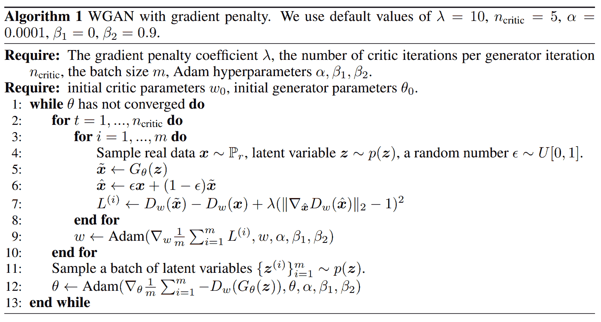

# WGAN: Wasserstein 生成对抗网络

> 原文：<https://blog.paperspace.com/wgans/>


Photo by [Sung Jin Cho](https://unsplash.com/@mbuff?utm_source=ghost&utm_medium=referral&utm_campaign=api-credit) / [Unsplash](https://unsplash.com/?utm_source=ghost&utm_medium=referral&utm_campaign=api-credit)

自 2014 年以来，由于这些架构具有巨大的潜力，生成式对抗网络(GANs)一直在接管深度学习和神经网络领域。虽然最初的 GANs 能够产生不错的结果，但当试图执行更困难的计算时，它们经常被发现失败。因此，已经提出了这些 gan 的几种变体，以确保我们能够实现可能的最佳结果。在我们之前的文章中，我们已经介绍了这种版本的 GANs 来解决不同类型的项目，在本文中，我们也将这样做。

在这篇文章中，我们将讨论 Wasserstein GAN (WGANs)中的一种生成对抗网络(GANs)。我们将了解这些 WGAN 发生器和鉴别器结构的工作原理，并详述其实现细节。我们将使用梯度惩罚方法来研究它的实现，最后，从头开始构建一个具有以下架构的项目。整个项目可以在 Paperspace 上提供的 Gradient 平台上实施。对于那些想培训这个项目的观众，我会推荐他们去看看这个网站，同时实施这个项目。

## 简介:

生成对手网络(GANs)是人工智能和深度学习领域的一项巨大成就。自从最初引入以来，它们一直被用于大型项目的开发中。虽然这些 gan 及其竞争的发电机和鉴别器模型能够取得巨大成功，但这些网络也有几个失败的案例。

两个最常见的原因是收敛失败或模式崩溃。在收敛失败的情况下，模型不能产生最优或良好质量的结果。在模式崩溃的情况下，模型无法产生重复类似模式或质量的独特图像。因此，为了解决其中的一些问题或解决众多类型的问题，逐渐出现了许多为 GANs 开发的变体和版本。

虽然我们已经在之前的一些文章中讨论了[dcgan](https://blog.paperspace.com/getting-started-with-dcgans/)的概念，但在这篇博客中，我们将重点讨论 WGAN 网络如何应对这些问题。与简单的 GAN 架构相比，WGAN 为训练模型提供了更高的稳定性。WGAN 中使用的损失函数也为我们提供了评估模型的终止标准。虽然有时可能需要稍长的训练时间，但这是获得更有效结果的较好选择之一。让我们在下一节中更详细地理解这些 WGANs 的概念。

* * *

## 了解 WGANs:

生成对抗网络(GANs)的工作思想是利用两种主要的概率分布。其中一个主要的实体是发生器的概率分布(Pg)，它指的是来自发生器模型输出的分布。另一个重要的实体是来自真实图像(Pr)的概率分布。生成性对抗网络的目标是确保这两种概率分布彼此接近，使得生成的输出是高度真实和高质量的。

为了计算这些概率分布的距离，机器学习中的数理统计提出了三种主要方法，即 kull back-lei bler 散度、Jensen-Shannon 散度和 Wasserstein 距离。Jensen-Shannon 发散(也是一种典型的 GAN 损耗)最初是简单 GAN 网络中更常用的机制。

然而，这种方法在处理梯度时存在问题，可能导致不稳定的训练。因此，我们利用 Wasserstein 距离来解决这些重复出现的问题。数学公式的表示如下所示。参考下面的[研究论文](https://arxiv.org/pdf/1701.07875.pdf)以获得更多阅读和信息。


[Image Source](https://arxiv.org/pdf/1701.07875.pdf)

在上面的等式中，最大值表示对鉴别器的约束。在 WGAN 架构中，鉴别器被称为鉴别器。这种惯例的原因之一是没有 sigmoid 激活函数将值限制为 0 或 1，这意味着真或假。相反，WGAN 鉴别器网络返回一个范围内的值，这使得它可以不那么严格地充当批评家。

等式的第一部分代表实际数据，而第二部分代表发电机数据。上述等式中的鉴别器(或评论家)旨在最大化真实数据和生成数据之间的距离，因为它希望能够相应地成功区分数据。生成器网络旨在最小化真实数据和生成数据之间的距离，因为它希望生成的数据尽可能真实。

* * *

## 了解工作组的实施细节:

对于 WGAN 网络的原始实现，我建议查看下面的[研究论文](https://arxiv.org/pdf/1701.07875.pdf)。它详细描述了架构构建的实现。critic 为与 GAN 相关的问题的期望计算添加了有意义的度量，并且还提高了训练稳定性。

然而，最初的研究论文的一个主要缺点是，使用了一种重量剪裁的方法，发现这种方法并不总是像预期的那样最佳地工作。当重量削减足够大时，它导致更长的训练时间，因为评论家要花很多时间来适应预期的重量。当权重裁剪较小时，它会导致渐变消失，尤其是在大量图层、无批量归一化或与 RNNs 相关的问题的情况下。

因此，有必要稍微改进 WGAN 的培训机制。下面的[研究论文](https://arxiv.org/pdf/1704.00028.pdf)介绍了解决这些问题的最佳方法之一，该论文使用梯度罚函数法解决了这个问题。本文的研究有助于改进 WGAN 的训练。让我们看一下为完成所需任务而提出的算法的图像。



[Image Source](https://arxiv.org/pdf/1704.00028.pdf)

WGAN 使用梯度惩罚方法来有效地解决该网络的先前问题。WGAN-GP 方法提出了一种替代权重剪裁的方法，以确保平滑的训练。作者没有削减权重，而是提出了一种“梯度惩罚”，通过添加一个损失项来保持鉴别器梯度的 L2 范数接近 1 ( [源](https://keras.io/examples/generative/wgan_gp/))。上面的算法定义了我们在使用这种方法时必须考虑的一些基本参数。

λ定义了梯度惩罚系数，而 n-critic 指的是每次生成器迭代的 critic 迭代次数。alpha 和 beta 值指的是 Adam 优化器的约束。该方法提出，在添加具有梯度惩罚的损失函数之前，我们利用生成图像旁边的插值图像，因为它有助于满足 Lipschitz 约束。该算法一直运行，直到我们能够在所需数据上实现令人满意的收敛。现在让我们看看这个 WGAN 的实际实现，用梯度罚函数法来构造 MNIST 项目。

* * *

## 用 WGANs 构建一个项目:

在本文的这一部分中，我们将根据我们对运行方法和实现细节的理解来开发 WGAN 网络。我们将确保在训练 WGAN 网络时使用梯度惩罚方法。对于本项目的构建，我们将利用来自官方 Keras 网站的以下参考[链接](https://keras.io/examples/generative/wgan_gp/)，其中考虑了大部分代码。

如果你在 Gradient 中工作，我建议你使用 TensorFlow 运行时创建一个笔记本。这将在安装了 TensorFlow 和 Keras 的 docker 容器中设置您的环境。

### 导入基本库:

我们将利用 TensorFlow 和 Keras 深度学习框架来构建 WGAN 架构。如果您不太熟悉这些库，我将推荐您参考我以前广泛涉及这两个主题的文章。观众可以通过这个[链接](https://blog.paperspace.com/absolute-guide-to-tensorflow/)查看 TensorFlow 的文章，通过下面的[链接](https://blog.paperspace.com/the-absolute-guide-to-keras/)查看 Keras 的博客。这两个库应该足以完成这个项目中的大多数任务。如果需要，我们还将为一些数组计算导入 numpy，为一些可视化导入 matplotlib。

```
import tensorflow as tf
from tensorflow import keras
from tensorflow.keras import layers
import matplotlib.pyplot as plt
import numpy as np
```

### 定义参数和加载数据:

在本节中，我们将定义一些基本参数，定义几个在整个项目中重复使用的神经网络模块，即 conv 模块和上采样模块，并相应地加载 MNIST 数据。让我们首先定义一些参数，例如 MNIST 数据的图像大小，它是 28 x 28 x 1，因为每个图像的高度和宽度都是 28，并且有一个通道，这意味着它是一个灰度图像。让我们也定义一个基本批量大小和一个噪声维度，生成器可以利用它来生成所需数量的“数字”图像。

```
IMG_SHAPE = (28, 28, 1)
BATCH_SIZE = 512
noise_dim = 128
```

下一步，我们将加载 MNIST 数据，该数据可从 TensorFlow 和 Keras 数据集免费示例数据集直接访问。我们将把 60000 个现有图像等效地分成它们各自的训练图像、训练标签、测试图像和测试标签。最后，我们将标准化这些图像，以便训练模型可以轻松计算特定范围内的值。下面是执行以下操作的代码块。

```
MNIST_DATA = keras.datasets.mnist

(train_images, train_labels), (test_images, test_labels) = MNIST_DATA.load_data()

print(f"Number of examples: {len(train_images)}")
print(f"Shape of the images in the dataset: {train_images.shape[1:]}")

train_images = train_images.reshape(train_images.shape[0], *IMG_SHAPE).astype("float32")
train_images = (train_images - 127.5) / 127.5
```

在下一个代码片段中，我们将定义卷积块，我们将主要利用它来构建鉴别器架构，使其充当所生成图像的评论家。卷积块函数将接受卷积 2D 层的一些基本参数以及一些其他参数，即批量归一化和丢失。正如研究论文中所述，discriminator critic 模型的一些层利用了批量标准化或丢弃层。因此，如果需要，我们可以选择在卷积层之后添加两层中的任何一层。下面的代码片段代表卷积模块的功能。

```
def conv_block(x, filters, activation, kernel_size=(3, 3), strides=(1, 1), padding="same", 
               use_bias=True, use_bn=False, use_dropout=False, drop_value=0.5):

    x = layers.Conv2D(filters, kernel_size, strides=strides, 
                      padding=padding, use_bias=use_bias)(x)

    if use_bn:
        x = layers.BatchNormalization()(x)
    x = activation(x)
    if use_dropout:
        x = layers.Dropout(drop_value)(x)

    return x
```

类似地，我们还将为上采样模块构造另一个函数，我们将在 WGAN 结构的生成器架构的整个计算过程中主要使用该函数。我们将定义一些基本参数和一个选项，如果我们想包括批处理规范化层或辍学层。注意，每个上采样块之后也是传统的卷积层。如果需要，可以在这两个层之后添加批标准化或丢弃层。查看下面创建上采样块的代码。

```
def upsample_block(x, filters, activation, kernel_size=(3, 3), strides=(1, 1), up_size=(2, 2), padding="same",
                   use_bn=False, use_bias=True, use_dropout=False, drop_value=0.3):

    x = layers.UpSampling2D(up_size)(x)
    x = layers.Conv2D(filters, kernel_size, strides=strides, 
                      padding=padding, use_bias=use_bias)(x)

    if use_bn:
        x = layers.BatchNormalization()(x)

    if activation:
        x = activation(x)
    if use_dropout:
        x = layers.Dropout(drop_value)(x)

    return x
```

在接下来的几节中，我们将利用卷积模块和上采样模块来构建发生器和鉴频器架构。让我们来看看如何相应地构建生成器模型和鉴别器模型，以创建一个整体高效的 WGAN 架构来解决 MNIST 项目。

### 构建发电机架构:

在先前定义的上采样模块函数的帮助下，我们可以继续构建我们的生成器模型，以用于这个项目。我们现在将定义一些基本要求，例如我们之前指定的具有潜在维度的噪声。我们将用一个完全连接的层、一个批量标准化层和一个泄漏 ReLU 来跟踪这个噪声。在将输出传递给下一个上采样模块之前，我们需要对函数进行相应的整形。

然后，我们将整形后的噪声输出传递到一系列上采样模块中。一旦我们将输出通过三个上采样模块，我们就获得了高度和宽度为 32 x 32 的最终形状。但是我们知道 MNIST 数据集的形状是 28x28 的形式。为了获得这些数据，我们将使用裁剪 2D 层来获得所需的形状。最后，我们将通过调用模型函数来完成生成器架构的构建。

```
def get_generator_model():
    noise = layers.Input(shape=(noise_dim,))
    x = layers.Dense(4 * 4 * 256, use_bias=False)(noise)
    x = layers.BatchNormalization()(x)
    x = layers.LeakyReLU(0.2)(x)

    x = layers.Reshape((4, 4, 256))(x)

    x = upsample_block(x, 128, layers.LeakyReLU(0.2), strides=(1, 1), use_bias=False, 
                       use_bn=True, padding="same", use_dropout=False)

    x = upsample_block(x, 64, layers.LeakyReLU(0.2), strides=(1, 1), use_bias=False, 
                       use_bn=True, padding="same", use_dropout=False)

    x = upsample_block(x, 1, layers.Activation("tanh"), strides=(1, 1), 
                       use_bias=False, use_bn=True)

    x = layers.Cropping2D((2, 2))(x)

    g_model = keras.models.Model(noise, x, name="generator")
    return g_model

g_model = get_generator_model()
g_model.summary()
```

### 构建鉴别器架构:

现在我们已经完成了生成器架构的构建，我们可以继续创建鉴别器网络(在 WGANs 中通常称为 critic)。在执行 MNIST 数据生成项目的鉴别器模型中，我们将执行的第一步是相应地调整形状。由于 28 x 28 的尺寸在几次跨步后会导致奇数尺寸，因此最好将图像尺寸转换为 32 x 32 的尺寸，因为它在执行跨步操作后会提供偶数尺寸。

一旦我们添加了零填充层，我们就可以根据需要继续开发 critic 架构。然后，我们将继续添加一系列卷积块，如前一函数所述。请注意，这些图层可能使用也可能不使用批量归一化或缺失图层。经过四个卷积块后，我们将输出通过一个平坦层、一个下降层，最后是一个密集层。注意，与简单 GAN 网络中的其他鉴别器不同，密集层不利用 sigmoid 激活函数。最后，调用模型创建评论家网络。

```
def get_discriminator_model():

    img_input = layers.Input(shape=IMG_SHAPE)
    x = layers.ZeroPadding2D((2, 2))(img_input)

    x = conv_block(x, 64, kernel_size=(5, 5), strides=(2, 2), use_bn=False, use_bias=True, 
                   activation=layers.LeakyReLU(0.2), use_dropout=False, drop_value=0.3)

    x = conv_block(x, 128, kernel_size=(5, 5), strides=(2, 2), use_bn=False, use_bias=True, 
                   activation=layers.LeakyReLU(0.2), use_dropout=True, drop_value=0.3)

    x = conv_block(x, 256, kernel_size=(5, 5), strides=(2, 2), use_bn=False, use_bias=True, 
                   activation=layers.LeakyReLU(0.2), use_dropout=True, drop_value=0.3)

    x = conv_block(x, 512, kernel_size=(5, 5), strides=(2, 2), use_bn=False, use_bias=True, 
                   activation=layers.LeakyReLU(0.2), use_dropout=False, drop_value=0.3)

    x = layers.Flatten()(x)
    x = layers.Dropout(0.2)(x)
    x = layers.Dense(1)(x)

    d_model = keras.models.Model(img_input, x, name="discriminator")
    return d_model

d_model = get_discriminator_model()
d_model.summary()
```

### 创建整体 WGAN 模型:

下一步是定义整个 Wasserstein GAN 网络。我们将把这个 WGAN 建筑结构分成三块的形式。在第一个代码块中，我们将定义在整个类的各种函数中使用的所有参数。查看下面的代码片段，了解我们将使用的不同参数。注意，所有的函数都在 WGAN 类中。

```
class WGAN(keras.Model):
    def __init__(self, discriminator, generator, latent_dim, 
                 discriminator_extra_steps=3, gp_weight=10.0):
        super(WGAN, self).__init__()

        self.discriminator = discriminator
        self.generator = generator
        self.latent_dim = latent_dim
        self.d_steps = discriminator_extra_steps
        self.gp_weight = gp_weight

    def compile(self, d_optimizer, g_optimizer, d_loss_fn, g_loss_fn):
        super(WGAN, self).compile()
        self.d_optimizer = d_optimizer
        self.g_optimizer = g_optimizer
        self.d_loss_fn = d_loss_fn
        self.g_loss_fn = g_loss_fn
```

在下一个函数中，我们将创建我们在上一节中讨论过的梯度罚方法。请注意，梯度损失是在插值图像上计算的，并添加到鉴频器损失中，如前一节的算法中所述。这种方法可以让我们在训练时实现更快的收敛和更高的稳定性。它还使我们能够实现更好的权重分配。检查下面的代码实现梯度惩罚。

```
 def gradient_penalty(self, batch_size, real_images, fake_images):
        # Get the interpolated image
        alpha = tf.random.normal([batch_size, 1, 1, 1], 0.0, 1.0)
        diff = fake_images - real_images
        interpolated = real_images + alpha * diff

        with tf.GradientTape() as gp_tape:
            gp_tape.watch(interpolated)
            pred = self.discriminator(interpolated, training=True)

        grads = gp_tape.gradient(pred, [interpolated])[0]
        norm = tf.sqrt(tf.reduce_sum(tf.square(grads), axis=[1, 2, 3]))
        gp = tf.reduce_mean((norm - 1.0) ** 2)
        return gp
```

在下一个也是最后一个功能中，我们将定义 WGAN 架构的训练步骤，类似于上一节中指定的算法。我们将首先训练发电机，并获得发电机的损耗。然后，我们将训练 critic 模型，并获得鉴别器的损耗。一旦我们知道了发生器和评论家的损失，我们将解释梯度惩罚。一旦计算出梯度罚分，我们将把它乘以一个恒定的权重因子，并将这个梯度罚分发给评论家。最后，我们将退回相应的发电机和批判损失。下面的代码片段定义了如何执行以下操作。

```
 def train_step(self, real_images):
        if isinstance(real_images, tuple):
            real_images = real_images[0]

        batch_size = tf.shape(real_images)[0]

        for i in range(self.d_steps):
            # Get the latent vector
            random_latent_vectors = tf.random.normal(
                shape=(batch_size, self.latent_dim)
            )
            with tf.GradientTape() as tape:
                # Generate fake images from the latent vector
                fake_images = self.generator(random_latent_vectors, training=True)
                # Get the logits for the fake images
                fake_logits = self.discriminator(fake_images, training=True)
                # Get the logits for the real images
                real_logits = self.discriminator(real_images, training=True)

                # Calculate the discriminator loss using the fake and real image logits
                d_cost = self.d_loss_fn(real_img=real_logits, fake_img=fake_logits)
                # Calculate the gradient penalty
                gp = self.gradient_penalty(batch_size, real_images, fake_images)
                # Add the gradient penalty to the original discriminator loss
                d_loss = d_cost + gp * self.gp_weight

            # Get the gradients w.r.t the discriminator loss
            d_gradient = tape.gradient(d_loss, self.discriminator.trainable_variables)
            # Update the weights of the discriminator using the discriminator optimizer
            self.d_optimizer.apply_gradients(zip(d_gradient, self.discriminator.trainable_variables))

        # Train the generator
        random_latent_vectors = tf.random.normal(shape=(batch_size, self.latent_dim))
        with tf.GradientTape() as tape:
            # Generate fake images using the generator
            generated_images = self.generator(random_latent_vectors, training=True)
            # Get the discriminator logits for fake images
            gen_img_logits = self.discriminator(generated_images, training=True)
            # Calculate the generator loss
            g_loss = self.g_loss_fn(gen_img_logits)

        # Get the gradients w.r.t the generator loss
        gen_gradient = tape.gradient(g_loss, self.generator.trainable_variables)
        # Update the weights of the generator using the generator optimizer
        self.g_optimizer.apply_gradients(zip(gen_gradient, self.generator.trainable_variables))
        return {"d_loss": d_loss, "g_loss": g_loss}
```

### 训练模型:

开发 WGAN 架构和解决我们项目的最后一步是有效地训练它并达到预期的结果。我们将把这个部分分成几个功能。在第一个函数中，我们将继续为 WGAN 模型创建自定义回调。使用我们创建的这个自定义回调，我们可以定期保存生成的图像。下面的代码片段展示了如何创建自己的定制回调来执行特定的操作。

```
class GANMonitor(keras.callbacks.Callback):
    def __init__(self, num_img=6, latent_dim=128):
        self.num_img = num_img
        self.latent_dim = latent_dim

    def on_epoch_end(self, epoch, logs=None):
        random_latent_vectors = tf.random.normal(shape=(self.num_img, self.latent_dim))
        generated_images = self.model.generator(random_latent_vectors)
        generated_images = (generated_images * 127.5) + 127.5

        for i in range(self.num_img):
            img = generated_images[i].numpy()
            img = keras.preprocessing.image.array_to_img(img)
            img.save("generated_img_{i}_{epoch}.png".format(i=i, epoch=epoch))
```

下一步，我们将创建一些分析和解决问题所需的基本参数。我们将为生成器和鉴别器定义优化器。我们可以利用 Adam 优化器和我们在上一节中研究的研究论文算法中建议的超参数。然后，我们还将着手创建我们可以相应监控的发电机和鉴频器损耗。这些损耗有一定的意义，不同于我们在以前的文章中开发的简单 GAN 架构。

```
generator_optimizer = keras.optimizers.Adam(
	learning_rate=0.0002, beta_1=0.5, beta_2=0.9)

discriminator_optimizer = keras.optimizers.Adam(
    learning_rate=0.0002, beta_1=0.5, beta_2=0.9)

def discriminator_loss(real_img, fake_img):
    real_loss = tf.reduce_mean(real_img)
    fake_loss = tf.reduce_mean(fake_img)
    return fake_loss - real_loss

def generator_loss(fake_img):
    return -tf.reduce_mean(fake_img)
```

最后，我们将调用并满足模型的所有需求。我们将为总共 20 个时期训练我们的模型。如果观众愿意，他们可以选择进行更多的训练。我们将定义 WGAN 架构，创建回调，并使用所有相关参数编译模型。最后，我们将继续拟合模型，这将使我们能够训练 WGAN 网络并为 MNIST 项目生成图像。

```
epochs = 20

# Instantiate the custom defined Keras callback.
cbk = GANMonitor(num_img=3, latent_dim=noise_dim)

# Instantiate the WGAN model.
wgan = WGAN(discriminator=d_model,
			generator=g_model,
            latent_dim=noise_dim,
            discriminator_extra_steps=3,)

# Compile the WGAN model.
wgan.compile(d_optimizer=discriminator_optimizer,
			 g_optimizer=generator_optimizer,
             g_loss_fn=generator_loss,
             d_loss_fn=discriminator_loss,)

# Start training the model.
wgan.fit(train_images, batch_size=BATCH_SIZE, epochs=epochs, callbacks=[cbk])
```

在对 WGAN 模型进行了有限次数的历元训练后，我仍然能够在 MNIST 数据集上获得不错的结果。下面是我能够通过下面的模型架构生成的一些好数据的图像表示。在训练了更多的时期之后，生成器应该能够有效地生成质量好得多的图像。如果您有时间和资源，建议多运行一会儿下面的程序，以获得高效的结果。Paperspace 提供的梯度平台是运行此类深度学习程序的最佳选择之一，以实现您培训的最佳结果。


* * *

## 结论:


Photo by [Sheng Li](https://unsplash.com/@parachutel_?utm_source=ghost&utm_medium=referral&utm_campaign=api-credit) / [Unsplash](https://unsplash.com/?utm_source=ghost&utm_medium=referral&utm_campaign=api-credit)

生成对抗网络正在解决当今时代的一些高度困难的问题。Wasserstein GAN 是对简单 GAN 架构的重大改进，有助于解决收敛失败或模式崩溃等问题。虽然可以说有时可能需要稍长的时间来训练，但有了最好的资源，您将始终注意到以下模型将获得高质量的结果，并有保证。

在本文中，我们了解了 Wasserstein 生成对抗网络(wgan)的理论工作过程，以及为什么它们比简单的 GAN 网络架构更有效。在着手构建用于执行 MNIST 任务的 WGAN 网络之前，我们还了解了 WGAN 网络的实施细节。我们使用梯度惩罚的概念和 WGAN 网络来产生高效的结果。建议查看者尝试相同的程序运行更多次，并执行其他实验。查看 Paperspace 的渐变平台，了解该项目的生产性重建。

在未来的文章中，我们将揭示更多的生成性对抗网络的变体和版本，它们正在被不断开发以实现更好的结果。我们还将理解强化学习的概念，并用它们开发项目。在那之前，继续发现和探索深度学习的世界吧！