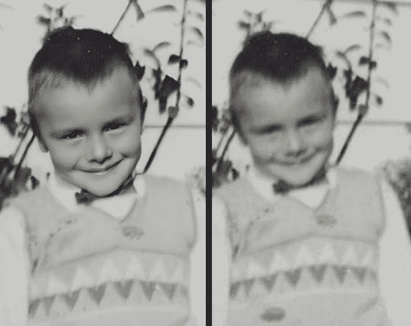
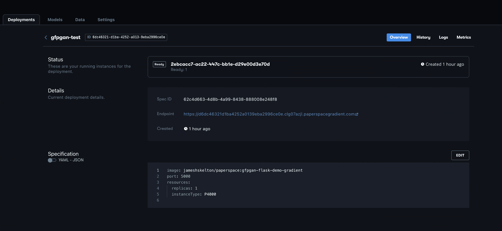
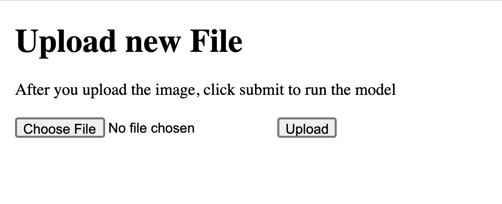

# 部署用于梯度深度学习的 Flask 应用程序

> 原文：<https://blog.paperspace.com/deployment-gan-to-flask/>

在上周的教程中，[我们介绍了如何在渐变笔记本上使用令人惊叹的 GFP-GAN 神经网络，从根本上提升受损或低质量照片的质量。这种模型的用例比你通常在前沿 ML 项目中看到的要明显得多；恢复这些图像质量的愿望正在迅速增长，这些图像可能是传家宝，也可能是低质量的模因素材。这在很多社交媒体社区中尤其明显。](https://blog.paperspace.com/restoring-old-photos-using-gfp-gan/)

在今天的教程中，我们将从上周的教程中吸取教训，并将其应用于构建一个基本的 Flask 应用程序，然后使用渐变部署来访问浏览器中的 API。这将让我们访问一个简单的界面，在这里我们可以快速上传照片，并通过 GFP-GAN 在两步过程中进行处理和恢复。

在本教程结束时，您将知道如何编写 Flask 应用程序来部署 PyTorch 模型 [GFP-GAN](https://github.com/gradient-ai/GFPGAN) ，如何编写和创建必要的 Docker 文件并将其上传到 Dockerhub 以访问 Gradient，以及如何使用部署将 Flask 应用程序转变为云 GPU 增压的原型网页。

请务必阅读陶昕等人之前的博客和论文。

完成此操作的工作流程如下:

*   设置本地环境
*   在 Docker 容器中创建 flask 应用程序
*   在本地测试并推送到 Dockerhub
*   使用图像在梯度上部署
*   还原照片！



Sample of GFP-GANs capabilities on a sample from Reddit

## 建立

首先，我们需要进行一些安装。这些是运行 GFP-GAN 所需的所有库:

```
torch>=1.7
numpy<1.21  # numba requires numpy<1.21,>=1.17
opencv-python
torchvision
scipy
tqdm
lmdb
pyyaml
tb-nightly
yapf
Flask

#These four have to be installed directly for reasons I haven't been able to figure out (see Dockerfile section)
opencv-python-headless
realesrgan==0.2.2.4
pip install basicsr
facexlib
```

其中大部分将使用一个`requirements.txt`脚本来安装，它们是在 Flask 应用程序上运行模型以及在本地机器上测试模型所必需的。安装完成后，打开您喜欢的代码编辑器。

此时，继续将 [GFP-GAN repo](https://github.com/gradient-ai/GFPGAN) 克隆到您的本地机器上。在您的编辑器中打开 GFP-GAN repo 的工作区，并导航到文件`app.py`。这就是 Flask 应用程序的结构所在。

## 烧瓶应用程序

```
import sys
import io
import json
import argparse
import cv2
import glob
import numpy as np
import os
from basicsr.utils import imwrite
from os import listdir
from os.path import isfile, join
from werkzeug.utils import secure_filename

import torch
import torchvision.transforms as transforms
from PIL import Image

from flask import Flask, request, render_template, redirect, url_for

from gfpgan import GFPGANer 
```

这些都是运行这个示例应用程序所需的导入。GFP-GAN 是用 PyTorch 编写的，所以容器运行也需要 Torch 和 torchvision。其余的用来确保 Flask 应用程序正常运行。

```
UPLOAD_FOLDER = 'inputs/whole_imgs'
ALLOWED_EXTENSIONS = {'png', 'jpg', 'jpeg', 'gif'}

app = Flask(__name__,static_folder='results')
app.config['UPLOAD_FOLDER'] = UPLOAD_FOLDER
```

下一个代码块用于实例化我们的 Flask 应用程序。在这个过程中，我们将`whole_imgs`目录指定为上传文件的目的地，并将结果目录指定为保存 HTML 显示的静态图像。这些图像仅限于更常见的类型，以确保在训练中没有任何问题。

```
@app.route("/", methods = ['GET', 'POST'])
def index():
    return render_template("index.html")

def allowed_file(filename):
    return '.' in filename and \
           filename.rsplit('.', 1)[1].lower() in ALLOWED_EXTENSIONS

@app.route("/upload", methods = ['GET', 'POST'])
def upload_file():
	# Clear the input and source folders, and dump previous images to saved. You can build another app route to take advantage of these saved images as needed.
    source = 'inputs/whole_imgs/'
    destination = 'inputs/saved/'
    out = 'results/restored_imgs'
    for f in os.listdir(source):
        os.remove(os.path.join(source, f))
    for f in os.listdir(destination):
        os.remove(os.path.join(destination, f))
    for f in os.listdir(out):
        os.remove(os.path.join(out, f))
    # Get the file upload
    if request.method == 'POST':
        # check if the post request has the file part
        if 'file' not in request.files:
            print('No file part')
            return redirect(request.url)
        file = request.files['file']
        # If the user does not select a file, the browser submits an
        # empty file without a filename.
        if file.filename == '':
            print('No selected file')
            return redirect(request.url)
        if file and allowed_file(file.filename):
            filename = secure_filename(file.filename)
            file.save(os.path.join(app.config['UPLOAD_FOLDER'], filename))
            return redirect(url_for('main', name=filename))
    #HTML form for uploading the file to the app
    return '''
    <!doctype html>
    <title>Upload new File</title>
    <h1>Upload new File</h1>
    <form method=post enctype=multipart/form-data>
      <input type=file name=file>
      <input type=submit value=Upload>
    </form>
    '''
```

新网站的`/upload` API 端点是用户能够直接上传他们选择由 GFP-GAN 增强和恢复的文件的地方。这些脚本获取文件，确保其与模型的兼容性，并将其上传到应用程序从中提取恢复内容的目录中。这一切都采取了传统的“选择文件”按钮的形式，然后是“上传”按钮。

```
@app.route('/main', methods=['POST','GET'])
def main():
    """Inference demo for GFPGAN.
    All credit to Xintao et al. at https://github.com/TencentARC/GFPGAN for writing this script i've adapted here for Flask. 
    """

    # Normally, this repo was designed to be executed from the command line with a series of optional and required args.
    # Instead, you will need to change the arguments you need to change using the sys.argv command (see line 29)
    parser = argparse.ArgumentParser()
    parser.add_argument('--upscale', type=int, default=2, help='The final upsampling scale of the image')
    parser.add_argument('--arch', type=str, default='clean', help='The GFPGAN architecture. Option: clean | original')
    parser.add_argument('--channel', type=int, default=2, help='Channel multiplier for large networks of StyleGAN2')
    parser.add_argument('--model_path', type=str, default='GFPGANCleanv1-NoCE-C2.pth')
    parser.add_argument('--bg_upsampler', type=str, default='realesrgan', help='background upsampler')
    parser.add_argument(
        '--bg_tile', type=int, default=400, help='Tile size for background sampler, 0 for no tile during testing')
    parser.add_argument('--test_path', type=str, default='upload/', help='Input folder')
    parser.add_argument('--suffix', type=str, default=None, help='Suffix of the restored faces')
    parser.add_argument('--only_center_face', action='store_true', help='Only restore the center face')
    parser.add_argument('--aligned', action='store_true', help='Input are aligned faces')
    parser.add_argument('--paste_back', action='store_false', help='Paste the restored faces back to images')
    parser.add_argument('--save_root', type=str, default='results', help='Path to save root')
    parser.add_argument(
        '--ext',
        type=str,
        default='auto',
        help='Image extension. Options: auto | jpg | png, auto means using the same extension as inputs')

# directly input the args you want to run inference_gfpgan using sys.argv. you can change these as needed, but i have used the defaults for simplicity. 

    sys.argv = ['--model_path GFPGANCleanv1-NoCE-C2.pth --upscale 2 --test_path inputs/whole_imgs --save_root results --bg_upsampler realesrgan']

    args = parser.parse_args()
    if args.test_path.endswith('/'):
        args.test_path = args.test_path[:-1]
    os.makedirs(args.save_root, exist_ok=True)

    # background upsampler
    if args.bg_upsampler == 'realesrgan':
        if not torch.cuda.is_available():  # CPU
            import warnings
            warnings.warn('The unoptimized RealESRGAN is very slow on CPU. We do not use it. '
                          'If you really want to use it, please modify the corresponding codes.')
            bg_upsampler = None
        else:
            from realesrgan import RealESRGANer
            bg_upsampler = RealESRGANer(
                scale=2,
                model_path='https://github.com/xinntao/Real-ESRGAN/releases/download/v0.2.1/RealESRGAN_x2plus.pth',
                tile=args.bg_tile,
                tile_pad=10,
                pre_pad=0,
                half=True)  # need to set False in CPU mode
    else:
        bg_upsampler = None
    args.test_path = 'inputs/whole_imgs'
    # set up GFPGAN restorer
    restorer = GFPGANer(
        model_path=args.model_path,
        upscale=args.upscale,
        arch=args.arch,
        channel_multiplier=args.channel,
        bg_upsampler=bg_upsampler)
    img_list = sorted(glob.glob(os.path.join(args.test_path, '*')))
    print(img_list, '**')
    count = 4
    for img_path in img_list:
        count -= 1
        if count == 0:
            break
        # read image
        print('yes')
        img_name = os.path.basename(img_path)
        print(f'Processing {img_name} ...')
        basename, ext = os.path.splitext(img_name)
        input_img = cv2.imread(img_path, cv2.IMREAD_COLOR)

        # restore faces and background if necessary
        cropped_faces, restored_faces, restored_img = restorer.enhance(
            input_img, has_aligned=args.aligned, only_center_face=args.only_center_face, paste_back=args.paste_back)

        # save faces
        for idx, (cropped_face, restored_face) in enumerate(zip(cropped_faces, restored_faces)):
            print('1')
            # save cropped face
            save_crop_path = os.path.join(args.save_root, 'cropped_faces', f'{basename}_{idx:02d}.png')
            imwrite(cropped_face, save_crop_path)
            # save restored face
            if args.suffix is not None:
                save_face_name = f'{basename}_{idx:02d}_{args.suffix}.png'
            else:
                save_face_name = f'{basename}_{idx:02d}.png'
            save_restore_path = os.path.join(args.save_root, 'restored_faces', save_face_name)
            imwrite(restored_face, save_restore_path)
            # save comparison image
            cmp_img = np.concatenate((cropped_face, restored_face), axis=1)
            imwrite(cmp_img, os.path.join(args.save_root, 'cmp', f'{basename}_{idx:02d}.png'))

        # save restored img
        if restored_img is not None:
            if args.ext == 'auto':
                extension = ext[1:]
            else:
                extension = args.ext

            if args.suffix is not None:
                save_restore_path = os.path.join(args.save_root, 'restored_imgs',
                                                 f'{basename}_{args.suffix}.{extension}')
            else:
                save_restore_path = os.path.join(args.save_root, 'restored_imgs', f'{basename}.{extension}')
            imwrite(restored_img, save_restore_path)

    onlyfiles = [f for f in listdir('results/restored_imgs') if isfile(join('results/restored_imgs', f))]
    onlyfiles.remove('.DS_Store')
    return render_template("index2.html", variable = onlyfiles[0])

if __name__ == '__main__':
    app.run(#host="0.0.0.0")
```

上面是回购协议中的`inference_gfpgan.py`脚本的代码，已经被改编到我们的应用程序中。这个脚本解析我们使用`sys.argv`调用编写的输入参数。这些被设置为函数中概述的默认值，但是这造成了一个小问题。Docker 映像的庞大规模使得在将映像推送到 Dockerhub 部署之前考虑这些参数非常重要。在未来，为了生产梯度上的应用程序，我们需要考虑更多的动态方法来改变恢复过程的参数。

该应用程序中的 GFP-GAN 函数会根据 args 进行一些调整，但它会获取每个输入的图像，增强它们的面部图像和背景，然后将新版本保存到预定或默认的结果目录中。

## 码头工人

GFP-GAN repo 中有一个示例`Dockerfile`用于创建 docker 映像，该映像稍后可以部署到渐变 GPU。让我们看看这个例子，看看如何用 Flask 为 PyTorch 部署编写一个非常基本的 Dockerfile:

```
# syntax=docker/dockerfile:1

FROM python:3.8-slim-buster
RUN pip install flask
RUN apt-get update \
  && apt-get install -y wget \
  && rm -rf /var/lib/apt/lists/*
RUN apt-get update && apt-get install -y git
RUN git clone https://github.com/gradient-ai/GFPGAN.git
WORKDIR /GFPGAN
COPY requirements.txt requirements.txt
RUN pip3 install -r requirements.txt
RUN pip3 install opencv-python-headless
RUN pip install realesrgan==0.2.2.4
RUN pip install basicsr
RUN pip install facexlib
RUN python setup.py develop
RUN wget https://github.com/TencentARC/GFPGAN/releases/download/v0.2.0/GFPGANCleanv1-NoCE-C2.pth

EXPOSE 5000

COPY . .

ENTRYPOINT [ "python" ]

CMD [ "app.py" ]
```

这个`Dockerfile`在运行时，将下载所有必需的包并构建一个可以作为容器运行的映像。这个页面主要由安装组成，但也包括另外两个重要的工作:`RUN wget`获取模型权重，执行`setup.py`完成容器环境的配置。

一旦您的文件准备就绪，我们就可以通过运行以下命令来构建 Docker 映像:

```
docker build gfpgan . 
```

一旦我们在本地构建了您的映像，使用以下命令运行容器:

```
docker run -d -p 5000:5000 gfpgan-flask-demo-gradient:latest 
```

然后，我们可以 localhost:5000，并遵循通过应用程序运行 GFP-GAN 所需的两个步骤。

我们的应用程序现在运行在 localhost:5000 端口上，您可以通过浏览器访问它。按照提示上传您希望看到恢复的照片。在上传和恢复过程中检查终端的进度，以获取 Flask 应用程序的日志。

运行`upload_photo()`时，将执行`main()`脚本，并将结果保存到结果目录。一旦修饰过的照片生成并保存，应用程序将使用 HTML 在网页中显示它。从这里你可以直接下载。

在 Docker 应用程序或 Docker CLI 中，您现在可以将新映像推送到 Dockerhub，以便根据需要进行共享、版本控制和改进。如果你不想建立自己的 docker 文件，你可以通过这个 [url 访问我的。](https://hub.docker.com/layers/jameshskelton/paperspace/gfpgan-flask-demo-gradieimg/sha256-5e48e66396324769b64171aa9632f216c78e9f39e1256b9f6e5c9f2a20b6b4df?context=repo)

## 部署

```
image: jameshskelton/paperspace:gfpgan-flask-demo-gradient
port: 5000
resources:
  replicas: 1
  instanceType: P4000
```

从`Dockerfile`开始在斜坡上部署的简易性不可低估。首先，创建一个新项目，并在渐变 GUI 中导航到它的 Deployments 选项卡。在设置部署的 GUI 中，我们可以看到设置的逐步说明。在页面顶部，选择“上传部署规范”链接。这将允许您直接上传您的规格。上面的示例部署规范可用于将新的 Dockerized Flask 应用程序部署到渐变部署。只需替换单击链接时弹出的文本编辑器中的变量，然后粘贴您的规范。您也可以使用 Gradient CLI 命令创建部署

```
gradient deployments create --name [deployment name] --projectId [your project id] --spec [path to your deployment spec file]
```



A sample deployment for this Flask app

一旦您上传了您的规范，导航到您的项目中的 Deployments 选项卡，如果它没有重定向您，然后单击您的新部署。在细节部分，您可以获取我们新部署的 Flask API 的 url。如果你点击那个链接，它会把你带到应用程序在`/upload`页面上的 HTML 界面



The HTML forms a simple GUI for you to submit your image to the model for restoration

按照 GUI 中的提示，上传要恢复的映像。当您选择“上传”按钮时，它会自动将您的图像加载到输入目录中，并初始化 GAN 以通过应用程序的`main()`功能运行。完成后，网页将自动重定向以在 HTML 中显示新图像。从这里，您可以通过返回到原始 url 并上传新照片来再次运行模型。


In the first set of pixellated photos of Adele, we can see how the algorithm attempted to infer the curvature of her cheeks and chin but ultimately failed. We can thus conclude that the model is ill suited for artificially damaged or obfuscated images. In the second set, a group of old friends are photographed in a darkened area. The GFP-GAN performs much more appropriately because it is able to infer the subjects faces through low-light quite well. Photos taken from GFP-GAN github and reddit/r/restoration.

值得一提的是，该程序最适用于以某种方式受损的高质量图像。上面是两组样本图像，右边的照片更适合模特，另一张是误用的例子。如果你的照片特别模糊或像素化，你可能会对照片中的主体产生一些奇怪的效果，从恐怖谷到彻头彻尾的身体恐怖。

## 结论

在本教程中，我们看到了如何构建一个 Flask 应用程序来服务 PyTorch GFP-GAN 实现，如何通过简单的 HTML GUI 将其部署为 web 可访问的 API 端点，以及如何使用这个新部署的应用程序来恢复损坏的照片。这是一个非常简单的 Flask 应用程序，因此可以随意修改它以更好地满足您的需求。一种可能性是将该应用程序连接到 Reddit PRAW 应用程序，并使用它来自动解析和回复一些更受欢迎的图像恢复子编辑中的帖子，如 R/estoration。

如果你想展示你用 GFP-GAN 构建渐变的作品，一定要发微博给我们！[请务必查看今天项目的 GitHub 回购协议！](https://www.github.com/gradient-ai/gfpgan)