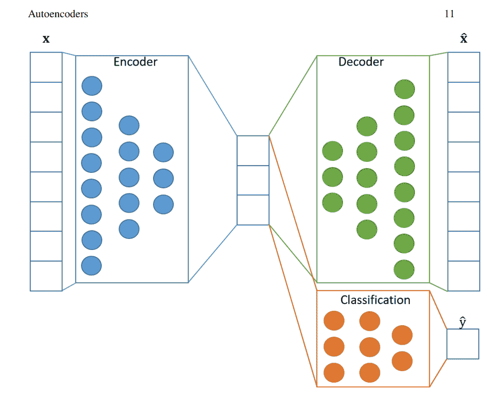
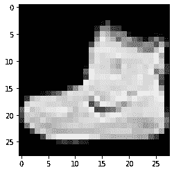
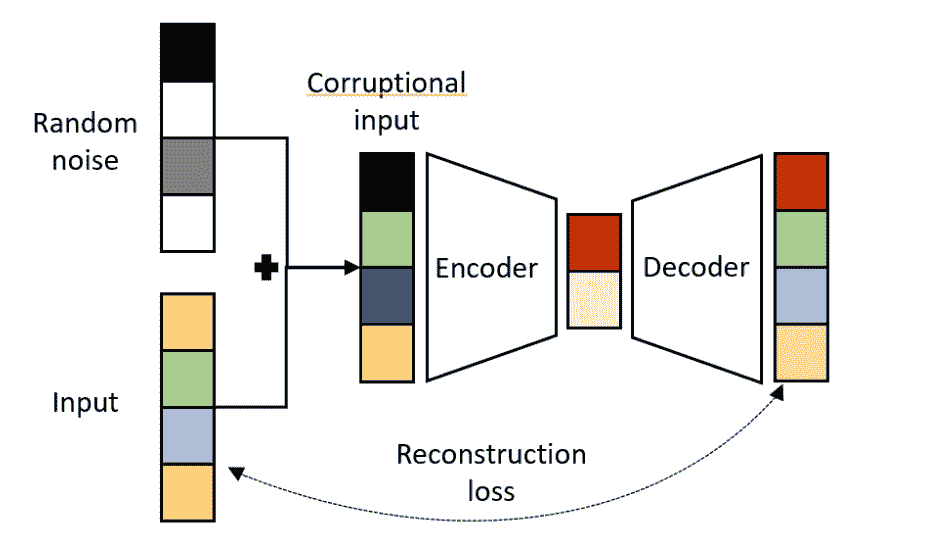
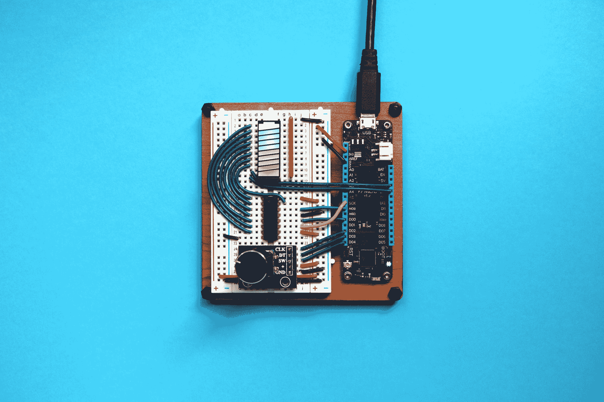

# 对具有项目结构的自动编码器的概念性理解

> 原文：<https://blog.paperspace.com/understanding-autoencoders/>

生成型网络正以巨大的速度接管人工智能(AI)的世界。他们能够创造出肉眼几乎无法分辨的新实体，并将它们分类为真或假。在以前的文章中，我们已经在生成对抗网络(GANs)中讨论了这些生成类型网络中的一类。我们还研究了许多不同类型的 GAN 架构，用于创建许多不同类型的任务，如深度卷积 GAN(dcgan)、超分辨率图像、人脸生成等等。如果你对这些项目感兴趣，我推荐你去 Paperspace 博客的 [GANs](https://blog.paperspace.com/tag/gan/) 版块看看。然而，在本文中，我们主要关注的是另一种类型的生成型网络中的 ***自动编码器。***

自动编码器在深度学习领域是一个蓬勃发展的前景，类似于其对手 GANs。它们在大量的应用中非常有用，我们将在本文中进一步探讨这些应用。我们将从自动编码器领域的一些基本介绍性材料开始，然后继续分解与该主题相关的一些重要的复杂内容。一旦我们对相关概念有了适当的理解，我们将构建一些自动编码器的变体来相应地分析和试验它们的性能。最后，我们将探讨一些更关键的使用案例，您应该考虑在未来的应用中使用这些网络。下面的代码可以在 Paperspace 上的 Gradient 平台上实现，强烈建议遵循。查看目录，获得关于本文后续任务的详细指南。

## 自动编码器简介:



[Image Source](https://arxiv.org/pdf/2003.05991.pdf)

自动编码器是生成神经网络的一个分支，主要设计用于将输入编码为压缩的有意义的表示，然后将其解码，以使重建的输出尽可能与原始输入相似。它们利用学习未标记数据的有效编码来执行所需的动作。除了原始图像的重建，还有许多类型的自动编码器执行各种任务。自动编码器的主要类型之一是正则化自动编码器，其目的是通过提高捕捉基本信息的能力来防止学习身份函数并鼓励学习更丰富的表示。

我们也有具体的自动编码器，主要是为离散特征选择而设计的。它们确保潜在空间仅包含用户指定的特征数量。最后，在变型自动编码器中，我们有一个更受欢迎的自动编码器变体。他们发现自己在生成任务中的效用，类似于甘斯。他们试图通过概率分布进行数据生成。我们将在另一篇文章中了解更多关于可变自动编码器的内容，因为它们是一个足够大的概念，值得单独写一篇文章。在这篇博客中，我们的主要讨论将是理解自动编码器的基本工作操作，同时构造几个深度卷积自动编码器和其他版本，以分析它们在维数约减任务中的性能。

* * *

## 了解自动编码器:


[Image Source](https://arxiv.org/pdf/2003.05991.pdf)

自动编码器是一种独特类型的生成网络。它们由一个编码器、一个潜在维度空间和一个解码器组成。编码器包括神经网络架构，该架构试图执行高维数据到低维向量空间的转换。潜在空间包含特定图像的基本提取特征，即压缩的代表性形式的数据。

让我们假设我们有一个 100 x 100 的图像，您想通过编码器来适当地减小尺寸。在 10000 像素的维度空间中，可以说只有大约 1000 个组成部分包含了最有用和决定性的信息，换句话说，是高质量的数据。自动编码器的潜在维度空间将由这个具有对重建最有用的信息的低维度空间组成。

自动编码器中解码器的任务是从现有的潜在维度空间中重建这个新数据。因此，我们可以看到，重新生成的数据是原始样本的有效重建，尽管在此过程中丢失了一些信息。与生成式对抗网络不同，生成式对抗网络生成全新的数据样本，自动编码器主要不执行相同的功能。因此，大多数初学者可能对自动编码器有一个普遍的误解，因为他们想知道它们的真正目的；尤其是当我们只是以一些微小的信息损失为代价来重构原始样本的时候。

在大多数情况下，我们主要关心的是利用编码器和潜在的维度空间进行各种应用。这些特别是图像去噪、异常检测和其他类似的任务。解码器通常是我们可视化重建输出质量的途径。自动编码器可以被认为是降维技术的“更智能”版本，例如主成分分析(PCA)。在本文的应用部分，我们将进一步分析这些自动编码器的重要性。现在，让我们通过一些代码和深度学习来关注这些自动编码器的实际实现。

* * *

## 深度卷积自动编码器(方法 1):

有几种构建自动编码器体系结构的方法。在前两种方法中，我们将研究两种可以用来解决项目的深度卷积方法。我将使用 TensorFlow 和 Keras 中的时尚数据和 MNIST 数据。这些将是我们建设这些项目的主要深度学习框架。我们在以前的文章中已经非常详细地介绍了这两个库。如果你不熟悉这些，我推荐你查看 TensorFlow 的[链接](https://blog.paperspace.com/absolute-guide-to-tensorflow/)和 Keras 的[链接](https://blog.paperspace.com/the-absolute-guide-to-keras/)。现在让我们开始构建自动编码器模型。

### 导入基本库:

第一步是导入为特定项目构建 autoencoder 模型所需的所有基本库。在这里，我导入了时尚 MNIST 和 MNIST 的数据集。观众可以自由探索他们需要的选项。其他必要的导入是 Keras 和 TensorFlow 提供的深度学习框架，用于可视化输入和返回输出中的图像的 matplotlib，以及帮助设置数据集的 Numpy。我们还将导入构建完全卷积深度学习网络所需的一些层。我们将使用函数式 API 模型方法来完成这项任务，以便对自动编码器的模型结构进行更多的控制。跟随本文的读者也可以选择顺序或模型子类化(定制方法)来处理这个问题。下面是包含所有需要的库导入的代码片段。

```
import tensorflow as tf
from tensorflow import keras
import matplotlib.pyplot as plt
import numpy as np
from tensorflow.keras.datasets import fashion_mnist
from tensorflow.keras.datasets import mnist
from tensorflow.keras.layers import Conv2D, MaxPooling2D, UpSampling2D, Input, ZeroPadding2D
from tensorflow.keras.layers import BatchNormalization, LeakyReLU, Activation, Cropping2D, Dense
from tensorflow.keras.models import Model 
```

### 准备数据:

在文章的下一部分，我们将为这个项目准备数据。请注意，准备步骤会因您正在进行的项目类型而有所不同。如果使用自定义数据集，在将图像或数据通过自动编码器的编码器部分之前，可能需要更多的预处理。对于我们当前的数据集，加载数据并相应地将它们与各自的训练和测试实体分离是相对容易的。用于此项目的两个数据集的形状都是 28 x 28，展平后总计 784 维特征，因为它们是通道为 1 的灰度图像。当处理具有 3 个通道的 RGB 图像时，如 RGB 彩色图像，可能会出现一些变化，必须根据要求进行计算。我们还将可视化我们的数据，以查看我们将在这个项目中使用的图像类型。



Sample Fashion Dataset Image

我们可以看到，这些图像不是最高质量的，但它们肯定足以作为自动编码器的入门项目。我们还将对训练数据和测试数据进行规范化，因为当值在 0 到 1 的范围内而不是在 0 到 255 的范围内时，处理这些值会更容易。在处理这类数据时，这种做法很常见。标准化的代码片段如下所示，一旦完成，我们就可以继续构建深度卷积自动编码器。

```
# Normalizing the data
x_train = x_train.astype('float32') / 255.0
x_test = x_test.astype('float32') / 255.0
```

### 构造深度卷积自动编码器；

正如上一节所讨论的，我们知道自动编码器主要由三个主要实体组成，即编码器、潜在维度和解码器。我们现在将使用深度卷积方法构建编码器和解码器神经网络。这一部分和下一节将围绕几种方法展开，通过这些方法，您可以构建适合您的问题的编码器和解码器网络，并相应地获得最佳结果。让我们从编码器的结构开始。

***编码器:***

我们的架构构建利用了 TensorFlow 的功能性 API 结构，这使我们能够快速适应一些变化，并让我们对构建的细节有更多的控制。顺序或模型子类化方法也可以用来解释下面的代码。我们的编码器架构中的第一层将由输入层组成，它将采用图像的形状，在我们的情况下，时尚和 MNIST 数据的 28 x 28 灰度像素化图像。请注意，深度卷积网络需要这种形状。如果您计划为您的项目使用隐藏(或密集)图层类型结构，那么最好将图像展平或将其转换为 784 维数据以供进一步处理。

在第一种方法中，我利用零填充层将图像从 28 x 28 的形状转换为 32 x 32 的形状。这种转换使我们能够获得现在是 2 的幂的图像，并将帮助我们添加更多的最大池和卷积层。通过这一更改，我们现在可以为每个卷积添加四个卷积层和最大池层，因为达到奇数将需要更长时间。由于计算困难，我们不想跨越一个奇数。因此，编码器神经网络架构利用具有相同类型填充和 ReLU 激活函数的四个卷积层。这些卷积层中的每一层后面都有一个最大池层，步长为(2，2)以缩小图像。编码器架构代码块如下面的代码片段所示。

```
# Creating the input layer with the full shape of the image
input_layer = Input(shape=(28, 28, 1))

# Note: If utilizing a deep neural network without convolution, ensure that the dimensions are multiplied and converted 
#accordingly before passing through further layers of the encoder architecture.

zero_pad = ZeroPadding2D((2, 2))(input_layer)

# First layer
conv1 = Conv2D(16, (3, 3), activation='relu', padding='same')(zero_pad)
pool1 = MaxPooling2D((2, 2), padding='same')(conv1)

# Second layer
conv2 = Conv2D(16, (3, 3), activation='relu', padding='same')(pool1)
pool2 = MaxPooling2D((2, 2), padding='same')(conv2)

# Third layer
conv3 = Conv2D(8, (3, 3), activation='relu', padding='same')(pool2)
pool3 = MaxPooling2D((2, 2), padding='same')(conv3)

# Final layer
conv4 = Conv2D(8, (3, 3), activation='relu', padding='same')(pool3)

# Encoder architecture
encoder = MaxPooling2D((2, 2), padding='same')(conv4)
```

***解码器:***

在解码器架构中，我们将成功地重建我们的数据，并完成整个自动编码器结构。对于这种重建，模型将需要四层，一旦数据通过下一组深度卷积层，这四层将对数据进行上采样。我们还可以利用具有 ReLU 激活功能的卷积层和类似的填充来进行重构过程。然后，我们将对卷积层进行上采样，使其大小加倍，并在四组构建块之后达到 32 x 32 的理想图像大小。最后，我们将使用 TensorFlow 中的裁剪 2D 功能，将图像的原始值从 32 x 32 恢复为 28 x 28。查看下面的代码片段，了解整个解码器布局。

```
# First reconstructing decoder layer
conv_1 = Conv2D(8, (3, 3), activation='relu', padding='same')(encoder)
upsample1 = UpSampling2D((2, 2))(conv_1)

# Second reconstructing decoder layer
conv_2 = Conv2D(8, (3, 3), activation='relu', padding='same')(upsample1)
upsample2 = UpSampling2D((2, 2))(conv_2)

# Third decoder layer
conv_3 = Conv2D(16, (3, 3), activation='relu', padding='same')(upsample2)
upsample3 = UpSampling2D((2, 2))(conv_3)

# First reconstructing decoder layer
conv_4 = Conv2D(1, (3, 3), activation='relu', padding='same')(upsample3)
upsample4 = UpSampling2D((2, 2))(conv_4)

# Decoder architecture
decoder = Cropping2D((2, 2))(upsample4)
```

### 汇编和培训:

我们的下一步是编译编码器的整个架构。我们将创建功能 API 模型，编码器的输入层后面是解码器的输出层。一旦自动编码器完成，我们将使用 Adam 优化器和均方误差损失编译模型。

我们还可以查看模型的概要，以了解 autoencoder 的整个结构。下面是执行以下操作的代码片段和摘要。

```
# Creating and compiling the model

autoencoder = Model(input_layer, decoder)
autoencoder.compile(optimizer='adam', loss='mse')
autoencoder.summary()
```

```
Model: "model_1"

Layer (type)                 Output Shape              Param #   

input_4 (InputLayer)         [(None, 28, 28, 1)]       0         

zero_padding2d_2 (ZeroPaddin (None, 32, 32, 1)         0         

conv2d_16 (Conv2D)           (None, 32, 32, 16)        160       

max_pooling2d_10 (MaxPooling (None, 16, 16, 16)        0         

conv2d_17 (Conv2D)           (None, 16, 16, 16)        2320       

max_pooling2d_11 (MaxPooling (None, 8, 8, 16)          0         

conv2d_18 (Conv2D)           (None, 8, 8, 8)           1160      

max_pooling2d_12 (MaxPooling (None, 4, 4, 8)           0         

conv2d_19 (Conv2D)           (None, 4, 4, 8)           584       

max_pooling2d_13 (MaxPooling (None, 2, 2, 8)           0         

conv2d_20 (Conv2D)           (None, 2, 2, 8)           584       

up_sampling2d_6 (UpSampling2 (None, 4, 4, 8)           0         

conv2d_21 (Conv2D)           (None, 4, 4, 8)           584       

up_sampling2d_7 (UpSampling2 (None, 8, 8, 8)           0         

conv2d_22 (Conv2D)           (None, 8, 8, 16)          1168      

up_sampling2d_8 (UpSampling2 (None, 16, 16, 16)        0         

conv2d_23 (Conv2D)           (None, 16, 16, 1)         145       

up_sampling2d_9 (UpSampling2 (None, 32, 32, 1)         0         

cropping2d_1 (Cropping2D)    (None, 28, 28, 1)         0         

Total params: 6,705 | Trainable params: 6,705 | Non-trainable params: 0 
```

因为我们将为这个特定的任务运行大约 100 个时期的 autoencoder 模型，所以最好利用一些适当的回调。我们将在训练期间使用模型检查点来保存模型的最佳权重，在连续八个时期没有改善后以八的耐心提前停止以停止训练，在四个时期没有改善后降低学习率回调以降低学习率，最后，TensorBoard 相应地可视化我们的进度。下面是我们将在 autoencoder 项目中使用的各种回调的代码片段。

```
# Creating Callbacks

from tensorflow.keras.callbacks import ModelCheckpoint
from tensorflow.keras.callbacks import EarlyStopping
from tensorflow.keras.callbacks import TensorBoard
from tensorflow.keras.callbacks import ReduceLROnPlateau

tensorboad_results = TensorBoard(log_dir='autoencoder_logs_fashion/')

checkpoint = ModelCheckpoint("best_model_fashion.h5", monitor="val_loss", save_best_only=True)

early_stop = EarlyStopping(monitor="val_loss", patience=8, restore_best_weights=False)

reduce_lr = ReduceLROnPlateau(monitor="val_loss", factor=0.2, patience=4, min_lr=0.000001)
```

在最后一步，我们将拟合自动编码器模型，并对其进行大约 100 个历元的训练，以达到最佳的可能结果。请注意，标签，即训练和测试(y-train 和 y-test)标签值不是必需的，并且在此任务中不予考虑。我们将使用批量为 128 的训练和验证样本来训练模型。我们还将利用预定义的回调，让模型运行 100 个时期。Paperspace 上的渐变平台是运行以下项目的好地方。

```
# Training our autoencoder model

autoencoder.fit(x_train, x_train,
                epochs=100,
                batch_size=128,
                shuffle=True,
                validation_data=(x_test, x_test),
                callbacks=[checkpoint, early_stop, tensorboad_results, reduce_lr])
```

### 结果的可视化:

在成功编译和训练 autoencoder 模型之后，最后一步是可视化和分析所获得的结果。使用模型的预测函数返回测试数据的预测值。将预测存储在一个变量中，并使用 matplotlib 库来可视化所获得的结果。构建这个动作的代码片段如下所示。我为时尚和 MNIST 数据计算了两个独立的自动编码器模型。这两个数据集的结果如下所示。

```
decoded_imgs = autoencoder.predict(x_test)

n = 10
plt.figure(figsize=(20, 4))
for i in range(1, n + 1):
    # Display original
    ax = plt.subplot(2, n, i)
    plt.imshow(x_test[i].reshape(28, 28))
    plt.gray()
    ax.get_xaxis().set_visible(False)
    ax.get_yaxis().set_visible(False)

    # Display reconstruction
    ax = plt.subplot(2, n, i + n)
    plt.imshow(decoded_imgs[i].reshape(28, 28))
    plt.gray()
    ax.get_xaxis().set_visible(False)
    ax.get_yaxis().set_visible(False)
plt.show()
```


Result on Fashion Data


Result on MNIST Data

将我们的预测可视化后获得的结果相当不错，尤其是与其他方法如 PCA 重建相比。

虽然方法 1 给了我们一个好的结果，但我们将使用类似的深度卷积方法尝试另一种方法，看看它是否会产生类似、更差或更好的结果。在本文的下一节中，我们将继续讨论构造自动编码器的第二种方法。

* * *

## 深度卷积自动编码器(方法 2):

在构造深度卷积自动编码器的第二种方法中，我们将使用批量标准化层和泄漏 ReLU 层。我们还将通过避免使用零填充或裁剪 2D 图层来避免打乱数据集的原始形状。在本节中，仅更改自动编码器的编码器和解码器架构。大多数其他参数和代码块可以保持不变，也可以根据用户的要求进行修改。让我们分析编码器架构，以进一步理解我们将如何构造这个自动编码器。

***编码器:***

编码器架构包含输入层，它将接受 MNIST 图像的输入，每个图像都是形状为 28 x 28 的灰度图像。编码器结构将主要由两组卷积网络组成。这些块中的每一个都有一个具有相同填充(并且没有激活函数)的卷积层，随后是一个用于执行跨越的最大池层、一个泄漏 ReLU 激活函数，最后是一个用于泛化神经网络的批量归一化层。经过这两个网络模块后，我们将信息传递给解码器，以完成自动编码器架构。

```
# Creating the input layer with the full shape of the image
input_layer = Input(shape=(28, 28, 1))

# Note: If utilizing a deep neural network without convolution, ensure that the dimensions are multiplied and converted 
# accordingly before passing through further layers of the encoder architecture.

# First layer
conv1 = Conv2D(16, (3, 3), padding='same')(input_layer)
pool1 = MaxPooling2D((2, 2), padding='same')(conv1)
activation1 = LeakyReLU(alpha=0.2)(pool1)
batchnorm1 = BatchNormalization()(activation1)

# Second layer
conv2 = Conv2D(8, (3, 3), padding='same')(batchnorm1)
pool2 = MaxPooling2D((2, 2), padding='same')(conv2)
activation2 = LeakyReLU(alpha=0.2)(pool2)

# Encoder architecture
encoder = BatchNormalization()(activation2)
```

***解码器:***

对于解码器模型，我们将把来自编码器的输出传递到编码器模型中使用的类似的重构神经网络中。我们将利用上采样层获得图像的原始维度并重建数据，而不是利用最大池层来降低数据的维度。下面提供了解码器架构的代码片段。一旦编码器和解码器模块构建完成，就可以按照与上一节相同的过程来编译、训练和可视化结果。

```
# First reconstructing decoder layer
conv_1 = Conv2D(8, (3, 3), activation='relu', padding='same')(encoder)
upsample1 = UpSampling2D((2, 2))(conv_1)
activation_1 = LeakyReLU(alpha=0.2)(upsample1)
batchnorm_1 = BatchNormalization()(activation_1)

# Second reconstructing decoder layer
conv_2 = Conv2D(1, (3, 3), activation='relu', padding='same')(batchnorm_1)
upsample2 = UpSampling2D((2, 2))(conv_2)
activation_2 = LeakyReLU(alpha=0.2)(upsample2)

# Encoder architecture
decoder = BatchNormalization()(activation_2)
```

在运行以下程序大约 100 个时期后，我能够获得 MNIST 数据的以下结果。也可以随意在其他数据集上测试代码，并根据需要分析神经网络的性能。


Result with approach-2 on MNIST Data

这些结果看起来比之前生成的图像更好。对此的一个可能的解释是使用批量标准化层，这有助于神经网络更快地进行归纳和更好地学习。此外，在这种情况下，最终的维度空间缩减比第一种方法小得多。因此，恢复阶段或重建看起来更好，因为它只包含两个实际的数据压缩阶段和两个数据重建阶段。随着我们进一步压缩数据，信息在重建阶段丢失的可能性会更大。因此，每个项目都应该根据具体情况下的预期要求进行研究和处理。

现在让我们继续讨论一些其他的方法，我们可以遵循这些类型的任务，包括其他版本的自动编码器。

* * *

## 关于其他方法的讨论:

让我们来看看我在构建这个项目时使用的另一种方法，即利用编码器和解码器的全连接层。第一步是将图像从原始的 28×28 维数据转换成 784 维的展平形状，然后继续训练自动编码器模型。下面是代码块和两个任务分别获得的图像结果。您可以找到类似的技术，看看哪种方法最适合特定的任务。

```
x_train = x_train.reshape((len(x_train), np.prod(x_train.shape[1:])))
x_test = x_test.reshape((len(x_test), np.prod(x_test.shape[1:])))

encoding_dim = 32  

# Input Sample
input_img = Input(shape=(784,))

# encoder network
encoder = Dense(encoding_dim, activation='relu')(input_img)

# decoder network
decoder = Dense(784, activation='sigmoid')(encoder)

# This model maps an input to its reconstruction
autoencoder = Model(input_img, decoder)
```


Result with fully connected layers on Fashion Data


Result with fully connected layers on MNIST Data

在本文中，我们主要关注深度卷积自动编码器。但是，您可以实现几种不同的结构来构造自动编码器。一种这样的方法是使用完全连接的密集网络来再现和重建原始图像的输出。下面是自动编码器与 PCA 等方法在重建方面的差异的快速比较。


[Image Source](https://commons.wikimedia.org/wiki/File:Reconstruction_autoencoders_vs_PCA.png)

从上图中可以明显看出，自动编码器是降维最有效的方法之一，尤其是与其他一些可用的方法相比，如 PCA、t-分布式随机邻居嵌入(t-SNE)、随机森林和其他类似的技术。因此，自动编码器可以被视为基本的深度学习概念，以理解解决各种任务，特别是关于计算机视觉的任务。让我们在下一节讨论一些自动编码器的应用，以便更深入地理解它们的重要性。

* * *

## 自动编码器的应用:



[Image Source](https://arxiv.org/pdf/2003.05991.pdf)

由于自动编码器在不同领域的广泛应用，它越来越受欢迎。在这一节中，我们将讨论它们所拥有的一些令人惊叹的功能，以及您可以在下面的列表中利用它们的不同类型的用途。

1.  **降维:**我们使用自动编码器的主要原因之一是以最小的信息损失来降低内容的维度，因为它被认为是相对于 PCA 等其他方法来说完成这项任务的更高级的工具之一。本文将详细介绍这个主题。
2.  **异常检测:**异常检测是定位数据中异常值的过程。作为其训练的一部分，自动编码器试图最小化重建误差，因此我们可以检查重建损失的幅度，以推断所发现的异常数据的程度。
3.  **图像去噪:**自动编码器在去除特定图像的噪声方面做得很好，可以更准确地描述特定数据。旧图像或模糊图像可以用自动编码器去噪，以获得更好和更真实的表现。
4.  **特征提取:**自动编码器的编码器部分有助于学习数据更本质的特征。因此，这些生成网络在提取对特定任务至关重要且必需的重要信息方面具有惊人的效用。
5.  **图像生成:**自动编码器也可用于重建和创建修改后的压缩图像。虽然我们之前已经讨论了自动编码器并没有真正用于创建全新的图像，因为它们是原始产品的重建，但是变化的自动编码器可以用于生成新的图像。我们将在以后的文章中更多地讨论这个话题。

* * *

## 结论:



Photo by [Jorge Ramirez](https://unsplash.com/@jorgedevs?utm_source=ghost&utm_medium=referral&utm_campaign=api-credit) / [Unsplash](https://unsplash.com/?utm_source=ghost&utm_medium=referral&utm_campaign=api-credit)

自动编码器已被证明是生成型神经网络领域的另一个革命性发展。他们能够了解提供给他们的数据的大部分基本特征，并在了解提供给他们的数据的大部分关键细节的同时减少维度。大多数现代自动编码器优先考虑给定输入的有用属性，并且它们已经能够将编码器和解码器的思想从确定性函数推广到随机映射。如需进一步阅读，请查看以下链接-[【1】](https://en.wikipedia.org/wiki/Autoencoder#:~:text=An%20autoencoder%20is%20a%20type,unlabeled%20data%20(unsupervised%20learning).&text=The%20autoencoder%20learns%20a%20representation,data%20(%E2%80%9Cnoise%E2%80%9D).)和[【2】](https://www.deeplearningbook.org/contents/autoencoders.html)。

在本文中，我们涵盖了理解自动编码器模型的基本工作过程所需的大部分基本方面。我们简要介绍了自动编码器，并详细介绍了它的生成本质。我们还探索了深度卷积架构的几种变体，我们可以构建它们来降低维度空间并相应地重建它。除了我们讨论的两种方法，我们还简要分析了其他方法以及其他技术(如 PCA)的性能。最后，我们研究了自动编码器的一些令人惊叹的应用以及它所拥有的广泛功能。

在未来的文章中，我们将重点关注一些使用 *Transformers* 的自然语言处理(NLP)任务，并学习在不利用任何深度学习框架的情况下从头构建神经网络。我们也将在未来的博客中进一步探索*变型自动编码器*。在那之前，继续探索！