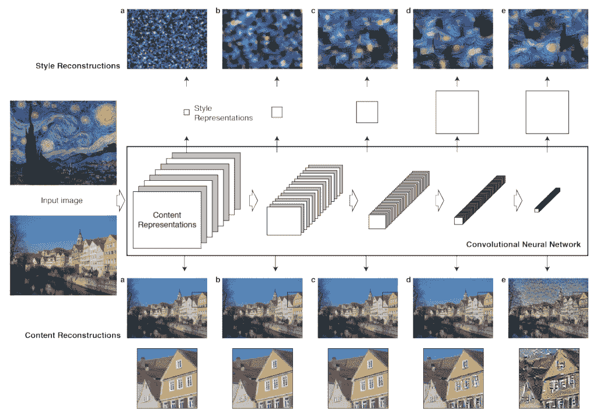
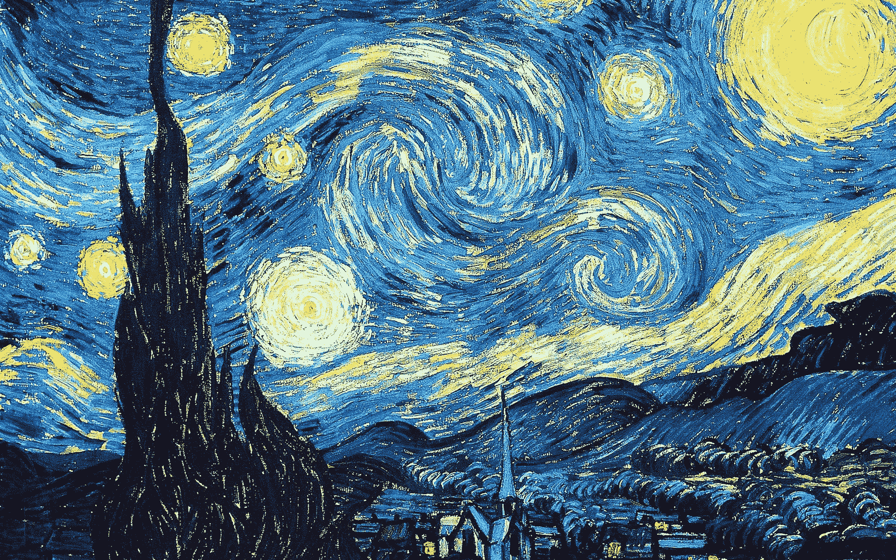
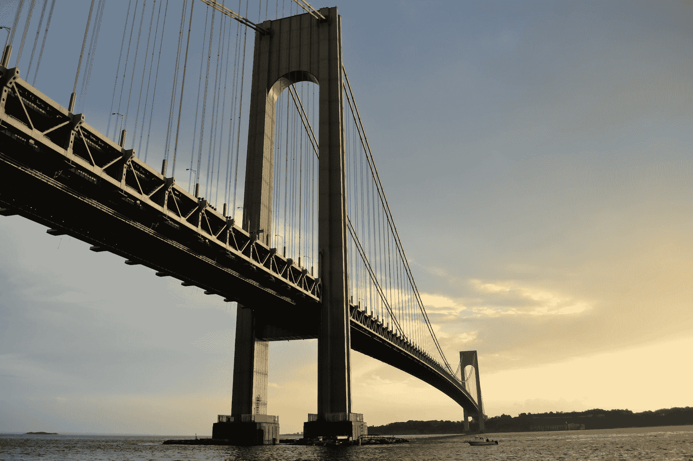
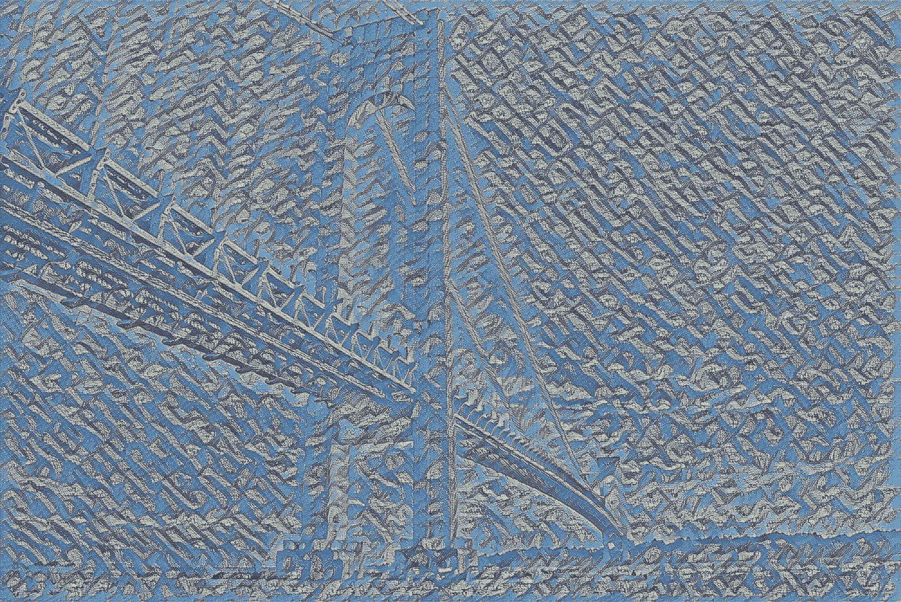
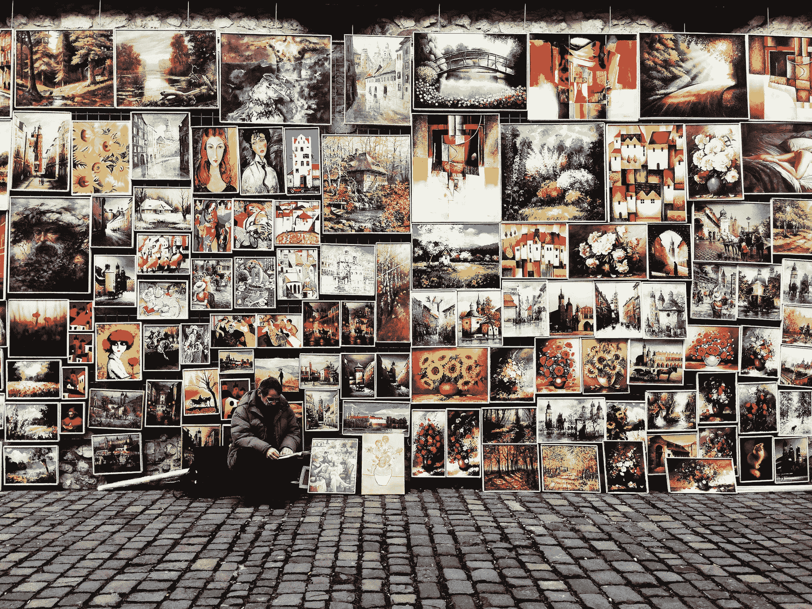

# 张量流的神经类型转移

> 原文：<https://blog.paperspace.com/neural-style-transfer/>


Photo by [Enzo Tommasi](https://unsplash.com/@11x11?utm_source=ghost&utm_medium=referral&utm_campaign=api-credit) / [Unsplash](https://unsplash.com/?utm_source=ghost&utm_medium=referral&utm_campaign=api-credit)

几个世纪以来，创造现代独特艺术的图像造型一直是人们感兴趣的视角。一个人能够用他们的技能和艺术风格的混合创造的艺术类型吸引了大量观众和该领域的爱好者以及其他商业承包商。自文艺复兴以来，绘画、雕塑、模型设计、建筑设计和其他艺术作品等创造性艺术作品在拍卖中以高利润出售。然而，最近，人工智能已经成为图像造型、设计和艺术工作的独特方式之一。

在艺术领域，人工智能可以成功完成大量独特的任务。在我们之前的文章中，我们已经研究了生成敌对网络的工作过程。我们已经探索了这些相互竞争的神经网络在不断改进以产生高质量结果的同时相互对抗的能力。一个例子是用 GANs 生成人脸，我们正在创建从未存在过的真实人脸。你可以从下面的[链接](https://blog.paperspace.com/face-generation-with-dcgans/)查看这篇文章。

在本文中，我们将介绍该方法背后的一些基本概念。然后，我们将继续分解神经类型转移以及对该算法的基本概念理解。我们将使用这种神经风格转移方法开发一个简单的项目。对于这个项目的开发，我们将讨论两种方法。在第一种方法中，我们将从头开始开发神经风格转移的整个架构构建。在第二种方法中，我们将使用 TensorFlow Hub 中提供的预训练模型来获得所需的结果。

## 简介:

人工智能最近最有趣的应用之一是神经类型转移的艺术。我们可以通过将两个或更多的图像混合在一起来创造一些新的和有创意的东西，从而产生独特的艺术作品。在人脸识别和对象检测领域已经有了巨大的改进，其中采用了诸如一次性学习的技术来轻松获得最佳结果。然而，直到最近，神经网络可能带来的艺术创新还没有得到太多关注。2015 年，随着“ [*一种艺术风格的神经算法*](https://arxiv.org/pdf/1508.06576.pdf) ”研究论文的推出，人工智能和深度学习的艺术品现场炸了。

我们介绍了一类深度神经网络，它可以有效地计算卷积神经网络中的大多数图像处理任务。它们由一层层的小计算单元组成，通过这些小计算单元，它们可以以前馈的方式分层次地处理视觉信息。卷积神经网络的每一层都包含几个这样的计算单元，其中有一组图像滤波器，每个滤波器从输入图像中提取某个特征。我们将在本文的下一部分讨论更多的工作方法。

为了跟随本文的其余部分，使用深度学习框架(如 TensorFlow 和 Keras)是一项基本要求。如果读者没有任何关于这些库的详细信息，我会推荐他们查看我以前的两篇博客，它们非常详细地涵盖了所有这些主题。观众可以通过这个[链接](https://blog.paperspace.com/absolute-guide-to-tensorflow/)查看 TensorFlow 的文章，通过下面的[链接](https://blog.paperspace.com/the-absolute-guide-to-keras/)查看 Keras 的博客。在下一节中，我们将继续理解神经风格转移模型的工作方法以及与其相关的大多数重要概念。

* * *

## 理解神经类型转移:



[Image Source](https://arxiv.org/pdf/1508.06576.pdf)

对于神经类型转移图像的生成，我们通常有三个主要的基本组件。其中一个组件是主图像，它充当“*内容*图像，我们可以在其上添加修改。这是我们添加所需作品的基础。修改图片是神经风格转移模型的第二个组成部分，称为“*风格*图像。风格是您可以添加到内容中的味道或变化，从而创建新的图片。利用“*内容*和“*风格*的成分，由神经风格转移算法形成的这个新图像被称为*“生成的”*图像。

这三个主要组成部分中的每一个都可以用它们的首字母来表示。“*内容*”(c)是我们添加美工修改的基础，“*风格*”(s)是指在原图像上添加新的设计。最后，我们有了*“生成的”(g)* 图像，这是由“*内容*”(c)和“*样式*”(s)混合而成的组件。在上面的图像表示中，我们可以注意到建筑物充当了"*内容* " (c)，而梵高《星夜》的另一个图像是"*风格* " (s)，我们将它们组合在一起，创建一个新的组合*"生成的】(g)* 图像。

我们用来解决这个问题的方法是借助深度 conv 网，特别是 VGG-19 迁移学习模型。将有三个参数通过 VGG-19 模型发送，即原始图像、内容图像和生成的图像。生成的图像最初被初始化为噪声。在训练过程之后，我们希望这个生成的图像变得类似于内容和样式图片的组合。在将我们的输入传递到 VGG-19 层时，我们将确保移除输出和密集层，使得它是仅包含卷积层和汇集层的全连接密集 conv 网。


[Image Source](https://arxiv.org/pdf/1508.06576.pdf)

密集 conv 网络的输出通过总损失函数。上图显示了这种损失函数的精确表示。总损失函数等于内容图像和样式图像的损失之和，其中α和β表示超参数。为了更详细地分析和理解神经类型转移，我建议查看下面的[研究论文](https://arxiv.org/pdf/1508.06576.pdf)。

* * *

## 从头开始开发神经类型转移项目:

在文章的这一部分，我们将揭示构造神经风格转移项目的第一批方法之一。我们将从零开始为这个项目的建设采取行动。我们将导入基本库，执行图像操作，创建总损失函数，开发卷积神经网络，并创建训练循环。

我们在开发这个项目时将利用的参考资料是 [Keras](https://keras.io/examples/generative/neural_style_transfer/) 和 [TensorFlow](https://www.tensorflow.org/tutorials/generative/style_transfer) 的官方网站。对于风格图像，我们将使用梵高的星夜图像来构建这个项目的两个部分。下图展示了星夜风格的代表。你可以下载并使用你选择的任何内容和风格的图片。



[Image Source](https://pixabay.com/illustrations/starry-night-vincent-van-gough-1093721/)

### 导入基本库:

为了开始这个项目，我们将导入这个项目计算所需的所有基本库。我们将导入 TensorFlow 和 Keras 深度学习框架来构建神经风格转移模型。我们将为特征提取过程导入 VGG-19 迁移学习模型。要了解更多关于迁移学习的知识，我建议查看我以前文章的以下链接-“[迁移学习的完整直观指南(第一部分)](https://blog.paperspace.com/transfer-learning-explained/)”和“[迁移学习的完整实用指南(第二部分)](https://blog.paperspace.com/untitled-6/)”我们还将导入 numpy 库来执行数值运算。

```
import tensorflow as tf
from tensorflow import keras
from tensorflow.keras.applications import vgg19
import numpy as np
```

一旦我们成功地导入了必要的库，我们就可以继续定义所需的参数了。我们将为三个最重要的组件设置路径，即内容、样式和生成图像的路径。所有这三个参数都需要通过我们的深度卷积网络来获得想要的结果。我们还将设置一些超参数，比如内容权重和样式权重。最后，我们还将为生成的图像设置一些尺寸要求。下面是执行以下操作的代码片段。

```
base_image_path = keras.utils.get_file("paris.jpg", "https://i.imgur.com/F28w3Ac.jpg")
style_reference_image_path = keras.utils.get_file("starry_night.jpg", "https://i.imgur.com/9ooB60I.jpg")
result_prefix = "paris_generated"

# Weights of the different loss components
total_variation_weight = 1e-6
style_weight = 1e-6
content_weight = 2.5e-8

# Dimensions of the generated picture.
width, height = keras.preprocessing.image.load_img(base_image_path).size
img_nrows = 400
img_ncols = int(width * img_nrows / height)
```

### 图像处理:

导入所需的库和图像路径后，下一步是确保定义一些函数来相应地预处理图像。我们将构造两个函数。第一个功能是预处理图像，并在 VGG-19 迁移学习模型的帮助下相应地加载它们。我们将把图像转换成能够根据需要计算所需操作的张量格式。我们还将构建一个函数，以便在所有需要的计算都按预期执行后，重新创建预处理后的图像。下面是执行这两个操作的代码片段。

```
def preprocess_image(image_path):
    # Util function to open, resize and format pictures into appropriate tensors
    img = keras.preprocessing.image.load_img(
        image_path, target_size=(img_nrows, img_ncols)
    )
    img = keras.preprocessing.image.img_to_array(img)
    img = np.expand_dims(img, axis=0)
    img = vgg19.preprocess_input(img)
    return tf.convert_to_tensor(img)

def deprocess_image(x):
    # Util function to convert a tensor into a valid image
    x = x.reshape((img_nrows, img_ncols, 3))
    # Remove zero-center by mean pixel
    x[:, :, 0] += 103.939
    x[:, :, 1] += 116.779
    x[:, :, 2] += 123.68
    # 'BGR'->'RGB'
    x = x[:, :, ::-1]
    x = np.clip(x, 0, 255).astype("uint8")
    return x
```

### 创建总损失函数:

下一步是创建总损失函数，它将是内容损失和风格损失的组合。下述损失函数的意义如前一节所定义。在下面的代码片段中，我们定义了四个函数，这四个函数对于计算整体损失至关重要。gram 矩阵函数用于计算风格损失。

样式损失函数保持生成的图像接近样式参考图像的局部纹理，而内容损失函数保持生成的图像的高级表示接近基础图像的高级表示。总损失函数用于保持生成的局部相干，这意味着我们希望以逻辑一致的方式保持损失。

```
def gram_matrix(x):
	# The gram matrix of an image tensor (feature-wise outer product)
    x = tf.transpose(x, (2, 0, 1))
    features = tf.reshape(x, (tf.shape(x)[0], -1))
    gram = tf.matmul(features, tf.transpose(features))
    return gram

def style_loss(style, combination):
    S = gram_matrix(style)
    C = gram_matrix(combination)
    channels = 3
    size = img_nrows * img_ncols
    return tf.reduce_sum(tf.square(S - C)) / (4.0 * (channels ** 2) * (size ** 2))

def content_loss(base, combination):
    return tf.reduce_sum(tf.square(combination - base))

def total_variation_loss(x):
    a = tf.square(x[:, : img_nrows - 1, : img_ncols - 1, :] - x[:, 1:, : img_ncols - 1, :])
    b = tf.square(x[:, : img_nrows - 1, : img_ncols - 1, :] - x[:, : img_nrows - 1, 1:, :])
    return tf.reduce_sum(tf.pow(a + b, 1.25))
```

### 发展深层卷积网络；

一旦我们相应地完成了总损失函数的定义，我们就可以着手创建和开发完成神经类型转移任务所需的深度卷积网络的整个架构。与上一节讨论的架构类似，我们将利用 VGG-19 架构，该架构将包含本项目所需的五个基本卷积块。

在这种迁移学习架构中，完全连接的层被忽略和丢弃。我们将利用只有卷积层和池层的深度卷积网络。一旦特征被提取，该网络的输出将通过适当的损失函数，该损失函数是内容和风格损失的组合。

```
# Build a VGG19 model loaded with pre-trained ImageNet weights
model = vgg19.VGG19(weights="imagenet", include_top=False)

# Get the symbolic outputs of each "key" layer (we gave them unique names).
outputs_dict = dict([(layer.name, layer.output) for layer in model.layers])

# Set up a model that returns the activation values for every layer in
# VGG19 (as a dict).
feature_extractor = keras.Model(inputs=model.inputs, outputs=outputs_dict)

# List of layers to use for the style loss.
style_layer_names = [
    "block1_conv1",
    "block2_conv1",
    "block3_conv1",
    "block4_conv1",
    "block5_conv1",
]
# The layer to use for the content loss.
content_layer_name = "block5_conv2"

def compute_loss(combination_image, base_image, style_reference_image):
    input_tensor = tf.concat(
        [base_image, style_reference_image, combination_image], axis=0
    )
    features = feature_extractor(input_tensor)

    # Initialize the loss
    loss = tf.zeros(shape=())

    # Add content loss
    layer_features = features[content_layer_name]
    base_image_features = layer_features[0, :, :, :]
    combination_features = layer_features[2, :, :, :]
    loss = loss + content_weight * content_loss(
        base_image_features, combination_features
    )
    # Add style loss
    for layer_name in style_layer_names:
        layer_features = features[layer_name]
        style_reference_features = layer_features[1, :, :, :]
        combination_features = layer_features[2, :, :, :]
        sl = style_loss(style_reference_features, combination_features)
        loss += (style_weight / len(style_layer_names)) * sl

    # Add total variation loss
    loss += total_variation_weight * total_variation_loss(combination_image)
    return loss
```

### 创建训练循环:

在从头开始开发神经风格转移模型的第 1 部分中，我们将执行的最后一步是创建训练循环。构建这个部分的第一步是创建装饰培训循环。一旦我们创建了装饰函数，我们的任务将是定义优化器。我们将使用这个项目的学习率和动量随机梯度下降优化器。

然后，我们将继续预处理并加载训练过程所需的所有三个图像。最后，我们将开始训练大约 2000 次迭代的循环。如果你愿意，你可以选择为更多的时期和迭代训练下面的神经风格转移。我们还将确保一旦训练过程完成，我们将使用我们之前定义的去处理图像功能来重新创建生成的图像。您可以在 Paperspace 上运行渐变平台的整个项目。

```
@tf.function
def compute_loss_and_grads(combination_image, base_image, style_reference_image):
    with tf.GradientTape() as tape:
        loss = compute_loss(combination_image, base_image, style_reference_image)
    grads = tape.gradient(loss, combination_image)
    return loss, grads

optimizer = keras.optimizers.SGD(
    keras.optimizers.schedules.ExponentialDecay(
        initial_learning_rate=100.0, decay_steps=100, decay_rate=0.96
    )
)

base_image = preprocess_image(base_image_path)
style_reference_image = preprocess_image(style_reference_image_path)
combination_image = tf.Variable(preprocess_image(base_image_path))

iterations = 2000
for i in range(1, iterations + 1):
    loss, grads = compute_loss_and_grads(
        combination_image, base_image, style_reference_image
    )
    optimizer.apply_gradients([(grads, combination_image)])
    if i % 100 == 0:
        print("Iteration %d: loss=%.2f" % (i, loss))
        img = deprocess_image(combination_image.numpy())
        fname = result_prefix + "_at_iteration_%d.png" % i
        keras.preprocessing.image.save_img(fname, img)
```

### 输出:

```
Iteration 100: loss=11024.51
Iteration 200: loss=8518.99
.
.
.
Iteration 1900: loss=5496.66
Iteration 2000: loss=5468.01 
```

培训完成后，请确保检查结果。您可以选择运行以下程序来增加迭代次数和次数，以减少损失并生成更好的结果。

在本文的下一部分，我们将介绍如何使用 TensorFlow Hub 以更少的代码需求更直接地开发同一个项目。然而，最好是理解大多数建筑神经网络构建的详细工作方式，以获得更直观的理解。

* * *

## 使用 TensorFlow Hub 开发神经类型转移；

现在，我们已经了解了如何在 TensorFlow 和 Keras 的帮助下从头开始构建神经类型转移模型，让我们来看看计算这样一个项目的一个更简单的方法。我建议在进行 TensorFlow-Hub 预训练模型方法之前，从头开始学习神经类型转移算法的构造。对于这个实验，我们将利用下面的一座桥的图片作为我们的内容图像，而我们将利用梵高的星夜图像作为样式图像来生成一个新的风格化的生成图像。



Photo by [Manny Ribera](https://unsplash.com/@mannyribera13?utm_source=ghost&utm_medium=referral&utm_campaign=api-credit) / [Unsplash](https://unsplash.com/?utm_source=ghost&utm_medium=referral&utm_campaign=api-credit)

在我们继续构建我们的项目之前，让我们了解 TensorFlow Hub 到底是什么。TensorFlow Hub 由一系列预训练的深度学习模型组成，可用于各种任务，如 BERT、fast R-CNN 等，我们可以反复使用这些模型来快速生成特定目的的结果。对于可用的模型，您可以对它们进行相应的微调，并将其部署到任何地方来执行特定的任务。有关这个主题的更多信息，请查看 [TensorFlow Hub、](https://www.tensorflow.org/hub)的官方登录页面，在这里您可以构建关于自然语言处理、对象检测、风格转换等更多内容的项目。

### **导入基本库:**

第一步是导入我们将用于构建这个项目的所有基本库。我们将加载 TensorFlow 深度学习框架以及 TensorFlow Hub，以访问预训练的神经风格转移模型。我们还将导入 matplotlib 库来可视化生成图像的输出。您还可以相应地可视化内容或样式图像。numpy 库将帮助我们压缩生成图像的维度，以便 matplotlib 库可以访问生成的图片。最后，我们将导入计算机视觉 cv2 库，以便在需要时导出和保存生成的图像。

```
import tensorflow as tf
import tensorflow_hub as hub
import matplotlib.pyplot as plt
import numpy as np
import cv2
```

在导入所有需要的库之后，我们还可以从 TensorFlow Hub 访问预先训练好的神经风格转移模型。模型链接变量表示到 TensorFlow Hub 网站的链接，该网站包含到所存储和训练的神经类型转移模型的路径。NST 模型变量将加载相应的链接，通过该链接，我们可以直接访问并执行应用神经类型转移算法的操作，而无需太多的编码要求。下面是访问预训练模型的代码片段。

```
# Access the pre-trained model from TensorFlow-Hub

model_link = "https://tfhub.dev/google/magenta/arbitrary-image-stylization-v1-256/2"
NST_model = hub.load(model_link)
```

### **传递和解释数据:**

在下一个代码片段中，我们将创建一个函数来获取数据，加载数据，并对数据进行相应的操作。以下函数将读取相应目录中保存图像的路径。然后，我们将检测和解码特定的图像，将其转换为我们想要的数据类型，并扩展维度。最后，该函数返回操作后的图像。我们将使用构造的函数来加载、访问和操作内容和样式图像。

```
# Function to load and operate on the content and style images

def get_data(img_path):
    img = tf.io.read_file(img_path)
    img = tf.image.decode_image(img, channels=3)
    img = tf.image.convert_image_dtype(img, tf.float32)
    img = img[tf.newaxis, :]
    return img
```

让我们在下一个代码块中加载内容和样式图像。我将上面的图片标记为*‘桥’*，存储在。jfif 格式，它将作为内容图像，梵高的星夜作为*【风格图像】*存储在。jpg 格式将作为样式图像。我们将使用这两个实体来创建一个新生成的带有神经风格转移模型的图像。

```
content_image = get_data('Bridge.jfif')
style_image = get_data('Style Image.jpg')
```

### **通过加载的模型获取结果:**

最后，我们可以继续生成新的图像，该图像将由加载的预训练神经类型转移模型来执行。我们需要将两个主要参数传递给模型来评估它们并生成结果图像。我们将传递内容图像(桥)作为第一个参数，样式图像(梵高星夜)作为第二个参数。我们将把结果图片存储在生成的图像变量中。下面是将执行以下操作的代码块。

```
generated_image = NST_model(tf.constant(content_image), tf.constant(style_image))[0]
```

您可以利用 matplotlib 库来可视化生成的图像，并利用 numpy 库来压缩维度以实现可视化。如果您想要保存图像，您可以使用计算机视觉 cv2 库，并将生成的图像写入您想要保存的目录，文件扩展名为。png，。jpg，。jpeg 或任何其他类似的格式。下面是我在运行 TensorFlow Hub 的预训练神经风格转移模型时能够实现的生成图像。建议尝试不同内容图像和风格图像的多种组合，以生成独特的图片和艺术作品。



The Generated Image From The Neural Style Transfer Model

* * *

## 结论:



Photo by [Beata Ratuszniak](https://unsplash.com/@beataratuszniak?utm_source=ghost&utm_medium=referral&utm_campaign=api-credit) / [Unsplash](https://unsplash.com/?utm_source=ghost&utm_medium=referral&utm_campaign=api-credit)

在本文中，我们涵盖了理解神经风格转移算法所需的大多数基本概念。我们了解了这些神经网络到底是如何工作的基本概念知识。在获得了这个概念的详细描述之后，我们研究了两种用神经风格转移构建项目的方法。在第一种方法中，我们从头开始构建整个架构，并使用获得的模型来评估和生成修改后的图像。在第二种方法中，我们利用来自 TensorFlow Hub 的预训练模型来生成两张图片的组合，以创建新生成的图像。

这些深度学习网络集在两个主要成分(即内容图片和风格图片)的帮助下工作，当组合在一起时，产生一个生成的图像。我们可以用这些神经网络生成一堆独特时尚的艺术品。强烈建议观众尝试不同类型的内容和风格，从而产生新的变化。这些神经网络模型有无数种解释的可能性，你可能最终生成一些极具美感和视觉愉悦的东西。

在以后的文章中，我们将讨论 WGANs、变形金刚、从头开始的神经网络、强化学习等主题。在那之前，我强烈推荐尝试神经风格转移算法，继续创造你自己的艺术世代，继续探索！