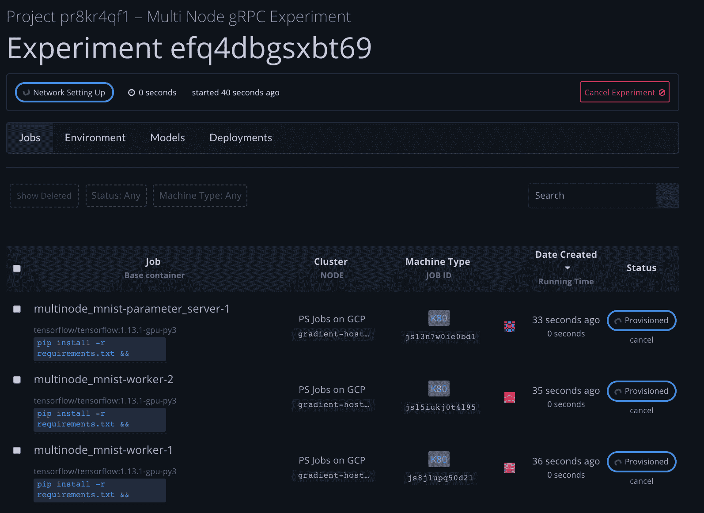
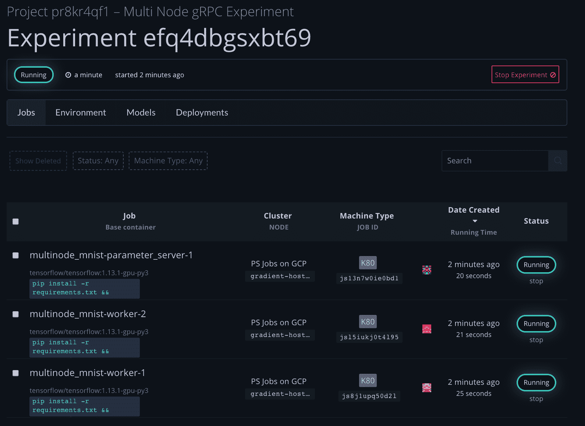
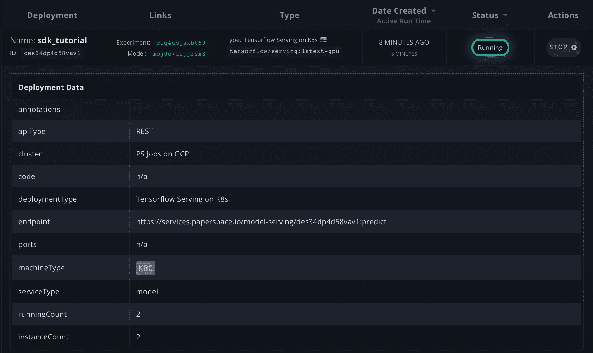
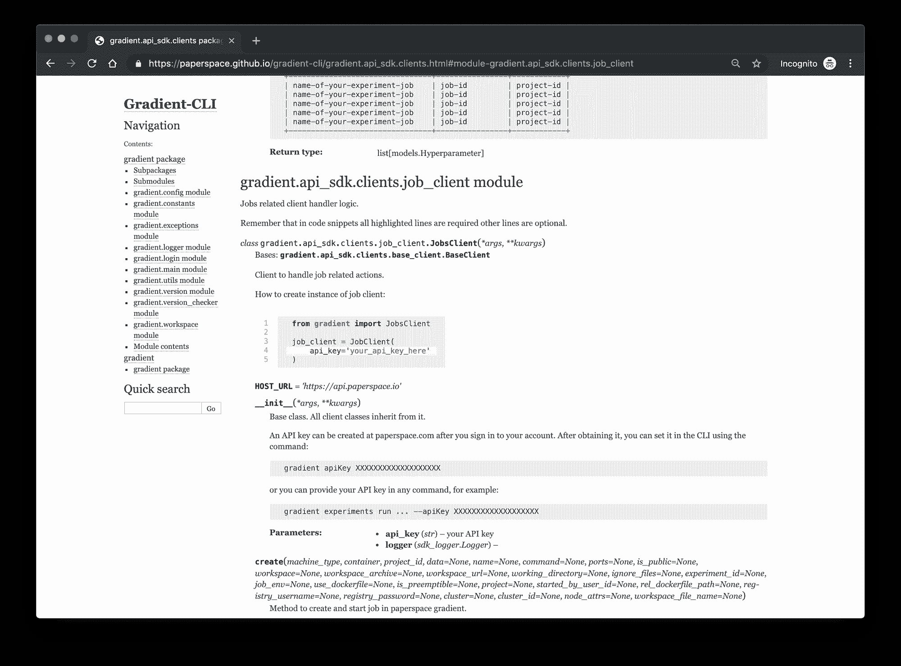

# 新渐变 Python SDK

> 原文：<https://blog.paperspace.com/new-gradient-sdk/>

[2021 年 12 月 2 日更新:本文包含关于梯度实验的信息。实验现已被弃用，渐变工作流已经取代了它的功能。[请参见工作流程文档了解更多信息](https://docs.paperspace.com/gradient/explore-train-deploy/workflows)。]

介绍用于机器学习模型培训、构建和部署的全新 Gradient Python SDK。轻松构建复杂的端到端机器学习管道。

对于许多机器学习开发人员来说，通过简单的编程 API 与他们的开发过程进行交互的能力是一个长期的要求。SDK 加入了我们的命令行实用程序、构建器 GUI 和 GradientCI 构建自动化工具，成为在 Gradient 中构建和部署机器学习模型的一等公民。

**注意:**查看[示例笔记本](https://ml-showcase.paperspace.com/projects/gradient-python-sdk-end-to-end-example)，其中包含一个您可以在自己的帐户中运行的端到端示例。

### 安装

`pip install --pre gradient`

### 快速启动

```
#Import the SdkClient from the gradient package
from gradient import sdk_client

#create a API Key
api_key = os.getenv("PS_API_KEY")

#access all paperspace entities from a single client
client = sdk_client.SdkClient(api_key) 
```

这个新的库允许您在 Python 脚本或应用程序中以编程方式与渐变进行交互。它补充了 Gradient CLI 的功能，增加了自动化操作和管道的能力。

下面是一个使用 SDK 的例子，它使用多个工人和一个参数服务器来执行多节点，观察实验的状态转换，并在训练期间传输日志。训练完成后，我们采用相关的 tensorflow 模型&使用 TFServing 作为 rest 端点，由多实例 GPU 支持负载平衡，部署它进行推理。

### 实例化 SDK 客户端

```
client = sdk_client.SdkClient(api_key)

#or access each component from its own client
deployment_client = sdk_client.DeploymentsClient(api_key)
models_client = sdk_client.ModelsClient(api_key)
jobs_client = sdk_client.JobsClient(api_key)
projects_client = sdk_client.ProjectsClient(api_key)
experiment_client = sdk_client.ExperimentsClient(api_key) 
```

### 创建项目

```
project_id = client.projects.create("new project") 
```

SDK 将任何创建调用的 id 作为 python 对象返回，以实现简单的脚本编写。

## 创建多节点分布式实验

### 步骤 1:设置超参数

```
#Create a dictionary of parameters for running a distributed/multinode experiment
env = {
    "EPOCHS_EVAL":5,
    "TRAIN_EPOCHS":10,
    "MAX_STEPS":1000,
    "EVAL_SECS":10
} 
```

### 步骤 2:用实验参数创建一个字典

```
multi_node_parameters = { 
    "name": "multinode_mnist",
    "project_id": project_id,
    "experiment_type_id": 2,
    "worker_container": "tensorflow/tensorflow:1.13.1-gpu-py3",
    "worker_machine_type": "K80",
    "worker_command": "pip install -r requirements.txt && python mnist.py",
    "experiment_env": env,
    "worker_count": 2,
    "parameter_server_container": "tensorflow/tensorflow:1.13.1-gpu-py3",
    "parameter_server_machine_type": "K80",
    "parameter_server_command": "pip install -r requirements.txt && python mnist.py",
    "parameter_server_count": 1,
    "workspace_url": "https://github.com/Paperspace/mnist-sample.git",
    "model_path": "/storage/models/tutorial-mnist/",
    "model_type": "Tensorflow"
} 
```

### 步骤 3:运行训练实验

```
#pass the dictionary into experiments client
experiment_id = 
    client.experiments.run_multi_node(**multi_node_parameters) 
```

### 步骤 3a:观察实验启动时的状态转换

```
from gradient import constants.ExperimentState
print("Watching state of experiment")
state = ""
while state != "running":
    new_state = client.experiments.get(experiment_id).state
    new_state = ExperimentState.get_state_str(new_state)
    if new_state != state:
        print("state: "+new_state)
        state = new_state 
```

```
Watching state of experiment
state: created
state: provisioning
state: provisioned
state: network setting up
state: network setup
state: running 
```





### 步骤 3b:在运行时流式传输日志

```
log_streamer = 
    client.experiments.yield_logs(experiment_id)
print("Streaming logs of experiment")
try:
    while True:
        print(log_streamer.send(None))
except:
    print("done streaming logs") 
```

```
Streaming logs of experiment
LogRow(line=115, message='2019-08-30 02:14:55.746696: I tensorflow/core/common_runtime/gpu/gpu_device.cc:1115] Created TensorFlow device (/job:worker/replica:0/task:1/device:GPU:0 with 10790 MB memory) -> physical GPU (device: 0, name: Tesla K80, pci bus id: 0000:00:04.0, compute capability: 3.7)', timestamp='2019-08-30T02:14:55.747Z')
LogRow(line=115, message='2019-08-30 02:14:54.799712: I tensorflow/core/common_runtime/gpu/gpu_device.cc:1115] Created TensorFlow device (/job:master/replica:0/task:0/device:GPU:0 with 10790 MB memory) -> physical GPU (device: 0, name: Tesla K80, pci bus id: 0000:00:04.0, compute capability: 3.7)', timestamp='2019-08-30T02:14:54.799Z')
LogRow(line=115, message='2019-08-30 02:14:55.041046: I tensorflow/core/common_runtime/gpu/gpu_device.cc:1115] Created TensorFlow device (/job:ps/replica:0/task:0/device:GPU:0 with 10790 MB memory) -> physical GPU (device: 0, name: Tesla K80, pci bus id: 0000:00:04.0, compute capability: 3.7)', timestamp='2019-08-30T02:14:55.041Z')
LogRow(line=116, message='2019-08-30 02:14:55.043605: I tensorflow/core/distributed_runtime/rpc/grpc_channel.cc:252] Initialize GrpcChannelCache for job master -> {0 -> 10.138.0.213:5000}', timestamp='2019-08-30T02:14:55.043Z')
LogRow(line=116, message='2019-08-30 02:14:54.802267: I tensorflow/core/distributed_runtime/rpc/grpc_channel.cc:252] Initialize GrpcChannelCache for job master -> {0 -> localhost:5000}', timestamp='2019-08-30T02:14:54.802Z')
LogRow(line=116, message='2019-08-30 02:14:55.749520: I tensorflow/core/distributed_runtime/rpc/grpc_channel.cc:252] Initialize GrpcChannelCache for job master -> {0 -> 10.138.0.213:5000}', timestamp='2019-08-30T02:14:55.749Z')
LogRow(line=117, message='2019-08-30 02:14:55.749569: I tensorflow/core/distributed_runtime/rpc/grpc_channel.cc:252] Initialize GrpcChannelCache for job ps -> {0 -> 10.138.0.71:5000}', timestamp='2019-08-30T02:14:55.749Z')
LogRow(line=117, message='2019-08-30 02:14:54.802300: I tensorflow/core/distributed_runtime/rpc/grpc_channel.cc:252] Initialize GrpcChannelCache for job ps -> {0 -> 10.138.0.71:5000}', timestamp='2019-08-30T02:14:54.802Z')
LogRow(line=117, message='2019-08-30 02:14:55.043637: I tensorflow/core/distributed_runtime/rpc/grpc_channel.cc:252] Initialize GrpcChannelCache for job ps -> {0 -> localhost:5000}', timestamp='2019-08-30T02:14:55.043Z')
LogRow(line=118, message='2019-08-30 02:14:55.043659: I tensorflow/core/distributed_runtime/rpc/grpc_channel.cc:252] Initialize GrpcChannelCache for job worker -> {0 -> 10.138.0.213:5000, 1 -> 10.138.0.29:5000}', timestamp='2019-08-30T02:14:55.043Z')
LogRow(line=118, message='2019-08-30 02:14:54.802311: I tensorflow/core/distributed_runtime/rpc/grpc_channel.cc:252] Initialize GrpcChannelCache for job worker -> {0 -> 10.138.0.213:5000, 1 -> 10.138.0.29:5000}', timestamp='2019-08-30T02:14:54.802Z')
LogRow(line=136, message='I0830 02:14:57.358003 140254722529024 basic_session_run_hooks.py:594] Saving checkpoints for 0 into /storage/models/tutorial-mnist/mnist/model.ckpt.', timestamp='2019-08-30T02:14:57.358Z')
LogRow(line=136, message='I0830 02:15:06.821857 140249388017408 session_manager.py:493] Done running local_init_op.', timestamp='2019-08-30T02:15:06.822Z')
LogRow(line=137, message='I0830 02:14:58.314819 140254722529024 util.py:164] Initialize strategy', timestamp='2019-08-30T02:14:58.315Z')
LogRow(line=137, message='I0830 02:15:06.949163 140249388017408 util.py:164] Initialize strategy', timestamp='2019-08-30T02:15:06.949Z')
LogRow(line=138, message='2019-08-30 02:14:58.421029: I tensorflow/stream_executor/dso_loader.cc:152] successfully opened CUDA library libcublas.so.10.0 locally', timestamp='2019-08-30T02:14:58.421Z')
LogRow(line=138, message='I0830 02:15:14.057311 140249388017408 basic_session_run_hooks.py:249] cross_entropy = 0.34506965, learning_rate = 1e-04, train_accuracy = 0.94', timestamp='2019-08-30T02:15:14.057Z')
LogRow(line=139, message='I0830 02:15:14.057899 140249388017408 basic_session_run_hooks.py:249] loss = 0.34506965, step = 159', timestamp='2019-08-30T02:15:14.058Z')
LogRow(line=139, message='I0830 02:15:04.954904 140254722529024 basic_session_run_hooks.py:249] cross_entropy = 2.3063064, learning_rate = 1e-04, train_accuracy = 0.11', timestamp='2019-08-30T02:15:04.955Z')
LogRow(line=140, message='I0830 02:15:15.893357 140249388017408 basic_session_run_hooks.py:247] cross_entropy = 0.09328934, learning_rate = 1e-04, train_accuracy = 0.945 (1.836 sec)', timestamp='2019-08-30T02:15:15.893Z') 
```

### 现在查看和部署结果模型

```
model = client.models.list(experiment_id = experiment_id) 
```

```
deploy_param = {
    "deployment_type" : "Tensorflow Serving on K8s",
    "image_url": "tensorflow/serving:latest-gpu",
    "name": "sdk_tutorial",
    "machine_type": "K80",
    "instance_count": 2,
    "model_id" : model[0].id
}
mnist = client.deployments.create(**deploy_param) 
```

```
client.deployments.start(mnist) 
```



```
deployment = client.deployments.list(model_id=model[0].id) 
```

#### 以编程方式获得结果端点

```
print(deployment)
print("Endpoint: "+deployment[0].endpoint) 
```

```
[Deployment(id_='des34dp4d58vav1', name='sdk_tutorial', endpoint='https://services.paperspace.io/model-serving/des34dp4d58vav1:predict', api_type='REST', state='Running', model_id='moj0e7uljjrsx8', project_id='pr8kr4qf1', image_url='tensorflow/serving:latest-gpu', deployment_type='Tensorflow Serving on K8s', machine_type='K80', instance_count=2)]

Endpoint: 'https://services.paperspace.io/model-serving/des34dp4d58vav1:predict' 
```

### 执行推理

```
image = get_image_from_drive('example5.png')
show_selected_image(image) 
```


```
def make_prediction_request(image, prediction_url):
    vector = make_vector(image)
    json = {
        "inputs": [vector]
    }
    response = requests.post(prediction_url, json=json)

    print('HTTP Response %s' % response.status_code)
    print(response.text)

make_prediction_request(image, deployment[0].endpoint) 
```

### 向 REST 端点发送 post 请求并获取分类

```
HTTP Response 200
{
    "outputs": {
        "classes": [
            5
        ],
        "probabilities": [
            [
                0.0,
                0.0,
                0.0,
                0.0,
                0.0,
                1.0,
                0.0,
                0.0, 
```

### 额外资源

[阅读产品文档](https://docs.paperspace.com/gradient/gradient-python-sdk/gradient-python-sdk)

[读取自动生成的文档](https://paperspace.github.io/gradient-cli/gradient.api_sdk.clients.html)

