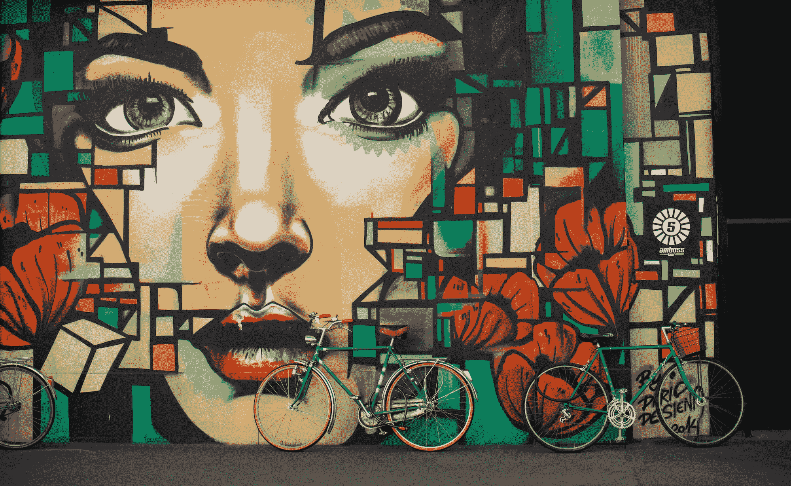
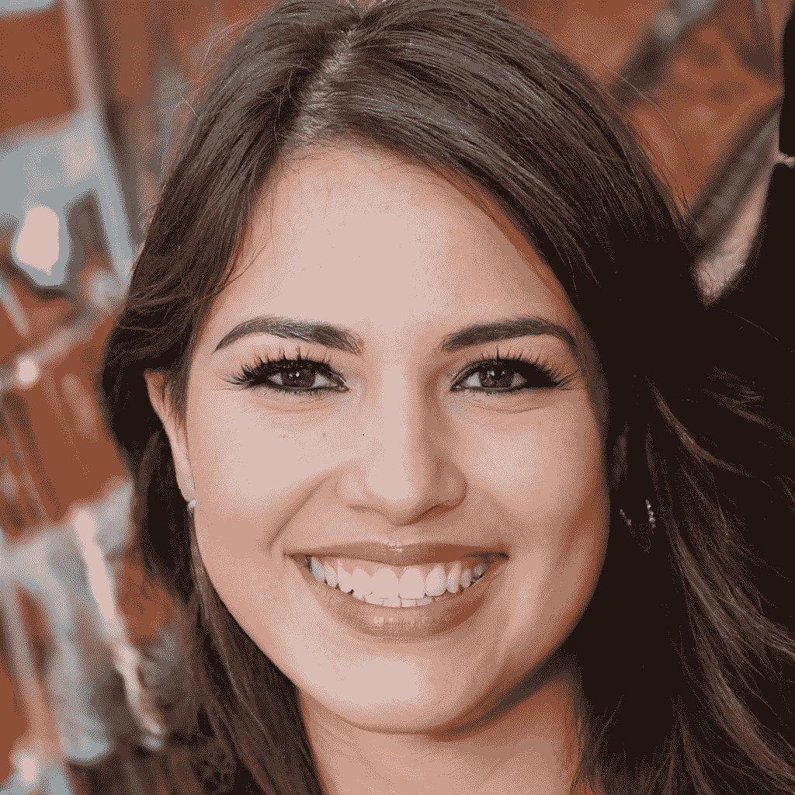
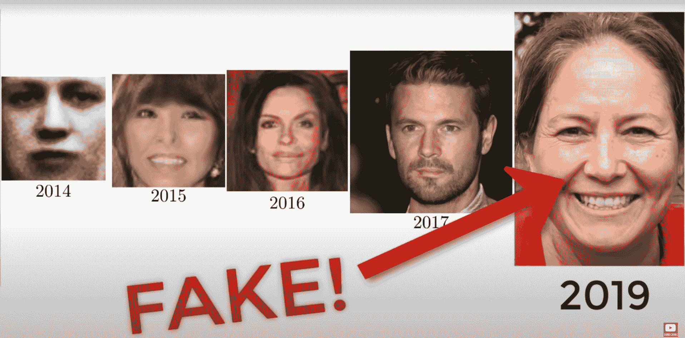
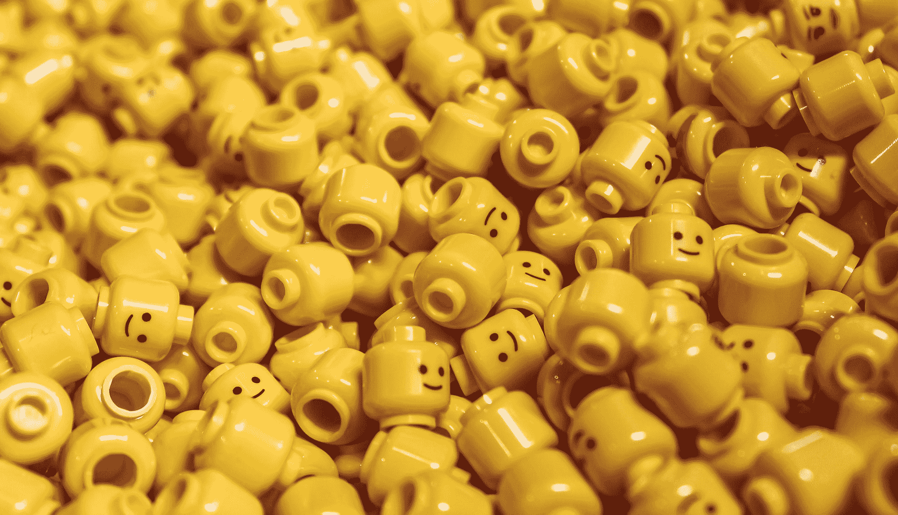

# 用 GANs 生成人脸

> 原文：<https://blog.paperspace.com/face-generation-with-dcgans/>



Photo by [Timon Klauser](https://unsplash.com/@timon_k?utm_source=ghost&utm_medium=referral&utm_campaign=api-credit) / [Unsplash](https://unsplash.com/?utm_source=ghost&utm_medium=referral&utm_campaign=api-credit)

在高计算能力和先进技术进步的现代时代，我们能够完成许多曾经被认为不可能完成的复杂任务。生成网络是过去十年中最强有力的话题之一，因为它们已经成功地产生了惊人的结果。我们将在本文中讨论的任务之一，也曾被认为是非常复杂的，是借助于生成性对抗网络来生成真实的人脸。已经有多个成功部署的模型和不同的神经架构构建成功地完成了这项任务。

本文将着重于借助生成对抗网络来理解面部生成的一些基本概念。我们将尝试借助于我们在以前的工作中构建的深度卷积生成对抗网络(DCGANs)来完成逼真图像的生成。在继续阅读本文之前，我建议查看我之前的两部作品，以了解本文的最新内容。要开始使用 GANs，请查看以下链接-“[](https://blog.paperspace.com/complete-guide-to-gans/)*”生成性对抗网络(GANs)完全指南；要进一步了解 DCGANs，请查看以下链接-“[*开始使用 DCGANs*](https://blog.paperspace.com/getting-started-with-dcgans/) ”*

*要理解我们将在本文中涉及的众多核心概念，请查看目录。我们将首先介绍使用 GANs 生成面部结构，然后进一步了解一些已成功部署的现有技术，以实现这些任务的最佳结果。我们将快速概述 DCGANs 的架构和方法，以完成以下任务。然后进行代码演练，讨论实现理想结果的各个步骤。最后，我们将总结未来工作的一些急需的部分，以及我们可以对构建的架构模型进行的改进和提高的类型。*

## *简介:*

**

*生成性对抗网络(GANs)增长迅速。这些双神经网络架构的持续发展，包括一个发生器模型和鉴别器，有助于稳定输出和生成真实图像，人眼几乎不可能区分这些图像。上面 1024x1024 大小的图像显示了一个开朗的女人的图片。看下面的图片，对于刚接触深度学习的人来说，这个人实际上并不存在，这可能会让他们感到惊讶。是从名为[这个 X 不存在](https://thisxdoesnotexist.com/)的网站生成的，你也可以通过刷新下面的[链接](https://thispersondoesnotexist.com/)自行生成随机面孔。每次运行生成器时，都会生成一个全新的真实面孔。*

*当我问我的几个朋友，他们对这张特定的图片有什么想法时，几乎没有人能够弄清楚下面的图片是在人工智能(AI)的帮助下生成的。准确地说，用于生成以下人脸的 StyleGAN2 体系结构表现出色，产生的结果与真实照片没有区别。只有通过进一步的自省，你才能注意到上面描述的下图中的轻微异常。一个值得注意的问题可能是奇怪的阴影背景。另一个问题可能是她戴的两个耳环的不同，但这也可以被认为是一种有趣的时尚感。像这样的小错误仍然很难解决*

*推测生成的图像可能不是真实的是很有趣的，但我们正在进行以下讨论的简单事实足以证明，生成网络在面部结构生成或任何其他类似项目等任务中的潜力是巨大的，在即将到来的未来值得关注。我们将探索这些生成网络所具有的巨大潜力，从零开始创建逼真的人脸或任何其他类型的图像。两个神经网络相互竞争以产生最有效的结果的概念是深度学习研究中一个有趣的方面。*

*让我们从理解当前在人脸生成中使用的一些方法和预先存在的技术开始。一旦我们探索了这些预先存在的技术，我们将更详细地讨论如何在深度卷积生成对抗网络的帮助下产生这些类似的结果。因此，事不宜迟，让我们开始相应地理解和探讨这些主题。*

* * *

## *了解一些预先存在的技术:*

*

[Image Source](https://www.youtube.com/watch?v=C1YUYWP-6rE)* 

*在不到十年的短时间内，GANs 技术的进步日新月异，并取得了极大的成功。2014 年，一个简单的生成式对抗性架构开始了冒险，通过多年的进步和改进，它很快受到了持续的欢迎。在生成神经网络领域，开发人员和研究人员不断发现大量的新技术和方法。上图显示了发展的快速步伐，这是通过在生成性对抗网络中使用的整体技术和方法的改进而实现的。让我们简单地讨论一下目前在机器学习领域中使用的一些奇妙的技术，这些技术的目的是生成真实的人脸。*

*NVIDIA 开发的 StyleGAN 架构是一个主要架构，它出色地完成了从零开始生成照片级真实感人脸的任务。虽然这些初始模型一开始就产生了惊人的结果，但是在 StyleGAN 架构的第二次迭代中，这些模型获得了巨大的流行。经过彻底的研究、分析和实验，他们修复了一些典型的人工制品特征。2019 年，新版本的风格 GANs 2 发布了先进的模型架构和几种改进培训程序的方法，以达到最佳效果。要了解和学习更多关于这种特殊架构的知识，我建议看看下面的[研究论文](https://arxiv.org/pdf/1912.04958.pdf)。最近，[发布了 StyleGAN](https://blog.paperspace.com/stylegan3-gradient-notebooks/) 架构的第三次迭代，在它通常执行的任务类型上有了改进的结果和进一步的进步。*

*另一个有趣的概念是人脸应用程序，它通过改变人脸来改变一个人的年龄类型，这也是在 GAN 的帮助下建立的。典型地，为了执行这些类型的任务，使用循环 GAN 架构，该架构最近获得了极大的普及。这些甘执行学习不同风格的各种图像的转换的动作。比如 Face App，将生成或上传的人脸转化为不同年龄段的人脸。我们将在未来的工作中探索循环 GAN 和样式，但出于本文的目的，我们将坚持我们之前讨论的 DCGANs 架构来实现生成人脸的任务。*

* * *

## *使用 DCGANs 生成面:*

*在本文的这一部分，我们将进一步探讨 DCGANs 的概念，以及如何在这种架构的帮助下生成大量的人脸。在我之前的一篇关于 [DCGANs](https://blog.paperspace.com/getting-started-with-dcgans/) 的文章中，我们已经涵盖了在这些生成网络的帮助下理解和解决一个典型任务所需的大部分基本概念。因此，我们将有一个模型类型的简要概述，我们将利用它来解决面部生成的任务，并实现最佳结果。让我们开始探索这些概念。*

### *DCGANs 概述:*

*虽然在生成网络的早期，基本或普通的生成对抗网络产生了一些最好的作品，但这些网络对于更复杂的任务来说不是高度可持续的，并且对于执行某些操作来说在计算上不是那么有效。为此，我们使用各种生成网络架构，这些架构是为特定目的而构建的，并且比其他架构更有效地执行特定动作。在本文中，我们将利用具有深度卷积生成器架构的 DCGANs 模型来生成图像。具有随机潜在噪声向量的发生器将产生面部结构，并且作为图像分类器的鉴别器将区分输出图像是真是假。*

*虽然深度卷积生成对抗网络的工作过程类似于典型的 GAN 类型网络的工作，但是存在一些关键的架构改进，这些改进被开发来在大多数数据集上产生更有效的结果。在鉴别器模型中，大多数池层被替换为步长卷积，而在生成器模型中被替换为分数步长卷积。为了获得整体架构的稳定性，在生成器和鉴别器模型中广泛使用了批量规范化层。对于完全卷积型架构，大多数后来的密集层，即完全连接的层被移除。*

*鉴别器模型中的所有卷积层之后是泄漏 ReLU 激活函数，而不是用于分类目的的具有 Sigmoid 的最后一层。生成器模型在除最终层之外的所有层中使用 ReLU 激活函数，最终层出于生成目的使用 tanh 函数。然而，值得注意的是，我们在发电机架构上做了一些小的改动，因为这些是现代的一些微小变化，在特定的用例中显示了一些更好的结果。查看者和开发人员可以根据他们的需求，随意尝试他们自己的变体或坚持他们各自项目的默认原型。*

### *要遵循的程序:*

*为了有效地构建这个项目，我们将遵循的程序是确保我们为所需的任务收集了最好的数据集。我们的选择是利用互联网上可用的高质量数据集，或者坚持使用其他一些替代方法来执行这些任务。我们将利用*名人面孔属性(CelebA)数据集*来开发我们的面部识别生成网络。以下[数据集](https://www.kaggle.com/jessicali9530/celeba-dataset)可在 Kaggle 上获得，建议您下载它以继续文章的剩余内容。如果你有一个先进的系统，拥有计算高端问题的资源，那么你可以尝试名人 HQ 数据集。此外，请记住，Paperspace 上的渐变平台是这些大量 GPU 相关任务的最佳选择之一。*

*一旦我们下载了数据集，确保您在“*图像*”目录中提取了 *img align celeba* zip 文件，以继续下一步。我们将在这个项目中利用 TensorFlow 和 Keras 深度学习框架。如果你没有这两个库的完整知识，或者想快速更新你的基础知识，我建议你查看 TensorFlow 的以下[链接](https://blog.paperspace.com/absolute-guide-to-tensorflow/)和 Keras 的这个特定的[链接](https://blog.paperspace.com/the-absolute-guide-to-keras/)。一旦我们访问了数据集，我们将构建生成器和鉴别器模型来执行人脸生成任务。整个建筑的构建将集中于创造一个对抗性的框架，以生成图像并对最现实的解释进行分类。在整个建筑构建完成后，我们将开始训练过程并相应地保存图像。最后，我们将保存生成器和鉴别器模型，以便将来可以重用它们。*

* * *

## *代码演练:*

*在本文的这一部分，我们将探索如何从头开始编写我们的人脸生成器模型，以便我们可以利用这些生成器模型来获得高质量的结果，类似于一些最先进的方法。值得注意的是，在这个项目中，我们将使用较小的尺寸(64x64 ),这样所有层次的人都可以构建这个作品，而不会受到图形限制的阻碍。Paperspace 提供的梯度平台是这些复杂计算项目的最佳实用选项之一。如果你有更好的设备或者想要得到更好的结果，那么我会建议你尝试更多互联网上的高清数据集。请随意探索这些选项，并相应地选择最佳选项。出于本文的目的，我们将坚持使用一个简单的较小维度的数据集，它不会占用太多空间。让我们开始这项工程的建设吧。*

 *### 导入基本库:

大多数项目的第一步是导入我们将用于所需项目开发的所有基本库。为了构建这个人脸生成模型，我们将利用 TensorFlow 和 Keras 深度学习框架来实现我们的目标。如果您喜欢 PyTorch，这也是按照您的意愿开发项目的另一个有效选择。如果您不熟悉 TensorFlow 或 Keras，请查看以下两篇文章，它们将详细指导您如何开始使用这些库-“[tensor flow](https://blog.paperspace.com/absolute-guide-to-tensorflow/)绝对指南”和“[Keras](https://blog.paperspace.com/the-absolute-guide-to-keras/)绝对指南。”除了这些精彩的框架，我们还将利用其他基本库，如 matplotlib、numpy 和 OpenCV，来相应地执行可视化、计算和图形相关的操作。

```
import tensorflow as tf
from tensorflow import keras
from tensorflow.keras import layers
import numpy as np
import matplotlib.pyplot as plt
import os
import cv2
from tqdm import tqdm
```

您可以随意使用您认为必要或适合执行以下任务的其他库。您还可以添加许多图形工具或可视化图形选项来跟踪您的进度，并最终帮助您改善结果。一旦我们成功地导入了我们需要的所有库，我们就可以继续研究数据并构建我们的模型来解决下面的任务。

### 探索数据:

在这一步中，我们将把数据加载到数据集格式中，并相应地映射细节。Keras 中的预处理类允许我们访问来自特定目录的数据流，这样我们就可以访问存储在特定文件夹中的所有图像。确保一旦提取了包含超过 200000 张图像的名人数据集，就将提取的目录放入另一个名为“ *Images* 的目录或您选择的任何其他文件夹名称中。数据集将来自以下目录，我们将指定图像大小为 *64 x 64* ，用于计算以下数据。

```
dataset = keras.preprocessing.image_dataset_from_directory(
    "Images", label_mode=None, image_size=(64, 64), batch_size=32
)

dataset = dataset.map(lambda x: x / 255.0)
```

上述代码单元块的成功执行应该显示类似于以下语句的结果-“*找到属于 1 个类的 202599 个文件。*"您可以选择随机显示一幅图像，以检查您是否已按计划精确加载数据集。下面的代码块是可视化数据的方法之一。

```
for i in dataset:
    plt.axis("off")
    plt.imshow((i.numpy() * 255).astype("int32")[0])
    break
```


通过对数据的标准探索并将它们有效地组合到您的代码中，您可以继续为面生成的计算构建鉴别器和生成器块。让我们在文章接下来的部分中讨论这些内容。

### 构建鉴别器模型:

首先，我们将建立生成网络的鉴别器模型来对图像进行真伪分类。鉴别器的模型架构与上一节讨论的完全一样。我们将使用(64，64，3)的图像形状，它与原始图像的大小相同。泄漏 ReLU 将跟随在不同滤波器大小的每个卷积层之后。最后，在以下组合的三个块之后，我们将添加一个平坦层，一个下降层，最后添加具有 sigmoid 激活函数的密集层，以做出 0 或 1 的预测，用于区分真实或虚假的图像。

```
discriminator = keras.Sequential(
    [
        keras.Input(shape=(64, 64, 3)),
        layers.Conv2D(64, kernel_size=4, strides=2, padding="same"),
        layers.LeakyReLU(alpha=0.2),
        layers.Conv2D(128, kernel_size=4, strides=2, padding="same"),
        layers.LeakyReLU(alpha=0.2),
        layers.Conv2D(128, kernel_size=4, strides=2, padding="same"),
        layers.LeakyReLU(alpha=0.2),
        layers.Flatten(),
        layers.Dropout(0.2),
        layers.Dense(1, activation="sigmoid"),
    ],
    name="discriminator",
)
```

请注意，如果您针对不同的图像大小(尤其是分辨率较高的图像)执行以下操作，您将需要修改一些参数，如过滤器大小，以获得更精确的结果。但是，请注意，GPU 可能有一些限制，根据您在本地系统上使用的机器类型，您可能会遇到资源耗尽错误。对于更高分辨率的任务，Paperspace 上的渐变平台是一个值得考虑的好选择。

### 构建发电机模型:

将构建 DCGANs 的生成器模型，与本文概述部分中讨论的类似。我们将做的一些改变是在发电机模型中使用的一般激活函数的修改。请注意，本文中建议的 ReLU 函数由泄漏 ReLU 代替，类似于我们在鉴别器中使用的 ReLU 函数，并且最终的 tanh 函数由 sigmoid 激活代替。如果您希望使用更高质量的图像来构建项目(如 512x512 或 1024x1024)，请确保对去卷积层的跨度进行必要的更改，以适应特定的架构。

```
latent_dim = 128

generator = keras.Sequential(
    [
        keras.Input(shape=(latent_dim,)),
        layers.Dense(8 * 8 * 128),
        layers.Reshape((8, 8, 128)),
        layers.Conv2DTranspose(128, kernel_size=4, strides=2, padding="same"),
        layers.LeakyReLU(alpha=0.2),
        layers.Conv2DTranspose(256, kernel_size=4, strides=2, padding="same"),
        layers.LeakyReLU(alpha=0.2),
        layers.Conv2DTranspose(512, kernel_size=4, strides=2, padding="same"),
        layers.LeakyReLU(alpha=0.2),
        layers.Conv2D(3, kernel_size=5, padding="same", activation="sigmoid"),
    ],
    name="generator",
)
```

一旦您创建了发生器和鉴别器模型，我们就可以开始 GANs 的训练过程。我们还将每隔一段时间生成图像，以确保我们收到关于我们的架构构建的性能的简要想法。

### 训练和生成图像:

构建我们项目的最后一步是为大量时期训练模型。请注意，我只为后面的火车使用了五个历元，并以 100 的间隔保存了一个图像。梯度带功能将相应地自动编译两个模型，并且可以开始下一个项目的构建阶段。继续训练模型，直到您对生成器产生的结果感到满意为止。

```
for epoch in range(5):
    for index, real in enumerate(tqdm(dataset)):
        batch_size = real.shape[0]
        vectors = tf.random.normal(shape = (batch_size, latent_dim))
        fake = generator(vectors)

        if index % 100 == 0:
            Image = keras.preprocessing.image.img_to_array(fake[0])
#             path = (f"My_Images/images{epoch}_{index}.png")
#             cv2.imwrite(path, image)
            keras.preprocessing.image.save_img(f"My_Images/images{epoch}_{index}.png", Image)

        with tf.GradientTape() as disc_tape:
            real_loss = loss_function(tf.ones((batch_size, 1)), discriminator(real))
            fake_loss = loss_function(tf.zeros(batch_size, 1), discriminator(fake))
            total_disc_loss = (real_loss + fake_loss)/2

        grads = disc_tape.gradient(total_disc_loss, discriminator.trainable_weights)
        discriminator_optimizer.apply_gradients(zip(grads, discriminator.trainable_weights))

        with tf.GradientTape() as gen_tape:
            fake = generator(vectors)
            generator_output = discriminator(fake)
            generator_loss = loss_function(tf.ones(batch_size, 1), generator_output)

        grads = gen_tape.gradient(generator_loss, generator.trainable_weights)
        generator_optimizer.apply_gradients(zip(grads, generator.trainable_weights))
```

一旦您的训练过程完成，您就可以将生成器和鉴别器模型保存到它们各自的变量中，保存在您创建的同一个目录或另一个目录中。请注意，您也可以在每个时期的训练过程中保存这些模型。如果您有任何系统问题或其他可能影响训练过程的完整计算的类似问题，最好的想法可能是在每次迭代结束时保存模型。

```
generator.save("gen/")
discriminator.save("disc/")
```

请随意在这个项目上进行其他实验。我推荐尝试的一些变化是为 GANs 构建一个自定义类，并相应地构建一个鉴别器和发电机损耗的跟踪器。您还可以创建检查点系统来监控最佳结果，并保存生成器和鉴别器模型。一旦您对给定的图像尺寸感到满意，就值得尝试更高的分辨率以获得更好的解释结果。现在让我们看看一些可能的未来工作，我们可以专注于神经网络和深度学习这一领域的进一步发展。

* * *

## 未来作品:

人脸生成是一个不断发展的概念。即使在生成性对抗网络领域有了所有的发现和新的现代技术，仍有巨大的潜力远远超出简单的面孔世代的界限。在文章的这一部分，我们将重点关注深度学习领域目前正在发生的未来作品的类型，以及你在使用生成网络和深度学习方法论的人脸生成艺术方面的下一步进展必须是什么。让我们分析几个有助于创新和将我们的生成模型提升到更高水平的想法。

### 我们模型的进一步发展和改进:

我们知道，我们目前建立的模型能够在多次训练后生成非常逼真的训练图像，这可能需要几个小时到几天的训练，具体取决于您使用的系统类型。然而，我们可以注意到，尽管该模型在生成大量人脸方面表现得相当好，但是由于生成器模型随机生成人脸结构，因此我们在选择生成时所拥有的控制量相当少。我们可以对模型进行的一些主要改进是，能够以某种方式构建模型，使许多参数处于我们的控制之下，并且我们可以选择稳定接收的输出。

您可以调整的一些参数和属性是人类特征，如性别、年龄、情感类型、各种头部姿势、种族、皮肤色调、头发颜色、佩戴的配件类型(如帽子或太阳镜)等等。通过让所有这些角色随着你构建的生成性对抗网络而变化，许多变化都是可能的。在 [Face Generator](https://generated.photos/face-generator) 网站上可以看到一个执行这种操作的例子，在那里你可以生成几乎 11，232，000 个以上的同一张脸的不同组合。我们也可以在我们的训练模型中进行这样的改进，以获得更好的结果，同时对我们选择生成的面部结构类型进行体面的控制。

### 写实 Deepfakes 作品:

在前面的一个章节中，我们讨论了 Face App 如何在生成性对抗网络的帮助下，从特定范围内改变一个人的年龄，即使用 Cycle GANs。为了让这些实验更进一步，可以在我们的项目中使用 Deepfakes。通过有效利用人工智能和机器学习，即使用自动编码器和生成对抗网络等生成网络，可以生成合成媒体(AI 生成的媒体)。这种强大的技术可以操纵或生成人脸、视频内容或音频内容，这些内容极其逼真，几乎无法区分真假。

通过现代的 Deepfakes 计算，你可以生成一张脸，并让生成的同一张脸执行许多动作，如有趣的对话或实际上从未存在的面部运动。将我们的生成性神经网络架构与其他类似技术相结合，创造出绝对令人难以置信和意想不到的东西，有着巨大的空间。未来值得尝试的实验之一是构建一个生成模型，可以生成高精度、高真实感的高质量人脸。使用这种生成的人脸并将其与 Deepfakes 技术相结合，许多成就和有趣的项目都是可能的。请随意探索这些主题为开发人员提供的各种组合和排列。

* * *

## 结论:



Photo by [Jan Huber](https://unsplash.com/@jan_huber?utm_source=ghost&utm_medium=referral&utm_campaign=api-credit) / [Unsplash](https://unsplash.com/?utm_source=ghost&utm_medium=referral&utm_campaign=api-credit)

异常精确的人脸生成和逼真的显示是生成式对抗网络最伟大的成就之一。从几十年前认为面部生成的以下任务几乎是不可能的，到 2014 年生成平均面部生成，到这些看起来如此逼真和难以置信的面部结构的持续发展，是一个巨大的成就。这些生成神经网络接管大部分深度学习并创造新的研究领域的可能性是巨大的。因此，对于现代深度学习研究人员来说，开始实验和学习这些现象模型架构具有极其重要的意义。

在这篇文章中，我们理解了生成对立网络对于完成复杂任务的重要性，例如生成从未实际存在过的人类的真实面孔。我们讨论了不同的预先存在的技术的主题，这些技术在现代开发阶段被不断地部署，以成功地完成下面的任务。然后，我们研究了我们以前的 DCGANs 架构的简要概述，并了解了如何使用这些网络处理人脸生成。在对以下内容进行了广泛的代码审查后，我们理解了使用 DCGANs 生成人脸的过程。最后，我们探索了这些网络的巨大潜力，获得了更多关于这些模型未来发展和改进的知识。

在接下来的文章中，我们将进一步探讨生成对抗网络的主题，并尝试了解多年来发展起来的不同类型的生成对抗网络。我们将探索的下一个工作将涉及超分辨率生成对抗网络(SRGANs)的效用。在那之前，享受研究、编程和开发吧！*