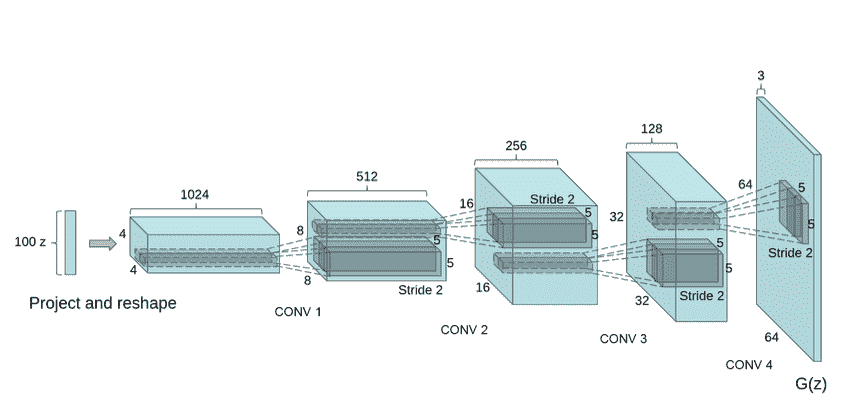
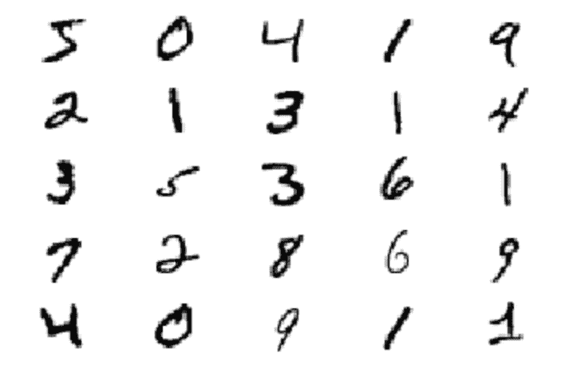
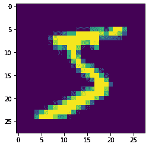
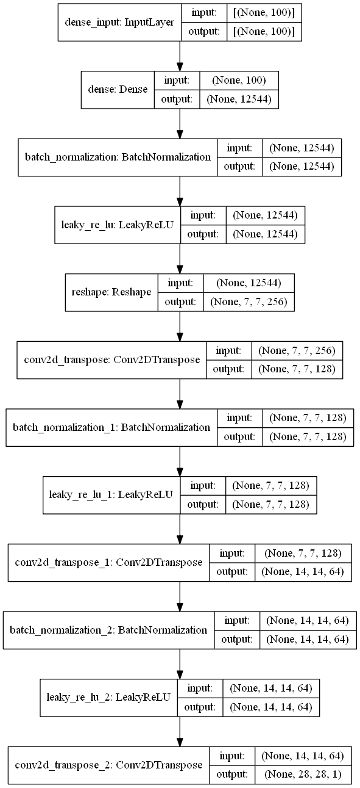
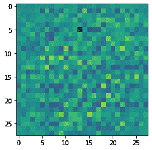
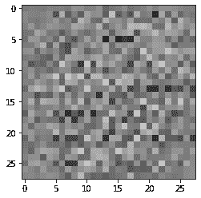
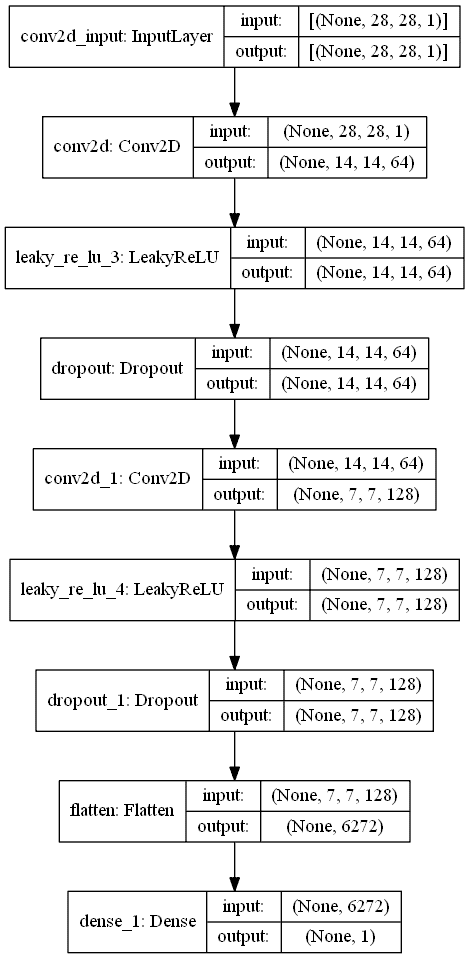
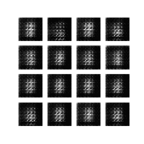

# DCGANs 入门

> 原文：<https://blog.paperspace.com/getting-started-with-dcgans/>

*生成对抗网络(GANS)* 的发展是一项革命性的成就。虽然在深度学习领域已经有了许多突破性的进展，但是以前的生成方法产生的结果都不令人满意。GANs 成为第一个在大多数测试数据集上获得令人信服的高质量结果的方法。自 2014 年以来，GANs 一直是神经网络和深度学习研究中最受欢迎的方面之一。在我的上一篇文章“生成性对抗网络(GANs)完全指南”中，你可以通过下面的[链接](https://blog.paperspace.com/complete-guide-to-gans/)获得，我们涵盖了基本理解 GANs 所需的大部分基本概念。这些主题包括生成和判别模型、生成模型的类型、对它们的训练过程的深入理解以及它们在现代世界中的应用。

随着这些生成性对抗网络的流行，我们有许多 GAN 的变体，包括 DCGANs、SRGAN、Pix2Pix、Cycle GAN、ProGAN 等等。虽然我们将在未来的文章中查看其他 GAN 原型，但本节的重点将是*深度卷积生成对抗网络(DC GAN)*。在本文中，我们将向 DCGANs 介绍我们自己，并稍微深入一些他们复杂的方面。然后，我们将使用这些用于数字生成的 DCGANs 从头开始构建一个项目。下面提供的目录将引导您阅读本文的各个部分。虽然建议进一步详细检查每个方面，但是您可以随意跳到最吸引您的部分。

## 简介:

虽然 GANs 的受欢迎程度现在达到了顶峰，取得了巨大的成功，但情况和对这一概念的喜爱并不总是像人们现在所期望的那样特别。GANs 的可取之处在于缺乏启发式成本函数(一个很好的例子是像素独立均方损失),以及它是生成模型的较好方法之一。然而，缺乏计算要求，创新的想法，以及一个值得注意的事实，即 GANs 产生的结果大多没有意义。由于这些原因，卷积神经网络(CNN)主要用于构建与监督学习相关的任务，如分类问题，因为这些复杂问题可以在 CNN 的帮助下轻松实现和解决。

在现代，CNN 不局限于监督分类问题。随着 DCGANs 的引入，我们注意到 CNN 在许多任务中产生高质量结果的潜力越来越大。有了 DCGANs，无监督任务和生成模型的成功完成成为可能。对于 DCGANs 架构，我们将参考流行的“深度卷积生成对抗网络的无监督表示学习”[研究论文](https://arxiv.org/abs/1511.06434)，该论文广泛涵盖了这一主题。DCGANs 架构的主要目标是为一组约束的评估设置初始参数，以在大多数设置和技术场景中始终获得稳定的测试结果。一旦构建了初级模型，鉴别器的目的是在图像分类任务中表现出与其他流行的无监督学习算法相当的高度竞争性的性能。

一旦鉴别器被完全训练，我们就可以利用这个模型来将从生成器生成的图像分类为真的或假的。生成器模型的目标是生成如此逼真的图像，以至于可以绕过来自鉴别器的分类测试过程。在 DCGANs 原型中开发的生成器模型具有有趣的向量算术属性，这允许对生成的样本的许多语义质量进行操作。有了对 DCGANs 及其所有初始特性的基本介绍，让我们在本文的下一节看看它们的架构。

* * *

## 深入探究 DCGANs 的建筑:



如前所述，卷积神经网络在与分类或其他类似问题相关的监督任务上更为成功。随着 DCGANs [研究论文](https://arxiv.org/abs/1511.06434)的推出，这种思维方式发生了变化，因为开发的架构在大规模数据上产生了非常令人满意的结果，使其甚至能够处理更高分辨率的图像。由于这种在许多重要数据集上成功实施的方法，理解核心概念变得至关重要，这些核心概念用于使 CNN 参与 GANs，使其表现出色。

实现的几个概念性想法包括使用卷积网络，跨越取代最大池结构。这种结构允许生成器模型在通过 Conv2D 转置的上采样的帮助下学习它自己的空间维度，同时使用跨距操作来允许网络也学习它各自的下采样。DCGAN 的第一层采用标记为$Z$的均匀分布值。输入层可能是唯一使用密集层的层。除了这个例外，其他层都不使用完全连接层或最大池层。

从上面的图像表示中，我们可以了解到，对于 LSUN 数据集，有一个 100 维的均匀分布的噪声，标记为$Z$。这种维度被投影到包含具有许多特征图的卷积表示的更小的空间扩展上。上图中描述的体系结构后面是一系列分数步长卷积的四个块，这有助于前面讨论的模型的空间维度学习。在开始时初始化的随机噪声将最终在通过分数步长卷积的连续上采样的帮助下学习显著的特征。

模型设计中涉及的其他关键方面包括批量标准化层的使用。这些批处理规范化层广泛用于生成器和鉴别器模型，以获得模型的稳定性。研究表明，通过应用批处理规范化过程，由于输入的初始化而出现的大多数训练问题都可以得到解决。通过将每个单元的输入归一化为零均值和单位方差，它还有助于更好地实现层中的梯度流。最后，在生成器模型中，除了包含 tanh 激活函数的输出层之外，所有层后面都是 ReLU 激活函数。鉴别器模型中的所有层将包含泄漏 ReLU 激活函数，因为它们被示出产生最佳结果。

* * *

## 使用 DCGANs 生成号码:

为了从头理解 DCG an 的工作原理，我们将在 MNIST 数据集的帮助下用 DCG an 构建一个数字生成项目。MNIST 数据代表修改后的国家标准与技术研究所数据库，这是最受欢迎的数据集之一，包括训练数据集上的 60，000 个大规模可用示例，以及由 10，000 个示例组成的测试集。对于任何有兴趣测试任何类型网络的人来说，这通常是一个很好的起点。我们将使用 DCGANs 的生成器和鉴别器模型从这个数据集中学习。一旦训练完成，我们将使用生成器模型来生成一些高质量的结果。

为了完成这个项目，我们将利用 TensorFlow 和 Keras 深度学习框架。如果你没有这两个库的完整知识，或者想快速更新你的基础知识，我建议你查看 TensorFlow 的以下[链接](https://blog.paperspace.com/absolute-guide-to-tensorflow/)和 Keras 的这个特定的[链接](https://blog.paperspace.com/the-absolute-guide-to-keras/)。确保你有足够的知识继续前进。我们项目的第一步是导入所有必要的库。我们将使用 matplotlib 来可视化我们的数据，使用 numpy 库来访问数组形式的图像，使用 TensorFlow 和 Keras 深度学习框架来构建 DCGANs 架构，并使用其他库来处理它们的特定用例。

最重要的导入是 MNIST 数据集，它预先构建在核心 TensorFlow 和 Keras 库中，可供我们使用。我们将直接从框架中访问这个数据集，而不是执行外部安装。下面提供了所有必需导入的代码。

### 导入所需的库:

```
import matplotlib.pyplot as plt
import tensorflow as tf
import numpy as np
import PIL 
import glob
from tensorflow.keras.datasets.mnist import load_data 
from tensorflow.keras.layers import Conv2D, Dense, Flatten, MaxPooling2D, BatchNormalization, Dropout, LeakyReLU
from tensorflow.keras.layers import Conv2DTranspose, Reshape
from tensorflow.keras.models import Sequential, Model
from tensorflow.keras.optimizers import Adam
import time
import imageio
from IPython import display
import os
```

### 加载数据:

现在我们已经导入了数字生成项目所需的所有库，让我们加载数据。由于 MNIST 数据集被分为图像以及分别用于训练和测试数据的相应标签，因此我们可以使用下面的代码块来相应地加载适当的数据。由于 MNIST 数据集是从 Keras 库中直接导入的，因此可以相对轻松地执行此操作。

```
(train_images, train_labels),(test_images, test_labels) = load_data()
```

### 可视化我们的数据:

我们将执行的下一步是数据集的可视化。我们将借助 matplotlib 库可视化数据的前 25 个元素。我们将绘制这些元素，并确保它们映射到二进制元素组合。二进制映射意味着这些图像被视为灰度图像。MNIST 数据集中提供的每幅影像都有$28 × 28 × 1$浮点数组的参数，用于表示灰度强度值，范围从$0$(黑色)到$1$(白色)。尺寸为 28 × 28 美元的宽度和高度，灰度图像的通道长度为 1 美元。下面的代码相应地绘制了适当的数据。

```
for i in range(25):
    plt.subplot(5, 5, 1 + i)
    plt.axis("off")
    plt.imshow(train_images[i], cmap=plt.cm.binary)

plt.show()
```



Screenshot By Author

如果您想在不使用任何 cmap 函数的情况下可视化单个图像，您可以使用下面的代码行来实现。

```
plt.imshow(train_images[0])
```



Screenshot By Author

### 设置参数:

我们的下一步将是相应地规范化数据集，并为数字生成的特定任务设置一些初始参数。首先，我们将重塑我们的训练图像，使其适合通过 DCGANs 架构中的卷积神经网络。我们将把所有的数据转换成浮点型变量，并使数据正常化。规范化过程确保数据集中提供的所有数据都在 0 美元到 1 美元的范围内，而不是 0 美元到 255 美元的范围内。这样做将确保任务的计算稍微更快和更有效。我们还将相应地设置缓冲区大小和批处理大小。缓冲区大小将被设置为 60000 美元，这相当于训练示例的数量。可以根据硬件的便利性和限制来设置批量大小。我们将使用张量切片根据预先设置的参数来混洗训练数据集。

```
# Normalize The Training images accordingly

train_images = train_images.reshape(train_images.shape[0], 28, 28, 1).astype('float32')
train_images = (train_images - 127.5) / 127.5  

BUFFER_SIZE = 60000
BATCH_SIZE = 256

# Batch and shuffle the data
train_dataset = tf.data.Dataset.from_tensor_slices(train_images).shuffle(BUFFER_SIZE).batch(BATCH_SIZE)
```

在从头开始执行数字生成项目所需的所有初始步骤之后，包括导入基本库、加载适当的数据、可视化数据和设置初始参数，我们可以继续本文的下一步。在下一节中，我们将探讨如何为研究论文中描述的以下项目构建生成器和鉴别器模型。

* * *

## 构建发生器和鉴别器模型:

为了构建生成器和鉴别器模型，我们将利用之前讨论的 TensorFlow 和 Keras 深度学习框架。我们还将利用官方的 TensorFlow 生成模型部分作为构建我们两个架构的[参考](https://www.tensorflow.org/tutorials/generative/dcgan)。DCGANs 体系结构的大部分核心设计流程与前面讨论的 DCGANs 体系结构相同。我们将相应地讨论一些细微的显著变化。让我们开始构建生成器和鉴别器模型。

### 发电机:

我们现在将使用顺序模型风格构建生成器架构。我们将定义初始模型，输入形状为 100，用于接收传入的随机噪声种子，它将通过具有跨层的卷积上采样的进一步层。正如在 DCGANs 架构中所讨论的，发生器模型主要由具有步长的卷积上采样层组成。该体系结构中没有使用最大池层。

每一层后面都有一个批处理归一化层，以实现稳定性和更快的梯度初始化。然而，稍微值得注意的变化是在 ReLU 激活函数上使用了泄漏的 ReLU 层，正如研究论文中提到的。您可以相应地研究这些因素，看看哪种方法产生的结果最好。无论如何，这两种方法的差别不应该太大。最后一层使用 tanh 激活，如研究论文中所述。生成器的目标是对其空间维度进行上采样，直到达到所需的图像大小 28 x 28 x 1 美元。

```
def The_Generator():
    model = Sequential()

    model.add(Dense(7*7*256, use_bias=False, input_shape=(100,)))
    model.add(BatchNormalization())
    model.add(LeakyReLU())

    model.add(Reshape((7, 7, 256)))
    assert model.output_shape == (None, 7, 7, 256) # Note: None is the batch size

    model.add(Conv2DTranspose(128, (5, 5), strides=(1, 1), padding='same', use_bias=False))
    assert model.output_shape == (None, 7, 7, 128)  
    model.add(BatchNormalization())
    model.add(LeakyReLU())

    model.add(Conv2DTranspose(64, (5, 5), strides=(2, 2), padding='same', use_bias=False))
    assert model.output_shape == (None, 14, 14, 64)    
    model.add(BatchNormalization())
    model.add(LeakyReLU())

    model.add(Conv2DTranspose(1, (5, 5), strides=(2, 2), padding='same', use_bias=False, activation='tanh'))
    assert model.output_shape == (None, 28, 28, 1)

    return model

generator = The_Generator()
```

我们将发电机模型存储在*“发电机”*变量中。让我们研究一下这个生成器模型产生的模型概要和模型图。这样做将有助于我们从概念上理解所构建的模型架构的类型，并对其进行进一步的分析。

**型号汇总:**

```
Model: "sequential"
_________________________________________________________________
Layer (type)                 Output Shape              Param #   
=================================================================
dense (Dense)                (None, 12544)             1254400   
_________________________________________________________________
batch_normalization (BatchNo (None, 12544)             50176     
_________________________________________________________________
leaky_re_lu (LeakyReLU)      (None, 12544)             0         
_________________________________________________________________
reshape (Reshape)            (None, 7, 7, 256)         0         
_________________________________________________________________
conv2d_transpose (Conv2DTran (None, 7, 7, 128)         819200    
_________________________________________________________________
batch_normalization_1 (Batch (None, 7, 7, 128)         512       
_________________________________________________________________
leaky_re_lu_1 (LeakyReLU)    (None, 7, 7, 128)         0         
_________________________________________________________________
conv2d_transpose_1 (Conv2DTr (None, 14, 14, 64)        204800    
_________________________________________________________________
batch_normalization_2 (Batch (None, 14, 14, 64)        256       
_________________________________________________________________
leaky_re_lu_2 (LeakyReLU)    (None, 14, 14, 64)        0         
_________________________________________________________________
conv2d_transpose_2 (Conv2DTr (None, 28, 28, 1)         1600      
=================================================================
Total params: 2,330,944
Trainable params: 2,305,472
Non-trainable params: 25,472
_________________________________________________________________ 
```

**模型图:**



**发电机图像的随机可视化:**

既然我们已经建立了模型并分析了图和摘要，让我们也想象一下未经训练的发生器在随机噪声分布的情况下会产生什么样的输出。我们将使随机噪声通过发生器，并获得一个结果，即来自发生器的生成图像。

```
# Visualizing the random image generated by the generator

noise = tf.random.normal([1, 100])
generated_image = generator(noise, training=False)

plt.imshow(generated_image[0, :, :, 0])
```



上图是正常情况下产生的彩色图像类型输出的代表。然而，我们知道我们的 MNIST 数据由灰度图像组成。因此，让我们尝试使用为灰度图像设置的参数来可视化生成的输出。

```
plt.imshow(generated_image[0, :, :, 0], cmap='gray')
```



### 鉴别器:

现在我们已经对发生器的工作过程和它们产生的输出类型有了一个简单的概念，我们也可以继续为 DCGANs 架构构建鉴别器模型。我们将为鉴别器使用顺序模型架构类型，这与生成器非常相似。我们将使用卷积层，然后是研究论文中描述的泄漏 ReLU 激活函数。但是，我们还添加了一个额外的层，以防止过拟合，并通过使用 dropout 获得更好的分类结果。最后，我们将展平架构，并使用包含一个节点的最终密集层来进行适当的预测。鉴别器的预测对真实图像输出正值，对伪图像输出负值。

```
def The_Discriminator():
    model = Sequential()

    model.add(Conv2D(64, (5, 5), strides=(2, 2), padding='same', input_shape=[28, 28, 1]))
    model.add(LeakyReLU())
    model.add(Dropout(0.3))

    model.add(Conv2D(128, (5, 5), strides=(2, 2), padding='same'))
    model.add(LeakyReLU())
    model.add(Dropout(0.3))

    model.add(Flatten())
    model.add(Dense(1))

    return model

discriminator = The_Discriminator()
```

让我们探索鉴别器的模型概要和模型图，以帮助我们理解架构在视觉上看起来是怎样的。

**型号汇总:**

```
Model: "sequential_1"
_________________________________________________________________
Layer (type)                 Output Shape              Param #   
=================================================================
conv2d (Conv2D)              (None, 14, 14, 64)        1664      
_________________________________________________________________
leaky_re_lu_3 (LeakyReLU)    (None, 14, 14, 64)        0         
_________________________________________________________________
dropout (Dropout)            (None, 14, 14, 64)        0         
_________________________________________________________________
conv2d_1 (Conv2D)            (None, 7, 7, 128)         204928    
_________________________________________________________________
leaky_re_lu_4 (LeakyReLU)    (None, 7, 7, 128)         0         
_________________________________________________________________
dropout_1 (Dropout)          (None, 7, 7, 128)         0         
_________________________________________________________________
flatten (Flatten)            (None, 6272)              0         
_________________________________________________________________
dense_1 (Dense)              (None, 1)                 6273      
=================================================================
Total params: 212,865
Trainable params: 212,865
Non-trainable params: 0
_________________________________________________________________ 
```

**模型图:**



**做决定:**

鉴别器的目的是分类图像输出产生的是真图像还是假图像。让我们看看鉴别器的单个决定提供给我们的输出类型。注意，模型被训练成正值意味着图像是真实的，而负值意味着图像是假的。

```
decision = discriminator(generated_image)
print(decision)
```

**输出:**

```
tf.Tensor([[0.0015949]], shape=(1, 1), dtype=float32) 
```

现在我们已经构建了生成器和鉴别器架构模型，我们可以一起构建整个 DCGANs 模型，并相应地训练参数以获得最佳结果。

* * *

## 构建 DCGANs 模型:

在完成所有初始预处理步骤以及分别构建生成器和鉴别器模型之后，我们可以继续构建整个 DCGANs 模型，并对其进行相应的训练，以获得可能的最佳结果。文章的这一部分分为四个关键步骤，以实现模型的完美运行。我们将首先定义我们将用于模型编译的损失和优化器。之后，我们将创建一个检查点，以便在需要时可以重用模型。然后，我们将定义所有必要的参数，并设置@tf 函数，该函数将自动编译模型。最后，我们将训练模型，并通过 DCGANs 模型对生成的图像进行可视化。让我们从定义损失参数和优化器开始。

### **定义损失和优化器:**

构建 DCGANs 模型的下一个重要步骤是定义损失函数和初始化优化器。我们将定义我们的损失函数，它将以二进制交叉熵的形式接受输出参数。我们将把 logits 属性设置为 true。logit 属性通知损失函数由模型生成的输出值未被归一化。这样做是有帮助的，因为我们知道鉴别器的工作是对输出进行分类。因此，负值代表伪图像，正值代表真实图像。在定义了鉴别器和发电机损耗之后，我们还将为它们定义优化器。我们将为这两个模型使用 Adam 优化器。让我们探索代码块，然后尝试进一步直观地理解它们做什么。

```
cross_entropy = tf.keras.losses.BinaryCrossentropy(from_logits=True)

def discriminator_loss(real_output, fake_output):
    real_loss = cross_entropy(tf.ones_like(real_output), real_output)
    fake_loss = cross_entropy(tf.zeros_like(fake_output), fake_output)
    total_loss = real_loss + fake_loss
    return total_loss

def generator_loss(fake_output):
    return cross_entropy(tf.ones_like(fake_output), fake_output)

generator_optimizer = tf.keras.optimizers.Adam(1e-4)
discriminator_optimizer = tf.keras.optimizers.Adam(1e-4)
```

在上面的代码块中，真实输出指的是来自原始数据集的所有真实标签，而虚假输出指的是来自生成器模型输出的所有生成标签。以下代码块产生的总损耗将导致以下等式:

$$总损失= -log(真实输出)- log(1 -假输出)$ $

用于鉴别器的上述等式试图最小化损失函数以获得更好的结果。

### 定义检查点:

对于一个普通的 GPU，GANs 需要花费相当多的时间来训练。我们将定义检查点，以便如果我们希望在一组特定的时期后再次重新训练模型，我们可以恢复检查点以继续我们的训练。

```
checkpoint_dir = './training_checkpoints'
checkpoint_prefix = os.path.join(checkpoint_dir, "ckpt")
checkpoint = tf.train.Checkpoint(generator_optimizer=generator_optimizer,
                                 discriminator_optimizer=discriminator_optimizer,
                                 generator=generator,
                                 discriminator=discriminator)
```

### 设置基本参数并定义@tf.function:

下一步，我们将定义一些基本参数。我们将重用我们定义的种子，这样我们就可以更容易地看到生成的动画 GIF 随着时间推移的整体进度。我将运行该模型总共 100 个时期。您可以根据您的需求和系统限制选择做更多或更少的工作。

```
EPOCHS = 100
noise_dim = 100
num_examples_to_generate = 16

seed = tf.random.normal([num_examples_to_generate, noise_dim])
```

我们的下一步是定义导致模型被编译的@tf.function。我们将利用 TensorFlow 中可用的 GradientTape()函数手动开始训练生成器和鉴别器模型。生成器的任务是生成好到可以绕过鉴别器的图像。鉴别器的任务是据此区分图像的真假。一旦生成器生成顶级的结果来绕过鉴别器的分类系统，我们就构建了一个高质量的 DCGANs 模型来成功完成特定的任务。

```
@tf.function
def train_step(images):
    noise = tf.random.normal([BATCH_SIZE, noise_dim])

    with tf.GradientTape() as gen_tape, tf.GradientTape() as disc_tape:
        generated_images = generator(noise, training=True)

        real_output = discriminator(images, training=True)
        fake_output = discriminator(generated_images, training=True)

        gen_loss = generator_loss(fake_output)
        disc_loss = discriminator_loss(real_output, fake_output)

    gradients_of_generator = gen_tape.gradient(gen_loss, generator.trainable_variables)
    gradients_of_discriminator = disc_tape.gradient(disc_loss, discriminator.trainable_variables)

    generator_optimizer.apply_gradients(zip(gradients_of_generator, generator.trainable_variables))
    discriminator_optimizer.apply_gradients(zip(gradients_of_discriminator, discriminator.trainable_variables))
```

### 训练和生成图像:

随着所有其他步骤的完成，我们终于可以开始培训过程了。我们现在将定义训练函数，该函数将利用我们之前为模型定义的所有函数。我们还将打印运行每个单独时期所花费的时间，以及从开始生成的图像类型。这样做将有助于我们直观地看到模型的学习曲线，并更好地理解训练过程。

```
def train(dataset, epochs):
    for epoch in range(epochs):
        start = time.time()

        for image_batch in dataset:
            train_step(image_batch)

        # Produce the images for the GIF with each step
        display.clear_output(wait=True)
        generate_and_save_images(generator,
                                 epoch + 1,
                                 seed)

        # Save the model every 15 epochs
        if (epoch + 1) % 15 == 0:
            checkpoint.save(file_prefix = checkpoint_prefix)

        print ('Time for epoch {} is {} sec'.format(epoch + 1, time.time()-start))

    # Generate after the final epoch
    display.clear_output(wait=True)
    generate_and_save_images(generator,
                           epochs,
                           seed)
```

您可以使用我们的 TensorFlow [参考文献](https://www.tensorflow.org/tutorials/generative/dcgan)中的以下代码块来生成和保存每个历元中生成的图像。

```
def generate_and_save_images(model, epoch, test_input):
    # Notice `training` is set to False.
    # This is so all layers run in inference mode (batchnorm).
    predictions = model(test_input, training=False)

    fig = plt.figure(figsize=(4, 4))

    for i in range(predictions.shape[0]):
        plt.subplot(4, 4, i+1)
        plt.imshow(predictions[i, :, :, 0] * 127.5 + 127.5, cmap='gray')
        plt.axis('off')

    plt.savefig('image_at_epoch_{:04d}.png'.format(epoch))
    plt.show()
```

现在我们已经完成了所有的主要步骤，让我们调用将开始训练模型的函数。一旦培训完成，我们就可以开始可视化产生的输出。

```
train(train_dataset, EPOCHS)
```



上面的图像表示是经过 100 个历元训练后的截图。这个项目的整个笔记本附在文章后面。请随意相应地探索它。

* * *

## 结论:


Photo by [Dan Farrell](https://unsplash.com/@farreal?utm_source=ghost&utm_medium=referral&utm_campaign=api-credit) / [Unsplash](https://unsplash.com/?utm_source=ghost&utm_medium=referral&utm_campaign=api-credit)

生成性敌对网络生成虚假视觉、图像、文本或其他带有随机噪声的实体的能力是互补的。GANs 的一个变体是*深度卷积生成对抗网络(DCGANs)* ，它在测试的一些数据集上产生了奇妙的结果。根据我们之前对这篇[文章](https://blog.paperspace.com/complete-guide-to-gans/)中的 gan 的了解，以及我们对这篇文章中的 DCGANs 的理解，我们可以用深度学习框架构建许多精彩的项目，如 TensorFlow、Keras 和 PyTorch。

在本文中，我们简要了解了 DCGANs 的工作过程以及“深度卷积生成对抗网络的无监督表示学习”[研究论文](https://arxiv.org/abs/1511.06434)中采用的各种技术。然后，我们在 MNIST 数据集的帮助下进行数字生成项目。使用这个数据集，我们预处理了初始数据，并构建了适当的生成器和鉴别器模型来训练它们。在用 DCGANs 架构训练数据之后，我们能够在仅仅 50 个时期的训练之后产生相当不错的结果。随着进一步的训练和模型改进，有可能在数据集上取得更好的结果。

在生成对抗网络的后续部分中，我们将扩展 DCGANs 的应用，并研究如何用图像构建一个人脸生成项目，以生成不存在的人的真实人脸图像。我们还将在以后的文章中研究更多的 GAN 变体、项目和主题。在那之前，继续编码和探索吧！