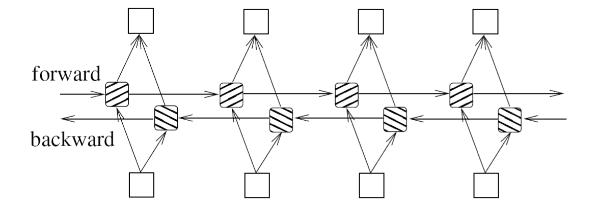
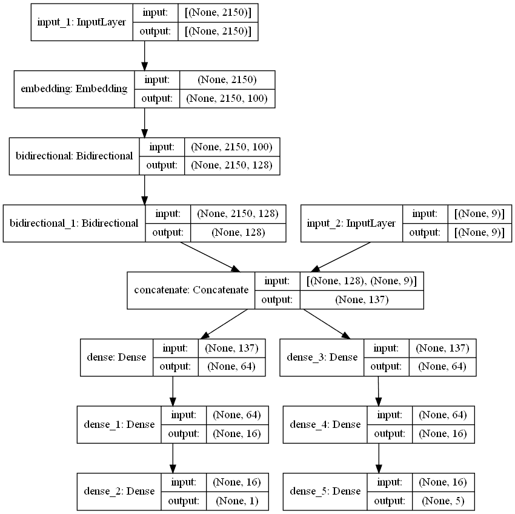

# 使用 Keras Functional API 组合多种功能和多种输出

> 原文：<https://blog.paperspace.com/combining-multiple-features-outputs-keras/>

我们都写了自己的第一个深度学习代码，用于回归、分类等。使用公共数据集，如 [CIFAR-10](https://www.cs.toronto.edu/~kriz/cifar.html) 、 [MNIST](http://yann.lecun.com/exdb/mnist/) 或[皮马印第安人糖尿病](https://www.kaggle.com/uciml/pima-indians-diabetes-database)。

我们可以注意到的一个共同点是，给定项目中每个特性的数据类型都是相同的。我们要么将图像分类，要么将数值输入回归模型。

你有没有想过我们如何组合各种类型的数据，如文本、图像和数字，以获得不止一个输出，而是多个输出，如分类和回归？

现实生活中的问题在形式上不是连续的或同质的。在实践中，您可能需要将多个输入和输出合并到您的深度学习模型中。

本文深入构建一个深度学习模型，该模型接受文本和数字输入，并返回回归和分类输出。

## **概述**

*   数据清理
*   文本预处理
*   神奇的模型
*   结论

## 数据清理

当我们看一个有多个文本和数字输入的问题，并且要生成一个回归和分类输出时，我们应该首先清理我们的数据集。

首先，我们应该避免包含大量 *Null* 或 *NaN* 有值特征的数据。这样的值应该用平均值、中间值等来代替。使得这些记录可以被使用而不会对整体数据产生太大影响。

我们可以将与其他特征相比通常较大的数值转换为较小的值，以确保对神经网络的权重没有影响。为了抵消这种影响，可以使用标准化或最小-最大缩放等技术将数据转换为更小范围的值，同时仍然保持它们之间的关系。

```
from sklearn.preprocessing import MinMaxScaler

data = [[-1010, 20000], [-50000, 6345], [10000, 1000], [19034, 18200]]

# Instantiate the MinMaxScaler object
scaler = MinMaxScaler()

# Fit it to the data
scaler.fit(data)

# Use transform to output the transformed data
print(scaler.transform(data))
```

```
# Output:
[[0.70965032 1\.        ]
 [0\.         0.28131579]
 [0.86913695 0\.        ]
 [1\.         0.90526316]]
```

## 文本预处理

我们可以用两种方式处理多个文本输入

*   为每个文本特征建立专用的 LSTMs(长短期记忆网络),并随后组合来自它的数字输出
*   首先组合文本特征，然后用单个 LSTM 进行训练

在本文中，我们将探讨第二种方法，因为它在处理大量不同长度的文本特征时非常有效。

### 组合文本特征

原始数据集有多个需要连接的文本要素。仅仅把字符串相加是没有效率的。我们必须与模型沟通，在单个字符串中有不同的特征。

我们处理这种情况的方法是，在它们之间加入一个特殊的`<eof>`标签，表示特征结束。这并没有累加任何值，但是，最终，LSTM 会知道这个标签代表了一个特性的结束。最后，所有文本特征将被转换成单个输入。

```
"Feature 1 <EOF> Feature 2 <EOF> ….. <EOF> Feature N"
```

现在我们有一个文本输入和一组数字输入。

### 下部外壳和停止字移除

以下技术在预处理过程中很有用。

小写是将单词转换为小写以提供更好的清晰度的过程。这在预处理过程中以及在我们进行解析的后期阶段是很有帮助的。

停用词去除是去除常用词的过程，以更加关注文本内容的更多特征。我们可以用 **[NLTK](https://www.nltk.org/)** 去掉常规停用词。

```
from nltk.corpus import stopwords
stop_words = set(stopwords.words('english'))

# Example sentence 
text = "there is a stranger out there who seems to be the owner of this mansion"

# Split our sentence at each space using .split()
words = text.split()

text = ""

# For each word, if the word isnt in stop words, then add to our new text variable
for word in words:
    if word not in stop_words:
        text += (word+" ")

print(text)
```

`Output>> stranger seems owner mansion`

### 词干化和词汇化

这些技术用于改进语义分析。

词干意味着从单词中去掉前缀和后缀以简化单词。这种技术用于在领域分析中确定领域词汇表。它有助于减少一个单词的变体，将它们转换成它们的词根形式。

举个例子，*程序*、*程序*、*程序员*都是程序的变种。

下面是一个使用 NLTK 进行词干提取的示例:

```
from nltk.stem import PorterStemmer  
# Instantiate our stemmer as ps
ps = PorterStemmer()

# Example sentence 
sentence = "he is likely to have more likes for the post he posted recently"

# Split our sentence at each space using .split()
words = sentence.split()

sentence = ""

# For each word, get the stem and add to our new sentence variable
for w in words:
    sentence += (ps.stem(w) + " ")
print(sentence)
```

`Output >> he is like to have more like for the post he post recent`

词汇化是将单词的屈折形式分组的过程。词汇化不是将一个单词简化为它的词干，而是决定该单词对应的词典形式。这有助于模型确定单个单词的含义。

```
from nltk.stem import WordNetLemmatizer
lemmatizer = WordNetLemmatizer()

sentence = "It is dangerous to jump to feet on rocky surfaces"
words = sentence.split()
sentence = ""

for word in words:
    sentence+= (lemmatizer.lemmatize(word) + " ")

print(sentence)
```

`Output >> It is dangerous to jump to foot on rocky surface`

### 列车测试拆分

重要的一步是确保我们对数据集进行适当的采样，并在每个时期后获得足够的数据来测试我们的模型。目前，我们有两个输入和输出，每个都有文本和一个数字输入数组。我们将把它们分为训练集和验证集，如下所示。

```
from sklearn.model_selection import train_test_split

y_reg_train, y_reg_val, y_clf_train, y_clf_val, X_text_train, X_text_val, X_num_train, X_num_val = train_test_split(y_reg,y_clf,X_text,X_num,test_size=0.25,random_state=42)
```

### 符号化

在实际进行任何 NLP 建模之前，我们需要向机器输入数值，让它执行所有这些数学运算。例如，应该将字符串“cat”转换为数字或有意义的张量，以便模型进行处理。记号化通过用数字表示每个单词来帮助我们做到这一点。

```
from keras.preprocessing.text import Tokenizer

# instantiate our tokenizer
tokenizer = Tokenizer(num_words = 10)

# Create a sample list of words to tokenize
text = ["python","is","cool","but","C++","is","the","classic"]

# Fit the Tokenizer to the words
tokenizer.fit_on_texts(text)

# Create a word_index to track tokens
word_index = tokenizer.word_index
print(word_index['python'])
```

`Output >> 2`

在我们的解决方案中，我们必须在训练文本特征上安装标记器。这是预处理中的一个关键点，因为如果我们想防止过度拟合，就不应该让模型或标记器知道我们的测试输入。

我们将把它作为字典存储在 word_index 中。我们可以使用 pickle 保存标记化器，以备将来使用，比如只使用模型进行预测。

让我们看看如何在我们的例子中使用 tokenizer。

```
# Tokenize and sequence training data
X_text_train_sequences = tokenizer.texts_to_sequences(X_text_train)

# Use pad_sequences to transforms a list (of length num_samples) of sequences (lists of integers) into a 2D Numpy array of shape (num_samples, num_timesteps)
X_text_train_padded = pad_sequences(X_text_train_sequences,maxlen=max_length,
                    padding=padding_type, truncating=trunction_type)

# Tokenize and sequence validation data                   
X_text_val_sequences = tokenizer.texts_to_sequences(X_text_val)

# pad_sequences for validation set
X_text_val_padded = pad_sequences(X_text_val_sequences,maxlen=max_length,
                    padding=padding_type, truncating=trunction_type)
```

### 带手套的包埋层

嵌入赋予每个单词维度。想象“King”在我们的记号赋予器中存储为 102。这意味着什么吗？我们需要表达一个单词的维度，嵌入层在这方面帮助了我们。

通常最好使用预先训练好的嵌入层，如 [**GloVe**](https://nlp.stanford.edu/projects/glove/) 来充分利用我们的数据。给定单词的 N 个维度，嵌入将 tokenizer 中的一个**单词索引**转换成一个大小为(1，N)的矩阵。

*注:从这里 下载手套 [**。**](https://nlp.stanford.edu/data/glove.6B.zip)*

```
import numpy as np
# Download glove beforehand

# Here we are using the 100 Dimensional embedding of GloVe  
f = open('glove.6B/glove.6B.100d.txt')   
for line in f:       
   values = line.split()       
   word = values[0]       
   coefs = np.asarray(values[1:], dtype='float32') 
   embeddings_index[word] = coefs   
f.close()

# Creating embedding matrix for each word in Our corpus
embedding_matrix = np.zeros((len(word_index) + 1, 100))   
for word, i in word_index.items():   
   embedding_vector = embeddings_index.get(word)   
   if embedding_vector is not None:   
       # words not found in the embedding index will be all-zeros.  
       embedding_matrix[i] = embedding_vector 
```

现在我们有一个嵌入矩阵作为权重输入到我们的嵌入层中。

## 神奇的模型

我们已经完成了所有需要的预处理，现在我们有了输入到模型中的 X 和 Y 值。我们将在这里使用 Keras Functional API 来构建这个特殊的模型。

在我们直接进入代码之前，理解为什么顺序模型是不够的是很重要的。初学者应该熟悉序列模型，因为它们可以帮助我们快速构建线性流动模型。

```
from keras.layers import Dense, Embedding, LSTM
from keras.models import Model
from keras.models import Sequential

# Instantiate a sequential NN
model = Sequential([       
  Embedding(len(word_index) + 1,
            100,
            weights=[matrix_embedding],
            input_length=max_length,
            trainable=False)
  LSTM(embedding_dim,),
  Dense(100, activation='relu'),
  Dense(5, activation='sigmoid')
])
```

在顺序模型中，我们无法控制输入、输出或流程。顺序模型不能共享层或层的分支，也不能有多个输入或输出。如果我们想要处理多个输入和输出，那么我们必须使用 Keras functional API。

### Keras 功能 API

Keras functional API 允许我们精细地构建每一层，部分或全部输入直接连接到输出层，并且能够将任何层连接到任何其他层。像连接值、共享层、分支层以及提供多个输入和输出这样的特性是选择函数式 api 而不是顺序式 API 的最有力的理由。

这里，我们有一个文本输入和一个由九个数字特征组成的数组作为模型的输入，还有两个输出，如前几节所述。 **max_length** 是我们可以设置的文本输入的最大长度。**嵌入矩阵**是我们之前得到的嵌入层的权重。

### 双向 LSTMs

递归神经网络(RNN)是具有内部记忆的前馈神经网络。因为它对每个数据输入执行相同的功能，所以 RNN 本质上是递归的，而当前输入的输出依赖于过去的输入。

双向 LSTM 是一种 RNN，对于长序列具有更好的结果和更好的记忆，保留了时间序列的上下文。双向 lstm 训练输入序列上的两个 lstm，而不是一个 lstm，在如下所示的问题中，通过从两个方向遍历，输入序列的所有时间步长都是可用的。



This is an oversimplified explanation, so I encourage you to [**read more**](https://arxiv.org/pdf/1508.01991) on this for better clarity. I hope this helps you build a small idea about LSTMs. **Source: [Bidirectional LSTM-CRF Models for Sequence Tagging](https://arxiv.org/pdf/1508.01991.pdf)**

这是我们解决问题的模型架构。

```
from keras.layers import Dense, Embedding, LSTM, Bidirectional, Input
from keras.models import Model

def make_model(max_length,embedding_matrix):

    # Defining the embedding layer
    embedding_dim = 64 
    input1=Input(shape=(max_length,))

    embedding_layer = Embedding(len(word_index) + 1,
                                100,
                                weights=[embedding_matrix],
                                input_length=max_length,
                                trainable=False)(input1)

    # Building LSTM for text features                          
    bi_lstm_1 = Bidirectional(LSTM(embedding_dim,return_sequences=True))(embedding_layer)

    bi_lstm_2 = Bidirectional(LSTM(embedding_dim))(bi_lstm_1)   
    lstm_output =  Model(inputs = input1,outputs = bi_lstm_2)

    #Inputting Number features
    input2=Input(shape=(9,))  

    # Merging inputs
    merge = concatenate([lstm_output.output,input2])

    # Building dense layers for regression with number features
    reg_dense1 = Dense(64, activation='relu')(merge)
    reg_dense2 = Dense(16, activation='relu')(reg_dense1) 
    output1 = Dense(1, activation='sigmoid')(reg_dense2)

    # Building dense layers for classification with number features
    clf_dense1 = Dense(64, activation='relu')(merge)
    clf_dense2 = Dense(16, activation='relu')(clf_dense1)

    # 5 Categories in classification
    output2 = Dense(5, activation='softmax')(clf_dense2)

    model = Model(inputs=[lstm_output.input,input2], outputs=[output1,output2])

    return model
```

### 模型摘要

```
 Layer (type)                    Output Shape         Param #  
   Connected to
==============================================================================
input_1 (InputLayer)            [(None, 2150)]       0        

______________________________________________________________________________
embedding (Embedding)           (None, 2150, 100)    1368500  
   input_1[0][0]
______________________________________________________________________________
bidirectional (Bidirectional)   (None, 2150, 128)    84480    
   embedding[0][0]
______________________________________________________________________________
bidirectional_1 (Bidirectional) (None, 128)          98816    
   bidirectional[0][0]
______________________________________________________________________________
input_2 (InputLayer)            [(None, 9)]          0        

______________________________________________________________________________
concatenate (Concatenate)       (None, 137)          0        
   bidirectional_1[0][0]

   input_2[0][0]
______________________________________________________________________________
dense (Dense)                   (None, 64)           8832     
   concatenate[0][0]
______________________________________________________________________________
dense_3 (Dense)                 (None, 64)           8832     
   concatenate[0][0]
______________________________________________________________________________
dense_1 (Dense)                 (None, 16)           1040     
   dense[0][0]
______________________________________________________________________________
dense_4 (Dense)                 (None, 16)           1040     
   dense_3[0][0]
______________________________________________________________________________
dense_2 (Dense)                 (None, 1)            17       
   dense_1[0][0]
______________________________________________________________________________
dense_5 (Dense)                 (None, 5)            85          dense_4[0][0]
==============================================================================
Total params: 1,571,642
Trainable params: 203,142
Non-trainable params: 1,368,500
```

考虑到我们有多个输入和输出，模型摘要可能看起来有点吓人。让我们将模型可视化，以获得更全面的了解。

### 模型可视化



Visualization of Model Architecture

现在，我们剩下要做的就是编译和拟合模型。让我们看看它与正常情况有什么不同。我们可以为模型的输入和输出值输入数组。

```
import keras
from keras.optimizers import Adam

model = make_model(max_length,embedding_matrix)

# Defining losses for each output
losses ={ 'dense_2':keras.losses.MeanSquaredError(),
    'dense_5':keras.losses.CategoricalCrossentropy()}

opt = Adam(lr=0.01)

# Model Compiling
model.compile(optimizer=opt, loss=losses,metrics="accuracy")

# Model Fitting
H = model.fit(x=[X_text_train_padded, X_num_train],
y={'dense_2': y_reg_train, 'dense_5': y_clf_train},
	validation_data=([X_text_val_padded, X_num_val],
    	{'dense_2': y_reg_val, 'dense_5': y_clf_val}), epochs=10,verbose=1)
```

这就是全部了！

## 结论

Keras Functional API 帮助我们构建这样健壮而强大的模型，因此可能性是巨大而令人兴奋的。更好地控制输入、输出、层和流有助于人们以高精度和灵活性设计模型。我鼓励大家尝试不同的层、参数和一切可能的东西，以便使用超调充分利用这些特性。

祝你自己的实验好运，感谢你的阅读！