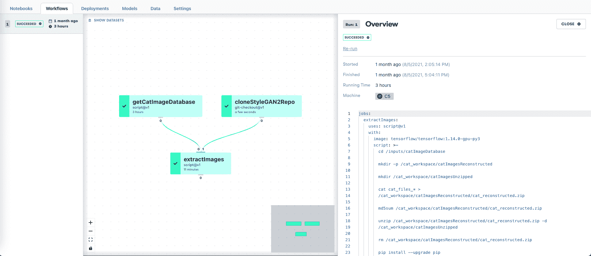
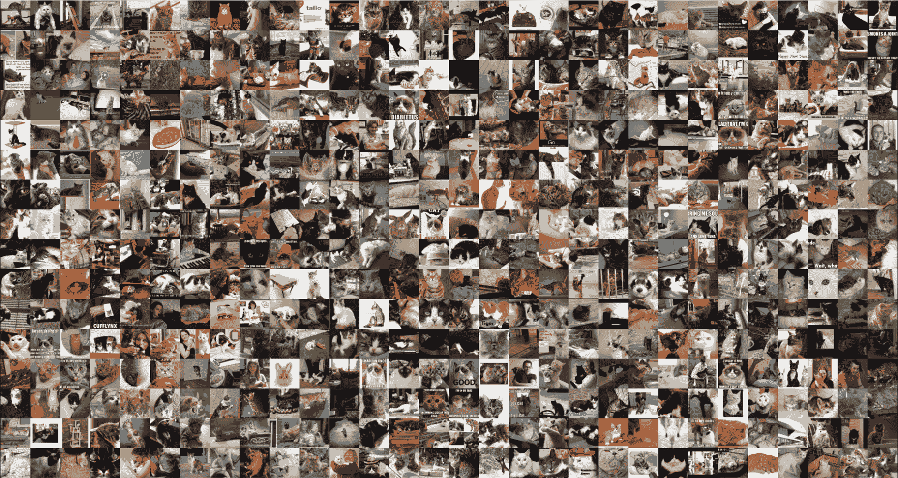
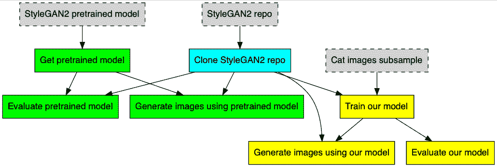
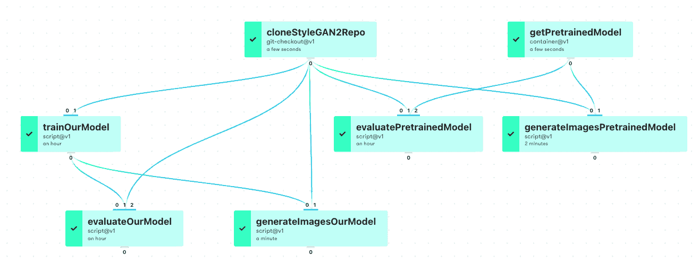
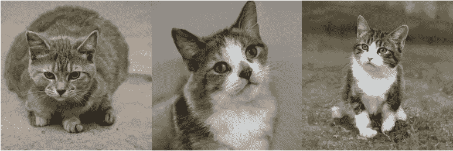
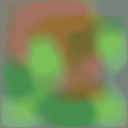

# 采用渐变工作流的端到端数据科学:StyleGAN2

> 原文：<https://blog.paperspace.com/end-to-end-data-science-with-gradient-workflows-stylegan2/>

生产中的数据科学需要许多部分协同工作，以实现真正的端到端功能。这包括数据准备、模型训练和部署，既要有一个严谨的框架来构建和版本化一个项目及其组件，又要有在大规模数据集上完成这些工作的能力。

在这个项目中，我们展示了:

*   使用 42gb 图像文件和梯度管理数据集进行数据准备
*   使用梯度公共数据集作为数据源
*   在图像样本上使用 StyleGAN2 深度学习的模型训练
*   使用适当的度量标准进行模型评估
*   生成新图像的模型推理
*   版本化渐变对象，包括数据集和模型
*   资源控制，为不同的作业指定不同大小的机器
*   通过更改链接的 GitHub 存储库触发工作流重新运行

全部在[渐变工作流程](https://docs.paperspace.com/gradient/explore-train-deploy/workflows)提供的结构内。

附带的[教程](https://docs.paperspace.com/gradient/get-started/tutorials-list/workflows-sample-project-stylegan2)和 [GitHub 库](https://github.com/gradient-ai/StyleGAN2-with-Workflows)允许你全面运行端到端项目，或者只运行第二部分来查看模型训练。

### StyleGAN2

我们的 StyleGAN2 演示基于流行的 [Nvidia StyleGAN2 库](https://github.com/NVlabs/stylegan2)。我们使用它的图像生成功能，利用来自 [LSUN](https://www.yf.io/p/lsun) 在线数据库的训练数据生成猫的图片。

StyleGAN2 是使用[生成对抗网络](https://en.wikipedia.org/wiki/Generative_adversarial_network) (GANs)生成图像的 [StyleGAN](https://en.wikipedia.org/wiki/StyleGAN) 方法的实现。这些方法通过让两个网络竞争来实现，一个用来区分不同类别的图像，另一个试图欺骗第一个错误分类。这样，两个网络的性能被迭代地提高。

这样做的结果是，经过训练的网络能够生成以前没有见过的新图像，但是与训练集相似。因此，网上出现了大量不存在的人的照片、假视频等等。在我们的例子中，这意味着我们训练过的网络可以生成猫的新图片。

### 数据准备

典型的真实机器学习项目，尤其是深度学习，可能涉及到在训练或生产过程中使用大量图像，从而使用大量数据。因此，我们证明了梯度工作流能够以稳健的方式处理如此大的数据集。

猫图像存储在 42GB 大小的 LMDB 格式数据库中。这是通过 curl 从原始在线位置下载的:

```
curl -C - -o /outputs/catImageDatabase/cat.zip 'http://dl.yf.io/lsun/objects/cat.zip' 
```

在我们的例子中，连接是可靠的，所以这里显示的恢复失败下载的选项不需要放在脚本的循环中，但是由于任意命令可以在工作流 YAML 或它调用的脚本中执行，所以可以添加这个选项。

然后，我们使用 Nvidia 存储库的`dataset_tool.py`命令提取图像，该命令在下载完成后由工作流 YAML 在工作流内的单独作业中调用。

必须将图像从提供的 LMDB 数据库格式提取为多种分辨率的 TensorFlow TFRecords 格式，以便将它们传递给模型。

当数据准备工作流显示在渐变 GUI 中时，它看起来像这样



StyleGAN2 Gradient Workflow for data preparation. The cat image database is 42GB in size.

提取之后，图像就可以在模型中使用了。

### 模型训练、推理和评估

我们在项目中的第二个工作流显示了 Nvidia 为此数据集提供的训练模型，以及我们自己对同一模型的训练运行。

由于两个工作流运行是独立的，这意味着第二个工作流既可以在第一个工作流刚刚生成的即时输出上运行，也可以在先前制作的同一准备数据的其他副本上运行。我们将这样一个先前制作的副本存储在我们的梯度公共数据集管理的存储中，这样，第二个工作流可以在没有第一个工作流的情况下运行，第一个工作流涉及 42GB 数据集下载，每次都要再次运行。

使用适当的度量来评估所提供的模型，并用于对新图像进行推断。换句话说，我们用它来生成新的猫图像。然后，我们对我们的模型做同样的事情，并首先对它进行训练。

GAN 操作机制的一部分是使用真实图像和由网络生成的假图像，该网络试图欺骗另一个网络进行错误分类。

因此，脚本的输出包括真实图像的样本，换句话说，就是猫的大型蒙太奇:



Sample of real images used in model training

由于我们在一个工作流中进行训练、评估和推理，这导致了一个更复杂的工作流图。使用 GraphViz，我们可以根据功能给组件着色，如下所示



StyleGAN2 Gradient Workflow for model training, evaluation, and inference, in GraphViz

当在工作流 GUI 中显示时，它看起来像这样



Same, in the Gradient Workflows GUI

在第一张图中，我们可以看到版本化的梯度管理数据集(灰色框)从 StyleGAN2 repo(绿色框)馈送到预训练模型的实例，以及我们训练的模型的实例(黄色框)。回购本身是蓝色的。

在第二张图中，我们看到了相同的结构，工作流中的作业名称，使用的渐变动作(git-checkout@v1，等等。)，以及大概的运行时间。GUI 工作流图保证是正确的，因为它是从 YAML 自动生成的。

### 结果

当来自 StyleGAN2 repo 的预训练模型运行时，它产生了猫的新图像，如预期的那样。这些看起来像这样:



Generated images of cats from pre-trained model

它们看起来非常逼真！然而，它并不完美，从第三张图片中猫的三条前腿可以看出。

当我们从预先训练的模型切换到我们自己训练的网络时，我们看到运行的结果并不太好，因为我们将原始的大量图像从 160 万图像二次采样到 1000 个图像，并且只在短时间内训练网络。这是为了让运行时便于用户运行演示，同时也能看到渐变平台的强大功能。所以这些图像本质上是低分辨率噪声:



Generated image from our model (the sample is very small, and the runtime short)

用户可以尝试更大的训练集并运行更长时间的训练(见下文)，因为这样做的所有数据和信息都存在。

### 触发工作流重新运行

在大型项目或生产环境中，项目组件(代码、数据集、模型、部署等)之间的一致性。)重要。因此，当一个项目链接到一个 GitHub 存储库时，我们可能希望那里有一个变更，比如模型设置的变更，来触发模型重新运行。这确保了模型与设置一致。另一个例子是确保部署的模型与训练的模型相同。

在具有模型实验、完成的模型、阶段部署、实际部署、各种监视和更新方法、更改数据等等的真实项目中，维护项目一致性可能会变得非常复杂。因此，通过在其 YAML 代码中指定工作流，以及对所有内容进行版本控制，工作流允许您确切地了解正在发生的事情。

在这里的项目中，表示工作流将被触发以再次运行的代码是

```
on:
  github:
    branches:
      only: main 
```

这意味着对存储库主分支的任何更改，都要再次运行工作流。YAML 和我们的梯度行动将允许这是更细粒度的，如果你只是想特定的变化触发重新运行。

被触发重新运行的 YAML 文件被放在存储库中的`.gradient/workflows`目录中，类似于 GitHub 自己的 Actions 功能。

对于我们的 StyleGAN2 工作流，我们可以很容易地看到一个重新运行触发器，例如，通过改变用于生成图像的随机种子

```
python run_generator.py generate-images \
--network=/inputs/pretrainedNetwork/stylegan2-cat-config-f.pkl \
--seeds=6600-6605 \
--truncation-psi=0.5 \
--result-dir=/outputs/generatedCatsPretrained 
```

当更新的 YAML 被提交到储存库时，这将重新运行模型训练并将输出新图像到输出梯度管理数据集的新版本。重新运行显示在工作流 GUI 中，包括触发它的事件。

一个更大的改变可以通过，而不仅仅是改变种子，在我们的第一个工作流程中，从上面提到的 1000 个小样本中改变提取图像的数量，到更大的数量。然后重新运行第二个工作流，以查看生成的训练模型的性能是否有所提高。

工作流触发器、链接到项目的存储库、工作流 YAML 中的任意代码、版本化数据集和模型，以及未来的集成模型部署的组合，形成了一个强大的系统，可将您的数据科学从实验带入生产。

### 结论

我们使用 StyleGAN2 深度学习来展示:

*   使用 42gb 图像文件和梯度管理数据集进行数据准备
*   使用梯度公共数据集作为数据源
*   对图像样本进行深度学习模型训练
*   使用适当的度量标准进行模型评估
*   生成新图像的模型推理
*   版本化渐变对象，包括数据集和模型
*   资源控制，为不同的作业指定不同大小的机器
*   通过更改链接的 GitHub 存储库触发工作流重新运行

### 后续步骤

这个博客条目对应的[教程](https://docs.paperspace.com/gradient/get-started/tutorials-list/workflows-sample-project-stylegan2)和 [GitHub 库](https://github.com/gradient-ai/StyleGAN2-with-Workflows)都是可用的。本教程包含有关如何自己运行工作流的更多详细信息。

这个项目的教程是更高级的教程之一，需要更长的时间来运行，所以如果你想要更简单或更快的东西，请查看我们更新的 GUI onboarding，文档中的[工作流](https://docs.paperspace.com/gradient/explore-train-deploy/workflows/getting-started-with-workflows)入门，或者另一个教程，如 [NLP 文本生成](https://docs.paperspace.com/gradient/get-started/tutorials-list/example-workflow-nlp-text-generator)(与[博客](https://blog.paperspace.com/nlp-text-generation-using-gradient-workflows-and-github-integration/) + [repo](https://github.com/gradient-ai/NLP-Text-Generation) )。

另一个更长的端到端例子，也包括渐变笔记本，是我们的[推荐者](https://docs.paperspace.com/gradient/get-started/tutorials-list/end-to-end-example)项目，它也有[博客](https://blog.paperspace.com/end-to-end-recommender-system-part-1-business-problem/)和[回购](https://github.com/gradient-ai/Deep-Learning-Recommender-TF)。

如果你已经完成了教程，并想用渐变写一些新的东西，一种可能性是使用 StyleGAN2 的其他数据集之一来做这个相同的项目，来自同一个 [LSUN](https://www.yf.io/p/lsun) 位置，或者，比方说， [Flickr Faces 数据集](https://github.com/NVlabs/ffhq-dataset) (FFHQ)。

还有一个更新版本的 GAN 图像生成，StyleGAN-ADA ( [TensorFlow](https://github.com/NVlabs/stylegan2-ada) 或 [PyTorch](https://github.com/NVlabs/stylegan2-ada-pytorch) 版本)，它可能以类似的方式运行，以及即将推出的[无别名 GAN](https://github.com/NVlabs/alias-free-gan) 。