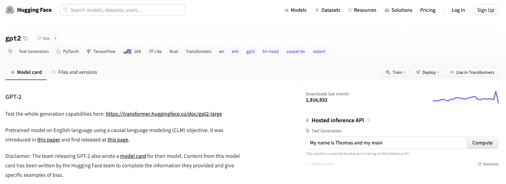
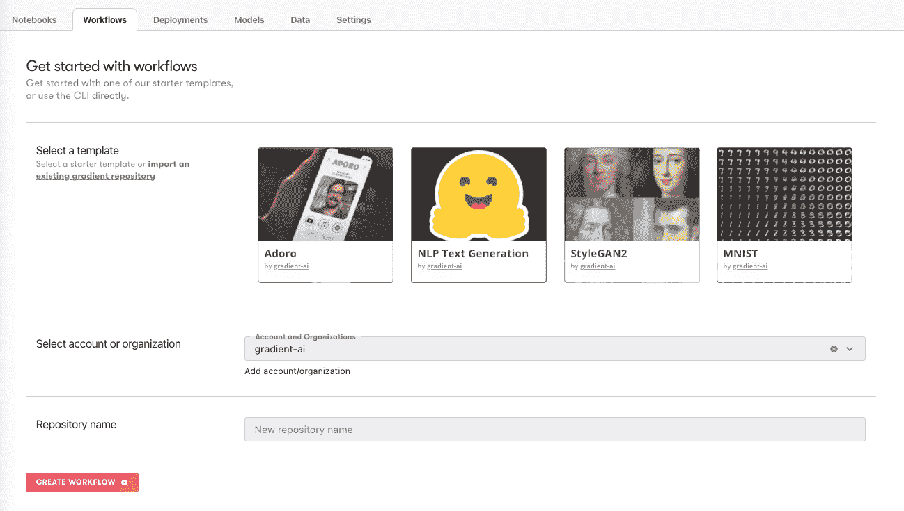
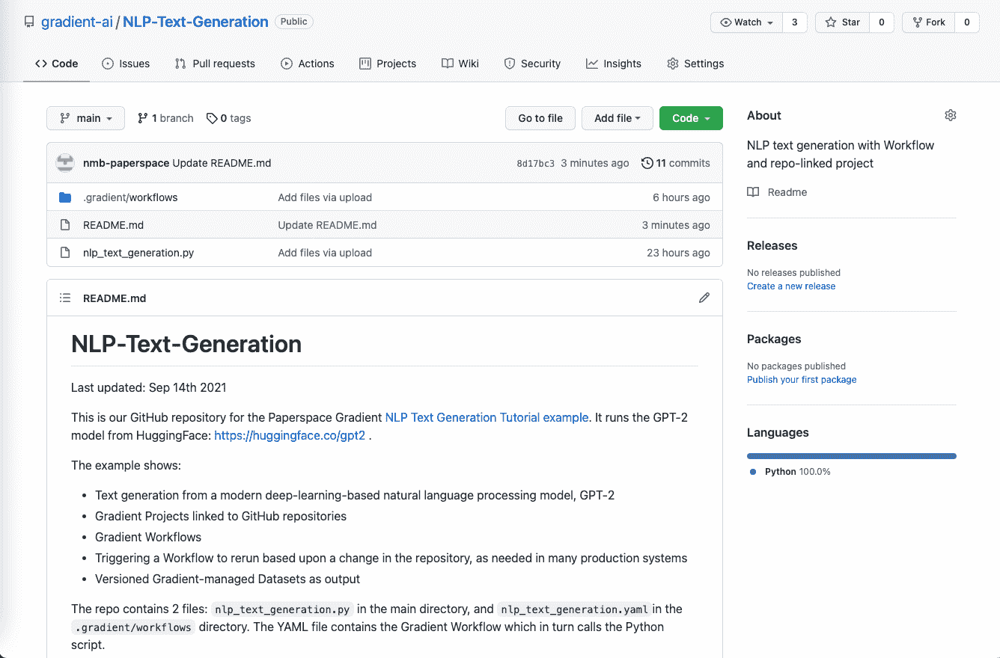
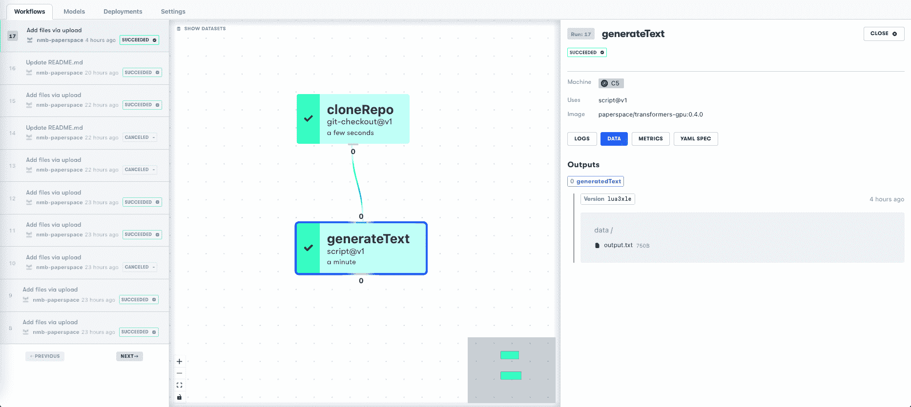
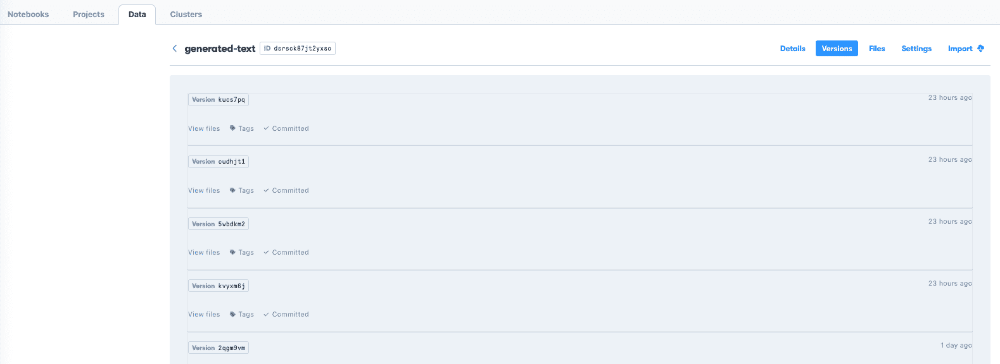

# 使用渐变工作流和 GitHub 生成 NLP 文本

> 原文：<https://blog.paperspace.com/nlp-text-generation-using-gradient-workflows-and-github-integration/>

在处理数据科学项目以解决复杂问题时，或者在将项目从探索阶段投入生产时，对项目的组件(包括代码、数据、模型和部署)进行版本控制非常重要。

在现代软件工程和数据科学工作中，GitHub 已经成为最流行的版本控制方式。因此，通过我们与 github.com 的集成，Paperspace Gradient 使用户的项目能够链接到 GitHub 库。

在本例中，我们展示了:

*   基于现代深度学习的自然语言处理模型的文本生成，GPT-2
*   工作流链接到 GitHub 存储库的渐变项目
*   根据存储库中的更改触发工作流重新运行，这在许多生产系统中都是需要的
*   作为输出的版本化梯度管理数据集

如果你想自己运行这些例子，请查看我们关于这个项目的[文档页面，以及](https://docs.paperspace.com/gradient/get-started/tutorials-list/example-workflow-nlp-text-generator) [GitHub 库](https://github.com/gradient-ai/NLP-Text-Generation)。

### 自然语言处理文本生成

NLP(自然语言处理)在过去几年中作为深度学习模型在广泛领域的成功应用而出现。在这里，我们展示了众所周知的 GPT-2 模型在梯度工作流中运行，以生成文本。提供了一个初始句子，模型继续书写。这在需要自动生成合适文本的地方有明显的应用。

我们使用来自 HuggingFace 的 [GPT-2](https://huggingface.co/gpt2) 文本生成器。这在 Gradient 上很容易做到，因为我们有一个现有的 HuggingFace 容器，其中包含必要的软件依赖关系，并且他们的库提供了简单的函数，如`pipeline()`和`generator()`，这些函数指向模型的推理能力以生成文本。



HuggingFace GPT-2 NLP text generation model used here

虽然 GPT-2 不是绝对最新或最大的可用 NLP 模型，但我们选择它而不是其他模型，如 GPT-Neo-1.3B/2.7B，原因如下:

*   是使用最多的一个:比如选择 HuggingFace 机型列表，通过文本生成标签进行[过滤，GPT-2 就是下载最多的机型。](https://huggingface.co/models?pipeline_tag=text-generation&sort=downloads)
*   许多性能更高的大型模型在 Gradient 上运行得很好，但在 5GB 或 10GB+的大小上，与 GPT-2 的大约 0.5GB 相比，它们需要更长的加载时间，因此不太适合旨在快速运行的示例。

在渐变中运行时，无论是在笔记本中还是在工作流中，都会启动 HuggingFace 容器，然后运行 Python 代码。输出文本可以直接在单元格中看到，或者定向到输出文件。在工作流中，输出文件放在渐变管理的数据集中。

### 将渐变项目链接到 GitHub 存储库

渐变工作流包含在项目中。为了在 GUI 中创建一个项目，我们导航到我们的主页，这里给出了创建一个项目的选项。可以创建一个工作流，通过命令行运行，或者像我们在这里做的那样，链接到 Github 存储库。该存储库可以从我们的一个示例模板中复制，或者您可以指向您自己建立的一个模板。

工作流创建屏幕如下所示:



Workflow creation page, showing how to create a repo-linked Project

在这种情况下，回购是这样的:



GitHub repository used in this project

我们可以看到正在运行的 Python 脚本，以及包含工作流的`.gradient`目录，如下所述。

### 触发工作流重新运行

运行文本生成器模型的代码是

```
# Settings
random_seed = 42
max_length = 30
num_return_sequences = 5
initial_sentence = "Hello, I'm a language model,"

# Run generator
generator = pipeline('text-generation', model='gpt2')
set_seed(random_seed)
output = generator(initial_sentence, max_length = max_length, num_return_sequences = num_return_sequences) 
```

由此我们可以看出，如果改变`Settings`下的值，模型会产生不同的文本作为输出。

在类似 MLOps 或生产的情况下，我们可能希望更改模型设置来触发工作流的重新运行。这很容易在 Gradient 中显示出来:如果文件被编辑，更新的版本被上传到与项目链接的 GitHub 存储库中，那么工作流将重新运行。

前提是:

*   工作流 YAML 文件位于链接存储库中的目录`.gradient/workflows`中
*   YAML 文件包含一个`on`字段，表示当对回购进行更改时，应该触发它运行

`on`字段的一个例子是

```
on:
  github:
    branches:
      only: main 
```

这表明对存储库主分支的任何更改都将触发重新运行。这种触发运行的能力，以及工作流 YAML 在`.gradient/workflows`目录中的位置，与 GitHub 自己的动作功能类似。

目前，如果 YAML 包含上述代码，那么对回购的任何文件更改都将触发重新运行，但我们很快会将此功能添加到更具体的操作中，例如，只有更改某些文件才会导致重新运行。例如，当您希望纠正`README.md`文件中的一个错别字时，这将非常有用，不会触发您为期一周的深度学习培训再次运行。

当在 Gradient 中触发工作流重新运行时，GUI 工作流列表将在左侧显示如下列表:



Workflow reruns triggered by updates to the GitHub repository

显示触发重新运行的事件，例如*更新 README.md* 。在右边，我们可以看到来自工作流的`output.txt`文件，它包含了这次运行所生成的文本。

### 梯度数据集的版本化输出

在数据科学中，数据本身与代码或模型一样重要。然而，数据通常不会存储在 GitHub 存储库中，因为它太大了。

因此，梯度提供了托管存储，当从工作流输出时，会生成版本化的梯度数据集。每个数据集可能包含许多单独的数据文件或其他文件，并且可以通过引用其 ID 和版本号来访问。

当与与回购相关的项目和工作流结合使用时，这将使给定工作流所做的处理与生成的数据版本保持一致。



Versions of the output Gradient-managed Dataset for Workflow runs

对于我们的 NLP 文本生成，我们可以看到哪个模型设置产生了哪个输出。

### 文本输出是什么样的？

当然，我们不能不展示一些示例文本输出。

已知从这种模型生成的文本具有各种问题，例如从提供给它的训练数据中继承偏见，或者产生不适合所有受众的输出。由于用户可以提供任何句子作为输出的初始部分，因此潜力是显而易见的。

解决有问题的输出超出了本文的范围，所以我们只是将其视为“这是模型所说的”，没有任何解释，并展示几个示例。

类似地，NLP 文本生成器可以通过对更深入、更集中的文本进行训练，在特定领域获得更高的性能。这里的输出来自基本模型，最大输出长度设置为 100 个字符。

```
Hello, I'm a language model, not a programming language. Let's see how you work out your approach. By our experience, Python is the best known language to work with. It has been used in numerous programming languages, including Java, C++, R, C, C#, Lua, C#, PHP, XML, Python, Ruby and more. In addition to such languages as Lua, Javascript, PHP, BSD, PHP, PHP.

But there are some problems 
```

```
Paperspace Gradient is a visualization of the gradient of the background by the relative humidity based on the total amount of current it takes to change the intensity of the source illumination. While many researchers consider this process as simple, many use the method to solve more complex and complex problems. If it turns out a few other factors would make the process more convenient, or perhaps even more efficient, for example, it might be worthwhile to start incorporating this in the design of your own lights. 
```

```
Paperspace Gradient is a music editor that automatically scales up and down on the files you're working on. It's a little like how a game can now change up the sound that's playing on your home music system, on PC, iPod, or iOS.

You can also customize the way the music is played for your device, through plugins, apps, or just by tapping and holding on an instrument.

And yes, all of these features have been in the works for 
```

```
MLOps is really useful. And most importantly, it helps your team's customers, which include your visitors and merchants.

The "Best Practices For Customer Performance"

What are things you would change if you started out selling services for users instead of products?

If it's not at all possible for you to get great customer service, why not start selling software for customers? The software is great. It makes your business better. It helps your customers. It saves you money by 
```

正如我们所看到的，该模型能够创建接近人类清晰水平的句子，但经常会出现同形异义词(拼写相同，但含义不同的单词)的误用，并且在理解上普遍缺乏特异性，如包含“gradient”的示例显然，还有更多潜力有待发掘。

### 结论

在这个例子中，我们展示了

*   基于现代深度学习的自然语言处理模型的文本生成，GPT-2
*   工作流链接到 GitHub 存储库的渐变项目
*   根据存储库中的更改触发工作流重新运行，这在许多生产系统中都是需要的
*   作为输出的版本化梯度管理数据集

对应的[教程](https://docs.paperspace.com/gradient/get-started/tutorials-list/example-workflow-nlp-text-generator)和 [GitHub 库](https://github.com/gradient-ai/NLP-Text-Generation)都有。

### 后续步骤

通常情况下，下一步该做什么取决于您在寻找什么，但有几种可能性:

*   有关渐变中更长的端到端工作流示例，请参见[推荐器](https://docs.paperspace.com/gradient/get-started/tutorials-list/end-to-end-example)和 [StyleGAN2](https://docs.paperspace.com/gradient/get-started/tutorials-list/workflows-sample-project) 教程。推荐者有一个笔记本、工作流、部署和非回购链接项目。StyleGAN2 与 repo 关联，显示数据准备、模型训练和模型推断。
*   HuggingFace 模型提供的灵活接口意味着通过修改指向模型的`generator = pipeline('text-generation', model='gpt2')`行和传递正确参数的`generator()`函数行，可以修改`nlp_text_generation.py`中显示的 Python 代码以使用其他 NLP 模型。例如，上面提到的 GPT-近地天体系列在 https://huggingface.co/EleutherAI 的[。GPT-近地天体-125M 实际上与 GPT-2 的大小相当，你也可以测试更大的-1.3B 和-2.7B。后者可能需要比工作流中指定的 C5 更大的实例，例如 C7。](https://huggingface.co/EleutherAI)