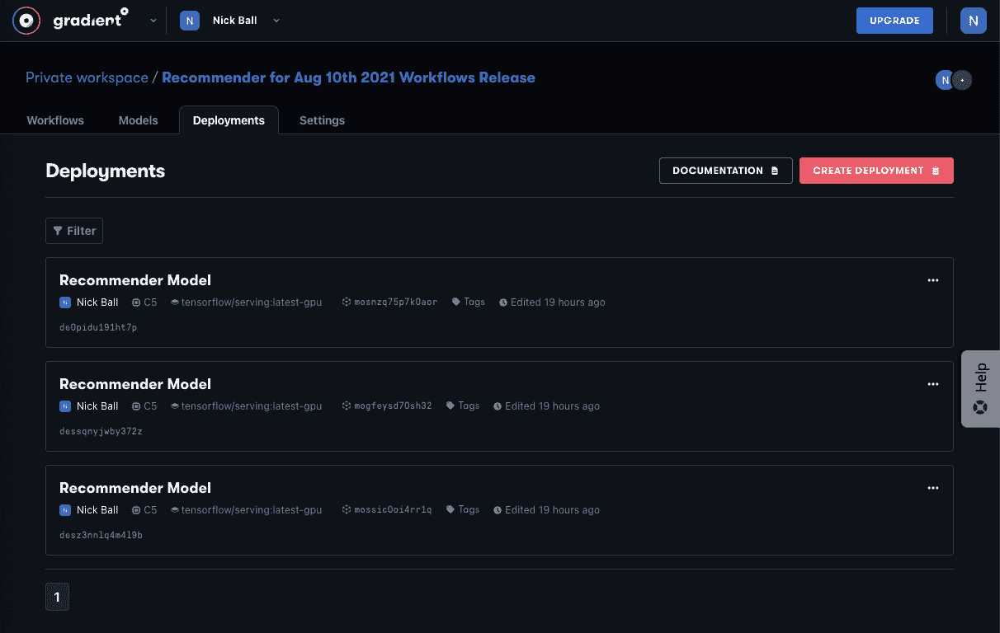
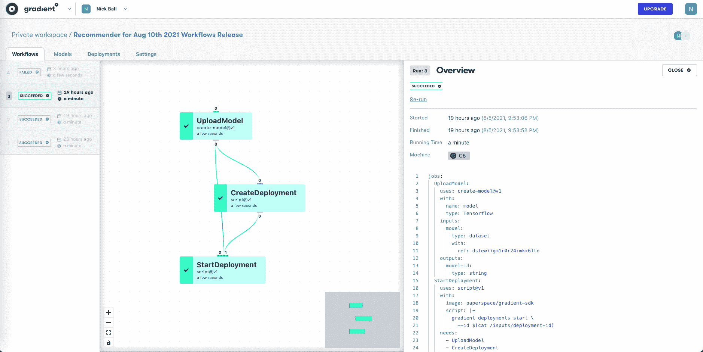

# 具有梯度的端到端推荐系统——第 5 部分:将模型部署到产品中

> 原文：<https://blog.paperspace.com/end-to-end-recommender-system-part-5-deploying-model-production/>

## 第 5 部分介绍

在这个六部分系列的第五部分中，我们将展示如何使用梯度工作流部署模型及其与 TensorFlow 服务的集成。

### 系列零件

[第 1 部分:提出业务问题](https://blog.paperspace.com/end-to-end-recommender-system-part-1-business-problem/)
[第 2 部分:准备数据](https://blog.paperspace.com/end-to-end-recommender-system-part-2-data-preparation/)
[第 3 部分:构建张量流模型](https://blog.paperspace.com/end-to-end-recommender-system-part-3-building-tensorflow-model/)
[第 4 部分:调整模型以获得最佳性能](https://blog.paperspace.com/end-to-end-recommender-system-part-4-tuning-model-best-performance/)
[**第 5 部分:将模型部署到生产中**](https://blog.paperspace.com/end-to-end-recommender-system-part-5-deploying-model-production/)
[第 6 部分:总结、结论和后续步骤](https://blog.paperspace.com/end-to-end-recommender-system-part-6-conclusion-next-steps/)

### 伴随材料

*   本博客系列附带资料的主要位置是位于[https://github.com/gradient-ai/Deep-Learning-Recommender-TF](https://github.com/gradient-ai/Deep-Learning-Recommender-TF)的 GitHub 资源库。
*   其中包含项目的笔记本`deep_learning_recommender_tf.ipynb`，可以在渐变笔记本或 JupyterLab 界面中运行，以及渐变工作流的 3 个文件:`workflow_train_model.py`、`workflow-train-model.yaml`和`workflow-deploy-model.yaml`。
*   回购的目的是能够被使用和遵循，而不必参考博客系列，反之亦然，但它们相互补充。

### 注意

公共集群上的 Gradient 产品和工作流中的模型部署支持目前正处于待定状态，预计将于 2021 年第四季度推出。因此，笔记本`deep_learning_recommender_tf.ipynb`中关于模型部署的第 5 部分已显示，但尚未运行。

* * *

## 部署模型

既然我们已经有了训练好的模型，我们就可以将它部署到生产中了。

生产不同于实验和培训，因为重点从解决问题(例如，我们可以在笔记本上完成)转移到为可靠部署的模型设计解决方案。

当到了部署模型的时候，我们不再仅仅关心分析的正确性，而是关心服务于解决方案的架构的健壮性。

生产的一个中间步骤可能在实验和训练阶段进行，就是将看不见的测试数据发送给模型。通常我们会这样做，如果我们仍然有一些基础事实来衡量模型性能。

然而，这或多或少类似于实际生产，这取决于在培训阶段有多少数据是以与培训和验证数据相同的方式准备的。在 TensorFlow 中，这可能在带有测试集的模型上运行`.predict`。

按照我们的标准，全面生产意味着向模型设置发送原始的、不可见的数据，并让模型返回正确的、可操作的输出，如预测。

该设置需要对输入中的意外变化具有鲁棒性。它需要能够检测应用程序问题(如延迟)和数据科学问题(如模型漂移)。并且它需要能够在需要时处理模型的再训练。

可能没有与模型输出相比较的基本事实标签，所以必须利用其他方法来确保模型的输出是有意义的。

机器学习模型是高度非线性的，因此输入的小变化会导致输出的大变化。有可能在几分之一秒内将输出从有价值的商业信息变成无意义的信息。负责部署的团队很可能不负责发送给他们的数据，因此在部署过程中注意不要破坏底层模型至关重要。

Gradient 的主要优势在于，它通过提供硬件、配置的 Kubernetes 集群、容器，以及对于 TensorFlow，与 TF 服务的集成，使生产(或类似生产)部署步骤比其他方式更容易。

可以通过 GUI、SDK 或命令行创建和管理部署。如果用户不希望使用云资源，并且需要内部设置，那么公司也可以提供帮助。

在一些企业中，尤其是较大的企业，最终的生产部署可能要经过漫长的审批、流程、检查、安全等。训练和实验阶段不需要的，并且可能是使用不同软件栈的情况。

在这种情况下，进行实验和培训的团队可能不同于进行部署的团队。

因为 Gradient 包含笔记本电脑和工作流，而且还在一个工具中包含 MLOps 和部署功能，所以可以按照良好的软件工程实践来训练和部署模型。

特别是，梯度促进迭代，这是数据科学的一个关键组成部分，不仅在数据准备、特征工程和模型训练之间，而且在模型训练和模型部署之间。

## 梯度部署



Gradient model deployments, showing versioning

Gradient 支持在其注册表中部署模型，这意味着它们要么是由用户上传的，要么是由 Gradient 工作流创建的，正如我们在第 4 部分中所做的那样。

部署模型时，用户选择以下选项:

*   模型
*   容器–渐变提供的容器或自定义容器
*   机器–公共集群或私有集群
*   加速器——CPU 或 GPU 机器
*   实例——单台机器或分布式机器
*   在容器中运行的命令
*   如果需要，各种高级选项

这还是有相当多的选项可以选择的，但应该不会让人应接不暇。Gradient 试图为用户不希望更改或不知道如何更改的设置提供智能默认值，这样做可以使用户快速启动并运行。

需要时，用户可以对所需的设置进行精细控制。

在本系列中，推荐器部署相对简单。我们使用定制模型和子类化 API，但是 SavedModel 与更简单的 API 格式相同，所以部署是相同的。

我们没有使用大型数据集，所以我们不需要分布式计算，一台 CPU 机器就足以满足我们展示一个返回正确预测的模型的既定目的。

部署可以通过 GUI、笔记本中的 SDK 或`.py`、命令行来完成，或者，正如我们将在这里看到的，通过工作流来完成。

## 部署实施

可以通过命令行(或者将来的 GUI)调用工作流，也可以使用笔记本中的 SDK。这里我们使用后一种方法。

至于工作流中的模型训练，我们需要导入 Gradient SDK 并将我们的 API 密钥传递给它，以便安全地访问系统:

```
from gradient import sdk_client
workflows_client = sdk_client.WorkflowsClient(api_key) 
```

然后，我们指向要运行的特定工作流并调用它:

```
spec_path = './workflow-train-model.yaml'

yaml_spec = open(spec_path, 'r')
spec = yaml.safe_load(yaml_spec)

workflow_param = {
    'workflow_id' : workflow_id_train,
    'spec': spec,
    'inputs': None
}

workflow_run = workflows_client.run_workflow(**workflow_param) # "**" is used because parameters is a dictionary 
```

随着工作流产品的成熟，将来这个过程会更加友好。

工作流 YAML 看起来类似于第 4 部分中的模型训练。这里我们调用一个作业来获取模型，一个作业来创建部署，一个作业来启动部署。



Recommender model deployment Workflow in Gradient

一旦部署开始，模型就在端点上，就好像它是使用渐变部署中的任何其他方法开始的一样。

因此，我们可以向它发送一些数据，并查看模型的响应。如果我们给它发送一些用户和电影，我们应该看到它预测用户会给他们什么评级！

## 向模型发送数据

在训练阶段，数据作为 TensorFlow 缓存数据集传递。对于模型部署，它必须作为 JavaScript 对象符号或 JSON 传递，这是 YAML 的一个子集。

在全面的生产环境中，每秒可能会有数百万个点流向模型。

我们不打算在这里重复，而是发送几行数据来查看模型响应。更大规模的行可以用同样的方式发送，也许发送到分布式部署(由 Gradient 支持)而不是单个端点。

给定每行字典形式的测试数据:

```
test_rows_1 = {'movie_title': 'Devils Advocate, The (1997)',
 'timestamp': 892870992,
 'user_id': '587'}

test_rows_2 = {'movie_title': 'Donnie Brasco (1997)',
 'timestamp': 891499278,
 'user_id': '782'}

test_rows_3 = {'movie_title': 'Craft, The (1996)',
 'timestamp': 891700850,
 'user_id': '280'}

... 
```

让我们先转换成 JSON 如下:

```
data = json.dumps({'signature_name': 'serving_default', 'instances': [test_rows_1, test_rows_2, test_rows_3, ... ]}) 
```

然后发送到模型的 API 端点:

```
endpoint = deployment[0].endpoint
headers = {'content-type': 'application/json'}
json_response = requests.post(endpoint, data=data, headers=headers) 
```

返回的预测通过以下方式可见:

```
predictions = json.loads(json_response.text)['predictions']
print(predictions[0]["output_3"])
... 
```

如果这个给定的用户要观看这个给定的电影，则预测评级在 0-5 的范围内给出:

```
[3.42430091]
[3.71842861]
[2.88263416]
... 
```

因此用户 587 更可能喜欢《魔鬼代言人》,而用户 280 更可能喜欢《手艺》,等等。

我们现在已经部署了一个模型，该模型将为用户和电影的新组合返回评级预测！

这些预测可以用来推荐用户接下来应该看什么电影。虽然我们可能会添加组件来以更大的规模传输数据流(我们并没有试图展示这一点)，但这种架构可以放心地用于生产。

## 进一步的步骤

与实验阶段一样，我们可以从这个设置中给我们的合理的缺省值中受益。我们还可以利用这样一个事实，即通过 GitHub 很容易建立集群、容器等等，并进行适当的版本控制。

Gradient 还可以轻松地将上述设置扩展到分布式培训和部署，包括 Paperspace 平台上已有的 GPU。

在这之后的另一个明显的步骤是做模型监控。由于模型作为容器化的微服务位于 API 端点上，因此可以使用任何可以看到它的工具。第 6 部分将讨论这一扩展和许多其他扩展。

## 然后

在本系列的[最后部分](https://blog.paperspace.com/end-to-end-recommender-system-part-6-conclusion-next-steps/)-*[讨论、结论和后续步骤](https://blog.paperspace.com/end-to-end-recommender-system-part-6-conclusion-next-steps/)* 中，我们将讨论本系列中所展示的要点，得出一些关于我们的推荐模型的结论，特别是，详细说明本项目未来可以做出的一些改进。