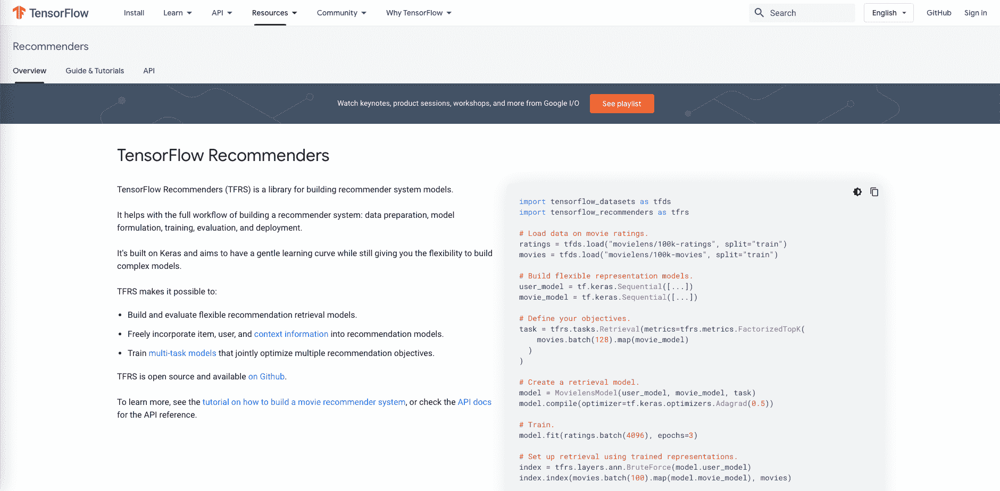

# 具有梯度的端到端推荐系统——第 3 部分:建立张量流模型

> 原文：<https://blog.paperspace.com/end-to-end-recommender-system-part-3-building-tensorflow-model/>

## 第 3 部分介绍

在这个六部分系列的第三部分中，我们将使用 TensorFlow 推荐器库来构建一个基本的推荐器模型，并根据我们在第二部分中准备的数据对其进行训练。

### 系列零件

[第 1 部分:提出业务问题](https://blog.paperspace.com/end-to-end-recommender-system-part-1-business-problem/)
[第 2 部分:准备数据](https://blog.paperspace.com/end-to-end-recommender-system-part-2-data-preparation/)
[**第 3 部分:构建 TensorFlow 模型**](https://blog.paperspace.com/end-to-end-recommender-system-part-3-building-tensorflow-model/)
[第 4 部分:调整模型以获得最佳性能](https://blog.paperspace.com/end-to-end-recommender-system-part-4-tuning-model-best-performance/)
[第 5 部分:将模型部署到生产中](https://blog.paperspace.com/end-to-end-recommender-system-part-5-deploying-model-production/)
[第 6 部分:总结、结论和后续步骤](https://blog.paperspace.com/end-to-end-recommender-system-part-6-conclusion-next-steps/)

### 伴随材料

*   本博客系列附带资料的主要位置是位于[https://github.com/gradient-ai/Deep-Learning-Recommender-TF](https://github.com/gradient-ai/Deep-Learning-Recommender-TF)的 GitHub 资源库。
*   其中包含项目的笔记本`deep_learning_recommender_tf.ipynb`，可以在渐变笔记本或 JupyterLab 界面中运行，以及渐变工作流的 3 个文件:`workflow_train_model.py`、`workflow-train-model.yaml`和`workflow-deploy-model.yaml`。
*   回购的目的是能够被使用和遵循，而不必参考博客系列，反之亦然，但它们相互补充。

### 注意

公共集群上的 Gradient 产品和工作流中的模型部署支持目前正处于待定状态，预计将于 2021 年第四季度推出。因此，笔记本`deep_learning_recommender_tf.ipynb`中关于模型部署的第 5 部分已显示，但尚未运行。

* * *

## 推荐模型

现在我们有了合适的数据(来自第 2 部分)要传递给模型，我们可以继续使用 TensorFlow 构建我们的基本推荐器。

对于用户来说，TensorFlow 模型的最简单形式——尤其是现在的 TensorFlow 2 比版本 1 更易于使用——是使用 Keras 的顺序层模型公式。这允许指定模型层(通常是神经网络)及其超参数。

一些更复杂的模型，比如那些层的非顺序排列的模型，可以用函数式 API 来指定。

推荐系统不遵循标准的监督设置，因为它们输出可能是几个推荐的有序列表，而不仅仅是单个预测或无序的分类概率。因此，它们需要使用子类化 API 的最通用的 TensorFlow 设置。模型被写成类，用户对它们的设置有最大的控制权。

真实的业务问题通常需要 ML 模型中的一些定制组件，这些组件不能用更简单的接口来表示。这意味着必须使用完整的类公式来获得必要的通用性和对过程的控制。



TensorFlow Recommenders library used in this project

然而，我们并不完全从底层组件定义我们自己的模型，而是利用 TensorFlow 库 TensorFlow 推荐器( [TFRS](https://www.tensorflow.org/recommenders) )。这为推荐系统的公共组件实现了类，比如嵌入，然后可以使用子类化 API 组装这些嵌入。

如果您熟悉 TensorFlow 推荐器教程，您可能认识本系列中的一些示例，但是我们强调的是构建一个具有数据准备和部署功能的端到端示例，而不是向推荐器本身添加功能。

## 模型组件

我们将建立模型的排名组件，其中我们将预测用户对新电影的评级，然后输出建议。

为了使模型能够进行预测，我们需要输入`movie_title`和`user_id`列，并在`user_rating`列上训练模型，以便它可以预测新的潜在用户+电影组合的评级。

为了从标题和用户的大列表到模型可以使用的低维表示，我们将这些特征转换成嵌入。

嵌入的计算方法是将原始类别映射到整数(称为词汇表)，然后将它们转换到一个维数低得多的连续向量空间，比如 32。

这些然后被传递到深度学习层，深度学习层预测用户评级并输出推荐。

如果在模型中计算嵌入，我们可以更简单地部署模型。这是因为在新的原始数据传入和模型对其运行预测之间，在模型外部进行的数据操作较少。

这减少了错误的范围，是 TensorFlow、TFRS 和其他现代 ML 库的优势。

## 模型实现

基本排名模型通过创建计算嵌入的 TFRS 模型类来实例化。然后，它包含预测用户评级的深度学习层，计算每次训练迭代损失的代码，以及允许模型在训练和保存后进行部署的调用方法。

该课程值得在此全面展示:

```
class MovielensModelBasicRanking(tfrs.models.Model):

    def __init__(self) -> None:
        super().__init__()
        embedding_dimension = 32

        # The embeddings use Keras's preprocessing layers

        # Embeddings for movies
        self.movie_model: tf.keras.layers.Layer = tf.keras.Sequential([
            tf.keras.layers.experimental.preprocessing.StringLookup(
                vocabulary=unique_movie_titles, mask_token=None),
            tf.keras.layers.Embedding(len(unique_movie_titles) + 1, embedding_dimension)
        ])

        # Embeddings for users
        self.user_model: tf.keras.layers.Layer = tf.keras.Sequential([
            tf.keras.layers.experimental.preprocessing.StringLookup(
                vocabulary=unique_user_ids, mask_token=None),
            tf.keras.layers.Embedding(len(unique_user_ids) + 1, embedding_dimension)
        ])

        # Predicted ratings
        # This is where deep learning is being used in the recommender system
        # The predictions are output by the final layer, hence its size of 1

        self.rating_model = tf.keras.Sequential([
            tf.keras.layers.Dense(256, activation='relu'),
            tf.keras.layers.Dense(64, activation='relu'),
            tf.keras.layers.Dense(1)
        ])

        # Ranking is written as a TFRS task
        self.task: tf.keras.layers.Layer = tfrs.tasks.Ranking(
            loss = tf.keras.losses.MeanSquaredError(),
            metrics=[tf.keras.metrics.RootMeanSquaredError()]
        )

    # The call method allows the model to be run, and saved
    # The embeddings are passed into the model
    # The embeddings and predicted rating are returned

    def call(self, features: Dict[Text, tf.Tensor]) -> tf.Tensor:
        user_embeddings = self.user_model(features['user_id'])
        movie_embeddings = self.movie_model(features['movie_title'])

        return (
            user_embeddings,
            movie_embeddings,
            self.rating_model(
                tf.concat([user_embeddings, movie_embeddings], axis=1)
            ),
        )

    # This is the TFRS built-in method that computes the model loss function during training
    def compute_loss(self, features: Dict[Text, tf.Tensor], training=False) -> tf.Tensor:

        ratings = features.pop('user_rating')
        user_embeddings, movie_embeddings, rating_predictions = self(features)

        rating_loss = self.task(
            labels=ratings,
            predictions=rating_predictions,
        )

        return rating_loss 
```

为了在 TFRS 教程之后向它传递数据，还有一些 TensorFlow 咒语。

这些方法是将训练、验证和测试数据集放入缓存形式以提高性能，并分批发送数据，而不是一次发送所有数据或一次发送一行数据。：

```
cached_train = train.shuffle(ntimes_tr).batch(8192).cache()
... 
```

对于 2 个批次，传递给模型的数据的形式(在编写分析时，应该总是进行完整性检查)是:

```
{'movie_title': array([b'Spanking the Monkey (1994)', b'Bob Roberts (1992)',
       b'Like Water For Chocolate (Como agua para chocolate) (1992)', ...,
       b"Stephen King's The Langoliers (1995)",
       b'Alice in Wonderland (1951)', b'Phantom, The (1996)'],
      dtype=object),
 'timestamp': array([879618019, 883602865, 884209535, ..., 885548475, 879518233,
       877751143]),
 'user_id': array([b'535', b'6', b'198', ..., b'405', b'295', b'207'], dtype=object),
 'user_rating': array([3., 3., 3., ..., 1., 4., 2.], dtype=float32)}
{'movie_title': array([b'Top Gun (1986)', b'Grace of My Heart (1996)',
       b'Ghost and the Darkness, The (1996)', ..., b'Crimson Tide (1995)',
       b'To Kill a Mockingbird (1962)', b'Harold and Maude (1971)'],
      dtype=object),
 'timestamp': array([882397829, 881959103, 884748708, ..., 880610814, 877554174,
       880844350]),
 'user_id': array([b'457', b'498', b'320', ..., b'233', b'453', b'916'], dtype=object),
 'user_rating': array([4., 3., 4., ..., 3., 3., 4.], dtype=float32)} 
```

省略号代表每个批次中未显示的其余字段。

通过与原始原始输入数据中的一行进行比较，我们可以看到已经选择了正确的列`movie_title`和`user_id`:

```
{'bucketized_user_age': 45.0,
 'movie_genres': array([7]),
 'movie_id': b'357',
 'movie_title': b"One Flew Over the Cuckoo's Nest (1975)",
 'raw_user_age': 46.0,
 'timestamp': 879024327,
 'user_gender': True,
 'user_id': b'138',
 'user_occupation_label': 4,
 'user_occupation_text': b'doctor',
 'user_rating': 4.0,
 'user_zip_code': b'53211'} 
```

id 是类别而不是数字。目标评级*是*的数值，每一批的数据都在一个数组中。

## 培训和结果

模型训练遵循编译模型和运行拟合的标准张量流方法:

```
model_br = MovielensModelBasicRanking()
model_br.compile(optimizer=tf.keras.optimizers.Adagrad(learning_rate=0.1))
history_br = model_br.fit(cached_train, epochs=3, validation_data=cached_validation) 
```

这里我们使用了 Adagrad 优化器。我们已经指定了 0.1 的学习率和少量的历元。

在第 4 部分中，我们将调整这些参数以提高性能，并展示除了使用笔记本之外，如何使用渐变工作流来训练模型。

用于衡量模型性能的指标是预测用户评级与其真实评级之间的均方根误差(RMSE)。

该模型的性能可以从历史中看出:

```
rmse_br = history_br.history['root_mean_squared_error'][-1]
print(f'Root mean squared error in user rating from training: {rmse_br:.2f}') 
```

这给出了:

```
Root mean squared error in user rating from training: 1.11 
```

换句话说，在 0-5 的范围内预测某人的电影评级的 RMSE 是 1.11。我们可以类似地从验证集中输出 RMSE，如果模型没有过度拟合数据，这应该是类似的。

我们可以按如下方式查看该模型的摘要，其中我们看到了深度学习层和排名层:

```
model_br.summary()

Model: "movielens_model_basic_ranking"
_________________________________________________________________
Layer (type)                 Output Shape              Param #   
=================================================================
sequential (Sequential)      (None, 32)                53280     
_________________________________________________________________
sequential_1 (Sequential)    (None, 32)                30208     
_________________________________________________________________
sequential_2 (Sequential)    (None, 1)                 33153     
_________________________________________________________________
ranking (Ranking)            multiple                  2         
=================================================================
Total params: 116,643
Trainable params: 116,641
Non-trainable params: 2
_________________________________________________________________ 
```

最后，我们可以在看不见的测试数据上评估模型，因为我们总是应该引用生产中现实的预期模型性能:

```
eval_br = model_br.evaluate(cached_test, return_dict=True)
...
Root mean squared error in user rating from evaluation: 1.12 
```

性能类似于训练，所以我们的模型看起来工作正常。

## 然后

在[系列的第 4](https://blog.paperspace.com/end-to-end-recommender-system-part-4-tuning-model-best-performance/) 部分- *[调整模型以获得最佳性能](https://blog.paperspace.com/end-to-end-recommender-system-part-4-tuning-model-best-performance/)* 中，我们将通过调整一些模型参数来改善上述结果，并展示如何在梯度工作流中完成培训，以充分利用自动化和可重复性。