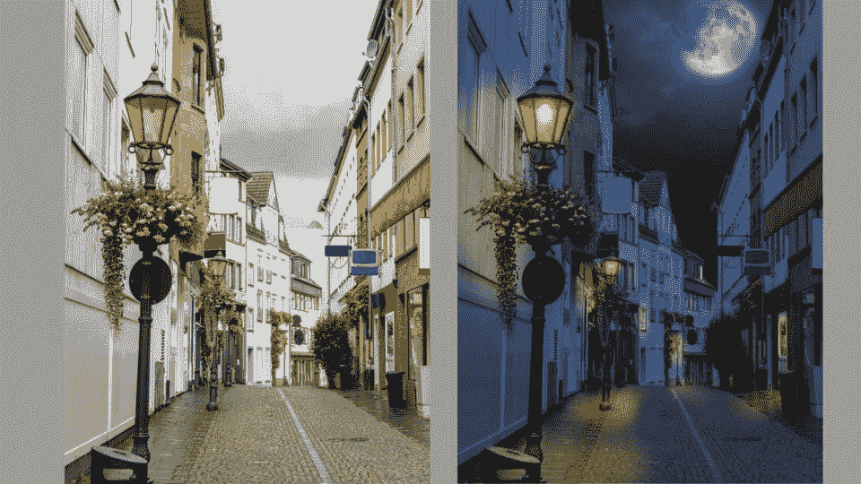
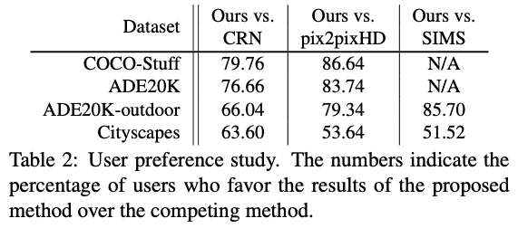
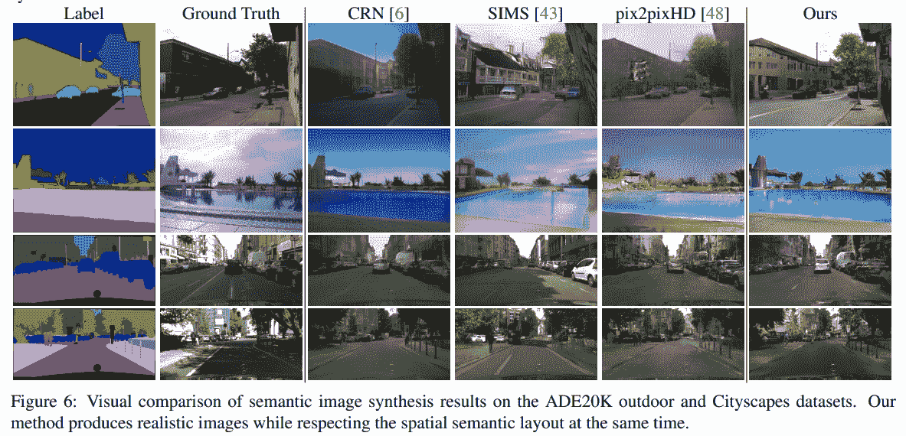
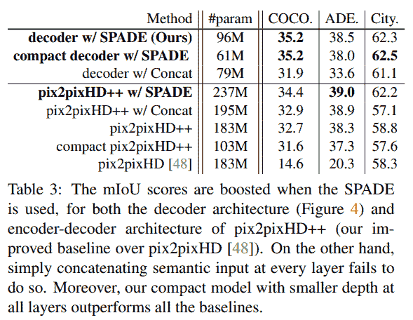
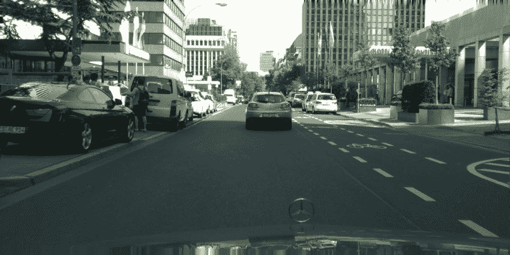
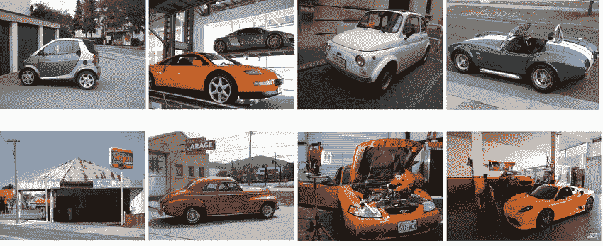
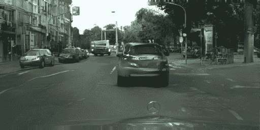

# 理解 GauGAN 第 3 部分:模型评估技术

> 原文：<https://blog.paperspace.com/gaugan-evaluation-techniques/>

大家好，欢迎来到高根系列的第三部分。在前两部分中，我们已经介绍了高根的[组件和损耗，以及如何用它来设置](https://blog.paperspace.com/nvidia-gaugan-introduction/)[定制训练](https://blog.paperspace.com/gaugan-training-on-custom-datasets/)。在这一部分，我们将讨论:

1.  评估 GauGAN 的结果
2.  与对手相比，高根的表现如何

我们将以如何调试培训的讨论来结束这个系列，并[决定 GauGAN 是否适合你](https://blog.paperspace.com/debugging-gaugan-training-and-business-considerations/)。

本教程中的代码可以在 [ML Showcase](https://ml-showcase.paperspace.com/projects/gaugan) 上获得，你可以在一个免费的 GPU 上运行它。

所以，让我们开始吧！

## 对 GauGAN 的评价:为什么这么难？

与甘一起工作最困难的事情之一是他们的评估。像对象检测和图像分类这样的任务通常预测有限的标签集，像对象类或边界框坐标，这使得定义理想的预测变得容易。例如，对象检测任务的理想预测将是当所有预测的边界框与预定义的类别标签完全对齐时。这反过来使我们很容易设计一个损失函数，惩罚偏离理想行为。

现在考虑为 GauGAN 做同样的事情。GauGAN 的输入是潜在向量和语义分割图。如何定义随机抽样的潜在向量的期望值？对于语义分割图，我们可以说 GauGAN 的理想行为是完全重建地面真实图像。然而，这种方法有几个问题。

首先，让我们假设我们实际上使用一些图像距离度量，如 GauGAN 产生的图像和真实图像之间的平方距离。考虑一个场景，其中 GauGAN 随机改变图像中出现的汽车的颜色。由于汽车的像素不同，两幅图像之间的平方距离将非零。

类似地，考虑下面的图像。‌



Day and Night Renditions of the Same Image

‌These 两个图像是白天和晚上同一场景的真实再现(请原谅超级月亮)。这两者将具有相同的原始语义分割图。假设白天的图像是我们的地面真实，而夜晚的图像是我们的干产生的。由于后者的颜色更深，像素不同，图像也会被解释为不同。每像素平方距离度量将严厉惩罚暗图像，而如果 GAN 产生另一个白天图像，则给出零误差。虽然这两个图像是同样有利的，我们看到一个平方距离完全没有认识到这一点。

### 样本的多样性

从上面继续，我们可以说，我们的平方距离度量正在惩罚我们图像生成中的多样性，即，如果我们产生真实但不同外观的样本。事实上，图像多样性是数据生成的最基本要求之一。如果我们只是在生产我们已经拥有的数据，这就违背了数据生成的初衷。

那么解决办法是什么呢？好吧，最好的解决办法就是人的层面的评价。虽然看起来很耗时，但这是目前评估 GANs 的最佳方法，几乎所有关于图像生成的最新论文都报道了这一指标。

### 人类水平的研究

GauGAN 的论文使用人类水平的评估来声称其优于同时代的人，如 Pix2PixHD、CRN 和西姆斯。

这项测试被称为“用户偏好研究”。一组用户看到两幅图像，一幅由 GauGAN 生成，另一幅由与之比较的算法生成。然后询问用户哪个图像更真实。用户偏好 GauGAN 图像的百分比称为偏好百分比。

‌GauGAN，主要是因为 SPADE，比它的前身 Pix2PixHD 好得多。



Performance of GauGAN vs its adversaries

我们可以自己看一些图像。‌



‌One 肯定能观察到 Pix2PixHD 输出的模式平均问题。我们注意到在 Pix2PixHD 的输出中看到的平滑/平均效果似乎模糊了许多对象的低级特征。

例如，查看第一行图像中的建筑物，或者第二行图像中的含水量。当有大面积的单个对象时，Pix2PixHD 会明显挣扎，并且可以观察到导致细节丢失的平滑效果。这可能是因为我们之前讨论的关于 GAN 努力从输入值的统一拭子中创建不同信息的问题。

高根人在这里的情况要好得多，也许是因为他们使用了铁锹。

除此之外，作者还尝试了几种方法来定量测量 GauGAN 的性能。我们现在来回顾一下。

### 米欧试验

mIoU 测试的第一步是获取生成的图像，并对其运行最先进的语义分割算法。结果将是每个生成的图像的语义分割图。然后，我们计算原始语义分割图和从生成的图像得到的语义分割图之间的 mIoU。‌‌



为了检查 SPADE 的重要性，作者将 Pix2PixHD 的结果与 GauGAN bar SPADE 生成器的所有增强进行了比较。他们称之为 Pix2PixHD++。他们还在这一系列实验中纳入了其他架构，包括层数较少的紧凑架构和 Pix2PixHD 风格的编码器-解码器架构，这与 GauGAN 的纯解码器架构相反。

### 弗雷歇初始距离

最近，Frechet 初始距离(FID)已成为研究 GANs 的研究人员最喜欢的评估指标。再说一次，它并不完美，但肯定是我们最好的之一。那么，FID 是如何工作的呢？

我们首先获取真实图像$R$和虚假图像$F$并将它们放入 Inception v3 网络。然后，我们对两幅图像取网络的 2048 维池层，并计算两个提取特征之间的距离。我们对数据集中的所有语义地图图像对都这样做。然后，使用所有这些向量，我们使用以下公式计算 FID。‌


其中$\mu_r$和$\mu_g$分别是真实图像和生成图像的特征的平均值。$\sum_r$和$\sum_g$是方差矩阵。$T_r$表示跟踪运算符。

这里的想法是捕捉图像的统计(Inception v3 被作为统计计算函数)，而不是两幅图像的像素。因为 Inception v3 是颜色不变的(也就是说，它会将一辆车分类为一辆车，不管那辆车是什么颜色)，所以它是一个比平方距离更好的选择。此外，它还确保了像一天中的时间、颜色和方向这样的因素不会真正影响到*多样化*图像的分数，因为《盗梦空间》被训练成对这样的差异不变。

这也有助于确保约束不会迫使网络过度适应训练数据。

### FID 分数的限制

然而，由于我们使用 Inception v3 网络作为图像的评判标准，理论上结果会受到 Inception v3 网络的限制。假设它在包含野生动物的图像上表现不太好。如果你试图生成斑马的图像，那么分数可能有点不可预测，因为算法可能对*不同的*斑马图像敏感，并且可能为两幅这样的图像产生随机不同的特征向量。野生动物只是网络的背景，我们还没有专门训练它来识别两个不同的斑马图像属于“斑马”类别*。*

现在考虑来自[城市景观数据集](https://www.cityscapes-dataset.com/)的以下图像。‌



深度学习要发挥作用，最基本的要求之一是确保评估算法的数据与训练算法的数据相同或相似。例如，考虑在 ImageNet 数据集上训练的 Inception v3 模型。

如果你看一下来自 ImageNet 的数据，你会发现这些图像与 Cityscapes 数据集有很大的不同。首先，图像一般不是很详细；它们通常只包含一个对象，几乎占据了整个图像。举个例子，看看这些汽车的图片。‌



另一方面，城市景观中的图像通常非常详细，包含许多不同的对象。

当然，Inception v3 的层可以捕获这些对象，但是所有的对象不会同样难以合成。像天空和道路这样的区域，只构成渲染纹理，比汽车更容易渲染，汽车需要算法来创建结构细节(如保险杠，背光和窗户)。

现在，想象一个场景，其中汽车被渲染得很差，而天空和道路被渲染得很好。此外，与天空和道路相比，汽车占据了图像中很小的区域。渲染不良的汽车应该保持较高的 FID，但是它们对特征向量的贡献太小，因为它们在图像中占据相对较小的空间。另一方面，渲染良好的天空/道路几乎不增加 FID，并且在特征向量中占主导地位。这可能导致图像具有好的背景和坏的前景。这是一个在 Cityscapes 数据集上使用官方实现生成的数据的例子。



An example of an image with decent road and trees but poor car rendition.

## 计算 FID 分数

为了计算您的预测的 FID 分数，我们将使用 FID 的官方实现。请注意，我没有使用官方的 FID 分数回购协议，这是您在报告结果时应该使用的东西。我不使用它的原因是因为它是为 Tensorflow 编写的，而 TensorFlow 中最近的更新——尤其是 2.0 版本——已经破解了大量代码。所以，最好用更稳定的。出于好奇，官方回购可以在这里找到。

我们首先从克隆回购开始。

```
git clone https://github.com/mseitzer/pytorch-fid
cd pytorch-fid
```

现在，将使用 FID 来比较我们的原始数据和生成的数据。在我们这样做之前，请确保您正在比较相同大小的图像。例如，训练数据的大小可能是 2048 x 512，而 GauGAN 配置为生成 1024 x 512 的图像。这种大小上的差异可能导致比实际更大的 FID。

一旦完成，工作就很容易了。您可以使用以下代码计算 FID:

```
python fid_score.py /path/to/images /path/to/other_images --batch-size b 
```

选择批量大小，使测试图像的总数是批量大小`b`的倍数。如果这不可能，确保剩余部分最小化。例如，对于 71 个测试图像，您可以选择批量大小为 7(因为 71 是一个质数)。

人们也可以考虑将 GANs 生成的图像调整到原始图像的大小。然而，对于 GAN 来说，这不是一个公平的度量，因为它(在其训练期间)仅使用较低维度的图像进行监督。

## 总结高根的表现

这里有一张来自最初的[高根论文](https://arxiv.org/abs/1903.07291)的表格，总结了高根在对抗对手时的表现。‌


‌That 说，你可能会遇到再现性问题。无法重现结果是深度学习社区的一个大问题，英伟达的最新产品也不能幸免。

## 结论

我们系列的第 3 部分到此结束。在第四部分，也是最后一部分，我们来看看常见的故障排除技巧，从业务角度来看 GauGAN 的成本，以及为什么您可能希望跳过 GauGAN 并等待技术成熟。在那之前，这里有一些链接，你可以点击阅读更多关于文章中提到的主题。

## 了解 GauGAN 系列

*   [第一部分:解开 Nvidia 的风景画 GANs](https://blog.paperspace.com/nvidia-gaugan-introduction/)
*   [第二部分:定制数据集培训](https://blog.paperspace.com/gaugan-training-on-custom-datasets/)
*   ***第三部分:模型评估技术***
*   [第四部分:调试培训&决定 GauGAN 是否适合你](https://blog.paperspace.com/debugging-gaugan-training-and-business-considerations/)

## 进一步阅读

1.  [通过双时标更新规则训练的 GANs 收敛到局部纳什均衡](https://arxiv.org/pdf/1706.08500.pdf)(介绍 FID 的论文)
2.  [对有条件的 GANS 的评价](https://arxiv.org/pdf/1907.08175.pdf)