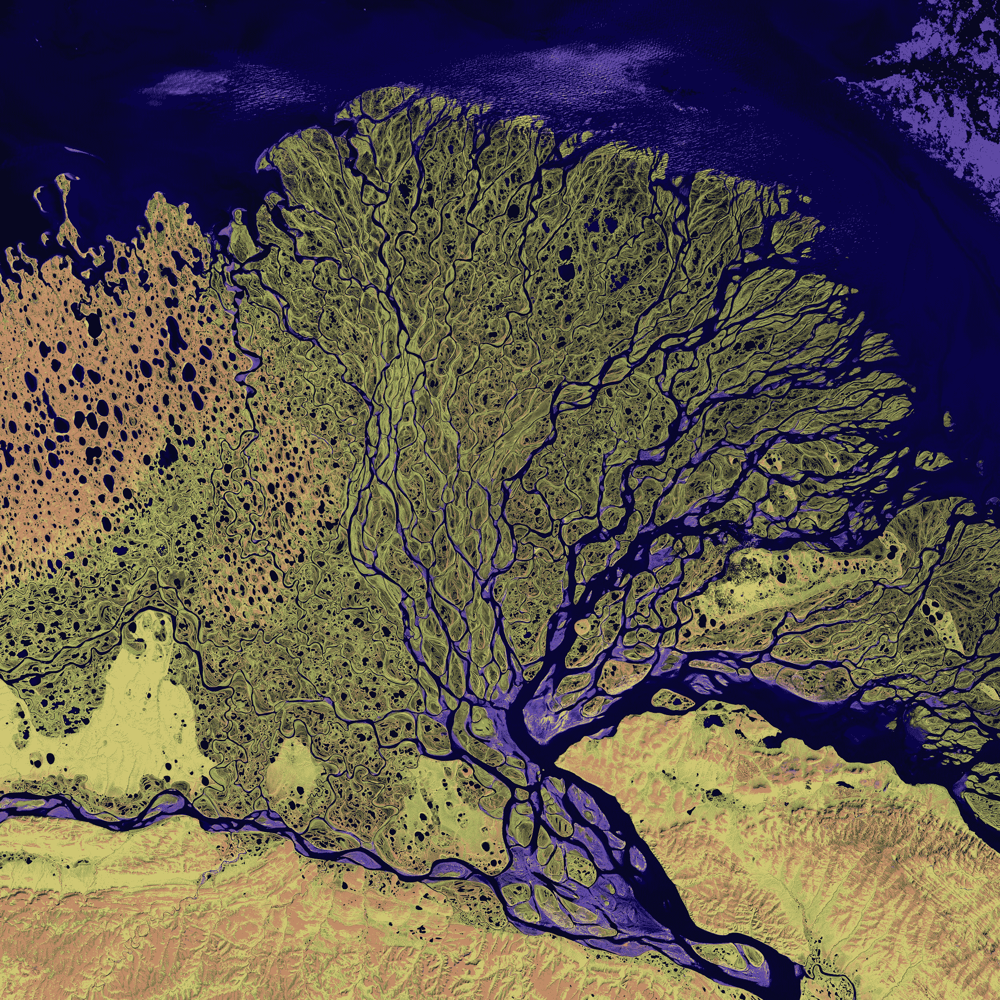
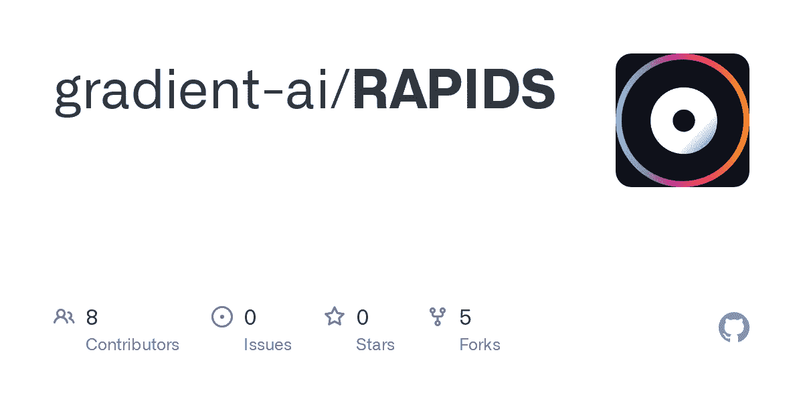
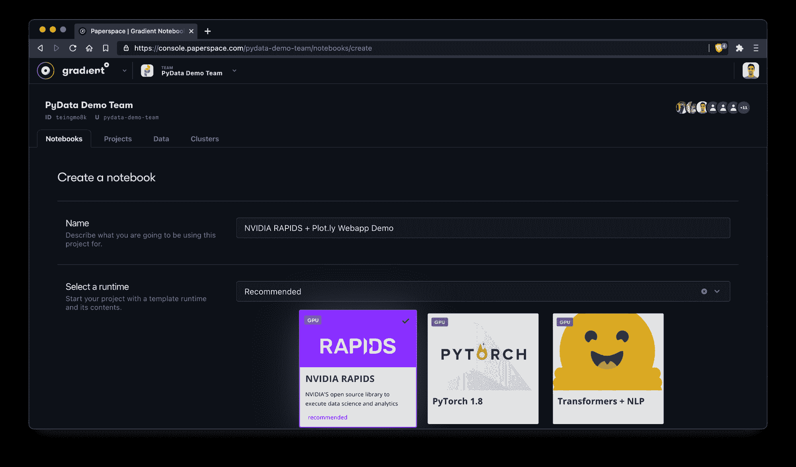
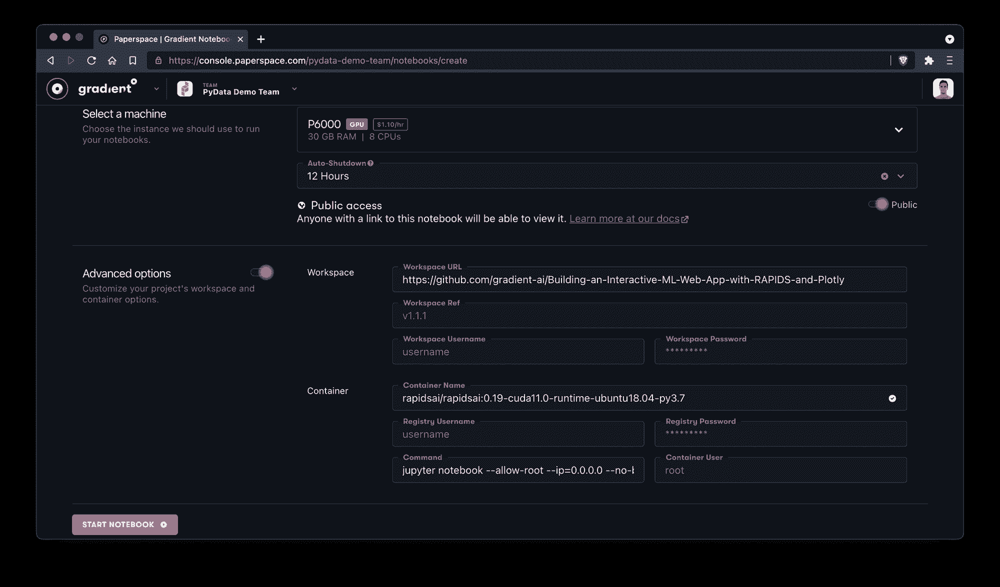
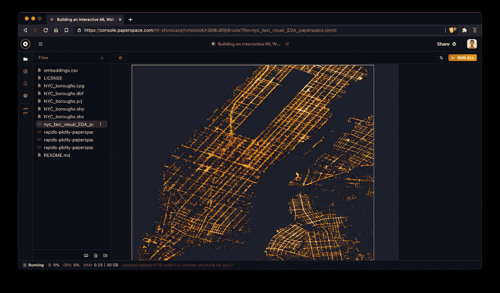
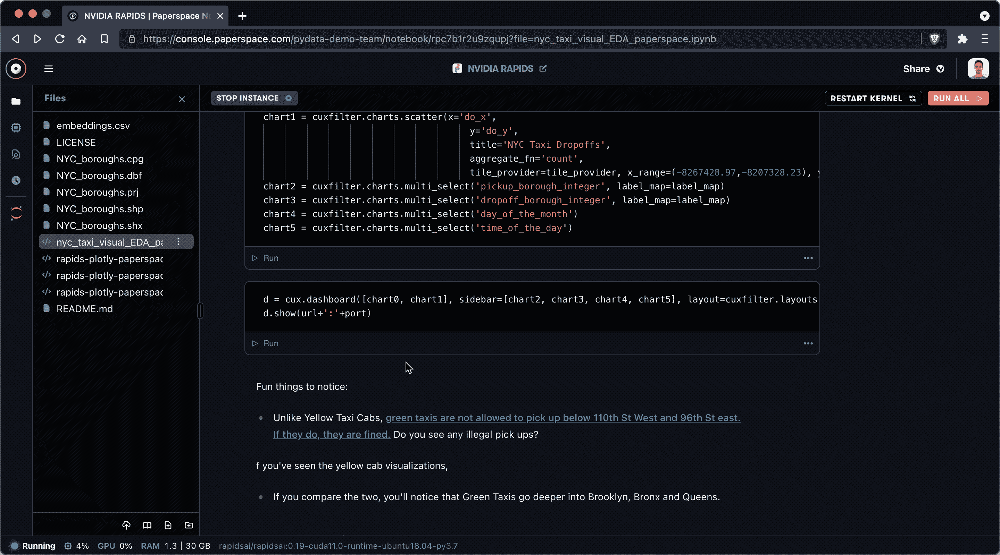
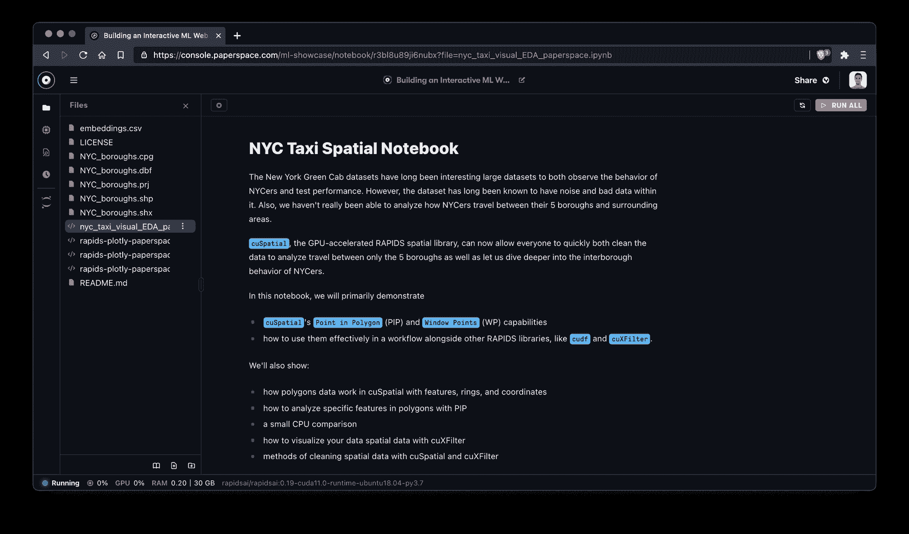
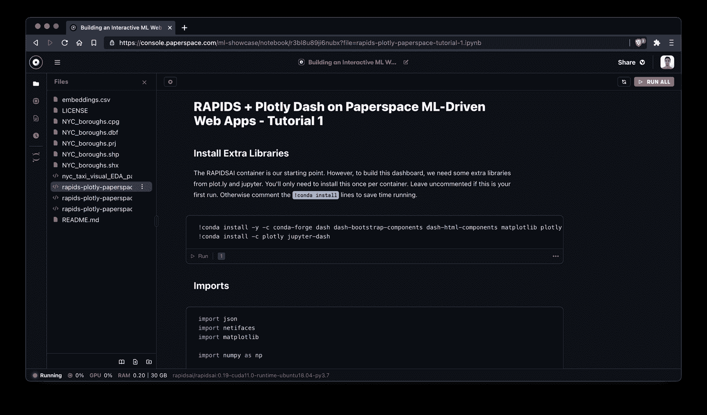

# 新的 ML Showcase 条目:使用 NVIDIA RAPIDS 和 Plot.ly 创建交互式 Web 应用

> 原文：<https://blog.paperspace.com/webapp-nvidia-rapids-plot-ly/>

[https://www.youtube.com/embed/ppr74dY9-fE?feature=oembed](https://www.youtube.com/embed/ppr74dY9-fE?feature=oembed)

## 介绍

我们最近与来自[拉皮兹](https://rapids.ai/)和 [Plot.ly](https://plotly.com/) 的人们合作，演示如何生成一个 web 应用程序来执行复杂的数据集可视化——所有这些都来自运行在 Paperspace 上的渐变笔记本。

我们很高兴发布这次合作的结果作为新的 ML 展示条目。与所有 ML Showcase 条目一样，我们邀请您将这些笔记本分发给您自己的团队并开始探索！

[Building an Interactive ML Web App with RAPIDS and Plot.lyBring data to life with NVIDIA RAPIDS and Plot.lyML ShowcaseThe Gradient Team](https://ml-showcase.paperspace.com/projects/interactive-ml-app-rapids-plotly)

*注意:强烈建议您在 P4000、P5000 或更高的 GPU 实例上运行笔记本电脑，因为笔记本电脑中使用的库仅与 Pascal 和更新的 NVIDIA GPU 架构兼容。*

## 相互了解

如果你还不熟悉， [RAPIDS](https://rapids.ai/) 是 NVIDIA 的开源库集合，旨在将经典的机器学习功能直接移植到 GPU。

RAPIDS 的优势是多方面的，但总的来说，其理念是优化受益于 GPU 并行的任务，如将大数据块加载到内存中，或受益于增加处理器内核数量的任何其他任务。

在这个 ML 展示项目中有几个演示笔记本。您可以在这里亲自探索 GitHub 源代码:

[gradient-ai/RAPIDSContribute to gradient-ai/RAPIDS development by creating an account on GitHub.GitHubgradient-ai](https://github.com/gradient-ai/RAPIDS)

所有笔记本都使用 NVIDIA 的 [RAPIDS 框架](https://rapids.ai/)，少数还整合了 Plot.ly 的 [Dash](https://plotly.com/dash/)

通过使用这些笔记本，您将熟悉许多令人兴奋的库，以及如何使用代理将应用部署到外部端点——所有这些都在一个笔记本中完成！

## 我们开始吧

我们要做的第一件事是使用 Paperspace 渐变控制台中的`Create Notebook`功能创建一个新笔记本。确保为您的笔记本命名，并选择 RAPIDS tile 作为您的运行时。



Before we can do anything we will need to create a new notebook.

*注意:当您选择一个运行时图块时，它等同于指定一个`Workspace URL`、`Container Name`和`Container Command`——这些选项也可以在 Create Notebook 视图的`Advanced Options`部分手动指定。*

接下来，我们将选择一个[机器类型](https://gradient.paperspace.com/instances)。这里我们选择 NVIDIA Quadro P6000，30GB 内存，8 个 vCPUs。



Select a machine and toggle the advanced options to enter a Workspace URL manually

我们还将切换`Advanced Options`并手动添加我们希望笔记本使用的 GitHub 工作区。

我们将使用这个回购:

```
https://github.com/gradient-ai/Building-an-Interactive-ML-Web-App-with-RAPIDS-and-Plotly 
```

单击`Start Notebook`后，我们将等待几分钟，让笔记本电脑启动。

一旦它启动，我们将能够直接从渐变 IDE 中看到存储库中不同的笔记本文件。

在这张图片中，我们正在探索纽约市出租车空间笔记本的一部分。



When the notebook starts we'll be able to enter the NYC Taxi Spatial notebook

太棒了。为了充分利用这些例子，我们建议从纽约市出租车笔记本开始，它介绍了急流生态系统的关键部分。

## 关于渐变笔记本 IDE 和 JupyterLab 的说明

当您使用本笔记本时，有时可能需要访问完整的 JupyterLab 实例。

例如，在编写本文时，Gradient IDE 还不支持基于 javascript 的可视化，因此当您在标签为*的部分中运行单元格时，您可能会收到此警告，创建您的图表并启动仪表板*:

```
Warning: Output format application/javascript is not supported at the moment. 
```

不要害怕！你可以通过左边栏的图标轻松切换到 Jupyter。



Swap over to JupyterLab via the icon in the left sidebar.

总的来说，你应该能够在渐变 IDE 中执行大多数操作——并且[新功能会不断添加](https://updates.paperspace.com/)——但是很高兴知道 JupyterLab 在你需要的时候就在那里。

## 纽约出租车空间笔记本

在这个由 RAPIDS 背后的团队创建的笔记本中，我们将利用许多 GPU 加速的 RAPIDS 库来探索纽约市出租车的行为。



NYC Taxi Spatial notebook created by the team at NVIDIA RAPIDS

该笔记本通过 [NYC OpenData](https://data.cityofnewyork.us/Transportation/Taxi/mch6-rqy4) 以及以下库使用 2015 绿色出租车数据集的数据:

*   cuSpatial -来自 RAPIDS 的 GPU 加速空间库
*   cuDF -同样来自 RAPIDS 的 GPU 数据帧库
*   cuXFilter -一个将 web 可视化连接到 GPU 加速交叉过滤的框架

该笔记本主要利用 cuSpatial 来清理和分析 borough 间的数据，并使用 cuXFilter 来可视化这些数据。

在这个过程中，笔记本通过代理服务器建立了一个端点来托管实时可视化！请务必在笔记本开头标记为 *Add notebook ports* 的单元格中记录您的 URL 模式。

## Rapids + Plotly Dash on Paperspace 教程 1-3

如果您喜欢使用 NYC taxi spatial 笔记本，我们建议您看一看剩余的 QTY 3 教程。ipynb 文件，它具有额外的 RAPIDS 库和 Dash 功能。



RAPIDS + Plotly Dash Tutorial #1

在教程#1 中，我们将使用 Dash、cuDF 和 cuxfilter 来分析 65K+细胞及其基因表达。教程#2 和#3 展示了聚类和可视化数据的其他方法。

每个笔记本都是独立的，所以不用担心按顺序做。如果您有任何问题或意见，请务必[联系我们](http://twitter.com/hellopaperspace)或 [NVIDIA RAPIDS 团队](https://twitter.com/rapidsai)。

## 额外资源

如果您喜欢使用这些笔记本，我们邀请您探索其他的 [ML Showcase](https://ml-showcase.paperspace.com/) 笔记本。我们还建议定期查看 Paperspace 博客的[教程](https://blog.paperspace.com/tag/tutorial/)部分，了解定期添加的新条目。

最后，如果您想用 RAPIDS 启动一个新项目，您可以在 Paperspace 控制台中简单地创建一个新的笔记本，然后从那里开始。


Starting a new notebook with RAPIDS is as easy as selecting the RAPIDS runtime in the notebook create menu

我们迫不及待地想看看你的作品！