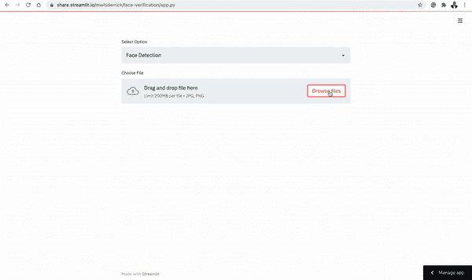
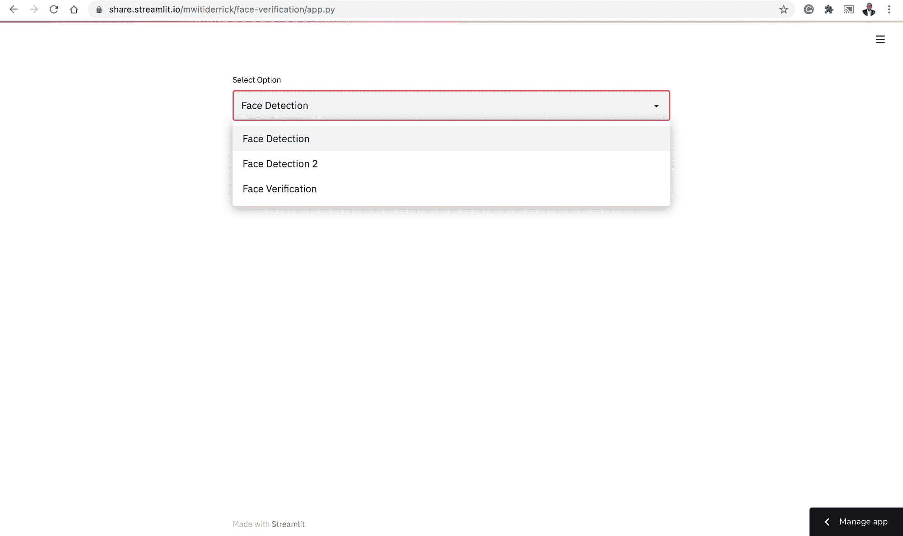
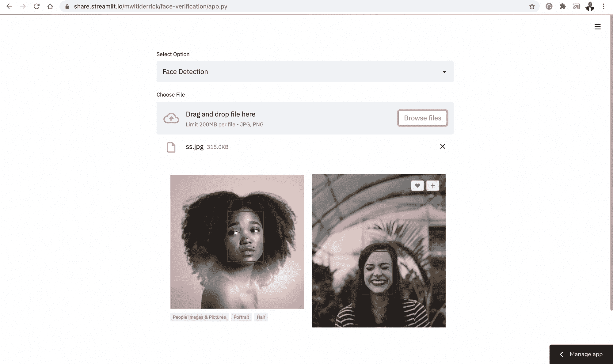
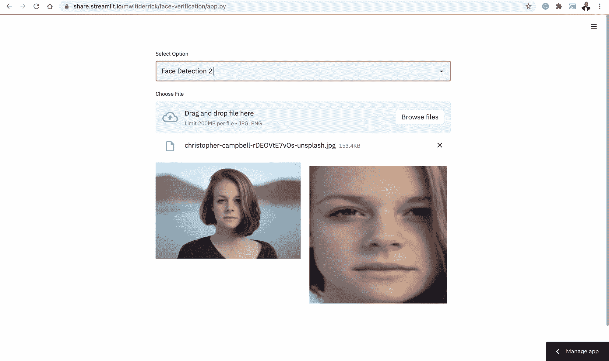
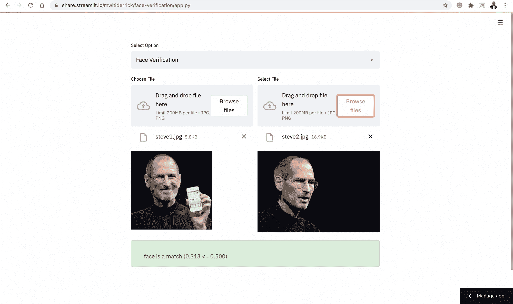
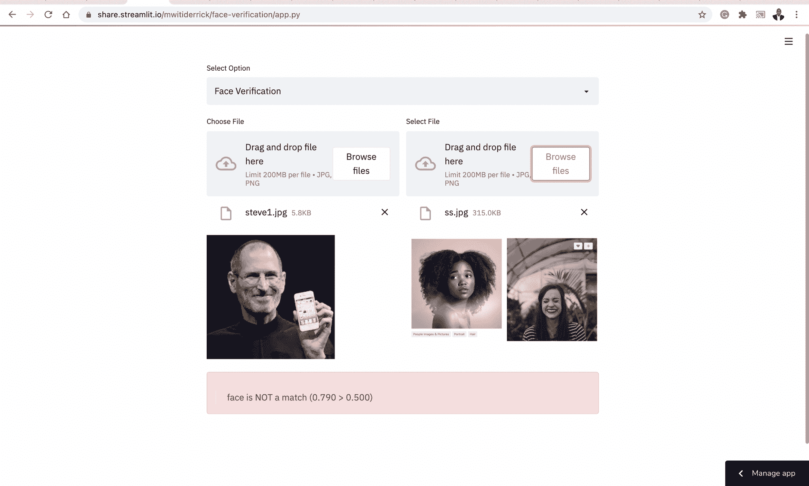
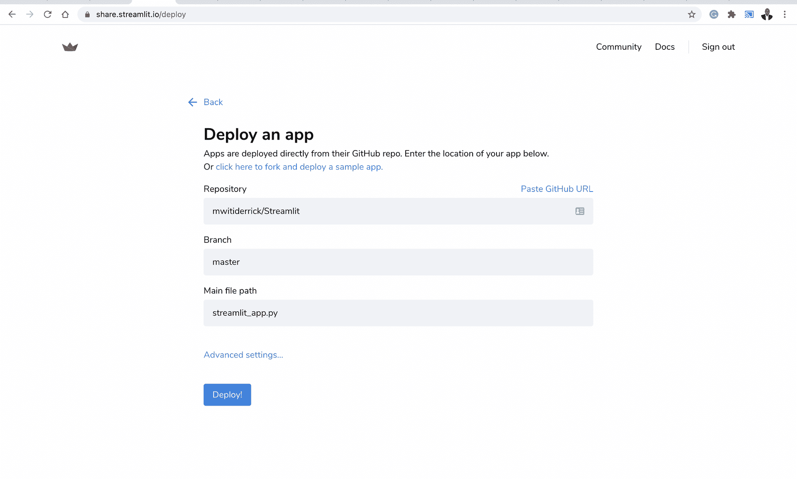

# 使用 Keras 和 Streamlit 进行人脸验证

> 原文：<https://blog.paperspace.com/face-verification-with-keras/>

Streamlit 使数据科学家和机器学习实践者能够快速构建数据和机器学习应用程序。在本文中，我们将了解如何使用 Streamlit 构建人脸验证应用程序。然而，在我们开始验证人脸之前，我们必须检测它们。在计算机视觉中，人脸检测是在图像中定位和定位人脸的任务。人脸验证是比较两幅或多幅图像相似性的过程。

下图显示了我们将在本文中使用的应用程序。现场演示是[位于这里](https://share.streamlit.io/mwitiderrick/face-verification/app.py)。



## 用 MTCNN 检测人脸

MTCNN 代表多任务级联卷积神经网络，在本文的[中首次提出。该框架由三个阶段组成:](https://arxiv.org/pdf/1604.02878.pdf)

*   在第一步中，候选窗口和它们的包围盒回归向量通过称为建议网络(P-Net)的浅层 CNN 产生
*   下一步使用复杂的 CNN 来拒绝非人脸窗口。该论文将这种 CNN 称为精炼网络(R-Net)。
*   然后，它使用更复杂的 CNN 来提炼结果，并输出五个面部标志的位置。

上述三级级联框架的输入是已经被调整大小到不同比例的图像，以便构建图像金字塔。

在本文中，我们将使用 [Iván de Paz Centeno 的](https://github.com/ipazc/mtcnn)实现该文件。它以 pip 安装包的形式提供。

```
pip install mtcnn
```

## 人脸识别和验证模型

VGGFace 指的是从牛津大学的[视觉几何小组(VGG)的计算机视觉数据集开发的人脸识别模型。这个系列的主要机型有](https://www.robots.ox.ac.uk/~vgg/) [VGGFace](https://www.robots.ox.ac.uk/~vgg/publications/2015/Parkhi15/parkhi15.pdf) 和 VGGFace2。[深度人脸识别](https://www.robots.ox.ac.uk/~vgg/publications/2015/Parkhi15/parkhi15.pdf)论文提出了一种用于人脸识别和验证的大规模数据集。本文描述了一种通过比较人脸在欧几里德空间中的嵌入来验证人脸的方法。这是通过三重损耗来实现的。在这个实现中，相似人脸之间的欧几里德距离很小，而不同人脸之间的欧几里德距离较大。

VGGFace2 在本文的[中有描述。它提出了一个新的大规模人脸数据集，包含 9131 个对象的 331 万张图像。每个对象平均有 362.6 张图片。在该数据集上训练的模型被称为 VGGFace2。这些模型可以在这个](https://arxiv.org/pdf/1710.08092.pdf) [GitHub repo](https://github.com/ox-vgg/vgg_face2) 上找到。我们将使用这个模型的 Keras 实现来验证人脸。我们需要做的第一件事是检测人脸，然后获得它们的嵌入。这篇论文将这些嵌入称为*面部描述符*。然后使用余弦相似度计算这些描述符之间的距离。

在 Keras 中，我们可以通过使用 [keras-vggface](https://github.com/rcmalli/keras-vggface) 包来使用 VGGDFace 模型。你必须从 GitHub 安装它。

```
pip install git+https://github.com/rcmalli/keras-vggface.git
```

## 设置细流应用程序

在我们开始开发应用程序之前，您需要安装所有的需求。需求在这里[可用。下载文件后，通过 pip 安装所有要求。](https://github.com/mwitiderrick/Face-Verification/blob/master/requirements.txt)

```
pip install -r requirements.txt 
```

### 导入所有需求

现在打开一个新的 Python 文件(最好命名为`app.py`)并在文件顶部导入所有需求:

*   `MTCNN`将用于人脸检测
*   `Streamlit`用于设置网络应用程序
*   `Matplotlib`用于显示人脸
*   `Circle`用于在脸上标记地标
*   `Rectangle`用于在检测到的人脸周围创建一个方框
*   `Image`用于打开图像文件
*   `cosine`计算人脸之间的余弦相似度
*   `VGGface`用于获取人脸嵌入
*   `preprocess_input`用于将图像转换成模型要求的格式

```
from mtcnn.mtcnn import MTCNN
import streamlit as st
import matplotlib.pyplot as plt 
from matplotlib.patches import Rectangle
from matplotlib.patches import Circle
from PIL import Image
from numpy import asarray
from scipy.spatial.distance import cosine
from keras_vggface.vggface import VGGFace
from keras_vggface.utils import preprocess_input
```

### 设置下拉菜单

下一步是设置下拉选项。幸运的是，Streamlit 提供了各种用于构建 HTML 页面的小部件。



在这种情况下，我们需要创建一个`select_box`。选择框函数需要一个标签和选择框所需的选项。将函数赋给变量使我们能够捕捉用户选择的选项。

```
choice = st.selectbox("Select Option",[
    "Face Detection",
    "Face Detection 2",
    "Face Verification"
])
```

### 定义主要功能

我们需要做的下一件事是创建一个主函数，它将负责各种用户选择。在这个函数中，我们将构建检测人脸以及验证人脸的代码。

让我们从实现面部检测功能开始。第一步是检查用户是否选择了面部检测选项。在那之后，接下来发生的是:

*   使用 Streamlit 中的`file_uploader`上传文件
*   使用 Pillow 打开图像，并将其转换为 NumPy 数组
*   关闭 Matplotlib 轴后可视化图像
*   创建一个用于检测人脸的`MTCNN`检测器
*   获得面部和面部标志的坐标
*   使用`Circle`和`Rectangle`显示带有边界框和面部标志的面部

```
def main():
    fig = plt.figure()
    if choice == "Face Detection":
        uploaded_file = st.file_uploader("Choose File", type=["jpg","png"])
        if uploaded_file is not None:
            data = asarray(Image.open(uploaded_file))
            plt.axis("off")
            plt.imshow(data)
            ax = plt.gca()

            detector = MTCNN()
            faces = detector.detect_faces(data)
            for face in faces:
                x, y, width, height = face['box']
                rect = Rectangle((x, y), width, height, fill=False, color='maroon')
                ax.add_patch(rect)
                for _, value in face['keypoints'].items():
                    dot = Circle(value, radius=2, color='maroon')
                    ax.add_patch(dot)
              st.pyplot(fig) 
```



除了显示图像中的点和边界框，我们还可以返回检测到的人脸。过程类似于我们上面所做的。唯一不同的是，我们使用检测到的人脸的坐标来提取人脸。之后，我们使用 Pillow 将数组转换成图像。

```
 results = detector.detect_faces(pixels)
 x1, y1, width, height = results[0]["box"]
 x2, y2 = x1 + width, y1 + height
 face = pixels[y1:y2, x1:x2]
```



我们使用 Streamlit `beta_columns`在左边显示图像，在右边显示检测到的人脸。这是该部分的完整代码。

```
elif choice == "Face Detection 2":
        uploaded_file = st.file_uploader("Choose File", type=["jpg","png"])
        if uploaded_file is not None:
            column1, column2 = st.beta_columns(2)
            image = Image.open(uploaded_file)
            with column1:
                size = 450, 450
                resized_image = image.thumbnail(size)
                image.save("thumb.png")
                st.image("thumb.png")
            pixels = asarray(image)
            plt.axis("off")
            plt.imshow(pixels)
            detector = MTCNN()
            results = detector.detect_faces(pixels)
            x1, y1, width, height = results[0]["box"]
            x2, y2 = x1 + width, y1 + height
            face = pixels[y1:y2, x1:x2]
            image = Image.fromarray(face)
            image = image.resize((224, 224)) 
            face_array = asarray(image)
            with column2:
                 plt.imshow(face_array)
                 st.pyplot(fig)
```

## 人脸验证

为了验证人脸，我们首先需要使用 VGGFace 模型嵌入人脸。在模型中传递`include_top=False`意味着我们对模型的最终分类层不感兴趣。这很重要，因为我们只对学习人脸嵌入感兴趣。之后，我们将计算两个人脸嵌入的余弦相似度。我们还设置了 0.50 的阈值来确定面部相似性。我们可以使用 Streamlit 列来并排展示这两个面。

```
 elif choice == "Face Verification":
        column1, column2 = st.beta_columns(2)

        with column1:
            image1 = st.file_uploader("Choose File", type=["jpg","png"])

        with column2:
            image2 = st.file_uploader("Select File", type=["jpg","png"])
        if (image1 is not None) & (image2  is not None):
            col1, col2 = st.beta_columns(2)
            image1 =  Image.open(image1)
            image2 =  Image.open(image2)
            with col1:
                st.image(image1)
            with col2:
                st.image(image2)

            filenames = [image1,image2]

            faces = [extract_face(f) for f in filenames]
            samples = asarray(faces, "float32")
            samples = preprocess_input(samples, version=2)
            model = VGGFace(model= "resnet50" , include_top=False, input_shape=(224, 224, 3),
            pooling= "avg" )
            # perform prediction
            embeddings = model.predict(samples)
            thresh = 0.5
            score = cosine(embeddings[0], embeddings[1])
            if score <= thresh:
                st.success( " >face is a match (%.3f <= %.3f) " % (score, thresh))
            else:
                st.error(" >face is NOT a match (%.3f > %.3f)" % (score, thresh))
```

我们还创建了一个函数，用于从上传的图像中检测和返回人脸。功能:

*   使用 MTCNN 检测人脸
*   从图像中提取人脸
*   使用 Pillow 将图像数组转换为图像
*   将图像调整到所需的大小
*   以 NumPy 数组的形式返回图像

```
def extract_face(file):
    pixels = asarray(file)
    plt.axis("off")
    plt.imshow(pixels)
    detector = MTCNN()
    results = detector.detect_faces(pixels)
    x1, y1, width, height = results[0]["box"]
    x2, y2 = x1 + width, y1 + height
    face = pixels[y1:y2, x1:x2]
    image = Image.fromarray(face)
    image = image.resize((224, 224))
    face_array = asarray(image)
    return face_array
```



我们也可以用两张不相似的脸来证明这一点。



这个实现中的最后一件事是运行 main 函数。

```
if __name__ == "__main__":
    main()
```

该项目的代码和要求可以在这里找到[。](https://github.com/mwitiderrick/Face-Verification)

## 使用 Streamlit 共享部署应用程序

Streamlit 允许我们只需点击两次按钮即可部署机器学习应用程序。前往[share.streamlit.com](https://share.streamlit.io/)开设一个免费账户。单击“新建应用程序”按钮开始部署过程。对于这个免费版本，应用程序需要在 GitHub 上免费提供。


之后，您将选择想要部署的存储库，并单击 deploy 按钮。repo 需要有一个包含应用程序所需的所有库的`requirements.txt`文件。



## 最后的想法

在本文中，您看到了如何使用 Streamlit 和 Keras 构建和部署图像验证应用程序。 [Streamlit](https://www.udemy.com/course/streamlit) 可用于构建和部署各种数据科学和机器学习应用。它的语法也很容易掌握。在 VGG 模型中，我们使用了 ResNet 架构，您可以尝试不同的模型，如 [VGG16](https://keras.io/api/applications/vgg/) 和 SENet 50，并比较结果。如果你觉得雄心勃勃，你还可以[进一步微调模型](https://github.com/rcmalli/keras-vggface)。

就这样了，伙计们！