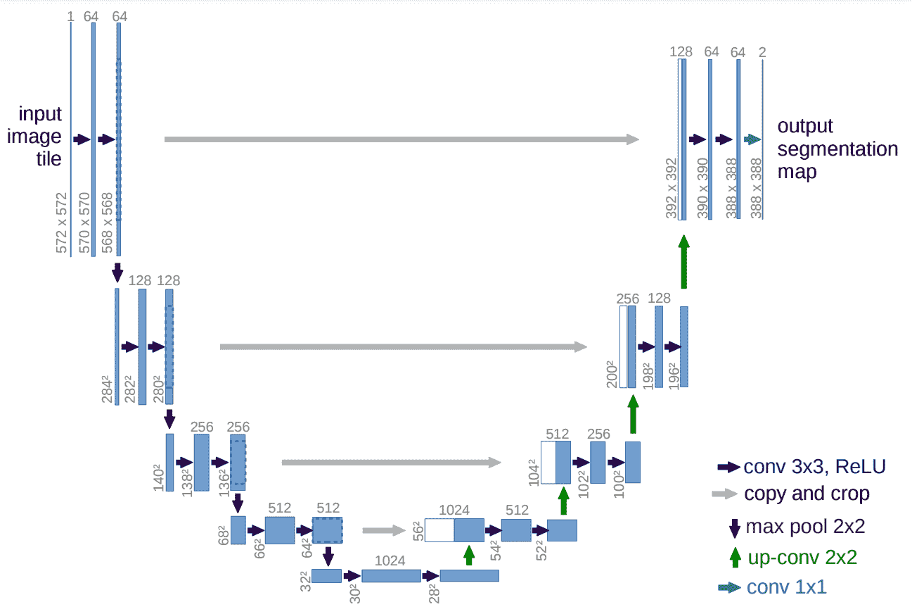
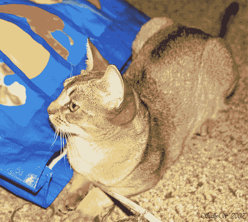
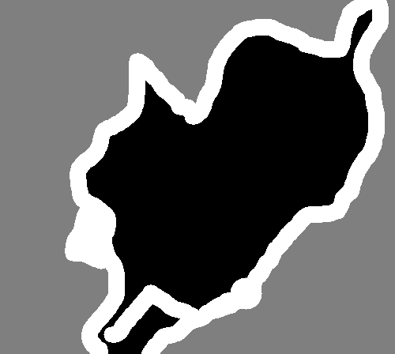

# 用于图像分割的 U-Net 体系结构

> 原文：<https://blog.paperspace.com/unet-architecture-image-segmentation/>

深度学习模型和计算机视觉在现代的应用正在突飞猛进。计算机视觉就是这样一个人工智能领域，我们训练我们的模型来解释现实生活中的视觉图像。借助 U-Net 和 CANet 等深度学习架构，我们可以在计算机视觉数据集上实现高质量的结果，以执行复杂的任务。虽然计算机视觉是一个巨大的领域，有如此多的东西要提供，有如此多不同的、独特类型的问题要解决，但我们接下来两篇文章的重点将放在两个架构上，即 U-Net 和 CANet，它们旨在解决图像分割的任务。

图像分割的任务是获取一幅图像并将其分成几个更小的片段。产生的这些片段或多个片段将有助于图像分割任务的计算。对于图像分割任务，另一个基本要求是使用遮罩。在基本上是由零值或非零值组成的二值图像的掩蔽的帮助下，我们可以获得分割任务所需的期望结果。一旦我们借助于图像和它们各自的掩模描述了在图像分割期间获得的图像的最基本的组成部分，我们就可以用它们来实现许多未来的任务。

图像分割的一些最重要的应用包括机器视觉、对象检测、医学图像分割、机器视觉、人脸识别等等。在您深入研究本文之前，我建议您查看一些可选的先决条件，以便了解本文。我建议查看 [TensorFlow](https://blog.paperspace.com/absolute-guide-to-tensorflow/) 和 [Keras](https://blog.paperspace.com/the-absolute-guide-to-keras/) 指南，以熟悉这些深度学习框架，因为我们将利用它们来构建 U-Net 架构。下面是目录列表，用于理解我们将在本文中涉及的概念列表。建议通读整篇文章，但是如果您已经了解一些概念，您可以随意查看具体的部分。

### 目录:

*   U-Net 简介
*   了解 U-Net 架构
*   U-Net 的 TensorFlow 实现
    1。已实施模型的修改
    2。导入所需的库
    3。构建卷积模块
    4。构造编码器和解码器模块
    5。构建 U-Net 架构
    6。最终确定模型
*   查看 U-Net 性能的快速示例项目
    1。数据集准备
    2。数据可视化
    3。配置数据发生器
    4。U-Net 型号
    5。训练模型
    6。查看结果
*   结论

## U-Net 简介:

U-Net 架构于 2015 年首次发布，是深度学习领域的一场革命。该架构在众多类别中以较大优势赢得了 2015 年国际生物医学成像研讨会(ISBI)细胞追踪挑战赛。他们的一些工作包括在电子显微镜堆栈和透射光显微镜图像中分割神经元结构。

有了这个 U-Net 架构，512X512 大小的图像的分割可以用现代 GPU 在很短的时间内计算出来。由于这种架构的巨大成功，已经有了许多变体和修改。其中一些包括 LadderNet、U-Net with attention、递归和剩余卷积 U-Net (R2-UNet)以及具有剩余块或具有密集连接的块的 U-Net。

虽然 U-Net 是深度学习领域的一项重大成就，但了解以前用于解决此类类似任务的方法也同样重要。即将结束的一个主要例子是滑动窗口方法，它在 2012 年 ISBI 的 EM 分段挑战赛中以较大优势胜出。滑动窗口方法能够在原始训练数据集之外生成大量样本面片。

这一结果是因为它使用了通过在像素周围提供局部区域(小块)来将每个像素的类别标签作为单独单元来建立滑动窗口架构的网络的方法。这种体系结构的另一个成就是，它可以很容易地在任何给定的训练数据集上定位相应的任务。

然而，滑动窗口方法有两个主要缺点，U-Net 体系结构克服了这两个缺点。因为每个像素都是单独考虑的，所以产生的补丁会有很多重叠。因此，产生了大量的总体冗余。另一个限制是整个培训过程非常缓慢，耗费了大量的时间和资源。由于以下原因，网络运行的可行性值得怀疑。

U-Net 是一个优雅的架构，它解决了大多数正在发生的问题。这种方法使用了全卷积网络的概念。U-Net 的目的是捕捉上下文的特征以及本地化。这一过程由构建的架构类型成功完成。实现的主要思想是利用连续的收缩层，紧接着是上采样算子，用于在输入图像上实现更高分辨率的输出。

* * *

## 了解 U-Net 架构:



U-Net architecture from the following [research paper](https://arxiv.org/pdf/1505.04597.pdf)

通过简单看一下图中所示的架构，我们可以注意到为什么它可能被称为 U-Net 架构。这样形成的建筑的形状是一个“U”的形式，并因此得名。只要看一下这个架构的构造过程中所涉及的结构和众多元素，就可以明白所构建的网络是一个完全卷积的网络。他们没有使用任何其他层，如密集或扁平或其他类似的层。视觉表示示出了初始收缩路径，随后是扩展路径。

该架构显示，输入图像通过模型，然后是几个具有 ReLU 激活功能的卷积层。我们可以注意到，图像大小从 572X572 减小到 570X570，最后减小到 568X568。这种减少的原因是因为他们利用了无填充的卷积(将卷积定义为“有效的”)，这导致了总体维度的减少。除卷积模块外，我们还注意到，左侧是编码器模块，右侧是解码器模块。

在跨距 2 的最大池层的帮助下，编码器块具有图像尺寸的持续减小。我们还在编码器架构中增加了重复卷积层的滤波器数量。一旦我们到达解码器方面，我们注意到卷积层中的滤波器数量开始减少，随后的层中的采样逐渐增加，一直到顶部。我们还注意到，使用跳过连接将先前的输出与解码器模块中的层连接起来。

这种跳过连接是一个至关重要的概念，可以保留先前图层的损失，以便它们更好地反映整体值。它们也被科学证明可以产生更好的结果，并导致更快的模型收敛。在最后一个卷积模块中，我们有几个卷积层，后面是最后一个卷积层。这一层有一个 2 的过滤器，具有显示结果输出的适当功能。这最后一层可以根据您尝试执行的项目的预期目的进行更改。

* * *

## U-Net 的张量流实现

在本文的这一部分，我们将研究 U-Net 架构的 TensorFlow 实现。虽然我使用 TensorFlow 来计算模型，但您可以选择任何深度学习框架(如 PyTorch)来实现类似的实现。在以后的文章中，我们将会看到 U-Net 架构以及其他一些 PyTorch 模型结构的工作情况。然而，对于本文，我们将坚持使用 TensorFlow 库。我们将导入所有需要的库，并从头开始构建我们的 U-Net 架构。但是，我们将进行一些必要的更改，以提高模型的整体性能，并使其稍微不那么复杂。

*   **已实现模型的修改**

值得注意的是，U-Net 模型早在 2015 年就已推出。虽然它在那个时间点上的表现令人难以置信，但深度学习的突出方法和功能也在同步发展。因此，自最初创建以来，U-Net 架构有许多成功的变体和版本，以在复制时保持某些图像质量，并且在某些情况下，性能优于原始架构。

我将尽量保留 U-Net 架构最初实现的大部分基本参数和架构元素。然而，将有轻微的变化，从原来的内容，这将提高现代的效率，提高速度以及模型的简单性。这种结构中包含的变化之一是使用卷积的值作为“相同”，因为未来的许多研究表明，这种特定的变化不会以任何方式对体系结构的构建产生负面影响。还有，由于 2016 年引入了批量规格化的概念，原来的架构并没有用到这方面。但是，我们的模型实现将包括批处理规范化，因为它在大多数情况下会产生最佳结果。

*   **导入所需的库**

为了构建 U-Net 架构，我们将利用 TensorFlow 深度学习框架，如前所述。因此，我们将为此导入 TensorFlow 库以及 Keras 框架，它现在是 TensorFlow 模型结构的一个组成部分。从我们以前对 U-Net 架构的理解中，我们知道一些基本的导入包括卷积层、最大池层、输入层和基本建模结构的激活函数 ReLU。然后，我们将使用一些额外的层，如 Conv2DTranspose 层，它将为我们所需的解码器模块执行上采样。我们还将利用批量标准化层来稳定训练过程，并使用连接层来组合必要的跳过连接。

```
import tensorflow as tf 
from tensorflow import keras
from tensorflow.keras.layers import Input, Conv2D, MaxPooling2D, Activation, ReLU
from tensorflow.keras.layers import BatchNormalization, Conv2DTranspose, Concatenate
from tensorflow.keras.models import Model, Sequential
```

*   **构建卷积块**

导入所需的库后，我们可以继续构建 U-Net 架构。你可以在一个完整的类中这样做，依次定义所有的参数和值，继续这个过程，直到你到达最后，或者你有几个迭代块。我将使用后一种方法，因为对于大多数用户来说，借助几个模块来理解 U-Net 的模型架构更方便。我们将利用架构表示中所示的三个迭代模块，即卷积运算模块、编码器模块和解码器模块。在这三个模块的帮助下，我们可以轻松地构建 U-Net 架构。现在让我们逐一处理和理解这些功能代码块。

卷积运算块用于执行获取输入的输入参数和处理双层卷积运算的主要操作。在这个函数中，我们有两个参数，即卷积层的输入和过滤器的数量，默认情况下是 64。我们将使用前面讨论的填充值来保持相同的形状，而不是未填充或有效的卷积。这些卷积层之后是批量标准化层。这些对原始模型的改变是为了获得可能的最佳结果。最后，按照研究论文中的定义，将 ReLU 激活层添加到混合物中。让我们研究一下用于构建卷积模块的代码模块。

```
def convolution_operation(entered_input, filters=64):
    # Taking first input and implementing the first conv block
    conv1 = Conv2D(filters, kernel_size = (3,3), padding = "same")(entered_input)
    batch_norm1 = BatchNormalization()(conv1)
    act1 = ReLU()(batch_norm1)

    # Taking first input and implementing the second conv block
    conv2 = Conv2D(filters, kernel_size = (3,3), padding = "same")(act1)
    batch_norm2 = BatchNormalization()(conv2)
    act2 = ReLU()(batch_norm2)

    return act2
```

*   **构建编码器和解码器模块**

我们的下一步将是建立编码器和解码器模块。这两个函数构造起来非常简单。编码器架构将使用从第一层一直到底部的连续输入。我们定义的编码器函数将具有卷积块，即两个卷积层，后面是它们各自的批量归一化和 ReLU 层。一旦我们通过卷积模块，我们将快速对这些元素进行下采样，如研究论文中所述。我们将使用 max-pooling 层，并坚持本文中提到的参数，即步幅= 2。然后，我们将返回初始输出和最大池化输出，因为我们需要前者来执行跳过连接。

解码器模块将包括三个自变量，即接收输入、跳过连接的输入以及特定构建模块中的滤波器数量。我们将借助模型中的 Conv2DTranspose 层对输入的输入进行上采样。然后，我们将连接接收输入和新上采样的层，以接收跳过连接的最终值。然后，我们将使用这个组合函数并执行卷积块操作，以进入下一层并返回这个输出值。

```
def encoder(entered_input, filters=64):
    # Collect the start and end of each sub-block for normal pass and skip connections
    enc1 = convolution_operation(entered_input, filters)
    MaxPool1 = MaxPooling2D(strides = (2,2))(enc1)
    return enc1, MaxPool1
```

```
def decoder(entered_input, skip, filters=64):
    # Upsampling and concatenating the essential features
    Upsample = Conv2DTranspose(filters, (2, 2), strides=2, padding="same")(entered_input)
    Connect_Skip = Concatenate()([Upsample, skip])
    out = convolution_operation(Connect_Skip, filters)
    return out
```

*   **构建 U-Net 架构:**

如果您试图在一个层中从零开始构建整个 U-Net 架构，您可能会发现整个结构非常庞大，因为它由许多不同的要处理的块组成。通过将我们各自的功能分为卷积运算、编码器结构和解码器结构三个独立的代码块，我们可以用几行代码轻松构建 U-Net 架构。我们将使用输入层，它将包含我们的输入图像的各个形状。

在这一步之后，我们将收集所有的主要输出和跳过输出，以便将它们传递给下一个模块。我们将创建下一个模块，构建整个解码器架构，直到输出。根据我们期望的输出，输出将具有所需的尺寸。在这种情况下，我有一个带 sigmoid 激活功能的输出节点。我们将调用函数式 API 建模系统来创建我们的最终模型，并将该模型返回给用户，以便用 U-Net 架构执行任何任务。

```
def U_Net(Image_Size):
    # Take the image size and shape
    input1 = Input(Image_Size)

    # Construct the encoder blocks
    skip1, encoder_1 = encoder(input1, 64)
    skip2, encoder_2 = encoder(encoder_1, 64*2)
    skip3, encoder_3 = encoder(encoder_2, 64*4)
    skip4, encoder_4 = encoder(encoder_3, 64*8)

    # Preparing the next block
    conv_block = convolution_operation(encoder_4, 64*16)

    # Construct the decoder blocks
    decoder_1 = decoder(conv_block, skip4, 64*8)
    decoder_2 = decoder(decoder_1, skip3, 64*4)
    decoder_3 = decoder(decoder_2, skip2, 64*2)
    decoder_4 = decoder(decoder_3, skip1, 64)

    out = Conv2D(1, 1, padding="same", activation="sigmoid")(decoder_4)

    model = Model(input1, out)
    return model
```

*   **最终确定模型:**

确保你的图像形状至少能被 16 或 16 的倍数整除。由于我们在下采样过程中使用了四个最大池层，我们不想遇到任何奇数形状的整除。因此，最好确保您的架构的大小等同于(48，48)、(80，80)、(160，160)、(256，256)、(512，512)以及其他类似的形状。让我们针对(160，160，3)的输入形状尝试我们的模型结构，并测试结果。获得模型及其相应图的概要。你可以从随附的 Jupyter 笔记本中看到这两种结构。我还将包括 model.png，以显示整个建筑的特殊情节。

```
input_shape = (160, 160, 3)
model = U_Net(input_shape)
model.summary()
```

```
tf.keras.utils.plot_model(model, "model.png", show_shapes=False, show_dtype=False, show_layer_names=True, rankdir='TB', expand_nested=False, dpi=96)
```

您可以使用上述代码块分别查看摘要和图表。现在让我们探索一个有趣的 U-Net 架构项目。

* * *

## 查看 U-Net 性能的快速示例项目:

对于这个项目，我们将使用来自 Keras 的参考图像分割项目。下面的[链接](https://keras.io/examples/vision/oxford_pets_image_segmentation/)将引导您找到参考。对于这个项目，我们将提取数据集并可视化基本元素，以获得结构的概述。然后，我们可以继续构建数据生成器，以便相应地从数据集中加载数据。然后，我们将利用我们在上一节中构建的 U-Net 模型，并训练该模型，直到我们达到满意的结果。一旦获得我们想要的结果，我们将保存这个模型，并在一个验证样本上进行测试。让我们开始实施这个项目吧！

*   **数据集准备**

我们将使用牛津 pet 数据集来完成这一特殊的图像分割任务。牛津 pet 数据集由 37 类 pet 数据集组成，每类约有 200 张图像。这些图像在比例、姿态和光照方面有很大的差异。要在您的系统上本地安装数据集，您可以从这个[链接](https://www.robots.ox.ac.uk/~vgg/data/pets/data/images.tar.gz)下载图像数据集，并从下面的[链接](www.robots.ox.ac.uk/~vgg/data/pets/data/annotations.tar.gz)下载注释数据集。一旦您成功下载了 zip 文件，您就可以使用 7-zip 或您的操作系统上使用的任何其他类似的工具包解压缩它们两次。

在第一个代码块中，我们将定义图像和注释目录各自的路径。我们还将定义一些基本参数，如图像大小、批处理大小和类的数量。然后，我们将确保数据集中的所有元素以正确的顺序排列，以执行并获得满意的图像分割任务。您可以通过打印两个文件路径来验证图像及其各自的注释，以检查它们是否产生了所需的结果。

```
import os

input_dir = "images/"
target_dir = "annotations/trimaps/"
img_size = (160, 160)
num_classes = 3
batch_size = 8

input_img_paths = sorted(
    [
        os.path.join(input_dir, fname)
        for fname in os.listdir(input_dir)
        if fname.endswith(".jpg")
    ]
)
target_img_paths = sorted(
    [
        os.path.join(target_dir, fname)
        for fname in os.listdir(target_dir)
        if fname.endswith(".png") and not fname.startswith(".")
    ]
)

print("Number of samples:", len(input_img_paths))

for input_path, target_path in zip(input_img_paths[:10], target_img_paths[:10]):
    print(input_path, "|", target_path)
```

*   **数据可视化**

既然我们已经为项目收集并预处理了数据，我们的下一步将是简要查看数据集。让我们通过显示图像及其各自的分割输出来分析数据集。这种带有屏蔽的分段输出经常被称为基本事实注释。我们将利用 I-Python 显示选项和 pillow 库来随机显示选定的图像。这个简单的代码块编写如下:

```
from IPython.display import Image, display
from tensorflow.keras.preprocessing.image import load_img
import PIL
from PIL import ImageOps

# Display input image #7
display(Image(filename=input_img_paths[9]))

# Display auto-contrast version of corresponding target (per-pixel categories)
img = PIL.ImageOps.autocontrast(load_img(target_img_paths[9]))
display(img)
```



*   **配置数据发生器**

在这个特定的代码块中，我们将利用 Keras 深度学习框架中的序列操作，而不是使用数据生成器来准备数据。与使用生成器相比，这种方法对于多重处理来说要安全得多，因为它们每个时期只训练每个样本一次，这将避免我们需要进行的任何不必要的调整。然后，我们将在 Keras 的 utils 模块中准备 Sequence 类来计算、加载和矢量化批量数据。然后我们将构造初始化函数，一个计算长度的附加函数和一个生成批量数据的最终函数。

```
from tensorflow import keras
import numpy as np
from tensorflow.keras.preprocessing.image import load_img

class OxfordPets(keras.utils.Sequence):
    """Helper to iterate over the data (as Numpy arrays)."""

    def __init__(self, batch_size, img_size, input_img_paths, target_img_paths):
        self.batch_size = batch_size
        self.img_size = img_size
        self.input_img_paths = input_img_paths
        self.target_img_paths = target_img_paths

    def __len__(self):
        return len(self.target_img_paths) // self.batch_size

    def __getitem__(self, idx):
        """Returns tuple (input, target) correspond to batch #idx."""
        i = idx * self.batch_size
        batch_input_img_paths = self.input_img_paths[i : i + self.batch_size]
        batch_target_img_paths = self.target_img_paths[i : i + self.batch_size]
        x = np.zeros((self.batch_size,) + self.img_size + (3,), dtype="float32")
        for j, path in enumerate(batch_input_img_paths):
            img = load_img(path, target_size=self.img_size)
            x[j] = img
        y = np.zeros((self.batch_size,) + self.img_size + (1,), dtype="uint8")
        for j, path in enumerate(batch_target_img_paths):
            img = load_img(path, target_size=self.img_size, color_mode="grayscale")
            y[j] = np.expand_dims(img, 2)
            # Ground truth labels are 1, 2, 3\. Subtract one to make them 0, 1, 2:
            y[j] -= 1
        return x, y
```

在下一步中，我们将分别定义定型数据和验证数据之间的拆分。我们这样做是为了确保训练集和测试集中的元素的完整性没有被破坏。这两个数据实体必须分开查看，这样模型就不会看到测试数据。在验证集中，我们还将执行一个可选的混洗操作，该操作将混合数据集中的所有图像，并且我们可以为训练和验证图像获得随机样本。然后，我们将分别调用训练值和验证值，并将它们存储在各自的变量中。

```
import random

# Split our img paths into a training and a validation set
val_samples = 1000
random.Random(1337).shuffle(input_img_paths)
random.Random(1337).shuffle(target_img_paths)
train_input_img_paths = input_img_paths[:-val_samples]
train_target_img_paths = target_img_paths[:-val_samples]
val_input_img_paths = input_img_paths[-val_samples:]
val_target_img_paths = target_img_paths[-val_samples:]

# Instantiate data Sequences for each split
train_gen = OxfordPets(
    batch_size, img_size, train_input_img_paths, train_target_img_paths
)
val_gen = OxfordPets(batch_size, img_size, val_input_img_paths, val_target_img_paths) 
```

一旦我们完成了以下步骤，我们就可以开始构建我们的 U-Net 架构了。

*   **U-Net 模型**

我们将在本节中构建的 U-Net 模型与前几节中定义的模型是完全相同的架构，除了一些小的修改之外，我们将很快讨论这些修改。在准备好数据集之后，我们可以相应地构建我们的模型。该模型灌输图像大小，并开始构建我们的图像将通过的整体架构。在前面讨论的体系结构中，您需要做的唯一更改如下:

```
out = Conv2D(3, 1, padding="same", activation="sigmoid")(decoder_4)
```

或者

```
out = Conv2D(num_classes, 1, padding="same", activation="sigmoid")(decoder_4)
```

我们正在更改 U-Net 架构的最后一层，以表示在最后一步将生成的输出总数。请注意，您还可以利用 SoftMax 函数来生成多类分类的最终输出，这样可能会更准确。然而，您可以从训练结果中看到，这个激活功能也工作得很好。

**训练模型**

在下一步中，我们将编译和训练模型，以查看其在数据上的性能。我们还使用一个检查点来保存模型，以便我们可以在未来进行预测。在 11 个周期后，我中断了训练程序，因为我对获得的结果非常满意。如果你愿意，你可以选择运行更多的时期。

```
model.compile(optimizer="rmsprop", loss="sparse_categorical_crossentropy")

callbacks = [
    keras.callbacks.ModelCheckpoint("oxford_segmentation.h5", save_best_only=True)
]

# Train the model, doing validation at the end of each epoch.
epochs = 15
model.fit(train_gen, epochs=epochs, validation_data=val_gen, callbacks=callbacks)
```

```
Epoch 1/15
798/798 [==============================] - 874s 1s/step - loss: 0.7482 - val_loss: 0.7945
Epoch 2/15
798/798 [==============================] - 771s 963ms/step - loss: 0.4964 - val_loss: 0.5646
Epoch 3/15
798/798 [==============================] - 776s 969ms/step - loss: 0.4039 - val_loss: 0.3900
Epoch 4/15
798/798 [==============================] - 776s 969ms/step - loss: 0.3582 - val_loss: 0.3574
Epoch 5/15
798/798 [==============================] - 788s 985ms/step - loss: 0.3335 - val_loss: 0.3607
Epoch 6/15
798/798 [==============================] - 778s 972ms/step - loss: 0.3078 - val_loss: 0.3916
Epoch 7/15
798/798 [==============================] - 780s 974ms/step - loss: 0.2772 - val_loss: 0.3226
Epoch 8/15
798/798 [==============================] - 796s 994ms/step - loss: 0.2651 - val_loss: 0.3046
Epoch 9/15
798/798 [==============================] - 802s 1s/step - loss: 0.2487 - val_loss: 0.2996
Epoch 10/15
798/798 [==============================] - 807s 1s/step - loss: 0.2335 - val_loss: 0.3020
Epoch 11/15
798/798 [==============================] - 797s 995ms/step - loss: 0.2220 - val_loss: 0.2801 
```

*   **查看结果**

最后，让我们想象一下所获得的结果。

```
# Generate predictions for all images in the validation set

val_gen = OxfordPets(batch_size, img_size, val_input_img_paths, val_target_img_paths)
val_preds = model.predict(val_gen)

def display_mask(i):
    """Quick utility to display a model's prediction."""
    mask = np.argmax(val_preds[i], axis=-1)
    mask = np.expand_dims(mask, axis=-1)
    img = PIL.ImageOps.autocontrast(keras.preprocessing.image.array_to_img(mask))
    display(img)

# Display results for validation image #10
i = 10

# Display input image
display(Image(filename=val_input_img_paths[i]))

# Display ground-truth target mask
img = PIL.ImageOps.autocontrast(load_img(val_target_img_paths[i]))
display(img)

# Display mask predicted by our model
display_mask(i)  # Note that the model only sees inputs at 150x150.
```


* * *

## 结论:


Photo by [Safar Safarov](https://unsplash.com/@codestorm?utm_source=ghost&utm_medium=referral&utm_campaign=api-credit) / [Unsplash](https://unsplash.com/?utm_source=ghost&utm_medium=referral&utm_campaign=api-credit)

U-Net 架构是深度学习领域最重要和最具革命性的里程碑之一。虽然介绍 U-Net 架构的最初研究论文是为了解决生物医学图像分割的任务，但它并不局限于这一单一应用。该模型能够并且仍然能够解决深度学习中最复杂的问题。尽管原始体系结构中的一些元素已经过时，但是该体系结构还有几个变体。这些网络包括 LadderNet、U-Net with attention、递归和剩余卷积 U-Net (R2-UNet)以及其他从原始 U-Net 模型成功导出的类似网络。

在本文中，我们简要介绍了 U-Net 建模技术，该技术在大多数与图像分割相关的现代任务中有着惊人的效用。然后，我们开始了解 U-Net 架构的构建和主要方法。我们了解用于在所提供的数据集上实现最佳结果的众多方法和技术。在本节之后，我们学习了如何使用各种模块从头开始构建 U-Net 架构，以简化整体结构。最后，我们用一个简单的图像分割问题分析了我们构建的 U-Net 体系结构。

在接下来的文章中，我们将研究用于图像分割的 CANet 架构，并理解它的一些核心概念。然后，我们将从头开始构建整个架构。在此之前，祝您愉快地学习和探索深度学习的世界！