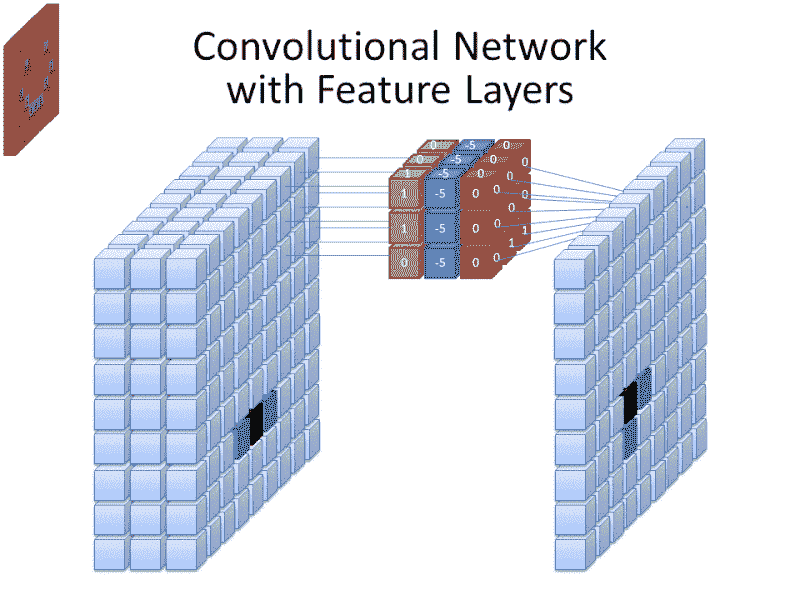
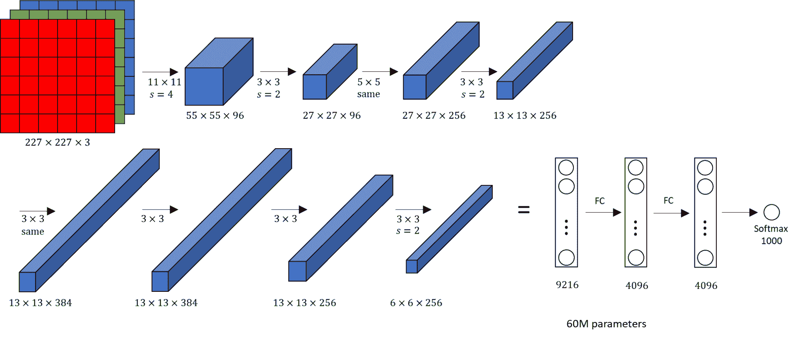
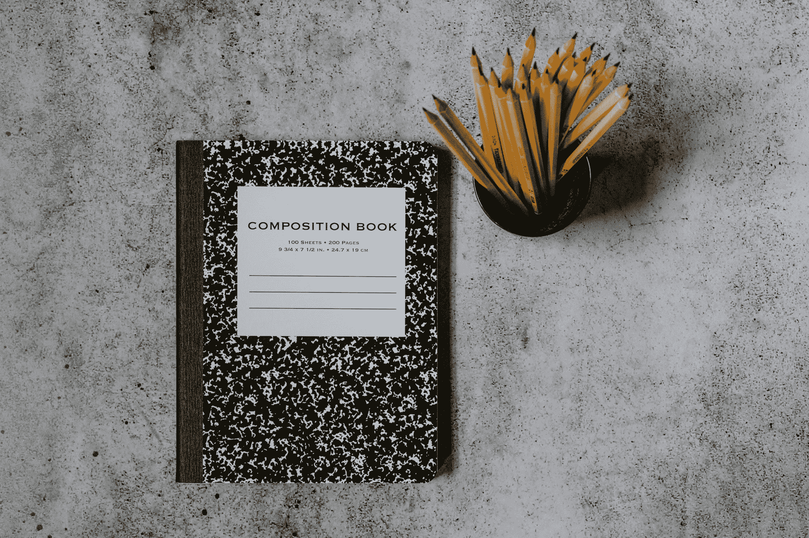

# 迁移学习的完整直观指南(第 1 部分)

> 原文：<https://blog.paperspace.com/transfer-learning-explained/>

过去十年，深度学习的进步非常迅速。虽然神经网络的发现发生在大约 60 年前，心理学家 Frank Rosenblatt 于 1958 年发明了第一个人工神经网络(称为“感知机”)，但该领域的发展直到大约十年前才获得真正的普及。2009 年最受欢迎的成就是 ImageNet 的创建。ImageNet 是一个庞大的视觉数据集，它导致了一些最好的现代深度学习和计算机视觉项目。

ImageNet 由超过 1400 万张图像组成，这些图像经过手工注释，以表示每张图片中的特定对象。超过 100 万张图像也包含特定的边界框。这些边界框对于一些计算机视觉应用是有用的，例如对象检测、对象跟踪等等。在这个由两部分组成的系列文章中，我们将进一步了解 ImageNet 的重要性。

这篇文章(第一部分)将涵盖一个完整的理论指南，以获得对迁移学习的深刻直觉。在本系列的下一部分中，我们将深入探讨一个实用的实践指南，并实现一些迁移学习模型，包括一个人脸识别项目。让我们快速浏览一下目录，以理解本文将涉及的概念。请随意跳到您最想探索的概念。然而，如果你是第一次接触这个话题，通读整篇文章是明智的。

### 目录

*   介绍
*   了解卷积神经网络
    1。CNN 是如何工作的
    2？CNN 的基本实现
    3。潜入最大池层
*   学习迁移学习
*   微调背后的直觉
    1。了解微调
    2。最佳实践
*   探索几种迁移学习模式
    1。AlexNet
    2。VGG-16
*   结论

## 介绍

随着我们在深度学习领域取得的所有成就和持续进展，如果我们不利用所有这些学到的知识来帮助执行复杂的任务，那将是一种耻辱。一种常见的做法是使用迁移学习，即在新的环境中应用预先训练好权重的模型。

在本文中，我们将特别关注卷积神经网络(CNN)，它在大多数计算机视觉任务中被利用。在我们对细胞神经网络有了一个基本的直觉之后，我们将继续学习更多关于迁移学习和与这个主题相关的几个重要方面，包括微调。我们最后将探讨几个典型的迁移学习模型及其用例。在下一篇文章中，我们将在人脸识别问题的背景下深入研究它们的实际实现。

## 理解卷积神经网络



Image from [Wiki](https://upload.wikimedia.org/wikipedia/commons/thumb/1/1e/Convolutional_Neural_Network_NeuralNetworkFeatureLayers.gif/800px-Convolutional_Neural_Network_NeuralNetworkFeatureLayers.gif)

卷积神经网络是一类人工深度神经网络。它们也被称为 ConvNets，或简称为 CNN。卷积神经网络松散地受到某些生物过程的启发，主要来自动物视觉皮层中神经元的活动。为了用简单的术语全面了解它们的工作过程，必须注意到这些 CNN 利用过滤器将复杂的模式变成更小更简单的东西，以便分析、解释和容易可视化。我们将在第 2 部分对此进行更详细的讨论。

二维卷积神经网络主要用于解决具有深度学习的计算机视觉问题。其中包括与手写识别、手势识别、情感识别等相关的任务。虽然它们的主要用途是计算机视觉应用，但并不局限于此。通过使用一维卷积层，我们甚至可以在自然语言处理任务中实现相当高的预测精度。然而，就本文而言，我们将仅限于研究二维卷积层。

在接下来的几节中，我们将详细分析卷积神经网络的完整工作原理，了解它们的基本实现，最后讨论 max-pooling 层。事不宜迟，我们开始吧。

### CNN 是如何工作的


Image From [Wiki](https://commons.wikimedia.org/wiki/File:2D_Convolution_Animation.gif)

在上图中，我们有一个$(6 \乘以 6)$矩阵，它与一个大小为$(3 \乘以 3)$的核进行卷积。卷积层涉及使用在层输入上“卷积”的核来产生输出张量。上图中的$(3 \乘以 3)$内核通常被称为“Sobel 边缘检测器”，或“水平边缘检测器”。通常，当$(6 \乘以 6)$矩阵与$(3 \乘以 3)$核卷积时，得到的输出矩阵将具有$(4 \乘以 4)$的形状。为了达到这个结果，执行了一系列分量乘法。换句话说，卷积基本上是一种寻找合适点积的方法。

如上图所示，我们最终得到一个$(6 \乘以 6)$矩阵，如下所示:

```
array([[9, 8, 6, 6, 8, 9],
       [8, 2, 1, 1, 2, 8],
       [6, 1, 0, 0, 1, 6],
       [6, 1, 0, 0, 1, 6],
       [8, 2, 1, 1, 2, 8],
       [9, 8, 6, 6, 8, 9]]) 
```

我们的输出矩阵与输入矩阵大小相同的原因是由于填充的实现。通过填充，初始的$(6 \乘以 6)$输入矩阵被用围绕整个矩阵的附加层“填充”，因此，它被转换成$(8 \乘以 8)$矩阵。填充操作有两种主要类型:

1.  **补零:**在整个矩阵周围加一层零。这种方法通常是更常用的方法。
2.  **相同值填充:**试图复制最近的行或列中的值。

使用 CNN 时需要知道的另一个基本概念是步幅。步幅是每个特定评估中考虑的移动次数。我们可以注意到上图中只有一个单独的步幅。在卷积层的特定实现中，我们可以有任意数量的步长和填充值。可以用 [TensorFlow](https://blog.paperspace.com/absolute-guide-to-tensorflow/) 和 [Keras](https://blog.paperspace.com/the-absolute-guide-to-keras/) 实现过滤器的数量、内核大小、填充类型、步数和激活函数(以及其他参数)。最终的输出大小由输入形状、内核大小、填充类型和步数决定。

### CNN 的基本实现

在了解了卷积层和卷积神经网络的完整工作过程之后，现在让我们看看如何使用 TensorFlow 和 Keras 深度学习框架来实现其中的一些架构。在深入研究代码之前，强烈建议您查看我以前关于这些主题的文章，这些文章详细介绍了 [TensorFlow](https://blog.paperspace.com/absolute-guide-to-tensorflow/) 和 [Keras](https://blog.paperspace.com/the-absolute-guide-to-keras/) 。让我们探索一个简单的示例代码块，它涵盖了卷积层和最大池层是如何实现的。

```
from tensorflow.keras.layers import Convolution2D, MaxPooling2D

Convolution2D(512, kernel_size=(3,3), activation='relu', padding="same")
MaxPooling2D((2,2), strides=(2,2))
```

实现完全相同代码的另一种方法如下:

```
from tensorflow.keras.layers import Conv2D, MaxPool2D

Conv2D(512, kernel_size=(3,3), activation='relu', padding="same")
MaxPool2D((2,2), strides=(2,2))
```

请注意，这些函数是彼此的别名。它们执行完全相同的功能，您可以根据自己的方便使用其中的一种。我建议你自己测试一下这些方法。值得注意的是，在未来的 Keras 版本中，一些别名可能会被弃用。跟上这些图书馆的发展总是一个好习惯。

```
keras.layers.Conv2D
keras.layers.Convolution2D
keras.layers.convolutional.Conv2D
keras.layers.convolutional.Convolution2D
```

上面的每一行都有相同的意思，是彼此的别名。您可以在方便的时候有效地使用这些方法。

### 潜入最大池层


Image from [Wiki](https://upload.wikimedia.org/wikipedia/commons/d/dc/RoI_pooling_animated.gif) depicting RoI pooling, size 2x2\. In this example the region proposal (an input parameter) has size 7x5.

最大池层用于对卷积层的空间维度进行下采样。这个过程主要是为了在对图像进行操作时创建位置不变性。在 max-pooling 层中，根据所提到的内核大小和跨度来选择特定的矩阵集。一旦选择了这些矩阵，就选择最大值作为该特定像元的输出。对其他较小的矩阵重复该操作，以接收每个单元所需的输出。上图描述了一个大小为$(2 \乘以 2)$的 RoI 池示例。在本例中，区域建议(输入参数)的大小为$(7 \乘以 5)$。

大多数卷积层之后是最大池层。最大池对于卷积神经网络的最佳性能至关重要。这些图层引入了位置不变性，这意味着图像中要素的位置不会影响网络检测它们的能力。它们还引入了其他类型的不变性，例如缩放不变性(图像的大小或形状不影响结果)和旋转不变性(图像的旋转角度不影响结果)，以及许多其他重要的优点。

## 学习迁移学习

如今，你很少会看到一个完整的神经网络的实现，它具有从零开始构建的随机权重初始化。典型的数据集太小了，以至于当只针对这种特定于任务的数据进行训练时，无法实现高性能的模型。如今，深度学习中最常见的做法是进行迁移学习。

迁移学习包括使用一个已经在大型数据语料库上训练过的网络，然后在一个较小的特定于手头任务的数据集上重新训练(或“微调”)它。这些模型通常在大型数据集上训练，如 [ImageNet](https://www.image-net.org/) ，其中包括数百万张图像。从该预训练中学习的权重被保存并用于模型初始化。

迁移学习有三种主要场景:作为固定特征提取器的 ConvNets、微调和预训练模型。在本文的这一部分中，我们将重点关注作为固定特征提取器和预训练模型的 ConvNets。在接下来的部分中，我们将更深入地讨论微调这个话题。

当使用 ConvNet 作为固定特征提取器时，典型的操作是将最终输出层替换为一个层，该层将包含借助 SoftMax 函数进行多类计算所需的输出节点数。另一方面，预训练模型是具有存储为检查点的最佳权重的模型，并且可以用于在数据集上直接测试性能，而不包括任何额外的训练过程。这种情况的主要用例是当网络需要很长时间训练时(即使使用强大的 GPU)，您可以使用最佳保存的权重来获得测试数据的合适结果。下面的一个例子是 [Caffe 模型动物园](https://github.com/BVLC/caffe/wiki/Model-Zoo)，在这里人们分享他们的网络权重，这样其他人就可以在他们自己的项目中使用它们。

## 微调背后的直觉

现代深度学习最重要的策略之一就是微调。在接下来的章节中，我们的主要目标是理解微调的概念和最佳实践，这将引导程序员获得最佳结果。

### 了解微调

微调不仅包括替换我们正在使用的预训练网络的最终密集输出层，还包括对新数据集的分类器进行重新训练。从业者最常用的策略是仅微调迁移学习架构的顶层，以避免过度拟合。因此，在大多数情况下，早期的层通常保持原样。

### 最佳实践

在对网络进行微调之前，有几个因素必须在实践中加以考虑:新数据集是小于还是大于最初训练网络的数据集，以及它与原始数据集的相似程度。

1.  *新数据集较小，与原始数据集相似-* 对于与原始数据集非常相似的较小数据集，最好跳过微调方法，因为这可能会导致过拟合。
2.  *新数据集很大，并且与原始数据集相似-* 这个场景非常适合迁移学习。当我们有一个与原始数据集非常相似的大型数据集时，我们可以相应地进行微调，以获得令人难以置信的结果。
3.  *新数据集很小，但与原始数据集非常不同-* 与我们之前的讨论类似，因为数据集很小，所以最好的想法是使用线性分类器。然而，由于新数据集与原始数据集非常不同，为了获得更好的性能，从网络中较早的某处激活来训练 SVM 分类器可能会更好。
4.  *新数据集很大，并且与原始数据集非常不同-* 当数据集很大时，微调从来都不是一个坏主意。即使新数据集与原始数据集有很大不同，我们通常也可以只排除网络的顶部。

我喜欢使用下面的代码对迁移学习模型进行微调。

```
# Convolutional Layer
Conv1 = Conv2D(filters=32, kernel_size=(3,3), strides=(1,1), padding='valid',
               data_format='channels_last', activation='relu', 
               kernel_initializer=keras.initializers.he_normal(seed=0), 
               name='Conv1')(input_layer)

# MaxPool Layer
Pool1 = MaxPool2D(pool_size=(2,2),strides=(2,2),padding='valid', 
                  data_format='channels_last',name='Pool1')(Conv1)

# Flatten
flatten = Flatten(data_format='channels_last',name='Flatten')(Pool1)

# Fully Connected layer-1
FC1 = Dense(units=30, activation='relu', 
            kernel_initializer=keras.initializers.glorot_normal(seed=32), 
            name='FC1')(flatten)

# Fully Connected layer-2
FC2 = Dense(units=30, activation='relu', 
            kernel_initializer=keras.initializers.glorot_normal(seed=33),
            name='FC2')(FC1)

# Output layer
Out = Dense(units=num_classes, activation='softmax', 
            kernel_initializer=keras.initializers.glorot_normal(seed=3), 
            name='Output')(FC2)
```

无论您选择使用什么，重要的是要注意，需要进行试验和大量的实现，以确保获得最佳结果。深度学习的妙处在于随机性的因素。许多最好的结果只有通过尝试许多新方法才能获得。

既然我们已经对卷积神经网络和迁移学习的工作有了相当好的理解，让我们根据它们在历史上的重要性和那些通常用于实现快速、高质量结果的迁移学习模型来探索一些迁移学习模型。对于微调主题的进一步阅读，我强烈建议查看斯坦福大学的网站，了解视觉识别卷积神经网络课程的迁移学习，网址是[下面的网站](https://cs231n.github.io/transfer-learning/)。

## 探索几种迁移学习模式

在文章的这一部分，我们将研究几个迁移学习架构，即 AlexNet 和 VGG-16。让我们用一些图像表示来简单地探索这些模型，以获得这些主题的概述。在下一篇关于“迁移学习的完整实践指南”的文章中，我们将探索三种不同类型的迁移学习模型以及一些实际实现，即 ResNet50、InceptionV3 和 MobileNetV2。现在，让我们来看看和理解 AlexNet 和 VGG-16 架构。

### 1.AlexNet



[Image Source](http://datahacker.rs/deep-learning-alexnet-architecture/)

LeNet-5 取得初步成功后，AlexNet 随后增加了深度。这个架构是在 2012 年由 Alex Krizhevsky 和他的同事在题为“使用深度卷积神经网络的 ImageNet 分类”的[研究论文](https://papers.nips.cc/paper/2012/file/c399862d3b9d6b76c8436e924a68c45b-Paper.pdf)中提出的。AlexNet 同年获得 ImageNet 大规模视觉识别挑战赛冠军。在 AlexNet 架构中，我们有一个输入图像，它经过卷积层和 max-pooling 层两次。然后，我们让它通过一系列三个卷积层，后面是一个最大池层。经过这一步，我们有三个隐藏层，然后输出。在 AlexNet 中，最终阶段的整体计算将为每个图像产生一个 4096-D 向量，该向量包含分类器之前的隐藏层的激活。虽然大多数层将利用 ReLU 激活功能，但最后一层利用 SoftMax 激活。

### 2.VGG-16


[Image Source](https://neurohive.io/en/popular-networks/vgg16/)

VGG-16 中的“VGG”代表“视觉几何群”。它与牛津大学的科学和工程系有联系。在最初阶段，这种体系结构用于研究大规模分类的准确性。现在，VGG-16 架构最常见的用途主要是解决人脸识别和图像分类等任务。从上面的图像表示中，我们可以注意到大小为$(224，224)$的 RGB 图像通常通过它的层。一个$2X$的卷积层后跟一个最大池层被利用了三次，然后一个$3X$的卷积层后跟一个最大池层被利用了两次。最后，三个隐藏层之后是由 SoftMax 激活函数实现的具有 1000 个节点的输出层。所有其他层通常利用 ReLU 激活功能。

## 结论



Photo by [Kelly Sikkema](https://unsplash.com/@kellysikkema?utm_source=ghost&utm_medium=referral&utm_campaign=api-credit) / [Unsplash](https://unsplash.com/?utm_source=ghost&utm_medium=referral&utm_campaign=api-credit)

有了迁移学习模型的新知识，我们更快地理解了一些用于解决深度学习中复杂任务的常用工具。深度学习有一个漫长而陡峭的学习曲线，有大量的发现有待发现。迁移学习使该领域的研究人员能够用更少的数据获得更好的结果。

在本文中，我们涵盖了理解迁移学习如何工作以及如何在实践中使用这些模型所需的大部分基本概念。我们从卷积神经网络(CNN)开始，这是迁移学习最常用的模型之一。然后，我们了解了迁移学习模型的众多实施方法，并重点关注了其实施的微调方面。最后，我们探讨了许多迁移学习模型中的一些，这些模型可供我们创建独特的项目。

虽然本文的重点是迁移学习的理论方面，但我们才刚刚开始！在下一篇文章中，我们将深入研究几种流行的迁移学习技术，并实现一个人脸识别项目。我们将讨论如何从零开始构建这样一个模型，并利用一些流行的迁移学习模型来比较它们如何处理实时问题。在那之前，继续学习探索吧！