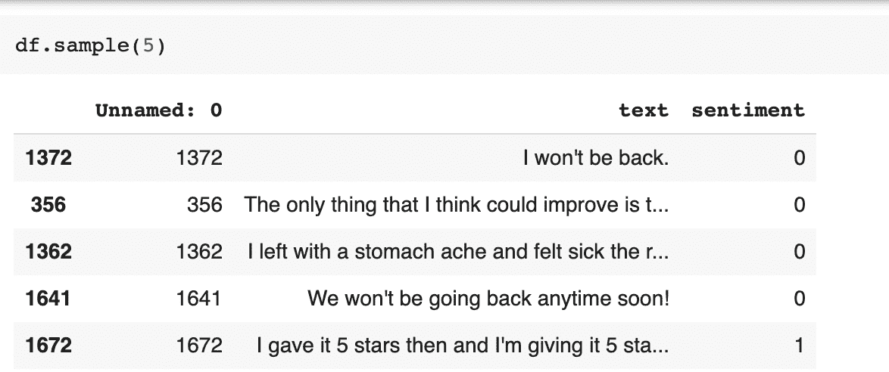
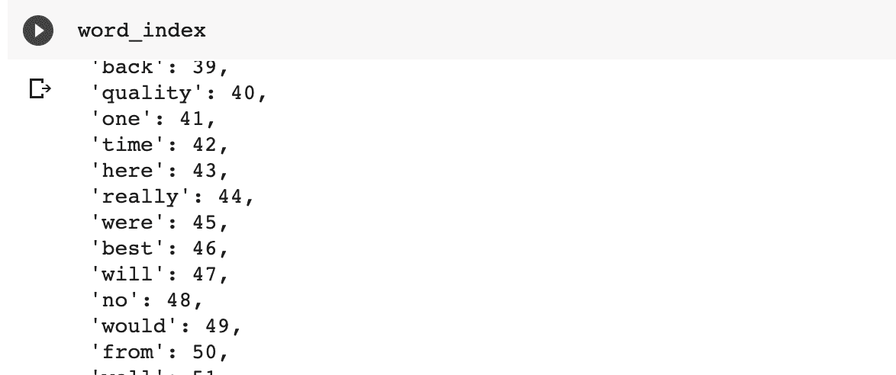
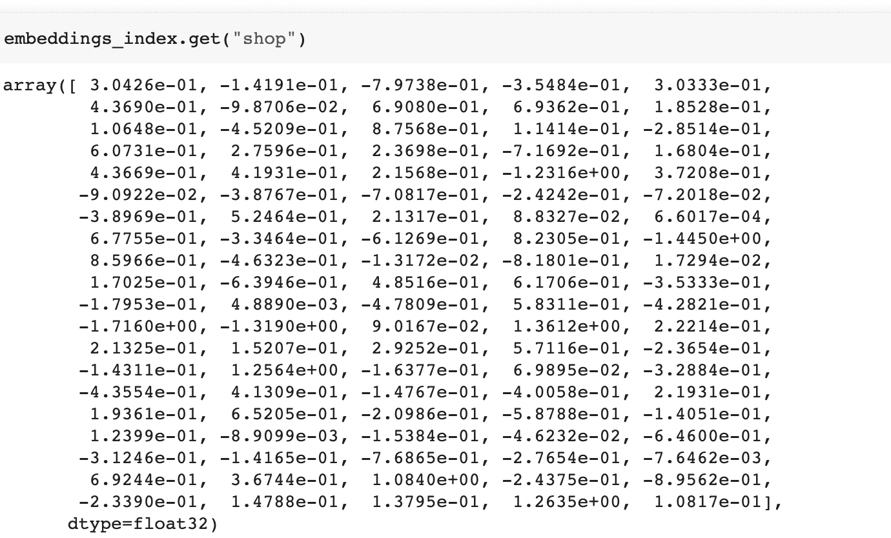
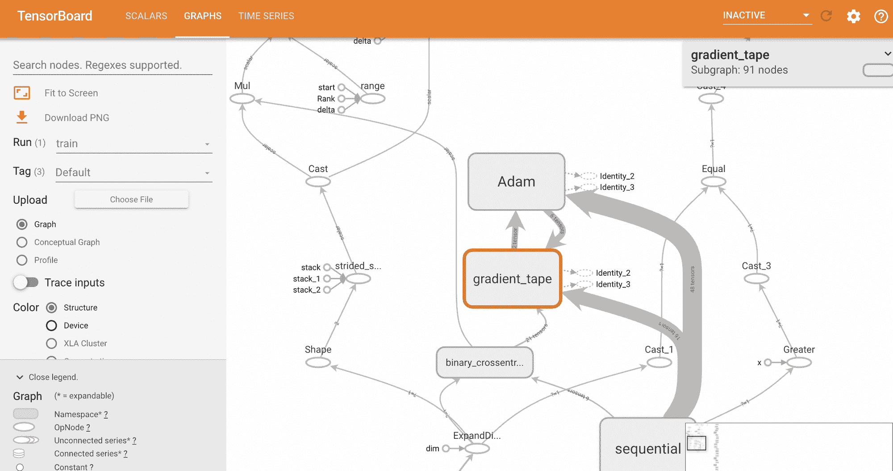

# 自然语言处理中使用预训练单词嵌入的指南

> 原文：<https://blog.paperspace.com/pre-trained-word-embeddings-natural-language-processing/>

与其他问题相比，处理文本数据的过程略有不同。这是因为数据通常是文本形式的。因此，你必须弄清楚如何以机器学习模型可以理解的数字形式来表示数据。在本文中，我们将看看如何做到这一点。最后，您将使用 TensorFlow 建立一个深度学习模型，对给定的文本进行分类。

让我们开始吧。请注意，您可以从渐变社区笔记本的免费 GPU 上运行本教程中的所有代码。

## 加载数据

第一步是下载和加载数据。我们将使用的数据是一个情感分析数据集。它有两列；一个有情感，另一个有标签。让我们下载并加载它。

```
!wget --no-check-certificate \    https://drive.google.com/uc?id=13ySLC_ue6Umt9RJYSeM2t-V0kCv-4C-P -O /tmp/sentiment.csv \    -O /tmp/sentiment.csv
import pandas as pd
df = pd.read_csv('/tmp/sentiment.csv')
```

这是一个数据样本。



现在让我们选择特性和目标，然后将数据分成训练集和测试集。

```
X = df['text']
y = df['sentiment']
from sklearn.model_selection import train_test_split
X_train, X_test , y_train, y_test = train_test_split(X, y , test_size = 0.20)
```

## 数据预处理

由于这是文本数据，有几件事你必须清理它。这包括:

*   将所有句子转换成小写
*   删除所有引号
*   用一些数字形式表示所有的单词
*   删除特殊字符，如`@`和`%`

以上都可以在 TensorFlow 中使用`Tokenizer`实现。该类需要几个参数:

*   `num_words`:希望包含在单词索引中的最大单词数
*   `oov_token`:用来表示在单词字典中找不到的单词的标记。这通常发生在处理训练数据时。数字 1 通常用于表示“词汇表之外”的令牌(“oov”令牌)

一旦用首选参数实例化了训练集上的`Tokenizer`,就用`fit_on_texts`函数来拟合它。

```
from keras.preprocessing.text import Tokenizer
vocab_size = 10000
oov_token = "<OOV>"
tokenizer = Tokenizer(num_words = vocab_size, oov_token=oov_token)
tokenizer.fit_on_texts(X_train)
```

`word_index`可以用来显示单词到数字的映射。

```
word_index = tokenizer.word_index
```



## 将文本转换为序列

下一步是将每种情绪表示为一系列数字。这可以使用`texts_to_sequences`功能来完成。

```
X_train_sequences = tokenizer.texts_to_sequences(X_train)
```

这是这些序列的样子。


让我们对测试集做同样的事情。当您检查序列样本时，您可以看到不在词汇表中的单词由`1`表示。

```
X_test_sequences = tokenizer.texts_to_sequences(X_test) 
```


## 填充序列

目前，这些序列有不同的长度。通常，您会将相同长度的序列传递给机器学习模型。因此，您必须确保所有序列的长度相同。这是通过填充序列来完成的。较长的序列将被截断，而较短的序列将用零填充。因此，您必须声明截断和填充类型。

让我们从定义每个序列的最大长度、填充类型和截断类型开始。填充和截断类型“post”意味着这些操作将发生在序列的末尾。

```
max_length = 100
padding_type='post'
truncation_type='post'
```

有了这些，让我们开始填充`X_test_sequences`。这是在传递上面定义的参数时使用`pad_sequences`函数完成的。

```
from keras.preprocessing.sequence import pad_sequences

X_test_padded = pad_sequences(X_test_sequences,maxlen=max_length, 
                               padding=padding_type, truncating=truncation_type)
```

对`X_train_sequences`也应该这样做。

```
X_train_padded = pad_sequences(X_train_sequences,maxlen=max_length, padding=padding_type, 
                       truncating=truncation_type)
```

打印最终结果显示，在序列的末尾添加了零，使它们具有相同的长度。


## 使用手套词嵌入

TensorFlow 使您能够训练单词嵌入。然而，这一过程不仅需要大量数据，而且可能是时间和资源密集型的。为了应对这些挑战，你可以使用预先训练的单词嵌入。让我们用斯坦福大学的 [GloVe(全局向量)](https://nlp.stanford.edu/projects/glove/)单词嵌入来说明如何做到这一点。这些嵌入是从表示在同一向量空间中相似的单词中获得的。也就是说，负面的词会聚集在一起，正面的词也是如此。

第一步是获得单词嵌入，并将它们添加到字典中。之后，您需要为训练集中的每个单词创建一个嵌入矩阵。让我们从下载手套单词嵌入开始。

```
!wget --no-check-certificate \
     http://nlp.stanford.edu/data/glove.6B.zip \
     -O /tmp/glove.6B.zip
```

下一步是将它们提取到一个临时文件夹中。

```
import os
import zipfile
with zipfile.ZipFile('/tmp/glove.6B.zip', 'r') as zip_ref:
    zip_ref.extractall('/tmp/glove')
```

接下来，用这些嵌入创建字典。让我们使用`glove.6B.100d.tx`嵌入。名称中的`100`与为序列选择的最大长度相同。

```
import numpy as np
embeddings_index = {}
f = open('/tmp/glove/glove.6B.100d.txt')
for line in f:
    values = line.split()
    word = values[0]
    coefs = np.asarray(values[1:], dtype='float32')
    embeddings_index[word] = coefs
f.close()

print('Found %s word vectors.' % len(embeddings_index))
```

下一步是为前面获得的单词索引中的每个单词创建单词嵌入矩阵。如果一个单词在 GloVe 中没有嵌入，它将呈现一个零矩阵。

```
embedding_matrix = np.zeros((len(word_index) + 1, max_length))
for word, i in word_index.items():
    embedding_vector = embeddings_index.get(word)
    if embedding_vector is not None:
        # words not found in embedding index will be all-zeros.
        embedding_matrix[i] = embedding_vector
```

下面是单词“shop”的单词 embedding 的样子。



## 创建 Keras 嵌入层

下一步是使用上面获得的嵌入作为 Keras 嵌入层的权重。你还必须将该层的`trainable`参数设置为`False`，这样就不会被训练。如果再次进行训练，权重将被重新初始化。这将类似于从零开始训练单词嵌入。还有几件其他事情需要注意:

*   嵌入层将第一个参数作为词汇表的大小。添加`1`是因为`0`通常保留用于填充
*   `input_length`是输入序列的长度
*   `output_dim`是密集嵌入的维数

```
from tensorflow.keras.layers import Embedding, LSTM, Dense, Bidirectional

embedding_layer = Embedding(input_dim=len(word_index) + 1,
                            output_dim=max_length,
                            weights=[embedding_matrix],
                            input_length=max_length,
                            trainable=False)
```

## 创建张量流模型

下一步是在 Keras 模型中使用嵌入层。让我们将模型定义如下:

*   作为第一层的嵌入层
*   两个双向 LSTM 层确保信息双向流动
*   完全连接的层，以及
*   负责最终输出的最终层

```
from tensorflow.keras.models import Sequential
model = Sequential([
    embedding_layer,
    Bidirectional(LSTM(150, return_sequences=True)), 
    Bidirectional(LSTM(150)),
    Dense(128, activation='relu'),
   Dense(1, activation='sigmoid')
])
```

## 训练模型

下一步是编译和训练模型。

```
model.compile(loss='binary_crossentropy',optimizer='adam',metrics=['accuracy']) 
```

当模型正在训练时，您可以设置一个`EarlyStopping`回调，以便在模型停止改进时停止训练过程。还可以设置 TensorBoard 回调，以便稍后快速查看模型的性能。

```
from tensorflow.keras.callbacks import EarlyStopping, TensorBoard
%load_ext tensorboard
rm -rf logs

log_folder = 'logs'
callbacks = [
            EarlyStopping(patience = 10),
            TensorBoard(log_dir=log_folder)
            ]
num_epochs = 600
history = model.fit(X_train_padded, y_train, epochs=num_epochs, validation_data=(X_test_padded, y_test),callbacks=callbacks)
```

可以使用`evaluate`方法快速检查模型的性能。

```
loss, accuracy = model.evaluate(X_test_padded,y_test)
print('Test accuracy :', accuracy)
```


## 形象化

从日志目录启动 TensorBoard 可以看到模型的性能。

```
%tensorboard --logdir logs
```


您也可以使用 TensorBoard 的图形部分来深入可视化模型。



## 最后的想法

在本文中，您已经通过一个示例了解了如何在自然语言处理问题中使用预先训练的单词嵌入。您可以尝试通过以下方式改进这一模式:

*   改变词汇的大小
*   使用不同的[预训练单词嵌入](http://vectors.nlpl.eu/repository/)
*   使用不同的模型架构

您也可以通过在 Gradient Community 笔记本中的免费 GPU 上运行这个示例来尝试一下。