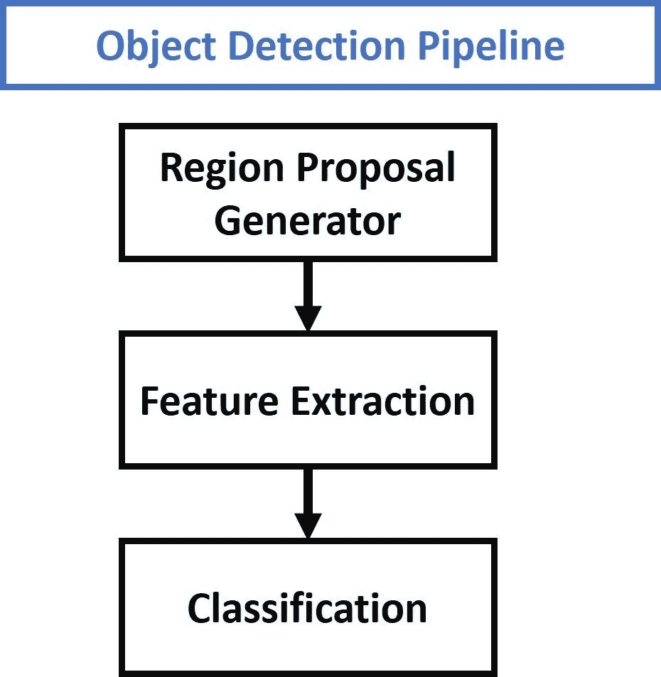
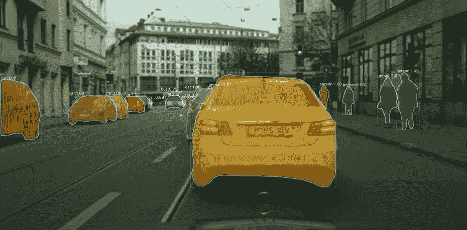
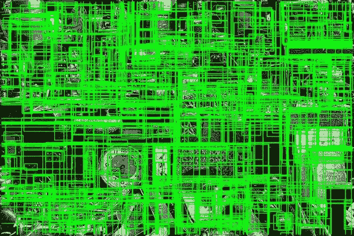
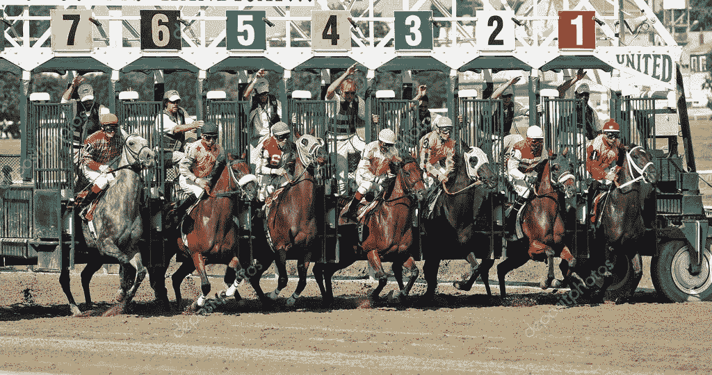
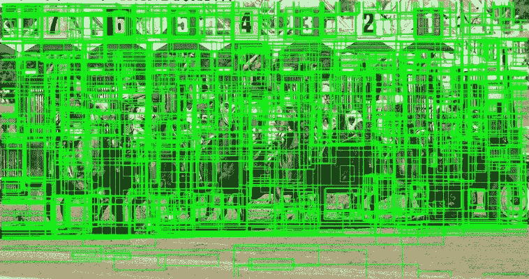
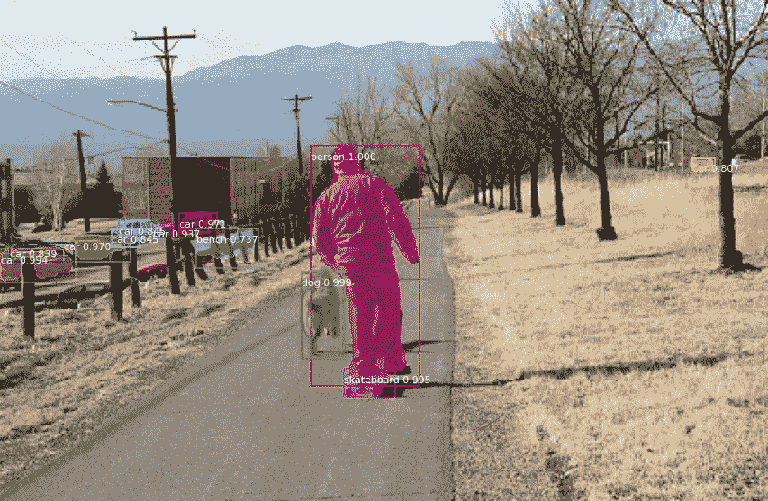
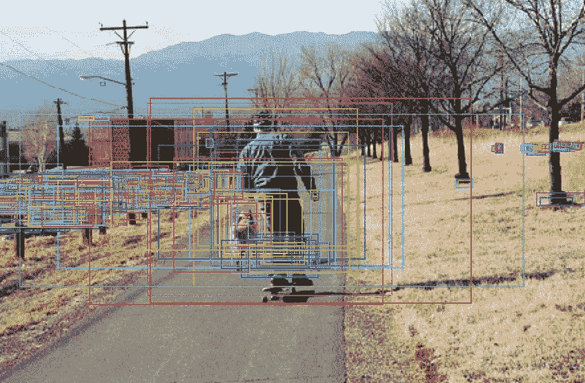
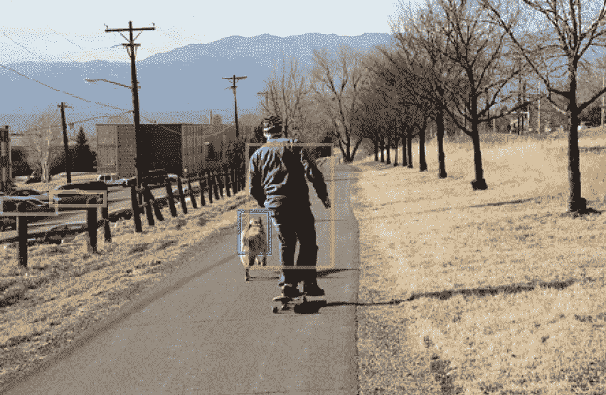
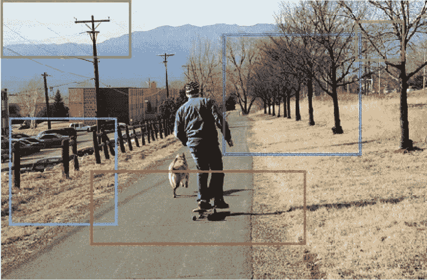

# 基于 Keras 的有向掩模 R-CNN 的目标检测

> 原文：<https://blog.paperspace.com/object-detection-directed-mask-r-cnn-keras/>

对象检测是一种重要的计算机视觉应用，它使计算机能够看到图像内部的内容。由于对象在图像中的位置不可预测，所以存在密集的计算来处理整个图像以定位对象。

随着卷积神经网络(CNN)的出现，检测物体的时间已经减少，因此物体可能在几秒钟内被检测到(就像你只看一次( [YOLO](https://blog.paperspace.com/how-to-implement-a-yolo-object-detector-in-pytorch/) )模型)。但是即使 YOLO 速度很快，它的准确性也不如它的速度令人印象深刻。一个更精确的模型，但不幸的是需要更多的时间，是基于[地区的 CNN (R-CNN)](http://openaccess.thecvf.com/content_cvpr_2014/papers/Girshick_Rich_Feature_Hierarchies_2014_CVPR_paper.pdf) 。

本教程是对 R-CNN 的扩展，称为[遮罩 R-CNN](http://openaccess.thecvf.com/content_ICCV_2017/papers/He_Mask_R-CNN_ICCV_2017_paper.pdf) ，将它指向物体的候选位置。由此产生的模型被称为[导向面具 R-CNN](https://github.com/ahmedfgad/Mask-RCNN-TF2/tree/master/mrcnn_directed) 。当有关于物体位置的先验信息时，它工作得很好。

本教程的大纲如下:

1.  R-CNN 模型概述
2.  区域提议
3.  操纵由区域提议网络(RPN)产生的区域
4.  定向屏蔽 R-CNN
5.  参考

## **R-CNN 模型概述**

根据我以前的一个名为[更快的 R-CNN 的 Paperspace 博客教程，针对对象检测任务](https://blog.paperspace.com/faster-r-cnn-explained-object-detection)进行了解释，下图给出了对象检测模型涵盖的三个主要步骤。



第一步负责提出候选区域。这一步的输出只是一些**可能**包含对象的区域。在第二步中，独立处理每个区域以确定是否存在对象。这是通过提取一组足以描述该区域的特征来完成的。最后，来自每个区域的特征被馈送到一个分类器，该分类器预测是否存在对象。如果有一个对象，那么分类器预测它的类别标签。

这个管道是根据正在使用的模型定制的。R-CNN 模型在[本文](http://openaccess.thecvf.com/content_cvpr_2014/papers/Girshick_Rich_Feature_Hierarchies_2014_CVPR_paper.pdf)中有描述。下图给出了它的流程图。

使用**选择性搜索**算法生成区域建议。该算法返回大量区域，其中图像中的对象很可能在这些区域之一中。

在 ImageNet 数据集上预先训练的 CNN 用于从每个区域提取特征。在 R-CNN 模型的末尾，区域特征向量被馈送到特定于类别的支持向量机(SVM ),以预测对象的类别标签。


R-CNN 模型的一个缺点是该模型不能被端到端地训练，并且之前讨论的 3 个步骤是独立的。为了解决这个问题，R-CNN 架构被修改为一个新的扩展。这种更新的架构被称为更快的 R-CNN(在本文的[中介绍)，其中:](https://papers.nips.cc/paper/5638-faster-r-cnn-towards-real-time-object-detection-with-region-proposal-networks.pdf)

*   区域提议网络(RPN)取代了选择性搜索算法。
*   RPN 连接到预训练的 CNN，在那里它们两者可以被端到端地训练。
*   SVM 分类器由预测每个类别概率的 Softmax 层代替。

更快的 R-CNN 只是一个由 3 部分组成的大网络，其中训练从 RPN 开始端到端地进行，直到 Softmax 层。

如需了解更多信息，请查看此 Paperspace 博客教程:[更快的 R-CNN 解释对象检测任务](https://blog.paperspace.com/faster-r-cnn-explained--object-detection)。

[Mask R-CNN](http://openaccess.thecvf.com/content_ICCV_2017/papers/He_Mask_R-CNN_ICCV_2017_paper.pdf) 型号是更快 R-CNN 的扩展版本。除了预测对象位置之外，还返回对象的二进制掩码。这有助于将对象从背景中分割出来。



下一节集中在区域提案，解释本教程的主要贡献之一；即使用静态而不是动态的区域提议。

## **地区提案**

区域建议生成器(如选择性搜索或 RPN)生成大量可能有对象的区域。目标检测模型消耗的大部分时间只是检查每个区域是否包含目标。它以许多被拒绝的区域和少数包含对象的被接受的区域结束。

下面的 Python 代码( [source](https://learnopencv.com/selective-search-for-object-detection-cpp-python) )使用 OpenCV 生成区域建议，并在图像上绘制它们。它调整图像的大小，使其高度为 400 像素。代码只显示 1000 个地区。您可以更改这些数字，并检查结果如何变化。

```
import sys
import cv2

img_path = "img.jpg"

im = cv2.imread(img_path)
newHeight = 400
newWidth = int(im.shape[1]*400/im.shape[0])
im = cv2.resize(im, (newWidth, newHeight))    

ss = cv2.ximgproc.segmentation.createSelectiveSearchSegmentation()
ss.setBaseImage(im)

# High recall Selective Search
ss.switchToSelectiveSearchQuality()

rects = ss.process()
print('Total Number of Region Proposals: {}'.format(len(rects)))

numShowRects = 1000
imOut = im.copy()

for i, rect in enumerate(rects):
  if (i < numShowRects):
    x, y, w, h = rect
    cv2.rectangle(imOut, (x, y), (x+w, y+h), (0, 255, 0), 1, cv2.LINE_AA)
  else:
    break

cv2.imshow("Output", imOut)

cv2.imwrite("SS_out.jpg", imOut)
```

在将一个样本图像输入该代码后，总共找到了 **18，922 个**区域建议。下图显示了前 1000 个区域的边界框。



在一些对象检测应用中，您可能具有关于对象可能存在的候选位置的先验信息。这样，对象检测模型将通过只查看您提供的位置来节省时间。

在下一张图片中( [source](https://depositphotos.com/58983917/stock-photo-horse-race-starting-gate.html) )，我们已经有了马的位置信息，因为这些位置不会改变。只有 7 个地区值得关注。因此，与其要求对象检测模型浪费时间搜索区域提议，不如将这 7 个区域提供给模型要容易得多。模型只会决定一匹马是否存在。



不幸的是，像 Mask R-CNN 这样的目标检测模型无法明确告诉他们候选区域。因此，该模型从零开始，并花时间搜索所有可能存在对象的区域方案。它可能会也可能不会搜索您希望它搜索的地区。

选择性搜索算法检测到 20K 个区域建议，其中只有 1000 个区域显示在下图中。因此，该模型将花费时间在所有区域上工作，而实际上只有 7 个区域是感兴趣的。



## **屏蔽 R-CNN Keras 示例**

名为 [matterport/Mask_RCNN](https://github.com/matterport/Mask_RCNN) 的现有 GitHub 项目提供了使用 TensorFlow 1 的 Mask R-CNN 模型的 Keras 实现。为了使用 TensorFlow 2，该项目在 [ahmedgad/Mask-RCNN-TF2](https://github.com/ahmedfgad/Mask-RCNN-TF2) 项目中进行了扩展，该项目将在本教程中用于构建 Mask R-CNN 和 [**定向 Mask R-CNN**](https://github.com/ahmedfgad/Mask-RCNN-TF2/tree/master/mrcnn_directed) 。

本节仅给出一个使用掩码 R-CNN 模型加载和进行预测的示例。下面的代码加载模型的预训练权重，然后检测对象。该模型在 COCO 对象检测数据集上进行训练。

该项目有一个名为`model`的模块，其中有一个名为`MaskRCNN`的类。创建该类的一个实例来加载 Mask R-CNN 模型的架构。使用`load_weights()`方法加载预训练的模型权重。

加载模型后，它就可以进行预测了。图像被读取并输入到`detect()`方法。此方法返回 4 个输出，分别代表以下内容:

1.  检测对象的感兴趣区域(ROI)。
2.  预测的类别标签。
3.  班级成绩。
4.  分段遮罩。

最后，调用`visualize`模块中的`display_instances()`函数来突出显示检测到的对象。

```
import mrcnn
import mrcnn.config
import mrcnn.model
import mrcnn.visualize
import cv2
import os

CLASS_NAMES = ['BG', 'person', 'bicycle', 'car', 'motorcycle', 'airplane', 'bus', 'train', 'truck', 'boat', 'traffic light', 'fire hydrant', 'stop sign', 'parking meter', 'bench', 'bird', 'cat', 'dog', 'horse', 'sheep', 'cow', 'elephant', 'bear', 'zebra', 'giraffe', 'backpack', 'umbrella', 'handbag', 'tie', 'suitcase', 'frisbee', 'skis', 'snowboard', 'sports ball', 'kite', 'baseball bat', 'baseball glove', 'skateboard', 'surfboard', 'tennis racket', 'bottle', 'wine glass', 'cup', 'fork', 'knife', 'spoon', 'bowl', 'banana', 'apple', 'sandwich', 'orange', 'broccoli', 'carrot', 'hot dog', 'pizza', 'donut', 'cake', 'chair', 'couch', 'potted plant', 'bed', 'dining table', 'toilet', 'tv', 'laptop', 'mouse', 'remote', 'keyboard', 'cell phone', 'microwave', 'oven', 'toaster', 'sink', 'refrigerator', 'book', 'clock', 'vase', 'scissors', 'teddy bear', 'hair drier', 'toothbrush']

class SimpleConfig(mrcnn.config.Config):
    NAME = "coco_inference"
    GPU_COUNT = 1
    IMAGES_PER_GPU = 1

    NUM_CLASSES = len(CLASS_NAMES)

model = mrcnn.model.MaskRCNN(mode="inference", 
                             config=SimpleConfig(),
                             model_dir=os.getcwd())

model.load_weights(filepath="mask_rcnn_coco.h5", 
                   by_name=True)

image = cv2.imread("test.jpg")
image = cv2.cvtColor(image, cv2.COLOR_BGR2RGB)

r = model.detect([image])

r = r[0]

mrcnn.visualize.display_instances(image=image, 
                                  boxes=r['rois'], 
                                  masks=r['masks'], 
                                  class_ids=r['class_ids'], 
                                  class_names=CLASS_NAMES, 
                                  scores=r['scores'])
```

下面的图像是在前面的代码中提供的，以显示事情是如何工作的。


下图显示了带标签的对象。每个对象都有一个边界框、遮罩、类别标签和一个预测分数。



要了解更多有关使用 TensorFlow 1 和 2 在 Keras 中使用 Mask R-CNN 的信息，请查看以下资源:

*   [使用带 TensorFlow 1.14 和 Keras 的 Mask R-CNN 进行目标检测](https://blog.paperspace.com/mask-r-cnn-in-tensorflow-2-0)
*   [使用带 TensorFlow 2.0 和 Keras 的 Mask R-CNN 进行目标检测](https://blog.paperspace.com/mask-r-cnn-tensorflow-2-0-keras)

为了达到本教程的目的，即构建一个只调查一组预定义区域的定向掩码 R-CNN，下一节将讨论如何操作区域建议网络(RPN)来检索和编辑区域建议。

## **操纵由区域提议网络(RPN)产生的区域**

Mask R-CNN 架构中负责产生区域提议的部分是(正如您可能已经猜到的)区域提议网络(RPN)。它使用锚的概念，这有助于产生不同比例和长宽比的区域建议。

在 [Mask_RCNN](https://github.com/matterport/Mask_RCNN) 项目中，有一个被称为`ProposalLayer`的层，它接收锚，过滤它们，并产生许多区域提议。用户可以定制返回区域的数量。

默认情况下，调用`detect()`方法后返回的模型输出是 ROI、类标签、预测分数和分段掩码。该部分编辑模型以返回由`ProposalLayer`返回的区域建议，然后调查这些区域。

本质上，`MaskRCNN`类被编辑，因此它的最后一层变成了`ProposalLayer`。下面是返回地区建议的`MaskRCNN`类的简化代码。

```
class MaskRCNN():

    def __init__(self, mode, config, model_dir):
        assert mode in ['training', 'inference']
        self.mode = mode
        self.config = config
        self.model_dir = model_dir
        self.set_log_dir()
        self.keras_model = self.build(mode=mode, config=config)

    def build(self, mode, config):
        assert mode in ['training', 'inference']

        h, w = config.IMAGE_SHAPE[:2]
        if h / 2**6 != int(h / 2**6) or w / 2**6 != int(w / 2**6):
            raise Exception("Image size must be dividable by 2 at least 6 times "
                            "to avoid fractions when downscaling and upscaling."
                            "For example, use 256, 320, 384, 448, 512, ... etc. ")

        input_image = KL.Input(
            shape=[None, None, config.IMAGE_SHAPE[2]], name="input_image")
        input_image_meta = KL.Input(shape=[config.IMAGE_META_SIZE],
                                    name="input_image_meta")

        input_anchors = KL.Input(shape=[None, 4], name="input_anchors")

        if callable(config.BACKBONE):
            _, C2, C3, C4, C5 = config.BACKBONE(input_image, stage5=True,
                                                train_bn=config.TRAIN_BN)
        else:
            _, C2, C3, C4, C5 = resnet_graph(input_image, config.BACKBONE,
                                             stage5=True, train_bn=config.TRAIN_BN)
        P5 = KL.Conv2D(config.TOP_DOWN_PYRAMID_SIZE, (1, 1), name='fpn_c5p5')(C5)
        P4 = KL.Add(name="fpn_p4add")([
            KL.UpSampling2D(size=(2, 2), name="fpn_p5upsampled")(P5),
            KL.Conv2D(config.TOP_DOWN_PYRAMID_SIZE, (1, 1), name='fpn_c4p4')(C4)])
        P3 = KL.Add(name="fpn_p3add")([
            KL.UpSampling2D(size=(2, 2), name="fpn_p4upsampled")(P4),
            KL.Conv2D(config.TOP_DOWN_PYRAMID_SIZE, (1, 1), name='fpn_c3p3')(C3)])
        P2 = KL.Add(name="fpn_p2add")([
            KL.UpSampling2D(size=(2, 2), name="fpn_p3upsampled")(P3),
            KL.Conv2D(config.TOP_DOWN_PYRAMID_SIZE, (1, 1), name='fpn_c2p2')(C2)])

        P2 = KL.Conv2D(config.TOP_DOWN_PYRAMID_SIZE, (3, 3), padding="SAME", name="fpn_p2")(P2)
        P3 = KL.Conv2D(config.TOP_DOWN_PYRAMID_SIZE, (3, 3), padding="SAME", name="fpn_p3")(P3)
        P4 = KL.Conv2D(config.TOP_DOWN_PYRAMID_SIZE, (3, 3), padding="SAME", name="fpn_p4")(P4)
        P5 = KL.Conv2D(config.TOP_DOWN_PYRAMID_SIZE, (3, 3), padding="SAME", name="fpn_p5")(P5)

        P6 = KL.MaxPooling2D(pool_size=(1, 1), strides=2, name="fpn_p6")(P5)

        rpn_feature_maps = [P2, P3, P4, P5, P6]

        anchors = input_anchors

        rpn = build_rpn_model(config.RPN_ANCHOR_STRIDE,
                              len(config.RPN_ANCHOR_RATIOS), config.TOP_DOWN_PYRAMID_SIZE)

        layer_outputs = [] 
        for p in rpn_feature_maps:
            layer_outputs.append(rpn([p]))

        output_names = ["rpn_class_logits", "rpn_class", "rpn_bbox"]
        outputs = list(zip(*layer_outputs))
        outputs = [KL.Concatenate(axis=1, name=n)(list(o))
                   for o, n in zip(outputs, output_names)]

        rpn_class_logits, rpn_class, rpn_bbox = outputs

        proposal_count = config.POST_NMS_ROIS_INFERENCE
        rpn_rois = ProposalLayer(
            proposal_count=proposal_count,
            nms_threshold=config.RPN_NMS_THRESHOLD,
            name="ROI",
            config=config)([rpn_class, rpn_bbox, anchors])

        model = KM.Model([input_image, input_image_meta, input_anchors], 
                         rpn_rois, 
                         name='mask_rcnn')

        if config.GPU_COUNT > 1:
            from mrcnn.parallel_model import ParallelModel
            model = ParallelModel(model, config.GPU_COUNT)

        return model
```

因为`detect()`方法期望模型返回关于检测对象的信息，如 ROI，所以必须编辑该方法，因为模型现在返回区域建议。下面给出了这个方法的新代码。

```
def detect(self, images, verbose=0):
    assert self.mode == "inference", "Create model in inference mode."
    assert len(images) == self.config.BATCH_SIZE, "len(images) must be equal to BATCH_SIZE"

    if verbose:
        log("Processing {} images".format(len(images)))
        for image in images:
            log("image", image)
    molded_images, image_metas, windows = self.mold_inputs(images)
    image_shape = molded_images[0].shape
    for g in molded_images[1:]:
        assert g.shape == image_shape, "After resizing, all images must have the same size. Check IMAGE_RESIZE_MODE and image sizes."

    anchors = self.get_anchors(image_shape)
    anchors = np.broadcast_to(anchors, (self.config.BATCH_SIZE,) + anchors.shape)

    if verbose:
        log("molded_images", molded_images)
        log("image_metas", image_metas)
        log("anchors", anchors)

    rois = self.keras_model.predict([molded_images, image_metas, anchors], verbose=0)

    return rois
```

要获得新的 [`model.py`](https://github.com/ahmedfgad/Mask-RCNN-TF2/blob/master/mrcnn_directed/model.py) 文件的完整代码，该文件应用了`ProposalLayer`层和`detect()`方法中的更改，请点击[这里](https://github.com/ahmedfgad/Mask-RCNN-TF2/tree/master/mrcnn_directed)。

下一个代码块给出了一个示例，它使用新的`MaskRCNN`类来返回区域建议，并将它们绘制在图像上。你可以在这里找到剧本[。](https://github.com/ahmedfgad/Mask-RCNN-TF2/blob/master/maskrcnn_predict_directed.py)

与之前的示例相比，模块名称从`mrcnn`更改为`mrcnn_directed`。

```
import mrcnn_directed
import mrcnn_directed.config
import mrcnn_directed.model
import mrcnn_directed.visualize
import cv2
import os

CLASS_NAMES = ['BG', 'person', 'bicycle', 'car', 'motorcycle', 'airplane', 'bus', 'train', 'truck', 'boat', 'traffic light', 'fire hydrant', 'stop sign', 'parking meter', 'bench', 'bird', 'cat', 'dog', 'horse', 'sheep', 'cow', 'elephant', 'bear', 'zebra', 'giraffe', 'backpack', 'umbrella', 'handbag', 'tie', 'suitcase', 'frisbee', 'skis', 'snowboard', 'sports ball', 'kite', 'baseball bat', 'baseball glove', 'skateboard', 'surfboard', 'tennis racket', 'bottle', 'wine glass', 'cup', 'fork', 'knife', 'spoon', 'bowl', 'banana', 'apple', 'sandwich', 'orange', 'broccoli', 'carrot', 'hot dog', 'pizza', 'donut', 'cake', 'chair', 'couch', 'potted plant', 'bed', 'dining table', 'toilet', 'tv', 'laptop', 'mouse', 'remote', 'keyboard', 'cell phone', 'microwave', 'oven', 'toaster', 'sink', 'refrigerator', 'book', 'clock', 'vase', 'scissors', 'teddy bear', 'hair drier', 'toothbrush']

class SimpleConfig(mrcnn_directed.config.Config):
    NAME = "coco_inference"

    GPU_COUNT = 1
    IMAGES_PER_GPU = 1

    NUM_CLASSES = len(CLASS_NAMES)

model = mrcnn_directed.model.MaskRCNN(mode="inference", 
                                      config=SimpleConfig(),
                                      model_dir=os.getcwd())

model.load_weights(filepath="mask_rcnn_coco.h5", 
                   by_name=True)

image = cv2.imread("test.jpg")
image = cv2.cvtColor(image, cv2.COLOR_BGR2RGB)

r = model.detect([image], verbose=0)

r = r[0]

r2 = r.copy()

r2[:, 0] = r2[:, 0] * image.shape[0]
r2[:, 2] = r2[:, 2] * image.shape[0]
r2[:, 1] = r2[:, 1] * image.shape[1]
r2[:, 3] = r2[:, 3] * image.shape[1]

mrcnn_directed.visualize.display_instances(image=image, 
                                           boxes=r2)
```

代码运行后，输入图像将显示区域建议的边界框。区域建议的数量是 1000，可以通过设置`SimpleConfig`类中的`POST_NMS_ROIS_INFERENCE`属性来更改。



以下是模型返回的前 4 个区域建议:

```
r[0]
Out[8]: array([0.49552074, 0.0, 0.53763664, 0.09105143], dtype=float32)

r[1]
Out[9]: array([0.5294977, 0.39210293, 0.63644147, 0.44242138], dtype=float32)

r[2]
Out[10]: array([0.36204672, 0.40500385, 0.6706183 , 0.54514766], dtype=float32)

r[3]
Out[11]: array([0.48107424, 0.08110721, 0.51513755, 0.17086479], dtype=float32)
```

区域的坐标范围从 0.0 到 1.0。为了将它们返回到原始比例，区域坐标乘以图像的宽度和高度。以下是新的值:

```
r2[0]
array([144.19653, 0.0, 156.45226, 40.517887], dtype=float32)

r2[1]
Out[5]: array([154.08383, 174.48581, 185.20447, 196.87752], dtype=float32)

r2[2]
Out[6]: array([105.3556, 180.22672, 195.14992, 242.59071], dtype=float32)

r2[3]
Out[7]: array([139.9926, 36.09271, 149.90503, 76.03483], dtype=float32)
```

请注意，有大量的区域需要处理。如果这个数字减少了，那么模型就会快很多。下一节将讨论如何指导 Mask R-CNN 模型，其中用户告诉模型要在哪些区域中搜索对象。

## **定向屏蔽 R-CNN**

与使用 RPN 搜索区域提议的掩码 R-CNN 模型相比，**定向掩码 R-CNN** 仅在一些用户定义的区域内搜索。因此，定向掩模 R-CNN 适用于对象可以位于一些预定义的区域集合中的应用。定向屏蔽 R-CNN 的代码可在[这里](https://github.com/ahmedfgad/Mask-RCNN-TF2/tree/master/mrcnn_directed)获得。

我们可以从一个实验开始，在这个实验中，模型被迫只保留前 4 个区域建议。这里的想法是将保存区域提议的张量乘以掩码，对于前 4 个区域提议的坐标，该掩码被设置为 1.0，否则为 0.0。

在`ProposalLayer`结束时，正好在`return proposals`行之前，可以使用以下 3 行。

```
zeros = np.zeros(shape=(1, self.config.POST_NMS_ROIS_INFERENCE, 4), dtype=np.float32)
zeros[0, :4, :] = 1.0

proposals = KL.Multiply()([proposals, tf.convert_to_tensor(zeros)])
```

这里是只使用了 4 个区域的`ProposalLayer`的新代码。

```
class ProposalLayer(KE.Layer):
    def __init__(self, proposal_count, nms_threshold, config=None, **kwargs):
        super(ProposalLayer, self).__init__(**kwargs)
        self.config = config
        self.proposal_count = proposal_count
        self.nms_threshold = nms_threshold

    def call(self, inputs):
        scores = inputs[0][:, :, 1]
        deltas = inputs[1]
        deltas = deltas * np.reshape(self.config.RPN_BBOX_STD_DEV, [1, 1, 4])
        anchors = inputs[2]

        pre_nms_limit = tf.minimum(self.config.PRE_NMS_LIMIT, tf.shape(anchors)[1])
        ix = tf.nn.top_k(scores, pre_nms_limit, sorted=True,
                         name="top_anchors").indices
        scores = utils.batch_slice([scores, ix], lambda x, y: tf.gather(x, y),
                                   self.config.IMAGES_PER_GPU)
        deltas = utils.batch_slice([deltas, ix], lambda x, y: tf.gather(x, y),
                                   self.config.IMAGES_PER_GPU)
        pre_nms_anchors = utils.batch_slice([anchors, ix], lambda a, x: tf.gather(a, x),
                                    self.config.IMAGES_PER_GPU,
                                    names=["pre_nms_anchors"])

        boxes = utils.batch_slice([pre_nms_anchors, deltas],
                                  lambda x, y: apply_box_deltas_graph(x, y),
                                  self.config.IMAGES_PER_GPU,
                                  names=["refined_anchors"])

        window = np.array([0, 0, 1, 1], dtype=np.float32)
        boxes = utils.batch_slice(boxes,
                                  lambda x: clip_boxes_graph(x, window),
                                  self.config.IMAGES_PER_GPU,
                                  names=["refined_anchors_clipped"])

        def nms(boxes, scores):
            indices = tf.image.non_max_suppression(
                boxes, scores, self.proposal_count,
                self.nms_threshold, name="rpn_non_max_suppression")
            proposals = tf.gather(boxes, indices)
            # Pad if needed
            padding = tf.maximum(self.proposal_count - tf.shape(proposals)[0], 0)
            proposals = tf.pad(proposals, [(0, padding), (0, 0)])
            return proposals
        proposals = utils.batch_slice([boxes, scores], nms,
                                      self.config.IMAGES_PER_GPU)

        zeros = np.zeros(shape=(1, self.config.POST_NMS_ROIS_INFERENCE, 4), dtype=np.float32)
        zeros[0, :4, :] = 1.0

        proposals = KL.Multiply()([proposals, tf.convert_to_tensor(zeros)])

        return proposals

    def compute_output_shape(self, input_shape):
        return (None, self.proposal_count, 4)
```

下图显示了 4 个区域。



也可以通过硬编码它们的值来为模型提供您自己的自定义坐标，但是它们必须在 0.0 和 1.0 之间缩放。

以下代码分配 5 个区域建议的静态坐标值。

```
zeros = np.zeros(shape=(1, self.config.POST_NMS_ROIS_INFERENCE, 4), dtype=np.float32)

zeros[0, 0, :] = [0.0,  0.0 ,  0.2,   0.3]
zeros[0, 1, :] = [0.42, 0.02,  0.8,   0.267]
zeros[0, 2, :] = [0.12, 0.52,  0.55,  0.84]
zeros[0, 3, :] = [0.61, 0.71,  0.87,  0.21]
zeros[0, 4, :] = [0.074, 0.83, 0.212, 0.94]

proposals = tf.convert_to_tensor(zeros)
```

`ProposalLayer`的代码现在可以简化为以下内容。

```
class ProposalLayer(KE.Layer):
    def __init__(self, proposal_count, nms_threshold, config=None, **kwargs):
        super(ProposalLayer, self).__init__(**kwargs)
        self.config = config

    def call(self, inputs):
        zeros = np.zeros(shape=(1, self.config.POST_NMS_ROIS_INFERENCE, 4), dtype=np.float32)

        zeros[0, 0, :] = [0.0,  0.0 ,  0.2,   0.3]
        zeros[0, 1, :] = [0.42, 0.02,  0.8,   0.267]
        zeros[0, 2, :] = [0.12, 0.52,  0.55,  0.84]
        zeros[0, 3, :] = [0.61, 0.71,  0.87,  0.21]
        zeros[0, 4, :] = [0.074, 0.83, 0.212, 0.94]

        proposals = tf.convert_to_tensor(zeros)

        return proposals
```

下图显示了用户指定的 5 个区域的边界框。这样，用户迫使模型在预定义的区域内搜索对象。



注意，`Config`类中的`POST_NMS_ROIS_INFERENCE`属性的默认值是 1000，这意味着前面的代码在 1000 个区域中搜索对象。如果您想在特定数量的区域中搜索对象，您可以在`Config`类中设置`POST_NMS_ROIS_INFERENCE`属性，如下面的代码所示。这迫使模型只能在 5 个区域上工作。

```
class SimpleConfig(mrcnn_directed.config.Config):
    NAME = "coco_inference"

    GPU_COUNT = 1
    IMAGES_PER_GPU = 1

    NUM_CLASSES = len(CLASS_NAMES)

    POST_NMS_ROIS_INFERENCE = 5
```

下一节将讨论与[屏蔽 R-CNN](https://github.com/ahmedfgad/Mask-RCNN-TF2/tree/master/mrcnn) 相比，[定向屏蔽 R-CNN](https://github.com/ahmedfgad/Mask-RCNN-TF2/tree/master/mrcnn_directed) 的 Python 实现中的变化。

## **定向屏蔽 R-CNN 的变化**

[在这里](https://github.com/ahmedfgad/Mask-RCNN-TF2/tree/master/mrcnn_directed)你可以找到所有实现定向屏蔽 R-CNN 的文件。最重要的文件是 [`model.py`](https://github.com/ahmedfgad/Mask-RCNN-TF2/blob/master/mrcnn_directed/model.py) 。

与 [mrcnn](https://github.com/ahmedfgad/Mask-RCNN-TF2/tree/master/mrcnn) 目录相比，有 4 个变化:

1.  `config.Config`级。
2.  `ProposalLayer`级。
3.  `MaskRCNN`级。
4.  `visualize.display_instances()`法。

### **第一次更改**

第一个变化是 [`mrcnn_directed.config.Config`](https://github.com/ahmedfgad/Mask-RCNN-TF2/blob/master/mrcnn_directed/config.py) 类有了一个新的属性叫做 [`REGION_PROPOSALS`](https://github.com/ahmedfgad/Mask-RCNN-TF2/blob/dcbe06229bebc6a67c8da4548d93159192594d6f/mrcnn_directed/config.py#L24) 。该属性的默认值是`None`，这意味着区域提议将由 RPN 生成。 [`REGION_PROPOSALS`](https://github.com/ahmedfgad/Mask-RCNN-TF2/blob/dcbe06229bebc6a67c8da4548d93159192594d6f/mrcnn_directed/config.py#L24) 属性在 [`mrcnn.config.Config`](https://github.com/ahmedfgad/Mask-RCNN-TF2/blob/master/mrcnn/config.py) 类中不存在。

用户可以设置该属性的值，以传递一些预定义的区域建议，模型将在这些区域中查看。这就是用户如何指导 Mask R-CNN 模型查看某些特定区域。

要使用 [`REGION_PROPOSALS`](https://github.com/ahmedfgad/Mask-RCNN-TF2/blob/dcbe06229bebc6a67c8da4548d93159192594d6f/mrcnn_directed/config.py#L24) 属性，首先创建一个形状为`(1, POST_NMS_ROIS_INFERENCE, 4)`的 NumPy 数组，其中`POST_NMS_ROIS_INFERENCE`是区域建议的数量。

在下一个代码块中，`POST_NMS_ROIS_INFERENCE`属性被设置为 5，以便只使用 5 个区域建议。创建新的 NumPy 个零数组，然后指定区域建议的坐标。

```
POST_NMS_ROIS_INFERENCE = 5

REGION_PROPOSALS = numpy.zeros(shape=(1, POST_NMS_ROIS_INFERENCE, 4), dtype=numpy.float32)

REGION_PROPOSALS[0, 0, :] = [0.49552074, 0\.        , 0.53763664, 0.09105143]
REGION_PROPOSALS[0, 1, :] = [0.5294977 , 0.39210293, 0.63644147, 0.44242138]
REGION_PROPOSALS[0, 2, :] = [0.36204672, 0.40500385, 0.6706183 , 0.54514766]
REGION_PROPOSALS[0, 3, :] = [0.48107424, 0.08110721, 0.51513755, 0.17086479]
REGION_PROPOSALS[0, 4, :] = [0.45803332, 0.15717855, 0.4798005 , 0.20352092]
```

之后，创建一个 [`mrcnn_directed.config.Config`](https://github.com/ahmedfgad/Mask-RCNN-TF2/blob/master/mrcnn_directed/config.py) 类的实例，将 2 个属性`POST_NMS_ROIS_INFERENCE`和 [`REGION_PROPOSALS`](https://github.com/ahmedfgad/Mask-RCNN-TF2/blob/dcbe06229bebc6a67c8da4548d93159192594d6f/mrcnn_directed/config.py#L24) 设置为前面代码中创建的 2 个属性。这样，模型被迫使用上面定义的区域建议。

注意，如果 [`REGION_PROPOSALS`](https://github.com/ahmedfgad/Mask-RCNN-TF2/blob/dcbe06229bebc6a67c8da4548d93159192594d6f/mrcnn_directed/config.py#L24) 设置为`None`，那么区域建议将由 RPN 生成。这是第一个变化的结束。

```
class SimpleConfig(mrcnn_directed.config.Config):
    NAME = "coco_inference"
    GPU_COUNT = 1
    IMAGES_PER_GPU = 1
    NUM_CLASSES = len(CLASS_NAMES)

    POST_NMS_ROIS_INFERENCE = POST_NMS_ROIS_INFERENCE
    # If REGION_PROPOSALS is None, then the region proposals are produced by the RPN.
    # Otherwise, the user-defined region proposals are used.
    REGION_PROPOSALS = REGION_PROPOSALS
    # REGION_PROPOSALS = None
```

### **第二次变化**

第二个变化是除了 [mrcnn/model.py](https://github.com/ahmedfgad/Mask-RCNN-TF2/tree/master/mrcnn/model.py) 脚本中的 [mrcnn/ProposalLayer](https://github.com/ahmedfgad/Mask-RCNN-TF2/blob/dcbe06229bebc6a67c8da4548d93159192594d6f/mrcnn/model.py#L255) 类之外， [mrcnn_directed/model.py](https://github.com/ahmedfgad/Mask-RCNN-TF2/tree/master/mrcnn_directed/model.py) 脚本有了一个新的类，命名为 [`ProposalLayerDirected`](https://github.com/ahmedfgad/Mask-RCNN-TF2/blob/dcbe06229bebc6a67c8da4548d93159192594d6f/mrcnn_directed/model.py#L347) 。

[`ProposalLayerDirected`](https://github.com/ahmedfgad/Mask-RCNN-TF2/blob/dcbe06229bebc6a67c8da4548d93159192594d6f/mrcnn_directed/model.py#L347) 类处理在 [`REGION_PROPOSALS`](https://github.com/ahmedfgad/Mask-RCNN-TF2/blob/dcbe06229bebc6a67c8da4548d93159192594d6f/mrcnn_directed/config.py#L24) 属性中传递的用户定义的区域建议。 [`ProposalLayer`](https://github.com/ahmedfgad/Mask-RCNN-TF2/blob/dcbe06229bebc6a67c8da4548d93159192594d6f/mrcnn_directed/model.py#L254) 类照常处理由 RPN 生成的区域提议。

根据 [`REGION_PROPOSALS`](https://github.com/ahmedfgad/Mask-RCNN-TF2/blob/dcbe06229bebc6a67c8da4548d93159192594d6f/mrcnn_directed/config.py#L24) 属性是否设置为`None`，根据下一个代码决定使用哪一层。如果属性是`None`，则使用 [`ProposalLayer`](https://github.com/ahmedfgad/Mask-RCNN-TF2/blob/dcbe06229bebc6a67c8da4548d93159192594d6f/mrcnn_directed/model.py#L254) 类。否则，使用 [`ProposalLayerDirected`](https://github.com/ahmedfgad/Mask-RCNN-TF2/blob/dcbe06229bebc6a67c8da4548d93159192594d6f/mrcnn_directed/model.py#L347) 类。

```
if type(config.REGION_PROPOSALS) != type(None):
            proposal_count = config.POST_NMS_ROIS_TRAINING if mode == "training"\
                else config.POST_NMS_ROIS_INFERENCE
            rpn_rois = ProposalLayerDirected(proposal_count=proposal_count,
                                             nms_threshold=config.RPN_NMS_THRESHOLD,
                                             name="ROI",
                                             config=config)([rpn_class, rpn_bbox, anchors])
        else:
            proposal_count = config.POST_NMS_ROIS_TRAINING if mode == "training"\
                else config.POST_NMS_ROIS_INFERENCE
            rpn_rois = ProposalLayer(proposal_count=proposal_count,
                                     nms_threshold=config.RPN_NMS_THRESHOLD,
                                     name="ROI",
                                     config=config)([rpn_class, rpn_bbox, anchors])
```

### **第三次变化**

第三个变化是 [mrcnn/model.py](https://github.com/ahmedfgad/Mask-RCNN-TF2/tree/master/mrcnn/model.py) 脚本中的 [mrcnn/MaskRCNN](https://github.com/ahmedfgad/Mask-RCNN-TF2/blob/dcbe06229bebc6a67c8da4548d93159192594d6f/mrcnn/model.py#L1820) 类被替换为 [mrcnn_directed/model.py](https://github.com/ahmedfgad/Mask-RCNN-TF2/tree/master/mrcnn_directed/model.py) 脚本中的 2 个类:

1.  [`MaskRCNNDirectedRPN`](https://github.com/ahmedfgad/Mask-RCNN-TF2/blob/dcbe06229bebc6a67c8da4548d93159192594d6f/mrcnn_directed/model.py#L2867) :这个类用于只返回区域提议层的输出。根据 [`REGION_PROPOSALS`](https://github.com/ahmedfgad/Mask-RCNN-TF2/blob/dcbe06229bebc6a67c8da4548d93159192594d6f/mrcnn_directed/config.py#L24) 属性是否为`None`,[`MaskRCNNDirectedRPN`](https://github.com/ahmedfgad/Mask-RCNN-TF2/blob/dcbe06229bebc6a67c8da4548d93159192594d6f/mrcnn_directed/model.py#L2867)类既可以返回由 RPN 生成的区域建议，也可以返回用户定义的区域建议(为了确保一切正常)。
2.  [`MaskRCNNDirected`](https://github.com/ahmedfgad/Mask-RCNN-TF2/blob/dcbe06229bebc6a67c8da4548d93159192594d6f/mrcnn_directed/model.py#L1942) :该类用于检测返回的区域建议中的对象。根据 [`REGION_PROPOSALS`](https://github.com/ahmedfgad/Mask-RCNN-TF2/blob/dcbe06229bebc6a67c8da4548d93159192594d6f/mrcnn_directed/config.py#L24) 属性是否为`None`,[`MaskRCNNDirected`](https://github.com/ahmedfgad/Mask-RCNN-TF2/blob/dcbe06229bebc6a67c8da4548d93159192594d6f/mrcnn_directed/model.py#L1942)类可以检测 RPN 生成的区域建议或用户定义的区域建议中的对象。

根据以下代码，两个类 [`MaskRCNNDirectedRPN`](https://github.com/ahmedfgad/Mask-RCNN-TF2/blob/dcbe06229bebc6a67c8da4548d93159192594d6f/mrcnn_directed/model.py#L2867) 和 [`MaskRCNNDirected`](https://github.com/ahmedfgad/Mask-RCNN-TF2/blob/dcbe06229bebc6a67c8da4548d93159192594d6f/mrcnn_directed/model.py#L1942) 都以相同的方式实例化:

```
model = mrcnn_directed.model.MaskRCNNDirectedRPN(mode="inference", 
                                                 config=SimpleConfig(),
                                                 model_dir=os.getcwd())

model = mrcnn_directed.model.MaskRCNNDirected(mode="inference", 
                                              config=SimpleConfig(),
                                              model_dir=os.getcwd())
```

关于这两个类，真正重要的是`detect()`方法的输出。对于 [`MaskRCNNDirectedRPN`](https://github.com/ahmedfgad/Mask-RCNN-TF2/blob/dcbe06229bebc6a67c8da4548d93159192594d6f/mrcnn_directed/model.py#L2867) 类，`detect()`方法返回一个形状数组`(1, POST_NMS_ROIS_INFERENCE, 4)`。

对于 [`MaskRCNNDirected`](https://github.com/ahmedfgad/Mask-RCNN-TF2/blob/dcbe06229bebc6a67c8da4548d93159192594d6f/mrcnn_directed/model.py#L1942) 类，`detect()`方法返回以下形状的 4 个数组:

1.  `(POST_NMS_ROIS_INFERENCE, 4)`
2.  `(ImgHeight, ImgWidth, POST_NMS_ROIS_INFERENCE)`
3.  `(POST_NMS_ROIS_INFERENCE)`
4.  `(POST_NMS_ROIS_INFERENCE)`

其中`ImgHeight`和`ImgWidth`分别是输入图像的高度和宽度。

### **第四次变化**

第四个变化是，除了`visualize.py`脚本中的`visualize.display_instances()`方法，还有一个额外的方法叫做 [`display_instances_RPN()`](https://github.com/ahmedfgad/Mask-RCNN-TF2/blob/dcbe06229bebc6a67c8da4548d93159192594d6f/mrcnn_directed/visualize.py#L177) 。

[`display_instances()`](https://github.com/ahmedfgad/Mask-RCNN-TF2/blob/dcbe06229bebc6a67c8da4548d93159192594d6f/mrcnn_directed/visualize.py#L83) 方法通过在每个对象上显示边界框、类别标签、预测分数和分段掩码，对检测到的对象进行注释，就像我们之前所做的一样。这里有一个例子:

```
r = model.detect([image])
r = r[0]

mrcnn_directed.visualize.display_instances(image=image, 
                                           boxes=r['rois'], 
                                           masks=r['masks'], 
                                           class_ids=r['class_ids'], 
                                           class_names=CLASS_NAMES, 
                                           scores=r['scores'])
```

[`display_instances_RPN()`](https://github.com/ahmedfgad/Mask-RCNN-TF2/blob/dcbe06229bebc6a67c8da4548d93159192594d6f/mrcnn_directed/visualize.py#L177) 方法只是显示每个区域提议上的边界框。与 [`display_instances()`](https://github.com/ahmedfgad/Mask-RCNN-TF2/blob/dcbe06229bebc6a67c8da4548d93159192594d6f/mrcnn_directed/visualize.py#L83) 方法相比，它的争论更少。这里有一个例子:

```
r = model.detect([image])
r = r[0]

r2 = r.copy()

mrcnn_directed.visualize.display_instances_RPN(image=image, 
                                               boxes=r2)
```

## **使用定向屏蔽 R-CNN 的示例**

定向屏蔽 R-CNN 模型有两个主要用途:

1.  仅使用`MaskRCNNDirectedRPN`类处理区域提议。
2.  使用区域建议来注释使用`MaskRCNNDirected`类检测到的对象。

下一个代码块给出了一个使用了`MaskRCNNDirectedRPN`类的用户定义区域建议的例子。也可以将`SimpleConfig`类中的`REGION_PROPOSALS`属性设置为`None`，以强制模型使用 RPN 生成区域提议。

```
import mrcnn_directed
import mrcnn_directed.config
import mrcnn_directed.model
import mrcnn_directed.visualize
import cv2
import os
import numpy

CLASS_NAMES = ['BG', 'person', 'bicycle', 'car', 'motorcycle', 'airplane', 'bus', 'train', 'truck', 'boat', 'traffic light', 'fire hydrant', 'stop sign', 'parking meter', 'bench', 'bird', 'cat', 'dog', 'horse', 'sheep', 'cow', 'elephant', 'bear', 'zebra', 'giraffe', 'backpack', 'umbrella', 'handbag', 'tie', 'suitcase', 'frisbee', 'skis', 'snowboard', 'sports ball', 'kite', 'baseball bat', 'baseball glove', 'skateboard', 'surfboard', 'tennis racket', 'bottle', 'wine glass', 'cup', 'fork', 'knife', 'spoon', 'bowl', 'banana', 'apple', 'sandwich', 'orange', 'broccoli', 'carrot', 'hot dog', 'pizza', 'donut', 'cake', 'chair', 'couch', 'potted plant', 'bed', 'dining table', 'toilet', 'tv', 'laptop', 'mouse', 'remote', 'keyboard', 'cell phone', 'microwave', 'oven', 'toaster', 'sink', 'refrigerator', 'book', 'clock', 'vase', 'scissors', 'teddy bear', 'hair drier', 'toothbrush']

POST_NMS_ROIS_INFERENCE = 5

REGION_PROPOSALS = numpy.zeros(shape=(1, POST_NMS_ROIS_INFERENCE, 4), dtype=numpy.float32)

REGION_PROPOSALS[0, 0, :] = [0.0,  0.0 ,  0.2,   0.3]
REGION_PROPOSALS[0, 1, :] = [0.42, 0.02,  0.8,   0.267]
REGION_PROPOSALS[0, 2, :] = [0.12, 0.52,  0.55,  0.84]
REGION_PROPOSALS[0, 3, :] = [0.61, 0.71,  0.87,  0.21]
REGION_PROPOSALS[0, 4, :] = [0.074, 0.83, 0.212, 0.94]

class SimpleConfig(mrcnn_directed.config.Config):
    NAME = "coco_inference"
    GPU_COUNT = 1
    IMAGES_PER_GPU = 1
    NUM_CLASSES = len(CLASS_NAMES)

    POST_NMS_ROIS_INFERENCE = POST_NMS_ROIS_INFERENCE
    # If REGION_PROPOSALS is None, then the region proposals are produced by the RPN.
    # Otherwise, the user-defined region proposals are used.
    REGION_PROPOSALS = REGION_PROPOSALS
    # REGION_PROPOSALS = None

model = mrcnn_directed.model.MaskRCNNDirectedRPN(mode="inference", 
                                                 config=SimpleConfig(),
                                                 model_dir=os.getcwd())

model.load_weights(filepath="mask_rcnn_coco.h5", 
                   by_name=True)

image = cv2.imread("test.jpg")
image = cv2.cvtColor(image, cv2.COLOR_BGR2RGB)

r = model.detect([image], verbose=0)

r = r[0]

r2 = r.copy()

r2[:, 0] = r2[:, 0] * image.shape[0]
r2[:, 2] = r2[:, 2] * image.shape[0]
r2[:, 1] = r2[:, 1] * image.shape[1]
r2[:, 3] = r2[:, 3] * image.shape[1]

mrcnn_directed.visualize.display_instances_RPN(image=image, 
                                               boxes=r2)
```

下一个代码块给出了一个示例，除了处理区域建议之外，还注释了检测到的对象。注意使用了 [`MaskRCNNDirected`](https://github.com/ahmedfgad/Mask-RCNN-TF2/blob/dcbe06229bebc6a67c8da4548d93159192594d6f/mrcnn_directed/model.py#L1942) 类。此代码可在的[处获得。](https://github.com/ahmedfgad/Mask-RCNN-TF2/blob/master/maskrcnn_predict_directed.py)

也可以将`SimpleConfig`类中的`REGION_PROPOSALS`属性设置为`None`，以强制模型使用 RPN 生成区域建议。

```
import mrcnn_directed
import mrcnn_directed.config
import mrcnn_directed.model
import mrcnn_directed.visualize
import cv2
import os
import numpy

CLASS_NAMES = ['BG', 'person', 'bicycle', 'car', 'motorcycle', 'airplane', 'bus', 'train', 'truck', 'boat', 'traffic light', 'fire hydrant', 'stop sign', 'parking meter', 'bench', 'bird', 'cat', 'dog', 'horse', 'sheep', 'cow', 'elephant', 'bear', 'zebra', 'giraffe', 'backpack', 'umbrella', 'handbag', 'tie', 'suitcase', 'frisbee', 'skis', 'snowboard', 'sports ball', 'kite', 'baseball bat', 'baseball glove', 'skateboard', 'surfboard', 'tennis racket', 'bottle', 'wine glass', 'cup', 'fork', 'knife', 'spoon', 'bowl', 'banana', 'apple', 'sandwich', 'orange', 'broccoli', 'carrot', 'hot dog', 'pizza', 'donut', 'cake', 'chair', 'couch', 'potted plant', 'bed', 'dining table', 'toilet', 'tv', 'laptop', 'mouse', 'remote', 'keyboard', 'cell phone', 'microwave', 'oven', 'toaster', 'sink', 'refrigerator', 'book', 'clock', 'vase', 'scissors', 'teddy bear', 'hair drier', 'toothbrush']

POST_NMS_ROIS_INFERENCE = 5

REGION_PROPOSALS = numpy.zeros(shape=(1, POST_NMS_ROIS_INFERENCE, 4), dtype=numpy.float32)

REGION_PROPOSALS[0, 0, :] = [0.49552074, 0\.        , 0.53763664, 0.09105143]
REGION_PROPOSALS[0, 1, :] = [0.5294977 , 0.39210293, 0.63644147, 0.44242138]
REGION_PROPOSALS[0, 2, :] = [0.36204672, 0.40500385, 0.6706183 , 0.54514766]
REGION_PROPOSALS[0, 3, :] = [0.48107424, 0.08110721, 0.51513755, 0.17086479]
REGION_PROPOSALS[0, 4, :] = [0.45803332, 0.15717855, 0.4798005 , 0.20352092]

class SimpleConfig(mrcnn_directed.config.Config):
    NAME = "coco_inference"
    GPU_COUNT = 1
    IMAGES_PER_GPU = 1
    NUM_CLASSES = len(CLASS_NAMES)

    POST_NMS_ROIS_INFERENCE = POST_NMS_ROIS_INFERENCE
    # If REGION_PROPOSALS is None, then the region proposals are produced by the RPN.
    # Otherwise, the user-defined region proposals are used.
    REGION_PROPOSALS = REGION_PROPOSALS
    # REGION_PROPOSALS = None

model = mrcnn_directed.model.MaskRCNNDirected(mode="inference", 
                                              config=SimpleConfig(),
                                              model_dir=os.getcwd())

model.load_weights(filepath="mask_rcnn_coco.h5", 
                   by_name=True)

image = cv2.imread("test.jpg")
image = cv2.cvtColor(image, cv2.COLOR_BGR2RGB)

r = model.detect([image])

r = r[0]

mrcnn_directed.visualize.display_instances(image=image, 
                                           boxes=r['rois'], 
                                           masks=r['masks'], 
                                           class_ids=r['class_ids'], 
                                           class_names=CLASS_NAMES, 
                                           scores=r['scores'])
print(r['rois'].shape)
print(r['masks'].shape)
print(r['class_ids'].shape)
print(r['scores'].shape)
```

## **结论**

在本教程中，我们看到了如何编辑掩模 R-CNN 来建立一个有向网络，其中用户指定模型应该寻找对象的一些区域。减少模型处理的区域提议的数量减少了模型的计算时间。只有当对象在一些预定义的位置总是可见时，才能应用这一工作，例如车辆停靠站。

## **参考文献**

*   [更快的 R-CNN 对物体探测任务的解释，Paperspsce 博客](https://blog.paperspace.com/faster-r-cnn-explained-object-detection)
*   [使用带 TensorFlow 1.14 和 Keras 的 Mask R-CNN 进行目标检测](https://blog.paperspace.com/mask-r-cnn-in-tensorflow-2-0)
*   [使用带 TensorFlow 2.0 和 Keras 的 Mask R-CNN 进行目标检测](https://blog.paperspace.com/mask-r-cnn-tensorflow-2-0-keras)
*   [https://github . com/ahmedgad/mask-rcnn-TF 2](https://github.com/ahmedfgad/Mask-RCNN-TF2)
*   [https://github . com/ahmedfgad/Mask-RCNN-TF2/tree/master/Mr CNN _ directed](https://github.com/ahmedfgad/Mask-RCNN-TF2/tree/master/mrcnn_directed)
*   Girshick，Ross 等人，“用于精确对象检测和语义分割的丰富特征层次”*IEEE 计算机视觉和模式识别会议论文集*。2014 年
*   任，，等.〈快速 r-cnn:面向区域提议网络的实时目标检测.〉 *IEEE 模式分析与机器智能汇刊* 39.6 (2016): 1137-1149
*   何，，等《美国有线电视新闻网》*IEEE 计算机视觉国际会议论文集*。2017 年