# 基于样式的重新校准模块(SRM)通道注意

> 原文：<https://blog.paperspace.com/srm-channel-attention/>

计算机视觉中的通道注意机制的主题可能是最广泛研究的，相当于自然语言处理(NLP)领域中的变形金刚。自 2018 年发表的开创性工作以来，已经有了一些改进，称为挤压和激励网络，我们在本文的[中讨论过。挤压和激励等渠道关注方法是打破排行榜基准的核心。例如，在 ImageNet 分类中广泛流行的最先进(SOTA)模型称为高效网络，将挤压和激励模块列为其架构设计中的关键组件。频道关注机制的价值不仅仅是从性能提升的角度来看，还从可解释性的角度来看。](https://blog.paperspace.com/channel-attention-squeeze-and-excitation-networks/)

## 目录

1.  为什么要考虑渠道关注机制？
2.  SRM 动机
3.  主要贡献
4.  风格再校准模块(SRM)
    a .风格池
    b .风格整合
    c .复杂度
    d .与 SENets 的比较
    e .与 ECANets 的比较
5.  密码
6.  结果
7.  批评意见
8.  结论
9.  参考

## 为什么要考虑渠道关注方式？

让我们确保我们在如何评估注意力机制(在这种情况下，属于基于渠道的注意力方法的类别)方面达成一致。术语“通道”(称为$C$)被定义为(通常)输入到任何深度卷积神经网络(CNN)中的任何中间卷积层的四维张量或其输出中的各个特征映射。关注这些“渠道”实质上意味着指定哪一个渠道更重要或更不重要，随后给它打分或用学习到的关注程度来衡量它。因此，频道关注方法本质上指定了在训练过程中网络“关注什么”。通过使用 GradCAM 和 GradCAM++从可解释性的角度对这些模块进行了评估，这揭示了配备有通道注意方法的网络在图像中的标签特定对象上具有更紧的界限。


From Rotate to Attend: Convolutional Triplet Attention Module (WACV 2021)

考虑信道注意方法的第二个原因是，可以使用信道注意进行动态信道修剪或选通，以减少有效网络大小或动态计算复杂性，同时保持接近恒定的性能。在这个方向上有许多方法，最近和最重要的一个是高通的 ICLR 2020 论文，题为[学习条件通道门控网络的批量整形](https://openreview.net/forum?id=Bke89JBtvB)。

这一领域的主要缺点之一是这些频道关注模块增加的计算开销。虽然这些方法中的大多数是简单的即插即用模块，可以插入到深度 CNN 中的任何位置，但它们通常会向模型架构添加大量的附加参数和触发器。这也会导致延迟增加和吞吐量降低。然而，已经有几种方法来降低由这些模块引入的开销成本，这些方法已经成功地证明了利用简单的低成本模块化频道关注方法可以实现有竞争力的性能。

鉴于上述信息，让我们进入这篇文章的主要议程。我们将回顾另一种受流行的挤压和激发网络(SENetsTPAMI 和 CVPR 2018)，称为李等人在论文中提出的风格再校准模块(SRM)。艾尔。名为 [SRM:卷积神经网络的基于风格的重新校准模块](https://arxiv.org/pdf/1903.10829.pdf)。事不宜迟，我们将深入探讨 SRM 的动机，然后分析该模块的结构设计，最后通过研究结果及其 PyTorch 代码结束本文。

## 摘要

> 随着卷积神经网络风格转移的发展，风格在卷积神经网络中的作用越来越受到广泛关注。在本文中，我们的目的是充分利用风格的潜力，以改善一般视觉任务的细胞神经网络的表现。我们提出了一个基于风格的重新校准模块(SRM)，一个简单而有效的架构单元，它通过利用中间特征图的风格来自适应地重新校准中间特征图。SRM 首先通过样式池从特征图的每个通道中提取样式信息，然后通过独立于通道的样式集成来估计每个通道的重新校准权重。通过将各个风格的相对重要性结合到特征图中，SRM 有效地增强了 CNN 的表现能力。所提出的模块以可忽略的开销直接馈入现有的 CNN 架构。我们对一般图像识别以及与风格相关的任务进行了全面的实验，验证了 SRM 优于最近的方法，如挤压和激励(SE)。为了解释 SRM 和 SE 之间的内在差异，我们对它们的代表性属性进行了深入的比较。

## 动机

生成建模中一个深入探索的领域是图像风格化。一些有影响力的作品显示了利用风格背景进行基于图像的风格转换的潜力。虽然这些图像可能看起来更像是一种审美享受，但其背后的基础对于理解卷积网络的工作方式至关重要。conv 网络中潜在的风格属性也在不同的背景下进行了研究。很少有工作表明，被限制为仅依赖风格信息而不考虑空间上下文的 conv 网络在图像分类任务上做得很好。

风格属性是这项工作的两个激励因素之一，正如作者所说:

> 在这项工作中，我们进一步促进了 CNN 架构设计中风格的利用。我们的方法通过突出或抑制与任务相关的风格来动态丰富特征表示。

除了风格属性，注意力/特征再校准机制也是拼图的另一块。承认以前的注意力机制如聚集激发、挤压激发等的缺点。提出了一种新的轻量级高效通道注意机制:

> 与先前的努力相反，我们在利用风格信息方面重新制定了通道方式的重新校准，而没有通道关系或空间注意力的帮助。我们提出了一种风格池方法，它优于我们设置中的标准全局平均或最大池，以及一种独立于通道的风格集成方法，它实质上比完全连接的对应方更轻量级，但在各种场景中更有效。

## 贡献

本文的主要贡献如下:

> 我们提出了一个基于风格的特征再校准模块，它通过将风格合并到特征图中来增强 CNN 的表示能力。

> 尽管它的开销很小，但所提出的模块显著提高了网络在一般视觉任务以及风格相关任务中的性能。

> 通过深入分析以及消融研究，我们检查了我们的方法的内部行为和有效性。

## 样式重新校准模块

在本节中，我们将剖析本文中提出的 SRM 模块的精确结构设计，并将其与传统的挤压激励模块进行比较。

样式重新校准模块(SRM)由两个集成组件组成，称为*样式池*和*样式集成*。样式池负责从维度$(C \ast H \ast W)$的输入张量$X$生成维度$(C \ast d)$的样式特征$T$。然后，这些样式特征被传递到样式集成阶段，以生成 shape $(C \ast 1)$的样式权重$G$。然后，通过简单地按元素将$X$乘以$G$来使用样式权重重新校准输入张量$X$中的通道。

在接下来的部分中，我们将分析 SRM 的两个组件，即样式池和样式集成。我们将通过重新考察挤压和激发网络来总结，并观察 SRM 和 SE 通道注意力之间的区别点。


Generalized Representation of SRM

### 样式池

SRM 由两个不同的子模块组成，分别负责特征分解和特征再校准。样式池是负责特征分解的两个组件之一。在理想和最佳设置中，必须处理所有可用信息以改进空间建模。然而，为张量中的每个像素计算注意力图所引入的计算开销是巨大的。输入张量通常是三维的，$(C \ast H \ast W)$(不包括批量大小)。因此，计算每个像素的注意力图将导致大小为$(C*H*W) \ast H \ast W$的张量，这是一个巨大的数字，并导致巨大的内存开销。这实际上是自我注意的基础，它被认为是自然语言处理领域中自我注意生成对抗网络(SAGAN)和转换器的一个组成部分。

从数学上讲，样式池接受\mathbb{R}^{N 的输入要素映射$ \ textbf { x } \ ast c \ ast h \ ast w } $并通过以下操作提供\mathbb{R}^{N 的样式池要素$ \ textbf { t } \ ast c \ ast 2 } $:

$ \ mu _ { NC } = \frac{1}{hw}\sum^{h}_{h=1}\sum^{w}_{w=1}{x_{nchw}}$

$ \ sigma _ { NC } = \sqrt{\frac{1}{hw}\sum^{h}_{h=1}\sum^{w}_{w=1}{(x_{nchw}-\mu_{nc})}^{2}}$

$t_{nc}=[\mu_{nc}，\sigma_{nc}]$

\mathbb{R}^{2}$中的结果$ t _ { nc } \被表示为样式向量，用作批次$n$和频道$c$中每个图像的样式信息的汇总。$\mu_{nc}$通常被称为全局平均池(GAP)，也用作其他标准注意力机制中的首选压缩形式，如挤压和激励(SENets)和卷积块注意力模块( [CBAM](https://blog.paperspace.com/attention-mechanisms-in-computer-vision-cbam/) )。作者确实研究了其他形式的风格池，比如在附录中计算最大池，它与 CBAM 的平均池一起使用(这将在本文后面的结果部分讨论)。在风格解开的情况下，通常计算通道之间的相关性，但是，在这种情况下，作者的重点是关注通道方面的统计，以提高效率和概念的清晰度，因为计算通道相关性矩阵需要$C \ast C$计算预算。

### 风格整合

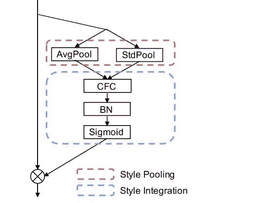

SRM Structural Design

样式集成模块的目标是模拟与各个通道相关联的样式的重要性，以相应地强调或抑制它们。本质上，在特征映射张量中，总是存在通道重要性的不平衡分布。一些渠道可能对模型的性能有更大的影响，而其他渠道可能仅仅是多余的。然而，普通卷积神经网络的设计方式是，它们固有地同等地优先考虑每个信道，并给它们一个信道权重系数 1。风格整合模块本质上告诉网络在完整的特征映射张量中哪些通道更重要。

上图展示了样式集成模块的架构设计。它由三个模块组成:

1.  通道式全连接层(CFC)
2.  批量标准化层(BN)
3.  乙状结肠激活单位

数学上，给定样式池的输出，其在\mathbb{R}^{N 中被表示为样式表示$ \ textbf { t } \ ast c \ ast 2 } $，样式集成操作符使用可学习的参数$ \ textbf { w } \在\mathbb{R}^{C 中编码通道:

$ z _ { NC } = \ textbf { w } _ c \ cdot \ textbf { t } _ { NC } $

其中＄\ textbf { z } \ in \mathbb{r}^{n \ ast c } $表示编码的样式特征。这可以解释为具有两个输入节点和一个输出的通道独立全连接层，其中偏置项被合并到随后的 BN 层中。

然后，CFC 的输出被传递到批量标准化层以改进训练。随后，BN 层的输出被传递到作为门控机制的 s 形激活单元，如以下数学等式所示:

≤表示

$\sigma_c^{(z)} = \sqrt{\frac{1}{n}\sum^{n}{n=1}(z_{nc}-\mu_c^{(z)})^{2}}$

$\tilde{z}_{nc}=\gamma_{c}(\frac{z_{nc}-\mu_c^{(z)}}{\sigma_c^{(z)}})+ \ beta _ c 美元

$g_{nc}=\frac{1}{1+e^{-\tilde{z}_{nc}}}$

\mathbb{R}^C$中的$\gamma$和$ \ beta \表示仿射变换参数，而\mathbb{R}^{N 中的$ \ textbf { g } \ ast c } $表示学习的每通道风格权重。

> 请注意，BN 在推理时使用均值和方差的固定近似值，这允许 BN 层合并到前面的 CFC 层中。

更简单地说，输入特征张量中每个通道的样式集成是一个 CFC 层$ f _ { CFC }:\mathbb{r}^{2} \ to \ mathbb { r } $后跟一个激活函数$f_{ACT} : \mathbb{R} \to [0，1]$。最后，sigmoid 激活的每通道风格权重然后与输入特征张量中的各个对应通道逐元素相乘。因此，\mathbb{R}^{N 的输出$ \ hat { \ textbf { x } } \是通过以下方式获得的:

$ \ tilde { \ textbf { x } } _ { NC } = g _ { NC } \ cdot \ textbf { x } _ { NC } $

### 复杂性

作者的目标之一是在内存和计算复杂性方面设计一个轻量级和高效的模块。造成参数开销的两个模块是 CFC 和 BN 层。每个项的参数数量分别为$ \ sum { S = 1 } { S } N _ { S } \ cdot C _ { S } \ cdot 2 $和$ \ sum { S = 1 } { S } \ cdot C _ { S } \ cdot 4 $，其中$S$表示体系结构第$ \ textit { S } $-级中重复模块的数量，$C_s$表示第$ \ textit { S } $-级的输出通道尺寸。SRM 提供的参数总数为:

$6\sum^{S}_{s=1}N_s \cdot C_s 美元

如果将 Resnet-50 视为基准架构，那么将 SRM 添加到该架构的每个模块会导致额外的 0.02 GFLOPs 和 0.06M 参数。这比 SENets 等其他标准注意机制便宜得多，在相同的 ResNet-50 架构中使用时，SENets 增加了 253 万个参数。

### 与挤压和激励网络(SENets)的比较


Squeeze-and-Excitation Module

挤压-激发网络是计算机视觉领域中最基本的注意机制之一。大多数使用注意力模块的现代架构都以这样或那样的方式受到了杰出人物的启发，SRM 也不例外。SRM 模块和 SE 模块之间有一些关键区别。虽然两个模块都有特征压缩和特征加权方法，但 SE 和 SRM 涉及的确切过程是不同的。SRM 保留了 SE 的 squeeze 模块中使用的平均池，但是，它添加了一个标准偏差池，以在压缩时提供更丰富的功能表示。

此外，另一个主要区别在于 SRM 的特征加权模块。在 se 的情况下，特征加权模块(称为“激励”模块)使用多层感知器瓶颈，它首先降低维度，然后再次扩展回来。这是 SE 在主干架构中引入参数开销的主要原因。然而，对于 SRM，它使用的 CFC 比 se 中使用的 MLP 便宜得多，这也是 SRM 比 SE 便宜的主要原因。唉，SRM 和 SE 都使用 sigmoid 激活单元来缩放学习到的每通道权重，然后将这些缩放后的权重按元素乘以输入特征张量中的相应通道。

为了理解 SE 和 SRM 之间的代表性差异，作者将 SRM 和 SE 通过导致最高通道权重的图像学习的特征可视化。他们通过使用在 DTD 数据集上训练的基于 SE 和 SRM 的 ResNet-56 来做到这一点。如下图所示，SE 导致通道间高度重叠的图像，而 SRM 在顶部激活的图像中表现出更高的多样性，这意味着与 SE 相比，SRM 允许通道权重之间的相关性更低。作者进一步暗示，SE 和 SRM 的代表性表达能力之间的差异可能是未来的研究领域。尽管差别很大，但与 SE 相比，SRM 中不同模块的影响并不一定完全清晰，因为两种结构在设计方面极其相似。

引用作者的话:

> SE 相关矩阵中明显的网格模式意味着通道组同步开启或关闭，而 SRM 则倾向于促进通道间的去相关。我们在 SE 和 SRM 之间的比较表明，它们针对完全不同的特征表示角度来提高性能，这值得进一步研究。

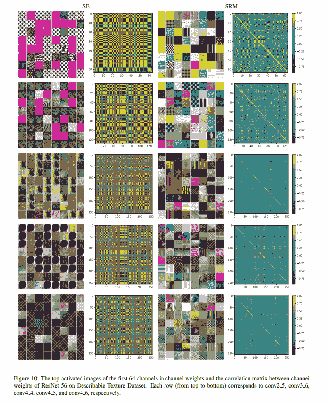

### 与高效渠道关注网(SENets)的比较

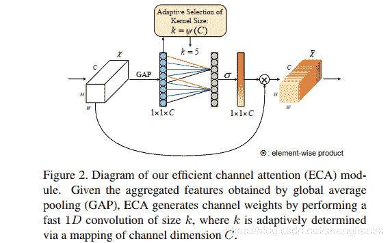

理论上，ECANets 似乎是 SRM 的复制品，但最多只提供微小的修改，这还没有得到很好的证明。ECA 非常便宜，而且比 SRM 便宜，主要有两个原因。在 ECA 的情况下，特征压缩方法仅涉及 GAP(全局平均池)的方法，类似于 se 的方法，而 SRM 同时使用 GAP 和标准差池。此外，ECA 不依赖于批处理规范化层，而 SRM 在 CFC 层之后立即使用一个。对于 ECA 的结构还有一个警告，因为它对用于特征加权的一维 conv 层使用自适应核大小公式。该公式包含两个超参数$\gamma$和$b$，这两个超参数是为获得最佳性能而预定义的，并基于输入特征映射张量中的通道数$C$进行自适应调整。

## 密码

以下是 SRM 模块的 PyTorch 代码，可插入标准卷积骨干架构:

```
import torch
from torch import nn

class SRMLayer(nn.Module):
    def __init__(self, channel, reduction=None):
        # Reduction for compatibility with layer_block interface
        super(SRMLayer, self).__init__()

        # CFC: channel-wise fully connected layer
        self.cfc = nn.Conv1d(channel, channel, kernel_size=2, bias=False,
                             groups=channel)
        self.bn = nn.BatchNorm1d(channel)

    def forward(self, x):
        b, c, _, _ = x.size()

        # Style pooling
        mean = x.view(b, c, -1).mean(-1).unsqueeze(-1)
        std = x.view(b, c, -1).std(-1).unsqueeze(-1)
        u = torch.cat((mean, std), -1)  # (b, c, 2)

        # Style integration
        z = self.cfc(u)  # (b, c, 1)
        z = self.bn(z)
        g = torch.sigmoid(z)
        g = g.view(b, c, 1, 1)

        return x * g.expand_as(x)
```

对于张量流，SRM 可定义如下:

```
import tensorflow as tf

def SRM_block(x, channels, use_bias=False, is_training=True, scope='srm_block'):
    with tf.variable_scope(scope) :
        bs, h, w, c = x.get_shape().as_list() # c = channels

        x = tf.reshape(x, shape=[bs, -1, c]) # [bs, h*w, c]

        x_mean, x_var = tf.nn.moments(x, axes=1, keep_dims=True) # [bs, 1, c]
        x_std = tf.sqrt(x_var + 1e-5)

        t = tf.concat([x_mean, x_std], axis=1) # [bs, 2, c]

        z = tf.layers.conv1d(t, channels, kernel_size=2, strides=1, use_bias=use_bias)
        z = tf.layers.batch_normalization(z, momentum=0.9, epsilon=1e-05, center=True, scale=True, training=is_training, name=scope)
        # z = tf.contrib.layers.batch_norm(z, decay=0.9, epsilon=1e-05, center=True, scale=True, updates_collections=None, is_training=is_training, scope=scope)

        g = tf.sigmoid(z)

        x = tf.reshape(x * g, shape=[bs, h, w, c])

        return x
```

在这两种情况下，在架构层的初始化过程中，一定要将正确的通道号作为参数传递给该层。

## 结果

在这一节中，我们将看看作者展示的各种结果，从 ImageNet 和 CIFAR-10/100 上的图像分类到风格转换和纹理分类。

### ImageNet-1k

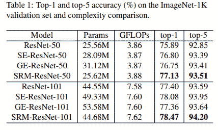

如上表所示，在 ImageNet 分类任务上，SRM 的性能大大优于 vanilla、GE 和 SE 网络，同时在参数开销方面也很便宜。基于 ResNet-50 的模型的训练曲线如下图所示:

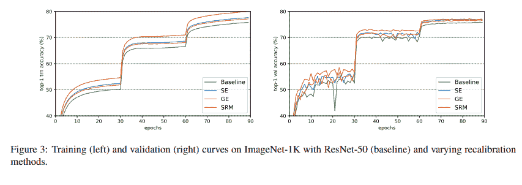

作者还在**风格化的 ImageNet** 上测试了 SRM，这是 ImageNet 的一种变体，使用由 [*数字画师*数据集](https://www.kaggle.com/c/painter-by-numbers)中的随机绘画风格化的图像创建。关于数据集和训练设置的更多细节可以在论文中找到。

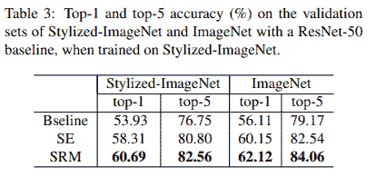

与之前在 ImageNet 上的结果相似，SRM 在风格化 ImageNet 的情况下占据了重要位置，如上表所示。

### CIFAR 10/100

SRM 还能够在 CIFAR-10 和 CIFAR-100 图像分类基准测试中轻松领先于 Vanilla、SE 和 GE (Gather Excite)变体，如下表所示:

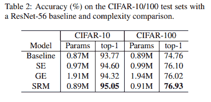

### Office Home 数据集

在平均超过 5 倍交叉验证的情况下，SRM 在 Office Home 数据集上的多域分类上也始终表现出比基线和基于 SE 的 ResNet-18 更好的性能。结果如下表所示:

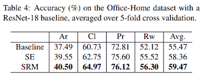

### 纹理分类

继续上述基准测试中展示的强大性能，SRM 提高了 ResNet-32 和 ResNet-56 模型在基线和 SE 变体上的得分，可描述纹理数据集上的纹理分类基准平均超过 5 倍交叉验证，如下所示:

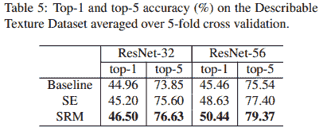

### 风格转移

作者最后使用 **MS-COCO** **数据集**探索了 SRM 在风格转换任务上的表现。定量分析的训练图和样本输出如下所示:

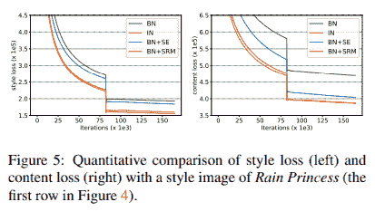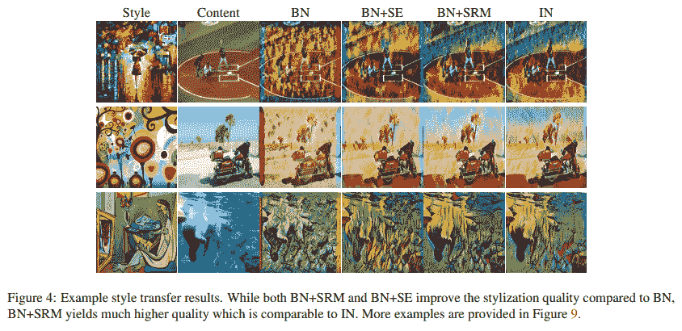

还有一些例子:

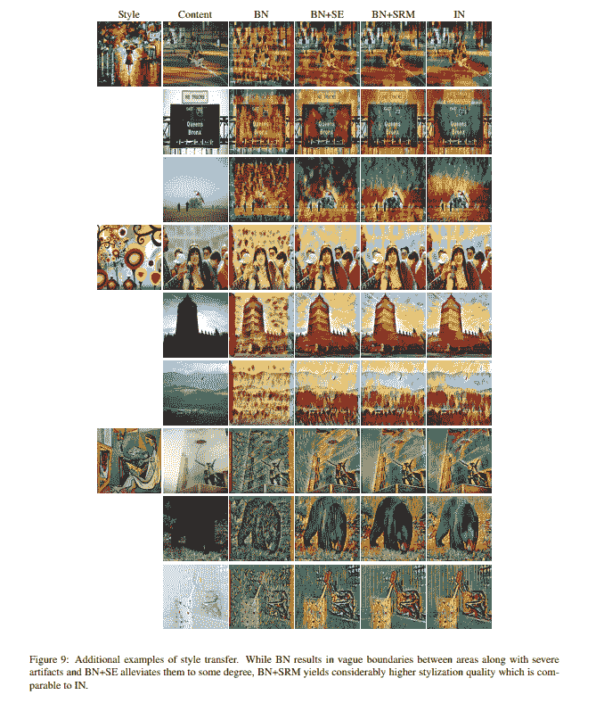

### 消融研究

为了进一步了解 SRM 中使用的不同组件的重要性，作者对 SRM 中使用的池化方法和风格集成方法进行了广泛的研究，如下表所示:

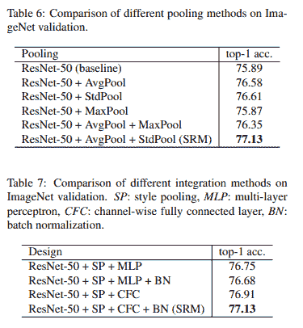

最后，为了验证 SRM 产生相关的信道权重，作者使用 SRM 的信道权重来修剪模型，并观察稀疏(修剪)模型的性能。如下图所示，与基线相比，基于 SRM 的修剪网络表现出更好的性能:

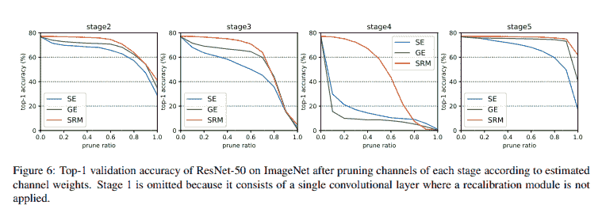

## 批评意见

总的来说，这篇论文写得非常透彻。由于作者的功劳，他们提供了广泛的实验结果以及广泛的消融研究和与 SENets 的比较。然而，随着计算机视觉中注意力机制的快速流动，大多数方法都被每年出现的新变体所掩盖。虽然这篇论文不一定展示任何缺点或不足，但与每种注意力方法一样，它涉及到计算成本的增加。遗憾的是，这仍然取决于用户在自己的任务/数据集上进行尝试的判断。

## 结论

风格再校准模块(SRM)是一个高效和轻量级的通道注意力模块，使用深度卷积神经网络在广泛的任务范围内提供显著改善的和有竞争力的性能。SRM 可以被认为是目前在不同技术水平(SOTA)网络(如高效网络)中使用的 evergreen 挤压和激励模块的强大替代品。

## 参考

1.  SRM:基于风格的卷积神经网络再校准模块
2.  [挤压和激励网络](https://arxiv.org/abs/1709.01507)
3.  [ECA-Net:深度卷积神经网络的高效信道关注](https://arxiv.org/abs/1910.03151)
4.  [Gather-Excite:利用卷积神经网络中的特征上下文](https://arxiv.org/abs/1810.12348)
5.  [SRM 的 PyTorch 正式实施](https://github.com/hyunjaelee410/style-based-recalibration-module)