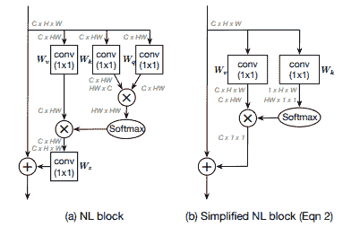
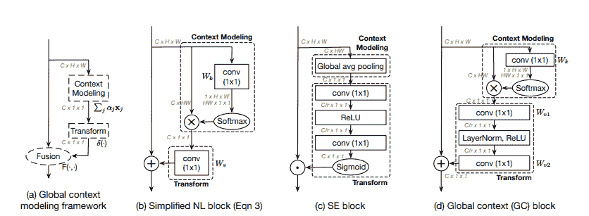
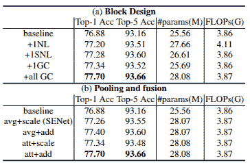
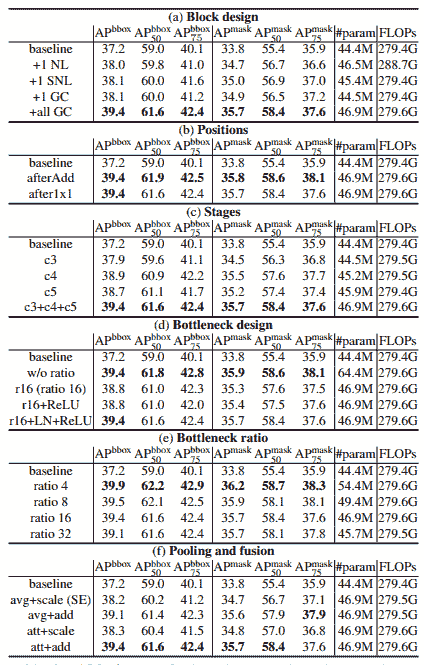
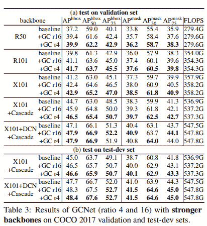

# 解释了全球背景网络

> 原文：<https://blog.paperspace.com/global-context-networks-gcnet/>

非局部网络已经为用于计算机视觉的深度神经网络架构中的许多现代注意机制提供了强大的直觉和基础。

在这篇文章中，我们将回顾一项杰出的工作，该工作从[非局域网络](https://arxiv.org/abs/1711.07971)和[压缩-激发网络](https://blog.paperspace.com/channel-attention-squeeze-and-excitation-networks/)中获得灵感，构建了一个注意力机制模型，使网络能够以相当低的成本捕捉长程相关性。这被称为[全球背景网络](https://arxiv.org/pdf/1904.11492.pdf)，它于 2019 年在 ICCV 研讨会上被接受。

首先，在概述压缩和激发网络之前，我们将简单地回顾一下非局域网络。然后，我们将深入讨论全局上下文建模，然后提供其代码并观察本文中呈现的结果。最后，我们将考虑 GCNet 的一些缺点。

## 目录

*   抽象概述
*   重访非本地网络
*   再谈压缩和激发网络
*   全球背景网络
    *   PyTorch Code
*   结果
*   缺点
*   参考

### 抽象概述

> 然而，通过严格的实证分析，我们发现，对于图像中不同的查询位置，非局部网络所建模的全局上下文几乎是相同的。在本文中，我们利用这一发现创建了一个基于查询独立公式的简化网络，它保持了 NLNet 的准确性，但计算量明显减少。我们进一步观察到这种简化的设计与压缩激励网络(SENet)具有相似的结构。因此，我们将它们统一为一个三步通用框架，用于全局上下文建模。在通用框架内，我们设计了一个更好的实例化，称为全局上下文(GC)块，它是轻量级的，可以有效地建模全局上下文。

## 重访非本地网络

非本地网络通过将特定于查询的全局上下文聚集到每个查询位置，采取了一种有效的方法来捕获长期依赖性。简单来说，非局部网络负责通过聚合其周围像素的关系信息来建模单个像素的注意力地图。这是通过使用少量的置换操作来实现的，以允许用焦点查询像素来构造注意力图。这种方法在抽象的意义上有点类似于[萨根](https://arxiv.org/abs/1805.08318)中提出的**自我关注机制**。



如上图所示，NL 块主要接收输入张量，并首先将其从$ C \ x H \ x W \ x C \ x HW $ dimension 格式进行置换。这个排列后面是三个分支。在其中一个分支中，它简单地经历$ 1 \乘以 1$逐点空间保持卷积。在其他两个分支中，它也经历类似的卷积运算，但通过置换其中一个输出，它们乘以叉积，之后所得输出通过 SoftMax 激活层，该激活层输出$ HW \乘以 HW$整形张量。然后，将该输出乘以第一个分支的输出的叉积，得到结果$ C \乘以 HW$输出，然后将其置换为$ C \乘以 H \乘以 W$的形状，然后像剩余连接一样按元素添加到块的原始输入中。

GCNet 论文提供了非本地块的简化和一般化形式，如上图所示。此简化块的输入并行通过两个$ 1 \乘以 1$卷积运算符，其中一个保留通道和空间维度，而另一个仅将通道维度减少到$1$。然后，第一个卷积的输出从$ C \乘以 H 乘以 W$置换为$ C \乘以 HW$，类似于经典的非局部块，而第二个卷积的输出从$ 1 \乘以 H \乘以 W$重新整形为$ HW \乘以 1 \乘以 1$。这两个张量随后使用叉积相乘，得到形状为$ C \乘以 1 \乘以 1$的输出张量。这个输出张量然后类似地被添加到原始输入，就像剩余连接一样。

## 再谈压缩和激发网络


挤压-激励网络包含一个通道注意机制，该机制主要由三个组件组成:挤压模块、激励模块和缩放模块。

挤压块负责使用全局平均池(GAP)将输入特征映射$(C \乘以 H \乘以 W)$减少到单个像素，同时保持通道数量不变$(C \乘以 1 \乘以 1)$。然后，*压缩的*张量被传递到激励块，这是一个多层感知器瓶颈(MLP ),负责学习通道注意力权重。最后，这些奇异权重通过 sigmoid 激活，然后与非调制输入张量中的相应通道逐元素相乘。

要阅读关于挤压和激励网络的深入评论，你可以在这里阅读我的文章。

## 全球背景网络



GCNet 论文提出了一个统一的简单模型，可以推广压缩和激发网络和非局域网络。这个模块被称为全局上下文建模框架，它包含三个值得注意的部分:上下文建模、转换和融合。上下文建模用于建立查询像素的长程相关性，而变换通常表示归因于通道注意中的注意向量的维度变化，并且最终变换本质上将注意向量与原始输入融合。

如上图所示，该框架可以概括简化的非本地块，其中上下文建模负责捕获长期依赖关系。类似地，在挤压和激发网络的情况下，上下文建模表示通过间隙对输入张量的分解。接下来是构建注意力权重的变换，在这种情况下，这是一个 MLP 瓶颈。

全局上下文网络在全局上下文建模框架内结合了简化的 NL 块和挤压-激励块的最佳部分。上下文建模与简化的 NL 块中的相同，而转换是一个类似于挤压和激励块的瓶颈结构，唯一的区别是 GCNet 在瓶颈中使用了一个额外的`LayerNorm`。

### PyTorch Code

```
import torch
from torch import nn
from mmcv.cnn import constant_init, kaiming_init

def last_zero_init(m):
    if isinstance(m, nn.Sequential):
        constant_init(m[-1], val=0)
        m[-1].inited = True
    else:
        constant_init(m, val=0)
        m.inited = True

class ContextBlock2d(nn.Module):

    def __init__(self, inplanes, planes, pool, fusions):
        super(ContextBlock2d, self).__init__()
        assert pool in ['avg', 'att']
        assert all([f in ['channel_add', 'channel_mul'] for f in fusions])
        assert len(fusions) > 0, 'at least one fusion should be used'
        self.inplanes = inplanes
        self.planes = planes
        self.pool = pool
        self.fusions = fusions
        if 'att' in pool:
            self.conv_mask = nn.Conv2d(inplanes, 1, kernel_size=1)
            self.softmax = nn.Softmax(dim=2)
        else:
            self.avg_pool = nn.AdaptiveAvgPool2d(1)
        if 'channel_add' in fusions:
            self.channel_add_conv = nn.Sequential(
                nn.Conv2d(self.inplanes, self.planes, kernel_size=1),
                nn.LayerNorm([self.planes, 1, 1]),
                nn.ReLU(inplace=True),
                nn.Conv2d(self.planes, self.inplanes, kernel_size=1)
            )
        else:
            self.channel_add_conv = None
        if 'channel_mul' in fusions:
            self.channel_mul_conv = nn.Sequential(
                nn.Conv2d(self.inplanes, self.planes, kernel_size=1),
                nn.LayerNorm([self.planes, 1, 1]),
                nn.ReLU(inplace=True),
                nn.Conv2d(self.planes, self.inplanes, kernel_size=1)
            )
        else:
            self.channel_mul_conv = None
        self.reset_parameters()

    def reset_parameters(self):
        if self.pool == 'att':
            kaiming_init(self.conv_mask, mode='fan_in')
            self.conv_mask.inited = True

        if self.channel_add_conv is not None:
            last_zero_init(self.channel_add_conv)
        if self.channel_mul_conv is not None:
            last_zero_init(self.channel_mul_conv)

    def spatial_pool(self, x):
        batch, channel, height, width = x.size()
        if self.pool == 'att':
            input_x = x
            # [N, C, H * W]
            input_x = input_x.view(batch, channel, height * width)
            # [N, 1, C, H * W]
            input_x = input_x.unsqueeze(1)
            # [N, 1, H, W]
            context_mask = self.conv_mask(x)
            # [N, 1, H * W]
            context_mask = context_mask.view(batch, 1, height * width)
            # [N, 1, H * W]
            context_mask = self.softmax(context_mask)
            # [N, 1, H * W, 1]
            context_mask = context_mask.unsqueeze(3)
            # [N, 1, C, 1]
            context = torch.matmul(input_x, context_mask)
            # [N, C, 1, 1]
            context = context.view(batch, channel, 1, 1)
        else:
            # [N, C, 1, 1]
            context = self.avg_pool(x)

        return context

    def forward(self, x):
        # [N, C, 1, 1]
        context = self.spatial_pool(x)

        if self.channel_mul_conv is not None:
            # [N, C, 1, 1]
            channel_mul_term = torch.sigmoid(self.channel_mul_conv(context))
            out = x * channel_mul_term
        else:
            out = x
        if self.channel_add_conv is not None:
            # [N, C, 1, 1]
            channel_add_term = self.channel_add_conv(context)
            out = out + channel_add_term

        return out
```

由于将非局部网络和挤压-激励网络结合到单个统一框架中，GCNet 能够捕获查询像素的长程相关性，同时在全局邻域上提供良好的注意力表示，这使得网络对局部空间区域的变化更加鲁棒。

## 结果

### 图像分类



Here baseline represents a ResNet-50

### MS-COCO 上的实例分割和对象检测



Here baseline represents a Mask R-CNN with ResNet-50 backbone and FPN



正如所观察到的，GCNet 提供了非常强的结果，并且相对于基线对应物有相当大的性能改进。这归因于 GCNet 能够模拟像素级的长程相关性，同时映射通道式注意力。

## 缺点

1.  就参数复杂性而言，GCNets 相当昂贵。开销相当大，并且主要归因于 MLP 瓶颈和上下文建模块，这两者都以通道数量 C 的数量级添加了额外的参数，这在数值上相当高。
2.  由于它使用了在压缩和激发网络中使用的 MLP 瓶颈结构，由于瓶颈中的维数减少，有相当大的信息损失。

总的来说，GCNet 是一个非常强大的执行注意机制，并提供了一个显着的性能增益。它还在 ICCV 2019 神经建筑师研讨会上获得了最佳论文奖。

## 参考

1.  [GCNet:非局域网络与压缩激发网络相遇并超越](https://arxiv.org/pdf/1904.11492.pdf)
2.  [非局部神经网络](https://arxiv.org/abs/1711.07971)
3.  [挤压和激励网络](https://arxiv.org/abs/1709.01507)
4.  [GC net 的 PyTorch 正式实施](https://github.com/xvjiarui/GCNet)
5.  [自我关注生成对抗网络](https://arxiv.org/abs/1805.08318)