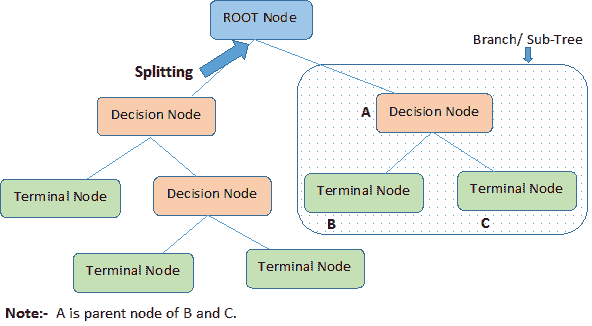
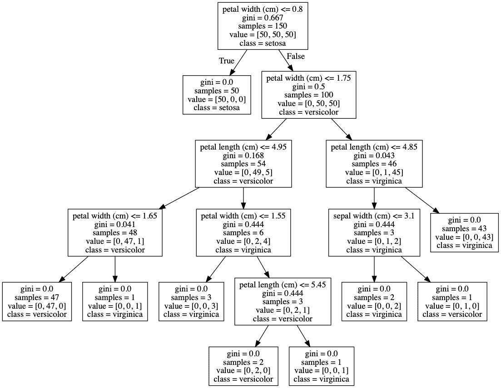

# 决策树介绍

> 原文：<https://blog.paperspace.com/decision-trees/>

**决策树**是许多经典机器学习算法的基础，如**随机森林**、**装袋**和**助推决策树**。它们是由加州大学伯克利分校的统计学家利奥·布雷曼首先提出的。他的想法是将数据表示为一棵树，其中每个内部节点表示对一个属性的测试(基本上是一个条件)，每个分支表示测试的结果，每个叶节点(终端节点)持有一个类标签。

决策树现在广泛应用于预测建模的许多应用中，包括**分类**和**回归**。有时决策树也被称为**车**，是 C 分类 a 和 R 回归 T 树的简称。让我们深入讨论决策树是如何工作的，它们是如何从零开始构建的，以及我们如何用 Python 实现它们。

在本文中，我们将介绍以下模块:

*   为什么选择决策树？
    *   决策树的类型
    *   关键术语
*   如何创建决策树
    *   基尼杂质
    *   卡方检验
    *   信息增益
*   决策树的应用
*   解码超参数
*   算法编码
*   优点和缺点
*   总结和结论

## 为什么选择决策树？

基于树的算法是用于分类和回归的相关**非参数**和**监督**方法的流行家族。如果你想知道监督学习是什么，它是一种机器学习算法，涉及用既有输入又有输出标签的数据训练模型(换句话说，我们有已知真实类或值的数据，如果它预测不正确，可以告诉算法这些是什么)。

决策树看起来像一个模糊的颠倒的树，在根上有一个决策规则，后续的决策规则从它下面展开。例如，决策规则可以是一个人是否锻炼。也可以有没有任何决策规则的节点；这些被称为**叶节点**。在我们继续之前，让我们快速了解一下不同类型的决策树。

### 决策树的类型

根据目标变量，决策树分为两种类型。

1.  ******分类变量决策树**** s **:**** 这是算法有分类目标变量的地方。例如，假设要求您预测一台计算机的相对价格，分为三类:*低*、*中*或*高。*功能可能包括*显示器类型*、*扬声器质量*、 *RAM* 和 *SSD* 。决策树将从这些特征中学习，在将每个数据点通过每个节点后，它将在三个分类目标*低*、*中*或*高*之一的叶节点处结束。

2.  ******连续变量决策树**** s ****:****** 在这种情况下，输入到决策树的特征(例如，房子的质量)将用于预测连续输出(例如，房子的价格)。

### 关键术语

让我们看看决策树是什么样子的，以及当给定一个新的预测输入时，它们是如何工作的。

下图解释了决策树的基本结构。每棵树都有一个**根节点**，输入在这里传递。这个根节点被进一步划分成决策节点集，其中结果和观察是有条件的。将单个节点划分为多个节点的过程称为**分裂**。如果一个节点没有分裂成更多的节点，那么它被称为**叶节点**，或者**终端节点**。决策树的一个子部分称为**分支**或**子树**(例如在下图的方框中)。



Example of a Decision Tree

还有一个概念与分裂完全相反。如果有可以消除的决策规则，我们就把它们从树上砍下来。这个过程被称为**修剪**，有助于最小化算法的复杂性。

现在我们对基本决策树的样子有了一个清晰的概念，让我们深入了解如何进行分裂，以及我们如何自己构建一个决策树。

## 如何创建决策树

在本节中，我们将讨论描述如何创建决策树的核心算法。这些算法完全依赖于目标变量，但是，这些算法与用于分类和回归树的算法不同。

有几种技术可以用来决定如何分割给定的数据。决策树的主要目标是在节点之间进行最佳分割，从而以最佳方式将数据划分到正确的类别中。为此，我们需要使用正确的决策规则。规则直接影响算法的性能。

在我们开始之前，需要考虑一些假设:

*   开始时，整个数据被认为是根，此后，我们使用算法进行分裂或将根分成子树。
*   特征值被认为是分类的。如果这些值是连续的，则在构建模型之前会将它们分开。
*   记录是基于属性值递归分布的。
*   属性作为树的根或内部节点的排序是使用统计方法来完成的。

让我们从常用的拆分技术开始，从而构建决策树。

### 基尼杂质

如果所有的元素都被正确地划分到不同的类中(一个理想的场景)，那么这个划分就被认为是**纯**。基尼不纯度(发音像“精灵”)用于衡量随机选择的样本被某个节点错误分类的可能性。它被称为“杂质”度量，因为它让我们了解模型与纯除法有什么不同。

基尼杂质分数的程度总是在 0 到 1 之间，其中 0 表示所有元素都属于某一类(或者划分是纯的)，1 表示元素随机分布在各个类中。基尼系数为 0.5 表示元素被平均分配到某些类别中。基尼系数的数学符号由以下公式表示:


其中*p[I]是特定元素属于特定类的概率。*

现在，让我们看看使用基尼系数作为指导来计算和构建决策树的伪代码。

```
Gini Index:
    for each branch in a split:
        Calculate percent branch represents  # Used for weighting
        for each class in-branch:
            Calculate the probability of that class in the given branch
            Square the class probability
        Sum the squared class probabilities
        Subtract the sum from 1  # This is the Gini Index for that branch
    Weight each branch based on the baseline probability
    Sum the weighted Gini index for each split
```

我们现在来看一个解释上述算法的简单例子。考虑下面的数据表，其中每个元素(行)有两个描述它的变量和一个相关的类标签。

| 班级 | Var 1 | Var 2 |
| A | Zero | Thirty-three |
| A | Zero | Fifty-four |
| A | Zero | fifty-six |
| A | Zero | forty-two |
| A | one | Fifty |
| B | one | Fifty-five |
| B | one | Thirty-one |
| B | Zero | -4 |
| B | one | Seventy-seven |
| B | Zero | forty-nine |

基尼指数示例:

*   *Var1* : *Var1* 的拆分基线有 4 个实例(4/10)等于 1，6 个实例(6/10)等于 0。
*   对于 *Var1* == 1 & *类* == *A* : 1 / 4 的实例有类等于 *A* 。
*   对于 *Var1* == 1 & *类* == *B* : 3 / 4 的实例有类等于 *B* 。
*   这里的基尼指数是 1-((1/4)^2 + (3/4)^2) = 0.375
*   对于 *Var1* == 0 & *类* == *A* : 4 / 6 的实例有类等于 *A* 。
*   对于 *Var1* == 0 & *类* == *B* : 2 / 6 实例有类等于 *B* 。
*   **基尼指数**这里是 1-((4/6)^2 + (2/6)^2) = 0.4444
*   然后，我们根据每个拆分所占数据的基线/比例，对每个拆分进行加权和求和。
*   4/10 * 0.375 + 6/10 * 0.444 = 0.41667

### 信息增益

信息增益描述了通过属性获得的信息量。它告诉我们属性有多重要。由于决策树的构建完全是为了找到确保高准确性的正确分裂节点，所以信息增益完全是为了找到返回最高信息增益的最佳节点。这是使用被称为**熵**的因子计算的。熵定义了系统的无序程度。无序越多，熵就越大。当样本是完全同质的，那么熵是零，如果样本是部分有序的，比如说 50%的样本是有序的，那么熵是一。

这作为确定信息增益的基本因素。熵和信息增益一起用来构造决策树，算法称为 **ID3** 。

让我们理解用于计算信息增益的一步一步的过程，从而构建决策树，

*   使用以下公式计算输出属性(分割前)的熵:


这里，p 是成功的概率，q 是节点失败的概率。比如说，10 个数据值中，5 个属于*真*，5 个属于*假*，那么 *c* 计算为 2， *p_1* 和 *p_2* 计算为。

*   使用公式计算所有输入属性的熵，


t 是输出属性，

x 是输入属性，

P(c)是 X 处可能出现的数据点的概率，以及

E(c)是与可能的数据点相关的熵 w . r . t '' True'。

假设一个输入属性(优先级)，其中提到了两个可能的值，*低*和*高*关于*低，*有 5 个数据点相关，其中 2 个属于*真*，3 个属于*假。*关于*高*，其余 5 个数据点相关联，其中 4 个属于*真*，1 个属于*假。*那么 E(T，X)将是，


在 E(2，3)中，p 是 2，q 是 3。

在 E(4，1)中，p 是 4，q 是 1。

对给定数据集中的所有输入属性重复进行相同的计算。

*   使用上述两个值，通过从分割前的总熵中减去每个属性的熵来计算信息增益或熵的减少，


*   选择具有最高信息增益的属性作为分割节点。
*   通过根据分割来分割数据集，重复步骤 1-4。该算法一直运行，直到所有数据都被分类。

**要点记住:**

*   叶节点是没有熵的节点，或者熵为零的节点。在叶节点上不再进行进一步的分割。
*   只有需要进一步分裂的分支，即熵> 0 时(有杂质时)才需要经历这个分裂过程。

**c. **卡方****

如果目标变量是分类的，如成功-失败/高-低，卡方方法很有效。该算法的核心思想是找出子节点和父节点之间存在的差异的统计显著性。用于计算卡方的数学方程是，


它代表目标变量的观察频率和预期频率之间的标准化差异的平方和。

使用卡方的另一个主要优势是，它可以在单个节点上执行多次分割，从而提高准确度和精度。

## 决策树的应用

决策树是机器学习领域中最基本也是最广泛使用的算法之一。它在分类和回归建模的不同领域得到了应用。由于其描绘可视化输出的能力，人们可以很容易地从建模过程流中获得洞察力。这里有几个可以使用决策树的例子，

*   企业管理
*   客户关系管理
*   欺诈性声明检测
*   能耗
*   医疗保健管理
*   故障诊断

## 解码超参数

Scikit-learn 提供了一些与决策树分类器一起使用的功能或参数，以根据给定的数据提高模型的准确性。

*   ******判据:****** 该参数用来衡量分割的质量。该参数的默认值设置为“Gini”。如果你想用熵增益来计算测度，可以把这个参数改成“熵”。

*   **splitter** :该参数用于选择在每个节点的拆分。如果希望子树具有最佳分割，可以将该参数设置为“最佳”。我们还可以有一个随机分割，其值设置为“随机”。

*   ******max-depth:******这是一个整数参数，通过它我们可以限制树的深度。该参数的默认值设置为 None。

*   ******min _ samples _ split:******该参数用于定义拆分一个内部节点所需的最小样本数。

*   **max _ leaf _ nodes:**max _ leaf _ nodes 的默认值设置为无。该参数用于以最佳优先的方式生长具有 max_leaf_nodes 的树。

## 算法编码

#### 步骤 1:导入模块

构建决策树模型的第一步也是最重要的一步是导入必要的包和模块。我们从 **sklearn** 包中导入**决策树分类器**类。这是一个内置的类，其中编码了整个决策树算法。在这个程序中，我们将使用可以从 **sklearn.datasets** 导入的**虹膜**数据集。pydotplus 包用于可视化决策树。下面是代码片段，

```
 import pydotplus
from sklearn.tree import DecisionTreeClassifier 
from sklearn import datasets 
```

#### 步骤 2:探索数据

接下来，我们通过使用 **load_iris()** 方法从 datasets 包中加载数据来准备好数据。我们将数据分配给**虹膜**变量。这个 iris 变量有两个键，一个是**数据**键，其中显示所有输入，即萼片长度、萼片宽度、花瓣长度和花瓣宽度。在 **target** 键中，我们有花朵类型，其值为鸢尾、杂色鸢尾和海滨鸢尾。我们将这些分别加载到**特征**和**目标**变量中。

```
iris = datasets.load_iris() 
features = iris.data 
target = iris.target

print(features)
print(target)

Output:

[[5.1 3.5 1.4 0.2]
 [4.9 3\.  1.4 0.2]
 [4.7 3.2 1.3 0.2]
 [4.6 3.1 1.5 0.2]
 [5.8 4\.  1.2 0.2]
 [5.7 4.4 1.5 0.4]
. . . . 
. . . .
]
[0 0 0 0 0 0 0 0 0 0 0 0 0 0 0 0 0 0 0 0 0 0 0 0 0 0 0 0 0 0 0 0 0 0 0 0 0 0 0 0 0 0 0 0 0 0 0 0 0 0 1 1 1 1 1 1 1 1 1 1 1 1 1 1 1 1 1 1 1 1 1 1 1 1 1 1 1 1 1 1 1 1 1 1 1 1 1 1 1 1 1 1 1 1 1 1 1 1 1 1 2 2 2 2 2 2 2 2 2 2 2 2 2 2 2 2 2 2 2 2 2 2 2 2 2 2 2 2 2 2 2 2 2 2 2 2 2 2 2 2 2 2 2 2 2 2 2 2 2 2] 
```

这是我们的数据集的样子。

#### 步骤 3:创建决策树分类器对象

这里，我们将**决策树分类器**加载到一个名为**模型**的变量中，这个变量是之前从 **sklearn** 包中导入的。

```
decisiontree = DecisionTreeClassifier(random_state=0) 
```

#### 步骤 5:拟合模型

这是训练过程的核心部分，通过对给定数据进行分割来构建决策树。我们用作为参数发送给 **fit()** 方法的**特征**和**目标**值来训练算法。这种方法是通过在特征和目标上训练模型来拟合数据。

```
model = decisiontree.fit(features, target)
```

#### 第六步:做预测

在这一步中，我们进行样本观察并做出预测。我们创建了一个新的列表，包括花的萼片和花瓣的尺寸。此外，我们在经过训练的模型上使用 **predict()** 方法来检查它所属的类别。我们还可以通过使用 **predict_proba** 方法来检查预测的概率(类概率)。

```
observation = [[ 5, 4, 3, 2]] # Predict observation's class
model.predict(observation)
model.predict_proba(observation) 

Output:
array([1])
array([[0., 1., 0.]]) 
```

**步骤 7:用于预测的点数据**

在这一步中，我们以点格式(一种图形描述语言)导出训练好的模型。为了实现这一点，我们使用了可以从 **sklearn** 包中导入的**树**类。在此基础上，我们使用 **export_graphviz** 方法，将决策树、特征和目标变量作为参数。

```
from sklearn import tree

dot_data = tree.export_graphviz(decisiontree, out_file=None,
feature_names=iris.feature_names, 
class_names=iris.target_names
) 
```

**第八步:绘制图形**

在最后一步，我们使用从 **IPython.display** 包导入的 **Image** 类来可视化决策树。

```
from IPython.display import Image

graph = pydotplus.graph_from_dot_data(dot_data) # Show graph

Image(graph.create_png()) 
```



Resultant Decision Tree

## 优点和缺点

决策树有一些优点和缺点。先说优点。与其他算法相比，决策树在处理数据时花费的时间非常少。可以跳过一些预处理步骤，如数据的标准化、转换和缩放。尽管数据集中存在缺失值，但模型的性能不会受到影响。决策树模型直观，易于向技术团队和利益相关者解释，并且可以跨多个组织实现。

缺点来了。在决策树中，数据的微小变化会导致决策树结构的巨大变化，从而导致不稳定。训练时间急剧增加，与数据集的大小成比例。在某些情况下，与其他传统算法相比，计算可能会变得复杂。

## 总结和结论

在本文中，我们已经深入讨论了决策树算法。这是一种监督学习算法，可用于分类和回归。决策树的主要目标是根据一组规则和条件将数据集分割成一棵树。我们讨论了决策树的关键组成部分，如根节点、叶节点、子树、分裂和修剪。此外，我们已经看到了决策树是如何工作的，以及如何使用流行的算法如 GINI、信息增益和卡方来执行战略分割。此外，我们使用 scikit-learn 在 IRIS 数据集上从头开始编码决策树。最后，我们讨论了使用决策树的优点和缺点。还有很多东西需要学习，本文将为您提供探索其他高级分类算法的快速入门。

### 参考

[https://www . analyticsvidhya . com/blog/2016/04/complete-tutorial-tree-based-modeling-scratch-in-python/](https://www.analyticsvidhya.com/blog/2016/04/complete-tutorial-tree-based-modeling-scratch-in-python/)