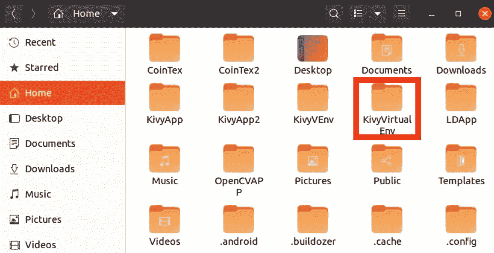
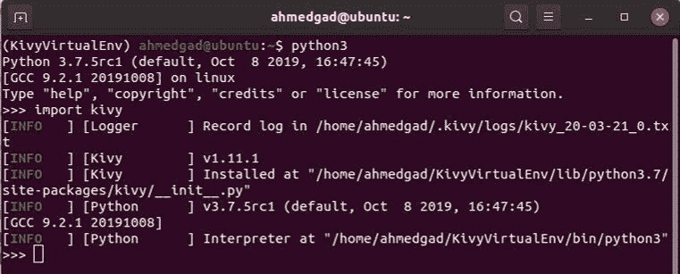
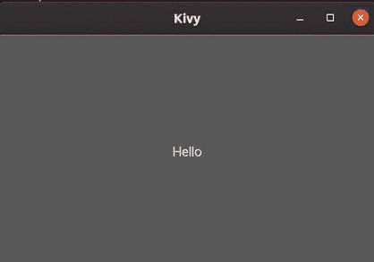
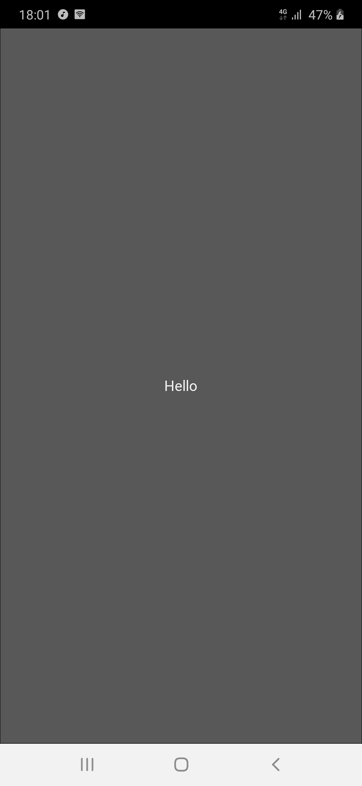
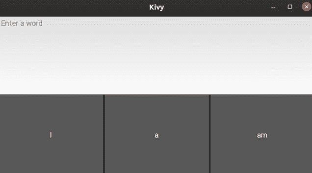
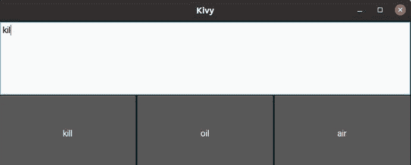
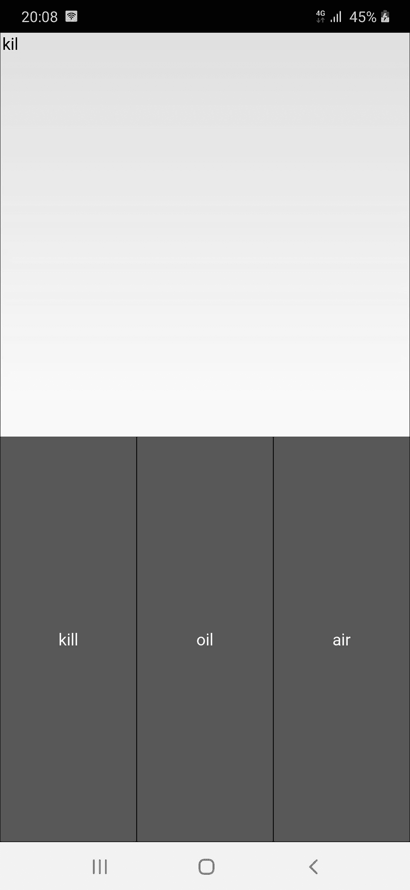

# 如何利用 Levenshtein 距离在 Android 上实现文本推荐

> 原文：<https://blog.paperspace.com/implement-text-recommendation-android-levenshtein-distance/>

在手机上输入文本可能不如在电脑上书写舒服。这就是为什么大多数将文本作为输入的应用程序为用户提供建议的更正和预测的单词，以使键入更容易。本教程将向您展示如何实现一个应用程序，可以做到这一点。

在本教程中，我们将使用名为 Kivy 的跨平台 Python 框架构建一个 Android 应用程序，用于在用户键入时推荐文本。如果目标单词在推荐列表中可用，用户可以只选择它而不用写下它的所有字符。该教程首先简要概述了如何构建桌面 Kivy 应用程序，然后开始为 Android 构建文本推荐应用程序。

以下是概要:

*   准备 Kivy 开发环境
*   构建一个简单的桌面 Kivy 应用程序
*   导出 Android 应用程序
*   Levenshtein 距离的 Python 实现
*   构建 Android 文本推荐应用程序

请注意，本教程是建立在另外两个基础之上的。要深入了解 Levenshtein 距离以及如何计算它，请查看[使用 Levenshtein 距离](https://blog.paperspace.com/measuring-text-similarity-using-levenshtein-distance/)测量文本相似性。在第 2 部分中，我们将看到如何用 Python 实现[Levenshtein 距离。](https://blog.paperspace.com/implementing-levenshtein-distance-word-autocomplete-autocorrect/)

## **准备 Kivy 开发环境**

像任何其他 Python 库一样，您可以使用`pip`安装程序安装 Kivy。您需要做的就是发出下面的命令。如果你使用 Python 3，记得用`pip3`代替`pip`。该命令适用于所有桌面平台，使您能够用 Python 创建跨平台的桌面应用程序。要在 Kivy 应用之外构建 Android 应用，必须使用 Linux。

```
pip install kivy
```

前面的命令会将 Kivy 安装到 Python 的主安装中，但是建议创建一个可以安装 Kivy 的虚拟环境。要创建虚拟机，请确保您的机器已经安装了`virtualenv`和`setuptools`库。

```
pip install --upgrade pip virtualenv setuptools
```

要创建虚拟环境，只需发出以下命令并指定您选择的名称。我选择了名字`KivyVirtualEnv`。

```
virtualenv --no-site-packages KivyVirtualEnv
```

在当前目录中，您可以找到一个名为`KivyVirtualEnv`的文件夹，如下图所示。Python，无论是第 2 版还是第 3 版，都将安装在这个文件夹中。



在环境目录中有一个名为`bin`的文件夹，其中有一个名为`activate`的脚本。该脚本用于根据下一个命令激活虚拟环境。只需指定与您的路径相匹配的路径。

```
. KivyVirtualEnv/bin/activate
```

发出命令后，虚拟环境将被激活，如下图所示。


如前所述，在环境内部，将使用`pip`安装 Kivy。安装后，您可以通过导入它来测试它是否正常工作，如下所示。



在确保一切按预期运行后，我们可以继续构建一个简单的 Kivy 应用程序。

## **构建一个简单的桌面 Kivy 应用**

Kivy 很容易学会用 GUI 构建 Python 应用程序。如果你想更全面地了解 Kivy 入门，你可以阅读我的书[使用 Kivy 和 Android Studio 在 Python 中构建 Android 应用程序:使用 Pyjnius、Plyer 和 Buildozer](https://www.amazon.com/Building-Android-Python-Using-Studio-ebook/dp/B07Z4LZHX9) ，这本书从头开始构建桌面和 Android 应用程序。

下面的代码实现了一个基本的 Kivy 应用程序，其中 GUI 只包含一个按钮。创建一个 Kivy 应用程序所需要做的就是创建一个新的类(在这个例子中是`KivyApp`),它从 Kivy 扩展了`kivy.app.App`类。在那之后，你只需要实现方法`build()`,它保存出现在屏幕上的 GUI 部件。在这种情况下，只有一个按钮小部件被创建为来自`kivy.uix.button.Button`类的实例。在类构造函数内部，参数`text`被设置为`Hello`。

```
import kivy.app
import kivy.uix.button

class KivyApp(kivy.app.App):

    def build(self):
        return kivy.uix.button.Button(text="Hello")

app = KivyApp()
app.run()
```

如果这段代码保存在一个名为`main.py`的文件中，那么您可以按照下一个命令照常运行它:

```
python3 main.py
```

之前的命令必须在之前创建的虚拟环境中发出。下图显示了应用程序的屏幕。



现在我们有了一个在桌面上运行的基本 Kivy 应用程序，让我们在下一节中导出 Android 应用程序。

## **导出安卓应用**

有一个名为 [python-for-android](https://github.com/kivy/python-for-android) 的项目，旨在从 Kivy 中导出一个 android 应用程序。这个项目的顶端是一个名为 [Buildozer](https://github.com/kivy/buildozer) 的工具，只需三个步骤就可以轻松导出 Android 应用程序。

第一步是使用`pip`安装 Buildozer，如下所示:

```
pip3 install buildozer 
```

安装完成后，第二步是创建一个名为`buildozer.spec`的文件，其中保存了 Android 应用程序的一些规范。您可以手动创建该文件，也可以使用以下命令生成模板。

```
buildozer init
```

该文件中的一些字段包括用于保存 Android 应用程序标题的`title`；`package.name`代表包的名称；`orientation`指定方向是横向还是纵向；`requirements`，它保存了要打包到 Android 应用程序中的库的列表；还有更多。稍后，我们将需要把`NumPy`库打包到 Android 应用程序中，因此它必须被列为一个需求。

在导出 Android 应用程序之前，您必须确保 Kivy 应用程序的代码保存在名为`main.py`的文件中，并且该文件位于`buildozer.spec`文件旁边的应用程序文件夹的根目录中。如果 app 文件夹名为`app`，那么项目的层次结构如下:

```
app
   main.py
   buildozer.init
```

构建 Android 应用程序和创建 APK 文件的最后一步是发出以下命令来创建调试 APK:

```
buildozer android debug
```

当第一次发出这个命令时，除了准备 Android 开发环境的 SDK 和 NDK 之外，下载 Kivy 应用程序的所有要求也需要花费大量时间。

该命令完成后，将在主应用程序文件夹的根目录下的`bin`文件夹中找到 APK。这是项目的层次结构。

```
app
   bin
      APK FILE
   main.py
   buildozer.init
```

下图显示了运行 Android 应用程序后的结果。



现在我们能够从 Kivy 应用程序中创建一个 Android 应用程序。下一节讨论 Python 中的 Levenshtein 距离实现。

## **Levenshtein 距离的 Python 实现**

在之前一篇名为[实现单词自动完成和自动更正的 Levenshtein 距离](https://blog.paperspace.com/implementing-levenshtein-distance-word-autocomplete-autocorrect)的文章中，Levenshtein 距离是用 Python 实现的。下面列出了代码，其中一个名为`levenshteinDistanceMatrix()`的函数接受两个表示单词的参数。该函数返回这两个单词之间的距离。距离越短，单词越相似。

```
def levenshteinDistanceMatrix(token1, token2):
    distances = numpy.zeros((len(token1) + 1, len(token2) + 1))

    for t1 in range(len(token1) + 1):
        distances[t1][0] = t1

    for t2 in range(len(token2) + 1):
        distances[0][t2] = t2

    a = 0
    b = 0
    c = 0

    for t1 in range(1, len(token1) + 1):
        for t2 in range(1, len(token2) + 1):
            if (token1[t1-1] == token2[t2-1]):
                distances[t1][t2] = distances[t1 - 1][t2 - 1]
            else:
                a = distances[t1][t2 - 1]
                b = distances[t1 - 1][t2]
                c = distances[t1 - 1][t2 - 1]

                if (a <= b and a <= c):
                    distances[t1][t2] = a + 1
                elif (b <= a and b <= c):
                    distances[t1][t2] = b + 1
                else:
                    distances[t1][t2] = c + 1

    return distances[len(token1)][len(token2)]
```

下面是一个计算两个单词`cane`和`man`之间距离的例子。

```
print(levenshteinDistanceMatrix("cane", "man"))

2.0
```

上一篇教程还构建了一个名为`calcDictDistance`的函数，它接受两个参数:`word`和`numWords`。该函数通过调用`levenshteinDistanceMatrix()`函数来计算`word`和字典之间的距离，并返回最近单词的列表。列表中的字数根据`numWord`参数中的值设置。例如，`calcDictDistance("conr", 4)`只返回与单词`conr`最近的 4 个单词。

下面是`calcDictDistance()`函数的实现。使用的字典只是一个名为`1-1000.txt`的包含 1000 个单词的文本文件。该文件可在[此链接](https://gist.github.com/deekayen/4148741)下载。

```
def calcDictDistance(word, numWords):
    file = open('1-1000.txt', 'r') 
    lines = file.readlines() 
    file.close()
    dictWordDist = []
    wordIdx = 0

    for line in lines: 
        wordDistance = levenshteinDistanceMatrix(word, line.strip())
        if wordDistance >= 10:
            wordDistance = 9
        dictWordDist.append(str(int(wordDistance)) + "-" + line.strip())
        wordIdx = wordIdx + 1

    closestWords = []
    wordDetails = []
    currWordDist = 0
    dictWordDist.sort()
    for i in range(numWords):
        currWordDist = dictWordDist[i]
        wordDetails = currWordDist.split("-")
        closestWords.append(wordDetails[1])
    return closestWords
```

下面是一个使用这个函数返回与单词`conr`最近的 4 个单词的例子。

```
print(calcDictDistance("conr", 4))

['bone', 'can', 'car', 'cent']
```

到目前为止，我们已经介绍了如何创建一个 Kivy 应用程序，如何构建一个 Android 应用程序并导出 APK，以及如何用 Python 实现 Levenshtein 距离。在下一节中，我们将使用所有这些来创建一个向用户推荐文本的 Android 应用程序。

## **打造安卓文字推荐 App**

首先，我们需要通过放置以下 Kivy 小部件来创建应用程序的 GUI:

*   用户可以在其中输入单词的文本字段。
*   显示推荐的按钮(仅使用 3 个按钮来显示与用户输入最接近的 3 个单词)

下面列出了用这 4 个小部件创建屏幕的 Kivy 代码。

```
import kivy.app
import kivy.uix.boxlayout
import kivy.uix.textinput
import kivy.uix.button

class KivyApp(kivy.app.App):

    def build(self):
        mainBoxLayout = kivy.uix.boxlayout.BoxLayout(orientation="vertical")
        self.textInput = kivy.uix.textinput.TextInput(hint_text="Enter a word")
        mainBoxLayout.add_widget(self.textInput)

        buttonsBoxLayout = kivy.uix.boxlayout.BoxLayout(orientation="horizontal")
        self.btn1 = kivy.uix.button.Button(text="Word 1")
        self.btn2 = kivy.uix.button.Button(text="Word 2")
        self.btn3 = kivy.uix.button.Button(text="Word 3")

        buttonsBoxLayout.add_widget(self.btn1)
        buttonsBoxLayout.add_widget(self.btn2)
        buttonsBoxLayout.add_widget(self.btn3)

        mainBoxLayout.add_widget(buttonsBoxLayout)

        return mainBoxLayout

app = KivyApp()
app.run()
```

运行应用程序后，我们可以在下图中看到它的屏幕。



我们将遵循的策略是将一个侦听器绑定到`TextInput`小部件，以便为文本中的每次更改调用一个回调方法。计算`TextInput`中的当前值和字典中所有单词之间的距离。最接近的 3 个单词的文本将反映在 3 个按钮上。一旦用户点击一个按钮，它的文本就会自动移动到`TextInput`中。

为了将监听器附加到`TextInput`小部件，在`build()`方法的末尾添加了下面一行。这意味着对于`TextInput`小部件的`text`属性的每一次改变，都将调用`calcDictDistance()`方法。

```
self.textInput.bind(text=self.calcDictDistance)
```

`calcDictDistance()`方法接受 3 个参数:

1.  `self`:`KivyApp`类的实例。
2.  `widget`:小部件`TextInput`的实例。
3.  `text`:当前`TextInput`小工具中的文本值。

为了适应这些变化，`calcDictDistance()`编辑如下。请注意，`levenshteinDistanceMatrix()`方法将保持不变。

```
def calcDictDistance(self, widget, word):
    numWords=3

    file = open('1-1000.txt', 'r') 
    lines = file.readlines() 
    file.close()
    dictWordDist = []
    wordIdx = 0

    for line in lines: 
        wordDistance = levenshteinDistanceMatrix(word, line.strip())
        if wordDistance >= 10:
            wordDistance = 9
        dictWordDist.append(str(int(wordDistance)) + "-" + line.strip())
        wordIdx = wordIdx + 1

    wordDetails = []
    currWordDist = 0
    dictWordDist.sort()

    self.btn1.text = dictWordDist[0].split("-")[1]
    self.btn2.text = dictWordDist[1].split("-")[1]
    self.btn3.text = dictWordDist[2].split("-")[1]
```

在`calcDictDistance()`方法的末尾，下面 3 行负责显示 3 个按钮上最接近的 3 个单词。

```
self.btn1.text = dictWordDist[0].split("-")[1]
self.btn2.text = dictWordDist[1].split("-")[1]
self.btn3.text = dictWordDist[2].split("-")[1]
```

下图显示了建议如何显示在 3 个按钮上。



到目前为止，点击按钮没有任何作用。为了将用户单击的按钮中的文本移动到`TextInput`小部件，下面 3 行将被添加到`build()`方法的末尾。简单来说，每按一次按钮(即点击)，就会调用回调方法`selectWord()`。

```
self.btn1.bind(on_press=self.selectWord)
self.btn2.bind(on_press=self.selectWord) 
self.btn3.bind(on_press=self.selectWord)
```

下面列出了`selectWord()`方法的实现。它将`TextInput`中的`text`属性设置为被点击的`Button`小部件的相同属性。

```
def selectWord(self, widget):
    self.textInput.text = widget.text
```

既然我们已经讨论了所有的代码，这里是应用程序的完整实现。

```
import kivy.app
import kivy.uix.boxlayout
import kivy.uix.textinput
import kivy.uix.button
import numpy

def levenshteinDistanceMatrix(token1, token2):
    distances = numpy.zeros((len(token1) + 1, len(token2) + 1))

    for t1 in range(len(token1) + 1):
        distances[t1][0] = t1

    for t2 in range(len(token2) + 1):
        distances[0][t2] = t2

    a = 0
    b = 0
    c = 0
    for t1 in range(1, len(token1) + 1):
        for t2 in range(1, len(token2) + 1):
            if (token1[t1-1] == token2[t2-1]):
                distances[t1][t2] = distances[t1 - 1][t2 - 1]
            else:
                a = distances[t1][t2 - 1]
                b = distances[t1 - 1][t2]
                c = distances[t1 - 1][t2 - 1]

                if (a <= b and a <= c):
                    distances[t1][t2] = a + 1
                elif (b <= a and b <= c):
                    distances[t1][t2] = b + 1
                else:
                    distances[t1][t2] = c + 1

    return distances[len(token1)][len(token2)]

class KivyApp(kivy.app.App):

    def calcDictDistance(self, widget, word):
        numWords=3

        file = open('1-1000.txt', 'r') 
        lines = file.readlines() 
        file.close()
        dictWordDist = []
        wordIdx = 0

        for line in lines: 
            wordDistance = levenshteinDistanceMatrix(word, line.strip())
            if wordDistance >= 10:
                wordDistance = 9
            dictWordDist.append(str(int(wordDistance)) + "-" + line.strip())
            wordIdx = wordIdx + 1

        wordDetails = []
        currWordDist = 0
        dictWordDist.sort()

        self.btn1.text = dictWordDist[0].split("-")[1]
        self.btn2.text = dictWordDist[1].split("-")[1]
        self.btn3.text = dictWordDist[2].split("-")[1]

    def selectWord(self, widget):
        self.textInput.text = widget.text

    def build(self):
        mainBoxLayout = kivy.uix.boxlayout.BoxLayout(orientation="vertical")
        self.textInput = kivy.uix.textinput.TextInput(hint_text="Enter a word")
        mainBoxLayout.add_widget(self.textInput)

        buttonsBoxLayout = kivy.uix.boxlayout.BoxLayout(orientation="horizontal")
        self.btn1 = kivy.uix.button.Button(text="Word 1")
        self.btn2 = kivy.uix.button.Button(text="Word 2")
        self.btn3 = kivy.uix.button.Button(text="Word 3")

        buttonsBoxLayout.add_widget(self.btn1)
        buttonsBoxLayout.add_widget(self.btn2)
        buttonsBoxLayout.add_widget(self.btn3)

        mainBoxLayout.add_widget(buttonsBoxLayout)

        self.textInput.bind(text=self.calcDictDistance)

        self.btn1.bind(on_press=self.selectWord)
        self.btn2.bind(on_press=self.selectWord)
        self.btn3.bind(on_press=self.selectWord)

        return mainBoxLayout

app = KivyApp()
app.run()
```

在确保桌面应用程序正常工作后，下一步是构建 Android 应用程序。在此之前，确保将`numpy`列为`buildozer.spec`文件的`requirements`属性中的一个值。该属性应该如下所示:

```
requirements = kivy, numpy
```

另一个重要的注意事项是，该应用程序使用名为`1-1000.txt`的文本文件，因此它必须打包到 Android 应用程序中。我们如何做到这一点？

在`buildozer.spec`文件中，有一个名为`source.include_exts`的属性，它指定了将被打包到 APK 文件中的文件扩展名。该属性的默认值如下:

```
source.include_exts = py,png,jpg,kv,atlas
```

如果我们需要包含`.txt`扩展名，只需将其添加到列表中，这样新值如下所示:

```
source.include_exts = py,png,jpg,kv,atlas,txt
```

现在，我们可以使用 buildozer 通过以下命令导出 APK 文件:

```
buildozer android debug
```

APK 导出后，只需将其安装在 Android 设备上。下图显示了安装后的应用程序屏幕。



## **结论**

本教程使用开源 Python 框架 Kivy 来构建一个 Android 应用程序，该应用程序使用 Levenshtein 距离向用户推荐文本。

在本教程中，我们首先准备了构建 Kivy 应用程序的环境，然后讨论了使用两个项目从 Kivy 应用程序构建 Android 应用程序的步骤:`python-for-android`和`buildozer`。

在 NumPy 中实现了一个计算 [Levenshtein 距离的函数，它接受代表两个文本单词的两个参数，并返回它们之间的距离。](https://blog.paperspace.com/implementing-levenshtein-distance-word-autocomplete-autocorrect)

最后，使用 Kivy 我们创建了一个 Android 应用程序，允许用户键入一个单词，然后 3 个推荐显示在 3 个按钮上，用户可以自动完成单词。