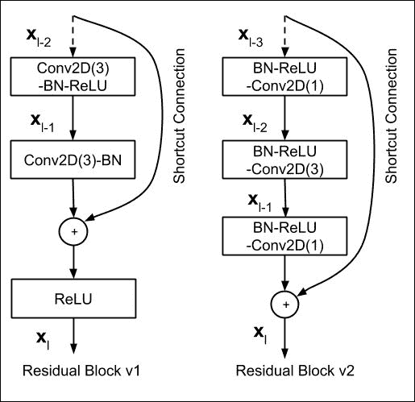
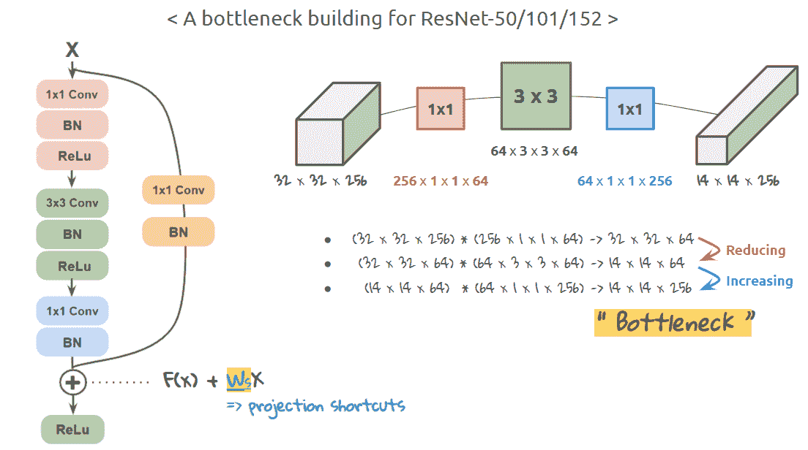
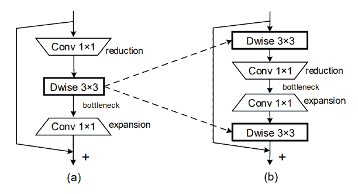
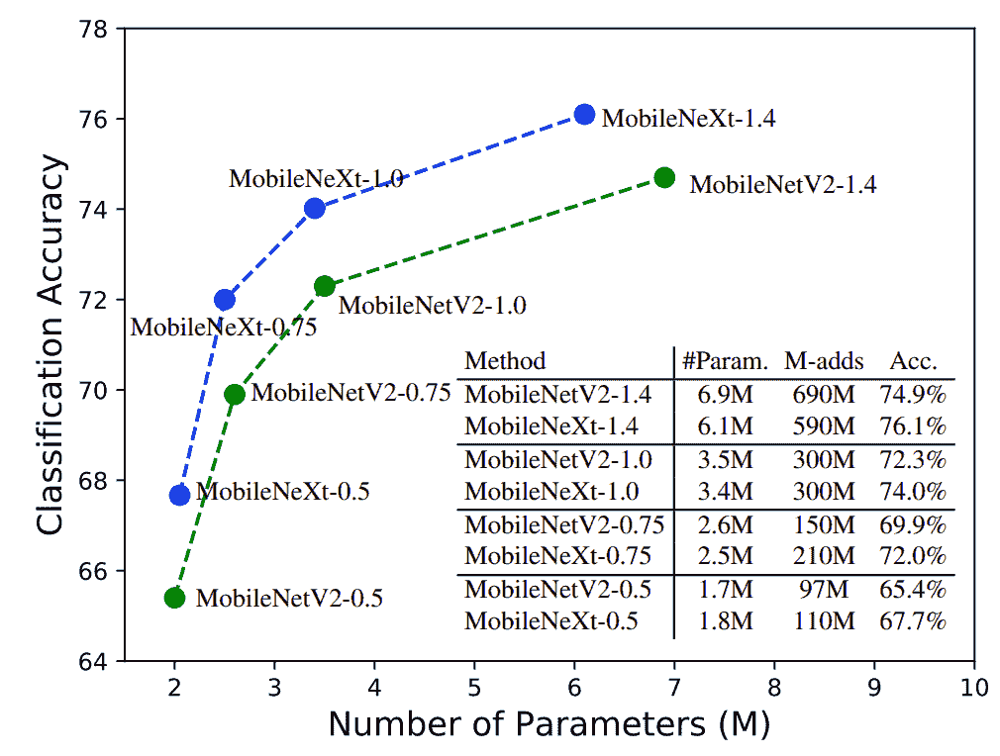
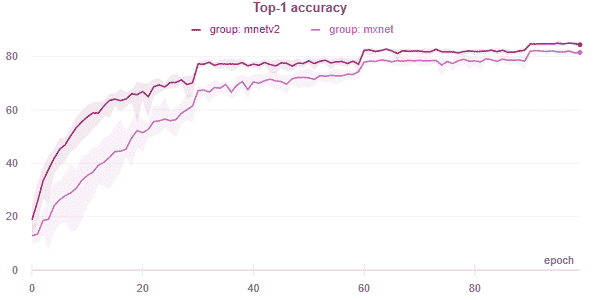

# 移动下一代(ECCV 2020)

> 原文：<https://blog.paperspace.com/mobilenext-eccv-2020/>

虽然深度神经网络的许多最新进展都倾向于优先考虑性能而不是复杂性，但社区中仍然有一种火花，可以使深度神经网络更便宜、更有效地用于更小的设备。高效神经网络的研究有各种方向，从[二元神经网络](https://github.com/liuzechun/ReActNet)和[高效网络](https://arxiv.org/abs/1905.11946)到基于组件的研究，如 [PyConv](https://github.com/iduta/pyconv) 和[深度方向卷积层](https://arxiv.org/abs/1610.02357)。一个经受住时间考验的作品是 MobileNet 模型集，其中包括 [MobileNet](https://arxiv.org/abs/1704.04861) 、 [MobileNetV2](https://arxiv.org/abs/1801.04381) 和 [MobileNetV3](https://arxiv.org/abs/1905.02244) 。

在本帖中，我们将继续推进 MobileNet 模型系列，推出在 ECCV 2020 上发布的新条目 [MobileNeXt](https://arxiv.org/abs/2007.02269) 。我们将首先回顾[剩余网络](https://arxiv.org/abs/1512.03385)和 MobileNetV2 的瓶颈结构，并讨论它们的差异。接下来，在深入研究沙漏块的 PyTorch 实现之前，我们将介绍 MobileNeXt 中提出的重新设计的瓶颈结构。我们将通过研究论文中观察到的结果，以及模型的缺点来结束本文。

## 目录

*   摘要
*   瓶颈结构
    1.  枝
    2.  剩余连接
    3.  反向剩余连接
*   MobileNeXt
    1.  沙漏块
    2.  PyTorch Code
*   结果
    1.  图像分类
    2.  PASCAL VOC 上的目标检测
*   缺点和进一步评论
*   参考

## 摘要

> 我们的研究结果倡导重新思考移动网络设计的瓶颈结构。似乎反向残差并不像通常认为的那样优于瓶颈结构。*   Our research reveals that establishing quick links along high-dimensional feature space can improve the model performance. In addition, the convolution in the depth direction should be carried out in a high-dimensional space to learn more expressive features, and learning linear residuals is also crucial to the bottleneck structure.*   Based on our research, we propose a novel hourglass block, which essentially extends the classical bottleneck structure. Experiments show that this architecture is more suitable for mobile applications in terms of accuracy and efficiency, and can be used as a "super" operator in architecture search algorithms to achieve better architecture generation.

## 瓶颈结构

高性能神经网络架构的第一个主要出现无疑是残差网络(称为 ResNet)。残差网络已经成为现代神经网络体系结构的核心和圣经。在这些网络中提出的剩余层已经出现在所有新颖的体系结构中，因为它能够改善信息传播。



Residual Blocks

ResNet 提出了一个基础的可移植结构，称为剩余块。残差块有两种变体，如上图所示；残差块 v1 和残差块 v2。残差块 v1 主要用于在 CIFAR 数据集上评估的较小的 ResNet 模型，而残差块 v2 是用于基于 ImageNet 的模型的更多讨论的块结构。从现在开始，当我们提到残差块时，我们将指残差块 v2，以保持讨论与基于 ImageNet 的模型相关。

让我们将这个剩余瓶颈分解为它的核心组件，包括主分支和剩余连接(也称为“快捷连接”)。



Residual Bottleneck

### 枝

如上所示，在残差块中，输入首先经历$(1 \乘以 1)$逐点卷积运算符(注意:逐点卷积不影响输入张量的空间维度，但用于操纵张量中的通道数量)。这之后是通道保持空间$(3 \乘以 3)$卷积，其本质上减少了输入张量中特征图的空间维度。最后，接下来是另一个逐点$(1 \乘以 1)$卷积层，它将通道的数量增加到与主分支的输入数量相同。

### 剩余连接

平行于主分支，输入张量被投影到与主分支输出相同的维数上。对于剩余连接，输入需要改变的唯一维度是空间维度，这是通过使用＄( 1 \乘以 1)＄卷积运算符来实现的，该运算符具有增加的步长，以使空间维度与主分支的输出维度相匹配。(注意:这个$(1 \乘以 1)$卷积不是逐点运算符。)

随后，残差被添加到主分支输出，然后最终通过标准非线性激活函数(本例中为 ReLU)。

### 反向剩余连接


Inverted Residuals Block in MobileNet v2

## MobileNeXt

通过引入反向残差块，MobileNetV2 取代了它的前身 MobileNetV1，成为了使用最广泛的轻量级架构之一。虽然残差块通过残差/快捷连接来连接更高维的张量(即具有更多通道的张量)，但 MobileNetV2 提出通过残差连接来连接瓶颈，并将更大的通道张量保持在主分支内，从而反转这一点。这是减少所需参数和触发器的关键重新设计因素之一。

深度方向卷积层的使用进一步放大了这一点，它基本上每个通道有一个卷积滤波器。通过这种结构上的彻底改革，MobileNets 无法在性能指标上超越其 ResNet 对手，如 ImageNet 数据集上的顶级准确性(这在很大程度上是因为这样一个事实，即由于使用了深度方向卷积运算符，特征空间急剧减少，因此表达能力大大降低。与 ResNet 系列机型相比，MobileNet 仍然能够实现相当好的性能(考虑到它的轻量级、快速性和高效性)。

### 沙漏块


(a) Residual Block (b) Inverted Residual Block (c) Sand Glass Block

基于我们之前对瓶颈结构的讨论，MobileNeXt 本质上提出了对瓶颈结构的又一次彻底检查，他们称之为沙漏块(如上图所示)。从理论上讲，沙漏是经典剩余瓶颈和反向剩余瓶颈的简单结合，它结合了两者的优点。让我们更详细地看一下:



(a) Inverted Residual Bottleneck (b) SandGlass Bottleneck

沙漏块本质上是经典的残差块，其中主分支中的第一个和最后一个卷积层是信道保持空间深度方向的卷积层。为了模拟瓶颈结构，它使用两个连续的逐点卷积运算符来先减少通道数，然后再增加通道数。这些逐点运算符堆叠在两个深度方向卷积层之间。因为现在更大的通道张量由深度方向内核操作，所以与例如 MobileNetV2 相比，参数的数量显著减少。

### PyTorch Code

```
import math
import torch
from torch import nn

def _make_divisible(v, divisor, min_value=None):
    """
    This function is taken from the original tf repo.
    It ensures that all layers have a channel number that is divisible by 8
    It can be seen here:
    https://github.com/tensorflow/models/blob/master/research/slim/nets/mobilenet/mobilenet.py
    :param v:
    :param divisor:
    :param min_value:
    :return:
    """
    if min_value is None:
        min_value = divisor
    new_v = max(min_value, int(v + divisor / 2) // divisor * divisor)
    # Make sure that round down does not go down by more than 10%.
    if new_v < 0.9 * v:
        new_v += divisor
    return new_v

class ConvBNReLU(nn.Sequential):
    def __init__(self, in_planes, out_planes, kernel_size=3, stride=1, groups=1, norm_layer=None):
        padding = (kernel_size - 1) // 2
        if norm_layer is None:
            norm_layer = nn.BatchNorm2d
        super(ConvBNReLU, self).__init__(
            nn.Conv2d(in_planes, out_planes, kernel_size, stride, padding, groups=groups, bias=False),
            norm_layer(out_planes),
            nn.ReLU6(inplace=True)
        )

class SandGlass(nn.Module):
    def __init__(self, inp, oup, stride, expand_ratio, identity_tensor_multiplier=1.0, norm_layer=None, keep_3x3=False):
        super(SandGlass, self).__init__()
        self.stride = stride
        assert stride in [1, 2]
        self.use_identity = False if identity_tensor_multiplier==1.0 else True
        self.identity_tensor_channels = int(round(inp*identity_tensor_multiplier))

        if norm_layer is None:
            norm_layer = nn.BatchNorm2d

        hidden_dim = inp // expand_ratio
        if hidden_dim < oup /6.:
            hidden_dim = math.ceil(oup / 6.)
            hidden_dim = _make_divisible(hidden_dim, 16)

        self.use_res_connect = self.stride == 1 and inp == oup

        layers = []
        # dw
        if expand_ratio == 2 or inp==oup or keep_3x3:
            layers.append(ConvBNReLU(inp, inp, kernel_size=3, stride=1, groups=inp, norm_layer=norm_layer))
        if expand_ratio != 1:
            # pw-linear
            layers.extend([
                nn.Conv2d(inp, hidden_dim, kernel_size=1, stride=1, padding=0, groups=1, bias=False),
                norm_layer(hidden_dim),
            ])
        layers.extend([
            # pw
            ConvBNReLU(hidden_dim, oup, kernel_size=1, stride=1, groups=1, norm_layer=norm_layer),
        ])
        if expand_ratio == 2 or inp==oup or keep_3x3 or stride==2:
            layers.extend([
            # dw-linear
            nn.Conv2d(oup, oup, kernel_size=3, stride=stride, groups=oup, padding=1, bias=False),
            norm_layer(oup),
        ])
        self.conv = nn.Sequential(*layers)

    def forward(self, x):
        out = self.conv(x)
        if self.use_res_connect:
            if self.use_identity:
                identity_tensor= x[:,:self.identity_tensor_channels,:,:] + out[:,:self.identity_tensor_channels,:,:]
                out = torch.cat([identity_tensor, out[:,self.identity_tensor_channels:,:,:]], dim=1)
                # out[:,:self.identity_tensor_channels,:,:] += x[:,:self.identity_tensor_channels,:,:]
            else:
                out = x + out
            return out
        else:
            return out
```

## 结果



Results on ImageNet classification task

如上图所示，MobileNeXt 似乎在各个方面都比 MobileNet 表现得更好。就参数而言，它更轻，但仍然比其等效的 MobileNetV2 获得更高的精度。在随后的表格中，我们将展示 MobileNeXt 在不同任务中的表现，如 ImageNet 数据集上的图像分类和 Pascal VOC 数据集上的对象检测。

### 图像分类

| 模型 | 我的钱。(米) | MAdd (M) | 排名第一的 Acc。(%) |
| --- | --- | --- | --- |
| MobilenetV1-1.0 | Four point two | Five hundred and seventy-five | Seventy point six |
| ShuffleNetV2-1.5 | Three point five | Two hundred and ninety-nine | Seventy-two point six |
| MobilenetV2-1.0 | Three point five | Three hundred | Seventy-two point three |
| MnasNet-A1 | Three point nine | Three hundred and twelve | Seventy-five point two |
| 移动电话 3-L-0.75 | Four | One hundred and fifty-five | Seventy-three point three |
| ProxylessNAS | Four point one | Three hundred and twenty | Seventy-four point six |
| FBNet-B | Four point five | Two hundred and ninety-five | Seventy-four point one |
| igcv 3d | Seven point two | Six hundred and ten | Seventy-four point six |
| GhostNet-1.3 | Seven point three | Two hundred and twenty-six | Seventy-five point seven |
| EfficientNet-b0 | Five point three | Three hundred and ninety | Seventy-six point three |
| MobileNeXt-1.0 | Three point four | Three hundred | Seventy-four point zero two |
| MobileNeXt-1.0 | Three point nine four | Three hundred and thirty | Seventy-six point zero five |
| MobileNeXt-1.1 | Four point two eight | Four hundred and twenty | Seventy-six point seven |

*MobileNeXt 表示添加了沙漏模块和 SE 模块的型号，以便与其他先进型号进行公平比较，例如 EfficientNet*

### PASCAL VOC 上的目标检测

| 方法 | 毅力 | 我的钱。(米) | M-Adds (B) | 地图(%) |
| --- | --- | --- | --- | --- |
| 固态硬盘 300 | VGG | Thirty-six point one | Thirty-five point two | Seventy-seven point two |
| 固态硬盘 320 | MobileNetV2 | Four point three | Zero point eight | Seventy-one point seven |
| 固态硬盘 320 | MobileNeXt | Four point three | Zero point eight | Seventy-two point six |

## 缺点和进一步评论

1.  该论文未能提供关于物体探测任务的结论性结果。它也没有 MS-COCO 实验来充分验证其对象检测性能。
2.  由于它与经典残差块更相关，因此它使用 ResNets 的训练方案，而不是 MobileNets 的训练方案，因此不是苹果与苹果的比较。如下图所示，当使用 MobileNetV2 的训练方案在 CIFAR 数据集上进行测试时，MobileNeXt 的性能比 MobileNetV2 模型差。



mnetv2 denotes MobileNet v2, while mxnet denotes MobileNeXt. Displaying mean of 5 runs on CIFAR-10 classification task.

总的来说，这是一个非常简单的想法，但提供了强大的结果，它可能有很好的机会成为计算机视觉领域的默认轻量级模型。

## 参考

*   [MobileNetV2:反向残差和线性瓶颈](https://arxiv.org/abs/1801.04381)
*   [MobileNets:用于移动视觉应用的高效卷积神经网络](https://arxiv.org/abs/1704.04861)
*   [搜索 MobileNetV3](https://arxiv.org/abs/1905.02244)
*   [ReActNet:走向精确的具有广义激活函数的二元神经网络](https://arxiv.org/abs/2003.03488)
*   [EfficientNet:反思卷积神经网络的模型缩放](https://arxiv.org/abs/1905.11946)
*   [金字塔卷积:重新思考用于视觉识别的卷积神经网络](https://arxiv.org/abs/2006.11538)
*   [例外:深度可分卷积深度学习](https://arxiv.org/abs/1610.02357)
*   [反思瓶颈结构，实现高效的移动网络设计](https://arxiv.org/abs/2007.02269)
*   [用于图像识别的深度残差学习](https://arxiv.org/abs/1512.03385)
*   [mobile next 正式实施](https://github.com/zhoudaquan/rethinking_bottleneck_design)
*   [mobile next 的非官方 PyTorch 实现](https://github.com/digantamisra98/MobileNext)