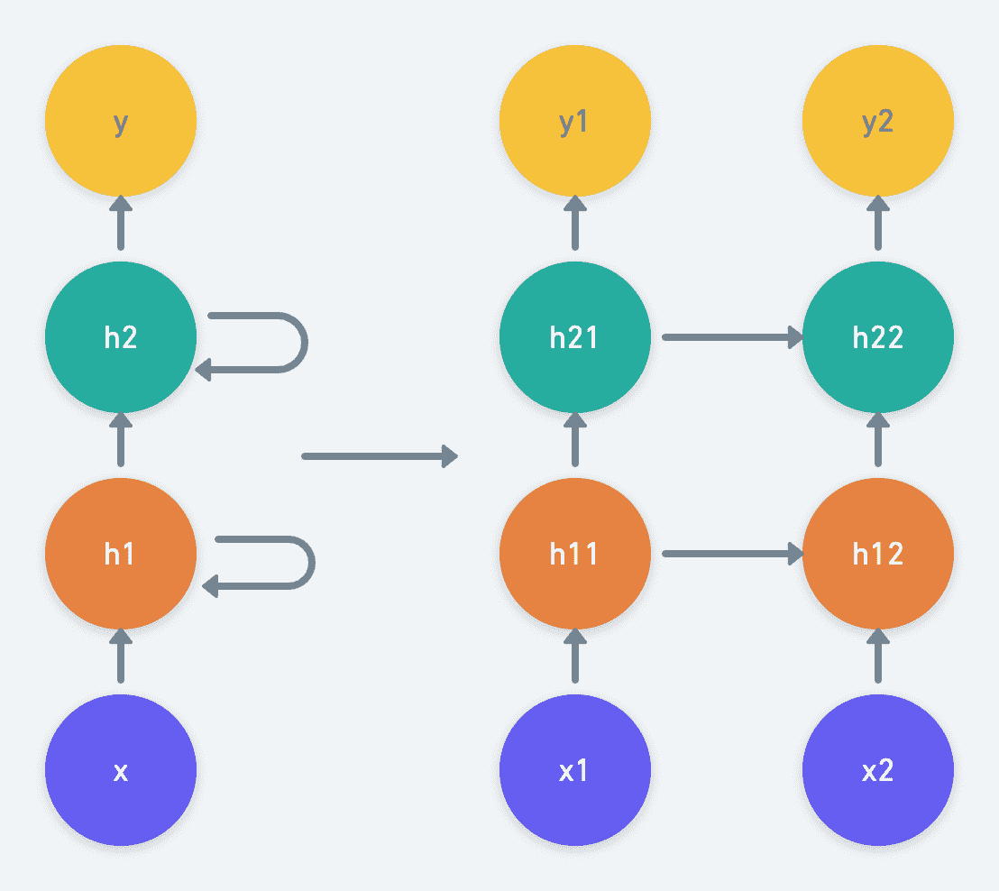
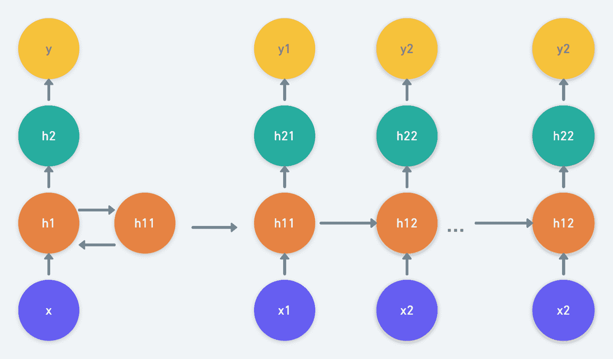
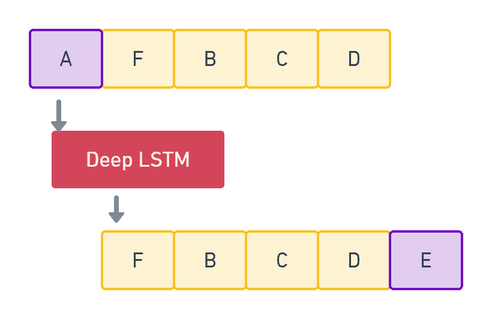

# 高级递归神经网络:深度递归神经网络

> 原文：<https://blog.paperspace.com/advanced-recurrent-neural-networks-deep-rnns/>

本系列为不同的递归神经网络(rnn)提供了高级指南。您将了解网络本身、它们的架构、应用，以及如何使用 Keras 将模型变为现实。

在本教程中，我们将从研究深层 RNNs 开始。具体来说，我们将涵盖:

1.  想法是:语音识别
2.  为什么是 RNN？
3.  将深度引入网络:深度 RNNs
4.  数学概念
5.  使用低沉的 RNN 产生音乐
6.  结论

我们开始吧！

## 想法是:语音识别

语音识别是计算机对语音中文本的识别。我们认为，言语本质上是连续的。如果你要对深度学习中的一个语音识别问题进行建模，你认为哪个模型最适合这个任务？

正如我们将看到的，它很可能是一个递归神经网络，或 RNN。

## 为什么是 RNN？

手写识别类似于语音识别，至少在数据类型方面是如此——它们都是连续的。有趣的是，从[在线手写识别](https://www.cs.toronto.edu/~graves/nips_2007.pdf)和[离线手写识别](https://www.cs.toronto.edu/~graves/nips_2008.pdf)研究中可以看出，rnn 已经在识别手写方面取得了最先进的成果。rnn 已经被证明可以利用顺序数据产生有效的输出。

因此，我们可以乐观地说，RNN 也最适合语音识别模型。

然而，出乎意料的是，当语音识别 RNN 模型拟合到数据上时，结果并不乐观。与典型的 RNN 相比，深度前馈神经网络产生了更好的精度。尽管 RNNs 在手写识别方面表现得相当好，但它并不被认为是语音识别任务的合适选择。

在分析了 RNNs 失败的原因后，研究人员提出了一个获得更高精度的可能解决方案:通过在网络中引入深度，类似于深度前馈神经网络的组成方式。

## 将深度引入网络:深度 RNNs

RNN 对时间来说是深刻的。但是如果它在空间上也是很深的，就像在一个前馈网络中一样呢？这是启发研究人员探索深度递归神经网络或深度 RNNs 的基本概念。

在典型的深 RNN 中，循环操作被扩展到多个隐藏单元。



A 2-Layer Deep RNN

通过向隐藏单元引入深度，也可以使 RNN 变深。



Multi-Layer Deep RNN - A Varied Representation

该模型增加了变量从时间$t$到时间$t + 1$所经过的距离。它可以将简单的 rnn、gru 或 LSTMs 作为其隐藏单元。它通过从所有端点捕获数据来帮助对变化的数据表示进行建模，并允许将多个/单个隐藏状态传递给后续层的多个隐藏状态。

## 数学概念

深 RNN 中的隐藏状态可以由下面的等式给出:

$$h^{l}_t = \phi^{l}(h^{l}_{t-1} * w^{l}_{hh}+h^{l-1}_{t} * w^{l}_{xh}+b^{l}_{h})$$

其中$\phi$是激活函数，$W$是权重矩阵，$b$是偏差。

隐藏状态$H_t$的输出由下式给出:

$$O_t = H^{l}_{t} * W_{hy} + b_y$$

深度 RNN 的训练类似于时间反向传播(BPTT)算法，如同在 RNN 中一样，但是具有附加的隐藏单元。

现在你已经知道什么是深沉的 RNN 了，在下一节我们将使用深沉的 RNN 和喀拉制作一个音乐生成器。

## 使用低沉的 RNN 产生音乐

音乐是终极语言。从未知的时代开始，我们就一直在创造和演奏美丽的旋律。在这种情况下，你认为计算机可以生成与我们(和一套乐器)相当的音符吗？

幸运的是，通过从大量已经存在的作品中学习，神经网络确实有能力产生一种新的音乐。使用计算机创作音乐是神经网络的一个令人兴奋的应用。由神经网络创作的音乐既有和声又有旋律，甚至可以作为人类的作品。

在直接进入代码之前，让我们先了解一下用于训练网络的音乐表示。

### 乐器数字接口(MIDI)

MIDI 是由 MIDI 乐器解释以演奏音乐的一系列信息。为了有意义地利用 MIDI 对象，我们将使用 [music21](http://web.mit.edu/music21/) Python 库，它有助于获取音符和理解乐谱。

下面是一段使用 music21 库读取的 MIDI 文件的摘录:

```
[<music21.stream.Part 0x7fba822de4d0>,
 <music21.instrument.Piano 'Piano'>,
 <music21.instrument.Piano 'Piano'>,
 <music21.tempo.MetronomeMark Quarter=125.0>,
 <music21.key.Key of C major>,
 <music21.meter.TimeSignature 4/4>,
 <music21.chord.Chord D2 G2>,
 <music21.note.Rest rest>,
 <music21.chord.Chord G2 D2>,
 <music21.note.Rest rest>,
 <music21.note.Note C>,
 <music21.note.Rest rest>,
 <music21.chord.Chord D2 G2>,
 <music21.note.Rest rest>,
 <music21.chord.Chord G2 D2>,
 <music21.note.Rest rest>,
 <music21.note.Note C>,
 <music21.note.Rest rest>,
 <music21.chord.Chord D2 G2>,
 <music21.chord.Chord G2 D2>,
 <music21.note.Rest rest>,
 <music21.note.Note C>,
 <music21.note.Rest rest>,
 <music21.chord.Chord G2 D2>]
```

这里:

*   是 music21 对象的基本容器。
*   `instrument`定义使用的仪器。
*   `tempo`使用文本字符串和数字指定基础节拍的速度。
*   `note`包含有关音符的音高、八度和偏移的信息。音高是频率，八度是音高的差异，偏移是指音符的位置。
*   `chord`类似于`note`对象，但有多个音高。

我们将使用 music21 库来理解 MIDI 文件，训练 RNN，并创作我们自己的音乐。

### 深埋地磁石

从你目前所学的，你可以猜测音乐属于哪种数据。因为音乐是由一系列音符组成的，所以我们可以说音乐是序列数据。

在本教程中，我们将使用长时短时记忆(LSTM)网络来长时间记忆信息，这是音乐生成所必需的。由于需要捕捉各种音符和互动，我们将特别使用深沉的 LSTM。

### 步骤 1:导入数据集

首先导入[洋红](https://magenta.tensorflow.org/)项目下可用的 Groove MIDI 数据集([下载链接](https://storage.googleapis.com/magentadata/datasets/groove/groove-v1.0.0-midionly.zip))。它包含大约 1，150 个 MIDI 文件和超过 22，000 个击鼓小节。对所有数据的训练消耗大量时间和系统资源。因此，让我们导入 MIDI 文件的一小部分。

为此，在数据集目录上使用`glob.glob()`方法来过滤`.mid`文件。

```
import glob
songs = glob.glob('groovemagenta/**/*.mid', recursive=True)
```

让我们打印数据集的长度。

```
len(songs) 
```

```
# Output
1150
```

从数据集中随机抽取 200 个 MIDI 文件。

```
import random

songs = random.sample(songs, 200)
songs[:2]
```

```
# Output
['groovemagenta/groove/drummer1/session1/55_jazz_125_fill_4-4.mid',
 'groovemagenta/groove/drummer1/session1/195_reggae_78_fill_4-4.mid']
```

现在打印由 music21 库读取的 MIDI 文件。

```
!pip3 install music21

from music21 import converter

file = converter.parse(
    "groovemagenta/groove/drummer1/session1/55_jazz_125_fill_4-4.mid"
)
components = []
for element in file.recurse():
    components.append(element)

components
```

```
# Output
[<music21.stream.Part 0x7fba822de4d0>,
 <music21.instrument.Piano 'Piano'>,
 <music21.instrument.Piano 'Piano'>,
 <music21.tempo.MetronomeMark Quarter=125.0>,
 <music21.key.Key of C major>,
 <music21.meter.TimeSignature 4/4>,
 <music21.chord.Chord D2 G2>,
 <music21.note.Rest rest>,
 <music21.chord.Chord G2 D2>,
 <music21.note.Rest rest>,
 <music21.note.Note C>,
 <music21.note.Rest rest>,
 <music21.chord.Chord D2 G2>,
 <music21.note.Rest rest>,
 <music21.chord.Chord G2 D2>,
 <music21.note.Rest rest>,
 <music21.note.Note C>,
 <music21.note.Rest rest>,
 <music21.chord.Chord D2 G2>,
 <music21.chord.Chord G2 D2>,
 <music21.note.Rest rest>,
 <music21.note.Note C>,
 <music21.note.Rest rest>,
 <music21.chord.Chord G2 D2>]
```

### 步骤 2:将 MIDI 转换成音乐 21 音符

导入所需的库。

```
import pickle
from music21 import instrument, note, chord, stream
```

接下来，定义一个函数`get_notes()`从所有的 MIDI 文件中获取音符。使用`convertor.parse()`方法将每个 MIDI 文件加载到 music21 流对象中。使用这个对象来获取对应于 MIDI 文件的所有音符和和弦。此外，根据乐器划分 music21 对象。如果有仪器存在，使用`recurse()`方法检查第一部分(`parts[0]`中是否有可用的内部子流。获取所有的音符和和弦，并将每个音符对象的音高的字符串表示追加到一个数组中。如果是和弦，将每个音符的`id`附加到由点字符连接的字符串上。

```
""" 
Convert mid to notes
"""

def get_notes():
    notes = []

    for file in songs:
        # Convert .mid file to stream object
        midi = converter.parse(file)
        notes_to_parse = []

        try:
            # Partition stream per unique instrument
            parts = instrument.partitionByInstrument(midi)
        except:
            pass

        # If there's an instrument, enter this branch
        if parts:
            # Check if there are inner substreams available
            notes_to_parse = parts.parts[0].recurse()
        else:
            # A very important read-only property that returns a new Stream that has all
            # sub-containers “flattened” within it, that is, it returns a new Stream where
            # no elements nest within other elements.
            notes_to_parse = midi.flat.notes

        for element in notes_to_parse:
            # Extract pitch if the element is a note
            if isinstance(element, note.Note):
                notes.append(str(element.pitch))

            # Append the normal form of chord(integers) to the notes list
            elif isinstance(element, chord.Chord):
                notes.append(".".join(str(n) for n in element.normalOrder))

    with open("notes", "wb") as filepath:
        pickle.dump(notes, filepath)

    return notes
```

### 步骤 3:预处理数据

我们现在必须通过将基于字符串的数据映射到基于整数的数据，使我们的数据与网络处理兼容。

首先导入所需的库。

```
import numpy as np
from tensorflow.keras import utils
```

将序列长度(即输入序列的长度)定义为 100。这意味着在每个输入序列中将有 100 个音符/和弦。

接下来，将音符映射到整数，并创建输入和输出序列。每第 101 个音符(一组 100 个音符之后的一个音符)被作为训练模型的每个输入的输出。将输入整形为 3D 数组:`samples x timesteps x features`。`samples`指定输入的数量；`timesteps`，序列长度；和`features`，每个时间步的输出数。

最后，通过将输入除以对应于音符数的值来归一化输入。现在将输出转换为一个独热编码向量。

创建一个函数`prep_seq()`,将输入和输出映射到它们对应的网络兼容数据，如下面的代码所示。

```
""" 
Mapping strings to real values
"""

def prep_seq(notes):

    seq_length = 100

    # Remove duplicates from the notes list
    pitchnames = sorted(set(notes))

    # A dict to map values with intgers
    notes_to_int = dict((pitch, n) for n, pitch in enumerate(pitchnames))

    net_in = []
    net_out = []

    # Iterate over the notes list by selecting 100 notes every time,
    # and the 101st will be the sequence output
    for i in range(0, len(notes) - seq_length, 1):
        seq_in = notes[i : i + seq_length]
        seq_out = notes[i + seq_length]
        net_in.append([notes_to_int[j] for j in seq_in])
        net_out.append(notes_to_int[seq_out])

    number_of_patterns = len(net_in)

    # Reshape the input into LSTM compatible (3D) which should have samples, timesteps & features
    # Samples - One sequence is one sample. A batch consists of one or more samples.
    # Time Steps - One time step is one point of observation in the sample.
    # Features - One feature is one observation at a time step.
    net_in = np.reshape(net_in, (number_of_patterns, seq_length, 1))

    # Normalize the inputs
    net_in = net_in / float(len(pitchnames))

    # Categorize the outputs to one-hot encoded vector
    net_out = utils.to_categorical(net_out)

    return (net_in, net_out) 
```

### 步骤 4:定义模型

首先分别从`tensorflow.keras.models`和`tensorflow.keras.layers`库中导入所需的模型和层。

```
from tensorflow.keras.models import Sequential

from tensorflow.keras.layers import (
    Activation,
    LSTM,
    Dense,
    Dropout,
    Flatten,
    BatchNormalization,
)
```

移动到模型的架构上，首先定义一个连续的 Keras 块，并将所有的层附加到它上面。

前两层必须是 LSTM 积木。第一 LSTM 层的输入形状必须是从发送到函数`net_arch()`的输入数据中导出的形状。将输出神经元的数量设置为 256(这里可以使用不同的数量；这肯定会影响您将获得的最终精度)。

LSTM 块中的`return_sequences`被设置为`True`，因为第一层的输出被传递到随后的 LSTM 层。`return_sequences`确保保持数据的原样，而不删除序列长度属性，否则该属性将被忽略。`recurrent_dropout`设置为 0.3，以忽略更新 LSTM 存储单元时使用的 30%的节点。

接下来，追加一个`BatchNormalization`图层，通过对每个小批量的网络数据进行重新居中和重新缩放来归一化输入。这产生了正则化效果，并强制使用更少的训练时段，因为它减少了层之间的相互依赖性。

添加一个`Dropout`层来调整输出，防止在训练阶段过度拟合。设 0.3 为辍学率。这里的 0.3 意味着 30%的输入神经元将被无效。

添加一个由 128 个神经元组成的`Dense`层，其中每个输入节点都连接到一个输出节点。

现在添加 ReLU 激活。此外，执行批量标准化并添加 dropout。然后将先前的密集层输出映射到由对应于音符数量的节点组成的密集层。添加 softmax 激活以在预测阶段生成每个音符的最终概率。

用`categorical_crossentropy` loss 和`adam` optimizer 编译模型。

最后，在函数`net_arch()`中定义模型的架构，该函数接受模型的输入数据和输出数据长度作为参数。

添加以下代码来定义您的网络体系结构。

```
"""
Network Architecture
"""

def net_arch(net_in, n_vocab):
    model = Sequential()

    # 256 - dimensionality of the output space
    model.add(
        LSTM(
            256,
            input_shape=net_in.shape[1:],
            return_sequences=True,
            recurrent_dropout=0.3,
        )
    )
    model.add(LSTM(256))
    model.add(BatchNormalization())
    model.add(Dropout(0.3))
    model.add(Dense(128))
    model.add(Activation("relu"))
    model.add(BatchNormalization())
    model.add(Dropout(0.3))
    model.add(Dense(n_vocab))
    model.add(Activation("softmax"))

    model.compile(loss="categorical_crossentropy", optimizer="adam")
    return model 
```

### 第五步:训练你的模型

在训练阶段保存模型的权重总是一个好的做法。这样你就不需要在每次修改的时候一次又一次的训练模型。

添加以下代码来检查模型的权重。

```
from tensorflow.keras.callbacks import ModelCheckpoint

def train(model, net_in, net_out, epochs):
    filepath = "weights.best.music3.hdf5"
    checkpoint = ModelCheckpoint(
        filepath, monitor="loss", verbose=0, save_best_only=True
    )
    model.fit(net_in, net_out, epochs=epochs, batch_size=32, callbacks=[checkpoint])
```

`model.fit()`方法用于将模型拟合到训练数据上，其中批量被定义为 32。

获取音乐笔记，准备数据，初始化模型，定义训练参数，调用`train()`方法开始训练模型。

```
epochs = 30
notes = get_notes()
n_vocab = len(set(notes))
net_in, net_out = prep_seq(notes)
model = net_arch(net_in, n_vocab)
train(model, net_in, net_out, epochs)
```

```
# Output
Epoch 1/30
2112/2112 [==============================] - 694s 329ms/step - loss: 3.5335
Epoch 2/30
2112/2112 [==============================] - 696s 330ms/step - loss: 3.2389
Epoch 3/30
2112/2112 [==============================] - 714s 338ms/step - loss: 3.2018
Epoch 4/30
2112/2112 [==============================] - 706s 334ms/step - loss: 3.1599
Epoch 5/30
2112/2112 [==============================] - 704s 333ms/step - loss: 3.0997
Epoch 6/30
2112/2112 [==============================] - 719s 340ms/step - loss: 3.0741
Epoch 7/30
2112/2112 [==============================] - 717s 339ms/step - loss: 3.0482
Epoch 8/30
2112/2112 [==============================] - 733s 347ms/step - loss: 3.0251
Epoch 9/30
2112/2112 [==============================] - 701s 332ms/step - loss: 2.9777
Epoch 10/30
2112/2112 [==============================] - 707s 335ms/step - loss: 2.9390
Epoch 11/30
2112/2112 [==============================] - 708s 335ms/step - loss: 2.8909
Epoch 12/30
2112/2112 [==============================] - 720s 341ms/step - loss: 2.8442
Epoch 13/30
2112/2112 [==============================] - 711s 337ms/step - loss: 2.8076
Epoch 14/30
2112/2112 [==============================] - 728s 345ms/step - loss: 2.7724
Epoch 15/30
2112/2112 [==============================] - 738s 350ms/step - loss: 2.7383
Epoch 16/30
2112/2112 [==============================] - 736s 349ms/step - loss: 2.7065
Epoch 17/30
2112/2112 [==============================] - 740s 350ms/step - loss: 2.6745
Epoch 18/30
2112/2112 [==============================] - 795s 376ms/step - loss: 2.6366
Epoch 19/30
2112/2112 [==============================] - 808s 383ms/step - loss: 2.6043
Epoch 20/30
2112/2112 [==============================] - 724s 343ms/step - loss: 2.5665
Epoch 21/30
2112/2112 [==============================] - 726s 344ms/step - loss: 2.5252
Epoch 22/30
2112/2112 [==============================] - 720s 341ms/step - loss: 2.4909
Epoch 23/30
2112/2112 [==============================] - 753s 357ms/step - loss: 2.4574
Epoch 24/30
2112/2112 [==============================] - 807s 382ms/step - loss: 2.4170
Epoch 25/30
2112/2112 [==============================] - 828s 392ms/step - loss: 2.3848
Epoch 26/30
2112/2112 [==============================] - 833s 394ms/step - loss: 2.3528
Epoch 27/30
2112/2112 [==============================] - 825s 391ms/step - loss: 2.3190
Epoch 28/30
2112/2112 [==============================] - 805s 381ms/step - loss: 2.2915
Epoch 29/30
2112/2112 [==============================] - 812s 384ms/step - loss: 2.2632
Epoch 30/30
2112/2112 [==============================] - 816s 386ms/step - loss: 2.2330
```

### 步骤 6:根据模型生成预测

该步骤由以下子步骤组成:

*   获取已经存储的音符
*   生成输入序列
*   规范化输入序列
*   通过传递新的输入来定义模型
*   加载训练模型时存储的先前权重
*   预测随机选择的输入序列的输出
*   将输出转换为 MIDI 并保存！

创建一个函数`generate()`来适应所有这些步骤。

```
"""
Generate a Prediction
"""

def generate():

    # Load music notes
    with open("notes", "rb") as filepath:
        notes = pickle.load(filepath)

    pitchnames = sorted(set(notes))
    n_vocab = len(pitchnames)

    print("Start music generation.")

    net_in = get_inputseq(notes, pitchnames, n_vocab)

    normalized_in = np.reshape(net_in, (len(net_in), 100, 1))
    normalized_in = normalized_in / float(n_vocab)
    model = net_arch(normalized_in, n_vocab)

    model.load_weights("weights.best.music3.hdf5")
    prediction_output = generate_notes(model, net_in, pitchnames, n_vocab)
    create_midi(prediction_output)
```

`get_inputseq()`函数返回一组输入序列。这已经在上面的步骤 3 中探讨过了。

```
"""
Generate input sequences
"""

def get_inputseq(notes, pitchnames, n_vocab):
    note_to_int = dict((pitch, number) for number, pitch in enumerate(pitchnames))

    sequence_length = 100
    network_input = []

    for i in range(0, len(notes) - sequence_length, 1):
        sequence_in = notes[i : i + sequence_length]
        network_input.append([note_to_int[char] for char in sequence_in])

    return network_input
```

您现在可以从随机选取的输入序列中生成 500 个音符。选择 softmax 激活返回的最高概率，并将编码数字与其对应的音符反向映射。将已经训练好的字符的输出追加到输入序列的末尾，并从后续字符开始下一次迭代。这样，我们通过在整个输入序列中从一个字符移动到下一个字符来生成 500 个音符。



This is how the training phase proceeds. AFBCD is the input sequence being fed into the network (The actual input length would be 100 in our model). The model first analyzes note 'A' and outputs a prediction 'E' which is then appended at the end of the sequence. The sequence FBCDE is given as the subsequent input to the network. 

```
"""
Predict the notes from a random input sequence
"""

def generate_notes(model, net_in, notesnames, n_vocab):
    start = np.random.randint(0, len(net_in) - 1)
    int_to_note = dict((number, note) for number, note in enumerate(notesnames))
    pattern = net_in[start]
    prediction_output = []
    print("Generating notes")

    # Generate 500 notes
    for note_index in range(500):
        prediction_input = np.reshape(pattern, (1, len(pattern), 1))
        prediction_input = prediction_input / float(n_vocab)
        prediction = model.predict(prediction_input, verbose=0)

        index = np.argmax(prediction)
        result = int_to_note[index]
        prediction_output.append(result)

        # Add the generated index of the character,
        # and proceed by not considering the first char in each iteration
        pattern.append(index)
        pattern = pattern[1 : len(pattern)]

    print("Notes generated")
    return prediction_output
```

最后，将音符转换成 MIDI 格式。

创建一个函数`create_midi()`并将预测的编码输出作为参数传递给它。确定音符是音符还是和弦，分别适当生成`note`和`chord`对象。如果是和弦，将它拆分成一个音符数组，并为每个项目创建一个音符对象。将这组音符附加到一个`chord`对象和一个输出数组。如果是注释，只需创建一个`note`对象，并将其附加到输出数组中。

最后，将 MIDI 输出保存到一个`test_output.mid`文件。

```
""" 
Convert the notes to MIDI format
"""

def create_midi(prediction_output):
    offset = 0
    output_notes = []

    # Create Note and Chord objects
    for pattern in prediction_output:
        # Chord
        if ("." in pattern) or pattern.isdigit():
            notes_in_chord = pattern.split(".")
            notes = []

            for current_note in notes_in_chord:
                new_note = note.Note(int(current_note))
                new_note.storedInstrument = instrument.Piano()
                notes.append(new_note)

            new_chord = chord.Chord(notes)
            new_chord.offset = offset
            output_notes.append(new_chord)
        # Note
        else:
            new_note = note.Note(pattern)
            new_note.offset = offset
            new_note.storedInstrument = instrument.Piano()
            output_notes.append(new_note)

        # Increase offset so that notes do not get clumsy
        offset += 0.5

    midi_stream = stream.Stream(output_notes)
    print("MIDI file save")
    midi_stream.write("midi", fp="test_output.mid")
```

现在调用`generate()`函数。

```
generate()
```

您可以通过将生成的 mid 文件上传到 [MIDI 播放器](http://midiplayer.ehubsoft.net/)来播放它。

这个 [SoundCloud tune](https://soundcloud.com/user-44399948-454641721/deep-rnn-sound-track) 是通过在 NVIDIA K80 GPU 上训练模型大约 6 个小时 30 个历元而生成的。

## 结论

在本教程中，您已经学习了什么是深 RNN，以及它如何优于基本 RNN。你也训练了一个深度 LSTM 模型来产生音乐。

深度 RNN (LSTM)模型从它的学习中产生了一个相当过得去的曲调，尽管由于时代的数量较少，音乐可能看起来单调。我想说这是一个好的开始！

为了获得更好的音符和和弦，我建议你四处弹奏并修改网络的参数。您可以调整超参数，增加历元的数量，并修改网络的深度，以检查您是否能够生成更好的结果。

在本系列的下一部分，我们将讨论编码器-解码器序列到序列模型。

### 参考

斯库尔德古典钢琴作曲家