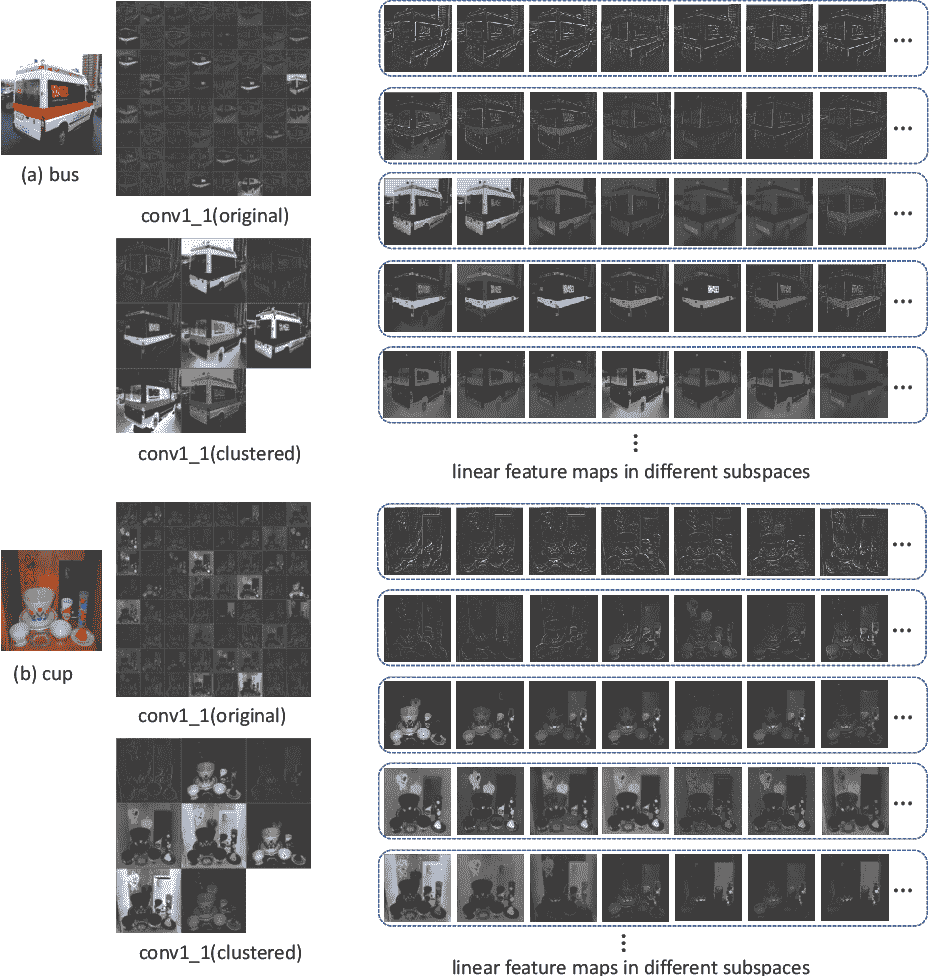
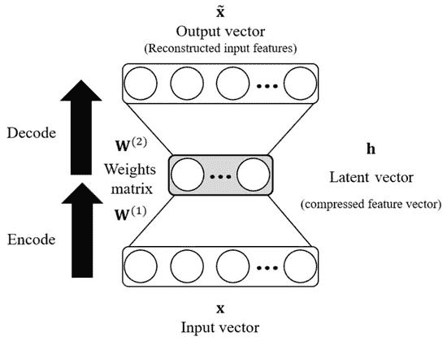
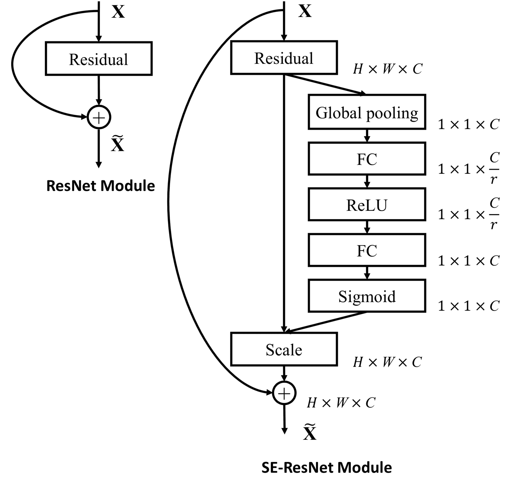
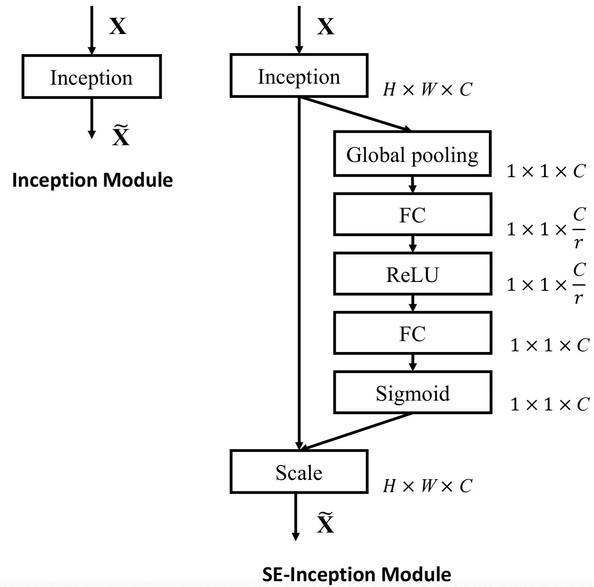
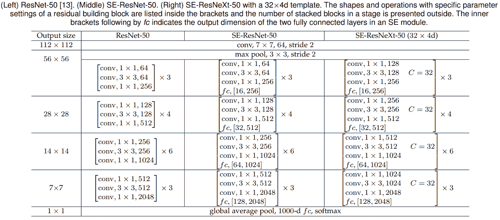
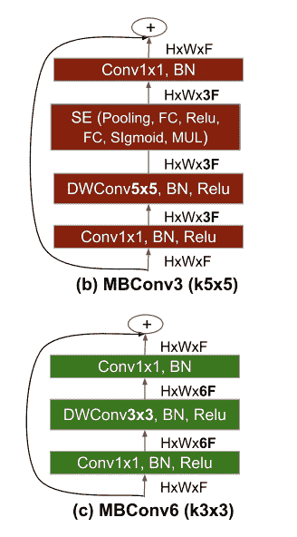

# 通道注意和挤压-激发网络(SENet)

> 原文：<https://blog.paperspace.com/channel-attention-squeeze-and-excitation-networks/>

在计算机视觉的注意机制的早期，在 CVPR 2018(和 TPAMI)上发表的一篇论文，挤压和激励网络，介绍了一种新颖的通道注意机制。这种简单而高效的附加模块可以添加到任何基线架构中，以获得性能改善，而计算开销可以忽略不计。

在本文中，我们将分四部分讨论压缩-激发网络。首先，我们将通过参观现代摄影技术中的一些方面来理解为什么通道注意力是重要的背后的直觉。然后，我们将推进到在挤压和激发(SE)块中计算通道注意所涉及的方法。接下来，我们将剖析标准架构中挤压和激励(SE)模块的影响，同时评估它们在不同计算机视觉任务中的作用。最后，我们将对这篇论文提出的方法中的某些缺点进行评论。

### 目录

*   现代摄影中的画面选择
*   卷积神经网络中的通道注意
*   压缩和激励网络
*   密码
*   有效网中的 MBConv
*   基准
*   缺点
*   参考

## 现代摄影中的画面选择


Frame Shots in Pixel 2

随着现代摄影技术在捕捉最佳镜头的智能机制方面经历了几代人的改进，一种最微妙的技术已经不为人知，那就是选择静态照片的最佳帧镜头。这是某些智能手机的常见特征。

一张静止的照片中有许多可变因素。在同样的条件和环境下，同一主题相隔一秒钟拍摄的两张照片仍然会有很大差异。例如，在两张照片中的一张中，他们的眼睛可能是闭着的。为了获得最佳照片，最好在拍摄照片的瞬间捕捉多个帧，这样摄影师可以从捕捉的所有帧中选择最佳帧。如今，这是以自动化、智能化的方式完成的。像谷歌 Pixel 这样的智能手机能够在拍摄单张照片时，从所有可用的帧中挑选出最佳帧。这种智能机制受不同因素的制约，如照明、对比度、模糊、背景失真等。抽象地说，智能机制是选择包含照片的最佳代表信息的帧。

就现代卷积神经网络架构而言，您可以将帧视为由卷积层计算的张量中的通道。这个张量通常用 a ( *B，C，H，W* )维度表示，其中 *B* 表示批量， *C* 表示通道， *H* ， *W* 表示特征图的空间维度( *H* 表示高度， *W* 表示宽度)。信道是卷积滤波器从输入中导出不同特征的结果。然而，通道可能不具有相同的代表性重要性。由于某些信道可能比其他信道更重要，因此在传播到下一层之前，根据信道的重要性对其应用权重是有意义的。

我们将利用这一点作为对渠道关注重要性的基本理解，这一点我们将在接下来的章节中讨论。

## 渠道关注

基于上一节中描述的直觉，让我们深入了解为什么通道注意力是提高深度卷积神经网络架构的泛化能力的关键组件。

概括地说，在卷积神经网络中，有两个主要组件:

1.  用维度( *B* 、 *C* 、 *H* 、 *W* )表示的输入张量(通常是四维张量)。
2.  包含该层权重的可训练卷积滤波器。

卷积滤波器负责基于这些滤波器内学习到的权重来构建特征图。一些滤波器学习边缘，另一些学习纹理，并且它们共同学习由输入张量嵌入的图像内的目标类别信息的不同特征表示。因此，信道的数量代表学习输入的不同特征映射的卷积滤波器的数量。从我们以前对摄影中选帧的理解来看，这些特征图也有不同的重要性。这意味着一些特征地图比其他的更重要。例如，与学习背景纹理过渡的另一个特征图相比，包含边缘信息的特征图对于学习可能更加重要和关键。因此，在基本层面上，人们希望提供与对应的特征地图相比具有更高重要程度的“更重要的”特征地图。



Example Feature Maps

这是渠道关注的基础。我们希望将这种“注意力”集中在更重要的渠道上，这基本上是给予特定渠道比其他渠道更高的重要性。最简单的方法是用更高的值来缩放更重要的通道。这正是压缩激发网络所提出的。

## 压缩和激励网络

2018 年，胡等人在 2018 上发表了题为 [*压缩-激发网络*](https://arxiv.org/abs/1709.01507) 的论文，论文的期刊版本在 TPAMI。这篇论文被誉为注意力机制领域最有影响力的作品之一，已经被引用了 1000 多次。让我们看看文件提出了什么。


Squeeze-Excitation Module

本文提出了一种新型、易于插入的模块，称为挤压激励模块(缩写为 SE-block)，由三个组件组成(如上图所示):

1.  挤压模块
2.  激励模块
3.  比例模块

让我们更详细地了解这些模块，并理解它们在渠道关注方面的重要性。

### 挤压模块

为了获得最佳的频道关注，人们会希望特征图的缩放自适应于特征图本身。概括地说，特征映射集本质上是来自卷积层的输出张量(通常是四维维度的张量( *B，C，H，W* )，其中首字母代表特征映射的批量大小、通道、高度和宽度)。为简单起见，我们仅将其视为形状的三维张量( *C，H，W*)–本质上，我们关心的是深度(张量中通道/特征图的数量)和该张量中每个特征图的空间维度。因此，为了使通道注意力适应每个通道本身，我们总共要关注 *H* × *W* 个像素(或值)。这基本上意味着，为了使注意力真正适应，你将总共使用*C*×*H*×*W*值进行操作。该值将变得非常大，因为在现代神经网络中，通道的数量随着网络深度的增加而变大。因此，需要使用能够将每个特征图的信息分解成奇异值的特征描述符，这将有助于降低整个操作的计算复杂度。

这就形成了挤压模块的动机。存在许多特征描述符可用于将特征图的空间维度减少到奇异值，但是用于在卷积神经网络中减少空间大小的一般方法是汇集。有两种非常流行的池化方法:平均池化和最大池化。前者计算定义窗口内的平均像素值，而后者取同一定义窗口内的最大像素值。两者都有各自的优点和缺点。虽然 max pooling 保留了最活跃的像素，但它也会非常嘈杂，并且不会考虑相邻像素。另一方面，平均池不能保存信息；然而，它构建了该窗口中所有像素的更平滑的平均值。

作者进行了一项消融研究，以调查每个描述符的性能，即全局平均池(GAP)和全局最大池(GMP)，如下表所示。

| 描述符 | 最高错误率 | 前 5 名错误率 |
| --- | --- | --- |
| 良好操作规范 | Twenty-two point five seven | Six point zero nine |
| 缝隙 | **22.28** | **6.03** |

因此，挤压模块选择两者中更平滑的选项，并使用全局平均池(GAP)操作，该操作通过取该特征图中所有像素的平均值，基本上将整个特征图减少到单一值。因此，就维度而言，如果输入张量是( *C* × *H* × *W* )，那么在通过间隙算子之后，所获得的输出张量将是( *C* ×1×1)的形状，本质上是长度为 *C* 的向量，其中每个特征图现在被分解为奇异值。

为了验证挤压算子的重要性，作者进一步比较了挤压变量和非挤压变量，如下表所示。注意:无挤压变体本质上意味着包含特征图的张量没有被减少到单个像素，并且激励模块在整个张量上操作。

| 不同的 | 最高错误率 | 前 5 名错误率 | GFLOPs | 因素 |
| --- | --- | --- | --- | --- |
| Vanilla ResNet-50 | Twenty-three point three | Six point five five | **3.86** | 25.6 米 |
| 诺斯奎泽 | Twenty-two point nine three | Six point three nine | Four point two seven | 28.1 米 |
| 如果 | **22.28** | **6.03** | Three point eight seven | 28.1 米 |

### 激励模块



Example of a Multi-Layer Perceptron (MLP) structure.

现在，随着输入张量被分解成(C×1×1)的相当小的尺寸，模块的下一部分是学习这些通道的自适应缩放权重。对于挤压和激励块中的激励模块，作者选择完全连接的多层感知器(MLP)瓶颈结构来映射缩放权重。这个 MLP 瓶颈有一个单独的隐藏层，以及形状相同的输入层和输出层。隐藏层用作缩减块，其中输入空间缩减为由缩减因子(默认设置为 16)定义的更小空间。然后将压缩空间扩展回原始维度作为输入张量。用更简洁的术语来说，MLP 每一层的维度变化可以由以下三点来定义:

1.  输入的形状为( *C* ×1×1)。因此，在输入层有 *C* 个神经元。
2.  隐藏层通过缩减因子 *r* 来减少这一点，从而导致神经元的总数为 *C* / *r* 。
3.  最后，输出被投射回与输入相同的维度空间，总共回到 *C* 神经元。

总的来说，你传递( *C* ×1×1)张量作为输入，得到一个相同形状的加权张量——(*C*×1×1)。

作者提供了使用不同缩减率( *r* )对 ResNet-50 架构中的阿瑟模块的性能进行实验的结果，如下表所示。

| r | 最高错误率 | 前 5 名错误率 | 因素 |
| --- | --- | --- | --- |
| Two | Twenty-two point two nine | Six | 45.7 米 |
| four | **22.25** | Six point zero nine | 35.7 米 |
| eight | Twenty-two point two six | **5.99** | 30.7 米 |
| Sixteen | Twenty-two point two eight | Six point zero three | 28.1 米 |
| Thirty-two | Twenty-two point seven two | Six point two | 26.9 米 |
|  |  |  |  |
| 香草 | Twenty-three point three | Six point five five | 25.6 米 |

理想情况下，为了改善信息传播和更好的跨信道交互(CCI)，应将 *r* 设置为 1，从而使其成为一个每层宽度相同的全连通方形网络。然而，随着 *r* 的降低，复杂性的增加和性能的提高之间存在着一种平衡。因此，基于上表，作者使用 16 作为减少比率的默认值。这是一个超参数，可以进一步调整以提高性能。

### 比例模块

从激发模块获得( *C* ×1×1)“激发”张量后，它首先通过一个 sigmoid 激活层，该激活层将数值调整到 0-1 的范围内。随后，通过简单的广播的逐元素乘法，将输出直接应用于输入，该乘法利用来自激励模块中的 MLP 的相应学习权重来缩放输入张量中的每个通道/特征图。

作者对用作激励算子的不同非线性激活函数的效果做了进一步的消融研究，如下表所示。

| 激活功能 | 最高错误率 | 前 5 名错误率 |
| --- | --- | --- |
| 热卢 | Twenty-three point four seven | Six point nine eight |
| 双曲正切 | Twenty-three | Six point three eight |
| 乙状结肠的 | **22.28** | **6.03** |

基于这些结果，作者确定 Sigmoid 是性能最好的激活函数，因此将其用作比例模块中的默认激励算子。

概括地说，挤压激励块(SE 块)获取形状为( *C* × *H* × *W* 的输入张量 *x* ，通过全局平均池(GAP)将其简化为形状为( *C* ×1×1)的张量，随后将该 *C* 长度向量传递到多层感知器(MLP)瓶颈结构中，并输出相同形状的加权张量( *C*

现在的问题是:模块“插入”在哪里，例如在剩余网络中？


SE block integration designs explored in the ablation study.

如上图所示，作者为 SE 块尝试了不同的集成策略。其中包括:

1.  标准 SE
2.  SE-PRE
3.  SE-POST
4.  自我认同

标准 SE 块正好在架构的最后卷积层之后应用，在这种情况下是剩余网络，正好在跳跃连接的合并之前。SE-PRE 配置是通过将 SE 块放置在第一个卷积层之前的块的开始处来构建的，而 SE-POST 则相反，将其放置在块的末端(在合并跳过连接之后)。最后，SE-Identity 块将 SE-module 应用于 skip 连接分支本身，与主块平行，并作为正常残差添加到最终输出。

作者提供了他们对整合策略的广泛消融研究的结果，如下表所示:

###### 表 1。不同 SE 整合策略对 ResNet-50 在 ImageNet 分类任务中错误率的影响。

| 战略 | 最高错误率 | 前 5 名错误率 |
| --- | --- | --- |
| 如果 | Twenty-two point two eight | Six point zero three |
| SE-PRE | Twenty-two point two three | **6.00** |
| SE-POST | Twenty-two point seven eight | Six point three five |
| 自我认同 | **22.20** | Six point one five |

###### 表二。在残差块中的空间 3×3 卷积层之后引入 SE 块的效果。

| 设计 | 最高错误率 | 前 5 名错误率 | GFLOPs | 因素 |
| --- | --- | --- | --- | --- |
| 如果 | **22.28** | Six point zero three | Three point eight seven | 28.1 米 |
| si-3×3 战斗机 | Twenty-two point four eight | **6.02** | **3.86** | 25.8 米 |

从表 1 中可以看出，除 SE-POST 之外的所有配置都提供了相似且一致的性能。如表 2 所示，作者进一步试验了在残差块中的空间卷积之后插入 SE 块。由于 3×3 空间卷积具有较少的通道数，因此参数和触发器开销要小得多。虽然与默认的 SE 配置相比，它能够提供类似的性能，但作者没有提供任何关于哪种配置最有利的结论性声明，而是将“SE”作为默认的集成配置。

幸运的是，作者确实回答了如何将 SE-block 集成到现有架构中的问题。



SE-ResNet Module

在残差网络中，在跳跃连接中添加残差之前的块中，在最后的卷积层之后插入挤压激励块。这背后的直觉是保持跳过连接分支尽可能干净，以使学习身份容易。



SE-Inception Module

然而，在[初始网络](https://blog.paperspace.com/popular-deep-learning-architectures-resnet-inceptionv3-squeezenet/)中，由于没有跳跃连接，se 块被插入到最后一个卷积层之后的每个初始块中。

在论文的下图中，作者展示了修改后的 ResNet-50 和 [ResNext-50](https://blog.paperspace.com/popular-deep-learning-architectures-densenet-mnasnet-shufflenet/) 架构，每个模块中都有一个 SE 模块。



SE-Based Architecture Designs

作者在 ResNet-50 的 4 个不同阶段中广泛研究了 SE-block 的整合策略。结果如下表所示。

| 阶段 | 最高错误率 | 前 5 名错误率 | GFLOPs | 因素 |
| --- | --- | --- | --- | --- |
| ResNet-50 | Twenty-three point three | Six point five five | **3.86** | 25.6 米 |
| SE 阶段 2 | Twenty-three point zero three | Six point four eight | Three point eight six | 25.6 米 |
| SE 阶段 3 | Twenty-three point zero four | Six point three two | Three point eight six | 25.7 米 |
| SE 阶段 4 | Twenty-two point six eight | Six point two two | Three point eight six | 26.4 米 |
| 如果全部 | **22.28** | **6.03** | Three point eight seven | 28.1 米 |

## 密码

与论文相关的官方代码库可以在[这里](https://github.com/hujie-frank/SENet)找到。然而，代码是在 Caffe 中构建的——一个现在不太流行的框架。让我们看看 PyTorch 和 TensorFlow 版本的模块。

#### PyTorch

```
### Import necessary packages
from torch import nn

### Squeeze and Excitation Class definition
class SE(nn.Module):
    def __init__(self, channel, reduction_ratio =16):
        super(SE, self).__init__()
        ### Global Average Pooling
        self.gap = nn.AdaptiveAvgPool2d(1)

        ### Fully Connected Multi-Layer Perceptron (FC-MLP)
        self.mlp = nn.Sequential(
            nn.Linear(channel, channel // reduction_ratio, bias=False),
            nn.ReLU(inplace=True),
            nn.Linear(channel // reduction_ratio, channel, bias=False),
            nn.Sigmoid()
        )

    def forward(self, x):
        b, c, _, _ = x.size()
        y = self.gap(x).view(b, c)
        y = self.mlp(y).view(b, c, 1, 1)
        return x * y.expand_as(x)
```

#### TensorFlow

```
import tensorflow as tf

__all__ = [
    'squeeze_and_excitation_block',
]

def squeeze_and_excitation_block(input_X, out_dim, reduction_ratio=16, layer_name='SE-block'):
    """Squeeze-and-Excitation (SE) Block
    SE block to perform feature recalibration - a mechanism that allows
    the network to perform feature recalibration, through which it can
    learn to use global information to selectively emphasise informative
    features and suppress less useful ones
    """

    with tf.name_scope(layer_name):

        # Squeeze: Global Information Embedding
        squeeze = tf.nn.avg_pool(input_X, ksize=[1, *input_X.shape[1:3], 1], strides=[1, 1, 1, 1], padding='VALID', name='squeeze')

        # Excitation: Adaptive Feature Recalibration
        ## Dense (Bottleneck) -> ReLU
        with tf.variable_scope(layer_name+'-variables'):
            excitation = tf.layers.dense(squeeze, units=out_dim/reduction_ratio, name='excitation-bottleneck')
        excitation = tf.nn.relu(excitation, name='excitation-bottleneck-relu')

        ## Dense -> Sigmoid
        with tf.variable_scope(layer_name+'-variables'):
            excitation = tf.layers.dense(excitation, units=out_dim, name='excitation')
        excitation = tf.nn.sigmoid(excitation, name='excitation-sigmoid')

        # Scaling
        scaler = tf.reshape(excitation, shape=[-1, 1, 1, out_dim], name='scaler')

        return input_X * scaler
```

## 有效网中的 MBConv

MobileNet v2 和 Efficient Nets 采用了压缩激励模块，其中一些最具影响力的工作都使用了移动反向残差模块(MBConv)。高效网络还增加了一个挤压激励模块。



MBConv Blocks in Efficient Nets

在 MBConv 中，压缩激励模块放在最后一个卷积层之前，在该模块的空间卷积之后。这使得它更像是一个不可或缺的部分，而不是一个附件，这正是它最初的目的。SE-Net 的作者进行了消融研究，也测试了这种积分方法，但是他们选择了在最终 1×1 卷积后添加 SE-block 的默认配置。在许多任务中，从标准 ImageNet-1k 数据集上的图像分类到 MS-COCO 数据集上的对象检测，高效的网络被认为是最先进的(SOTA)。这证明了通道注意力的重要性，以及挤压兴奋块的效率。

## 基准

作者在 ImageNet、MS-COCO 和 Places-365 等竞争标准数据集上提供了图像分类、场景分类和对象检测等不同任务的大量结果。下表展示了在上述任务中使用 SE 模块的效率和优势:

#### CIFAR-10 分类任务

| 体系结构 | 香草 | SE-variant |
| --- | --- | --- |
| ResNet-110 | Six point three seven | **5.21** |
| ResNet-164 | Five point four six | **4.39** |
| WRN-16-8 | Four point two seven | **3.88** |
| Shake-Shake 26 2x96d +镂空 | Two point five six | **2.12** |

这里用于比较的度量是分类误差。作者还添加了一种数据增强形式，即 Shake-Shake 网络中的 Cutout，以确认使用 SE-module 时获得的性能改善是否与使用不同的性能增强技术(如数据增强技术)一致。

#### CIFAR-100 分类任务

| 体系结构 | 香草 | SE-variant |
| --- | --- | --- |
| ResNet-110 | Twenty-six point eight eight | **23.85** |
| ResNet-164 | Twenty-four point three three | **21.31** |
| WRN-16-8 | Twenty point four three | **19.14** |
| Shake-Shake 26 2x96d +镂空 | Fifteen point eight five | **15.41** |

#### ImageNet-1k 分类任务


ImageNet classification performance comparison for standard deep architectures


ImageNet classification performance comparison for light mobile architectures

#### 训练动态


Training curves of different networks with and without Squeeze Excitation (SE).

如上图所示，配备挤压和激励模块的网络显示出一致的改进曲线，从而导致更好的通用性和更高的性能。

#### Places-365 数据集上的场景分类任务

| 体系结构 | 最高错误率 | 前 5 名错误率 |
| --- | --- | --- |
| 地点-365-CNN | Forty-one point zero seven | Eleven point four eight |
| ResNet-152 | Forty-one point one five | Eleven point six one |
| SE-ResNet-152 | **40.37** | **11.01** |

#### 基于快速 RCNN 的 MS-COCO 数据集上的目标检测任务

| 毅力 | AP@IoU=0.5 | 美国联合通讯社(Associated Press) |
| --- | --- | --- |
| ResNet-50 | Fifty-seven point nine | Thirty-eight |
| SE-ResNet-50 | **61.0** | **40.4** |
|  |  |  |
| ResNet-101 | Sixty point one | Thirty-nine point nine |
| SE-ResNet-101 | **62.7** | **41.9** |

## 缺点

尽管这篇论文本身是革命性的，但它的结构和一些不确定的设计策略存在一些缺陷。

1.  这种方法成本很高，并且在基线模型的基础上增加了大量的参数和触发器。尽管从整体来看，这种开销可能非常小，但已经有许多旨在以极低的成本提供频道关注的新方法，其表现优于 SENets，例如 [ECANet](https://github.com/BangguWu/ECANet) (在 2020 年 CVPR 发布)。
2.  尽管信道注意在参数和 FLOPs 开销方面似乎是有效的，但是一个主要缺陷是缩放操作，其中加权信道向量被广播并被逐元素地应用/乘以输入张量。这个中间广播张量与输入张量具有相同的维度空间，导致记忆复杂度大幅度增加。这使得训练过程更慢并且更加占用内存。
3.  为了降低计算复杂度，在该块的激励模块的 MLP 中存在瓶颈结构，其中通道的数量以指定的减少比率减少。这导致信息丢失，因此不是最佳的。
4.  由于 SENet 仅围绕通过使用专用的全局特征描述符(在这种情况下是全局平均池(GAP ))来提供频道关注，因此存在信息损失，并且所提供的关注是点状的。这意味着所有像素都被统一映射到特征图的空间域中，因此不会区分重要的或确定类别的像素与属于背景的一部分或不包含有用信息的像素。因此，空间注意力的重要性/需要与通道注意力相结合是合理的。同样的一个主要例子是 [CBAM](https://openaccess.thecvf.com/content_ECCV_2018/papers/Sanghyun_Woo_Convolutional_Block_Attention_ECCV_2018_paper.pdf) (在 2018 年 ECCV 发布)。
5.  关于 SENet 有一些不确定的设计策略。作者指出，这超出了本文理解最佳设置的范围，包括 SE 模块的位置整合策略和 MLP 中使用的缩减率。

## 参考

1.  [挤压和激励网络，TPAMI 2018。](https://arxiv.org/pdf/1709.01507.pdf)
2.  CBAM:卷积块注意模块，ECCV 2018。
3.  ECA-Net:深度卷积神经网络的有效通道关注，CVPR 2020。
4.  SENet 原始存储库。