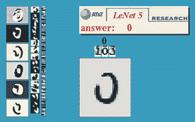
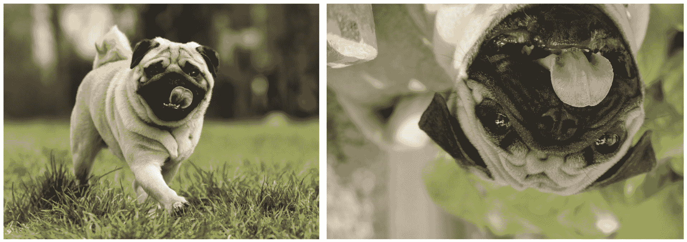
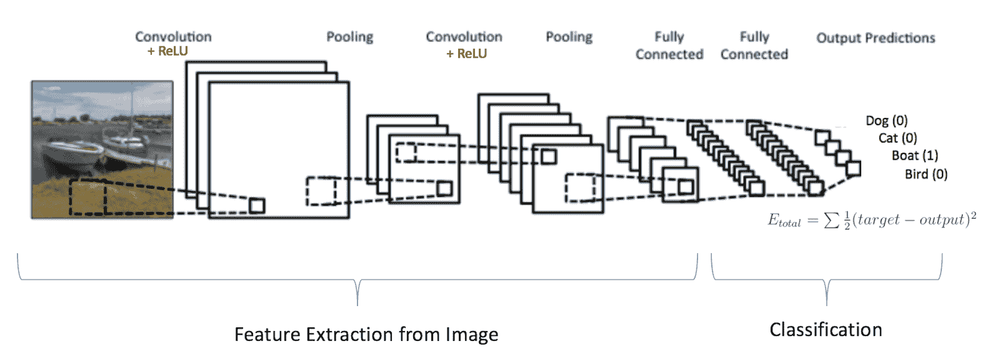
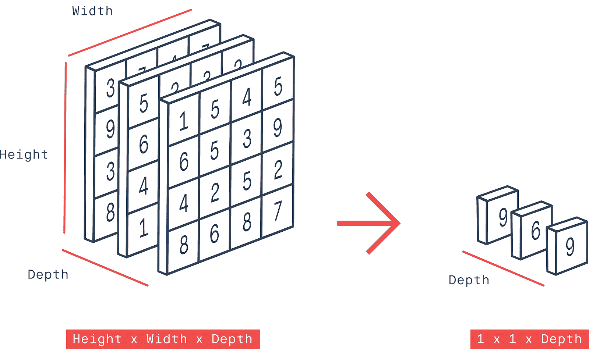
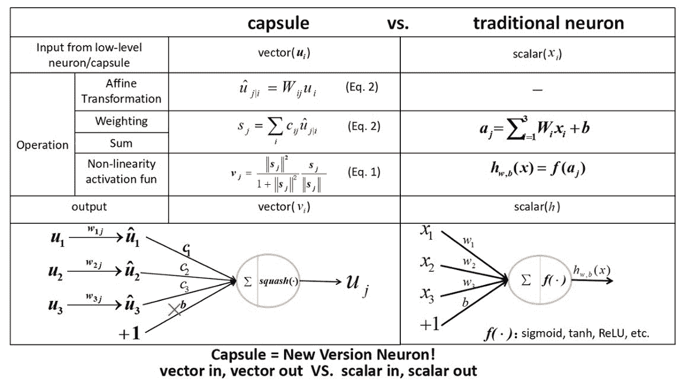
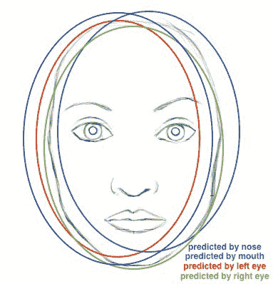
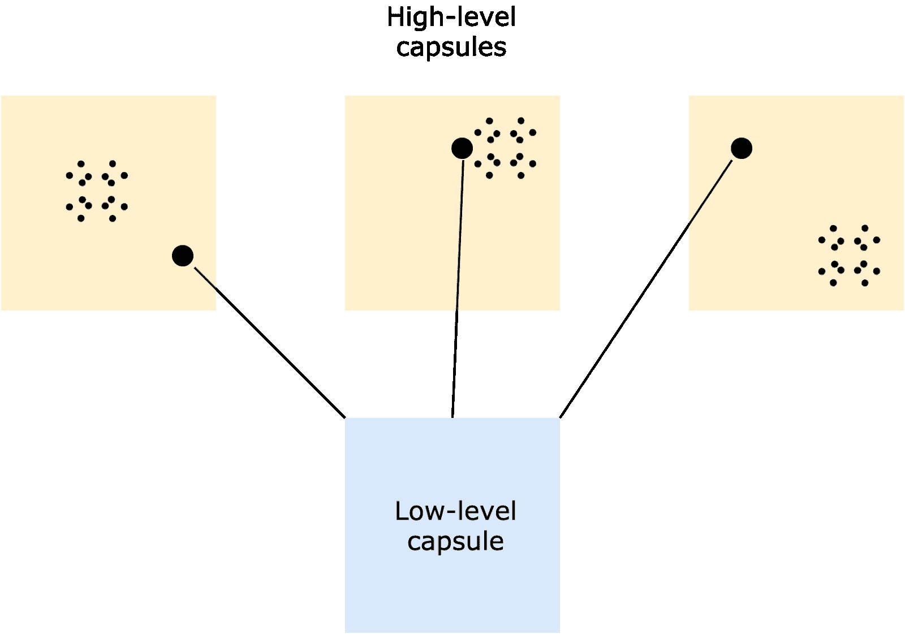
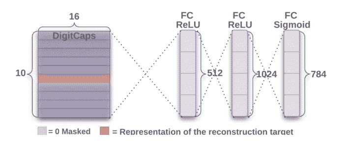

# 胶囊网络:快速入门

> 原文：<https://blog.paperspace.com/capsule-networks/>

无论你是深度学习的新手还是认真的研究人员，你肯定都遇到过术语卷积神经网络。它们是该领域中研究最多、性能最高的架构之一。也就是说，当输入数据处于不同方向时，CNN 在识别输入数据的特征方面有一些缺点。为了解决这个问题，Geoffrey E. Hinton 和他的团队 Sara Sabour 和 Nicholas Frosst 提出了一种新型的神经网络。他们称它们为 **[胶囊网络](https://arxiv.org/abs/1710.09829)** 。

在本文中，我们将讨论以下主题来介绍胶囊网络:

*   卷积神经网络和方向问题
*   CNN 中的池化问题
*   胶囊网络背后的直觉
*   胶囊网络体系结构
*   最终注释

## 卷积神经网络和方向问题

卷积神经网络是最流行的深度学习架构之一，广泛用于计算机视觉应用。从图像分类到对象检测和分割，CNN 已经定义了最先进的结果。也就是说，这些网络对于不同类型的图像有它们自己的复杂性和困难。让我们从他们的起源开始，然后看看他们目前的表现。

Yann LeCun 在 1998 年首次提出了 CNN。然后，他能够用一个简单的五层卷积神经网络检测手写数字，该网络在 MNIST 数据集上进行训练，包含 6 万多个例子。想法很简单:训练网络，识别图像中的特征，并对它们进行分类。然后在 2019 年， [EfficientNet-B7](https://paperswithcode.com/paper/efficientnet-rethinking-model-scaling-for) 在 ImageNet 数据集上实现了最先进的图像分类性能。该网络可以从超过 120 万张图像中识别特定图片的标签，准确率为 84.4%。



看着这些结果和进展，我们可以推断卷积方法使得用简单的计算学习许多复杂的特性成为可能。通过对我们的输入执行许多矩阵乘法和求和，我们可以得到问题的可靠答案。

但是 CNN 并不完美。如果 CNN 接收到不同大小和方向的图像，它们就会失败。

让我举一个例子。比方说你把一张脸倒过来旋转，然后把它喂给一个 CNN 它将无法识别眼睛、鼻子或嘴巴等特征。同样，如果你重建面部的特定区域(例如，交换鼻子和眼睛的位置)，网络仍然能够识别这张脸——即使它不再是一张脸。简而言之，CNN 可以通过统计来学习图像的模式，但不能学习不同方向上的实际图像。



Left image: Pug: 0.8\. Right image: Pug: 0.2

## 有线电视新闻网的问题是

要理解池，你必须知道 CNN 是如何工作的。CNN 的构建模块是卷积层。这些层负责识别给定图像中的特征，如曲线、边缘、锐度和颜色。最终，网络的完全连接层将结合非常高级的特征并产生分类预测。你可以在下面看到一个基本卷积网络的样子。



作者使用最大/平均池操作，或者在整个网络中具有连续的卷积层。汇集操作减少了不必要的信息。使用这种设计，我们可以减少流经网络的数据的空间大小，从而增加更高层神经元的“视野”，使它们能够在输入图像的更宽区域中检测更高阶的特征。这就是 CNN 中的最大池操作如何帮助实现最先进的性能。话虽如此，我们不应被它的表现所迷惑；CNN 比之前的任何模型都要好，但是最大池仍然丢失了有价值的信息。



Max pooling operation extracting higher-level features

杰弗里·辛顿在他的一次演讲中指出:

> *“卷积神经网络中使用的池操作是一个很大的错误，它如此有效的事实是一场灾难！”*

现在让我们看看胶囊网络如何克服这个问题。

## 胶囊网络如何工作

为了克服这个涉及图像旋转关系的问题，Hinton 和 Sabour 从神经科学中获得了灵感。他们解释说，大脑被组织成模块，这些模块可以被认为是胶囊。考虑到这一点，他们提出了胶囊网络，该网络结合了**动态路由**算法来估计物体的特征，如姿态(位置、大小、方向、变形、速度、反照率、色调、纹理等)。这项研究于 2017 年发表在他们题为 *[胶囊](https://arxiv.org/abs/1710.09829)* 间动态路由的论文中。

那么，什么是“胶囊”呢？动态路由是如何工作的？

### 胶囊网络中的胶囊是什么？

与正常的神经元不同，胶囊对其输入进行计算，然后将结果“封装”到一个高度信息输出的小向量中。胶囊可以被认为是普通人工神经元的替代品；人工神经元处理标量，而胶囊处理矢量。例如，我们可以将人工神经元采取的步骤总结如下:

```
1\. Multiply the input scalars with the weighted connections between the neurons.
2\. Compute the weighted sum of the input scalars.
3\. Apply an activation function (scalar nonlinearity) to get the output. 
```

另一方面，为了实现输入的仿射变换(保持共线和距离比),除了上面列出的步骤之外，胶囊还要经过几个步骤。这里，过程如下:

```
1\. Multiply the input vectors by the weight matrices (which encode spatial relationships between low-level features and high-level features) (matrix multiplication).
2\. Multiply the result by the weights.
3\. Compute the weighted sum of the input vectors.
4\. Apply an activation function (vector non-linearity) to get the output. 
```



Image: Capsule vs Artificial Neuron ([source](https://github.com/naturomics/CapsNet-Tensorflow/))

让我们更详细地看看每个步骤，以便更好地理解胶囊的工作原理。

#### 1.将输入向量乘以权重矩阵(仿射变换)

输入向量代表初始输入，或者由网络中较早的层提供的输入。这些向量首先乘以权重矩阵。如前所述，权重矩阵捕捉空间关系。假设一个物体以另一个物体为中心，它们的大小比例相等。输入向量和权重矩阵的乘积将表示高级特征。例如，如果低级特征是鼻子、嘴、左眼和右眼，那么如果四个低级特征的预测指向人脸的相同方向和状态，则人脸将是预测的人脸(如下所示)。这就是“高级”的特点。



Prediction of a face ([source](https://pechyonkin.me/capsules-2/))

#### 2.将结果乘以权重

在这一步中，将前一步获得的输出乘以网络的权重。重量会是多少？在通常的人工神经网络(ANN)中，基于误差率调整权重，然后反向传播。然而，这种机制并不适用于胶囊网络。**动态路由**决定了网络中权重的修改。这定义了为神经元连接分配权重的策略。

胶囊网络调整权重，使得低级胶囊与其附近的高级胶囊强相关联。邻近度量由我们之前讨论的仿射变换步骤(步骤 1)确定。计算从仿射变换步骤获得的输出和低级胶囊预测的密集聚类之间的距离(如果低级胶囊做出的预测相似，从而彼此靠近，则可以形成密集聚类)。基于距离度量，在已经做出的预测的聚类和新预测的聚类之间具有最小距离的高级胶囊将具有较高的权重，而剩余的胶囊将被分配较低的权重。



Dynamic Routing in a Capsule Network

在上图中，权重将按以下顺序分配:中间>左边>右边。简而言之，动态路由算法的本质可以被看作是这样的:较低级别的封装将把它的输入发送到与它的输入“一致”的较高级别的封装。

#### 3.计算输入向量的加权和

这汇总了上一步获得的所有输出。

#### 4.应用激活函数(向量非线性)以获得输出

在胶囊网络中，通过“挤压”(即通过激活函数)输出向量来获得向量非线性，使其具有长度 1 和恒定方向。非线性函数由下式给出:

![<math xmlns="http://www.w3.org/1998/Math/MathML"><msub><mi>v</mi><mi>j</mi></msub><mo>&#xA0;</mo><mo>=</mo><mo>&#xA0;</mo><mfrac><msup><mfenced open="||" close="||"><msub><mi>s</mi><mi>j</mi></msub></mfenced><mn>2</mn></msup><mrow><mn>1</mn><mo>&#xA0;</mo><mo>+</mo><mo>&#xA0;</mo><msup><mfenced open="||" close="||"><msub><mi>s</mi><mi>j</mi></msub></mfenced><mn>2</mn></msup></mrow></mfrac><mo>&#xA0;</mo><mfrac><msub><mi>s</mi><mi>j</mi></msub><mfenced open="||" close="||"><msub><mi>s</mi><mi>j</mi></msub></mfenced></mfrac></math>](img/81fbd7683df52ff9aa28626c55d41bcf.png "v subscript j space equals space fraction numerator open double vertical bar s subscript j close double vertical bar squared over denominator 1 space plus space open double vertical bar s subscript j close double vertical bar squared end fraction space fraction numerator s subscript j over denominator open double vertical bar s subscript j close double vertical bar end fraction")

其中*s[j]是上一步得到的输出，*v[j]是应用非线性后得到的输出。等式的左侧执行额外的挤压，而等式的右侧执行输出向量的单位缩放。**

总的来说，动态路由算法总结如下:


第 1 行:这一行定义了路由过程，它将仿射变换输入(u)、路由迭代次数(r)和层数(l)作为输入。

第 2 行:b[ij] 是一个临时值，最终用来初始化 c[i] 。

第 3 行:for 循环迭代“r”次。

第 4 行:应用于 b[i] 的 softmax 函数确保输出一个非负的 c[i] ，其中所有输出总和为 1。

第 5 行:对于后续层中的每个胶囊，计算加权和。

第 6 行:对于后续层中的每个胶囊，加权和被压缩。

第 7 行:权重 b[ij] 在这里被更新。u[ji] 表示低级舱 I 对舱的输入，v[j] 表示高级舱 j 的输出

## CapsNet 架构

CapsNet 架构由一个编码器和一个解码器组成，每个都有一组三层。编码器具有卷积层、PrimaryCaps 层和 DigitCaps 层；解码器有 3 个完全连接的层。

现在，让我们来看看这些网络。例如，我们将在 MNIST 数据集的上下文中考虑这一点。

### 编码器网络


CapsNet Encoder Architecture ([source](https://arxiv.org/abs/1710.09829))

编码器有两个卷积层和一个全连接层。第一卷积层 **Conv1** ，具有 256 个 9×9 卷积核，步长为 1，以及一个 ReLU 激活函数。该层负责将像素强度转换为局部特征检测器的活动，然后反馈给 PrimaryCaps 层。 **PrimaryCaps** 层是一个卷积层，它有 32 个信道的卷积 8-D 胶囊(每个胶囊有 8 个卷积单元，内核为 9×9，步长为 2)。主胶囊执行反向图形，这意味着它们对实际图像生成的过程进行反向工程。胶囊将八个 9×9×256 核应用到 20×20×256 输入体积上，这给出了 6×6×8 输出张量。由于有 32 个 8-D 胶囊，因此输出大小为 6×6×8×32。 **DigitCaps** 层每个类有 16 维胶囊，每个胶囊接收来自低级胶囊的输入。

8×16 W[ij] 是用于对每个 8-D 胶囊进行仿射变换的权重矩阵。前面讨论的路由机制总是存在于两个封装层之间(比如，在 PrimaryCaps 和 DigitCaps 之间)。

最后，使用重建损失对实例化参数进行编码。针对所有输出类计算每个训练示例的损失。总损耗是所有数字胶囊损耗的总和。损耗方程由下式给出:

![<math xmlns="http://www.w3.org/1998/Math/MathML"><msub><mi>L</mi><mi>k</mi></msub><mo>&#xA0;</mo><mo>=</mo><mo>&#xA0;</mo><msub><mi>T</mi><mi>k</mi></msub><mo>&#xA0;</mo><mi>m</mi><mi>a</mi><mi>x</mi><msup><mfenced><mrow><mn>0</mn><mo>,</mo><mo>&#xA0;</mo><msup><mi>m</mi><mo>+</mo></msup><mo>&#xA0;</mo><mo>-</mo><mo>&#xA0;</mo><mfenced open="||" close="||"><msub><mi>v</mi><mi>k</mi></msub></mfenced></mrow></mfenced><mn>2</mn></msup><mo>&#xA0;</mo><mo>+</mo><mo>&#xA0;</mo><mi>&#x3BB;</mi><mfenced><mrow><mn>1</mn><mo>&#xA0;</mo><mo>-</mo><mo>&#xA0;</mo><msub><mi>T</mi><mi>k</mi></msub></mrow></mfenced><mo>&#xA0;</mo><mi>m</mi><mi>a</mi><mi>x</mi><msup><mfenced><mrow><mn>0</mn><mo>,</mo><mo>&#xA0;</mo><mfenced open="||" close="||"><msub><mi>v</mi><mi>k</mi></msub></mfenced><mo>&#xA0;</mo><mo>-</mo><mo>&#xA0;</mo><msup><mi>m</mi><mo>-</mo></msup></mrow></mfenced><mn>2</mn></msup></math>](img/252b67701e8860feb886dd08122ae06a.png "L subscript k space equals space T subscript k space m a x open parentheses 0 comma space m to the power of plus space minus space open double vertical bar v subscript k close double vertical bar close parentheses squared space plus space lambda open parentheses 1 space minus space T subscript k close parentheses space m a x open parentheses 0 comma space open double vertical bar v subscript k close double vertical bar space minus space m to the power of minus close parentheses squared")

其中:

如果存在 k 类的数字，则 T[k] = 1

m <sup>+</sup> = 0.9

m <sup>-</sup> = 0.1

v[k] =从 DigitCaps 层获得的矢量

等式的第一项表示正确数字电容的损耗，第二项表示不正确数字电容的损耗。

### 解码器网络



CapsNet Decoder Architecture ([source](https://arxiv.org/abs/1710.09829))

解码器取出正确的 16-D 数字胶囊并将其解码成图像。不会考虑任何不正确的数字胶囊。通过找到输入图像和重建图像之间的欧几里德距离来计算损失。

解码器有三个完全连接的层。第一层有 512 个神经元；第二个有 1024 个神经元；第三个具有 784 个神经元(为 MNIST 提供 28×28 的重建图像)。

## 最终注释

胶囊网络可以被认为是人脑的“真实模仿”。与不评估给定数据中的空间关系的卷积神经网络不同，胶囊网络将图像中各部分的方向视为数据分析的关键部分。他们检查这些层次关系，以更好地识别图像。我们的大脑使用的逆图形机制在这里被模仿，以建立图像的分层表示，并将其与网络学习的内容相匹配。虽然它的计算效率还不够高，但在处理现实世界的场景时，它的准确性似乎确实有所提高。胶囊的动态路由使这一切成为可能。它采用了一种不寻常的策略来更新网络中的权重，从而避免了池操作。久而久之认为，胶囊网络必将渗透到其他各个领域，使机器变得更像人。