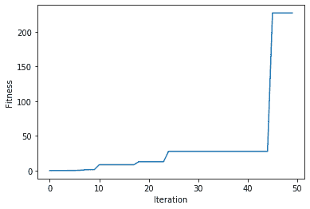
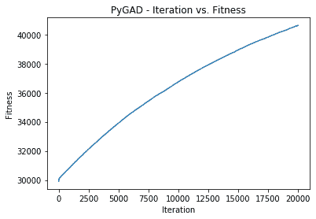
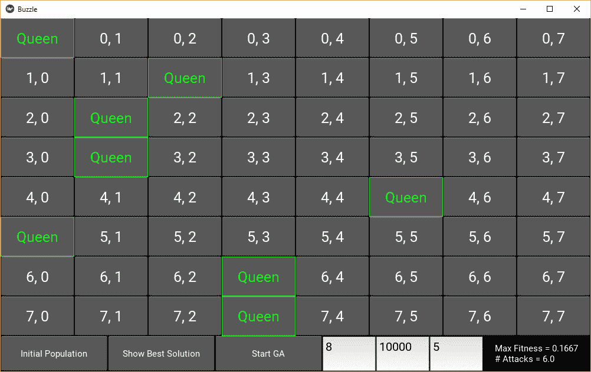
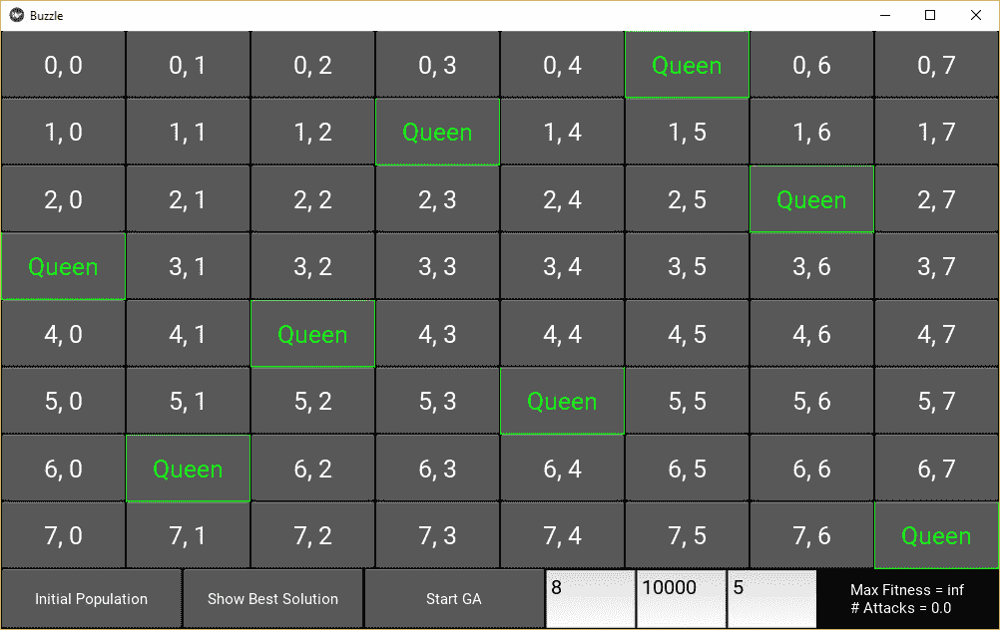
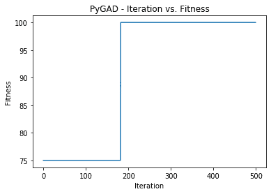

# 5 使用 PyGAD 的遗传算法应用

> 原文：<https://blog.paperspace.com/genetic-algorithm-applications-using-pygad/>

本教程介绍 PyGAD，这是一个用于实现遗传算法和训练机器学习算法的开源 Python 库。PyGAD 支持为各种应用定制遗传算法的 19 个参数。

在本教程中，我们将讨论遗传算法的 5 种不同的应用，并使用 PyGAD 构建它们。

教程的大纲如下:

*   PyGAD 装置
*   PyGAD 入门
*   拟合线性模型
*   再现图像
*   8 皇后拼图
*   训练神经网络
*   训练卷积神经网络

您可以关注这些项目，并在 [ML Showcase](https://ml-showcase.paperspace.com/projects/genetic-algorithm-with-pygad) 上免费运行它们。让我们开始吧。

## **PyGAD 安装**

PyGAD 可以通过 [PyPI (Python 包索引)](https://pypi.org/project/pygad)获得，因此可以简单地使用`pip`进行安装。对于 Windows，只需使用以下命令:

```
pip install pygad
```

对于 Mac/Linux，在终端命令中使用`pip3`而不是`pip`:

```
pip3 install pygad
```

然后，确保通过从 Python shell 导入库来安装库:

```
python
import pygad
```

最新的 PyGAD 版本目前是 2.3.2，发布于 2020 年 6 月 1 日。使用`__version__`特殊变量，可以返回当前版本。

```
import pygad

print(pygad.__version__)
```

现在已经安装了 PyGAD，让我们简单介绍一下 PyGAD。

## 【PyGAD 入门

PyGAD 的主要目标是提供遗传算法的简单实现。它提供了一系列的参数，允许用户为广泛的应用定制遗传算法。本教程将讨论五个这样的应用。

PyGAD 的完整文档可在[阅读文档。](https://pygad.readthedocs.io)在这里，我们将对这个库进行更容易理解的分解。

在 PyGAD 2.3.2 中有 5 个模块:

1.  `pygad`:主模块已经导入。
2.  `pygad.nn`:用于实现神经网络。
3.  `pygad.gann:`用于使用遗传算法训练神经网络。
4.  `pygad.cnn`:用于实现卷积神经网络。
5.  `pygad.gacnn`:用于使用遗传算法训练卷积神经网络。

每个模块在 GitHub 上都有自己的存储库，链接如下。

1.  pygad
2.  pygad . nn
3.  [皮加恩](https://github.com/ahmedfgad/NeuralGenetic)
4.  [pygad.cnn](https://github.com/ahmedfgad/NumPyCNN)
5.  [pygad . gann](https://github.com/ahmedfgad/CNNGenetic)

该库的主模块名为`pygad`。这个模块有一个名为`GA`的类。只需创建一个`pygad.GA`类的实例来使用遗传算法。

使用`pygad`模块的步骤如下:

1.  创建健身功能。
2.  为`pygad.GA`类准备必要的参数。
3.  创建一个`pygad.GA`类的实例。
4.  运行遗传算法。

在 PyGAD 2.3.2 中，`pygad.GA`类的构造函数有 19 个参数，其中 16 个是可选的。三个必需的参数是:

1.  `num_generations`:世代数。
2.  `num_parents_mating`:选择作为父项的解决方案的数量。
3.  `fitness_func`:计算解的适应值的适应函数。

`fitness_func`参数允许遗传算法针对不同的问题进行定制。此参数接受用户定义的函数，该函数计算单个解决方案的适合度值。这需要两个额外的参数:解和它在群体中的指数。

让我们看一个例子来让这一点更清楚。假设存在一个具有 3 个解的总体，如下所示。

```
[221, 342, 213]
[675, 32, 242]
[452, 23, -212]
```

分配给`fitness_func`参数的函数必须返回一个代表每个解的适合度的数字。下面是一个返回解的总和的示例。

```
def fitness_function(solution, solution_idx):
    return sum(solution)
```

3 种解决方案的适合值为:

1.  Seven hundred and seventy-six
2.  Nine hundred and forty-nine
3.  Two hundred and sixty-three

基于这样的适合度值来选择双亲。适应值越高，解决方案越好。

关于`pygad.GA`类构造函数中参数的完整列表，请查看[本页](https://pygad.readthedocs.io/en/latest/README_pygad_ReadTheDocs.html#init)。

在创建了一个`pygad.GA`类的实例之后，下一步是调用`run()`方法，该方法会遍历进化解决方案的代。

```
import pygad

ga_instance = pygad.GA(...)

ga_instance.run()
```

这些是使用 PyGAD 的基本步骤。当然，还可以采取其他步骤，但这是最起码的要求。

接下来的部分将讨论在几种不同的用例中使用 PyGAD。

## **拟合线性模型**

假设有一个具有 6 个输入、1 个输出和 6 个参数的方程，如下所示:

```
 y = f(w1:w6) = w1x1 + w2x2 + w3x3 + w4x4 + w5x5 + 6wx6
```

假设输入为`(4,-2,3.5,5,-11,-4.7)`，输出为`44`。满足等式的 6 个参数的值是多少？遗传算法可以用来寻找答案。

首先要做的是准备如下给出的适应度函数。它计算每个输入与其相应参数之间的乘积之和。计算期望输出和乘积之和之间的绝对差值。因为适应度函数一定是最大化函数，所以返回的适应度等于`1.0/difference`。具有最高适应值的解被选为父解。

```
function_inputs = [4,-2,3.5,5,-11,-4.7]  # Function inputs.
desired_output = 44  # Function output.

def fitness_func(solution, solution_idx):
    output = numpy.sum(solution*function_inputs)
    fitness = 1.0 / numpy.abs(output - desired_output)
    return fitness
```

既然我们已经准备好了适应度函数，下面是一个包含其他重要参数的列表。

```
sol_per_pop = 50
num_genes = len(function_inputs)

init_range_low = -2
init_range_high = 5

mutation_percent_genes = 1
```

您还应该指定您认为合适的所需强制参数。准备好必要的参数后，实例化`pygad.GA`类。有关每个参数的信息，请参见[本页](https://pygad.readthedocs.io/en/latest/README_pygad_ReadTheDocs.html#init)。

```
ga_instance = pygad.GA(num_generations=num_generations,
                       num_parents_mating=num_parents_mating, 
                       fitness_func=fitness_func,
                       sol_per_pop=sol_per_pop, 
                       num_genes=num_genes,
                       init_range_low=init_range_low,
                       init_range_high=init_range_high,
                       mutation_percent_genes=mutation_percent_genes)
```

下一步是调用开始生成的`run()`方法。

```
ga_instance.run()
```

在`run()`方法完成后，`plot_result()`方法可用于显示各代的适应值。

```
ga_instance.plot_result()
```



使用`best_solution()`方法，我们还可以检索最佳解决方案是什么，它的适合度，以及它在群体中的索引。

```
solution, solution_fitness, solution_idx = ga_instance.best_solution()
print("Parameters of the best solution : {solution}".format(solution=solution))
print("Fitness value of the best solution = {solution_fitness}".format(solution_fitness=solution_fitness))
print("Index of the best solution : {solution_idx}".format(solution_idx=solution_idx))
```

这个项目的完整代码可以在 ML Showcase 上的[拟合线性模型](https://ml-showcase.paperspace.com/projects/genetic-algorithm-with-pygad)笔记本中找到。

## **再现图像**

在这个应用程序中，我们将从随机图像(随机像素值)开始，然后使用遗传算法进化每个像素的值。

这个应用程序的棘手之处在于，图像是 2D 或 3D 的，而遗传算法期望解是 1D 向量。为了解决这个问题，我们将使用下面定义的`img2chromosome()`函数将图像转换成 1D 矢量。

```
def img2chromosome(img_arr):

    return numpy.reshape(a=img_arr, newshape=(functools.reduce(operator.mul, img_arr.shape)))
```

然后可以使用`chromosome2img()`功能(如下)从矢量中恢复 2D 或 3D 图像。

```
def chromosome2img(vector, shape):
    # Check if the vector can be reshaped according to the specified shape.
    if len(vector) != functools.reduce(operator.mul, shape):
        raise ValueError("A vector of length {vector_length} into an array of shape {shape}.".format(vector_length=len(vector), shape=shape))

    return numpy.reshape(a=vector, newshape=shape)
```

除了使用 PyGAD 的常规步骤之外，我们还需要一个额外的步骤来读取图像。

```
import imageio
import numpy

target_im = imageio.imread('fruit.jpg')
target_im = numpy.asarray(target_im/255, dtype=numpy.float)
```

这个样本图片可以从[这里](https://github.com/ahmedfgad/GARI/blob/master/fruit.jpg)下载。

接下来，准备健身功能。这将计算解决方案中的像素和目标图像之间的差异。为了使其成为最大化函数，从目标图像中所有像素的总和中减去差值。

```
target_chromosome = gari.img2chromosome(target_im)

def fitness_fun(solution, solution_idx):
    fitness = numpy.sum(numpy.abs(target_chromosome-solution))

    # Negating the fitness value to make it increasing rather than decreasing.
    fitness = numpy.sum(target_chromosome) - fitness
    return fitness
```

下一步是创建一个`pygad.GA`类的实例，如下所示。使用适当的参数对应用程序的成功至关重要。如果目标图像中像素值的范围是 0 到 255，那么`init_range_low`和`init_range_high`必须分别设置为 0 和 255。原因是用与目标图像相同数据类型的图像初始化群体。如果图像像素值的范围从 0 到 1，那么这两个参数必须分别设置为 0 和 1。

```
import pygad

ga_instance = pygad.GA(num_generations=20000,
                       num_parents_mating=10,
                       fitness_func=fitness_fun,
                       sol_per_pop=20,
                       num_genes=target_im.size,
                       init_range_low=0.0,
                       init_range_high=1.0,
                       mutation_percent_genes=0.01,
                       mutation_type="random",
                       mutation_by_replacement=True,
                       random_mutation_min_val=0.0,
                       random_mutation_max_val=1.0)
```

当`mutation_type`参数设置为`random`时，默认行为是为每个选择突变的基因添加一个随机值。该随机值选自`random_mutation_min_val`和`random_mutation_max_val`参数指定的范围。

假设像素值的范围是 0 到 1。如果像素具有值`0.9`并且生成了随机值`0.3`，则新的像素值为`1.2`。因为像素值必须在 0 到 1 的范围内，所以新像素值是无效的。要解决这个问题，将`mutation_by_replacement`参数设置为`True`非常重要。这会导致随机值替换当前像素，而不是添加到该像素。

参数准备好后，遗传算法就可以运行了。

```
ga_instance.run()
```

`plot_result()`方法可以用来显示适应值如何逐代进化。

```
ga_instance.plot_result()
```



生成完成后，可以返回一些关于最佳解决方案的信息。

```
solution, solution_fitness, solution_idx = ga_instance.best_solution()
print("Fitness value of the best solution = {solution_fitness}".format(solution_fitness=solution_fitness))
print("Index of the best solution : {solution_idx}".format(solution_idx=solution_idx))
```

最佳解决方案可以转换成图像进行显示。

```
import matplotlib.pyplot

result = gari.chromosome2img(solution, target_im.shape)
matplotlib.pyplot.imshow(result)
matplotlib.pyplot.show()
```

这是结果。


你可以在 [ML Showcase](https://ml-showcase.paperspace.com/projects/genetic-algorithm-with-pygad) 上免费运行这个项目。

## **8 皇后拼图**

8 皇后拼图包括分布在 8×8 矩阵中的 8 个国际象棋皇后，每行一个皇后。目标是放置这些皇后，使得没有皇后可以垂直、水平或对角地攻击另一个。遗传算法可用于找到满足这些条件的解决方案。

这个项目可以在 [GitHub](https://github.com/ahmedfgad/8QueensGenetic) 上获得。它有一个使用 Kivy 构建的 GUI，显示一个 8×8 矩阵，如下图所示。


GUI 在屏幕底部有三个按钮。这些按钮的功能如下:

*   **初始群体**按钮创建遗传算法的初始群体。
*   **显示最佳解决方案**按钮显示 GA 停止的上一代的最佳解决方案。
*   **启动遗传算法**按钮启动遗传算法迭代/世代。

要使用该项目，首先按下**初始填充**按钮，然后按下**开始 GA** 按钮。下面是 Initial Population 按钮调用的方法，正如您可能已经猜到的那样，该方法生成初始填充。

```
def initialize_population(self, *args):
    self.num_solutions = 10

    self.reset_board_text()

    self.population_1D_vector = numpy.zeros(shape=(self.num_solutions, 8))

    for solution_idx in range(self.num_solutions):
        initial_queens_y_indices = numpy.random.rand(8)*8
        initial_queens_y_indices = initial_queens_y_indices.astype(numpy.uint8)
        self.population_1D_vector[solution_idx, :] = initial_queens_y_indices

    self.vector_to_matrix()

    self.pop_created = 1
    self.num_attacks_Label.text = "Initial Population Created."
```

群体中的每个解都是一个具有 8 个元素的向量，涉及 8 个皇后的列索引。为了在屏幕上显示皇后的位置，使用`vector_to_matrix()`方法将 1D 向量转换成 2D 矩阵。下一张图显示了屏幕上的女王。



现在 GUI 已经构建好了，我们将使用 PyGAD 构建并运行遗传算法。

本项目中使用的适应度函数如下所示。它只是计算 8 个女王中的每一个可以进行的攻击次数，并将其作为适应值返回。

```
def fitness(solution_vector, solution_idx):

    if solution_vector.ndim == 2:
        solution = solution_vector
    else:
        solution = numpy.zeros(shape=(8, 8))

        row_idx = 0
        for col_idx in solution_vector:
            solution[row_idx, int(col_idx)] = 1
            row_idx = row_idx + 1

    total_num_attacks_column = attacks_column(solution)

    total_num_attacks_diagonal = attacks_diagonal(solution)

    total_num_attacks = total_num_attacks_column + total_num_attacks_diagonal

    if total_num_attacks == 0:
        total_num_attacks = 1.1 # float("inf")
    else:
        total_num_attacks = 1.0/total_num_attacks

    return total_num_attacks
```

通过按下 **Start GA** 按钮，创建了一个`pygad.GA`类的实例，并调用了`run()`方法。

```
ga_instance = pygad.GA(num_generations=500,
                       num_parents_mating=5,
                       fitness_func=fitness,
                       num_genes=8,
                       initial_population=self.population_1D_vector,
                       mutation_percent_genes=0.01,
                       mutation_type="random",
                       mutation_num_genes=3,
                       mutation_by_replacement=True,
                       random_mutation_min_val=0.0,
                       random_mutation_max_val=8.0,
                       callback_generation=callback)

ga_instance.run()
```

这里有一个可能的解决方案，其中 8 个皇后被放在棋盘上，没有皇后攻击另一个。



这个项目的完整代码可以在 GitHub 上找到[。](https://github.com/ahmedfgad/8QueensGenetic)

## **训练神经网络**

在其他类型的机器学习算法中，遗传算法可用于训练神经网络。PyGAD 通过使用`pygad.gann.GANN`和`pygad.gacnn.GACNN`模块支持训练神经网络，特别是卷积神经网络。本节讨论如何使用`pygad.gann.GANN`模块为分类问题训练神经网络。

在构建遗传算法之前，需要准备训练数据。本例构建了一个模拟 XOR 逻辑门的网络。

```
# Preparing the NumPy array of the inputs.
data_inputs = numpy.array([[1, 1],
                           [1, 0],
                           [0, 1],
                           [0, 0]])

# Preparing the NumPy array of the outputs.
data_outputs = numpy.array([0, 
                            1, 
                            1, 
                            0])
```

下一步是创建一个`pygad.gann.GANN`类的实例。这个类构建了一个具有相同架构的神经网络群体。

```
num_inputs = data_inputs.shape[1]
num_classes = 2

num_solutions = 6
GANN_instance = pygad.gann.GANN(num_solutions=num_solutions,
                                num_neurons_input=num_inputs,
                                num_neurons_hidden_layers=[2],
                                num_neurons_output=num_classes,
                                hidden_activations=["relu"],
                                output_activation="softmax")
```

在创建了`pygad.gann.GANN`类的实例之后，下一步是创建适应度函数。这将返回传递的解决方案的分类精度。

```
import pygad.nn
import pygad.gann

def fitness_func(solution, sol_idx):
    global GANN_instance, data_inputs, data_outputs

    predictions = pygad.nn.predict(last_layer=GANN_instance.population_networks[sol_idx],
                                   data_inputs=data_inputs)
    correct_predictions = numpy.where(predictions == data_outputs)[0].size
    solution_fitness = (correct_predictions/data_outputs.size)*100

    return solution_fitness
```

除了适应度函数之外，还准备了我们之前讨论过的其他必要参数。

```
population_vectors = pygad.gann.population_as_vectors(population_networks=GANN_instance.population_networks)

initial_population = population_vectors.copy()

num_parents_mating = 4

num_generations = 500

mutation_percent_genes = 5

parent_selection_type = "sss"

crossover_type = "single_point"

mutation_type = "random" 

keep_parents = 1

init_range_low = -2
init_range_high = 5
```

准备好所有参数后，就创建了一个`pygad.GA`类的实例。

```
ga_instance = pygad.GA(num_generations=num_generations, 
                       num_parents_mating=num_parents_mating, 
                       initial_population=initial_population,
                       fitness_func=fitness_func,
                       mutation_percent_genes=mutation_percent_genes,
                       init_range_low=init_range_low,
                       init_range_high=init_range_high,
                       parent_selection_type=parent_selection_type,
                       crossover_type=crossover_type,
                       mutation_type=mutation_type,
                       keep_parents=keep_parents,
                       callback_generation=callback_generation)
```

`callback_generation`参数指的是每次生成后调用的函数。在该应用中，该函数用于在每次生成后更新所有神经网络的权重。

```
def callback_generation(ga_instance):
    global GANN_instance

    population_matrices = pygad.gann.population_as_matrices(population_networks=GANN_instance.population_networks, population_vectors=ga_instance.population)
    GANN_instance.update_population_trained_weights(population_trained_weights=population_matrices)
```

下一步是调用`run()`方法。

```
ga_instance.run()
```

在`run()`方法完成之后，下图显示了适应值是如何演变的。该图显示达到了 100%的分类准确度。



构建和训练神经网络的完整代码可以在训练神经网络笔记本的 [ML Showcase](https://ml-showcase.paperspace.com/projects/genetic-algorithm-with-pygad) 上免费访问和运行。

## **训练卷积神经网络**

类似于训练多层感知器，PyGAD 支持使用遗传算法训练卷积神经网络。

第一步是准备训练数据。数据可从以下链接下载:

1.  [dataset_inputs.npy](https://github.com/ahmedfgad/NumPyCNN/blob/master/dataset_inputs.npy) :数据输入。
2.  [dataset_outputs.npy](https://github.com/ahmedfgad/NumPyCNN/blob/master/dataset_outputs.npy) :类标签。

```
import numpy

train_inputs = numpy.load("dataset_inputs.npy")
train_outputs = numpy.load("dataset_outputs.npy")
```

下一步是使用`pygad.cnn`模块构建 CNN 架构。

```
import pygad.cnn

input_layer = pygad.cnn.Input2D(input_shape=(80, 80, 3))
conv_layer = pygad.cnn.Conv2D(num_filters=2,
                              kernel_size=3,
                              previous_layer=input_layer,
                              activation_function="relu")
average_pooling_layer = pygad.cnn.AveragePooling2D(pool_size=5,
                                                   previous_layer=conv_layer,
                                                   stride=3)

flatten_layer = pygad.cnn.Flatten(previous_layer=average_pooling_layer)
dense_layer = pygad.cnn.Dense(num_neurons=4,
                              previous_layer=flatten_layer,
                              activation_function="softmax")
```

堆叠网络中的层后，就创建了一个模型。

```
model = pygad.cnn.Model(last_layer=dense_layer,
                        epochs=5,
                        learning_rate=0.01)
```

使用`summary()`方法，返回模型架构的概要。

```
----------Network Architecture----------
<class 'cnn.Conv2D'>
<class 'cnn.AveragePooling2D'>
<class 'cnn.Flatten'>
<class 'cnn.Dense'>
----------------------------------------
```

准备好模型后，实例化`pygad.gacnn.GACNN`类以创建初始群体。所有网络都有相同的架构。

```
import pygad.gacnn

GACNN_instance = pygad.gacnn.GACNN(model=model,
                                   num_solutions=4)
```

接下来就是准备健身功能了。这将计算通过的解决方案的分类准确度。

```
def fitness_func(solution, sol_idx):
    global GACNN_instance, data_inputs, data_outputs

    predictions = GACNN_instance.population_networks[sol_idx].predict(data_inputs=data_inputs)
    correct_predictions = numpy.where(predictions == data_outputs)[0].size
    solution_fitness = (correct_predictions/data_outputs.size)*100

    return solution_fitness
```

其他参数也准备好了。

```
population_vectors = pygad.gacnn.population_as_vectors(population_networks=GACNN_instance.population_networks)

initial_population = population_vectors.copy()

num_parents_mating = 2

num_generations = 10

mutation_percent_genes = 0.1

parent_selection_type = "sss"

crossover_type = "single_point"

mutation_type = "random"

keep_parents = -1
```

准备好所有参数后，就创建了一个`pygad.GA`类的实例。

```
ga_instance = pygad.GA(num_generations=num_generations, 
                       num_parents_mating=num_parents_mating, 
                       initial_population=initial_population,
                       fitness_func=fitness_func,
                       mutation_percent_genes=mutation_percent_genes,
                       parent_selection_type=parent_selection_type,
                       crossover_type=crossover_type,
                       mutation_type=mutation_type,
                       keep_parents=keep_parents,
                       callback_generation=callback_generation)
```

`callback_generation`参数用于在每次生成后更新网络权重。

```
def callback_generation(ga_instance):
    global GACNN_instance, last_fitness

    population_matrices = pygad.gacnn.population_as_matrices(population_networks=GACNN_instance.population_networks, population_vectors=ga_instance.population)

    GACNN_instance.update_population_trained_weights(population_trained_weights=population_matrices)
```

最后一步是调用`run()`方法。

```
ga_instance.run()
```

构建和训练卷积神经网络的完整代码可以在 [ML Showcase](https://ml-showcase.paperspace.com/projects/genetic-algorithm-with-pygad) 上找到，你也可以从你的免费 Gradient 帐户在免费 GPU 上运行它。

## **结论**

本教程介绍了 PyGAD，这是一个用于实现遗传算法的开源 Python 库。该库支持许多参数来为许多应用定制遗传算法。

在本教程中，我们使用 PyGAD 构建了 5 个不同的应用程序，包括拟合线性模型、解决 8 皇后难题、再现图像和训练神经网络(传统的和卷积的)。我希望你觉得这个教程很有用，如果你有任何问题，请在评论中或者查看文档。