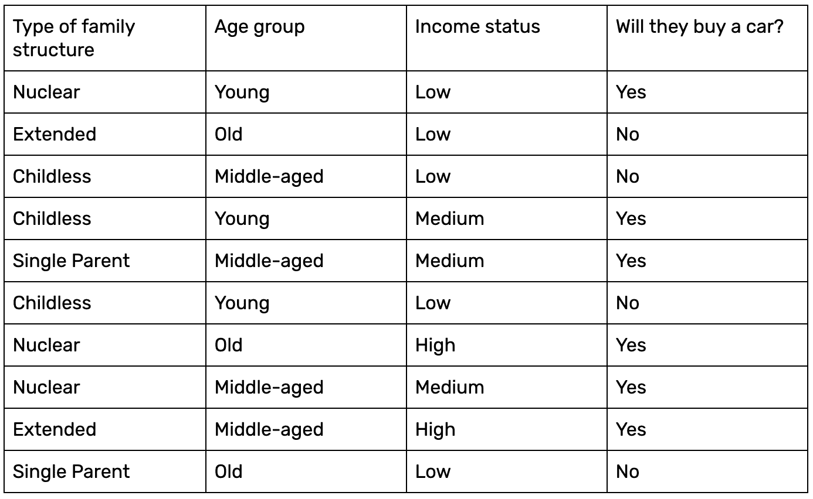

# 朴素贝叶斯简介:一种基于概率的分类算法

> 原文：<https://blog.paperspace.com/introduction-to-naive-bayes/>

想象一下:电力运营商希望根据各个工厂过去的电力消耗趋势，向它们提供特定单位的电流。为了简化流程，她/他计划将工厂划分为三组——低、中、高用电客户——根据这三组，他/她知道要供应多少电力。这种类型的问题通常属于预测分类建模，或者简称为分类类型问题。朴素贝叶斯是最简单的机器学习算法之一，一直是分类数据的最爱。

朴素贝叶斯基于贝叶斯定理，该定理是由托马斯·贝叶斯牧师在 18 世纪 60 年代提出的。在过去十年中，朴素贝叶斯的受欢迎程度飙升，该算法被广泛用于解决学术界、政府和商业领域的问题。朴素贝叶斯分类器是实用机器学习中许多理想品质的融合。我们将进一步阐明这背后的直觉。让我们首先理解朴素贝叶斯算法的工作原理，然后使用 scikit-learn 库在 Python 中实现它。

在本文中，我们将了解以下主题:

*   朴素贝叶斯算法简介
*   条件概率和贝叶斯定理
*   朴素贝叶斯算法的工作原理
*   朴素贝叶斯的应用
*   用 Scikit-Learn 实现朴素贝叶斯
*   利弊
*   摘要

## 朴素贝叶斯算法简介

朴素贝叶斯属于主要用于分类的监督机器学习算法的范畴。在这种情况下，“受监督的”告诉我们，算法是用输入特征和分类输出(即，数据包括算法应该预测的每个点的正确期望输出)来训练的。

但为什么算法会被称为“幼稚”？这是因为分类器假设进入模型的输入要素相互独立。因此，更改一个输入要素不会影响任何其他要素。这个假设可能是真的，也可能是假的，从这个意义上来说，它是天真的，而且很可能不是。

我们将在朴素贝叶斯算法的*工作部分详细讨论这个算法的幼稚性。在此之前，让我们简单地看一下为什么这个算法简单，但功能强大，并且易于实现。朴素贝叶斯的一个显著优点是它使用了一种概率方法；所有的计算都是实时进行的，输出也是即时生成的。当处理大量数据时，这使得朴素贝叶斯比传统的分类算法如[支持向量机](https://blog.paperspace.com/implementing-support-vector-machine-in-python-using-sklearn/)和[集成技术](https://blog.paperspace.com/bagging-ensemble-methods/)更胜一筹。*

让我们从掌握理解朴素贝叶斯的基本理论开始。

## 概率、条件概率和贝叶斯定理

概率是朴素贝叶斯的基础。让我们认真研究一下概率的本质。

### 概率是什么？

概率是数学的一个重要分支，它帮助我们预测一个事件 *X* 在考虑所有潜在结果的情况下发生的可能性。为了更精确地解释这一点，考虑一个预测你是否会在某一天上大学的例子。这里有两种可能的结果:参加或跳过。因此，你上大学或不上大学的概率是。数学上，概率可以用下面的等式表示:

**事件的概率=有利事件的数量/结果总数**

**0 < =事件发生的概率< = 1**

“有利事件”表示您希望其发生概率的事件。概率总是在 0 到 1 的范围内，0 表示该事件不可能发生，1 表示有 100%的可能性会发生。

条件概率是概率的子集，它限制了概率的思想，使之对特定事件产生依赖；下一节我们来了解一下。

### 条件概率

为两个或更多事件计算条件概率。拿两个事件来说， *A* 和 *B* 。事件 *B* 的**条件概率**被定义为在已知事件 *A* 已经发生的情况下，事件 *B* 将发生的概率。它被表示为 P(B|A ),在数学上由以下公式表示:

**P(B|A) = P(A 和 B)/P(A)**

让我们看一个例子来清楚地理解这个概念。

假设你有两个篮子，篮子 A 和篮子 B，里面装满了苹果和芒果。组成细节如下所示:


为了找到随机选择的水果是从篮子 B 中取出的苹果的条件概率，我们使用上面的公式如下:

```
P(Apple/Basket-B) = P(Apple and Basket-B)/ P(Basket-B)
                  = 25/50 
```

这个概率反映了首先选择 Basket-B，然后从中挑选一个苹果。

在下一节中，我们将研究贝叶斯定理，它跟随了条件概率的脚步。

### 贝叶斯规则

贝叶斯规则围绕着从给定的证据(E)推导出一个假设(H)的概念。它涉及两个概念:得到证据之前假设的概率 P(H)和得到证据之后假设的概率 P(H|E)。一般来说，它由以下等式给出:

**P(H | E)=(P(E | H)* P(H))/P(E)**

这告诉我们:

*   假设 E 发生，H 多久发生一次*，写成 **P(H|E)***

当我们知道:

*   假设 H 发生，E 多久发生一次*，写作 **P(E|H)***
*   A 自身的可能性有多大，写成 **P(H)**
*   B 自身的可能性有多大，写成 **P(E)**

贝叶斯规则是一种从 P(E|H)到找到 P(H|E)的方法。简单地说，它提供了一种方法来计算给定证据的假设的概率。

### 机器学习视角下的贝叶斯规则

我们通常用训练数据来训练模型，用验证数据来评估模型并做出新的预测。让我们将输入特征称为证据，将标签称为训练数据中的结果。使用条件概率，我们计算给出结果的证据的概率，表示为 P(证据|结果)。我们现在的目标是找到结果相对于证据的概率，记为 P(Outcome|Evidence)。让我们为 P(证据|结果)和 P(结果|证据)定义贝叶斯规则。

考虑用 *X* 表示证据，用 *Y* 表示结果。

因此，P(证据|结果)是 P(X|Y ),表示如下:

**P(X | Y)=(P(Y | X)* P(X))/P(Y)*****(从训练数据中估计。)***

**P(结果|证据)为 P(Y|X)，表示如下:**

****P(Y | X)=(P(X | Y)* P(Y))/P(X)*****(由测试数据预测。)*****

****如果手头的问题有两个结果，那么我们计算每个结果的概率，说最高的那个赢。但是如果我们有多个输入特征呢？这就是朴素贝叶斯出现的原因；让我们在下一节讨论这个算法。****

## ****朴素贝叶斯算法的工作原理****

****贝叶斯规则提供了在给定输入(X)的情况下计算输出(Y)概率的公式。在现实世界的问题中，与具有单一输入要素的假设不同，我们有多个 *X* 变量。当我们可以假设这些特征彼此独立时，我们将贝叶斯规则扩展到所谓的朴素贝叶斯。****

****考虑有多个输入(X1，X2，X3，...Xn)。我们使用朴素贝叶斯方程预测结果(Y ),如下所示:****

******P(Y=k | X1...xn)=(P(X1 | Y = k)* P(X2 | Y = k)* P(X3 | Y = k)*....* P(Xn | Y = k))* P(Y = k)/P(X1)* P(X2)* P(X3)* P(Xn)******

****在上面的公式中:****

*   ******P(Y=k | X1...Xn)** 被称为**后验概率**，它是给定证据的结果的概率。****
*   ******P(X1 | Y=k) * P(X2 | Y=k)** *... **P(Xn | Y=k)** 是证据的可能性的概率。****
*   ******P(Y=k)** 为先验概率。****
*   ******P(X1)*P(X2)*P(Xn)** 是证据的概率。****

****一个清晰的例子可以让你深入了解上面的等式是如何付诸实践的。让我们考虑一个由 10 个数据样本组成的简单数据集:****

********

****给定三个输入——例如，单亲、年轻和低——我们想计算这些人买车的概率。让我们用朴素贝叶斯。****

****首先，让我们计算给定数据的输出标签的概率(P(Y))。****

******P(否)= 4/10******

******P(是)= 6/10******

****现在让我们来计算证据可能性的概率。给定输入“无子女”、“年轻”和“低”,我们将计算两个分类标签的概率，如下所示:****

****P(单亲|是)= 1/6
P(单亲|否)= 1/4
P(年轻|是)= 2/6
P(年轻|否)= 1/4
P(低|是)= 1/6
P(低|否)= 4/4****

 ****自 P(X1) * P(X2) *...* P(Xn)保持不变当计算 Yes 和 No 输出标签的概率时，我们可以消除该值。

因此，后验概率计算如下(注意 *X* 是测试数据):

P(是|X) = P(单亲|是)* P(年轻|是)* P(低|是)= 1/6 * 2/6 * 1/6 = 0.0063

P(No|X) = P(单亲|No) * P(年轻|No) * P(低|No) = 1/4 * 1/4 * 4/4 = 0.0625

最终概率是:

P(Yes | X)= 0.0063/(0.0063+0.0625)= 0.09
P(No | X)= 0.0625/(0.0063+0.0625)= 0.91

因此，结果清楚地表明，汽车可能不会被购买。

我们之前提到过，该算法的“幼稚”之处在于它假设每个特征都是相互独立的。我们根据这一假设计算了输出标签的概率，因此每个特征都具有相同的贡献，并且独立于所有其他特征。这的确是天真的假设。

## 应用程序

下面是一些使用朴素贝叶斯的用例:

*   **实时预测:**朴素贝叶斯是一个热切学习的分类器，执行起来相当快。因此，它可以用于实时预测。
*   **多类预测:**朴素贝叶斯算法也以多类预测而闻名，或者将实例分类为几个不同类中的一个。
*   **文本分类/垃圾邮件过滤/情感分析:**当用于文本分类时，朴素贝叶斯分类器通常比其他算法获得更高的成功率，这是因为它能够在假设独立性的同时在多类问题上表现良好。因此，它被广泛用于垃圾邮件过滤(识别垃圾邮件)和情感分析(例如，在社交媒体中，识别积极和消极的客户情感)。
*   **推荐系统:**朴素贝叶斯分类器可以和协同过滤一起使用来构建推荐系统，该系统可以过滤新信息并预测用户是否喜欢给定的资源。

## 用 Scikit-Learn 实现朴素贝叶斯

现在我们将使用 scikit-learn 库来构建一个朴素贝叶斯分类器。

第一步:让我们使用一个只有三列的玩具数据集:天气、温度和玩耍。前两个是特征(天气和温度)，第三个是目标标签(孩子是否出去玩)。

```
# Assigning features and label variables
weather = ['Sunny','Sunny','Overcast','Rainy','Rainy','Rainy','Overcast','Sunny','Sunny','Rainy','Sunny','Overcast','Overcast','Rainy']
temp = ['Hot','Hot','Hot','Mild','Cool','Cool','Cool','Mild','Cool','Mild','Mild','Mild','Hot','Mild']
play = ['No','No','Yes','Yes','Yes','No','Yes','No','Yes','Yes','Yes','Yes','Yes','No']
```

第二步:我们需要将字符串标签(如玩具数据集中所示)转换成数字。例如，我们可以将“阴天”、“雨天”和“晴天”分别映射到 0、1 和 2。这就是所谓的**标签编码**。Scikit-learn 提供了 **LabelEncoder** 库，用于将数据项编码为介于 0 和比离散类的数量小 1 之间的值(在我们的例子中，天气和温度都是 2，游戏是 1)。现在，让我们将天气列编码如下:

```
# Import LabelEncoder
from sklearn import preprocessing

# Creating labelEncoder
le = preprocessing.LabelEncoder()

# Converting string labels into numbers.
weather_encoded=le.fit_transform(weather)
print(weather_encoded)
```

输出:[2 2 0 1 1 1 0 2 1 2 2 0 0 1]

**第三步:**同样，我们也可以对 temp 和 play 列进行编码。

```
# Converting string labels into numbers
temp_encoded = le.fit_transform(temp)
label = le.fit_transform(play)
print("Temp:",temp_encoded)
print("Play:",label)
```

输出:
温度:[1 1 1 2 0 0 2 0 2 2 2 2 1 2]
播放:[0 0 1 1 1 0 1 0 1 1 1 1 1 0]

**步骤 4:** 现在让我们将天气和温度属性按元素合并，即将 1D 特征数组合并成一个 2D 数组。这将使我们构建 sklearn 模型的任务更加容易。我们使用 NumPy 库中的 **vstack** 函数来完成这个任务。

```
Output:
array([[2, 1],
       [2, 1],
       [0, 1],
       [1, 2],
       [1, 0],
       [1, 0],
       [0, 0],
       [2, 2],
       [2, 0],
       [1, 2],
       [2, 2],
       [0, 2],
       [0, 1],
       [1, 2]], dtype=int64)
```

**步骤 5:** 让我们使用以下步骤生成我们的朴素贝叶斯模型:

1.  通过从 **sklearn.naive_bayes** 导入，使用 **GaussianNB** 创建一个朴素贝叶斯分类器。
2.  使用 **model.fit** 在分类器上拟合数据集。
3.  使用**模型进行预测。**

```
# Import Gaussian Naive Bayes model
from sklearn.naive_bayes import GaussianNB

# Create a Gaussian Classifier
model = GaussianNB()

# Train the model using the training sets
model.fit(com,label)

# Predict Output
predicted= model.predict([[0,2]]) # 0:Overcast, 2:Mild
print ("Predicted Value:", predicted)
```

输出:[1]

“1”是目标值，或“是”。GaussianNB 是高斯朴素贝叶斯算法，其中假设要素的似然性是高斯的。

## 朴素贝叶斯的优势

*   朴素贝叶斯易于掌握，并且可以快速预测类别标签。在多类预测上也表现不错。
*   当独立性假设成立时，与其他模型(如逻辑回归)相比，朴素贝叶斯分类器的性能更好，并且需要的训练数据也更少。
*   当输入值是分类值而不是数字值时，它的性能很好。在数字的情况下，假设正态分布来计算概率(钟形曲线，这是一个强假设)。

## 朴素贝叶斯的缺点

*   如果分类变量在测试数据集中有一个类别，而该类别在训练数据中未被模型观察到，则它将分配 0(零)概率，并且无法进行预测。这就是通常所说的**零频**。为了解决这个问题，我们可以使用平滑技术。最简单的平滑技术之一叫做**拉普拉斯估计**。
*   朴素贝叶斯的另一个限制是特征之间的独立性假设。在现实生活中，我们几乎不可能得到一组完全独立的特征。

## 摘要

虽然朴素贝叶斯有一些限制，但它仍然是分类数据的首选算法，主要是因为它简单。它在文档分类和垃圾邮件过滤方面表现尤为出色。为了更实际地理解 Naive Bayes，我建议您尝试使用我们在各种其他数据集上实现的内容，以更深入地了解 Naive Bayes 如何对数据进行分析和分类。

## 参考

1.  https://www.analyticsvidhya.com/blog/2017/09/naive-bayes-explained/
2.  https://machinelearningmastery.com/naive-bayes-for-machine-learning/
3.  https://www.datacamp.com/community/tutorials/naive-bayes-scikit-learn
4.  [https://becominghuman.ai/naive-bayes-theorem-d8854a41ea08](https://becominghuman.ai/naive-bayes-theorem-d8854a41ea08)
5.  [https://brilliant.org/wiki/bayes-theorem/](https://brilliant.org/wiki/bayes-theorem/)****