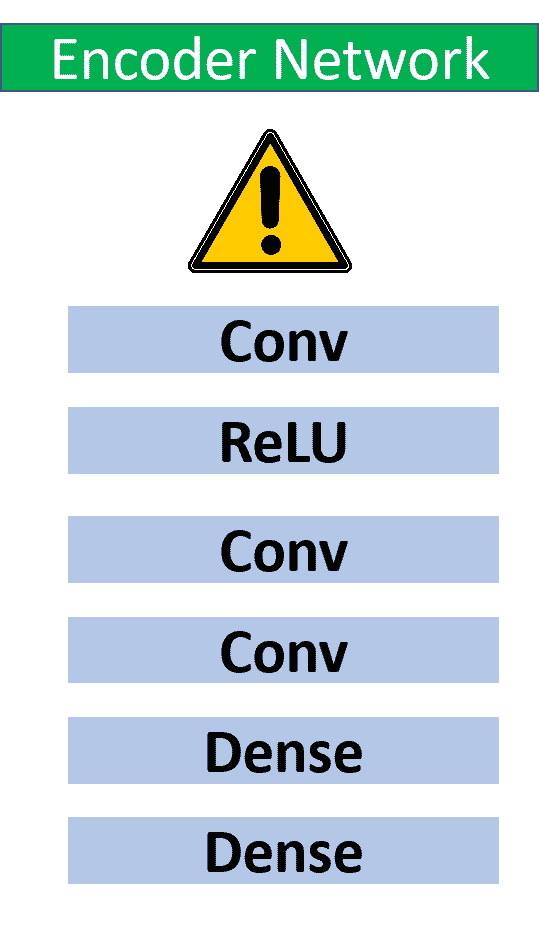
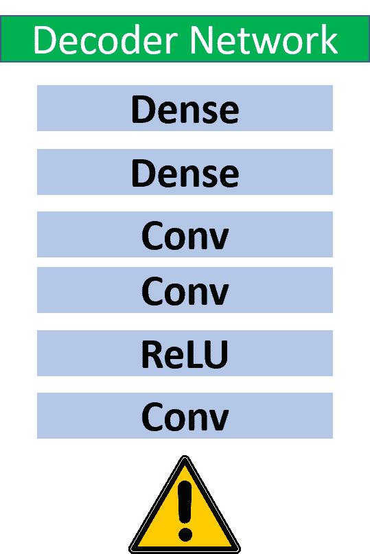
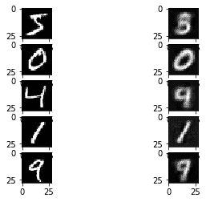

# Keras 中使用自动编码器的图像压缩

> 原文：<https://blog.paperspace.com/autoencoder-image-compression-keras/>

自动编码器是一种深度学习模型，用于将数据从高维空间转换到低维空间。它们的工作原理是将数据(无论大小)编码成一维向量。然后，可以对该向量进行解码，以重建原始数据(在这种情况下，是一幅图像)。自动编码器越精确，生成的数据就越接近原始数据。

在本教程中，我们将探索 autoencoder 架构，并了解如何使用 TensorFlow 和 Keras 将该模型应用于压缩 MNIST 数据集中的图像。特别是，我们将考虑:

*   判别建模与生成建模
*   自动编码器如何工作
*   在 Keras 中构建自动编码器
    *   构建编码器
    *   构建解码器
*   培养
*   做预测
*   完全码
*   结论

## **判别建模与生成建模**

最常见的机器学习模型是判别型的。如果你是一个机器学习爱好者，很可能你已经建立或使用的模型类型主要是歧视性的。这些模型识别输入数据，然后采取适当的行动。对于分类任务，判别模型学习如何区分各种不同的类。基于模型对每个类的属性的学习，它将新的输入样本分类到适当的标签。让我们将这种理解应用到下一个代表警告标志的图像中。

如果机器/深度学习模型要识别下面的图像，它可能会理解它由三个主要元素组成:矩形、直线和点。当另一个输入图像具有类似于这些元素的特征时，那么它也应该被识别为警告标志。


Image Source: [Pixabay](https://pixabay.com/vectors/sign-caution-warning-danger-safety-304093/)

如果该算法能够识别一幅图像的属性，它能否生成一幅与之相似的新图像？换句话说，它能不能画出一张有三角形、直线和圆点的新图像？不幸的是，鉴别模型不够聪明，即使它们知道这些图像的结构，也无法绘制出新的图像。我们再举一个例子，把事情说清楚。

假设有人能很好地识别事物。对于给定的图像，他/她可以容易地识别显著的属性，然后对图像进行分类。这样的人一定能再画出这样的形象吗？不。有些人不会画画。辨别模型就像那些只能识别图像，但不能自己画出来的人。

与**鉴别模型**相反，还有另一组叫做**的生成模型**可以创造新的图像。对于给定的输入图像，判别模型的输出是类别标签；创成式模型的输出是与输入图像大小相同、外观相似的图像。

最简单的生成模型之一是**自动编码器**(简称 **AE** )，这是本教程的重点。

## **自动编码器如何工作**

自动编码器是一种深度神经网络模型，可以接收数据，通过若干层传播数据，以浓缩和理解其结构，并最终再次生成数据。在本教程中，我们将特别考虑这是如何处理图像数据的。为了完成这项任务，自动编码器使用两种不同类型的网络。第一个被称为**编码器**，另一个是**解码器**。解码器只是编码器内部各层的反映。让我们弄清楚这是如何工作的。

编码器的工作是接受可能具有两个或更多维度的原始数据(例如，图像),并生成表示整个图像的单个 1-D 向量。一维向量中元素的数量根据要解决的任务而变化。它可以有一个或多个元素。向量中的元素越少，精确再现原始图像的复杂度越高。

通过用相对较少元素的向量表示输入图像，我们实际上压缩了图像。例如，MNIST 数据集(我们将在本教程中使用)中每幅图像的大小是`28x28`。也就是说，每个图像有`784`个元素。如果每个图像都被压缩，只使用两个元素来表示，那么我们就省去了`782`元素和`(782/784)*100=99.745%`数据。

下图显示了编码器如何从输入图像生成一维向量。包含的层是您自己选择的，因此您可以使用密集、卷积、下降等。



编码器从其最后一层生成的 1-D 向量然后被馈送到**解码器**。解码器的工作是以尽可能高的质量重建原始图像。解码器只是编码器的反映。根据上图中的编码器架构，下图给出了解码器的架构。



通过比较原始图像和重建图像，即通过计算两幅图像中像素之间的差异，来计算损失。请注意，解码器的输出必须与原始图像的大小相同。为什么？因为如果图像的大小不同，就没有办法计算损失。

在讨论了自动编码器的工作原理之后，让我们使用 Keras 构建我们的第一个自动编码器。

## **在 Keras 中构建自动编码器**

Keras 是构建机器和深度学习模型的强大工具，因为它简单而抽象，所以用很少的代码就可以获得很好的结果。Keras 有三种建立模型的方法:

1.  顺序 API
2.  功能 API
3.  模型子类化

这三种方式在允许的定制级别上有所不同。

**顺序 API** 允许您构建顺序模型，但是与其他两种类型相比，它的可定制性较差。模型中每个层的输出只连接到一个层。

虽然这是我们想要在本教程中创建的模型类型，但是我们将使用**函数 API** 。functional API 很简单，非常类似于 sequential API，并且还支持其他功能，例如将单层的输出连接到多层的能力。

构建 Keras 模型的最后一个选项是**模型子类化**，这是完全可定制的，但也非常复杂。你可以在[这篇教程](https://www.pyimagesearch.com/2019/10/28/3-ways-to-create-a-keras-model-with-tensorflow-2-0-sequential-functional-and-model-subclassing/)中了解更多关于这三种方法的内容。

现在我们将关注使用函数式 API 来构建自动编码器。您可能认为我们将构建一个单独的 Keras 模型来表示自动编码器，但是我们实际上将构建三个模型:一个用于编码器，另一个用于解码器，还有一个用于完整的自动编码器。为什么我们要为编码器和解码器都建立一个模型？我们这样做是为了防止您想单独探索每个模型。例如，我们可以使用编码器的模型来可视化表示每个输入图像的 1-D 向量，这可能有助于您了解它是否是图像的良好表示。使用解码器，我们将能够测试是否从 1-D 向量创建了良好的表示，假设它们是良好编码的(即，更好地用于调试目的)。最后，通过为整个自动编码器构建模型，我们可以通过向其提供原始图像并直接接收输出图像来轻松地端到端使用它。

让我们从构建编码器模型开始。

### **构建编码器**

以下代码使用函数式 API 为编码器构建了一个模型。首先，模型的层是使用`tensorflow.keras.layers` API 创建的，因为我们使用`TensorFlow`作为后端库。第一层是接受原始图像的`Input`层。该层接受一个名为`shape`的参数，表示输入的大小，这取决于所使用的数据集。我们将使用 MNIST 数据集，其中每幅图像的大小为`28x28`。不是将形状设置为`(28, 28)`，而是直接设置为`(784)`。为什么？因为我们将只使用网络中的密集层，因此输入必须是矢量形式，而不是矩阵。代表输入层的张量返回给变量`x`。

然后，输入层通过多个层传播:

*   `Dense`层有 300 个神经元
*   `LeakyReLU`图层
*   `Dense`层有 2 个神经元
*   `LeakyReLU`图层

网络的最后一层只有两个神经元。当输入到`LeakyReLU`层时，编码器的最终输出将是一个只有两个元素的一维向量。换句话说，MNIST 数据集中的所有影像都将被编码为两个元素的矢量。

```
import tensorflow.keras.layers
import tensorflow.keras.models

x = tensorflow.keras.layers.Input(shape=(784), name="encoder_input")

encoder_dense_layer1 = tensorflow.keras.layers.Dense(units=300, name="encoder_dense_1")(x)
encoder_activ_layer1 = tensorflow.keras.layers.LeakyReLU(name="encoder_leakyrelu_1")(encoder_dense_layer1)

encoder_dense_layer2 = tensorflow.keras.layers.Dense(units=2, name="encoder_dense_2")(encoder_activ_layer1)
encoder_output = tensorflow.keras.layers.LeakyReLU(name="encoder_output")(encoder_dense_layer2)
```

构建并连接所有层后，下一步是使用`tensorflow.keras.models` API 构建模型，根据下一行指定输入和输出张量:

```
encoder = tensorflow.keras.models.Model(x, encoder_output, name="encoder_model")
```

为了打印编码器架构的概要，我们将使用`encoder.summary()`。输出如下。这个网络并不大，你可以在名为`encoder_dense_1`的密集层中增加神经元的数量，但我只用了 300 个神经元，以避免花太多时间训练网络。

```
_________________________________________________________________
Layer (type)                 Output Shape              Param #   
=================================================================
encoder_input (InputLayer)   [(None, 784)]             0         
_________________________________________________________________
encoder_dense_1 (Dense)      (None, 300)               235500    
_________________________________________________________________
encoder_leakyrelu_1 (LeakyRe (None, 300)               0         
_________________________________________________________________
encoder_dense_2 (Dense)      (None, 2)                 602       
_________________________________________________________________
encoder_output (LeakyReLU)   (None, 2)                 0         
=================================================================
Total params: 236,102
Trainable params: 236,102
Non-trainable params: 0
_________________________________________________________________
```

在建立了编码器之后，接下来是解码器。

### **构建解码器**

与构建编码器类似，将使用以下代码构建解码器。因为解码器的输入层接受从编码器的最后一层返回的输出，我们必须确保这两层在大小上匹配。编码器的最后一层返回 2 个元素的向量，因此解码器的输入必须有 2 个神经元。你可以很容易地注意到，解码器的层只是编码器层的反射。

```
decoder_input = tensorflow.keras.layers.Input(shape=(2), name="decoder_input")

decoder_dense_layer1 = tensorflow.keras.layers.Dense(units=300, name="decoder_dense_1")(decoder_input)
decoder_activ_layer1 = tensorflow.keras.layers.LeakyReLU(name="decoder_leakyrelu_1")(decoder_dense_layer1)

decoder_dense_layer2 = tensorflow.keras.layers.Dense(units=784, name="decoder_dense_2")(decoder_activ_layer1)
decoder_output = tensorflow.keras.layers.LeakyReLU(name="decoder_output")(decoder_dense_layer2)
```

连接各层后，接下来是根据下一行建立解码器模型。

```
decoder = tensorflow.keras.models.Model(decoder_input, decoder_output, name="decoder_model")
```

这里是`decoder.summary()`的输出。确保从编码器返回的输出大小与原始输入大小相匹配非常重要。

```
_________________________________________________________________
Layer (type)                 Output Shape              Param #   
=================================================================
decoder_input (InputLayer)   [(None, 2)]               0         
_________________________________________________________________
decoder_dense_1 (Dense)      (None, 300)               900       
_________________________________________________________________
decoder_leakyrelu_1 (LeakyRe (None, 300)               0         
_________________________________________________________________
decoder_dense_2 (Dense)      (None, 784)               235984    
_________________________________________________________________
decoder_output (LeakyReLU)   (None, 784)               0         
=================================================================
Total params: 236,884
Trainable params: 236,884
Non-trainable params: 0
_________________________________________________________________
```

在构建了自动编码器的两个模块(编码器和解码器)之后，接下来是构建完整的自动编码器。

### **构建自动编码器**

下面列出了构建自动编码器的代码。名为`ae_input`的张量表示接受长度为 784 的向量的输入层。这个张量作为输入被馈送到编码器模型。编码器的输出保存在`ae_encoder_output`中，然后输入解码器。最后，自动编码器的输出保存在`ae_decoder_output`中。

为接受输入`ae_input`和输出`ae_decoder_output`的自动编码器创建一个模型。

```
ae_input = tensorflow.keras.layers.Input(shape=(784), name="AE_input")
ae_encoder_output = encoder(ae_input)
ae_decoder_output = decoder(ae_encoder_output)

ae = tensorflow.keras.models.Model(ae_input, ae_decoder_output, name="AE")
```

下面列出了自动编码器的概要。在这里，您可以发现自动编码器的输入和输出的形状是相同的，这是计算损耗所必需的。

```
_________________________________________________________________
Layer (type)                 Output Shape              Param #   
=================================================================
AE_input (InputLayer)        [(None, 784)]             0         
_________________________________________________________________
encoder_model (Model)        (None, 2)                 236102    
_________________________________________________________________
decoder_model (Model)        (None, 784)               236884    
=================================================================
Total params: 472,986
Trainable params: 472,986
Non-trainable params: 0
_________________________________________________________________
```

模型构建过程的下一步是根据下一个代码使用`compile()`方法编译模型。使用`mean square error`损失功能，使用`Adam optimizer`，学习率设置为`0.0005`。

```
import tensorflow.keras.optimizers  
ae.compile(loss="mse", optimizer=tensorflow.keras.optimizers.Adam(lr=0.0005))
```

现在，模型已经准备好接受训练数据，因此下一步是准备数据，以便提供给模型。

请记住，有三种型号:

1.  编码器
2.  解码器
3.  ae(用于自动编码器)

## **加载 MNIST 数据集并训练自动编码器**

Keras 有一个名为`tensorflow.keras.datasets`的 API，其中可以使用许多数据集。我们将使用根据下一个代码加载的 MNIST 数据集。数据集作为 NumPy 数组加载，表示训练数据、测试数据、训练标签和测试标签。请注意，我们对在训练模型时使用类标签一点也不感兴趣，它们只是用来显示结果的。

`x_train_orig`和`x_test_orig` NumPy 数组保存 MNIST 图像数据，其中每个图像的大小为`28x28`。因为我们的模型接受图像作为长度为`784`的向量，然后使用`numpy.reshape()`函数对这些数组进行整形。

```
import tensorflow.keras.datasets
import numpy

(x_train_orig, y_train), (x_test_orig, y_test) = tensorflow.keras.datasets.mnist.load_data()
x_train_orig = x_train_orig.astype("float32") / 255.0
x_test_orig = x_test_orig.astype("float32") / 255.0

x_train = numpy.reshape(x_train_orig, newshape=(x_train_orig.shape[0], numpy.prod(x_train_orig.shape[1:])))
x_test = numpy.reshape(x_test_orig, newshape=(x_test_orig.shape[0], numpy.prod(x_test_orig.shape[1:])))
```

此时，我们可以使用`fit`方法训练自动编码器，如下所示:

```
ae.fit(x_train, x_train, epochs=20, batch_size=256, shuffle=True, validation_data=(x_test, x_test))
```

注意，训练数据输入和输出都被设置为`x_train`，因为预测输出与原始输入相同。这同样适用于验证数据。您可以将时期数和批次大小更改为其他值。

在自动编码器被训练之后，下一步是进行预测。

## **做出预测**

在下一个代码中使用了`predict()`方法来返回编码器和解码器模型的输出。`encoded_images` NumPy 数组保存代表所有训练图像的 1D 向量。解码器模型接受该阵列来重建原始图像。

```
encoded_images = encoder.predict(x_train)
decoded_images = decoder.predict(encoded_images)
```

注意，解码器的输出是长度为`784`的 1D 向量。为了显示重建图像，解码器输出被整形为`28x28`,如下所示:

```
decoded_images_orig = numpy.reshape(decoded_images, newshape=(decoded_images.shape[0], 28, 28))
```

下一个代码使用`Matplotlib`来显示 5 个随机样本的原始图像和重建图像。

```
num_images_to_show = 5
for im_ind in range(num_images_to_show):
    plot_ind = im_ind*2 + 1
    rand_ind = numpy.random.randint(low=0, high=x_train.shape[0])
    matplotlib.pyplot.subplot(num_images_to_show, 2, plot_ind)
    matplotlib.pyplot.imshow(x_train_orig[rand_ind, :, :], cmap="gray")
    matplotlib.pyplot.subplot(num_images_to_show, 2, plot_ind+1)
    matplotlib.pyplot.imshow(decoded_images_orig[rand_ind, :, :], cmap="gray")
```

下图显示了 5 幅原始图像及其重建。您可以看到，自动编码器至少能够重建接近原始图像的图像，但质量较低。



低质量的原因之一是在致密层中使用了低数量的神经元(300)。另一个原因是仅使用 2 个元素来表示所有图像。可以通过使用更多的元素来提高质量，但是这增加了压缩数据的大小。

另一个原因是根本不使用卷积层。密集层有利于从图像中获取全局属性，而卷积层有利于获取局部属性。可以通过添加一些卷积层来增强结果。

为了更好地理解编码器模型的输出，让我们根据下一个代码显示它返回的所有 1D 向量。

```
matplotlib.pyplot.figure()
matplotlib.pyplot.scatter(encoded_images[:, 0], encoded_images[:, 1], c=y_train) 
matplotlib.pyplot.colorbar()
```

这段代码生成的图如下所示。通常，您可以看到该模型能够对不同区域的不同图像进行聚类，但不同聚类之间存在重叠。


## **完整代码**

下面列出了本教程中讨论的完整代码。

```
import tensorflow.keras.layers
import tensorflow.keras.models
import tensorflow.keras.optimizers
import tensorflow.keras.datasets
import numpy
import matplotlib.pyplot

# Encoder
x = tensorflow.keras.layers.Input(shape=(784), name="encoder_input")

encoder_dense_layer1 = tensorflow.keras.layers.Dense(units=300, name="encoder_dense_1")(x)
encoder_activ_layer1 = tensorflow.keras.layers.LeakyReLU(name="encoder_leakyrelu_1")(encoder_dense_layer1)

encoder_dense_layer2 = tensorflow.keras.layers.Dense(units=2, name="encoder_dense_2")(encoder_activ_layer1)
encoder_output = tensorflow.keras.layers.LeakyReLU(name="encoder_output")(encoder_dense_layer2)

encoder = tensorflow.keras.models.Model(x, encoder_output, name="encoder_model")
encoder.summary()

# Decoder
decoder_input = tensorflow.keras.layers.Input(shape=(2), name="decoder_input")

decoder_dense_layer1 = tensorflow.keras.layers.Dense(units=300, name="decoder_dense_1")(decoder_input)
decoder_activ_layer1 = tensorflow.keras.layers.LeakyReLU(name="decoder_leakyrelu_1")(decoder_dense_layer1)

decoder_dense_layer2 = tensorflow.keras.layers.Dense(units=784, name="decoder_dense_2")(decoder_activ_layer1)
decoder_output = tensorflow.keras.layers.LeakyReLU(name="decoder_output")(decoder_dense_layer2)

decoder = tensorflow.keras.models.Model(decoder_input, decoder_output, name="decoder_model")
decoder.summary()

# Autoencoder
ae_input = tensorflow.keras.layers.Input(shape=(784), name="AE_input")
ae_encoder_output = encoder(ae_input)
ae_decoder_output = decoder(ae_encoder_output)

ae = tensorflow.keras.models.Model(ae_input, ae_decoder_output, name="AE")
ae.summary()

# RMSE
def rmse(y_true, y_predict):
    return tensorflow.keras.backend.mean(tensorflow.keras.backend.square(y_true-y_predict))

# AE Compilation
ae.compile(loss="mse", optimizer=tensorflow.keras.optimizers.Adam(lr=0.0005))

# Preparing MNIST Dataset
(x_train_orig, y_train), (x_test_orig, y_test) = tensorflow.keras.datasets.mnist.load_data()
x_train_orig = x_train_orig.astype("float32") / 255.0
x_test_orig = x_test_orig.astype("float32") / 255.0

x_train = numpy.reshape(x_train_orig, newshape=(x_train_orig.shape[0], numpy.prod(x_train_orig.shape[1:])))
x_test = numpy.reshape(x_test_orig, newshape=(x_test_orig.shape[0], numpy.prod(x_test_orig.shape[1:])))

# Training AE
ae.fit(x_train, x_train, epochs=20, batch_size=256, shuffle=True, validation_data=(x_test, x_test))

encoded_images = encoder.predict(x_train)
decoded_images = decoder.predict(encoded_images)
decoded_images_orig = numpy.reshape(decoded_images, newshape=(decoded_images.shape[0], 28, 28))

num_images_to_show = 5
for im_ind in range(num_images_to_show):
    plot_ind = im_ind*2 + 1
    rand_ind = numpy.random.randint(low=0, high=x_train.shape[0])
    matplotlib.pyplot.subplot(num_images_to_show, 2, plot_ind)
    matplotlib.pyplot.imshow(x_train_orig[rand_ind, :, :], cmap="gray")
    matplotlib.pyplot.subplot(num_images_to_show, 2, plot_ind+1)
    matplotlib.pyplot.imshow(decoded_images_orig[rand_ind, :, :], cmap="gray")

matplotlib.pyplot.figure()
matplotlib.pyplot.scatter(encoded_images[:, 0], encoded_images[:, 1], c=y_train)
matplotlib.pyplot.colorbar()
```

## **结论**

本教程介绍了称为自动编码器的深度学习生成模型。这个模型由两个构件组成:编码器和解码器。前者将输入数据编码为一维向量，然后对其进行解码以重建原始数据。我们看到了如何使用 Keras 应用这个模型来压缩来自 MNIST 数据集的图像。