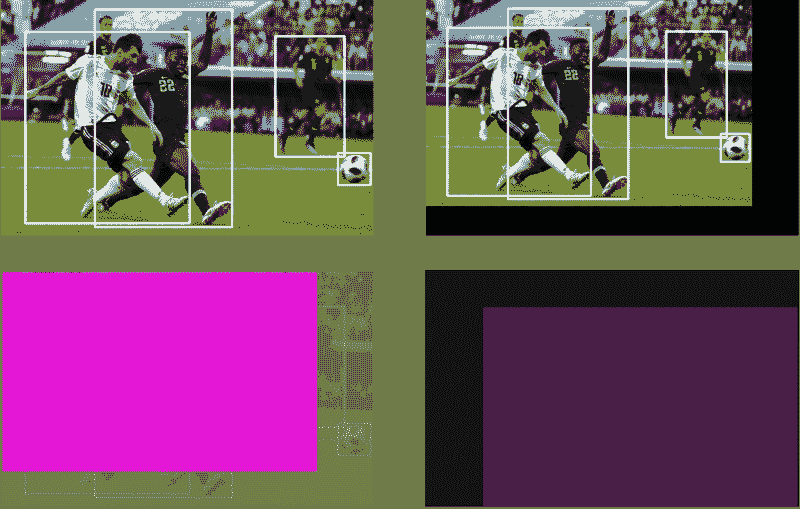
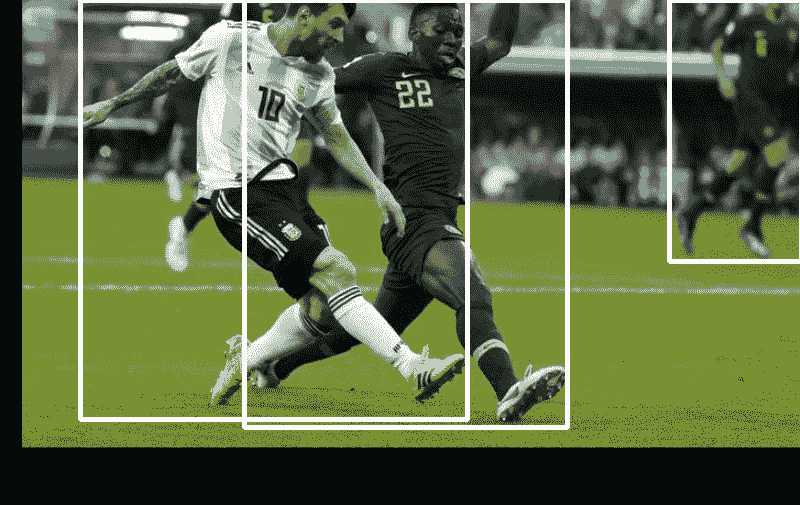

# 包围盒的数据扩充:缩放和平移

> 原文：<https://blog.paperspace.com/data-augmentation-bounding-boxes-scaling-translation/>

这是我们正在做的一系列文章中的第二部分，涵盖了实现将图像增强技术应用于对象检测任务。在这一部分中，我们将介绍如何实现缩放和转换增强技术，以及在增强后，如果您的边界框的一部分在图像之外，该怎么办。

在上一部分中，我们介绍了实现增强以及*水平翻转*增强的统一方法。

## GitHub 回购

本文和整个增强库的所有内容都可以在下面的 Github Repo 中找到。

[https://github . com/paper space/dataincreasationforobjectdetection](https://github.com/Paperspace/DataAugmentationForObjectDetection)

## 证明文件

这个项目的文档可以在你的浏览器中打开`docs/build/html/index.html`或者点击[链接](https://augmentationlib.paperspace.com/)找到。

本系列的第 1 部分是本文的先决条件，强烈建议您通读一遍。

这个系列有 4 个部分。
[1。第 1 部分:基础设计和水平翻转](https://blog.paperspace.com/data-augmentation-for-bounding-boxes/)
[2。第二部分:缩放和平移](https://blog.paperspace.com/data-augmentation-bounding-boxes-scaling-translation/)
[3。第三部分:旋转和剪切](https://blog.paperspace.com/data-augmentation-for-object-detection-rotation-and-shearing/)
[4。第 4 部分:烘焙增强到输入管道](https://blog.paperspace.com/data-augmentation-for-object-detection-building-input-pipelines/)

在这篇文章中，我们将实现几个叫做 **Scale** 和 **Translate** 的扩展，它们显然是按照它们的意思做的。

## 规模

缩放转换的结果将如下所示。


*Left*: Original Image *Right*: Scale Augmentation applied.

### 设计决策

*   我们首先需要考虑的是*规模*扩大的参数。显而易见的选择是询问原始图像的维度的**因子，我们希望它缩放我们的图像。因此，**必须是大于-1 的值**。您不能缩放小于其自身的尺寸。**
*   人们可以通过将缩放因子约束为高度和宽度都相同来选择保持纵横比。然而，我们可以允许比例因子不同，这不仅产生比例放大，而且改变图像的纵横比。我们引入了一个布尔变量`diff`，它可以打开/关闭这个功能。
*   在实现这种增强的随机版本时，我们需要从一个区间中随机抽取一个比例因子的样本。我们处理它的方式是，如果用户能够提供比例因子`scale`将被采样的范围。如果用户只提供一个浮点数`scale`，它必须是正的，比例因子从(- `scale`，`scale`)采样。

现在让我们来定义`__init__`方法。

```
class RandomScale(object):
    """Randomly scales an image    

    Bounding boxes which have an area of less than 25% in the remaining in the 
    transformed image is dropped. The resolution is maintained, and the remaining
    area if any is filled by black color.

    Parameters
    ----------
    scale: float or tuple(float)
        if **float**, the image is scaled by a factor drawn 
        randomly from a range (1 - `scale` , 1 + `scale`). If **tuple**,
        the `scale` is drawn randomly from values specified by the 
        tuple

    Returns
    -------

    numpy.ndaaray
        Scaled image in the numpy format of shape `HxWxC`

    numpy.ndarray
        Tranformed bounding box co-ordinates of the format `n x 4` where n is 
        number of bounding boxes and 4 represents `x1,y1,x2,y2` of the box

    """

    def __init__(self, scale = 0.2, diff = False):
        self.scale = scale

        if type(self.scale) == tuple:
            assert len(self.scale) == 2, "Invalid range"
            assert self.scale[0] > -1, "Scale factor can't be less than -1"
            assert self.scale[1] > -1, "Scale factor can't be less than -1"
        else:
            assert self.scale > 0, "Please input a positive float"
            self.scale = (max(-1, -self.scale), self.scale)

        self.diff = diff
```

这里的一个教训是不应该对`__init__`函数中的最终参数进行采样。如果您对`__init__`函数中的参数进行采样，那么每次调用函数时都会使用相同的参数值。这就消除了增加的随机因素。

将其移动到`__call__`功能将导致每次应用增强时参数具有不同的值(来自范围)。

### 增强逻辑

比例转换的逻辑相当简单。我们使用 OpenCV 函数`cv2.resize`来缩放我们的图像，并通过缩放因子来缩放我们的边界框。

```
img_shape = img.shape

if self.diff:
	scale_x = random.uniform(*self.scale)
	scale_y = random.uniform(*self.scale)
else:
	scale_x = random.uniform(*self.scale)
	scale_y = scale_x

resize_scale_x = 1 + scale_x
resize_scale_y = 1 + scale_y

img=  cv2.resize(img, None, fx = resize_scale_x, fy = resize_scale_y)

bboxes[:,:4] *= [resize_scale_x, resize_scale_y, resize_scale_x, resize_scale_y]
```

但是，我们将保持大小不变。如果我们要缩小规模，就会有剩余的面积。我们将把它涂成黑色。输出将类似于上面显示的增强图像。

首先，我们创建一个原始图像大小的黑色图像。

```
canvas = np.zeros(img_shape, dtype = np.uint8) 
```

然后，我们确定缩放图像的大小。如果它超过了原始图像的尺寸(我们正在按比例放大)，那么它需要在原始尺寸被切断。然后，我们将调整后的图像“粘贴”到画布上。

```
y_lim = int(min(resize_scale_y,1)*img_shape[0])
x_lim = int(min(resize_scale_x,1)*img_shape[1])

canvas[:y_lim,:x_lim,:] =  img[:y_lim,:x_lim,:]

img = canvas
```

### 边界框剪辑

最后剩下的唯一一件事是，由于缩放，一个对象被从图像中排除。例如，考虑放大 0.1 倍，这意味着最终图像尺寸是原始图像的 1.1 倍。这将足球从我们的形象中驱逐出去。


The football is expelled as result of scaling up.

想一想，你会意识到这种情况不仅出现在扩大规模的时候，也出现在像翻译这样的其他扩大中。

因此，我们在助手文件`bbox_utils.py`中定义了一个函数`clip_box`,它基于图像边界内的边界框总面积的百分比来裁剪边界框。这个百分比是一个可控的参数。

在文件`bbox_utils.py`中定义、

```
def clip_box(bbox, clip_box, alpha):
    """Clip the bounding boxes to the borders of an image

    Parameters
    ----------

    bbox: numpy.ndarray
        Numpy array containing bounding boxes of shape `N X 4` where N is the 
        number of bounding boxes and the bounding boxes are represented in the
        format `x1 y1 x2 y2`

    clip_box: numpy.ndarray
        An array of shape (4,) specifying the diagonal co-ordinates of the image
        The coordinates are represented in the format `x1 y1 x2 y2`

    alpha: float
        If the fraction of a bounding box left in the image after being clipped is 
        less than `alpha` the bounding box is dropped. 

    Returns
    -------

    numpy.ndarray
        Numpy array containing **clipped** bounding boxes of shape `N X 4` where N is the 
        number of bounding boxes left are being clipped and the bounding boxes are represented in the
        format `x1 y1 x2 y2` 

    """
    ar_ = (bbox_area(bbox))
    x_min = np.maximum(bbox[:,0], clip_box[0]).reshape(-1,1)
    y_min = np.maximum(bbox[:,1], clip_box[1]).reshape(-1,1)
    x_max = np.minimum(bbox[:,2], clip_box[2]).reshape(-1,1)
    y_max = np.minimum(bbox[:,3], clip_box[3]).reshape(-1,1)

    bbox = np.hstack((x_min, y_min, x_max, y_max, bbox[:,4:]))

    delta_area = ((ar_ - bbox_area(bbox))/ar_)

    mask = (delta_area < (1 - alpha)).astype(int)

    bbox = bbox[mask == 1,:]

    return bbox
```

上面的函数修改了`bboxes`数组，并删除了由于增加而丢失太多区域的边界框。

然后，我们简单地在我们的`RandomScale`的`__call__`方法中使用这个函数，以确保所有的盒子都被剪辑。这里，我们去掉了所有那些在图像范围内面积小于 25%的边界框。

```
bboxes = clip_box(bboxes, [0,0,1 + img_shape[1], img_shape[0]], 0.25) 
```

为了计算边界框的面积，我们还定义了一个函数`bbox_area`。

最后，我们完成的`__call__`方法看起来像:

```
def __call__(self, img, bboxes):

	#Chose a random digit to scale by 

	img_shape = img.shape

	if self.diff:
		scale_x = random.uniform(*self.scale)
		scale_y = random.uniform(*self.scale)
	else:
		scale_x = random.uniform(*self.scale)
		scale_y = scale_x

    resize_scale_x = 1 + scale_x
    resize_scale_y = 1 + scale_y

    img=  cv2.resize(img, None, fx = resize_scale_x, fy = resize_scale_y)

    bboxes[:,:4] *= [resize_scale_x, resize_scale_y, resize_scale_x, resize_scale_y]

    canvas = np.zeros(img_shape, dtype = np.uint8)

    y_lim = int(min(resize_scale_y,1)*img_shape[0])
    x_lim = int(min(resize_scale_x,1)*img_shape[1])

    print(y_lim, x_lim)

    canvas[:y_lim,:x_lim,:] =  img[:y_lim,:x_lim,:]

    img = canvas
    bboxes = clip_box(bboxes, [0,0,1 + img_shape[1], img_shape[0]], 0.25)

    return img, bboxes
```

## 翻译

我们要讨论的下一个增强是翻译，它会产生这样的效果。


同样，像比例放大一样，放大的参数是图像的尺寸因子，图像应该通过该因子进行平移。同样的设计决策也适用。

除了确保平移因子不小于-1，你还应该确保它不大于 1，否则你只会得到一个黑色的图像，因为整个图像将被转移。

```
class RandomTranslate(object):
    """Randomly Translates the image    

    Bounding boxes which have an area of less than 25% in the remaining in the 
    transformed image is dropped. The resolution is maintained, and the remaining
    area if any is filled by black color.

    Parameters
    ----------
    translate: float or tuple(float)
        if **float**, the image is translated by a factor drawn 
        randomly from a range (1 - `translate` , 1 + `translate`). If **tuple**,
        `translate` is drawn randomly from values specified by the 
        tuple

    Returns
    -------

    numpy.ndaaray
        Translated image in the numpy format of shape `HxWxC`

    numpy.ndarray
        Tranformed bounding box co-ordinates of the format `n x 4` where n is 
        number of bounding boxes and 4 represents `x1,y1,x2,y2` of the box

    """

    def __init__(self, translate = 0.2, diff = False):
        self.translate = translate

        if type(self.translate) == tuple:
            assert len(self.translate) == 2, "Invalid range"  
            assert self.translate[0] > 0 & self.translate[0] < 1
            assert self.translate[1] > 0 & self.translate[1] < 1

        else:
            assert self.translate > 0 & self.translate < 1
            self.translate = (-self.translate, self.translate)

        self.diff = diff
```

### 逻辑的扩充

这种扩张的逻辑比规模要复杂得多。因此，它值得一些解释。

我们首先从设置变量开始。

```
def __call__(self, img, bboxes):        
    #Chose a random digit to scale by 
    img_shape = img.shape

    #translate the image

    #percentage of the dimension of the image to translate
    translate_factor_x = random.uniform(*self.translate)
    translate_factor_y = random.uniform(*self.translate)

    if not self.diff:
    translate_factor_y = translate_factor_x
```

现在，当我们翻译图像时，会留下一些拖尾空间。我们将把它涂成黑色。如果你看上面演示翻译的图像，你可以很容易地辨认出黑色的空间。

我们像以前一样进行。我们首先初始化一个黑色图像，大约是原始图像的大小。

```
canvas = np.zeros(img_shape) 
```

然后，我们有两个任务。首先，如第一幅图所示，确定图像将粘贴到黑色画布的哪个部分。

第二，图像的哪一部分会被粘贴。



*Left*: The part of image which will be pasted. *Right*: The area of Canvas on which the image will be pasted,

因此，我们首先计算出要在画布图像上粘贴的图像区域。(图像上的紫色斑块，位于上图左侧)。

```
#get the top-left corner co-ordinates of the shifted image 
corner_x = int(translate_factor_x*img.shape[1])
corner_y = int(translate_factor_y*img.shape[0])

mask = img[max(-corner_y, 0):min(img.shape[0], -corner_y + img_shape[0]), max(-corner_x, 0):min(img.shape[1], -corner_x + img_shape[1]),:]
```

现在让我们得到画布上我们要“粘贴”的部分`mask`

```
orig_box_cords =  [max(0,corner_y), max(corner_x,0), min(img_shape[0], corner_y + img.shape[0]), min(img_shape[1],corner_x + img.shape[1])]

canvas[orig_box_cords[0]:orig_box_cords[2], orig_box_cords[1]:orig_box_cords[3],:] = mask
img = canvas 
```

移动箱子相对简单。你只需要偏移边界框的角。作为增强的结果，我们还裁剪了图像内面积小于 25%的边界框。

```
bboxes[:,:4] += [corner_x, corner_y, corner_x, corner_y]

bboxes = clip_box(bboxes, [0,0,img_shape[1], img_shape[0]], 0.25)
```

总结一下，我们的调用函数是这样的。

```
def __call__(self, img, bboxes):        
    #Chose a random digit to scale by 
    img_shape = img.shape

    #translate the image

    #percentage of the dimension of the image to translate
    translate_factor_x = random.uniform(*self.translate)
    translate_factor_y = random.uniform(*self.translate)

    if not self.diff:
        translate_factor_y = translate_factor_x

    canvas = np.zeros(img_shape).astype(np.uint8)

    corner_x = int(translate_factor_x*img.shape[1])
    corner_y = int(translate_factor_y*img.shape[0])

    #change the origin to the top-left corner of the translated box
    orig_box_cords =  [max(0,corner_y), max(corner_x,0), min(img_shape[0], corner_y + img.shape[0]), min(img_shape[1],corner_x + img.shape[1])]

    mask = img[max(-corner_y, 0):min(img.shape[0], -corner_y + img_shape[0]), max(-corner_x, 0):min(img.shape[1], -corner_x + img_shape[1]),:]
    canvas[orig_box_cords[0]:orig_box_cords[2], orig_box_cords[1]:orig_box_cords[3],:] = mask
    img = canvas

    bboxes[:,:4] += [corner_x, corner_y, corner_x, corner_y]

    bboxes = clip_box(bboxes, [0,0,img_shape[1], img_shape[0]], 0.25)

    return img, bboxes
```

## 测试

正如上一个示例中所详述的，您可以在样本图像上测试这些增强，或者在您自己的图像上测试这些增强，前提是您已经以正确的格式存储了增强。

```
from data_aug.bbox_utils import *
import matplotlib.pyplot as plt 

scale = RandomScale(0.2, diff = True)  
translate = RandomTranslate(0.2, diff = True)

img, bboxes = translate(img, bboxes)
img,bboxes = scale(img, bboxes)

plt.imshow(draw_rect(img, bboxes))
```

最终结果可能是这样的。



你可以试着先做缩放，再做平移。您可能会发现相同参数值的结果是不同的。能解释一下吗？这是留给读者的一个练习。

另一个练习可以是尝试实现我们已经实现的增强的确定性版本。

这是这一部分。在下一部分中，我们将使用 OpenCV 的仿射变换特性，在旋转和剪切方面，增强将变得更高级、更混乱。敬请期待！