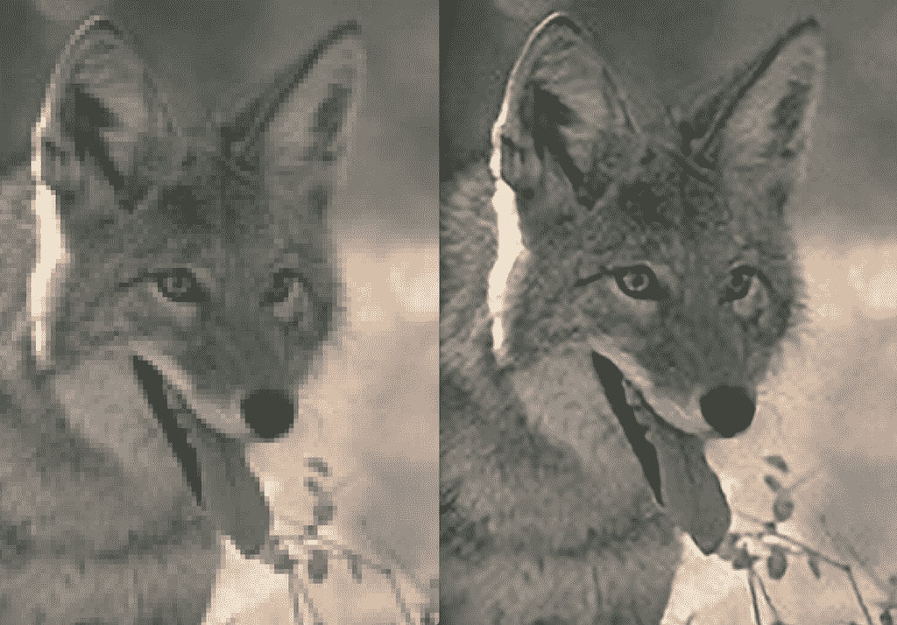
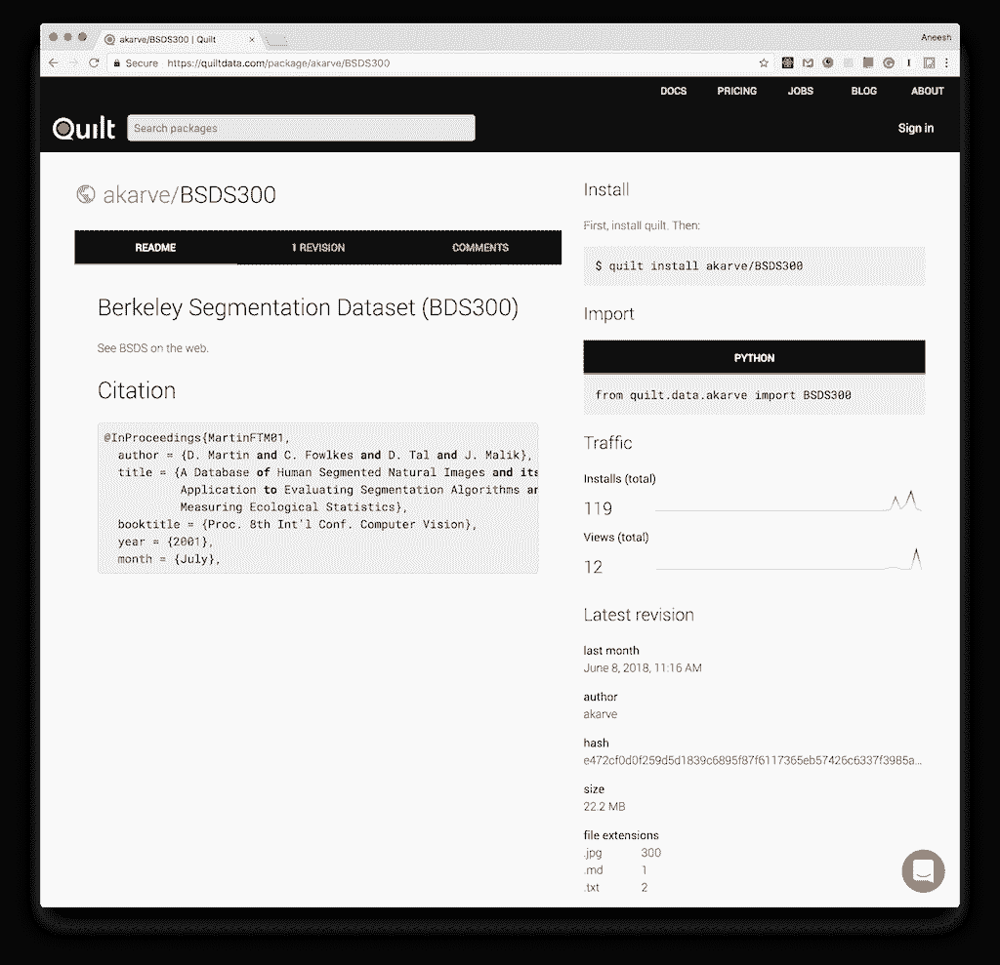
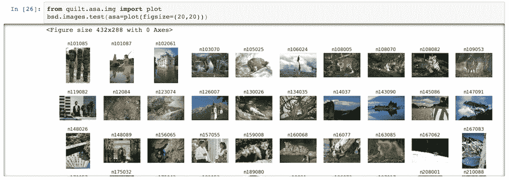

# 使用 PyTorch 和棉被的可重复机器学习

> 原文：<https://blog.paperspace.com/reproducible-data-with-pytorch-and-quilt/>

在本文中，我们将训练 PyTorch 模型来执行[超分辨率成像](https://arxiv.org/abs/1609.05158)，这是一种优雅地放大图像的技术。我们将使用[棉被数据注册库](https://quiltdata.com/)将训练数据和模型快照为版本*数据包*。


<small>超分辨率成像(右)从低分辨率图像(左)推断像素值。</small>

# 再现性危机

机器学习项目通常从获取数据、清理数据和将数据转换成模型原生格式开始。这样的手动数据管道创建起来很乏味，并且*很难随着时间的推移、在合作者之间以及在机器之间重现*。此外，经过训练的模型经常被随意存储，没有版本控制。综合起来，上述挑战被称为 [*机器学习中的再现性危机*](https://blog.dominodatalab.com/machine-learning-reproducibility-crisis/) 。

> 这太糟糕了，有时感觉就像回到了没有源代码控制的时候。
> —皮特·沃顿

作为开发人员，我们有大量的工具来对代码进行版本控制。GitHub、Docker 和 PyPI 就是三个例子。我们使用这些服务来共享和发现应用程序的构建模块。构建块是版本化的和可部署的，这使得它们具有高度的可复制性。

但是可重用的数据呢？在本文中，我们将创建像 PyPI 包一样部署的可重用数据单元:

```
$ quilt install akarve/BSDS300 
```

## 在 GitHub 上存储数据怎么样？

如果你曾经试图在 GitHub 上存储数据，你可能会发现大数据是不受欢迎的。GitHub 将文件限制为 100MB，将存储库限制为 1GB。GitHub LFS 放宽了这些限制，但幅度不大。

相比之下，Quilt 存储库可以保存数万亿字节的数据和数千个文件，如本例中的 [Allen Cell Explorer](https://www.allencell.org/programmatic-data-access.html) 所示。包直接从 blob 存储中流出。因此，客户可以像从亚马逊 S3 读取数据一样快地获取数据。此外，Quilt 将数据序列化为列格式，比如 Apache Parquet。序列化加快了 I/O 并提高了网络吞吐量。

# 示例:使用 PyTorch 和棉被的超分辨率成像

## 将培训数据版本化

在这一部分，我们将打包我们的测试和训练集。如果您已经熟悉数据包，或者渴望训练模型，请跳到下一节，[将数据部署到任何机器](#deploydatatoanymachine)。

我们将在伯克利分割数据集和基准测试<sup class="footnote-ref">[【1】](#fn1)</sup>， *BSDS300* 上训练我们的超分辨率模型。首先，[从伯克利下载数据](https://www2.eecs.berkeley.edu/Research/Projects/CS/vision/bsds/BSDS300-images.tgz) (22 MB)。将内容解压到一个干净的目录中，并打开`BSDS300`文件夹。您将看到以下内容:

```
$ ls
iids_test.txt  iids_train.txt  images 
```

可选地，添加一个`README.md`文件，以便您的数据包是自文档化的:

```
# Berkeley Segmentation Dataset (BDS300)
See [BSDS on the web](https://www2.eecs.berkeley.edu/Research/Projects/CS/vision/bsds/).

# Citations
    ```
@InProceedings{MartinFTM01,
  author = {D. Martin and C. Fowlkes and D. Tal and J. Malik},
  title = {A Database of Human Segmented Natural Images and its
           Application to Evaluating Segmentation Algorithms and
           Measuring Ecological Statistics},
  booktitle = {Proc. 8th Int'l Conf. Computer Vision},
  year = {2001},
  month = {July},
  volume = {2},
  pages = {416--423}
}
    ``` 
```

要将上述文件转换成版本化的数据包，我们需要安装 Quilt:

```
$ pip install quilt 
```

*Windows 用户*，先安装 [Visual C++可再发行版 for Visual Studio 2015](https://www.microsoft.com/en-us/download/details.aspx?id=48145) 。要从 Jupyter 单元安装被子，请参见[附录 1](#1installquiltinajupyternotebook) 。

接下来，从当前工作目录的内容构建一个数据包:

```
$ quilt build YOUR_USERNAME/BSDS300 . 
```

此时，包驻留在您的机器上。如果你想把这个包部署到其他机器上，你需要在[quiltdata.com](https://quiltdata.com)上有一个免费账户。

```
$ quilt login
$ quilt push YOUR_USERNAME/BSDS300 --public 
```

现在，世界上任何人都可以精确地复制相同的数据:

```
quilt install akarve/BSDS300 -x e472cf0 
```

`-x`参数指定了包实例的 SHA-256 摘要。

> 正如 PyPI 托管可重用的软件包(如 pandas、numpy 和 torch)，Quilt 托管可重用的数据包。

每个包都有一个登录页面，其中显示了文档、修订历史等内容。下面我们看到包的大小(22.2 MB)，文件统计(300。jpg 文件)，和包哈希(`e472cf0…`)。

[](https://quiltdata.com/package/akarve/BSDS300) 
<small>被子上的伯克利分割数据集。</small>

# 将数据部署到任何机器

在远程机器上安装 Quilt，然后安装 BSDS300 包。

```
$ pip install quilt[img]
$ quilt install akarve/BSDS300 
```

(要自定义数据包的存储位置，请参见[附录 2](#2installpackagesinaspecificdirectory) 。)

我们现在准备探索 Python 中的 BSDS300:

```
In [1]:
from quilt.data.akarve import BSDS300 as bsds
bsds.images

Out [1]:
<GroupNode>
test/
train/ 
```

包是可浏览的，就像文件系统一样。`bsds.images.test`包含图片:

```
In [2]: bsds.images.test
Out[2]:
<GroupNode>
n101085
n101087
n102061
n103070
n105025
… 
```

我们可以使用 Quilt 的`asa=`回调来显示`bsds.images.test`“作为一个情节”。

```
%matplotlib inline
from quilt.asa.img import plot
bsds.images.test(asa=plot(figsize=(20,20))) 
```



在引擎罩下，`quilt.asa.img.plot()`对每张图片做如下处理:

```
from matplotlib import image, pyplot

pyplot.imshow(
    image.imread(
        bsd['images']['test']['n101085']()
    )) 
```

`bsd['images']['test']['n101085']()`代表文件`bimg/test/101085.jpg`。Quilt 将`n`添加到文件名前面，这样每个包节点都是一个有效的 Python 标识符，可以用 Python 的点操作符或括号访问。后面的括号`()`指示 Quilt 返回底层 [*数据片段*](https://docs.quiltdata.com/developer/fragment-store) 的路径。

## 用被子包裹训练 PyTorch 模型

超分辨率成像优雅地推断出测试实例中缺失的像素值。为了让模型推断分辨率，它需要高分辨率图像的训练语料库(在我们的例子中，是 BSDS300 训练集)。

> 那么，我们如何将包中的数据放入 PyTorch 呢？

Quilt 提供了一个高阶函数`asa.pytorch.dataset()`，它将打包的数据转换成一个`torch.utils.data.Dataset`对象:

```
from quilt.data.akarve import BSDS300 as bsds
from quilt.asa.pytorch import dataset

return bsds.images.train(
    asa=dataset(
        include=is_image,
        node_parser=node_parser,
        input_transform=input_transform(...),
        target_transform=target_transform(...)
    )) 
```

要获得完整的代码示例，请参见 pytorch 的这个[分支-示例](https://github.com/quiltdata/pytorch-examples/tree/master/super_resolution)。fork 包含训练和应用我们的超分辨率模型所需的所有代码。叉子有什么特别之处？代码更少。

> 有了 Quilt 管理数据，几十行样板代码就消失了。不再需要下载、解包和加载数据的一次性功能。

### 运行培训作业

储存库[quilt data/py torch-examples](https://github.com/quiltdata/pytorch-examples)包含一个入口点脚本`train_super_resolution.sh`，它调用`main.py`来安装依赖项，训练模型，并将模型检查点保存到磁盘:

```
#!/usr/bin/bash
export QUILT_PRIMARY_PACKAGE_DIR='/storage/quilt_packages'
cd super_resolution
pip install -r requirements.txt
mkdir -p /storage/models/super_resolution/
N_EPOCHS=$1
echo "Training for ${N_EPOCHS:=10} epochs\n"
# train
python main.py \
	--upscale_factor 3 \
	--batchSize 4 \
	--testBatchSize 100 \
	--nEpochs $N_EPOCHS \
	--lr 0.001 \
        --cuda 
```

您可以克隆[这个 Paperspace 作业](https://www.paperspace.com/console/jobs/jvqssfqawv5zn/workspace)来训练您自己帐户中的模型。在 NVIDIA P4000 上，培训大约在 12 分钟内完成。如果你想改变模型的存储位置，请参见 [main.py](https://github.com/quiltdata/pytorch-examples/blob/master/super_resolution/main.py#L76) 。

### 快照 PyTorch 模型

除了数据之外，还可以在 Quilt 中存储模型及其完整的修订历史。

```
$ quilt build USR/PKG /storage/models/super_resolution/
$ quilt push USR/PKG 
```

有了上面创建的包，任何人都可以恢复过去的训练时间。

## 推论:加大我的分辨率

现在我们的模型已经训练好了，我们可以重新水合 epoch 500 并超解析测试集中的图像:

```
$ bash infer_super_resolution.sh 500 304034 
```

下面是结果。


<small>经过 500 个历元的训练推断出的超分辨率(右图)。</small>

这里有一个推理任务[。为了使推理工作，确保您的模型检查点保存在`/storage/models/super_resolution`中(如上面的训练脚本所示)，或者更新代码以使用不同的目录。此外，如果你和`--cuda`一起训练，你需要打电话给`super_resolve.py --cuda`。](https://www.paperspace.com/console/jobs/js4mqzm91fj2lg)

# 结论

我们已经使用 Quilt 打包数据，将数据部署到远程机器，然后训练 PyTorch 模型。

我们可以把可复制的机器学习想象成一个三变量的方程:
**代码+数据+模型=可复制性**

通过将版本化数据和版本化模型添加到我们的工作流中，我们使开发人员能够更轻松地获得跨机器、跨合作者的一致结果。

# 承认

感谢最初的 [super_resolution 示例](https://github.com/pytorch/examples/tree/master/super_resolution)的开发者，感谢 BSDS300 的策展人和创作者，感谢 [Dillon Erb](https://twitter.com/dlnrb?) 和 [Adam Sah](https://www.linkedin.com/in/adamsah/) 审阅本文草稿，感谢 Paperspace 提供计算资源。

# 附录

## 1:在 Jupyter 笔记本中安装被子

由于杰克·范德普拉斯详述的原因，从笔记本内部安装软件包很复杂。以下是正确的做法:

```
import sys
!{sys.executable} -m pip install quilt 
```

## 2:在特定目录下安装软件包

如果你希望你的数据包存在于一个特定的目录中，例如在一个共享的驱动器上，创建一个`quilt_packages`目录。如果您使用 Paperspace Gradient，持久化的`/storage`目录是数据包的理想之家。

```
$ mkdir -p /storage/quilt_packages 
```

使用环境变量告诉 Quilt 在哪里搜索包:

```
%env QUILT_PRIMARY_PACKAGE_DIR=/storage/quilt_packages 
```

## 3:给我看文件

Quilt 对文件进行重复数据删除，将其序列化为高速格式，并将其存储在`quilt_packages`中的唯一标识符(文件的 SHA-256 哈希)下。重复数据消除的结果是，跨数据包重复的文件在磁盘上只存储一次。包含相同文件的数据包，例如`foo.csv`，使用对`quilt_packages`中`foo.csv`片段的单一引用。

以上所有这些都提高了性能并减少了磁盘空间，但有时您希望使用底层文件。为此，使用`quilt.export`:

```
quilt.export("akarve/BSDS300", "SOME_DIRECTORY") 
```

你现在可以将你的机器学习代码指向`SOME_DIRECTORY`，一切都正常了。这里有一个用 PyTorch 模型导出图像来推断其分辨率的例子。

* * *

1.  BSDS300 数据集来自`@InProceedings{MartinFTM01, author = {D. Martin and C. Fowlkes and D. Tal and J. Malik}, title = {A Database of Human Segmented Natural Images and its Application to Evaluating Segmentation Algorithms and Measuring Ecological Statistics}, booktitle = {Proc. 8th Int'l Conf. Computer Vision}, year = {2001}, month = {July}, volume = {2}, pages = {416--423} }` [↩︎](#fnref1)