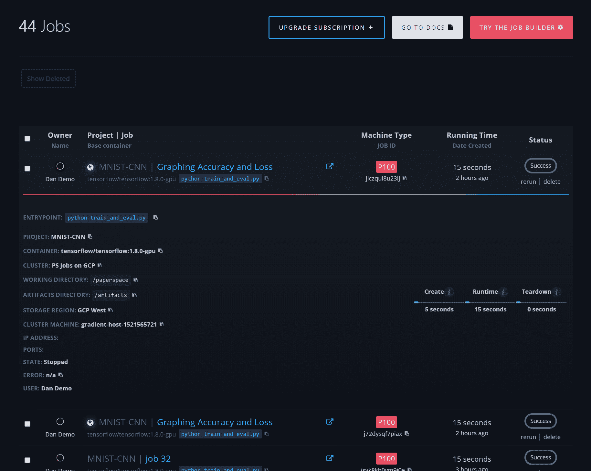
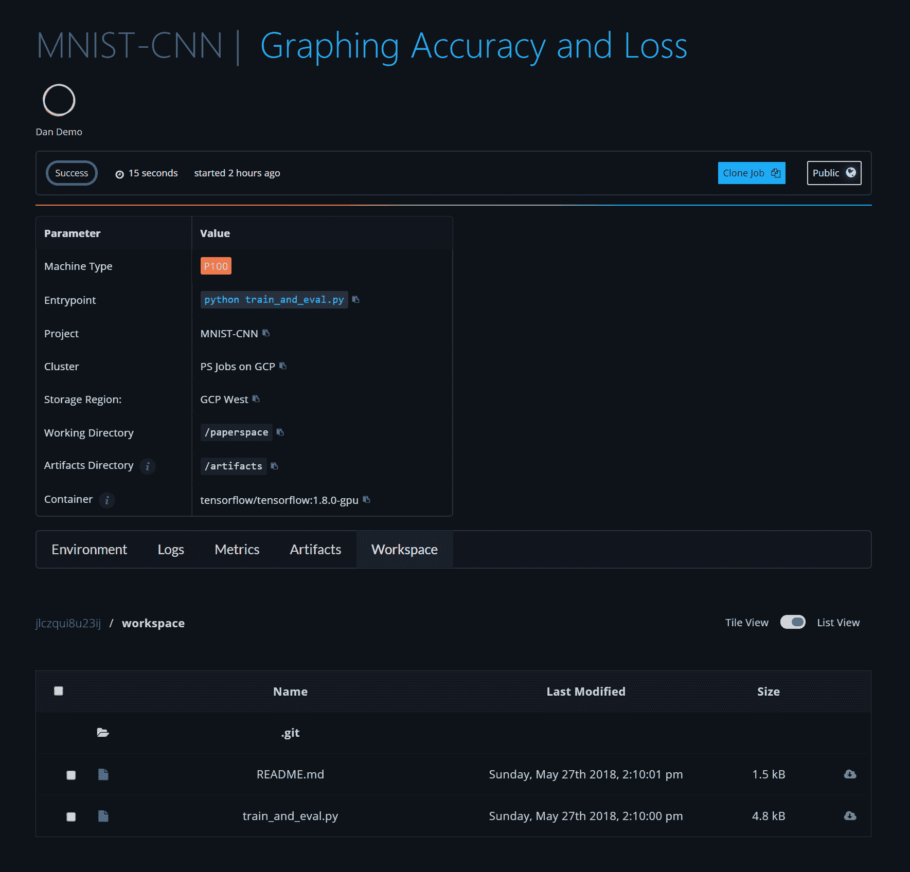
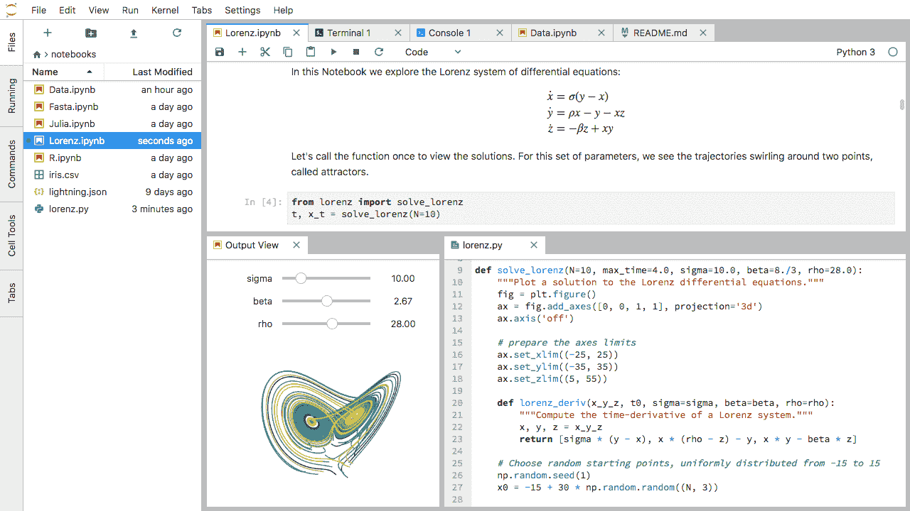
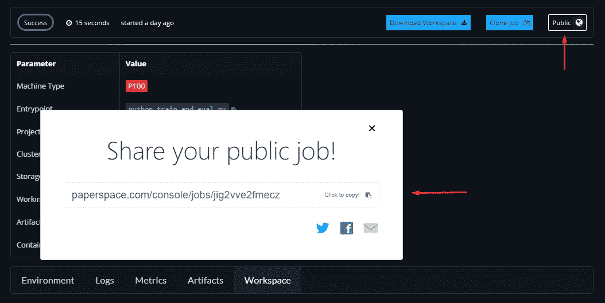
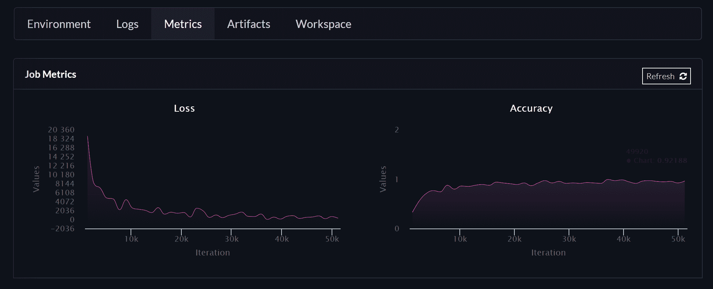

# 渐变有什么新的？

> 原文：<https://blog.paperspace.com/whats-new-in-gradient-june-2018/>

我们一直在努力将 [Gradient](http://paperspace.com/gradient) 开发成一个强大且可扩展的深度学习平台。以下是我们最近添加的一些内容的综述:

产品发布说明可以在[这里找到](https://paperspace.zendesk.com/hc/en-us/articles/217560197-Release-Notes)，API 发布说明可以在[这里找到](https://github.com/Paperspace/paperspace-node/blob/master/releasenotes.md)

### 新工作页面

除了主作业页面上的摘要视图之外，我们还添加了一个独立页面，其中包含各种新功能。

汇总视图



要深入查看新职务详细信息页面，请单击职务名称旁边的箭头图标。Job details 页面包括关于您的作业的所有内容:参数、环境、日志、指标和代码都在一个地方。

新职务详细信息页面



* * *

### JupyterLab

JupyterLab 是 Jupyter 的下一代基于网络的用户界面。这个新版本包括多个选项卡式文档，一个改进的终端，可定制的快捷方式等。这里有一个[概述](https://jupyterlab.readthedocs.io/en/latest/getting_started/overview.html)。我们添加了 ***数据科学堆栈*** 和 ***R 堆栈*** 容器作为[基础容器](https://paperspace.zendesk.com/hc/en-us/articles/360001597074-Base-Containers)选项。



* * *

### 公共工作

建立一个正常运行的环境可能是一项艰巨的任务。使用公共作业，您可以轻松打包您的作业并与其他人共享。只需点击右上角的按钮，将作业公开，这样任何人都可以在自己的帐户中克隆它。您可以随时将职务转换为私人职务。



这里有一个公职[的例子](https://www.paperspace.com/console/jobs/jlczqui8u23ij)

* * *

### 笔记本电脑中可访问的持久存储

Jupyter 是一个很好的数据管理环境，你现在可以用它来管理你的[永久存储器](https://paperspace.zendesk.com/hc/en-us/articles/360001468133-Persistent-Storage)。永久存储将自动安装到您帐户中的每个笔记本(和作业)上。只要旋转笔记本，你就会看到`/storage`目录。在这里你可以轻松上传数据，移动文件等。

* * *

### 作业生成器用户界面

刚接触渐变或者不喜欢使用命令行？尝试新的图形化作业构建器，这是一个逐步构建作业的用户界面。顶部的部分包括几个示例项目，只需点击几下就可以运行。更多文档可在[这里](https://paperspace.zendesk.com/hc/en-us/articles/360003092654-Job-Builder-Overview)找到


* * *

### 工作指标

了解你正在训练的模型的性能是很重要的。准确性、损失和验证等指标通常用于此目的。我们在 Jobs 页面中添加了一个部分来绘制这些指标。由于培训可能需要数小时、数天甚至数周时间，因此实时跟踪指标非常重要。只需在您的代码中添加几行代码，我们将解析输出并将它们转换成指标。一旦模型开始训练，图表将开始绘制，并在工作完成后可用于参考/比较。

```
# Initializing charts
print('{"chart": "loss", "axis": "Iteration"}')
print('{"chart": "accuracy", "axis": "Iteration"}')

# Graph Loss and Accuracy
print('{"chart": "loss", "x": <value>, "y": <value>}')
print('{"chart": "accuracy", "x": <value>, "y": <value>}') 
```

下面是一个典型输出的例子:


指南和示例代码可以在这里找到
公共职位[示例](https://www.paperspace.com/console/jobs/jlczqui8u23ij)