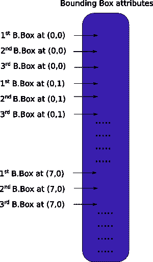
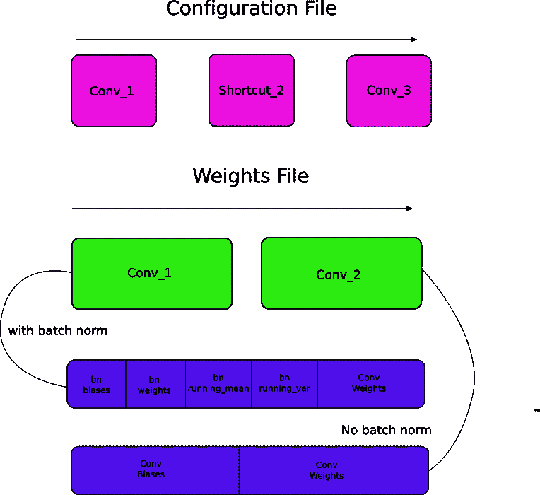

# 如何在 PyTorch 中从头开始实现 YOLO (v3)对象检测器:第 3 部分

> 原文：<https://blog.paperspace.com/how-to-implement-a-yolo-v3-object-detector-from-scratch-in-pytorch-part-3/>

图片来源:凯罗尔·马杰克。查看他的 YOLO v3 实时检测视频[这里](https://www.youtube.com/watch?v=8jfscFuP9k)

这是从头开始实现 YOLO v3 检测器教程的第 3 部分。在最后一部分中，我们实现了 YOLO 架构中使用的层，在这一部分中，我们将在 PyTorch 中实现 YOLO 的网络架构，这样我们就可以在给定图像的情况下产生一个**输出**。
我们的目标是设计网络的前向通路。

本教程的代码旨在运行在 Python 3.5 和 PyTorch **0.4** 上。在这个 [Github repo](https://github.com/ayooshkathuria/YOLO_v3_tutorial_from_scratch) 可以找到它的全部内容。

本教程分为 5 个部分:

1.  第一部分:了解 YOLO 是如何运作的

2.  [第 2 部分:创建网络架构的各层](https://blog.paperspace.com/how-to-implement-a-yolo-v3-object-detector-from-scratch-in-pytorch-part-2/)

3.  第 3 部分(这一部分):实现网络的前向传递

4.  第 4 部分:[目标置信度阈值和非最大值抑制](https://blog.paperspace.com/how-to-implement-a-yolo-v3-object-detector-from-scratch-in-pytorch-part-4/)

5.  [第五部分:设计输入和输出管道](https://blog.paperspace.com/how-to-implement-a-yolo-v3-object-detector-from-scratch-in-pytorch-part-5/)

#### 先决条件

*   教程的第 1 部分和第 2 部分。
*   PyTorch 的基本工作知识，包括如何使用`nn.Module`、`nn.Sequential`和`torch.nn.parameter`类创建定制架构。
*   在 PyTorch 中处理图像

#### 定义网络

正如我之前指出的，我们使用`nn.Module`类在 PyTorch 中构建定制架构。让我们为检测器定义一个网络。在`darknet.py`文件中，我们添加了下面的类。

```
class Darknet(nn.Module):
    def __init__(self, cfgfile):
        super(Darknet, self).__init__()
        self.blocks = parse_cfg(cfgfile)
        self.net_info, self.module_list = create_modules(self.blocks) 
```

在这里，我们对`nn.Module`类进行了子类化，并将我们的类命名为`Darknet`。我们用成员、`blocks`、`net_info`和`module_list`初始化网络。

#### 实现网络的前向传递

网络的前向传递是通过重写`nn.Module`类的`forward`方法来实现的。

`forward`有两个目的。第一，计算输出，第二，以更容易处理的方式变换输出检测特征图(例如变换它们，使得跨多个尺度的检测图可以连接，否则这是不可能的，因为它们具有不同的维度)。

```
def forward(self, x, CUDA):
    modules = self.blocks[1:]
    outputs = {}   #We cache the outputs for the route layer 
```

`forward`接受三个参数，`self`，输入`x`和`CUDA`，如果为真，将使用 GPU 加速向前传递。

在这里，我们迭代`self.blocks[1:]`而不是`self.blocks`，因为`self.blocks`的第一个元素是一个`net`块，它不是向前传递的一部分。

由于*路线*和*快捷方式*层需要前一层的输出地图，我们在 dict `outputs`中缓存每一层的输出特征地图。关键字是层的索引，值是特征图

与使用`create_modules`函数的情况一样，我们现在迭代包含网络模块的`module_list`。这里要注意的是，模块是按照它们在配置文件中出现的顺序添加的。这意味着，我们可以简单地通过每个模块运行我们的输入来获得我们的输出。

```
write = 0     #This is explained a bit later
for i, module in enumerate(modules):        
    module_type = (module["type"]) 
```

###### 卷积和上采样层

如果模块是卷积或上采样模块，这就是正向传递的工作方式。

```
 if module_type == "convolutional" or module_type == "upsample":
            x = self.module_list[i](x) 
```

###### 路径层/快捷方式层

如果您查看*路由*层的代码，我们必须考虑两种情况(如第 2 部分所述)。对于我们必须连接两个特征图的情况，我们使用第二个参数为 1 的`torch.cat`函数。这是因为我们想要沿着深度连接特征图。(在 PyTorch 中，卷积层的输入和输出具有格式 B X C X H X W。深度对应于信道维度)。

```
 elif module_type == "route":
            layers = module["layers"]
            layers = [int(a) for a in layers]

            if (layers[0]) > 0:
                layers[0] = layers[0] - i

            if len(layers) == 1:
                x = outputs[i + (layers[0])]

            else:
                if (layers[1]) > 0:
                    layers[1] = layers[1] - i

                map1 = outputs[i + layers[0]]
                map2 = outputs[i + layers[1]]

                x = torch.cat((map1, map2), 1)

        elif  module_type == "shortcut":
            from_ = int(module["from"])
            x = outputs[i-1] + outputs[i+from_] 
```

###### YOLO(探测层)

YOLO 的输出是一个卷积要素地图，它包含沿要素地图深度的边界框属性。由像元预测的属性边界框一个接一个地堆叠在一起。因此，如果您必须访问(5，6)处单元格的第二个边界，那么您必须通过`map[5,6, (5+C): 2*(5+C)]`对其进行索引。这种形式对于输出处理来说非常不方便，例如通过对象置信度进行阈值处理、向中心添加网格偏移、应用锚点等。

另一个问题是，由于检测发生在三个尺度上，预测图的维度将是不同的。虽然三个特征图的尺寸不同，但是对它们进行的输出处理操作是相似的。如果必须在单个张量上进行这些操作，而不是在三个独立的张量上，那就太好了。

为了解决这些问题，我们引入了函数`predict_transform`

#### 转换输出

函数`predict_transform`位于文件`util.py`中，当我们在`Darknet`类的`forward`中使用它时，我们将导入该函数。

将导入添加到`util.py`的顶部

```
from __future__ import division

import torch 
import torch.nn as nn
import torch.nn.functional as F 
from torch.autograd import Variable
import numpy as np
import cv2 
```

`predict_transform`接受 5 个参数；*预测*(我们的输出)、 *inp_dim* (输入图像尺寸)、*锚点*、 *num_classes* ，以及一个可选的 *CUDA* 标志

```
def predict_transform(prediction, inp_dim, anchors, num_classes, CUDA = True): 
```

`predict_transform`函数获取一个检测特征图，并将其转换成一个二维张量，其中张量的每一行对应于一个边界框的属性，顺序如下。



下面是完成上述转换的代码。

```
 batch_size = prediction.size(0)
    stride =  inp_dim // prediction.size(2)
    grid_size = inp_dim // stride
    bbox_attrs = 5 + num_classes
    num_anchors = len(anchors)

    prediction = prediction.view(batch_size, bbox_attrs*num_anchors, grid_size*grid_size)
    prediction = prediction.transpose(1,2).contiguous()
    prediction = prediction.view(batch_size, grid_size*grid_size*num_anchors, bbox_attrs) 
```

锚的尺寸与`net`块的`height`和`width`属性一致。这些属性描述了输入图像的尺寸，它比检测图大(大了*步距*倍)。因此，我们必须根据检测特征图的步幅来划分锚点。

```
 anchors = [(a[0]/stride, a[1]/stride) for a in anchors] 
```

现在，我们需要根据我们在第 1 部分中讨论的等式来转换我们的输出。

Sigmoid，y 坐标和客观性分数。

```
 #Sigmoid the  centre_X, centre_Y. and object confidencce
    prediction[:,:,0] = torch.sigmoid(prediction[:,:,0])
    prediction[:,:,1] = torch.sigmoid(prediction[:,:,1])
    prediction[:,:,4] = torch.sigmoid(prediction[:,:,4]) 
```

将网格偏移量添加到中心坐标预测中。

```
 #Add the center offsets
    grid = np.arange(grid_size)
    a,b = np.meshgrid(grid, grid)

    x_offset = torch.FloatTensor(a).view(-1,1)
    y_offset = torch.FloatTensor(b).view(-1,1)

    if CUDA:
        x_offset = x_offset.cuda()
        y_offset = y_offset.cuda()

    x_y_offset = torch.cat((x_offset, y_offset), 1).repeat(1,num_anchors).view(-1,2).unsqueeze(0)

    prediction[:,:,:2] += x_y_offset 
```

将锚点应用于边界框的尺寸。

```
 #log space transform height and the width
    anchors = torch.FloatTensor(anchors)

    if CUDA:
        anchors = anchors.cuda()

    anchors = anchors.repeat(grid_size*grid_size, 1).unsqueeze(0)
    prediction[:,:,2:4] = torch.exp(prediction[:,:,2:4])*anchors 
```

将 sigmoid 激活应用于课程分数

```
 prediction[:,:,5: 5 + num_classes] = torch.sigmoid((prediction[:,:, 5 : 5 + num_classes])) 
```

这里我们要做的最后一件事是将检测图的大小调整为输入图像的大小。这里的边界框属性的大小是根据特征图确定的(比如 13 x 13)。如果输入图像是 416 x 416，我们将属性乘以 32，即变量*的步幅*。

```
prediction[:,:,:4] *= stride 
```

这就结束了循环体。

在函数结束时返回预测值。

```
 return prediction 
```

#### 重新访问检测层

既然我们已经转换了输出张量，我们现在可以将三个不同尺度的检测图连接成一个大张量。请注意，这在我们的转换之前是不可能的，因为我们不能连接具有不同空间维度的特征地图。但是从现在开始，我们的输出张量仅仅作为一个表格，用边界框作为它的行，连接是非常可能的。

我们道路上的一个障碍是我们不能初始化一个空张量，然后连接一个非空的(不同形状的)张量。因此，我们延迟收集器(保存检测的张量)的初始化，直到我们获得第一个检测图，然后在我们获得后续检测时连接到它的映射。

注意函数`forward`中循环之前的`write = 0`行。`write`标志用于指示我们是否遇到了第一次检测。如果`write`为 0，表示采集器还没有初始化。如果它是 1，这意味着收集器已经初始化，我们可以将我们的检测图连接到它。

现在，我们已经用`predict_transform`函数武装了自己，我们在`forward`函数中编写处理检测特征图的代码。

在您的`darknet.py`文件的顶部，添加以下导入。

```
from util import * 
```

然后，在`forward`功能中。

```
 elif module_type == 'yolo':        

            anchors = self.module_list[i][0].anchors
            #Get the input dimensions
            inp_dim = int (self.net_info["height"])

            #Get the number of classes
            num_classes = int (module["classes"])

            #Transform 
            x = x.data
            x = predict_transform(x, inp_dim, anchors, num_classes, CUDA)
            if not write:              #if no collector has been intialised. 
                detections = x
                write = 1

            else:       
                detections = torch.cat((detections, x), 1)

        outputs[i] = x 
```

现在，只需返回检测结果。

```
 return detections 
```

#### 测试向前传球

这是一个创建虚拟输入的函数。我们将把这些信息传递给我们的网络。在我们编写这个函数之前，将这个[图像](https://github.com/ayooshkathuria/pytorch-yolo-v3/raw/master/dog-cycle-car.png)保存到您的工作目录中。如果你在 linux 上，那么输入。

```
wget https://github.com/ayooshkathuria/pytorch-yolo-v3/raw/master/dog-cycle-car.png 
```

现在，在`darknet.py`文件的顶部定义函数，如下所示:

```
def get_test_input():
    img = cv2.imread("dog-cycle-car.png")
    img = cv2.resize(img, (416,416))          #Resize to the input dimension
    img_ =  img[:,:,::-1].transpose((2,0,1))  # BGR -> RGB | H X W C -> C X H X W 
    img_ = img_[np.newaxis,:,:,:]/255.0       #Add a channel at 0 (for batch) | Normalise
    img_ = torch.from_numpy(img_).float()     #Convert to float
    img_ = Variable(img_)                     # Convert to Variable
    return img_ 
```

然后，我们键入以下代码:

```
 model = Darknet("cfg/yolov3.cfg")
inp = get_test_input()
pred = model(inp, torch.cuda.is_available())
print (pred) 
```

您将看到如下输出。

```
(  0  ,.,.) = 
   16.0962   17.0541   91.5104  ...     0.4336    0.4692    0.5279
   15.1363   15.2568  166.0840  ...     0.5561    0.5414    0.5318
   14.4763   18.5405  409.4371  ...     0.5908    0.5353    0.4979
               ⋱                ...             
  411.2625  412.0660    9.0127  ...     0.5054    0.4662    0.5043
  412.1762  412.4936   16.0449  ...     0.4815    0.4979    0.4582
  412.1629  411.4338   34.9027  ...     0.4306    0.5462    0.4138
[torch.FloatTensor of size 1x10647x85] 
```

这个张量的形状是`1 x 10647 x 85`。第一个维度是批量大小，简单地说就是 1，因为我们使用了单个图像。对于一批中的每个图像，我们有一个 10647 x 85 的表格。每个表格的行代表一个边界框。(4 个 bbox 属性、1 个对象分数和 80 个类别分数)

此时，我们的网络具有随机的权重，不会产生正确的输出。我们需要在网络中加载一个权重文件。为此，我们将使用官方重量文件。

#### 下载预先训练的重量

将砝码文件下载到您的检测机目录中。从[这里](https://pjreddie.com/media/files/yolov3.weights)抓取权重文件。或者如果你在 linux 上，

```
wget https://pjreddie.com/media/files/yolov3.weights 
```

#### 了解砝码文件

官方重量文件是二进制文件，包含以串行方式存储的重量。

读取重量时必须非常小心。权重只是作为浮点数存储，没有任何东西来指导我们它们属于哪一层。如果你搞砸了，没有什么可以阻止你，比如说，把一个批范数层的权重加载到一个卷积层的权重中。因为您读取的只是浮动，所以无法区分哪个权重属于哪个层。因此，我们必须了解权重是如何存储的。

首先，权重只属于两种类型的层，或者是批范数层，或者是卷积层。

这些层的权重完全按照它们在配置文件中出现的顺序存储。所以，如果一个`convolutional`后面跟着一个`shortcut`块，然后一个`shortcut`块后面跟着另一个`convolutional`块，你会期望文件包含前一个`convolutional`块的权重，然后是后一个块的权重。

当批次标准层出现在`convolutional`块中时，不存在偏差。然而，当没有批规范层时，偏差"权重"必须从文件中读取。

下图总结了权重如何存储权重。



#### 装船重量

让我们写一个函数加载权重。它将是`Darknet`类的成员函数。它需要一个参数，而不是权重文件的路径`self`。

```
def load_weights(self, weightfile): 
```

权重文件的前 160 个字节存储 5 个`int32`值，这些值构成了文件的标题。

```
 #Open the weights file
    fp = open(weightfile, "rb")

    #The first 5 values are header information 
    # 1\. Major version number
    # 2\. Minor Version Number
    # 3\. Subversion number 
    # 4,5\. Images seen by the network (during training)
    header = np.fromfile(fp, dtype = np.int32, count = 5)
    self.header = torch.from_numpy(header)
    self.seen = self.header[3] 
```

其余的位现在按照上述顺序表示权重。权重存储为`float32`或 32 位浮点数。让我们在一个`np.ndarray`中装载其余的重量。

```
 weights = np.fromfile(fp, dtype = np.float32) 
```

现在，我们迭代权重文件，并将权重加载到网络的模块中。

```
 ptr = 0
    for i in range(len(self.module_list)):
        module_type = self.blocks[i + 1]["type"]

        #If module_type is convolutional load weights
        #Otherwise ignore. 
```

进入循环，我们首先检查`convolutional`块的`batch_normalise`是否为真。在此基础上，我们加载重量。

```
 if module_type == "convolutional":
            model = self.module_list[i]
            try:
                batch_normalize = int(self.blocks[i+1]["batch_normalize"])
            except:
                batch_normalize = 0

            conv = model[0] 
```

我们保留一个名为`ptr`的变量来跟踪我们在权重数组中的位置。现在，如果`batch_normalize`为真，我们如下加载权重。

```
 if (batch_normalize):
            bn = model[1]

            #Get the number of weights of Batch Norm Layer
            num_bn_biases = bn.bias.numel()

            #Load the weights
            bn_biases = torch.from_numpy(weights[ptr:ptr + num_bn_biases])
            ptr += num_bn_biases

            bn_weights = torch.from_numpy(weights[ptr: ptr + num_bn_biases])
            ptr  += num_bn_biases

            bn_running_mean = torch.from_numpy(weights[ptr: ptr + num_bn_biases])
            ptr  += num_bn_biases

            bn_running_var = torch.from_numpy(weights[ptr: ptr + num_bn_biases])
            ptr  += num_bn_biases

            #Cast the loaded weights into dims of model weights. 
            bn_biases = bn_biases.view_as(bn.bias.data)
            bn_weights = bn_weights.view_as(bn.weight.data)
            bn_running_mean = bn_running_mean.view_as(bn.running_mean)
            bn_running_var = bn_running_var.view_as(bn.running_var)

            #Copy the data to model
            bn.bias.data.copy_(bn_biases)
            bn.weight.data.copy_(bn_weights)
            bn.running_mean.copy_(bn_running_mean)
            bn.running_var.copy_(bn_running_var) 
```

如果 batch_norm 不为真，只需加载卷积层的偏差。

```
 else:
            #Number of biases
            num_biases = conv.bias.numel()

            #Load the weights
            conv_biases = torch.from_numpy(weights[ptr: ptr + num_biases])
            ptr = ptr + num_biases

            #reshape the loaded weights according to the dims of the model weights
            conv_biases = conv_biases.view_as(conv.bias.data)

            #Finally copy the data
            conv.bias.data.copy_(conv_biases) 
```

最后，我们加载卷积层的权重。

```
#Let us load the weights for the Convolutional layers
num_weights = conv.weight.numel()

#Do the same as above for weights
conv_weights = torch.from_numpy(weights[ptr:ptr+num_weights])
ptr = ptr + num_weights

conv_weights = conv_weights.view_as(conv.weight.data)
conv.weight.data.copy_(conv_weights) 
```

我们已经完成了这个函数，现在你可以通过调用 darknet 对象上的`load_weights`函数在你的`Darknet`对象中加载权重。

```
model = Darknet("cfg/yolov3.cfg")
model.load_weights("yolov3.weights") 
```

这就是这一部分的全部内容，随着模型的建立和权重的加载，我们终于可以开始检测物体了。在下一个[部分](https://blog.paperspace.com/how-to-implement-a-yolo-v3-object-detector-from-scratch-in-pytorch-part-4/)中，我们将介绍使用目标置信度阈值和非最大值抑制来产生我们的最终检测集。

#### 进一步阅读

1.  [PyTorch 教程](http://pytorch.org/tutorials/beginner/deep_learning_60min_blitz.html)
2.  [用 NumPy 读取二进制文件](https://docs.scipy.org/doc/numpy-1.13.0/reference/generated/numpy.fromfile.html)
3.  [nn。模块，nn。参数类别](http://pytorch.org/tutorials/beginner/blitz/neural_networks_tutorial.html#define-the-network)

Ayoosh Kathuria 目前是印度国防研究与发展组织的实习生，他致力于改进粒状视频中的物体检测。当他不工作的时候，他不是在睡觉就是在用吉他弹奏平克·弗洛伊德。你可以在 [LinkedIn](https://www.linkedin.com/in/ayoosh-kathuria-44a319132/) 上和他联系，或者在[GitHub](https://github.com/ayooshkathuria)T5 上看看他做了些什么