# Paperspace 渐变社区笔记本指南

> 原文：<https://blog.paperspace.com/gradient-community-notebook-guide/>

[2021 年 12 月 2 日更新:本文包含关于梯度实验的信息。实验现已被弃用，渐变工作流已经取代了它的功能。[请参见工作流程文档了解更多信息](https://docs.paperspace.com/gradient/explore-train-deploy/workflows)。]

[渐变社区笔记本](https://gradient.paperspace.com/free-gpu)允许用户在免费的 GPU 上创建、运行和共享 Jupyter 笔记本。在这篇文章中，将介绍渐变社区笔记本，并详细讨论入门步骤，因此您可以在 GPU 或 CPU 上轻松创建一个免费的 Jupyter 笔记本，并与公众分享。

我们将涵盖:

*   渐变入门
*   渐变社区笔记本
*   选择容器
*   选择机器
*   笔记本选项
*   管理笔记本
*   第一次打开你的笔记本
*   左侧工具栏
*   文件浏览器
*   共享文件和文件夹
*   共享笔记本
*   上传和下载文件
*   读取和写入文件
*   导出笔记本

让我们开始吧。

## **渐变入门**

Gradient 是 Paperspace 用于构建机器学习(ML)和深度学习(DL)项目的平台。它帮助您完成构建和部署 ML/DL 模型的整个过程。笔记本电脑配有预配置环境，可消除任何工具问题。只需点击几下鼠标，您就可以启动并运行 Keras、TensorFlow、PyTorch 和 Scikit-Learn 等流行的库。

[上手渐变](https://docs.paperspace.com/gradient/get-started/quick-start)就是这么简单。你需要做的就是创建一个 Paperspace 账户(你可以在这里[做](https://www.paperspace.com/account/signup))。您有三种不同的注册选项:

1.  您的 Google 帐户
2.  您的 GitHub 帐户
3.  常规电子邮件注册

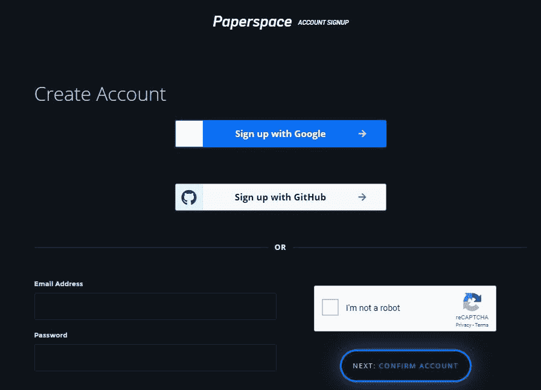

登录后，您将进入控制台页面。入门产品主要有两种:[渐变](https://gradient.paperspace.com/)和[核心](https://www.paperspace.com/core)。在这篇文章中，我们关注的是渐变。该产品提供了构建 ML/DL 项目的工具，从探索到模型部署。

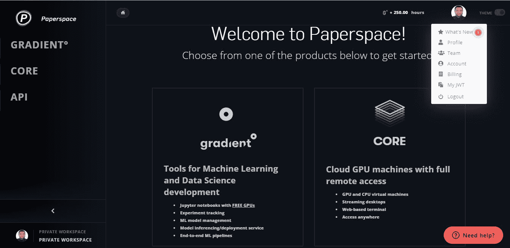

在开始使用 Gradient 及其免费服务之前，让我们检查一下您的个人资料。在控制台页面的右上角，您可以找到您的个人资料徽标(最初设置为默认图标)。将鼠标悬停在图标上，点击`Profile`选项。在那里你可以看到你的账户的基本信息。下图显示了我的个人资料页面。

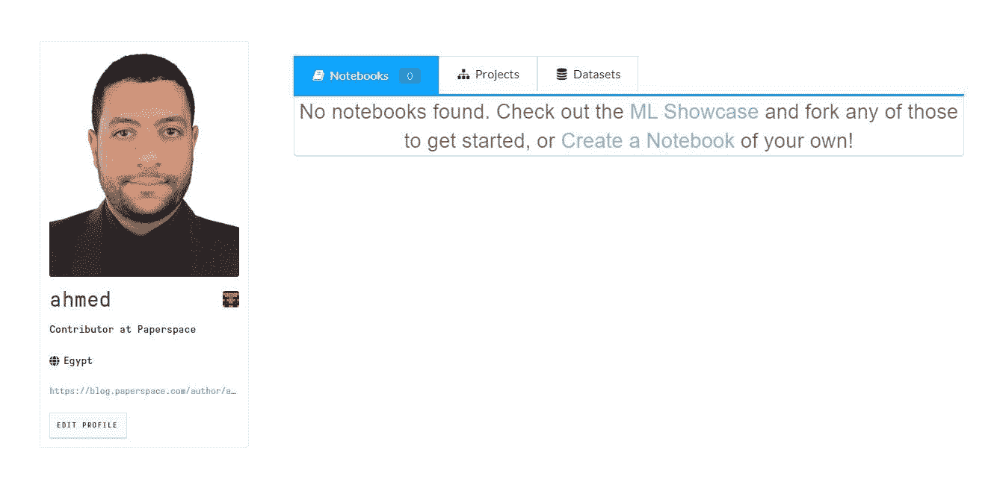

在页面的左下角有一个`EDIT PROFILE`按钮，你可以点击它来输入你的详细信息。您也可以单击个人资料照片进行更改。您的`User Handle`将用于您的账户页面 URL。我使用了`ahmed`，因此我的 Paperspace 配置文件 URL 是 https://www.paperspace.com/ahmed。最后，点击`SAVE`按钮保存您的详细信息。

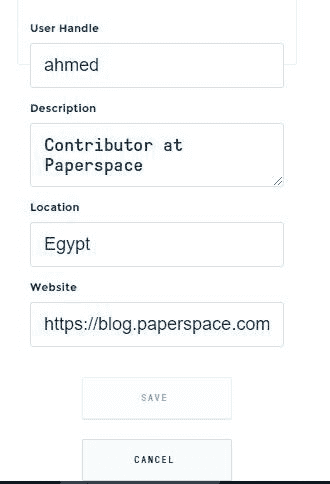

现在让我们回到控制台页面。在页面的右上角有一个链接，可以将您转到控制台。你总能在 https://www.paperspace.com/console 找到控制台页面。

本帖将详细讨论如何使用[渐变社区笔记本](https://gradient.paperspace.com/free-gpu)，这将在下一节介绍。

## **渐变社区笔记本**

2019 年 10 月，Paperspace 推出了测试版的[渐变社区笔记本](https://gradient.paperspace.com/free-gpu)。这些允许你创建运行在自由 CPU 和 GPU 实例上的 Jupyter 笔记本。创建帐户后(根据上一节中的说明)，您可以登录并开始免费创建笔记本。

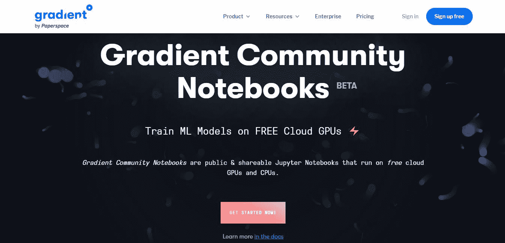

从 Paperspace [控制台页面](https://www.paperspace.com/console)点击左侧导航栏上的`Gradient`。然后你将被引导至[梯度控制台](https://www.paperspace.com/console/gradient)。建议的第一步是:

1.  **[运行](https://www.paperspace.com/console/notebooks/create)** :创建并运行一个`Jupyter Notebook`。
2.  **[训练](https://www.paperspace.com/console/projects)** :创建一个`Gradient Project`来训练你的模型。
3.  **[部署](https://www.paperspace.com/console/deployments)** :使用`Gradient Deployments`将模型推向生产。

根据[文档](https://docs.paperspace.com/gradient/projects/about)，梯度项目定义如下:

> 渐变项目是您或您的团队运行实验和作业、存储模型等工件以及管理部署(已部署的模型)的工作空间。

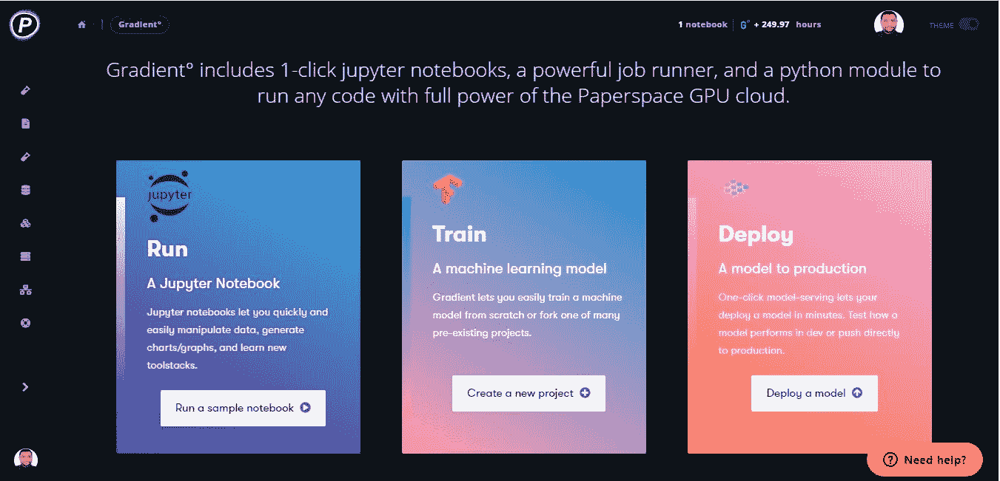

因为我们对创建 Jupyter 笔记本感兴趣，我们将点击 **[运行 Jupyter 笔记本](https://www.paperspace.com/console/notebooks/create)** 选项，这将把您重定向到[这一页](https://www.paperspace.com/console/notebooks/create)。当你将鼠标悬停在左边工具栏上的**渐变**上时，你也可以点击**笔记本**。

在笔记本页面，我们可以找到创建 Jupyter 笔记本的三个步骤:

1.  选择容器
2.  选择机器
3.  笔记本选项

我们将在接下来的 3 个部分中讨论这 3 个步骤。

## **选择容器**

Paperspace Gradient 在一个“容器”中运行 Jupyter 笔记本，容器是一个准备好运行笔记本所需的所有依赖项的环境。总共有 **18** 个预配置的容器可用，你也可以使用一个自定义的。访问[本页](https://docs.paperspace.com/gradient/notebooks/notebook-containers#base-containers)了解更多关于支持的容器的信息。

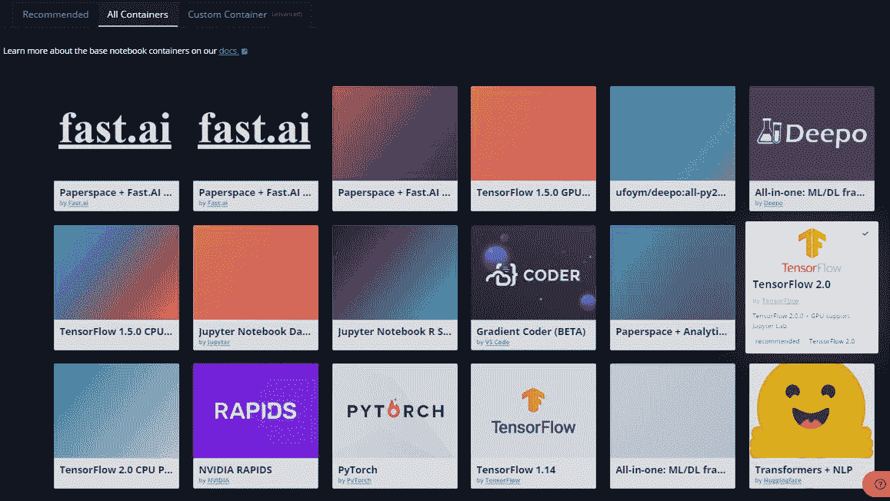

在这 18 个容器中，有 7 个因受欢迎而被推荐。这些是:

1.  [Fast.ai](https://github.com/Paperspace/fastai-docker)
2.  [多功能一体机](https://github.com/ufoym/deepo)
3.  [TensorFlow 2.0](https://hub.docker.com/r/tensorflow/tensorflow)
4.  [英伟达急流](https://hub.docker.com/r/rapidsai/rapidsai/tags)
5.  [指针](https://hub.docker.com/r/pytorch/pytorch)
6.  [TensorFlow 1.14](https://hub.docker.com/r/tensorflow/tensorflow)
7.  [变形金刚+ NLP](https://blog.paperspace.com/introducing-paperspace-hugging-face/)

如果您对使用或构建自定义容器感兴趣，请查看本指南了解更多信息。

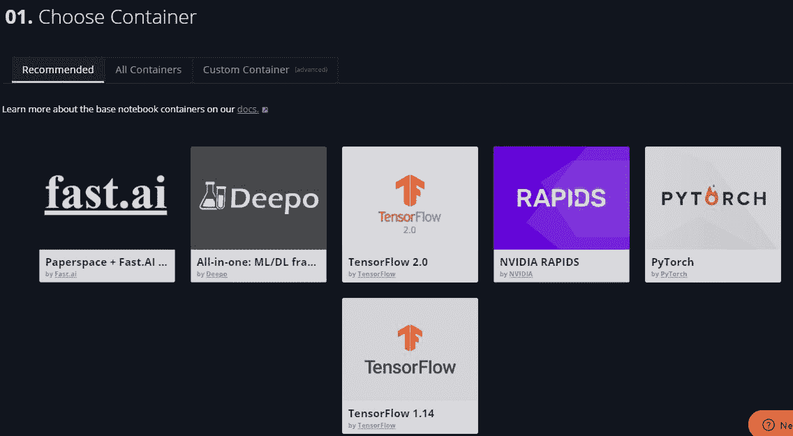

“All-in-one”是一个很好的开始容器，因为它预先安装了所有主要机器学习/深度学习框架的所有依赖项。选择容器后，我们需要选择一台机器。

## **选择机器**

下图显示了您可以从中选择运行笔记本的计算机的列表。总共有 16 个**实例可供选择，它们的功耗和成本各不相同。有关可用实例的更多信息，请查看[页面](https://docs.paperspace.com/gradient/instances/instance-types)。**

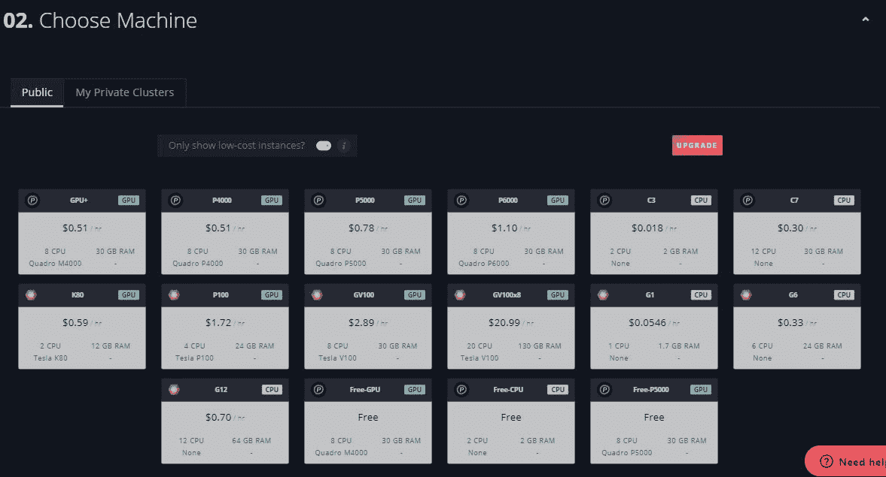

在这 16 台机器中，有 3 个可用的免费实例。这些是:

1.  **自由 CPU** ，提供 2 个 vCPU 和 2gb RAM
2.  **Free-GPU+** ，提供一个 **NVIDIA M4000 GPU** ，带 8 个 vCPUs 和 30gb RAM
3.  **Free-P5000** ，提供一个 **NVIDIA P5000 GPU** ，带 8 个 vCPUs 和 30gb RAM

免费实例还包括 5 GB 的持久存储空间。自由实例共有三个限制:

1.  每次会话 6 小时后，笔记本电脑将自动关机
2.  一次只能运行 1 台笔记本电脑
3.  该笔记本将被设置为公共

尽管笔记本电脑将在 6 小时后关闭，但您可以启动的会话数量没有限制。您可以在 6 小时后开始新的会话。为了防止在达到 6 小时限制时丢失正在运行的进程所取得的进展，您可以将进程(如果可能)拆分到不同的会话中。您也可以在 6 小时的会话结束前将您的进度保存到永久存储器中，然后在下一个会话中再次加载它以从您停止的地方继续。

如果您的流程必须不间断地执行 6 个小时以上，那么您可能应该升级您的订阅。

现在，选择你感兴趣的免费实例(关于免费实例的更多信息，请查看[这一页](https://docs.paperspace.com/gradient/instances/free-instances))。现在我们来看看创建渐变社区笔记本的第三步，也是最后一步:设置笔记本选项。

## **笔记本选项**

创建笔记本的最后一步是根据下图指定一些选项。这两个选项是:

1.  自动关机限制
2.  笔记本是公共的还是私人的

这两个选项对于自由实例是不可编辑的，如下图所示。在自由实例上运行的笔记本将始终设置为公共，并在 6 小时后自动关闭。对于付费实例，您可以自由地更改两者。

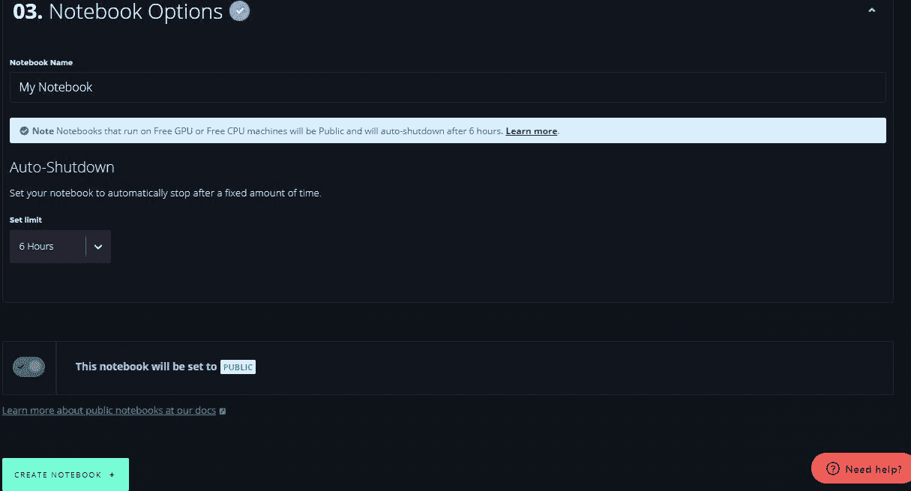

现在只需点击页面左下角的`CREATE NOTEBOOK`按钮即可创建您的笔记本。下一节将讨论如何使用它。

## **管理笔记本**

点击`CREATE NOTEBOOK`按钮后，您将被引导至[笔记本页面](https://www.paperspace.com/console/notebooks)，在这里您可以管理您的笔记本。在设置过程中，笔记本会处于`Pending`状态几秒钟。这将变成下面显示的`Running`阶段，这表明你可以访问你的笔记本。在此页面中，您还可以看到笔记本的以下详细信息:

*   笔记本所有者姓名。
*   笔记本名称。笔记本会被分配一个默认名称，即`My Notebook`，但是您可以点击它并将其更改为另一个名称。
*   容器名称。在这种情况下，选择的容器是`TensorFlow 2.0`容器。
*   在`Choose Machine`步骤中选择的机器类型。在这种情况下，我选择了提供 **NVIDIA M4000 GPU** 的**免费 GPU+** 机器。
*   笔记本 ID，直接位于机器类型后面。这种情况下，ID 为 **nlc7r4dn** 。
*   笔记本的创建日期和运行时间。
*   状态。目前这应该是`Running`。其他潜在的地位是`Shutting down`或`Stopped`。
*   多个动作:`OPEN`、`SHARE`、`STOP`等。

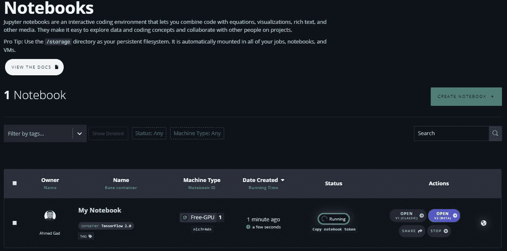

当笔记本的**状态**为**运行**时，你可以在它的正下方找到**复制笔记本令牌**的链接。单击它将复制与笔记本相关联的令牌。下面是一个令牌的例子:`2ac47522e520429189b9ba572cbd5e1582b4b3942e138c02`。此令牌用于将相关存储中的文件和文件夹共享链接到笔记本。因此，不公开它是很重要的。

在操作中，您可以点击`SHARE`按钮来共享您的笔记本。这将弹出一个窗口，如下所示。在窗口底部，你可以点击链接复制笔记本的公共 URL，在本例中是[https://www.paperspace.com/ahmed/notebook/pr1qzg6wz](https://www.paperspace.com/ahmed/notebook/pr1qzg6wz)。由于**公开**，任何有链接的人都可以查看笔记本，甚至不需要创建一个 Paperspace 账户。只要访问它的链接，并享受它！有关查看笔记本的更多信息，请访问[本页](https://docs.paperspace.com/gradient/notebooks/public-notebooks)。

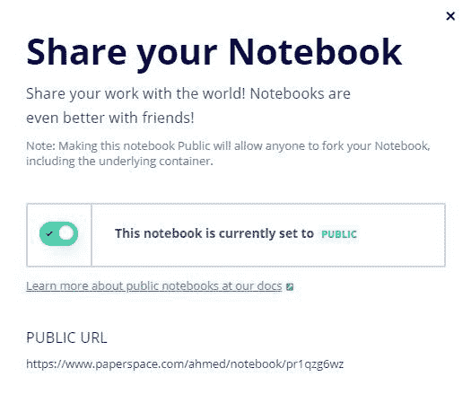

从操作中，您也可以单击`STOP`按钮来停止笔记本。笔记本状态将从`Running`变为`Stopped`，如下图所示。停止后，会出现一些附加动作:`START`、`FORK`、`DELETE`。因此，当笔记本状态为`Running`时，您不能派生或删除笔记本。


您可以点击`START`按钮运行笔记本。点击此按钮后，将出现一个新窗口，您可以在其中选择或更改以下内容:

1.  **笔记本名称**
2.  **实例类型**
3.  **自动关机限制**(选择自由实例时不能更改)

在窗口底部，只需点击`START NOTEBOOK`按钮即可启动笔记本。在笔记本状态变为`Running`后，你可以在**经典**或者**测试**版本中打开它。既然您的 Jupyter 笔记本已经启动并运行，接下来的部分将探索您可以在这个环境中做什么，以及一些附加的特性。

## **第一次打开笔记本**

下图是第一次在测试版中打开笔记本后的结果。因为这是你第一次打开笔记本，一个**启动器**会打开，询问你是否要打开笔记本、控制台、终端等等。在这种情况下，我们对创建 Python 笔记本感兴趣，因此选择了第一个选项。请注意，仅支持 Python 3。

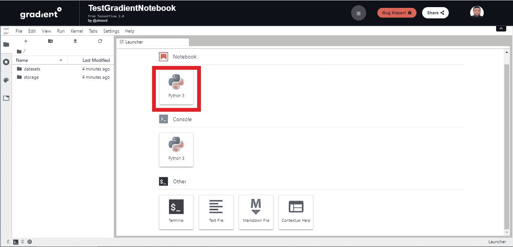

下图显示了笔记本创建后的结果。默认情况下，它被命名为`Untitled.ipynb`。

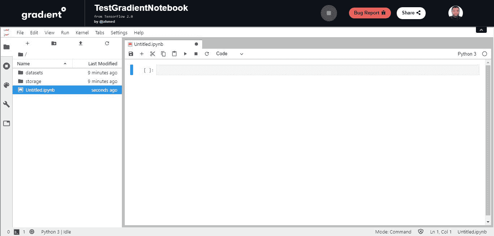

在下一部分，我们将讨论工具栏，你可以在上面的图片左侧看到。

## **工具栏**

在上图主窗口的最左侧，您可以找到 5 个图标，分别表示以下内容(从上到下):

1.  **文件浏览器**:查看存储文件和文件夹。
2.  **运行终端&内核**:查看和关闭 Python 笔记本和终端。
3.  **命令**:创建和管理笔记本的命令列表。例如，将笔记本导出为 PDF 或 markdown、关闭笔记本、更改字体大小、清除输出等等。
4.  **笔记本工具**:打开笔记本时出现此图标。
5.  **打开标签页**:查看当前打开的笔记本列表。

您可以轻松地将鼠标悬停在图标上来查看其名称。

通过点击这些图标中的任何一个，其关联的窗口将从隐藏状态变为未隐藏状态，反之亦然。下一节将讨论文件浏览器。

## **文件浏览器**

**文件浏览器**可用于浏览与笔记本相关的存储器。除了你的 Jupyter 笔记本(。ipynb)文件，还有另外两个文件夹。第一个被称为**数据集**，它包含许多预加载的 ML/DL 数据集，您可以在下面看到。这为您节省了自己下载这些文件的时间和精力，并且这些存储包含在您的免费环境中。您可以轻松浏览每个子文件夹以查看其内容。

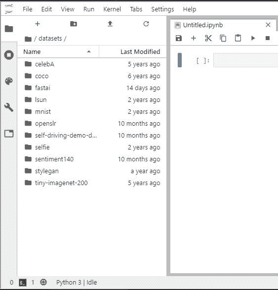

第二个文件夹是您的持久存储库。关闭笔记本后，保存您想要保留的任何内容。

在文件资源管理器的顶部有四个图标，下面突出显示。这些是(从左至右):

1.  **新启动器**:打开我们之前第一次打开笔记本时看到的启动器。可用于创建新文档。
2.  **新建文件夹**:在当前目录下新建一个文件夹。
3.  **上传文件**:上传文件到当前目录。
4.  **刷新文件列表**:刷新文件列表，查看最新变化。

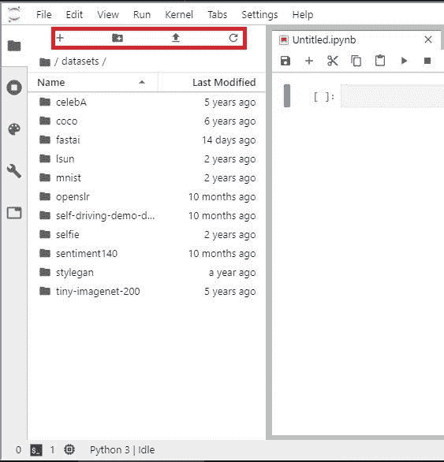

现在让我们再次打开发射器，并打开控制台。下图显示我们现在有两个活动选项卡:第一个用于笔记本，第二个用于控制台。

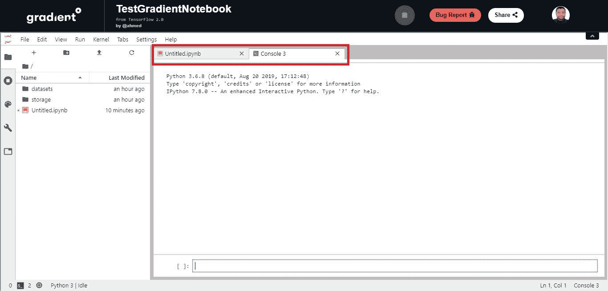

您也可以右键单击文件来打开附加选项列表。下图显示了右键单击笔记本文件后的结果。您可以找到包括打开、删除、复制、剪切、下载和重命名在内的选项。您也可以右键单击文件夹来查看更多类似的选项。

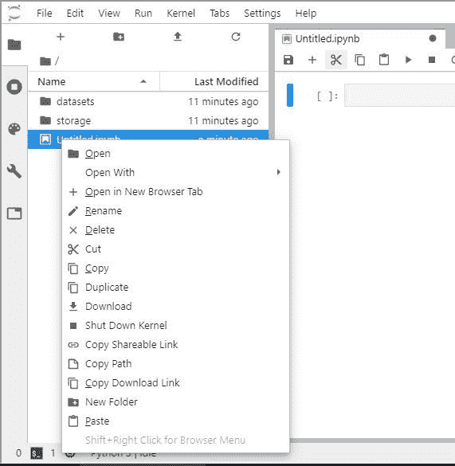

注意，在这个列表中有一个选项**复制可共享链接**。我们现在就讨论这个。

## **共享文件和文件夹**

通过点击**复制可共享链接**选项，可以获得文件的可共享链接。请注意，文件名出现在链接中，因此链接会根据当前名称而变化。

下图显示了带有该链接的人打开它的结果。如果您已经有了令牌，只需粘贴它并单击`Log in`按钮。之后，您可以查看与该链接相关联的文件或文件夹。这是超级酷，因为它使发送文件给他人非常容易！

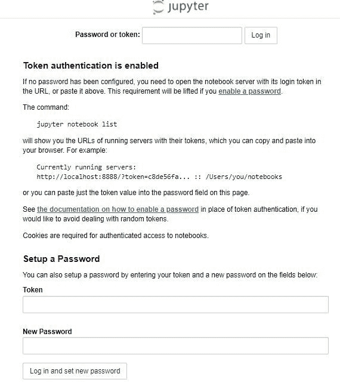

下一节将讨论如何通过公共 URL 共享笔记本。

## **分享笔记本**

与他人共享笔记本的公共 URL 将允许他们以 HTML 页面的形式查看上次停止的笔记本版本。下图是[这个笔记本网址](https://www.paperspace.com/ahmed/notebook/pr1qzg6wz)被公开访问后的结果。

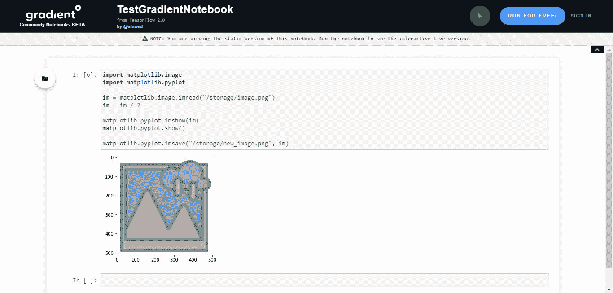

根据 [Paperspace 文档](https://docs.paperspace.com/gradient/notebooks/public-notebooks)，下面是查看当前正在运行的笔记本的工作方式。

> 当您访问社区笔记本时，您将始终看到该笔记本的最后停止版本。因此，如果笔记本电脑所有者当前正在运行它，您将会看到一条消息，内容如下:

> `Note: You are viewing the static version of this notebook. Run the notebook to see the interactive live version.`

下一节讨论将文件上传到笔记本`/storage`目录。

## **上传和下载文件**

点击**文件浏览器**窗口中的**上传文件**图标，用户可以从本地存储器中选择文件并上传到笔记本存储器。下图显示了一个图像被上传到当前目录，并在一个新的选项卡中打开。

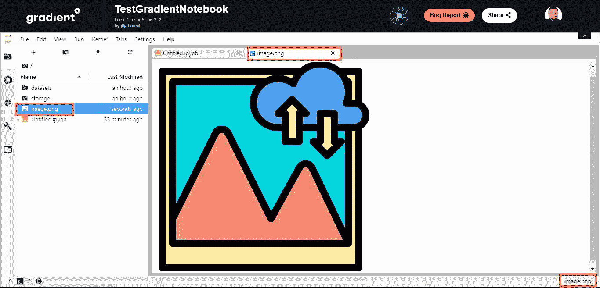

请注意，该文件上传到笔记本存储的根目录。根据 [Paperspace 文档](https://docs.paperspace.com/gradient/data/storage)，这里有一个关于`/storage`目录的说明:

> 您存储在`/storage`目录中的任何内容都可以在给定存储区域的多次实验、作业和笔记本中进行访问。

因此，我们可以将文件移动到这个目录，以便利用在不同笔记本之间共享文件的能力。您可以简单地将文件移动到`/storage`目录，方法是剪切文件并粘贴到那里，或者简单地将文件拖放到`/storage`目录中。

您也可以轻松下载文件。右键单击该文件，然后单击**下载**选项，如下图所示。

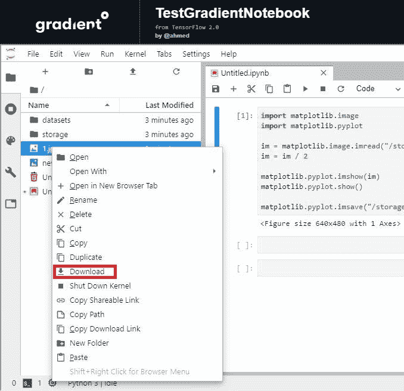

在下一节中，我们将讨论读写文件。

## **读写文件**

在本节中，我们将在笔记本单元格中编写代码，并了解如何运行它。只需打开笔记本文件并编写 Python 代码。在下图中，打印语句被输入到一个单元格中。要运行它，只需点击标有红圈的**运行**按钮图标，或者按键盘上的 **shift + enter** 。

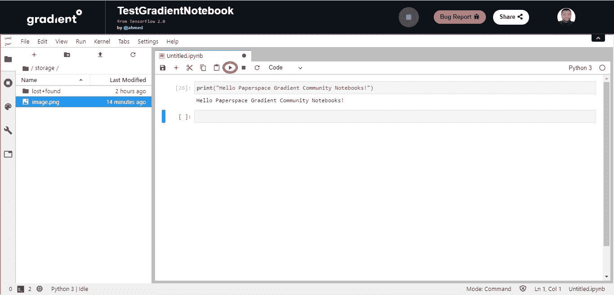

要从代码中访问一个文件，首先你需要获取它的路径。为此，只需右击该文件并点击**复制路径**选项。对于之前上传的名为`image.png`的图像文件，移动到`/storage`目录后，其路径为`/storage/image.png`。使用这个路径，我们可以根据下一个代码块读取和显示图像。

```py
import matplotlib.image
import matplotlib.pyplot

im = matplotlib.image.imread("/storage/image.png")

matplotlib.pyplot.imshow(im)
matplotlib.pyplot.show()
```

下图显示了执行前面代码的结果。

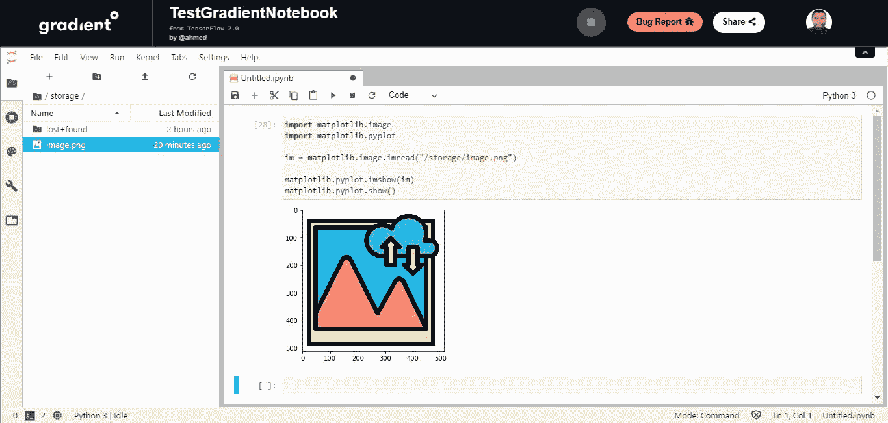

与读取文件类似，您也可以通过指定路径来写入文件。接下来的代码块将我们刚刚读取的图像除以 2，并作为`image.png`写入`/storage`目录。

```py
import matplotlib.image
import matplotlib.pyplot

im = matplotlib.image.imread("/storage/image.png")
im = im / 2

matplotlib.pyplot.imshow(im)
matplotlib.pyplot.show()

matplotlib.pyplot.imsave("/storage/new_image.png", im)
```

下图显示图像成功保存到`/storage`目录。

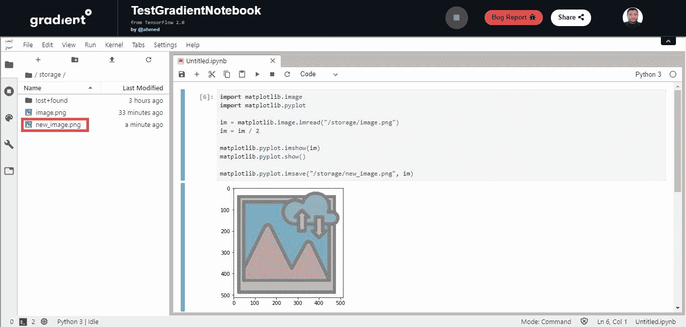

下一节讨论将笔记本导出为文档。

## **导出笔记本**

完成工作后，您可能会对保存笔记本的静态版本感兴趣。你可以用渐变笔记本轻松做到这一点。按照下图，进入**文件**菜单，点击**导出笔记本为**。您可以找到不同的选项来导出笔记本，包括 Markdown、PDF、LaTex 和 HTML。

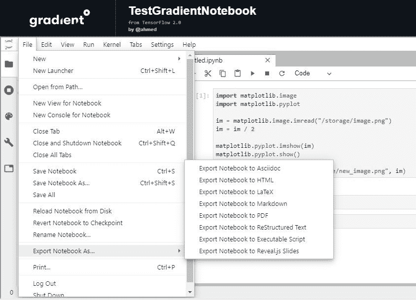

## **结论**

这篇文章讨论了如何开始使用 Paperspace 的免费[渐变社区笔记本](https://gradient.paperspace.com/free-gpu)。我们从引入[梯度](https://gradient.paperspace.com)开始，这是 Paperspace 的平台，用于构建轻松的机器学习和深度学习产品和管道。它提供了与各种工具打包在一起的不同实例和容器，这样用户就不会陷入依赖关系或工具问题的困扰。

2019 年 10 月，Paperspace 增加了免费启动和共享 Jupyter 笔记本的免费 GPU 和 CPU 实例。这篇文章讲述了创建、运行和共享免费笔记本的步骤。还讨论了一些附加功能，如共享文件和文件夹，上传和下载文件，以及向`/storage`目录读写文件。

在这篇文章结束时，你可以很容易地开始使用运行在 GPU 或 CPU 上的免费 Jupyter 笔记本。