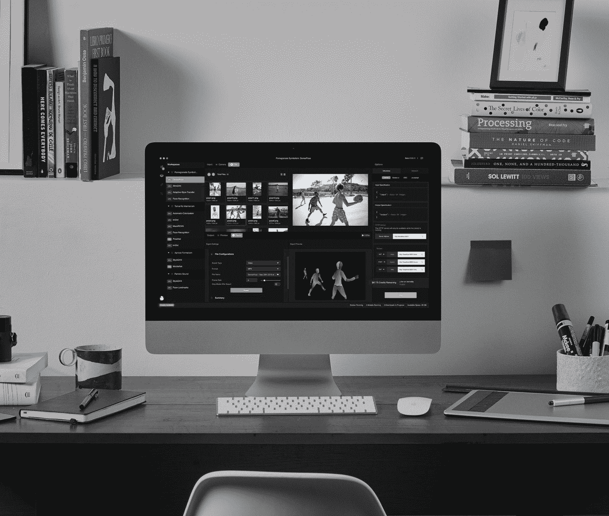

# 我们塑造我们的工具，然后我们的工具塑造我们:采访 RunwayML 创始人克里斯托·巴尔·瓦伦苏拉

> 原文：<https://blog.paperspace.com/we-shape-our-tools-and-thereafter-our-tools-shape-us-interview-with-runwayml-founder-cristobal-valenzuela/>

毫无疑问，机器学习应用正在整个媒体行业激增。

在这个博客中，我们已经涵盖了广泛的艺术为重点的 ML 用例。我们最近采访了[视觉艺术家](https://blog.paperspace.com/interview-with-daniel-canogar-loom/)、[游戏设计师](https://blog.paperspace.com/building-virtual-worlds-with-cyberlayervr/)和[唱诗班](https://blog.paperspace.com/getting-real-with-deepfake-artist-jesse-richards/)，我们还编写了一些主题指南，如[pose estimation with pose net](https://blog.paperspace.com/posenet-keypoint-detection-android-app/)、[semantic image synthesis with GauGAN](https://blog.paperspace.com/nvidia-gaugan-introduction/)和[face app-style image filters with CycleGAN](https://blog.paperspace.com/use-cyclegan-age-conversion-keras-python/)。

简而言之，我们认为非常清楚的是，机器智能将改变——并且已经在改变——电影和媒体行业，从 VFX 到 ar 和 VR，到动画，资产创建，视频分析，排版设计，文本生成，以及这之间的一切。

这就是克里斯托·巴尔·巴伦苏埃拉的用武之地。克里斯是 NYU·蒂施著名的 ITP(交互式电信项目)的前研究员，也是前 Paperspace [ATG 研究员](https://gradient.paperspace.com/atg)，他正在建立一家名为 [RunwayML](https://runwayml.com/) 的令人兴奋的新公司，将最先进的机器学习技术和架构带给媒体创意人员。

随着我们变得痴迷于艺术和技术的交叉，我们很兴奋地看到 Runway 一次又一次地出现在关于如何为创意人员配备强大的人工智能辅助媒体创作工具的讨论中。

我们很高兴能与 Cris 交谈，了解他对媒体中机器智能的未来的看法，以及如何建立一套新的工具，让每一个创意者都能做出前所未有的事情。

***Paperspace:*** 先来后到 RunwayML 这个名字的背后是什么？它似乎让人联想到时尚、飞机和生产线——这些东西是否抓住了你想做的事情的精神？

***瓦伦苏拉:*** 我在 NYU 读书的时候就开始从事 t 台工作了。在研究阶段的早期，我希望有一个简短的名字，可以用来与我的顾问讨论项目，我不想要太长或复杂的东西。该项目的最初想法是创建一个平台，使艺术家可以访问机器学习模型。所以我开始围绕这个问题集思广益，然后我意识到“模特的平台”已经有了一个名字:跑道。

***Paperspace:*** 啊！是的，当然。那么是什么让你对机器学习感兴趣呢？你能告诉我们你在 NYU 的研究吗，那是如何导致或加速你对人工智能的兴趣的？

***Valenzuela:*** 我在智利工作的时候偶然发现了[基因科岗](https://genekogan.com/)围绕神经风格转移的工作。当时，我不知道它是如何制作的，但我对计算创造力的想法以及深层图像技术可能对艺术家产生的影响和意义非常着迷。我掉进了一个兔子洞，研究神经网络，直到我对这个主题如此着迷，最终我辞掉了工作，离开了智利，进入 NYU 的 ITP 全职学习计算创造力。

***Paperspace:*** 您是否曾有过这样的想法:“好吧，我需要构建 Runway，因为这个工具堆栈还不存在，我想要它？”或者，这是对传统繁重的 ML 任务变得容易 100 倍的潜力的不同认识？

***瓦伦苏拉:*** 围绕一个创意工作需要大量的实验。任何创造性的努力都需要一个搜索和实验阶段，一种快速原型的精神，以及快速尝试新想法的意愿。我想围绕神经网络创造艺术和探索想法，但每次我试图构建原型时，我都会遇到与我的目标无关的技术难题。

想象一下，如果每次画家想要绘制新的画布，她都必须手动创建颜料和颜料管——这就是我每次想使用机器学习模型的感觉。在尝试画任何东西之前，我用手磨了几个星期的颜料。我非常沮丧，最终我决定构建一些东西，使在一个创造性的环境中使用 ML 的整个过程更加容易。

***paper space:****你在 [*ml5js*](https://ml5js.org/) 上的工作是如何翻译到 Runway 上的？这两个项目有相似的使命吗——让视觉创意者可以使用先进的机器学习技术？*

*当我在 NYU 的时候，我有一个惊人的机会与[丹·希夫曼](https://shiffman.net/)密切合作。与丹和 ITP 大学的一群学生一起，我们有了一个想法，即创造一种方法，使机器学习技术在网络上更容易访问和友好——特别是对于创意编码社区。*

*我们从 [p5js](https://p5js.org/) 和[处理基金会](https://processingfoundation.org/)在视觉艺术中促进软件素养的使命中受到了极大的鼓舞。Runway 和 ml5js 在可访问性、包容性和社区方面有着共同的价值观和原则。这两个项目几乎同时开始，并且对如何发展艺术技术有着相似的愿景。*

****paper space:****你见过的创作者追求使用你的软件的最酷的用例是什么？**

*****瓦伦苏拉:*** 我们正在建造跑道，让其他人创造和表达自己。我喜欢看到来自不同背景的创作者使用 Runway 来创作艺术、视觉、视频——或者只是为了学习或实验。**

**随着时间的推移，我们看到了如此多令人惊叹的项目，我们开始在一个专门的网站上对它们进行分组:[runwayml.com/madewith](https://runwayml.com/madewith/)。我认为这些只是社区中最好的项目中的一些*。***

***我们还不断采访创作者，展示他们的一些作品。比如《游艇》的 Claire Evans、Jona Bechtolt 和 Rob Kieswetter 最近为他们的格莱美提名专辑所做的。***

***[https://www.youtube.com/embed/Exgd6AW-NKg?start=1&feature=oembed](https://www.youtube.com/embed/Exgd6AW-NKg?start=1&feature=oembed)***

******Paperspace:*** 你或者你的一个团队成员呢？你的团队有没有创造出真正激励你的东西？***

*****瓦伦苏拉:*** [丹·希夫曼](https://shiffman.net/)用 Runway 创造了一长串惊艳的项目。最近，他一直在玩文本生成功能，并创建了迷人的 Twitter 机器人。这个想法是，你可以基于 OpenAI 的 GPT-2 模型训练你自己的生成文本模型。一旦模型在 Runway 中完成训练，您就可以将它部署为一个托管的 URL，它可以以各种不同的方式使用。**

**丹一直在根据他收集的不同数据集创建 Discord、Slack 和 Twitter 机器人。查看 YouTube 频道的[编码训练，了解更多信息并创建自己的编码训练。如果你想用 Runway 创建你自己的 GPT-2 机器人，看看这个教程](https://www.youtube.com/user/shiffman)[。](https://medium.com/runwayml/creating-a-custom-gpt-2-slack-bot-with-runwaymls-hosted-models-c639fe135379)**

*****paper space:***runway ml 有一个很大的元素与成为技术人员的创造性社区的一部分有关。你如何培养这种合作的环境？建立这个社区的早期回报是什么？你可以在 Runway 周围创建什么样的社区？**

*****valen zuela:****我认为一个好的社区是由成员之间不断讨论共同的理想、愿景和激情组成的。t 台社区，或者说创新技术社区，也没什么不同。***

***我们密切倾听社区成员的心声，能够与他们一起创造至关重要。这就是我们帮助并与来自世界各地的数百名学生、艺术家和技术专家合作的原因。***

***Runway 还被广泛用于各种机构的教学，从麻省理工学院的建筑项目到秘鲁自行组织的独立工作室。但最重要的是，我们希望营造一种促进创造力、友善、平等和尊重的环境。***

******Paperspace:*** 你的应用程序使用收费吗？这是一款令人惊叹的产品，我们不断惊讶于我们可以如此简单快速地完成这么多工作。就像魔法一样！***

*****Valenzuela:*** 当建立一个允许创作者使用强大的机器学习模型和技术的大型平台时，会有大量的技术复杂性。我们的目标是让每个人都能尽可能地使用这个平台。Runway 可以在网上免费使用，也可以免费下载。用户可以在本地运行模型，也可以付费在云中远程使用模型。还有一个订阅计划，以获得该平台中更高级的功能。**

*****paper space****:*当我们设计软件时，我们经常会想到这句名言“我们塑造我们的工具，然后我们的工具塑造我们。”你认为 Runway 是一个具有这种创造世界潜力的工具吗？或者你认为《天桥》是一个有创造力的合著者？对于像 Runway 这样的平台来说，相对于其用户产生的输出，它的正确角色是什么？**

*****Valenzuela* :** 在构建界面时，一个常见的比喻是将物理世界的对象转化为软件概念，以帮助用户更轻松地与应用程序交互。例如，[的桌面隐喻](https://en.wikipedia.org/wiki/Desktop_metaphor)暗示了一张放有文件和文件夹的实体桌子。**

**类似的事情也发生在媒体创作和创意软件的界面上。在传统的图像编辑软件中，我们有铅笔、橡皮擦、尺子和剪刀的概念。但问题是我们依赖这些隐喻太久了——它们影响了我们对工具局限性的思考。**

**我们正面临着几十年前的媒体范式和隐喻，围绕着如何创建内容和围绕它们构建复杂的数字工具。我认为现在是我们改变这些原则的时候了，因为它们限制了我们的创造性表达，并采用了一套新的隐喻来利用现代计算机图形技术。Runway 是构建这些新工具和原则的平台。**

*****Paperspace:*** 你喜欢生成艺术或合成媒体这两个术语吗？你认为这两者中的任何一个都可以很好地描述人工智能辅助媒体创作领域正在发生的事情吗？你认为我们会开始看到艺术家通过作品获得财富和名声吗？因为没有更好的词，这些作品就是合成的。**

*****瓦伦苏拉* :** 我相信艺术家会尝试使用任何与他们的实践相关的媒介。r·卢克·杜波依斯说得很好:“艺术家有责任提出技术意味着什么以及它如何反映我们的文化的问题。”**

**生成艺术的历史并不新鲜。在最近的人工智能热潮之外，在艺术制作过程中引入自主系统的想法已经存在了几十年。不同的是，现在我们进入了一个合成时代。**

**使用大量数据和深度技术来操纵和编辑媒体的想法不仅会极大地改变艺术，还会以类似于 90 年代 CGI 革命的方式改变一般内容创作的可能性。很快，每个人都将能够创作出专业的好莱坞式的内容。当我们被我们能用它创造的东西所激励时，我们叫它什么并不重要。**

*****Paperspace*** :你认为有哪些创意产业会从 ML 的应用中受益，但它们还没有应用这项技术？**

***在过去的一年里，我们与许多创意人员进行了交流和合作。我认为大多数创意产业都将受益于 ML。例如，我们已经与来自扎哈·哈迪德建筑师的技术团队 [ZHA 代码](http://www.zha-code-education.org/)进行了一些研讨会和实验。我相信建筑师现在正在快速地将 ML 技术融入到他们的工作流程中，我们将在接下来的几年里看到建筑/设计系统的重大变化。***

***我确实认为从 ML 中获益最大的领域之一将是娱乐业。自动化不仅将有助于加快目前需要几周或几个月才能完成的流程(从取景到剪辑的一切都将自动化)——而且合成媒体对下一代电影制作人和创意人员的影响将是巨大的。***

***有了 ML，创建专业级内容的门槛将大大降低。每个拥有电脑的人都可以创作出传统上只有专业的 VFX 工作室才能创作的内容。***

******

******Paperspace:*** 作为[研究员](https://gradient.paperspace.com/atg)，你在 Paperspace 工作的体验如何？那段经历对你创作《天桥》有帮助吗？***

*****valen zuela:***2018 年我有幸与 Paperspace 团队合作，学到了很多东西。有机会与 Paperspace 团队一起工作和协作，让我对如何构建一个优秀的产品、公司和社区有了深刻的认识。你所做的使团队在 ML 模型上合作的事情是很棒的，并且是工程团队所需要的。**

*****paper space:***Runway 的下一步是什么？您最想与您的社区分享的产品、功能、实现或开发是什么？在你的团队的期待下，你最兴奋的成就是什么？**

*****Valenzuela:*** 还有一个几大更新很快就要来了！我们一直在围绕视频和图像模型开发一些激动人心的新功能，这些功能将会改变游戏规则。但最让我兴奋的总是《天桥》的所有精彩作品。我迫不及待地想看看创作者是怎么做的！**

*****paper space*:***还有什么要补充的吗？对于这篇采访的读者来说，在《天桥》上开始创作的最好方法是什么？你对那些第一次探索 ML 如何增强他们作品的创意人员有什么建议吗？***

******:*****我们正在招聘！如果您有兴趣帮助我们想象和构建未来的创造性工具，我们将很高兴收到您的来信。*****

> ****如果你是 Runway 或者机器学习的入门者，查看一些编码训练* [*视频教程*](https://youtube.com/runwayml) *，加入我们的* [*Slack 频道*](http://runwayml.com/joinslack) *与更多创意者联系，或者只是在 Twitter 上 DM 我们:*[*@ runwayml*](https://twitter.com/runwayml)*和*[*@ c _ valenzuelab*](https://twitter.com/c_valenzuelab)***